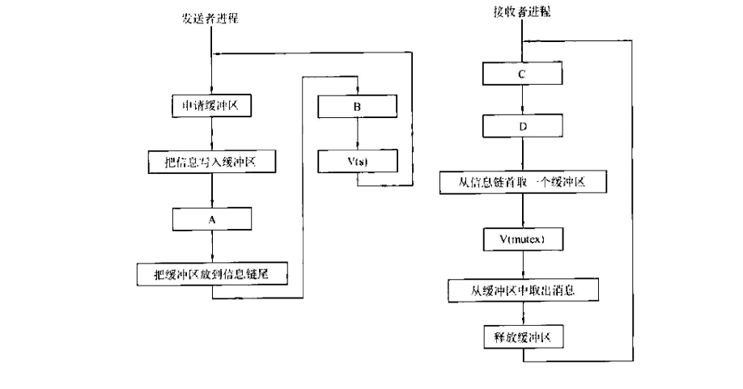

## 2021-2022学年下学期期末试卷（A）（含答案）

### 一、选择题

1. 中断处理和子程序调用都需要压栈以保护现场。中断处理一定会保存而子程序调用不需要保存其内容的是（ ）。

    A. 程序计数器

    B. 程序状态字寄存器

    C. 通用数据寄存器

    D. 通用地址寄存器

    <details>
    <summary>答案：</summary>

    B

    </details>

    ***

2. 列选项中，不可能在用户态发生的事件是（ ）。

    A. 系统调用

    B. 外部中断

    C. 进程切换

    D. 缺页

    <details>
    <summary>答案：</summary>

    C

    </details>

    ***

3. 一次性分配所有资源的方法可以预防死锁的发生，这种方法破坏的是产生死锁的 4 个必要条件中的（ ）。

    A. 互斥条件

    B. 占有并请求

    C. 不剥夺条件

    D. 循环等待

    <details>
    <summary>答案：</summary>

    B

    </details>

    ***

4. （ ）有利于 CPU 繁忙型的作业，而不利于 I/O 繁忙型的作业（进程）。

    A. 时间片轮转调度算法

    B. 先来先服务调度算法

    C. 短作业（进程）优先调度算法

    D. 优先权调度算法

    <details>
    <summary>答案：</summary>

    B

    </details>

    ***

5. 下列选项中，导致创建新进程的操作是（ ）。

    I. 用户登录成功 II. 设备分配 III. 启动程序执行

    A. 仅 I 和 II

    B. 仅 II 和 III

    C. 仅 I 和 III

    D. I，II，III

    <details>
    <summary>答案：</summary>

    C

    </details>

    ***

6. 若 I/O 所花费的时间比 CPU 的处理时间短很多，则缓冲区（ ）。

    A. 最有效

    B. 几乎无效

    C. 均衡

    D. 以上都不是

    <details>
    <summary>答案：</summary>

    B

    </details>

    ***

7. 采用 SPOOLing 技术将磁盘的一部分作为公共缓冲区以代替打印机，用户对打印机的操作实际上是对磁盘的存储操作，用以代替打印机的部分是（ ）。

    A. 独占设备

    B. 共享设备

    C. 虚拟设备

    D. 一般物理设备

    <details>
    <summary>答案：</summary>

    B

    </details>

    ***

8. 设某文件为索引顺序文件，由 5 个逻辑记录组成，每个逻辑记录的大小与磁盘块的大小相等，均为 $512\ \text{B}$，并依次存放在 50，121，75，80，63 号磁盘块上。若要存取文件的第 1569 逻辑字节处的信息，则要访问（ ）号磁盘块。

    A. 3

    B. 75

    C. 80

    D. 63

    <details>
    <summary>答案：</summary>

    C

    </details>

    ***

9. 现有一个容量为 $10\ \text{GB}$ 的磁盘分区，磁盘空间以簇（Cluster）为单位进行分配，簇的大小为 $4\ \text{KB}$，若采用位图法管理该分区的空闲空间，即用位（bit）标识一个簇是否被分配，则存放该位图所需簇的个数为（ ）。

    A. 80

    B. 320

    C. 80K

    D. 320K

    <details>
    <summary>答案：</summary>

    A

    </details>

    ***

10. 假设一个“按需调页”虚拟存储空间，页表由寄存器保存。在存在空闲页帧的条件下，处理一次缺页的时间是 $8\ \text{ms}$。如果没有空闲页面，但待换出页面并未更改，处理一次缺页的时间也是 $8\ \text{ms}$。若待换出页面已被更改，则需要 $20\ \text{ms}$。访问一次内存的时间是 $100\ \text{ns}$。假设 70% 的待换出页面已被更改，请问缺页率不超过（ ）才能保证有效访问时间小于或等于 $200\ \text{ns}$？

    A. $0.6\times 10^{-4}$

    B. $1.2\times 10^{-4}$

    C. $0.6\times 10^{-5}$

    D. $1.2\times 10^{-5}$

    <details>
    <summary>答案：</summary>

    C。题目并没有明确当缺页中断时内存中是否有空闲页帧，所以假设内存总是忙的。设缺页率为 $P$。

    </details>

    ***

11. 设有 8 页的逻辑空间，每页有 $1024\ \text{B}$，它们被映射到 32 块的物理存储区中。那么，逻辑地址的有效位是（ ）位，物理地址至少是（ ）位。

    A. 10，11

    B. 12，14

    C. 13，15

    D. 14，16

    <details>
    <summary>答案：</summary>

    C

    </details>

    ***

12. 下列存储管理方式中，会产生内部碎片的是（ ）。

    I. 请求分段存储管理

    II. 请求分页存储管理

    III. 段页式分区管理

    IV. 固定式分区管理

    A. I、II、III

    B. III，IV

    C. 只有 II

    D. II、III、IV

    <details>
    <summary>答案：</summary>

    D

    </details>

***

### 二、填空题

13. MS-DOS 启动的方式有两种：$\underline{\qquad}$ 和 $\underline{\qquad}$。

    <details>
    <summary>答案：</summary>

    冷启动、热启动

    </details>

    ***

14. 为了防止各种系统故障破坏文件，文件系统可以采用 $\underline{\qquad}$ 和 $\underline{\qquad}$ 两种方法在保护文件。

    <details>
    <summary>答案：</summary>

    建立副本、定时转储

    </details>

    ***

15. UNIX 系统规定用户使用文件的权限是读、$\underline{\qquad}$ 和 $\underline{\qquad}$ 三种。

    <details>
    <summary>答案：</summary>

    写、执行

    </details>

    ***

16. 操作系统中，进程调度通常有先来先服务、$\underline{\qquad}$、$\underline{\qquad}$ 和分级调度算法等调度算法。

    <details>
    <summary>答案：</summary>

    优先数调度算法、时间片轮转调度算法

    </details>

    ***

17. 不可中断的过程称为 $\underline{\qquad}$。

    <details>
    <summary>答案：</summary>

    原语

    </details>

    ***

18. 网络操作系统把计算机网络中的各台计算机有机地联结起来，实现各台计算机之间的 $\underline{\qquad}$ 及网络中各种资源的 $\underline{\qquad}$。

    <details>
    <summary>答案：</summary>

    通信、共享

    </details>

    ***

19. 能使计算机系统接收到 $\underline{\qquad}$ 后及时进行处理，并在严格的规定时间内处理结束，再给出 $\underline{\qquad}$ 的操作系统称为“实时操作系统”。

    <details>
    <summary>答案：</summary>

    外部信号、反馈信号

    </details>

    ***

20. 在批处理兼分时的系统中，往往由分时系统控制的作业称为 $\underline{\qquad}$ 前台作业，而由批处理系统控制的作业称为 $\underline{\qquad}$。

    <details>
    <summary>答案：</summary>

    前台作业、后台作业

    </details>

***

### 三、判断题

21. 大多数虚拟系统采用 OPT。（ ）

    <details>
    <summary>答案：</summary>

    错

    </details>

    ***

22. 在页式虚拟存储系统中，页面长度是根据程序长度动态地分配的。（ ）

    <details>
    <summary>答案：</summary>

    错

    </details>

    ***

23. 由于 P、V 操作描述同步、互斥等问题的能力不足，所以有必要引入其它的通讯原语或机制，如 send，receive 或 Monitor 等。（ ）

    <details>
    <summary>答案：</summary>

    错

    </details>

    ***

24. 设置中断屏蔽指令可以在目态下执行。（ ）

    <details>
    <summary>答案：</summary>

    错

    </details>

    ***

25. 文件系统的主要目的是存储系统文档。（ ）

    <details>
    <summary>答案：</summary>

    错

    </details>

    ***

26. 参与死锁的所有进程都占有资源。（ ）

    <details>
    <summary>答案：</summary>

    错

    </details>

    ***

27. 进程在运行中，可以自行修改自己的进程控制块。（ ）

    <details>
    <summary>答案：</summary>

    错

    </details>

    ***

28. 清内存指令只能在管态下执行。（ ）

    <details>
    <summary>答案：</summary>

    对

    </details>

    ***

29. 如果输入输出所用的时间比处理时间短得多，则缓冲区最有效。（ ）

    <details>
    <summary>答案：</summary>

    错

    </details>

    ***

30. 由于现代操作系统提供了程序共享的功能，所以要求被共享的程序必须是可再入程序。（ ）

    <details>
    <summary>答案：</summary>

    对

    </details>

    ***

31. 进程控制块中的所有信息必须常驻内存。（ ）

    <details>
    <summary>答案：</summary>

    错

    </details>

    ***

32. 一旦出现死锁，所有进程都不能运行。（ ）

    <details>
    <summary>答案：</summary>

    错

    </details>

***

### 四、名词解释题

33. 并发：

    <details>
    <summary>答案：</summary>

    是指两个或多个活动在同一给定的时间间隔中进行。

    </details>

    ***

34. 存储设备：

    <details>
    <summary>答案：</summary>

    它们是指计算机用来存储信息的设备，如磁盘（硬盘和软盘）、磁带等。

    </details>

    ***

35. 通道：

    <details>
    <summary>答案：</summary>

    是独立于 CPU 的、专门负责数据输入输出的处理单元。

    </details>

    ***

36. 可重定位地址：

    <details>
    <summary>答案：</summary>

    当含有它的程序被重定位时，将随之被调整的一种地址。

    </details>

    ***

37. 外部碎片：

    <details>
    <summary>答案：</summary>

    在所有分区之外新产生的碎片称作外部碎片，如在动态分区法实施过程中出现的越来越多的小空闲块，由于它们太小，无法装入一个小进程，因而被浪费掉。

    </details>

    ***

38. 交换调度：

    <details>
    <summary>答案：</summary>

    是基于系统确定的某个策略，将主存中处于等待状态或就绪状态的某个或某些进程交换到外存交换区中，以便将外存交换区上具备运行条件的进程换入主存，准备执行。引入交换调度的目的是为了解决主存紧张和提高主存的利用效率。

    </details>

***

### 五、简答题

39. 虚拟存储器的基本特征是什么？虚拟存储器的容量主要受到哪两方面的限制？

    <details>
    <summary>答案：</summary>

    虚拟存储器的基本特征是：① 虚拟扩充，即不是物理上而是逻辑上扩充了内存容量；② 部分装入，即每个作业不是全部一次性地装入内存，而是只装入一部分；③ 离散分配，即不必占用连续的内存空间，而是“见缝插针”；④ 多次对换，即所需的全部程序和数据要分成多次调入内存。虚拟存储器的容量主要受到指令中表示地址的字长和外存的容量的限制。

    </details>

    ***

40. 一个具有分时兼批处理功能的操作系统应怎样调度和管理作业？

    <details>
    <summary>答案：</summary>

    1）优先接纳终端作业，仅当终端作业数小于系统可以允许同时工作的作业数时，可以调度批处理作业；

    2）允许终端作业和批处理作业混合同时执行；

    3）把终端作业的就绪进程排成一个就绪队列，把批处理作业的就绪进程排入另外的就绪队列中；

    4）有终端作业进程就绪时，优先让其按“时间片轮转”法先运行。没有终端作业时再按确定算法选批处理作业就绪进程运行。

    </details>

    ***

41. 什么是快表？它在地址转换中起什么作用？

    <details>
    <summary>答案：</summary>

    快表是一个高速、具有并行查询能力的联想存储器，用于存放正运行的进程的当前页号和块号，或者段号和段起始地址。加入快表后，在地址转换时，首先在快表中查找，若找到就直接进行地址转换；未找到，则在主存页表继续查找，并把查到的页号和块号放入联想存储器中。快表的命中率很高，有效地提高了地址转换的速度。

    </details>

    ***

42. 处理机调度分为哪三级？各自的主要任务是什么？

    <details>
    <summary>答案：</summary>

    作业调度：从一批后备作业中选择一个或几个作业，给它们分配资源，建立进程，挂入就绪队列。执行完后，回收资源。

    进程调度：从就绪进程队列中根据某个策略选取一个进程，使之占用 CPU。

    交换调度：按照给定的原则和策略，将外存交换区中的进程调入内存，把内存中的非执行进程交换到外存交换区。

    </details>

    ***

43. 为什么说批处理多道系统能极大地提高计算机系统的工作效率？

    <details>
    <summary>答案：</summary>

    ① 多道作业并行工作，减少了处理器的空闲时间；

    ② 作业调度可以合理选择装入主存储器中的作业，充分利用计算机系统的资源；

    ③ 作业执行过程中不再访问低速设备，而直接访问高速的磁盘设备，缩短执行时间；

    ④ 作业成批输入，减少了从操作到作业的交接时间。

    </details>

    ***

44. 从资源管理的角度说明操作系统的主要功能？

    <details>
    <summary>答案：</summary>

    处理器管理，存储管理，文件管理，作业管理和设备管理。

    </details>

***

### 六、综合题

45. 设有一个发送者进程和接收者进程，其流程图如图所示。s 是用于实现进程同步的信号量，mutex 是用于实现进程互斥的信号量。试问流程图中的 A、B、C、D 矩形框中应填写什么？假定缓冲区有无限多个，s 和 mutex 的初值应为多少？

    

    <details>
    <summary>答案：</summary>

    A、B、C、D 矩形框中分别应该填写 P(mutex)、V(mutex)，P(s)，P(mutex)。s 是一资源信号量，用来表示信息链中信息的个数，故其初值应设置为 0；mutex 是用来实现对信息链互斥访问的互斥信号量，故其初值应设置为 1。

    </details>

    ***

46. 有一个烟草供应商和 3 个抽烟者。抽烟者若要抽烟，必须具有烟叶、烟纸和火柴。3 个抽烟者中，一个有烟叶、一个有烟纸、一个有火柴。烟草供应商会源源不断地分别供应烟叶、烟纸和火柴，并将它们放在桌上。若他放的是烟纸和火柴，则有烟叶的抽烟者会拾起烟纸和火柴制作香烟，然后抽烟；其他类推。试用信号量同步烟草供应商和 3 个抽烟者。

    <details>
    <summary>答案：</summary>

    ```text
    Semaphore smoker[3]=（0，0，0）；
    Semaphore material[3]=（0，0，0）；
    Semaphore agent=1；
    Int turn=0；

    Agent()
    {
        While（true）
        {
            P（agent）；
            V(smoker[turn]);
            V(material[(turn+1)%3]);
            V(material[(turn+2)%3]);
            turn=(turn+1)%3;
        }
    }

    Smoker i()
    {
        While（true）
        {
            P(smoker[i]);
            P(material[(i+1)%3]);
            P(material[(i+2)%3]);
            V(agent);
            Smoke;
        }
    }
    ```

    </details>

    ***

47. 假设一台计算机有 $32\ \text{MB}$ 内存，操作系统占用 $2\ \text{MB}$，每个用户进程占用 $10\ \text{MB}$。用户进程等待 I/O 的时间为 80%，问 CPU 的利用率为多少？若再增加 $32\ \text{MB}$ 内存，则 CPU 的利用率又为多少？

    <details>
    <summary>答案：</summary>

    只有当所有进程都在等待 I/O 时，CPU 才会空闲下来。因此需要算出所有进程都在等待 I/O 这种情况发生的概率。本题给出的条件为“用户进程等待 I/O 的时间为 80%”，也就是说进程等待 I/O 的概率为 80%，那么 $n$ 个进程都同时等待 I/O 的概率就为 $(80\%)^n$，则 CPU 的利用率 $u$ 可表示为：

    $u=1-(80\%)^n=1-(0.8)^n$

    在内存为 $32\ \text{MB}$ 时，可容纳 $(32-2)/10=3$ 个用户进程，CPU 利用率为：

    $u=1-(0.8)^3=48.8\%$

    在内存再增加 $32\ \text{MB}$ 时，可容纳 $(32+32-2)/10=6$ 个用户进程，CPU 利用率为：

    $u=1-(0.8)^6=73.8\%$

    </details>
