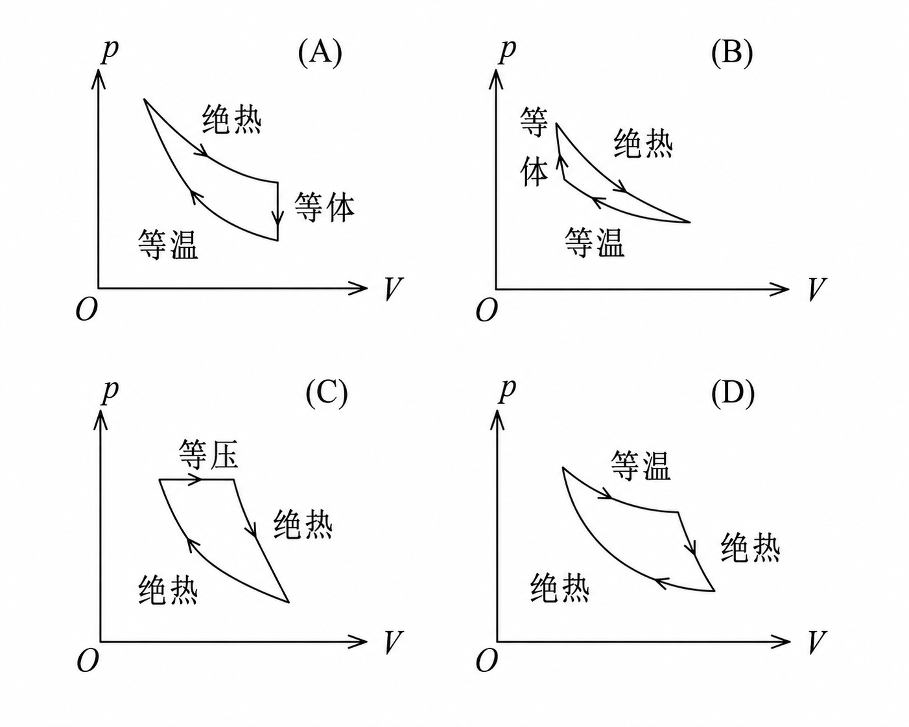
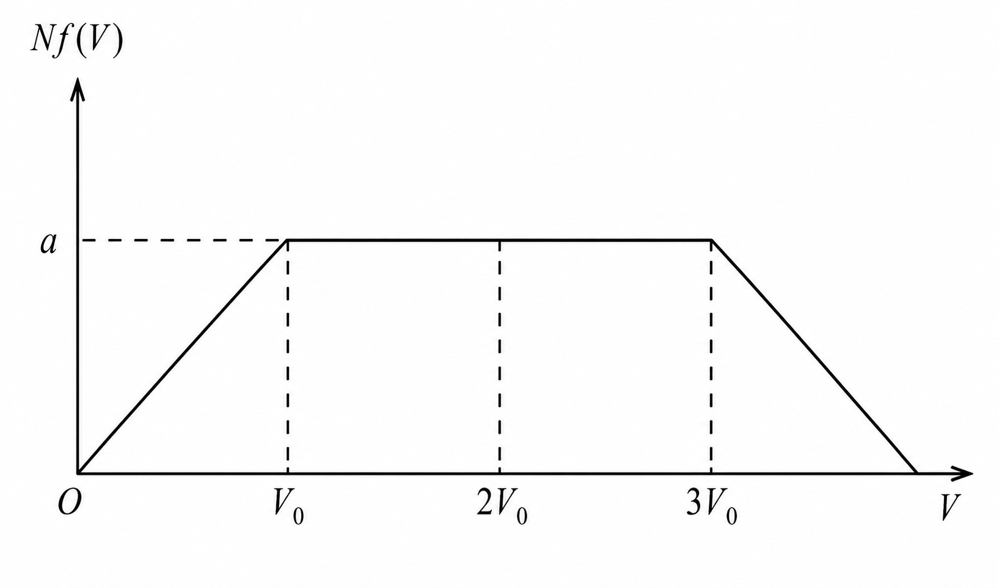
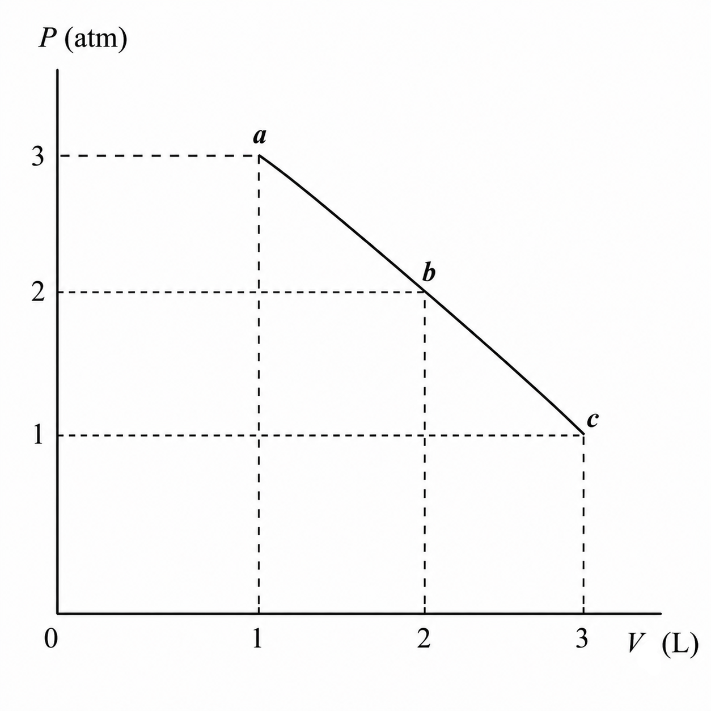
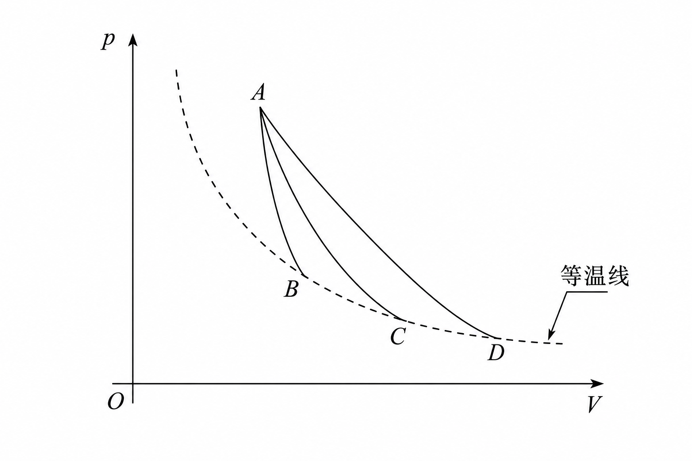
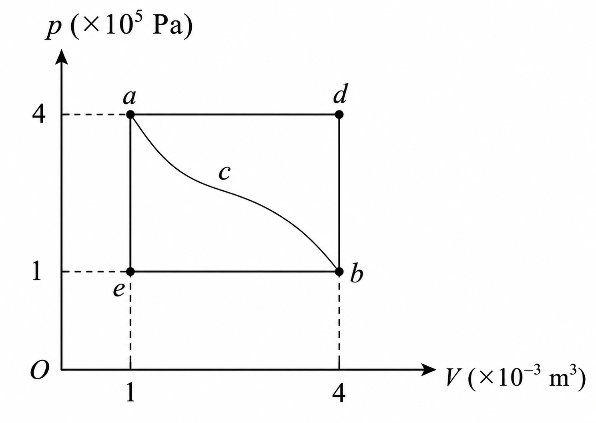
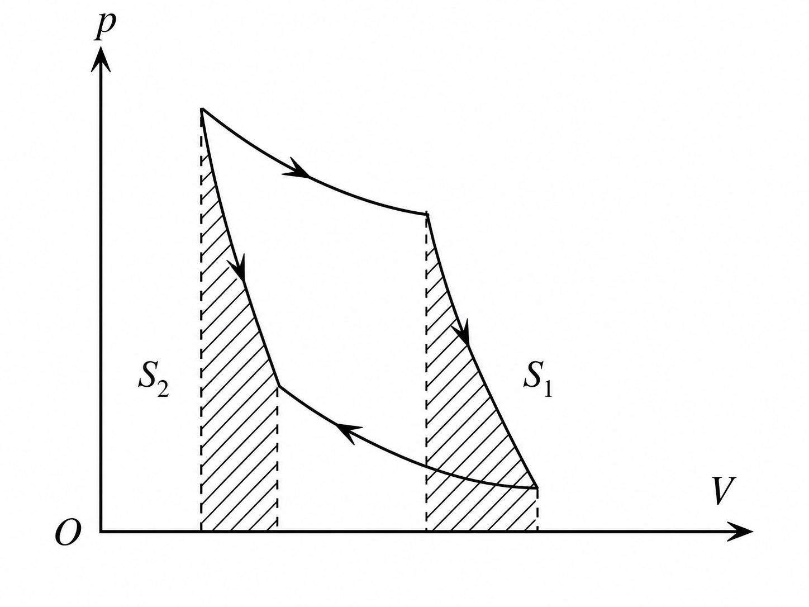
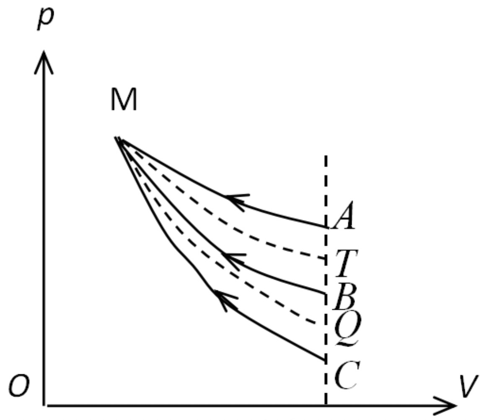
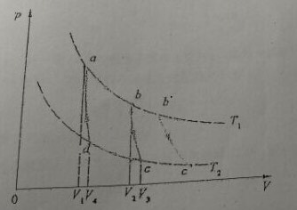

## 2007-2008学年下学期期末试卷（A）

### 说明

- 原卷标题：华东师范大学期末试卷（A）2007 - 2008 学年第二学期
- 卷子没有标注具体科目。由于卷子为老资历资料，并且来源于本人（软件工程）的学长，猜测卷子来源于拆分之前的计软学院，因此暂时判断系《大学物理B》的试卷。

### 一、选择题（每题 3 分，共 21 分）

1. 对于容器内的气体，如果气体内各处压强相等，或气体内各处温度相同，则这两种情况（ ）。

    A. 一定都是平衡态

    B. 不一定都是平衡态

    C. 前者一定是平衡态，后者一定不是平衡态

    D. 后者一定是平衡态，前者一定不是平衡态

    ***

2. 下列各式中哪一式表示气体分子的平均平动动能？（式中 $M$ 为气体的质量，$m$ 为气体分子质量，$N$ 为气体分子总数目，$n$ 为气体分子数密度，$N_A$ 为阿伏伽德罗常量）（ ）。

    A. $\dfrac{3m}{2M}pV$

    B. $\dfrac{3M}{2M_{\mathrm{mol}}}pV$

    C. $\dfrac{3}{2}npV$

    D. $\dfrac{3M}{2M_{\mathrm{mol}}}N_ApV$

    ***

3. 对于室温下的双原子分子理想气体，在等压膨胀的情况下，系统对外所作的功与从外界吸收的热量之比 $W/Q$ 等于（ ）。

    A. $2/3$

    B. $1/2$

    C. $2/5$

    D. $2/7$

    ***

4. 所列四图分别表示理想气体的四个没想的循环过程，请选出其中一个在物理上可能实现的循环过程的图的标号。（ ）

    

    ***

5. 设高温热源的热力学温度是低温热源的热力学温度的 $n$ 倍，则理想气体在一次卡诺循环中，传给低温热源的热量是从高温热源吸取热量的（ ）。

    A. $n$ 倍

    B. $n-1$ 倍

    C. $\dfrac{n+1}{n}$ 倍

    D. $\dfrac1n$ 倍

    ***

6. 关于可逆过程和不可逆过程有以下几种说法：

    （1）可逆过程一定是平衡过程；

    （2）平衡过程一定是可逆过程；

    （3）不可逆过程发生后一定找不到另一过程使系统和外界同时复原；

    （4）非平衡过程一定是不可逆过程。

    以上说法，正确的是（ ）。

    A. （1）、（2）、（3）

    B. （2）、（3）、（4）

    C. （1）、（3）、（4）

    D. （1）、（2）、（3）、（4）

    ***

7. K 系与 K′ 系是坐标轴相互平行的两个惯性系，K′ 系相对于 K 系沿 Ox 轴正方向匀速运动。一根刚性尺静止在 K′ 系中，与 O′x′ 轴成 $30^\circ$ 角。今在 K 系中观测得该尺与 Ox 轴成 $45^\circ$ 角，则 K′ 系相对于 K 系的速度是（ ）。

    A. $(2/3)c$

    B. $(1/3)c$

    C. $(2/3)^{1/2}c$

    D. $-(1/3)^{1/2}c$

***

### 二、填空题（每题 3 分，共 24 分）

8. 某理想气体在温度为 $27\ ^\circ\mathrm C$ 和压强为 $1.0\times10^{-2}\ \mathrm{atm}$ 情况下，密度为 $11.3\ \mathrm{g/m^3}$，则这气体的摩尔质量 $M_{\mathrm{mol}}=\underline{\qquad}$。（普适气体常量 $R=8.31\ \mathrm{J\cdot mol^{-1}\cdot K^{-1}}$）

    ***

9. 在一个以匀速度 $u$ 运动的容器中，盛有分子质量为 $m$ 的某种单原子理想气体。若该容器突然停止运动，则气体状态达到平衡后，其温度的增量 $\Delta T=\underline{\qquad}$。

    ***

10. 氮气在标准状态下的分子平均碰撞频率为 $5.42\times10^8\ \mathrm{s^{-1}}$，分子平均自由程为 $6\times10^{-6}\ \mathrm{cm}$。若温度不变，气压降为 $0.1\ \mathrm{atm}$，则分子的平均碰撞频率变为 $\underline{\qquad}$，平均自由程变为 $\underline{\qquad}$。

    ***

11. 质量为 $2.5\ \mathrm g$ 的氢气和氦气组成混合气体，氢气和氦气均视为刚性分子的理想气体。若保持气体体积不变，测得此混合气体的温度每升高 $1\ \mathrm K$，需要吸收的热量数值等于 $R$ 数值的 $2.25$ 倍，由此可知，该混合气体中有氢气 $\underline{\qquad}\ \mathrm g$，氦气 $\underline{\qquad}\ \mathrm g$；若保持气体内的压强不变，要使该混合气体的温度升高 $1\ \mathrm K$，则该气体将吸收的热量为 $\underline{\qquad}$。（氢气的 $M_{\mathrm{mol}}=2\times10^{-3}\ \mathrm{kg}$，氦气的 $M_{\mathrm{mol}}=4\times10^{-3}\ \mathrm{kg}$）

    ***

12. 设电子静止质量为 $m_e$，将一个电子从静止加速到速度为 $0.6c$（$c$ 为真空中光速），需作功 $\underline{\qquad}$。

***

### 三、计算题（每题 10 分，共 40 分）

13. $N$ 个假想的气体分子，其速率分布如图所示，求：（1）由 $N$ 和 $V_0$ 求 $a$；（2）求速率在 $1.5V_0$ 和 $2V_0$ 之间的分子数；（3）求分子的平均速率。

    

    ***

14. 一定量的理想气体，由状态 $a$ 经 $b$ 到达 $c$（如图），在 $a\to b\to c$ 过程中：（1）气体对外作的功；（2）气体内能的增量；（3）气体吸收的热量。（$1\ \mathrm{atm}=1.013\times10^5\ \mathrm{Pa}$）

    

    ***

15. 一艘宇宙飞船的船身固有长度为 $L_0=90\ \mathrm m$，相对于地面以 $u=0.8c$（$c$ 为真空中光速）的速度在地面观测站的上空飞过。

    （1）观测站测得飞船的船身通过观测站的时间间隔是多少？

    （2）宇航员测得船身通过观测站的时间间隔是多少？

    ***

16. 已知 $\mu$ 子的静止能量为 $105.7\ \mathrm{MeV}$，平均寿命为 $2.2\times10^{-6}\ \mathrm s$，试求动能为 $150\ \mathrm{MeV}$ 的 $\mu$ 子的速度是多少？平均寿命是多少？平均能飞多远？

    ***

### 四、改错题（7 分）

17. 关于热力学第二定律，下列说法如有错误请改正：（1）热量不能从低温物体传向高温物体；（2）一切可能全都转变为热量，但热量不能全部转变为功；（3）不可逆过程就是不能向相反方向进行的过程；（4）一切与热现象有关的实际宏观过程都是有方向性的。

    ***

18. 一定量的理想气体，从 $p-V$ 图上同一初态 A 开始，分别经历三种不同的过程过渡到不同的末态，但末态的温度均相同，如图所示。其中 $A\to C$ 是绝热过程，问：

    

    （1）$A\to B$ 过程中气体吸热还是放热，为什么？

    （2）$A\to D$ 过程中气体吸热还是放热，为什么？

***

## 2007-2008学年下学期期末试卷（B）

### 说明

- 原卷标题：华东师范大学期末试卷（B）2007 - 2008 学年第二学期
- 卷子没有标注具体科目。由于卷子为老资历资料，并且来源于本人（软件工程）的学长，猜测卷子来源于拆分之前的计软学院，因此暂时判断系《大学物理B》的试卷。

### 一、选择题（每题 3 分，共 21 分）

1. 一瓶氢气和一瓶氦气密度相同，分子平均平动动能相同，而且它们都处于平衡状态，则它们（ ）。

    A. 温度相同，压强相同

    B. 温度、压强都不相同

    C. 温度相同，但氢气的压强大于氦气的压强

    D. 温度相同，但氢气的压强小于氦气的压强

    ***

2. 一定量的理想气体向真空作绝热自由膨胀，体积由 $V_1$ 增至 $V_2$，在此过程中气体的（ ）。

    A. 内能不变，熵增加

    B. 内能不变，熵减少

    C. 内能不变，熵不变

    D. 内能增加，熵增加

    ***

3. 有下列说法：

    （1）可逆过程一定是平衡过程；

    （2）平衡过程一定是可逆的；

    （3）不可逆过程一定是非平衡过程；

    （4）非平衡过程一定是不可逆的。

    其中，哪些是正确的？

    A. （1）、（4）

    B. （2）、（3）

    C. （1）、（2）、（3）、（4）

    D. （1）、（3）

    ***

4. 一定量的理想气体经历 $acb$ 过程时吸热 $500\ \mathrm J$，则经历 $acbda$ 过程时，吸热为（ ）。

    

    A. $-1200\ \mathrm J$

    B. $-700\ \mathrm J$

    C. $-400\ \mathrm J$

    D. $700\ \mathrm J$

    ***

5. 有人设计一台卡诺热机（可逆的），每循环一次可从 $400\ \mathrm K$ 的高温热源吸热 $1800\ \mathrm J$，向 $300\ \mathrm K$ 的低温热源放热 $800\ \mathrm J$，同时对外作功 $1000\ \mathrm J$，这样的设计是（ ）。

    A. 可以的，符合热力学第一定律

    B. 可以的，符合热力学第二定律

    C. 不行的，卡诺循环所作的功不能大于向低温热源放出的热量

    D. 不行的，这个热机的效率超过理论值

    ***

6. 理想气体卡诺循环过程的两条绝热线下的面积大小（图中阴影部分）分别为 $S_1$ 和 $S_2$，则二者的大小关系是（ ）。

    

    A. $S_1>S_2$

    B. $S_1=S_2$

    C. $S_1<S_2$

    D. 无法确定

    ***

7. 宇宙飞船相对于地面以速度 $v$ 作匀速直线飞行，某一时刻飞船头部的宇航员向飞船尾部发出一个光讯号，经过 $\Delta t$（飞船上的钟时间）后，被尾部的接收器收到，则由此可知飞船的固有长度为（ ）（$c$ 表示真空中光速）。

    A. $c\cdot\Delta t$

    B. $v\cdot\Delta t$

    C. $\dfrac{c\cdot\Delta t}{\sqrt{1-(v/c)^2}}$

    D. $c\cdot\Delta t\sqrt{1-(v/c)^2}$

***

### 二、填空题（每空 3 分，共 24 分）

8. 一定量理想气体，从同一状态开始使其体积由 $V_1$ 膨胀到 $2V_1$，分别经历以下三种过程：（1）等压过程；（2）等温过程；（3）绝热过程。其中：$\underline{\qquad}$ 过程气体对外作功最多；$\underline{\qquad}$ 过程气体吸收的热量最多。

    ***

9. 右图为一理想气体几种状态变化过程的 $p-V$ 图，其中 $MT$ 为等温线，$MQ$ 为绝热线。在 $AM$、$BM$、$CM$ 三种准静态过程中：

    

    （1）温度升高的是 $\underline{\qquad}$ 过程；

    （2）气体吸热的是 $\underline{\qquad}$ 过程。

    ***

10. 所谓第二类永动机是指 $\underline{\qquad}$，它不可能制成是因为违背了 $\underline{\qquad}$。

    ***

11. 一门宽为 $a$。今有一固有长度为 $l_0$（$l_0>a$）的水平细杆，在门外贴近门的平面内沿其长度方向匀速运动。若站在门外的观察者认为此杆的两端可同时被拉进此门，则该杆相对于门的运动速率 $u$ 至少为 $\underline{\qquad}$。

    ***

12. 当粒子的动能等于它的静止能量时，它的运动速度为 $\underline{\qquad}$。

***

### 三、计算题（每题 9 分，共 45 分）

13. 有 $2\times10^{-3}\ \mathrm{m^3}$ 刚性双原子分子理想气体，其内能为 $6.75\times10^2\ \mathrm J$。

    （1）试求气体的压强；

    （2）设分子总数为 $5.4\times10^{22}$ 个，求分子的平均平动动能及气体的温度。

    （玻尔兹曼常量 $k=1.38\times10^{-23}\ \mathrm{J\cdot K^{-1}}$）

    ***

14. 设以氢气（视为刚性分子理想气体）为工作物质进行卡诺循环，在绝热膨胀过程中气体的……

    :::tip
    原题后半部分缺失。
    :::

    ***

15. 在 O 参考系中，有一个静止的正方形，其面积为 $100\ \mathrm{cm^2}$。观察者 O′ 以 $0.8c$ 的速度沿正方形的对角线运动，求 O′ 所测得的该图形的面积。

    ***

16. 要使电子的速度从 $v_1=1.2\times10^8\ \mathrm{m/s}$ 增加到 $v_2=2.4\times10^8\ \mathrm{m/s}$，必须对它作多少功？（电子静止质量 $m_e=9.11\times10^{-31}\ \mathrm{kg}$）

    ***

17. $3\ \mathrm{mol}$ 温度为 $T_0=273\ \mathrm K$ 的理想气体，先经等温过程体积膨胀到原来的 5 倍，然后等体加热，使其末态的压强刚好等于初始压强。整个过程传给气体的热量为 $Q=8\times10^3\ \mathrm J$。试画出此过程的 $p-V$ 图，并求这种气体的比热容比 $\gamma=C_p/C_v$ 值。（普适气体常量 $R=8.31\ \mathrm{J\cdot mol^{-1}\cdot K^{-1}}$）

***

### 四、问答题（10 分）

18. 如图所示，一个卡诺机工作时，如果气体体积膨胀大些，$p-V$ 图中循环过程曲线所包围的面积就大些，因此热机对外做功多些，效率也就提高了。这种说法对吗？为什么？

    

    :::tip
    由于原卷图片不清晰，且 AI 绘图能力有限，此处直接使用原卷截图。
    :::
