## 2008-2009学年上学期期中试卷（A）（含答案）

### 说明

- 原卷标题：华东师范大学期中试卷（A）2008-2009 学年第一学期

### 一、选择题（每题 3 分，共 21 分）

1. 电荷面密度均为 $+\sigma$ 的两块“无限大”均匀带电的平行平板如图放置，其周围空间各点电场强度 $\vec E$ 随位置坐标 $x$ 变化的关系曲线为：（设场强方向向右为正、向左为负）（ ）。

    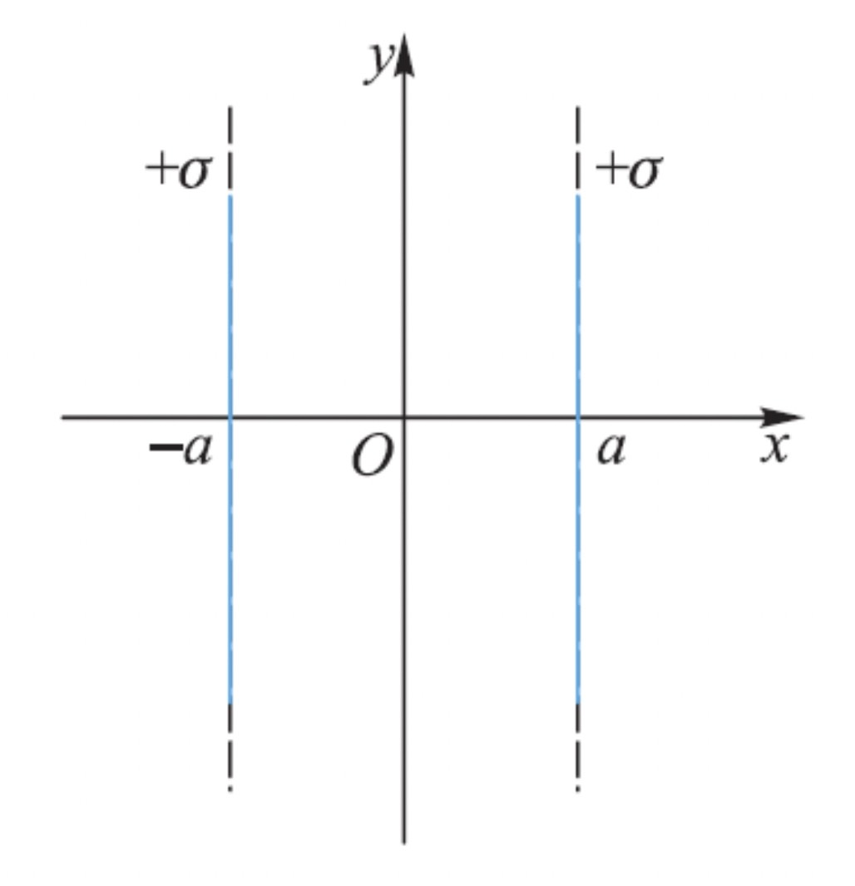

    A. 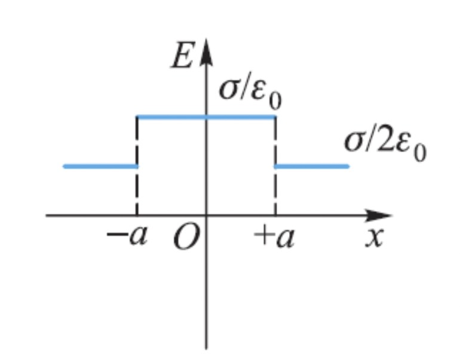

    B. 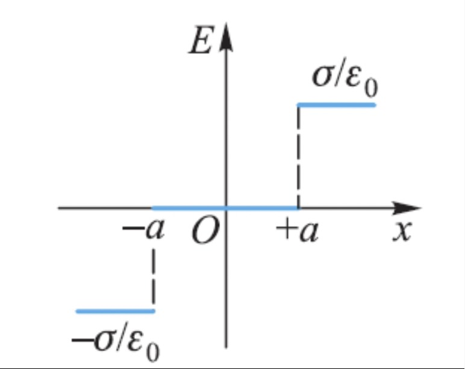

    C. 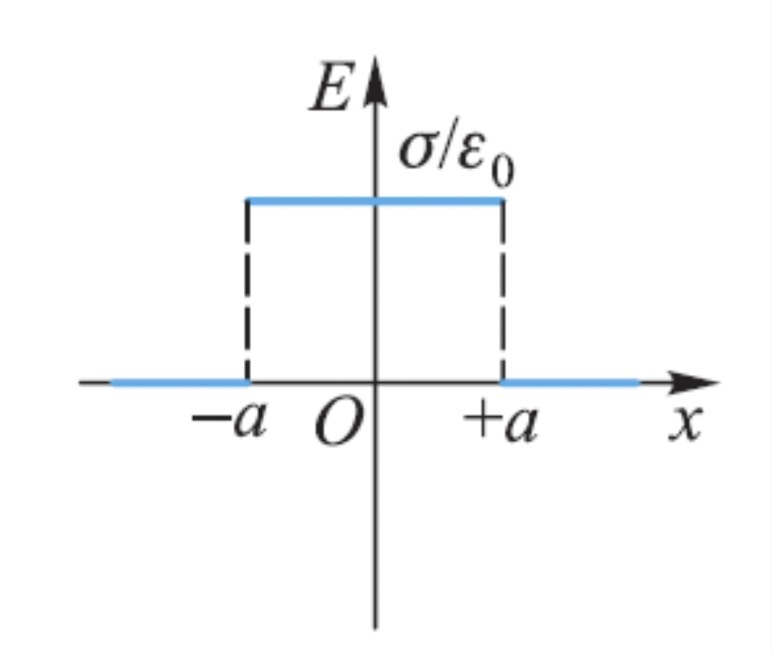

    D. 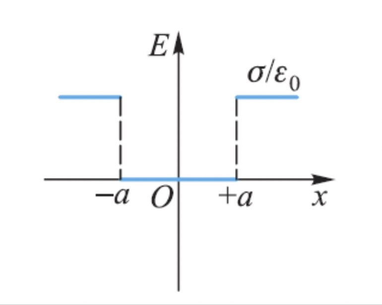

    

    
答案：

    B

    

    ***

2. 图示为一具有球对称性分布的静电场的 $E-r$ 关系曲线。请指出该静电场是由下列哪种带电体产生的（ ）。

    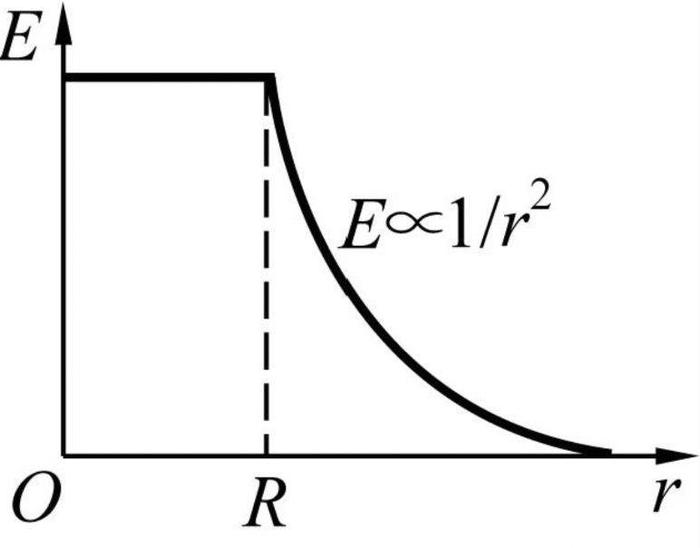

    A. 半径为 $R$ 的均匀带电球面

    B. 半径为 $R$ 的均匀带电球体

    C. 半径为 $R$、电荷体密度 $\rho=Ar$（$A$ 为常数）的非均匀带电球体

    D. 半径为 $R$、电荷体密度 $\rho=A/r$（$A$ 为常数）的非均匀带电球体

    

    
答案：

    D

    

    ***

3. 半径分别为 $R$ 和 $r$ 的两个金属球，相距很远。用一根细长导线将两球连接在一起并使它们带电，在忽略导线的影响下，两球表面电荷面密度之比 $\sigma_R/\sigma_r$ 为（ ）。

    A. $R/r$

    B. $R^2/r^2$

    C. $r^2/R^2$

    D. $r/R$

    

    
答案：

    D

    

    ***

4. 如图所示，两个同心球壳，内球壳半径为 $R_1$，均匀带有电荷 $Q$；外球壳半径为 $R_2$，壳的厚度忽略，原先不带电，但与地相连接。设地为电势零点，则在内球壳里面，距离球心为 $r$ 处的 $P$ 点的场强大小及电势分别为（ ）。

    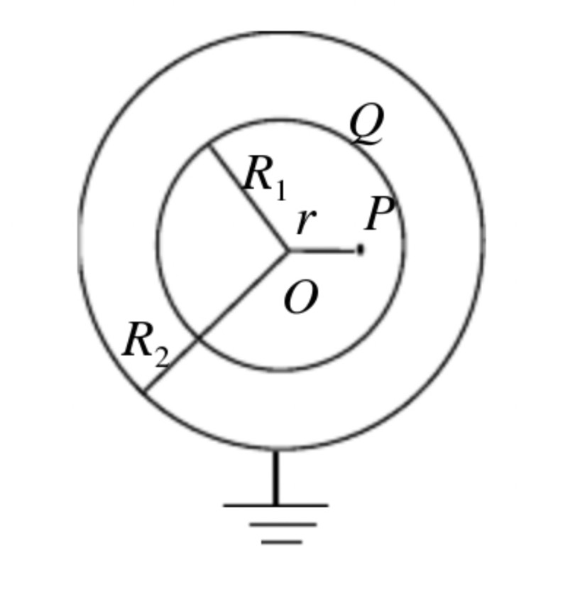

    A. $E=0$，$U=\dfrac{Q}{4\pi\varepsilon_0R_1}$

    B. $E=0$，$U=\dfrac{Q}{4\pi\varepsilon_0}\left(\dfrac1{R_1}-\dfrac1{R_2}\right)$

    C. $E=\dfrac{Q}{4\pi\varepsilon_0r^2}$，$U=\dfrac{Q}{4\pi\varepsilon_0r}$

    D. $E=\dfrac{Q}{4\pi\varepsilon_0r^2}$，$U=\dfrac{Q}{4\pi\varepsilon_0R_1}$

    

    
答案：

    B

    

    ***

5. 一“无限大”均匀带电平面 $A$，其附近放一与它平行的有一定厚度的“无限大”平板导体 $B$，如图所示。已知 $A$ 上的电荷面密度为 $+\sigma$，则在导体板 $B$ 的两个表面 1 和 2 上的感生电荷面密度为（ ）。

    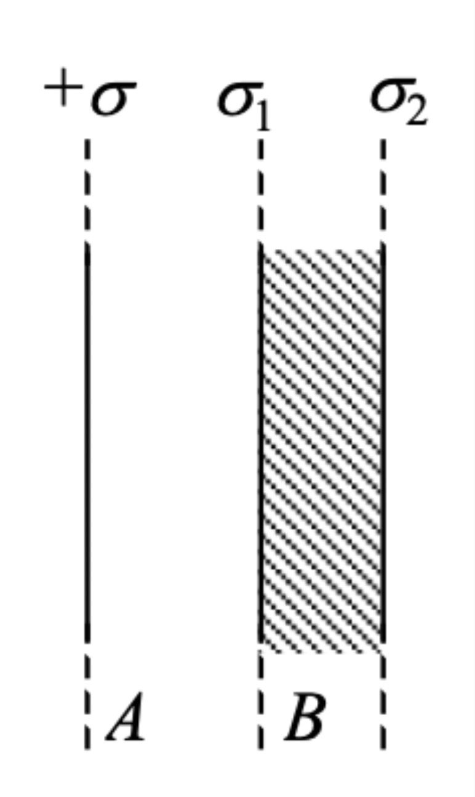

    A. $\sigma_1=-\sigma$，$\sigma_2=+\sigma$

    B. $\sigma_1=-\dfrac12\sigma$，$\sigma_2=+\dfrac12\sigma$

    C. $\sigma_1=+\dfrac12\sigma$，$\sigma_2=-\dfrac12\sigma$

    D. $\sigma_1=-\sigma$，$\sigma_2=0$

    

    
答案：

    D

    

    ***

6. 在真空中有一根半径为 $R$ 的半圆形细导线，流过的电流为 $I$，则圆心处的磁感强度为（ ）。

    A. $\dfrac{\mu_0}{4\pi}\dfrac IR$

    B. $\dfrac{\mu_0}{2\pi}\dfrac IR$

    C. $0$

    D. $\dfrac{\mu_0}{4}\dfrac IR$

    

    
答案：

    D

    

    ***

7. 一电子以速度 $\vec v$ 垂直地进入磁感强度为 $\vec B$ 的均匀磁场中，此电子在磁场中运动轨道所围的面积内的磁通量将（ ）。

    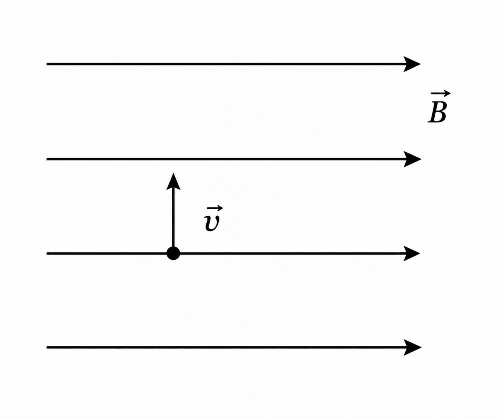

    A. 正比于 $B$，反比于 $v^2$

    B. 反比于 $B$，正比于 $v^2$

    C. 正比于 $B$，反比于 $v$

    D. 反比于 $B$，反比于 $v$

    

    
答案：

    B

    

***

### 二、填空题（共 20 分）

8. （3 分）电荷分别为 $q_1$、$q_2$、$q_3$ 的三个点电荷分别位于同一圆周的三个点上，如图所示。设无穷远处为电势零点，圆半径为 $R$，则 $b$ 点处的电势 $U=\underline{\qquad}$。

    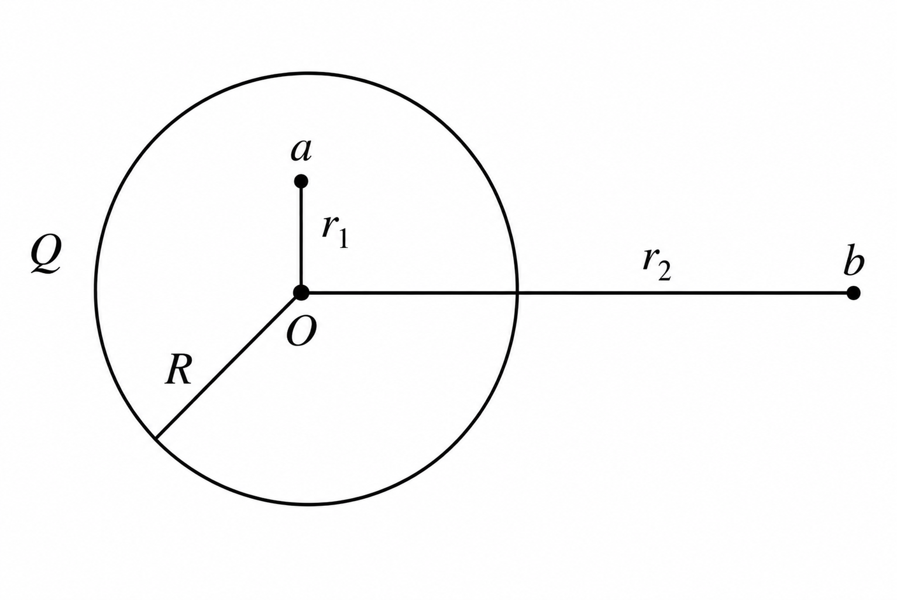

    

    
答案：

    $\dfrac{Qq}{4\pi\varepsilon_0}\left(\dfrac1{R_1}-\dfrac1{r_2}\right)$

    

    ***

9. （4 分）如图所示，两同心导体球壳，内球壳带电荷 $+q$，外球壳带电荷 $-2q$。静电平衡时，外球壳的电荷分布为：内表面 $\underline{\qquad}$，外表面 $\underline{\qquad}$。

    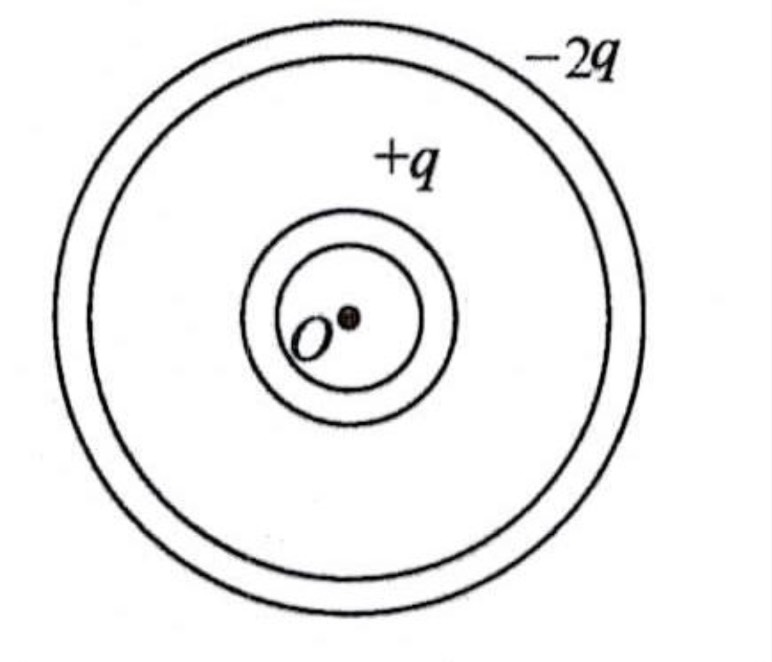

    

    
答案：

    $-q$，$-q$

    

    ***

10. （3 分）真空中均匀带电的球面和球体，如果两者的半径和总电荷都相等，则带电球面的电场能量 $W_1$ 与带电球体的电场能量 $W_2$ 相比，$W_1\underline{\qquad}W_2$（填 $<$、$=$、$>$）。

    

    
答案：

    $<$

    

    ***

11. （3 分）空气的击穿电场强度为 $2\times10^6\ \mathrm{V\cdot m^{-1}}$，直径为 $0.10\ \mathrm m$ 的导体球在空气中耐击穿最多能带的电荷为 $\underline{\qquad}$。（真空介电常量 $\varepsilon_0=8.85\times10^{-12}\ \mathrm{C^2\cdot N^{-1}\cdot m^{-2}}$）

    

    
答案：

    $5.6\times10^{-7}\ \mathrm C$

    

    ***

12. （3 分）如图，在无限长直载流导线的右侧有面积为 $S_1$ 和 $S_2$ 的两个矩形回路。两个回路与长直载流导线在同一平面，且矩形回路的一边与长直载流导线平行。则通过面积为 $S_1$ 的矩形回路的磁通量与通过面积为 $S_2$ 的矩形回路的磁通量之比为 $\underline{\qquad}$。

    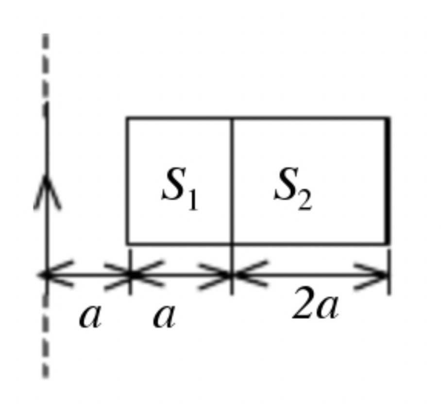

    

    
答案：

    $1:1$

    

    ***

13. （4 分）有一半径为 $a$、通有稳恒电流为 $I$ 的 $1/4$ 圆弧形载流导线 $bc$，按图示方式置于均匀外磁场 $\vec B$ 中，则该载流导线所受的安培力大小为 $\underline{\qquad}$。

    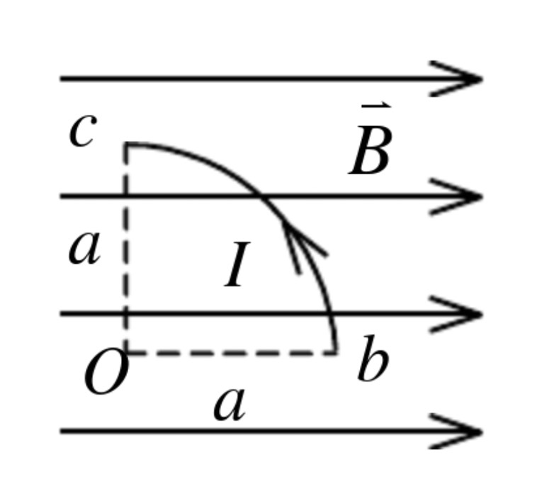

    

    
答案：

    $aIB$

    

***

### 三、计算题（共 50 分）

14. （12 分）电荷为 $q_1=8.0\times10^{-6}\ \mathrm C$ 和 $q_2=-16.0\times10^{-6}\ \mathrm C$ 的两个点电荷相距 $20\ \mathrm{cm}$，求离它们都是 $20\ \mathrm{cm}$ 处的电场强度。（真空介电常量 $\varepsilon_0=8.85\times10^{-12}\ \mathrm{C^2\cdot N^{-1}\cdot m^{-2}}$）

    

    
解：

    $$
    E_1=\frac{q_1}{4\pi\varepsilon_0d^2},\qquad
    E_2=\frac{|q_2|}{4\pi\varepsilon_0d^2}.
    $$

    $\because\ 2q_1=|q_2|$，$\therefore\ 2E_1=E_2$。由余弦定理：

    $$
    E=\sqrt{E_1^2+E_2^2-2E_1E_2\cos60^\circ}
    =\sqrt3E_1
    =\sqrt3\frac{q_1}{4\pi\varepsilon_0d^2}
    =3.11\times10^6\ \mathrm{V/m}.
    \tag{3 分}
    $$

    由正弦定理得：

    $$
    \frac{E}{\sin60^\circ}=\frac{E_1}{\sin\alpha},\qquad
    \sin\alpha=\frac{E_1}{E}\sin60^\circ=\frac12,
    $$

    $$
    \alpha=30^\circ.
    $$

    $\therefore\ \vec E$ 的方向与中垂线的夹角 $\beta=60^\circ$，如图所示。（2 分）

    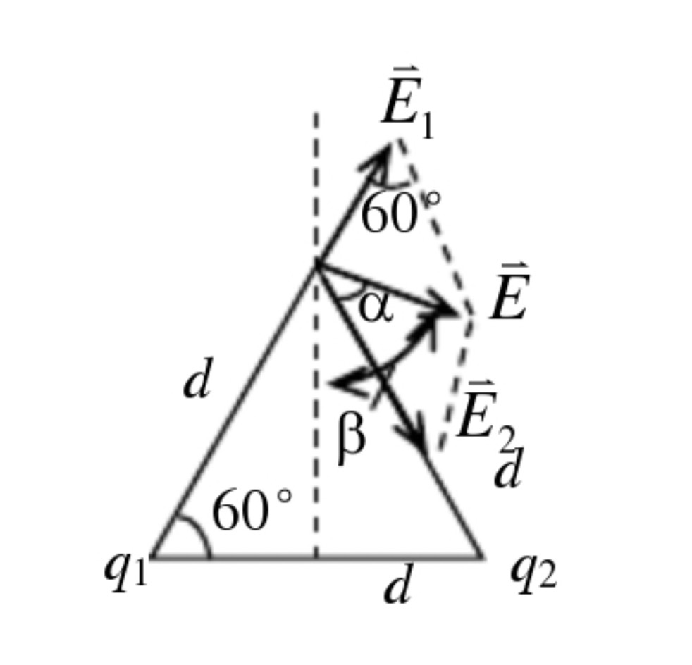

    

    ***

15. （12 分）图中所示为一沿 $x$ 轴放置的长度为 $l$ 的不均匀带电细棒，其电荷线密度为 $\lambda=\lambda_0(x-a)$，$\lambda_0$ 为一常量。取无穷远处为电势零点，求坐标原点 $O$ 处的电势。

    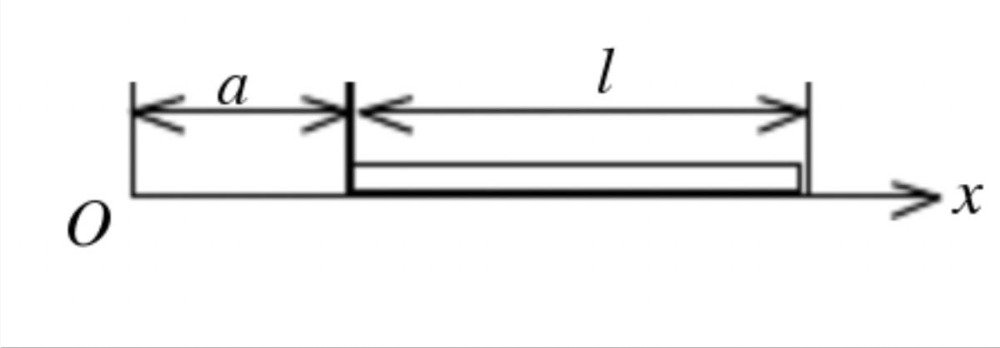

    

    
解：

    在任意位置 $x$ 处取长度元 $\mathrm dx$，其上带有电荷

    

    $$
    \mathrm dq=\lambda_0(x-a)\,\mathrm dx.
    $$

    它在 $O$ 点产生的电势

    $$
    \mathrm dU=\frac{\lambda_0(x-a)\,\mathrm dx}{4\pi\varepsilon_0x}.
    $$

    $O$ 点总电势

    $$
    U=\int\mathrm dU
    =\frac{\lambda_0}{4\pi\varepsilon_0}
    \left[\int_a^{a+l}\mathrm dx-a\int_a^{a+l}\frac{\mathrm dx}{x}\right]
    =\frac{\lambda_0}{4\pi\varepsilon_0}
    \left[l-a\ln\frac{a+l}{a}\right].
    $$

    

    ***

16. （13 分）厚度为 $d$ 的“无限大”均匀带电导体板两表面单位面积上电荷之和为 $\sigma$。试求图示离左板面距离为 $a$ 的一点与离右板面距离为 $b$ 的一点之间的电势差。

    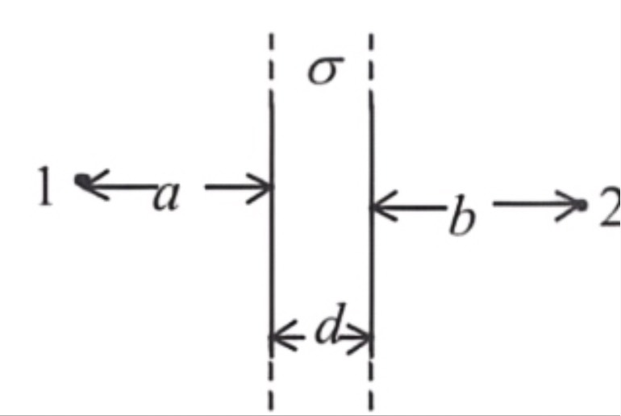

    

    
解：

    选坐标如图。由高斯定理，平板内、外的场强分布为：

    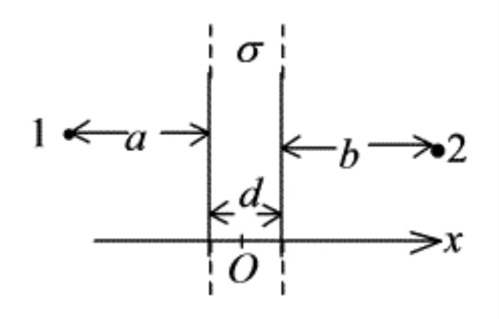

    $$
    E=0\qquad\text{（板内）},
    $$

    $$
    E_x=\pm\frac{\sigma}{2\varepsilon_0}\qquad\text{（板外）}.
    $$

    1、2 两点间电势差

    $$
    U_1-U_2=\int_1^2E_x\,\mathrm dx
    =\int_{-(a+d/2)}^{-d/2}-\frac{\sigma}{2\varepsilon_0}\,\mathrm dx
    +\int_{d/2}^{b+d/2}\frac{\sigma}{2\varepsilon_0}\,\mathrm dx
    =\frac{\sigma}{2\varepsilon_0}(b-a).
    $$

    

    ***

17. （13 分）三根平行长直导线在同一平面内，1、2 和 2、3 之间距离都是 $d=3\ \mathrm{cm}$，其中电流 $I_1=I_2=I$，$I_3=-(I_1+I_2)$，方向如图。试求在该平面内 $B=0$ 的直线的位置。

    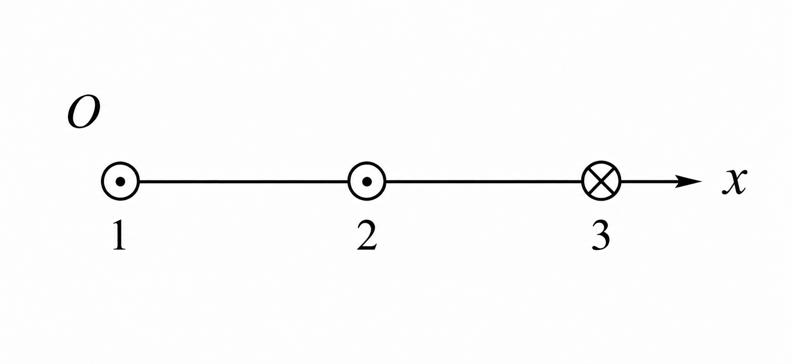

    

    
解：

    建立坐标系，$Ox$ 如图所示，设 $Ox$ 轴上一点 $P$ 为 $B=0$ 的位置，其坐标为 $x$，在 $P$ 点 $\vec B_1$ 向上，$\vec B_2$ 向下，$\vec B_3$ 向上，故有下式

    $$
    \frac{\mu_0I}{2\pi x}
    +\frac{2\mu_0I}{2\pi(2d-x)}
    =\frac{\mu_0I}{2\pi(d-x)}.
    $$

    $$
    \frac1x+\frac2{2d-x}=\frac1{d-x},
    $$

    $$
    \frac{2d-x+2x}{x(2d-x)}=\frac1{d-x},
    $$

    $$
    x=2\ \mathrm{cm}.
    $$

    代入数据解出 $B=0$ 的线在 1、2 连线间，距导线 1 为 $2\ \mathrm{cm}$ 处，且与 1、2、3 平行（在同一平面内）。

    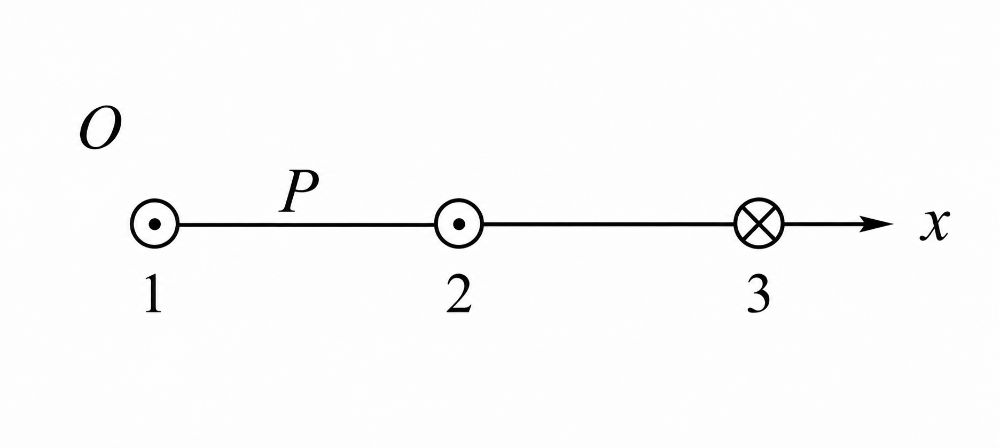

    

***

### 四、问答题（9 分）

18. 为什么引入电场中的试验电荷？体积必须很小，电荷量也必须很小？

    

    
答：

    试验电荷是为了探测电场对电荷有施力作用的性质而引入的。为了确定电场中各不同点对试验电荷施力的大小和方向，试验电荷的体积很小才能确定其位置，表明在该点所受的力。（4 分）

    试验电荷的电荷也必须足够小，使得它不致影响原有电场的分布，否则所测得的结果并非是原有电场的真实值。（5 分）

    

***

## 2008-2009学年上学期期中试卷（B）（含答案）

### 说明

- 原卷标题：华东师范大学期中试卷（B）2008-2009 学年第一学期

### 一、选择题（每题 4 分，共 16 分）

1. 在坐标原点放一正电荷 $Q$，它在 $P$ 点（$x=+1,y=0$）产生的电场强度为 $\vec E$。现在，另外有一个负电荷 $-2Q$，试问负电荷应在什么位置才能使 $P$ 点的电场强度等于零？（ ）。

    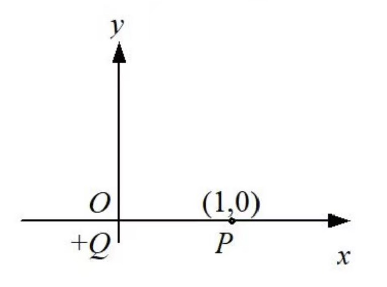

    A. $x$ 轴上 $x>1$

    B. $x$ 轴上 $0<x<1$

    C. $y$ 轴上 $y>0$

    D. $x$ 轴上 $x<0$

    

    
答案：

    D

    

    ***

2. 设有一“无限大”均匀带负电荷的平面。取 $x$ 轴垂直带电平面，坐标原点位于带电平面上，则其周围空间各点的电场强度 $E$ 随距离平面的位置坐标 $x$ 变化的关系曲线为（规定场强方向沿 $x$ 轴正向为正、反之为负）（ ）。

    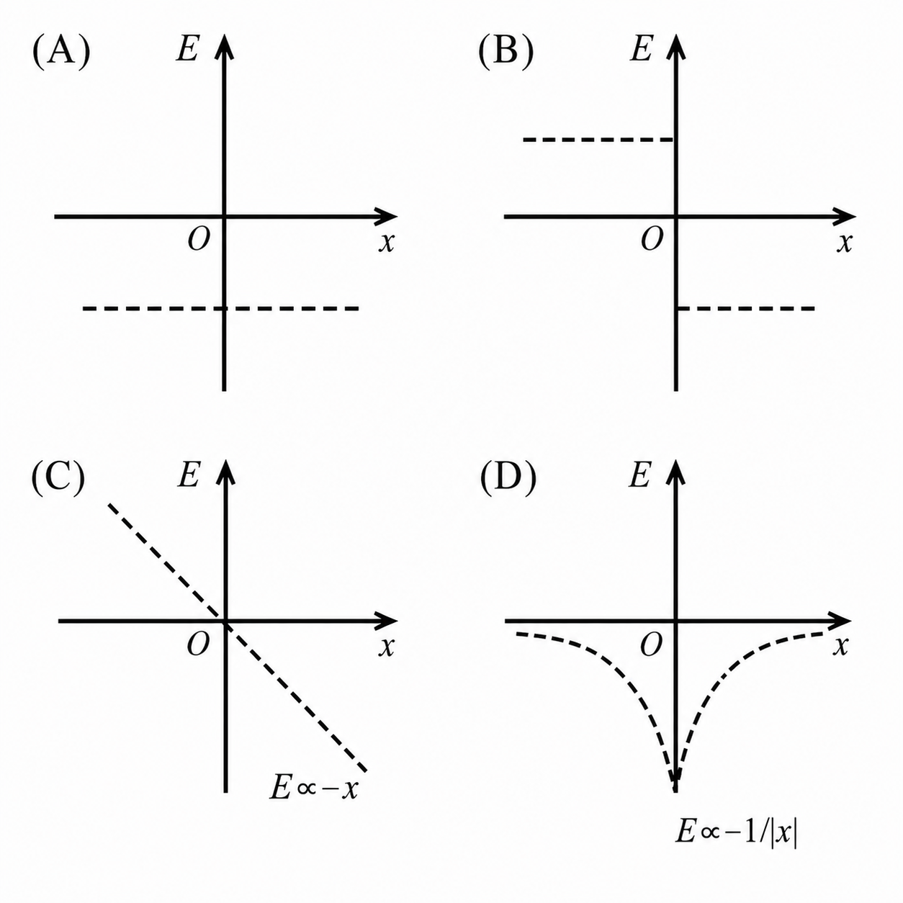

    

    
答案：

    B

    

    ***

3. 有两个大小不相同的金属球，大球直径是小球的两倍，大球带电，小球不带电，离各相距很远。今用细长导线将两者相连，在忽略导线的影响下，大球与小球的带电之比为（ ）。

    A. $2$

    B. $1$

    C. $1/2$

    D. $0$

    

    
答案：

    A

    

    ***

4. 在匀强电场中，将一负电荷从 $A$ 移到 $B$，如图所示，则（ ）。

    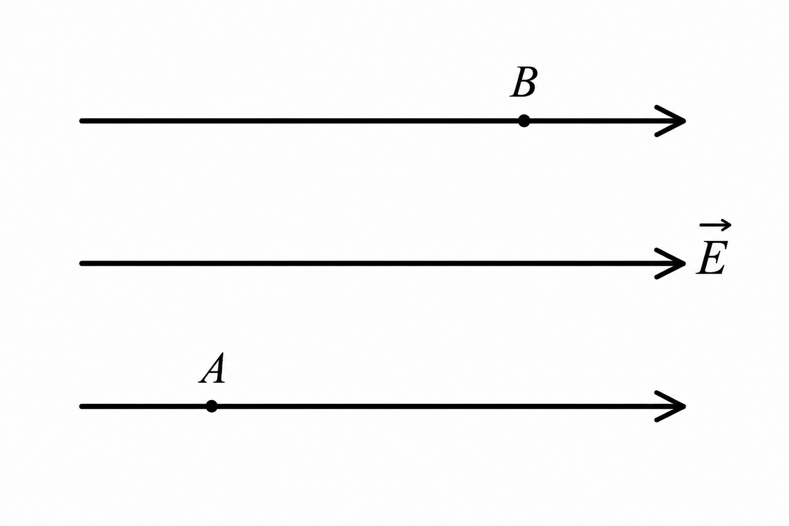

    A. 电场力作正功，负电荷的电势能减小

    B. 电场力作正功，负电荷的电势能增加

    C. 电场力作负功，负电荷的电势能减小

    D. 电场力作负功，负电荷的电势能增加

    

    
答案：

    D

    

***

### 二、填空题（共 24 分）（每空格 2 分）

5. 静电场的高斯定理的数学表示式为：$\underline{\qquad}$。该式的物理意义是：$\underline{\qquad}$。该定理表明，静电场是 $\underline{\qquad}$ 场。

    

    
答案：

    $$
    \oint_S\vec E\cdot\mathrm d\vec S=\frac{\sum q_i}{\varepsilon_0}
    $$

    在真空静电场内，通过任意封闭曲面的电通量等于该封闭面所包围的电荷的代数和的 $1/\varepsilon_0$ 倍；

    有势（保守力），静电场是无旋场。

    

    ***

6. 图中所示以 $O$ 为心的各同心圆弧为静电场的等势（位）线图，已知 $U_1<U_2<U_3$，在图上画出 $a$、$b$ 两点的电场强度的方向，并比较它们的大小，$E_a\underline{\qquad}E_b$（填 $<$、$=$、$>$）。方向为 $\underline{\qquad}$。

    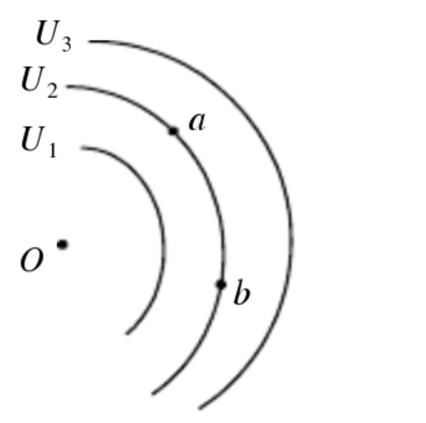

    

    
答案：

    $E_a=E_b$；方向均指向 $O$。

    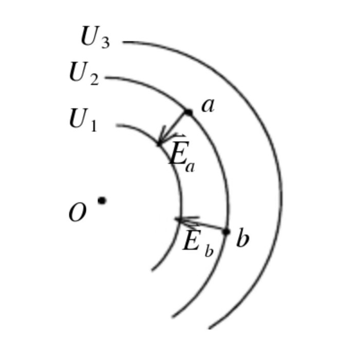

    

    ***

7. 想象电子的电荷 $-e$ 均匀分布在半径 $r_e=1.4\times10^{-15}\ \mathrm m$（经典的电子半径）的球表面上，电子表面附近的电势（以无穷远处为电势零点）$U=\underline{\qquad}\ \mathrm V$。（$\dfrac1{4\pi\varepsilon_0}=9\times10^9\ \mathrm{N\cdot m^2/C^2}$，$e=1.6\times10^{-19}\ \mathrm C$）

    

    
答案：

    $-1.03\times10^6\ \mathrm V$

    

    ***

8. 一条无限长载流导线折成如图形状，导线上通有电流 $I$。$P$ 点在 $cd$ 的延长线上，它到折点的距离为 $a$，则 $P$ 点的磁感强度 $B=\underline{\qquad}$，方向：$\underline{\qquad}$。

    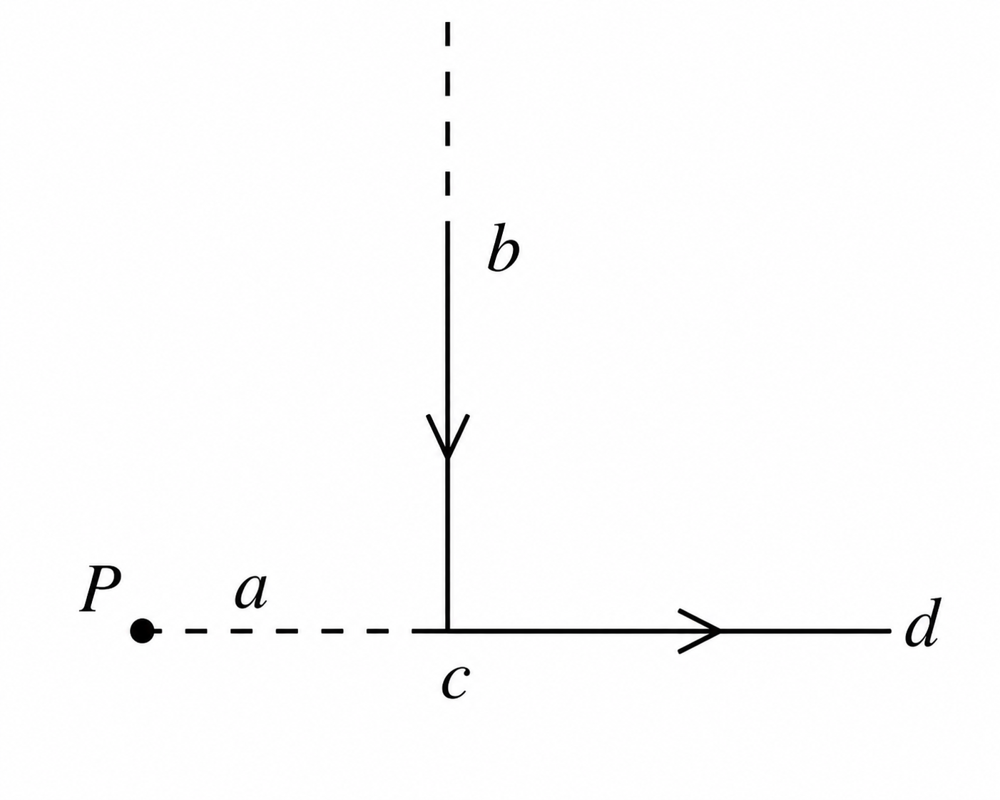

    

    
答案：

    $\dfrac{\mu_0I}{4\pi a}$；方向垂直向纸里。

    

    ***

9. 一磁场的磁感强度为 $\vec B=a\vec i+b\vec j+c\vec k$（SI），则通过一半径为 $R$、开口向 $z$ 轴正方向的半球壳表面的磁通量的表达式为：$\underline{\qquad}$，大小为 $\underline{\qquad}\ \mathrm{Wb}$。

    

    
答案：

    $(a\vec i+b\vec j+c\vec k)\cdot\vec k\,\pi R^2$；$c\pi R^2\ \mathrm{Wb}$。

    

    ***

10. 一空气平行板电容器，电容为 $C$，两极板间距离为 $d$。充电后，两极板间相互作用力为 $F$，则两极板间的电势为 $\underline{\qquad}$，极板上的电荷为 $\underline{\qquad}$。

    

    
答案：

    $\sqrt{2Fd/C}$；$\sqrt{2FdC}$。

    

***

### 三、计算题（计算题共 50 分）

11. （10 分）一电偶极子由电荷 $q=1.0\times10^{-6}\ \mathrm C$ 的两个异号点电荷组成，两电荷相距 $l=2.0\ \mathrm{cm}$。把这电偶极子放在场强大小为 $E=1.0\times10^5\ \mathrm{N/C}$ 的均匀电场中。试求：

    （1）电场作用于电偶极子的最大力矩；

    （2）电偶极子从受最大力矩的位置转到平衡位置过程中，电场力作的功。

    

    
解：

    （1）电偶极子在均匀电场中所受力矩为

    $$
    \vec M=\vec p\times\vec E,
    $$

    其大小

    $$
    M=pE\sin\theta=qlE\sin\theta.
    $$

    当 $\theta=\pi/2$ 时，所受力矩最大，

    $$
    M_{\max}=qlE=2\times10^{-3}\ \mathrm{N\cdot m}.
    \tag{5 分}
    $$

    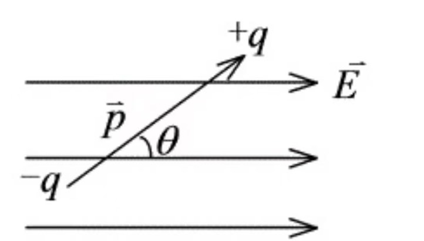

    （2）电偶极子在力矩作用下，从受最大力矩的位置转到平衡位置（$\theta=0$）过程中，电场力所作的功为

    $$
    A=\int_{\pi/2}^{0}-M\,\mathrm d\theta
    =-qlE\int_{\pi/2}^{0}\sin\theta\,\mathrm d\theta
    =qlE=2\times10^{-3}\ \mathrm{N\cdot m}.
    \tag{5 分}
    $$

    

    ***

12. （10 分）图中所示为一沿 $x$ 轴放置的长度为 $l$ 的不均匀带电细棒，其电荷线密度为 $\lambda=\lambda_0(x-a)$，$\lambda_0$ 为一常量。取无穷远处为电势零点，求坐标原点 $O$ 处的电势。

    

    

    
解：

    在任意位置 $x$ 处取长度元 $\mathrm dx$，其上带有电荷

    $$
    \mathrm dq=\lambda_0(x-a)\,\mathrm dx.
    $$

    它在 $O$ 点产生的电势

    $$
    \mathrm dU=\frac{\lambda_0(x-a)\,\mathrm dx}{4\pi\varepsilon_0x}.
    $$

    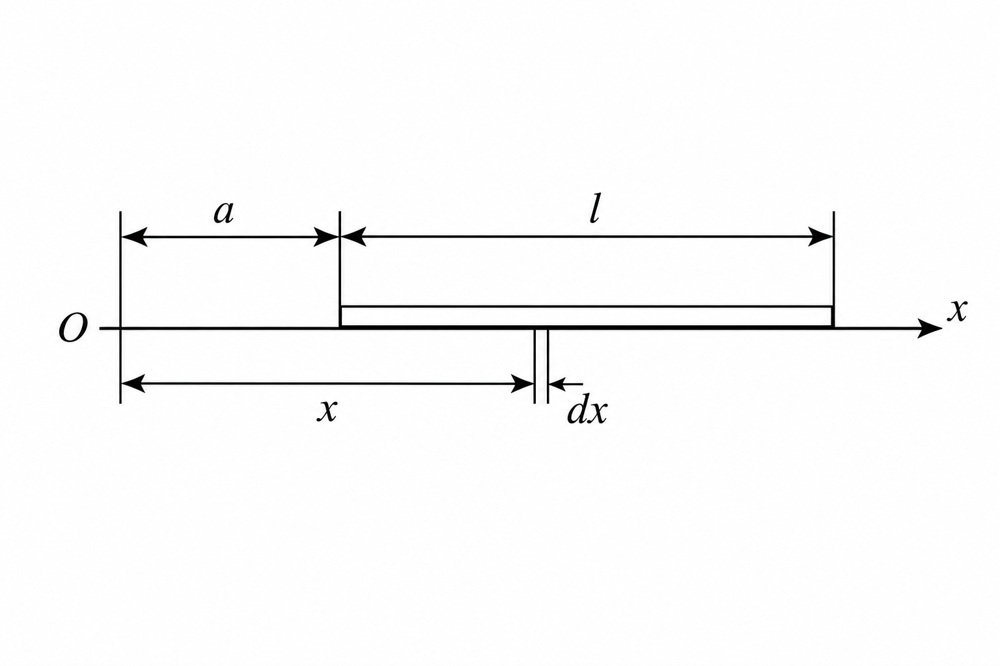

    $O$ 点总电势

    $$
    U=\int\mathrm dU
    =\frac{\lambda_0}{4\pi\varepsilon_0}
    \left[\int_a^{a+l}\mathrm dx-a\int_a^{a+l}\frac{\mathrm dx}{x}\right]
    =\frac{\lambda_0}{4\pi\varepsilon_0}
    \left[l-a\ln\frac{a+l}{a}\right].
    $$

    

    ***

13. （10 分）一个同心导体球壳，半径为 $R_1$，带电荷 $Q$。内有一个同心导体球，半径为 $R_2$，带电荷 $-q$。求：

    （1）各个空间电场强度的分布并画分布曲线；

    （2）内球的电势；

    （3）两个球间的电势差；

    （4）画出各个空间的电势分布曲线。

    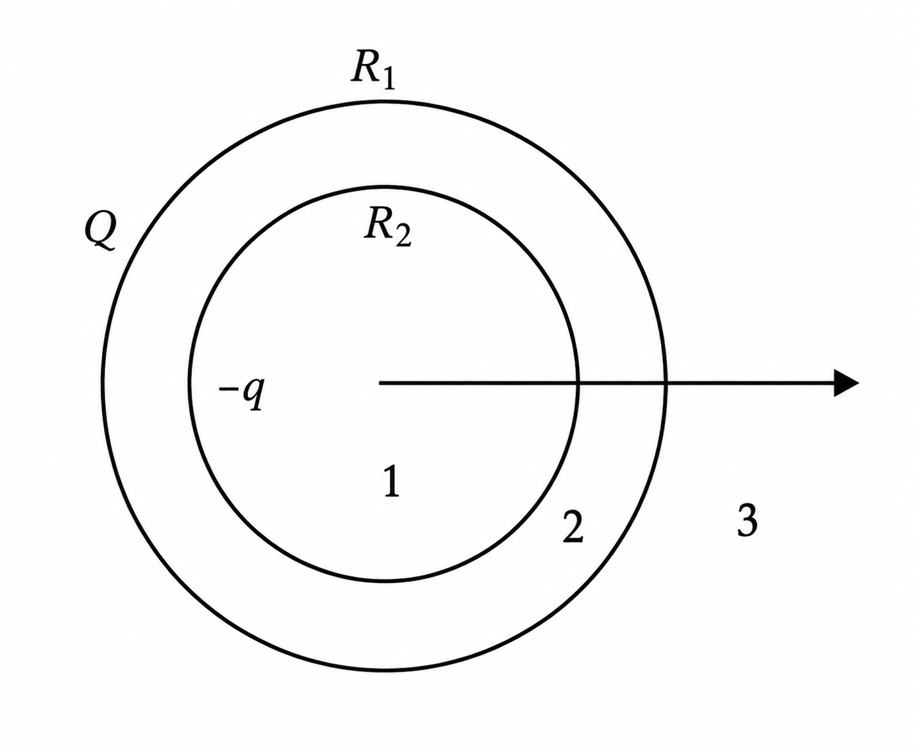

    

    
解：

    （1）根据高斯定理，

    $$
    E_1=0\qquad(r\leq R_2),
    $$

    $$
    E_2=-\frac{q}{4\pi\varepsilon_0r^2}\qquad(R_2\leq r<R_1),
    $$

    $$
    E_3=\frac{Q-q}{4\pi\varepsilon_0r^2}\qquad(r\geq R_1).
    $$

    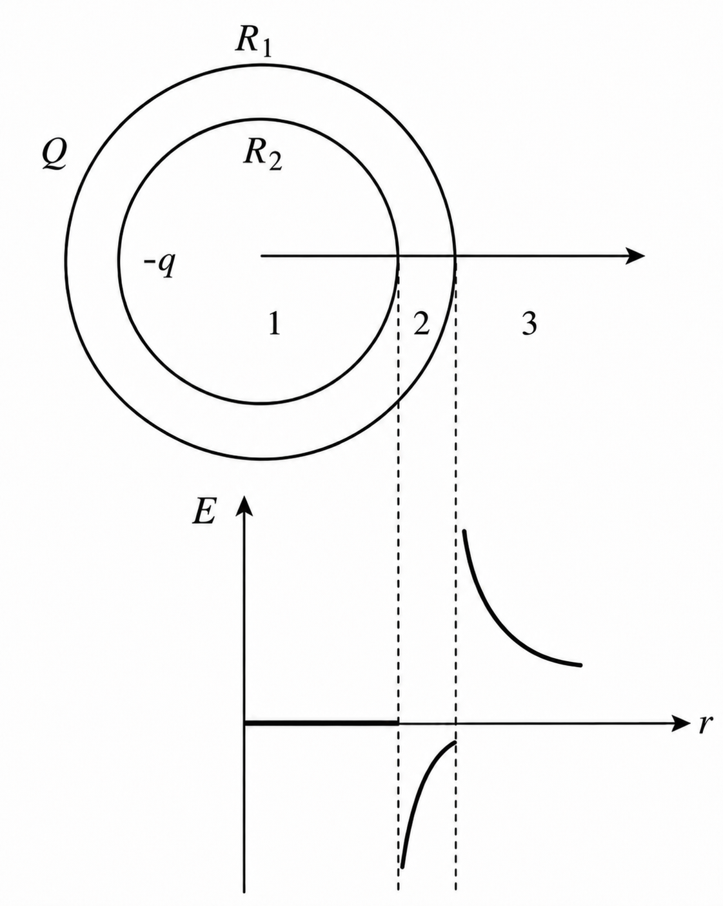

    （2）内球为等势体，

    $$
    \varphi_2=\frac1{4\pi\varepsilon_0}\left(\frac Q{R_1}-\frac q{R_2}\right).
    $$

    （3）外球的电势为：

    $$
    \varphi_1=\frac{Q-q}{4\pi\varepsilon_0R_1}.
    $$

    两球间的电势差为：

    $$
    \varphi_1-\varphi_2
    =-\frac q{4\pi\varepsilon_0}\left(\frac1{R_1}-\frac1{R_2}\right)>0.
    $$

    （4）$\varphi_1>\varphi_2$。

    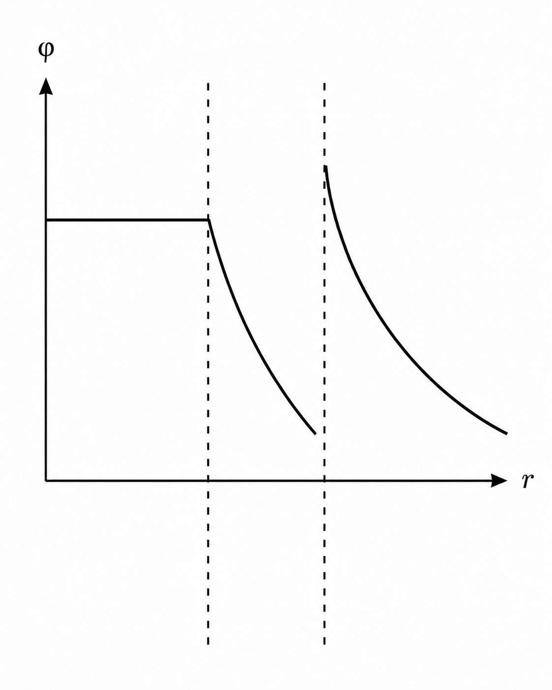

    

    ***

14. （10 分）一无限长圆柱形导体（磁导率 $\mu_0$），半径为 $R$，通有均匀分布的电流 $I$。今取一矩形平面 $S$（长为 $1\ \mathrm m$，宽为 $2R$），位置如右图中画斜线部分所示，求通过该矩形平面的磁通量。

    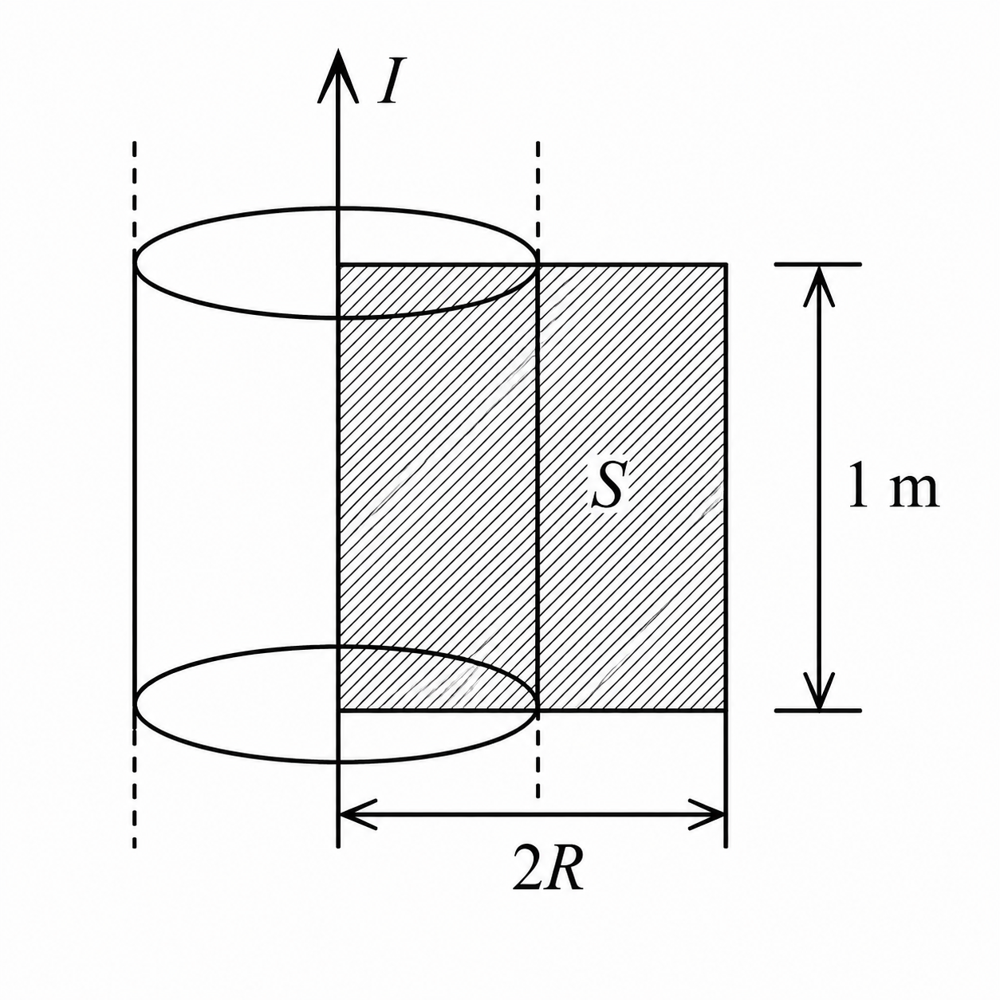

    

    
解：

    在圆柱体内部与导体中心轴线相距为 $r$ 处的磁感强度的大小，由安培环路定律可得：

    $$
    B=\frac{\mu_0I}{2\pi R^2}r\qquad(r\leq R).
    $$

    因而，穿过导体内画斜线部分平面的磁通量为

    $$
    \Phi_1=\int\vec B\cdot\mathrm d\vec S
    =\int_0^R\frac{\mu_0I}{2\pi R^2}r\,\mathrm dr
    =\frac{\mu_0I}{4\pi}.
    $$

    在圆形导体外，与导体中心轴线相距 $r$ 处的磁感强度大小为

    $$
    B=\frac{\mu_0I}{2\pi r}\qquad(r>R).
    $$

    因而，穿过导体外画斜线部分平面的磁通量 $\Phi_2$ 为

    $$
    \Phi_2=\int\vec B\cdot\mathrm d\vec S
    =\int_R^{2R}\frac{\mu_0I}{2\pi r}\,\mathrm dr
    =\frac{\mu_0I}{2\pi}\ln2.
    $$

    穿过整个矩形平面的磁通量

    $$
    \Phi=\Phi_1+\Phi_2
    =\frac{\mu_0I}{4\pi}+\frac{\mu_0I}{2\pi}\ln2.
    $$

    

    ***

15. （10 分）在无限长直流载流 $I_1$ 导线旁有长度为 $l$ 的载流 $I_2$ 导线，位置如图，求导线 $I_2$ 的合力。如果 $I_2$ 的质量为 $m$，加速度为多少？其中 $I_1=I_2$。

    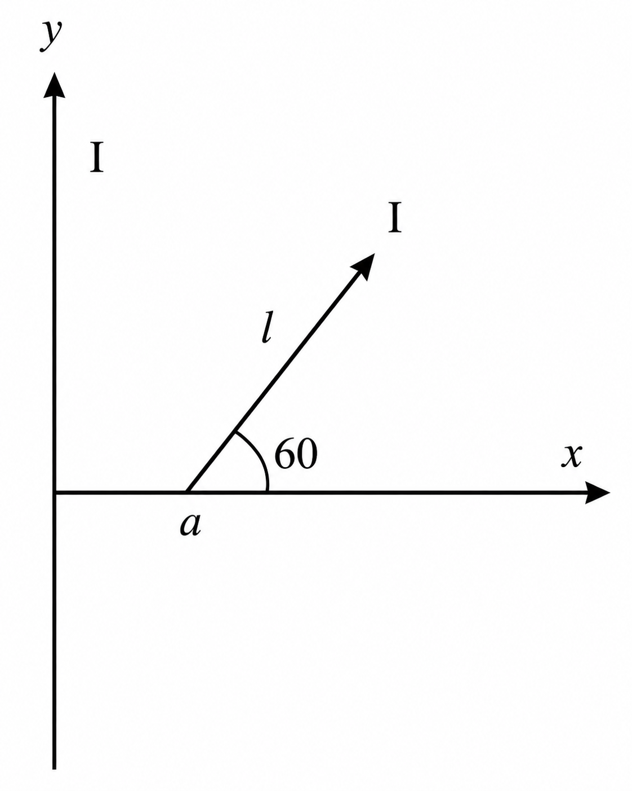

    

    
解：

    受力如图。在 $l$ 上，力是变化的，要积分求合力。定义垂直指向纸内的方向为 $\vec k$。

    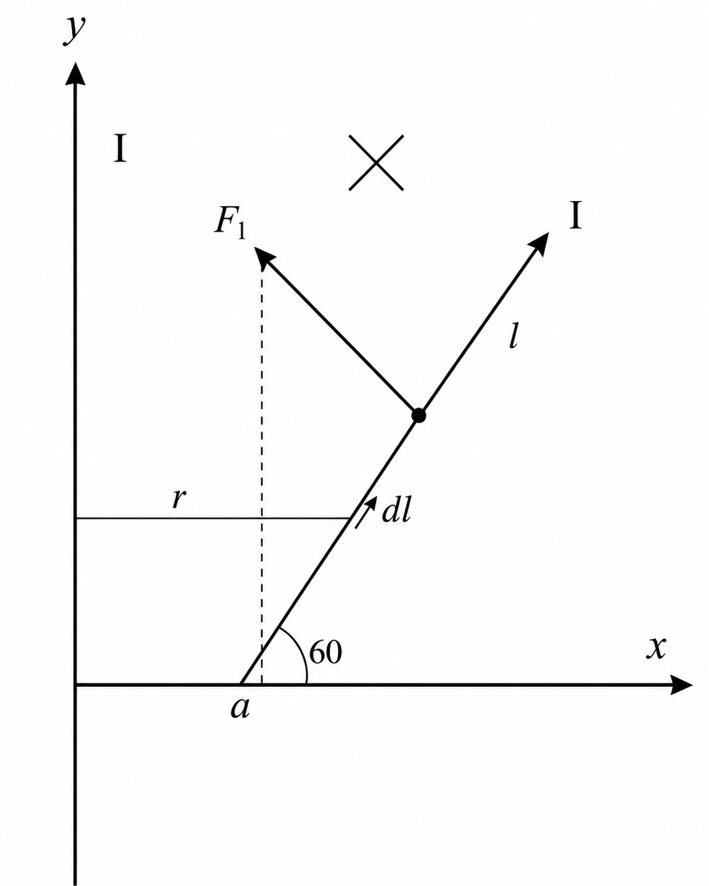

    $$
    \vec F_1=\int_0^l I\,\mathrm d\vec l\times\vec B
    =\int_0^l I\,\mathrm dl\,\vec i\times\frac{\mu_0I}{2\pi r}\vec k
    =\frac{\mu_0I^2}{2\pi}\int_0^l\frac{\mathrm dl}{r}(-\vec j).
    $$

    其中 $r$ 为从 $\mathrm dl$ 到左边无限长导线的距离。

    $$
    \mathrm dl\perp\vec k,
    $$

    $$
    x=a+l\cos60^\circ,
    $$

    $$
    \mathrm dx=\mathrm dl\cos60^\circ,
    $$

    $$
    r=x.
    $$

    所以，

    $$
    F_1=\frac{\mu_0I^2}{2\pi}
    \int_a^{a+l/2}\frac{\mathrm dx}{x\cos60^\circ}
    =\frac{\mu_0I^2}{\pi}
    \left[\ln\left(a+\frac l2\right)-\ln a\right].
    $$

    方向：相对于 $x$ 轴 $120^\circ$。

    $$
    a=\frac Fm
    =\frac{2\mu_0I^2}{2\pi m}
    \left[\ln\left(a+\frac l2\right)-\ln a\right].
    $$

    

***

### 四、问答题（10 分）

16. 为什么不能把磁场作用于运动电荷的力的方向，定义为磁感强度的方向？

    

    
答：

    因为磁力的方向还随电荷运动速度方向而不同，因而在磁场中同一点运动电荷受力的方向是不确定的。（10 分）

    

