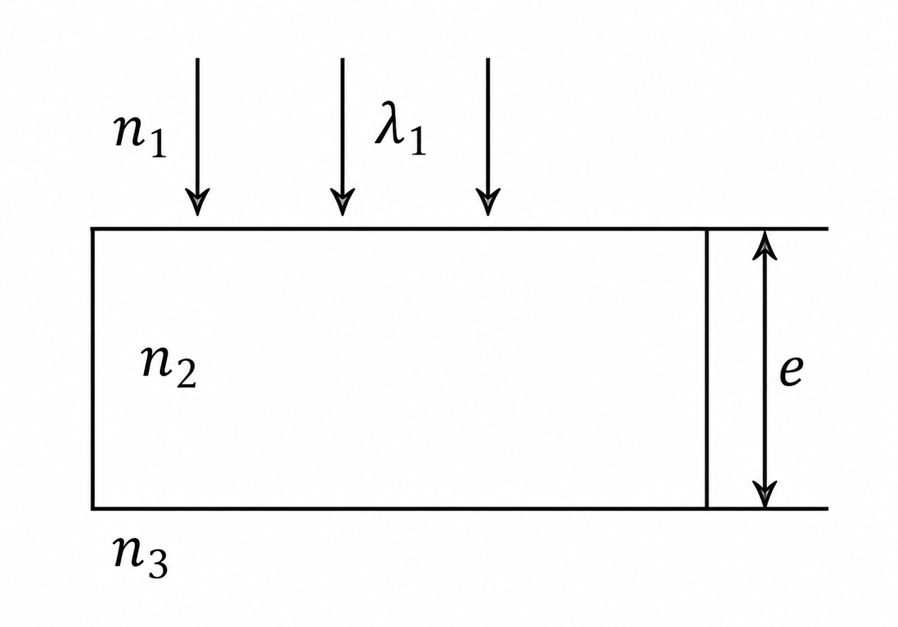
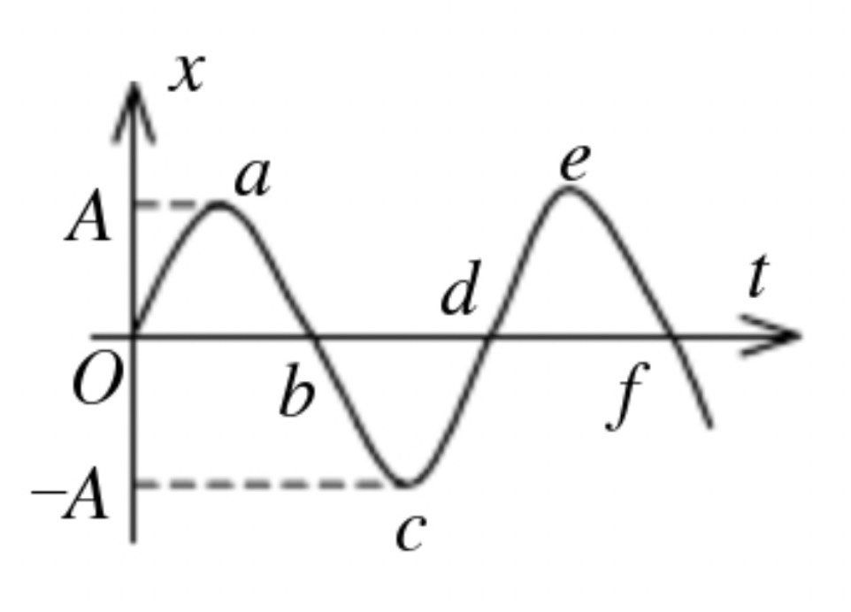
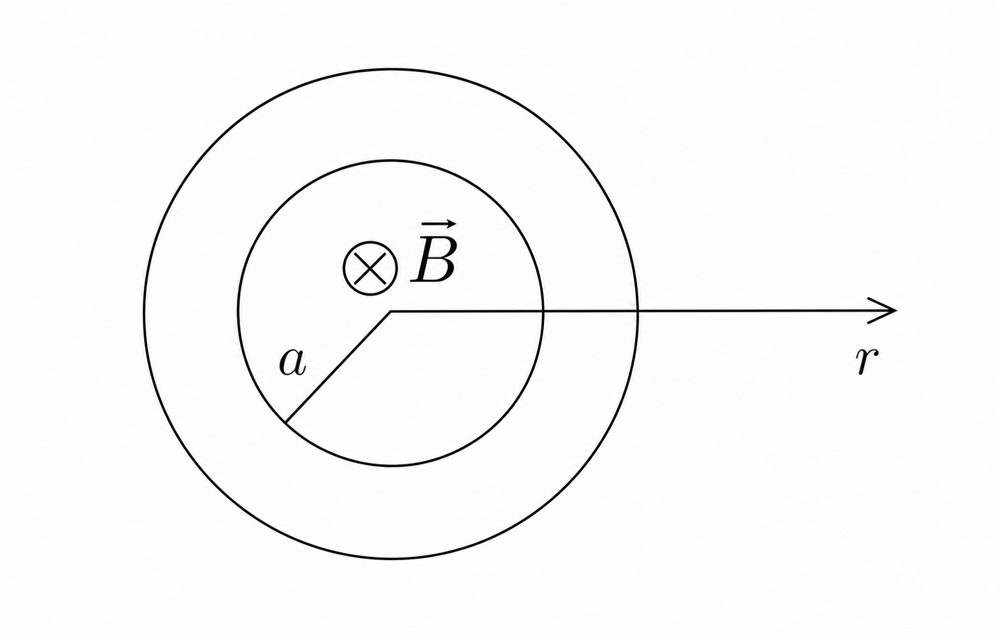
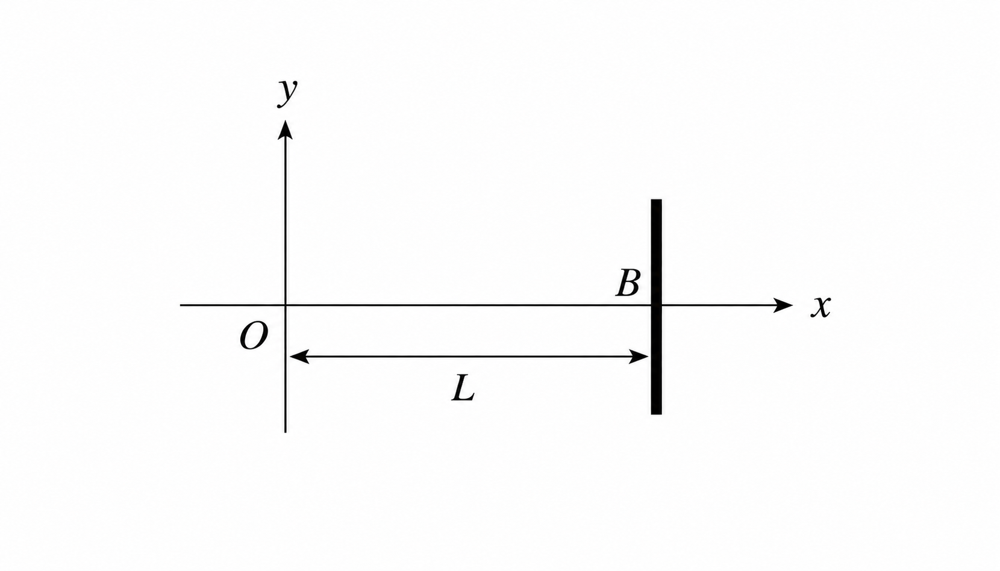
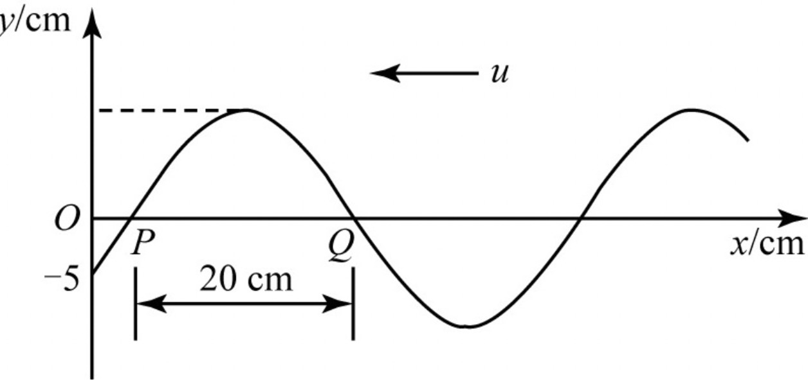

## 2008-2009学年上学期期末试卷（B）（含答案）

### 说明

- 原卷标题：华东师范大学期末试卷（B）2008-2009 学年第一学期

### 一、选择题（每题 3 分，共 18 分）

1. 关于感应电动势大小的下列说法中，正确的是（ ）。

    A. 线圈相对于磁场运动越快，线圈中产生的感应电动势一定越大

    B. 线圈中磁通量越大，产生的感应电动势一定越大

    C. 线圈放在磁感强度越强的地方，产生的感应电动势一定越大

    D. 线圈中磁通量变化越快，产生的感应电动势越大

    

    
答案：

    D

    

    ***

2. 关于波的干涉，下列说法中正确的是（ ）。

    A. 只有横波才能产生干涉，纵波不能产生干涉

    B. 只要是波都能产生稳定的干涉

    C. 不管是横波还是纵波，只要叠加的两列波的频率相等，振动位相差固定、振动方向相同就能产生稳定干涉

    D. 不管是横波还是纵波，只要叠加的两列波的频率相等，就能产生稳定干涉

    

    
答案：

    C

    

    ***

3. 在驻波中，两个相邻波节间各质点的振动（ ）。

    A. 振幅相同，相位相同

    B. 振幅不同，相位相同

    C. 振幅相同，相位不同

    D. 振幅不同，相位不同

    

    
答案：

    B

    

    ***

4. 如图所示，平行单色光垂直照射到薄膜上，经上下两表面反射的两束光发生干涉。若薄膜的厚度为 $e$，并且 $n_1<n_2>n_3$，$\lambda_1$ 为入射光在折射率为 $n_1$ 的媒质中的波长，则两束反射光在相遇点的相位差为（ ）。

    

    A. $\dfrac{2\pi n_2e}{n_1\lambda_1}$

    B. $\dfrac{4\pi n_1e}{n_2\lambda_1}+\pi$

    C. $\dfrac{4\pi n_2e}{n_1\lambda_1}+\pi$

    D. $\dfrac{4\pi n_2e}{n_1\lambda_1}$

    

    
答案：

    C

    

    ***

5. 在双缝干涉实验中，入射光的波长为 $\lambda$，用玻璃纸遮住双缝中的一个缝，若玻璃纸中光程比相同厚度的空气的光程大 $2.5\lambda$，则屏上原来的明纹处（ ）。

    A. 仍为明条纹

    B. 变为暗条纹

    C. 既非明纹也非暗纹

    D. 无法确定是明纹，还是暗纹

    

    
答案：

    B

    

    ***

6. 真空中波长为 $\lambda$ 的单色光，在折射率为 $n$ 的均匀透明媒质中，从 $A$ 点沿某一路径传播到 $B$ 点，路径的长度为 $l$。$A$、$B$ 两点光振动相位差记为 $\Delta\phi$，则（ ）。

    A. $l=3\lambda/2$，$\Delta\phi=3\pi$

    B. $l=3\lambda/(2n)$，$\Delta\phi=3n\pi$

    C. $l=3\lambda/(2n)$，$\Delta\phi=3\pi$

    D. $l=3n\lambda/2$，$\Delta\phi=3n\pi$

    

    
答案：

    C

    

***

### 二、填空题（每空 2 分，共 22 分）

7. 一闭合回路中产生感应电流是因为通过它的 $\underline{\qquad}$ 发生了改变，提供动生电动势的非静电力是 $\underline{\qquad}$，提供感生电动势的非静电力是 $\underline{\qquad}$。

    

    
答案：

    磁通量；洛伦兹力；感生电场力

    

    ***

8. 波动是 $\underline{\qquad}$ 在空间的传播，而驻波是一种波的 $\underline{\qquad}$ 现象，长度为 $L$ 的弦上产生驻波产生的条件是 $\underline{\qquad}$。

    

    
答案：

    振动的能量；干涉；两端固定，$L=n\dfrac{\lambda}{2}$，$n=1,2,\cdots$

    

    ***

9. 一水平弹簧简谐振子的振动曲线如图所示。当振子处在位移为零、速度为 $-\omega A$、加速度为零和弹性力为零的状态时，应对应于曲线上的 $\underline{\qquad}$ 点；当振子处在位移的绝对值为 $A$、速度为零、加速度为 $-\omega^2A$ 和弹性力为 $-kA$ 的状态时，应对应于曲线上的 $\underline{\qquad}$ 点。

    

    

    
答案：

    $b$，$f$；$a$，$e$

    

    ***

10. 两个同方向同频率的简谐振动，其合振动的振幅为 $20\ \mathrm{cm}$，与第一个简谐振动的相位差为 $\phi-\phi_1=\pi/6$。若第一个简谐振动的振幅为 $10\sqrt3\ \mathrm{cm}=17.3\ \mathrm{cm}$，则第二个简谐振动的振幅为 $\underline{\qquad}\ \mathrm{cm}$，第一、二两个简谐振动的相位差 $\phi_1-\phi_2$ 为 $\underline{\qquad}$。

    

    
答案：

    $10$；$-\dfrac{\pi}{2}$

    

    ***

11. 一列强度为 $I$ 的平面简谐波通过一面积为 $S$ 的平面，波速 $u$ 与该平面的法线 $\vec n$ 的夹角为 $\theta$，则该平面单位时间内接收到的能量为 $\underline{\qquad}$。

    

    
答案：

    $IS\cos\theta$

    

***

### 三、计算题（每题 10 分，共 50 分）

12. 一长圆柱状磁场，磁场方向沿轴线并垂直图面向里，磁场大小既随到轴线的距离 $r$ 成正比而变化，又随时间 $t$ 作正弦变化，即 $B=B_0r\sin\omega t$，$B_0$、$\omega$ 均为常数。若在磁场内放一半径为 $a$ 的金属圆环，环心在圆柱状磁场的轴线上，求金属环中的感生电动势，并讨论其方向。

    

    

    
答案：

    取回路正方向顺时针，则

    $$
    \Phi=\int B2\pi r\,\mathrm dr
    =\int_0^a B_0 2\pi r^2\sin\omega t\,\mathrm dr
    =\frac{2\pi}{3}B_0a^3\sin\omega t.
    \tag{4 分}
    $$

    $$
    \varepsilon_i=-\frac{\mathrm d\Phi}{\mathrm dt}
    =-\frac{2\pi}{3}B_0a^3\omega\cos\omega t.
    \tag{4 分}
    $$

    当 $\varepsilon_i>0$ 时，电动势沿顺时针方向。（2 分）

    

    ***

13. 在弹性介质中有一沿 $x$ 轴正向传播的平面波，其表达式为

    $$
    y=0.01\cos\left(4t-\pi x-\frac{\pi}{2}\right)\quad(\mathrm{SI}).
    $$

    若在 $L=5.00\ \mathrm m$ 处有一媒质分界面，且在分界面处反射波相位突变 $\pi$。设反射波的强度不变，试写出反射波的表达式，及驻波的表达式。

    

    

    
答案：

    反射波的振动方程

    $$
    y_0=0.01\cos\left(4t+\frac{\pi}{2}\right).
    \tag{2 分}
    $$

    反射波的波动方程

    $$
    y_{\text{反}}=0.01\cos\left(4t+\pi x+\frac{\pi}{2}\right)\quad(\mathrm{SI}).
    \tag{4 分}
    $$

    驻波方程

    $$
    y_{\text{驻波}}=0.02\cos\left(\pi x+\frac{\pi}{2}\right)\cos(\omega t)\quad(\mathrm{SI}).
    \tag{4 分}
    $$

    

    ***

14. 已知一沿 $x$ 轴负方向传播的平面余弦波，振幅为 $10$ 厘米，在 $t=1/3\ \mathrm s$ 时的波形如图所示，且周期 $T=2\ \mathrm s$。

    

    （1）写出 $O$ 点的振动表达式；

    （2）写出此波的波动表达式；

    （3）写出 $Q$ 点的振动表达式；

    （4）$Q$ 点离 $O$ 点的距离多大？

    

    
答案：

    $A=10\ \mathrm{cm}$，$T=2\ \mathrm s$，$\lambda=40\ \mathrm{cm}$，

    $$
    \omega=\frac{2\pi}{T}=\pi,\qquad u=\frac{\lambda}{T}=20\ \mathrm{cm/s}.
    $$

    （1）对于 $O$ 点，

    $$
    \omega t+\phi=\pi\times\frac13+\phi=-\frac23\pi,
    $$

    所以 $\phi=-\pi$。

    $O$ 点的振动方程

    $$
    y_O=10\cos(\pi t-\pi)\quad(\mathrm{cm}).
    \tag{3 分}
    $$

    （2）波动方程

    $$
    y=10\cos\left[\pi\left(t+\frac{x}{20}\right)-\pi\right]\quad(\mathrm{cm}).
    \tag{3 分}
    $$

    （3）对于 $Q$ 点，

    $$
    \omega t+\phi=\pi\times\frac13+\phi=\frac12\pi,
    $$

    所以 $\phi=\dfrac16\pi$。

    $$
    y_Q=10\cos\left(\pi t+\frac\pi6\right)\quad(\mathrm{cm}).
    \tag{2 分}
    $$

    （4）由波动方程

    $$
    \pi\left(t+\frac{x}{20}\right)-\pi
    =\frac\pi3+\frac{\pi x}{20}-\pi
    =\frac\pi2,
    $$

    得 $x=23.3\ \mathrm{cm}$。（2 分）

    

    ***

15. 在杨氏双缝干涉实验中，设两缝间的距离为 $d=0.2\ \mathrm{mm}$，屏与缝之间的距离为 $D=100\ \mathrm{cm}$，试求：

    （1）以波长为 $589\ \mathrm{nm}$ 的单色光照射，第 10 级明条纹离开中央明纹的距离；

    （2）第 10 级明纹的宽度；

    （3）以白光垂直照射时（可见光的波长范围为 $400\ \mathrm{nm}\text{-}760\ \mathrm{nm}$），屏幕上出现彩色干涉条纹，求第 2 级光谱的宽度。

    

    
答案：

    （1）双缝干涉时两光线的光程差为

    $$
    \delta=d\sin\theta=d\frac{x}{D}.
    \tag{4 分}
    $$

    明纹的位置

    $$
    x_k=\pm k\frac{D}{d}\lambda,
    \qquad x_{10}=\pm2.945\times10^{-2}\ \mathrm m.
    \tag{3 分}
    $$

    （2）明纹宽度为

    $$
    \Delta x=\frac{D}{d}\lambda=2.945\times10^{-3}\ \mathrm m.
    \tag{3 分}
    $$

    （3）第 2 级光谱的宽度

    $$
    \Delta x=x_{2\text{红}}-x_{2\text{紫}}
    =k\frac{D}{d}(\lambda_{\text{红}}-\lambda_{\text{紫}})
    =3.6\times10^{-3}\ \mathrm m.
    $$

    

    ***

16. 一束光线正入射到衍射光栅上，当分光计转过角 $\phi$ 时，在视场中可看到第三级光谱内 $\lambda=440\ \mathrm{nm}$ 的条纹。问在同一角 $\phi$ 上可看见波长在可见光范围内的某些条纹吗？（可见光的波长范围为 $400\ \mathrm{nm}\text{-}760\ \mathrm{nm}$）

    

    
答案：

    据光栅方程

    $$
    (b+b')\sin\phi=k\lambda,
    $$

    得

    $$
    (b+b')\sin\phi=3\times440=1320\ \mathrm{nm}.
    \tag{3 分}
    $$

    若 $k=2$，则 $\lambda_2=1320\div2=660\ \mathrm{nm}$。（2 分）

    若 $k=1$，则 $\lambda_1=1320\div1=1320\ \mathrm{nm}>700\ \mathrm{nm}$。（2 分）

    若 $k=4$，则 $\lambda_4=1320\div4=330\ \mathrm{nm}<400\ \mathrm{nm}$。（2 分）

    $\therefore$ 可见到第二级 $\lambda=660\ \mathrm{nm}$ 的条纹。（1 分）

    

***

### 四、问答题（10 分）

17. 什么是共振现象？试举例说明生活中我们有时需利用共振现象，而有时则需避免产生共振现象。

    

    
答案：

    在弱阻尼即 $b\ll\omega_0$ 的情况下，当 $\omega_f=\omega_0$ 时，振幅达到最大值，我们把这种振幅达到最大值的现象称做共振。（4 分）

    利用：扬声器，利用共振原理将声音放大。（3 分）

    避免：部队行军过桥时应避免共振造成桥的破坏。（3 分）

    

