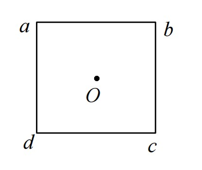
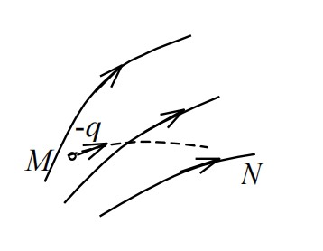
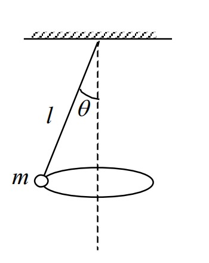
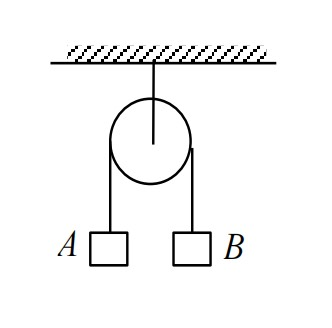
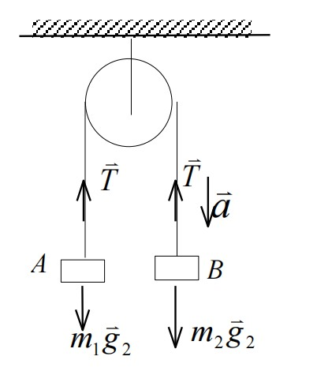
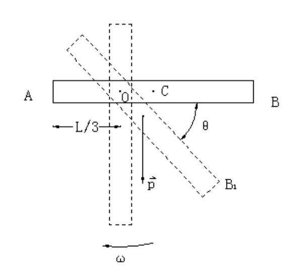

## 2017-2018学年下学期期中试卷（A）（含答案）

### 一、选择题（每题 3 分，共 18 分）

1. 某质点作直线运动的运动学方程为 $x=3t-5t^3+6\ (\mathrm{SI})$，则该质点作（ ）。

    A. 匀加速直线运动，加速度沿 $x$ 轴正方向

    B. 匀加速直线运动，加速度沿 $x$ 轴负方向

    C. 变加速直线运动，加速度沿 $x$ 轴正方向

    D. 变加速直线运动，加速度沿 $x$ 轴负方向

    

    
答案：

    D

    

    ***

2. 某物体的运动规律为 $\dfrac{\mathrm{d}v}{\mathrm{d}t}=-kv^2t$，式中的 $k$ 为大于零的常量。当 $t=0$ 时，初速为 $v_0$，则速度 $v$ 与时间 $t$ 的函数关系是（ ）。

    A. $\dfrac{1}{v}=\dfrac{kt^2}{2}+\dfrac{1}{v_0}$

    B. $v=-\dfrac{1}{2}kt^2+v_0$

    C. $v=\dfrac{1}{2}kt^2+v_0$

    D. $\dfrac{1}{v}=-\dfrac{kt^2}{2}+\dfrac{1}{v_0}$

    

    
答案：

    A

    

    ***

3. 质量分别为 $m_A$ 和 $m_B$（$m_A>m_B$）、速度分别为 $\vec v_A$ 和 $\vec v_B$（$v_A>v_B$）的两质点 A 和 B，受到相同的冲量作用，则（ ）。

    A. A 的动量增量的绝对值比 B 的小

    B. A 的动量增量的绝对值比 B 的大

    C. A、B 的动量增量相等

    D. A、B 的速度增量相等

    

    
答案：

    C

    

    ***

4. 花样滑冰运动员绕自身的竖直轴转动，开始时臂伸开，转动惯量为 $J_0$，角速度为 $\omega_0$，然后她将两臂收回，使转动惯量减少为 $J=\dfrac{1}{3}J_0$。这时她转动的角速度变为（ ）。

    A. $\dfrac{1}{3}\omega_0$

    B. $\dfrac{1}{\sqrt 3}\omega_0$

    C. $3\omega_0$

    D. $\sqrt 3\omega_0$

    

    
答案：

    C

    

    ***

5. 如图所示，边长为 $l$ 的正方形，在其四个顶点上各放有等量的点电荷。若正方形中心 O 处的场强值和电势值都等于零，则（ ）。

    

    A. 顶点 a、b、c、d 处都是正电荷

    B. 顶点 a、c 处是正电荷，b、d 处是负电荷

    C. 顶点 a、b 处是正电荷，c、d 处是负电荷

    D. 顶点 a、b、c、d 处都是负电荷

    

    
答案：

    B

    

    ***

6. 已知某电场的电场线分布情况如图所示。现观察到一负电荷从 M 点移到 N 点。有人根据这个图作出下列几点结论，其中哪点是正确的？

    

    A. 电势能 $W_M<W_N$

    B. 电势 $U_M<U_N$

    C. 电场强度 $E_M<E_N$

    D. 电场力的功 $A>0$

    

    
答案：

    A

    

***

### 二、填空题（每空 3 分，共 27 分）

7. 假如地球半径缩短 $1\%$，而它的质量保持不变，则地球表面的重力加速度 $g'$ 与原来地球表面的重力加速度 $g$ 之比是 $\underline{\qquad}$。

    

    
答案：

    $1.02$

    

    ***

8. 一圆锥摆摆长为 $l$、摆锤质量为 $m$，在水平面上作匀速圆周运动，摆线与铅直线夹角 $\theta$，则

    

    （1）摆锤的速率 $v=\underline{\qquad}$；

    （2）摆锤对虚线轴的角动量 $L=\underline{\qquad}$。

    

    
答案：

    （1）$\displaystyle \sin\theta\sqrt{\frac{gl}{\cos\theta}}$

    （2）$\displaystyle ml\sin^2\theta\sqrt{\frac{gl}{\cos\theta}}$

    

    ***

9. 一质点沿直线运动，其坐标 $x$ 与时间 $t$ 有如下关系：

    $$x=Ae^{-\beta t}\cos\omega t\quad(\mathrm{SI})$$

    （$A$、$\beta$ 皆为常数）

    （1）任意时刻 $t$ 质点的加速度 $a=\underline{\qquad}$；

    （2）质点通过原点的时刻 $t=\underline{\qquad}$。

    

    
答案：

    （1）$Ae^{-\beta t}\left[(\beta^2-\omega^2)\cos\omega t+2\beta\omega\sin\omega t\right]$

    （2）$\dfrac{1}{2}(2n+1)\pi/\omega\quad(n=0,1,2,\ldots)$

    

    ***

10. 一均匀细直棒，可绕通过其一端的光滑固定轴在竖直平面内转动。使棒从水平位置自由下摆，棒是否作匀角加速转动？$\underline{\qquad}$。理由是 $\underline{\qquad}$。

    

    
答案：

    否。

    在棒的自由下摆过程中，转动惯量不变，但使棒下摆的力矩随棒的下摆而减小。由转动定律知棒摆动的角加速度也要随之变小。

    

    ***

11. 半径为 $R$、具有光滑轴的定滑轮边缘绕一细绳，绳的下端挂一质量为 $m$ 的物体。绳的质量可以忽略，绳与定滑轮之间无相对滑动。若物体下落的加速度为 $a$，则定滑轮对轴的转动惯量 $J=\underline{\qquad}$。

    

    
答案：

    $\displaystyle \frac{m(g-a)R^2}{a}$

    

    ***

12. A、B 为两个电容值都等于 $C$ 的电容器，已知 A 带电荷为 $Q$，B 带电荷为 $2Q$。现将 A、B 并联（A、B 的正极相连，负极相连）后，系统电场能量的增量 $\Delta W=\underline{\qquad}$。

    

    
答案：

    $\displaystyle -\frac{Q^2}{4C}$

    

***

### 三、计算题（13—17 题，每题 9 分；18 题 10 分，共 55 分）

13. 一质点沿 $x$ 轴运动，其加速度 $a$ 与位置坐标 $x$ 的关系为 $a=2+6x^2\ (\mathrm{SI})$。如果质点在原点处的速度为零，试求其在任意位置处的速度。

    

    
解：

    设质点在 $x$ 处的速度为 $v$，

    $$a=\frac{\mathrm{d}v}{\mathrm{d}t}=\frac{\mathrm{d}v}{\mathrm{d}x}\cdot\frac{\mathrm{d}x}{\mathrm{d}t}=2+6x^2 \qquad 3\text{分}$$

    $$\int_0^v v\,\mathrm{d}v=\int_0^x(2+6x^2)\,\mathrm{d}x \qquad 3\text{分}$$

    $$v=2(x+x^3)^{1/2} \qquad 3\text{分}$$

    

    ***

14. 一名宇航员将去月球。他带有一个弹簧秤和一个质量为 $1.0\ \mathrm{kg}$ 的物体 A。到达月球上某处时，他拾起一块石头 B，挂在弹簧秤上，其读数与地面上挂 A 时相同。然后，他把 A 和 B 分别挂在跨过定滑轮的轻绳的两端，定滑轮质量为 $0.5\ \mathrm{kg}$，半径为 $0.1\ \mathrm{m}$，如图所示。若月球表面的重力加速度为 $1.67\ \mathrm{m/s^2}$，求石块 B 的加速度？

    

    

    
解：

    设地球和月球表面的重力加速度分别为 $g_1$ 和 $g_2$，在月球上 A、B 受力如图，则有

    

    $$m_2g_2-T_1=m_2a \tag{1}\qquad 1\text{分}$$

    $$T_2-m_1g_2=m_1a \tag{2}\qquad 1\text{分}$$

    $$(T_1-T_2)R=\frac{Ja}{R},\qquad J=\frac{mR^2}{2}$$

    又

    $$m_1g_1=m_2g_2 \tag{3}\qquad 2\text{分}$$

    联立解（1）、（2）、（3）可得

    $$a=\frac{g_1-g_2}{1+(g_1/g_2)+(m/2)}=1.14\ \mathrm{m/s^2}\qquad 2\text{分}$$

    即 B 以 $1.18\ \mathrm{m/s^2}$ 的加速度下降。 2分

    即在平衡位置上方 $19.6\ \mathrm{cm}$ 处开始分离，由 $a_{\max}=\omega^2A>g$，可得

    $$A>g/\omega^2=19.6\ \mathrm{cm}.\qquad 1\text{分}$$

    :::tip
    原参考答案先计算得到 $1.14\ \mathrm{m/s^2}$，随后却写为 $1.18\ \mathrm{m/s^2}$。按题目所给数据重新计算，石块 B 的加速度约为 $1.14\ \mathrm{m/s^2}$。答案末尾关于“在平衡位置上方 $19.6\ \mathrm{cm}$ 处开始分离”的内容也与本题条件无关，疑似混入了其他题目的解答；以上内容均按原参考答案保留。
    :::

    

    ***

15. 设两粒子之间的相互作用力为排斥力 $f$，其变化规律为 $f=\dfrac{k}{r^3}$，$k$ 为常数，$r$ 为二者之间的距离，试问：（1）$f$ 是保守力吗？为什么？（2）若是保守力，求两粒子相距为 $r$ 时的势能。设无穷远处为零势能位置。

    

    
解：

    根据问题中给出的力 $f=\dfrac{k}{r^3}$，只与两个粒子之间位置有关，所以相对位置从 $r_1$ 变化到 $r_2$ 时，力做的功为：

    $$A=\int_{r_1}^{r_2}\frac{k}{r^3}\,\mathrm{d}r=-\frac{1}{2}k\left(\frac{1}{r_2^2}-\frac{1}{r_1^2}\right),$$

    做功与路径无关，为保守力；

    两粒子相距为 $r$ 时的势能：

    $$E_P=\int_r^\infty\frac{k}{r^3}\,\mathrm{d}r=\frac{k}{2r^2}.$$

    

    ***

16. 一根质量为 $m$、长为 $l$ 的细棒 AB 可绕一水平的光滑转轴 O 在竖直平面内转动，转轴 O 离 A 端的距离为 $l/3$，今使棒从静止开始由水平位置绕 O 轴转动，求：

    

    （1）棒对转轴 O 的转动惯量；

    （2）棒在水平位置上刚起动时的角加速度；

    （3）棒在任一位置的角加速度。

    

    
解：

    （1）求转动惯量：

    方法一：

    $$J=\int_{-l/3}^{2l/3}x^2\lambda\,\mathrm{d}x=\frac{1}{9}ml^2.$$

    方法二：由平行轴定理：$J=J_c+md^2$

    所以：

    $$J=\frac{1}{12}ml^2+m\left(\frac{l}{6}\right)^2=\frac{1}{9}ml^2.$$

    （2）棒在水平位置上刚起动时的角加速度：

    $$M=\frac{2}{3}mg\frac{l}{3}-\frac{1}{3}mg\frac{l}{6}=\frac{1}{6}mgl.$$

    由转动定律：

    $$M=\beta J.$$

    所以：

    $$\beta=\frac{3g}{2l}.$$

    （3）棒在任一位置的角加速度：

    $$M=\frac{2}{3}mg\frac{l}{3}\cos\theta-\frac{1}{3}mg\frac{l}{6}\cos\theta=\frac{1}{6}mgl\cos\theta,$$

    $$M=\beta J.$$

    所以：

    $$\beta=\frac{3g}{2l}\cos\theta.$$

    

    ***

17. 一半径为 $R$ 的带电球体，其电荷体密度分布为：$\rho=Ar\ (r\leq R)$，$\rho=0\ (r>R)$，$A$ 为一常量。试求球体内外的场强分布。

    

    
解：

    在球内取半径为 $r$、厚为 $\mathrm{d}r$ 的薄球壳，该壳内所包含的电荷为

    $$\mathrm{d}q=\rho\,\mathrm{d}V=Ar\cdot4\pi r^2\,\mathrm{d}r.$$

    在半径为 $r$ 的球面内包含的总电荷为：

    $$q=\int_V\rho\,\mathrm{d}V=\int_0^r4\pi Ar^3\,\mathrm{d}r=\pi Ar^4\qquad(r\leq R).$$

    以该球面为高斯面，按高斯定理有：

    $$E_1\cdot4\pi r^2=\frac{\pi Ar^4}{\varepsilon_0}.$$

    得到：

    $$E_1=\frac{Ar^2}{4\varepsilon_0},\qquad(r\leq R).$$

    方向沿径向，$A>0$ 时向外，$A<0$ 时向里。 5分

    在球体外作一半径为 $r$ 的同心高斯球面，按高斯定理有：

    $$E_2\cdot4\pi r^2=\frac{\pi AR^4}{\varepsilon_0}.$$

    得到：

    $$E_2=\frac{AR^4}{4\varepsilon_0r^2},\qquad(r>R).$$

    方向沿径向，$A>0$ 时向外，$A<0$ 时向里。 4分

    

    ***

18. 半径分别为 $1.0\ \mathrm{cm}$ 与 $2.0\ \mathrm{cm}$ 的两个球形导体，各带电荷 $1.0\times10^{-8}\ \mathrm{C}$，两球相距很远。若用细导线将两球相连接，求：（1）每个球所带电荷；（2）每球的电势。$\left(\dfrac{1}{4\pi\varepsilon_0}=9\times10^9\ \mathrm{N\cdot m^2/C^2}\right)$

    

    
解：

    两球相距很远，可视为孤立导体，互不影响。球上电荷均匀分布。设两球半径分别为 $r_1$ 和 $r_2$，导线连接后的电荷分别为 $q_1$ 和 $q_2$，而 $q_1+q_1=2q$，则两球电势分别是

    $$U_1=\frac{q_1}{4\pi\varepsilon_0r_1},\qquad U_2=\frac{q_2}{4\pi\varepsilon_0r_2}.\qquad 2\text{分}$$

    两球相连后电势相等，$U_1=U_2$，则有

    $$\frac{q_1}{r_1}=\frac{q_2}{r_2}=\frac{q_1+q_2}{r_1+r_2}=\frac{2q}{r_1+r_2}.\qquad 2\text{分}$$

    由此得到

    $$q_1=\frac{r_1\,2q}{r_1+r_2}=6.67\times10^{-9}\ \mathrm{C}.\qquad 1\text{分}$$

    $$q_2=\frac{r_2\,2q}{r_1+r_2}=13.3\times10^{-9}\ \mathrm{C}.\qquad 1\text{分}$$

    两球电势

    $$U_1=U_2=\frac{q_1}{4\pi\varepsilon_0r_1}=6.0\times10^3\ \mathrm{V}.\qquad 2\text{分}$$

    

