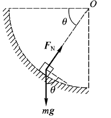
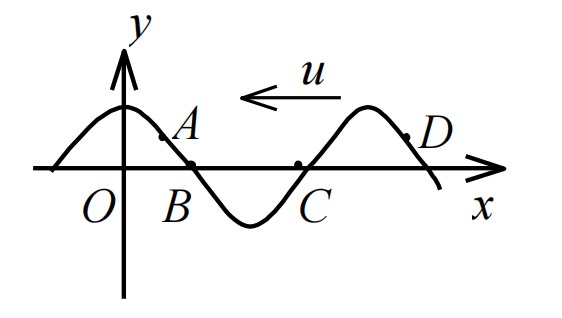
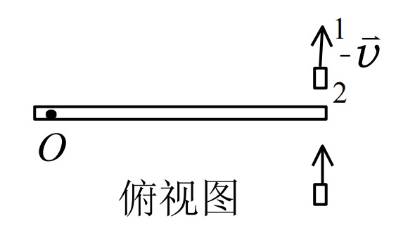
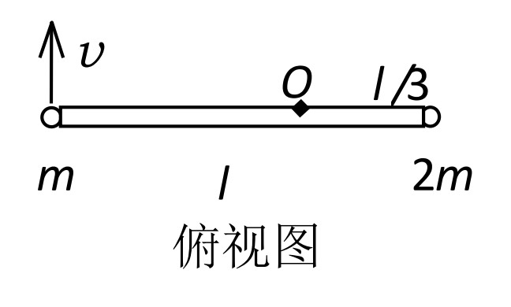
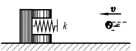
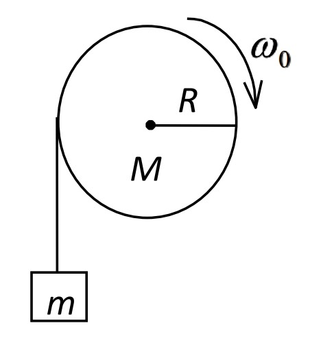
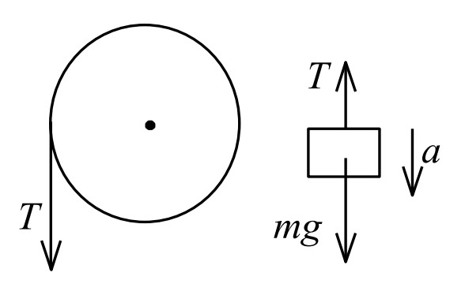

## 2018-2019学年下学期期中试卷（含答案）

### 一、选择题（单项选择，每题 2 分，共 20 分）

1. 下列说法正确的是（ ）。

    A. 加速度恒定不变时，物体的运动方向也不变

    B. 平均速率等于平均平均速度的大小

    C. 当物体的速度为零时，加速度必定为零

    D. 质点作曲线运动时，质点速度大小的变化产生切向加速度，速度方向的变化产生法向加速度

    

    
答案：

    D

    

    ***

2. 一质点在平面上运动，已知质点位置矢量的表示式为 $\vec r=at^2\vec i+bt^2\vec j\ (\mathrm{SI})$（其中 $a$、$b$ 为常量），则质点作（ ）。

    A. 匀速直线运动

    B. 变速直线运动

    C. 抛物线运动

    D. 一般曲线运动

    

    
答案：

    B

    

    ***

3. 一个质点在做圆周运动时，则有（ ）。

    A. 切向加速度一定改变，法向加速度也改变

    B. 切向加速度可能不变，法向加速度一定改变

    C. 切向加速度可能不变，法向加速度不变

    D. 切向加速度一定改变，法向加速度不变

    

    
答案：

    B

    

    ***

4. 一物体沿固定圆弧形光滑轨道由静止下滑，在下滑过程中，则（ ）。

    

    A. 它的加速度方向永远指向圆心，其速率保持不变

    B. 它受到的轨道的作用力的大小不断增加

    C. 它受到的合外力大小变化，方向永远指向圆心

    D. 它受到的合外力大小不变，其速率不断增加

    

    
答案：

    B

    

    ***

5. 对质点组有以下几种说法：

    （1）质点组总动量的改变与内力无关；

    （2）质点组总动能的改变与内力无关；

    （3）质点组机械能的改变与保守内力无关。

    下列对上述说法判断正确的是（ ）。

    A. 只有（1）是正确的

    B. （1）、（2）是正确的

    C. （1）、（3）是正确的

    D. （2）、（3）是正确的

    

    
答案：

    C

    

    ***

6. 把单摆摆球从平衡位置向位移正方向拉开，使摆线与竖直方向成一微小角度 $\theta$，然后由静止放手任其振动，从放手时开始计时。若用余弦函数表示其运动方程，则该单摆振动的初相为（ ）。

    A. $\pi$

    B. $\pi/2$

    C. $0$

    D. $\theta$

    

    
答案：

    C

    

    ***

7. 横波以波速 $u$ 沿 $x$ 轴负方向传播。$t$ 时刻波形曲线如图。则该时刻（ ）。

    

    A. A 点振动速度大于零

    B. B 点静止不动

    C. C 点向下运动

    D. D 点振动速度小于零

    

    
答案：

    D

    

    ***

8. 关于刚体对轴的转动惯量，下列说法中正确的是（ ）。

    A. 只取决于刚体的质量，与质量的空间分布和轴的位置无关

    B. 取决于刚体的质量和质量的空间分布，与轴的位置无关

    C. 取决于刚体的质量、质量的空间分布和轴的位置

    D. 只取决于转轴的位置，与刚体的质量和质量的空间分布无关

    

    
答案：

    C

    

    ***

9. 如图所示，一静止的均匀细棒，长为 $L$、质量为 $M$，可绕通过棒的端点且垂直于棒长的光滑固定轴 O 在水平面内转动，转动惯量为 $ML^2/3$。一质量为 $m$、速率为 $v$ 的子弹在水平面内沿与棒垂直的方向射出并穿出棒的自由端，设穿过棒后子弹的速率为 $v/2$，则此时棒的角速度应为（ ）。

    

    A. $\dfrac{mv}{ML}$

    B. $\dfrac{3mv}{2ML}$

    C. $\dfrac{5mv}{3ML}$

    D. $\dfrac{7mv}{4ML}$

    

    
答案：

    B

    

    ***

10. 一水平圆盘可绕通过其中心的固定竖直轴转动，盘上站着一个人。把人和圆盘取作系统，当此人在盘上随意走动时，若忽略轴的摩擦，此系统（ ）。

    A. 动量守恒

    B. 机械能守恒

    C. 对转轴的角动量守恒

    D. 动量、机械能和角动量都守恒

    E. 动量、机械能和角动量都不守恒

    

    
答案：

    C

    

***

### 二、填空题（每空 2 分，共 20 分）

1. 已知质点沿 $x$ 轴作直线运动，其运动方程为 $x=2+6t^2-2t^3$，式中 $x$ 的单位为 $\mathrm{m}$，$t$ 的单位为 $\mathrm{s}$。则，质点在 $t=4\ \mathrm{s}$ 时速度 $\underline{\qquad}$ 和加速度 $\underline{\qquad}$。

    

    
答案：

    $-48\ \mathrm{m/s}$；$-36\ \mathrm{m/s^2}$

    

    ***

2. 已知质点的运动方程为 $\vec r=2t\vec i+(2-t^2)\vec j$，式中 $\vec r$ 的单位为 $\mathrm{m}$，$t$ 的单位为 $\mathrm{s}$。求：（1）质点的运动轨迹 $\underline{\qquad}$；（2）$t=2\ \mathrm{s}$ 时，质点的位矢 $\underline{\qquad}$。

    

    
答案：

    （1）$y=2-\dfrac{1}{4}x^2$

    （2）$\vec r_2=4\vec i-2\vec j$

    

    ***

3. 质量为 $m$ 的小球，在合外力 $F=-kx$ 作用下运动，已知 $x=A\cos\omega t$，其中 $k$、$\omega$、$A$ 均为正常量，求在 $t=0$ 到 $t=\dfrac{\pi}{2\omega}$ 时间内小球动量的增量 $\underline{\qquad}$。

    

    
答案：

    $\displaystyle \Delta(mv)=-\frac{kA}{\omega}$

    

    ***

4. 质量为 $m$ 的物体和一个轻弹簧组成弹簧振子，其固有振动周期为 $T$。当它作振幅为 $A$ 的自由简谐振动时，其振动能量 $E=\underline{\qquad}$。

    

    
答案：

    $\displaystyle \frac{2\pi^2mA^2}{T^2}$

    

    ***

5. 一质点同时参与了两个同方向的简谐振动，它们的振动方程分别为

    $$x_1=0.05\cos\left(\omega t+\frac{1}{4}\pi\right),\qquad x_2=0.05\cos\left(\omega t+\frac{9}{12}\pi\right).$$

    其合成运动的运动方程为 $x=\underline{\qquad}$。

    

    
答案：

    $\displaystyle 0.05\sqrt 2\cos\left(\omega t+\frac{\pi}{2}\right)$

    

    ***

6. 一平面简谐波沿 $x$ 轴负方向传播。已知 $x=-1\ \mathrm{m}$ 处质点的振动方程为 $y=A\cos(\omega t+\phi)$，若波速为 $u$，则此波的表达式为 $\underline{\qquad}$。

    

    
答案：

    $\displaystyle y=A\cos\left\{\omega\left[t+\frac{1+x}{u}\right]+\phi\right\}$

    

    ***

7. 一飞轮以角速度 $\omega_0$ 绕光滑固定轴旋转，飞轮对轴的转动惯量为 $J$；另一静止飞轮突然和上述转动的飞轮啮合，绕同一转轴转动，该飞轮对轴的转动惯量为前者的二倍。啮合后整个系统的角速度 $\omega=\underline{\qquad}\omega_0$。

    

    
答案：

    $\displaystyle \frac{1}{3}$

    

    ***

8. 质量分别为 $m$ 和 $2m$ 的两物体（都可视为质点），用一长为 $l$ 的轻质刚性细杆相连，系统绕通过杆且与杆垂直的竖直固定轴 O 转动，已知 O 轴离质量为 $2m$ 的质点的距离为 $l/3$，质量为 $m$ 的质点的线速度为 $v$ 且与杆垂直，则该系统对转轴的角动量（动量矩）大小为 $\underline{\qquad}$。

    

    

    
答案：

    $mvl$

    

***

### 三、（12 分）

一质量为 $10\ \mathrm{kg}$ 的质点在力 $F$ 的作用下沿 $x$ 轴作直线运动，已知 $F=120t+40$，式中 $F$ 的单位为 $\mathrm{N}$，$t$ 的单位为 $\mathrm{s}$。在 $t=0$ 时，质点位于 $x=5.0\ \mathrm{m}$ 处，其速度 $v_0=6.0\ \mathrm{m\cdot s^{-1}}$。求质点在任意时刻的速度和位置。

解：

因加速度 $a=\mathrm{d}v/\mathrm{d}t$，在直线运动中，根据牛顿运动定律有

$$120t+40=m\frac{\mathrm{d}v}{\mathrm{d}t}.\qquad 3\text{分}$$

依据质点运动的初始条件，即 $t_0=0$ 时 $v_0=6.0\ \mathrm{m\cdot s^{-1}}$，运用分离变量法对上式积分，得

$$\int_{v_0}^{v}\mathrm{d}v=\int_0^t(12.0t+4.0)\,\mathrm{d}t.\qquad 2\text{分}$$

$$v=6.0+4.0t+6.0t^2.\qquad 1\text{分}$$

又因 $v=\mathrm{d}x/\mathrm{d}t$，并由质点运动的初始条件：$t_0=0$ 时 $x_0=5.0\ \mathrm{m}$，对上式分离变量后积分，有

$$\int_{x_0}^{x}\mathrm{d}x=\int_0^t(6.0+4.0t+6.0t^2)\,\mathrm{d}t.\qquad 2\text{分}$$

$$x=5.0+6.0t+2.0t^2+2.0t^3.\qquad 1\text{分}$$

***

### 四、（12 分）

如图所示，质量为 $m$、速度为 $v$ 的钢球，射向质量为 $m'$ 的靶，靶中心有一小孔，内有劲度系数为 $k$ 的弹簧，此靶最初处于静止状态，但可在水平面上作无摩擦滑动。求子弹射入靶内弹簧后，弹簧的最大压缩距离。

解：

设弹簧的最大压缩量为 $x_0$。小球与靶共同运动的速度为 $v_1$。由动量守恒定律，有

$$mv=(m+m')v_1.\qquad 4\text{分}$$

又由机械能守恒定律，有

$$\frac{1}{2}mv^2=\frac{1}{2}(m+m')v_1^2+\frac{1}{2}kx_0^2.\qquad 6\text{分}$$

由式（1）、（2）可得

$$x_0=\sqrt{\frac{mm'}{k(m+m')}}v.\qquad 2\text{分}$$

***

### 五、（10 分）

一物体作简谐振动，其加速度最大值 $a_m=0.045\ \mathrm{m/s^2}$，其振幅 $A=0.02\ \mathrm{m}$。若 $t=0$ 时，物体位于平衡位置且向 $x$ 轴的负方向运动。求：（1）振动周期 $T$；（2）速度的最大值 $v_m$；（3）振动方程的数值式。

解：

（1）

$$a_m=\omega^2A\quad\therefore\quad\omega=\sqrt{a_m/A}=1.5\ \mathrm{s^{-1}},$$

$$\therefore\quad T=2\pi/\omega=4.19\ \mathrm{s}.\qquad 4\text{分}$$

（2）

$$v_m=\omega A=0.03\ \mathrm{m/s}.\qquad 3\text{分}$$

（3）

$$\phi=\frac{1}{2}\pi,\qquad x=0.02\cos\left(1.5t+\frac{1}{2}\pi\right)\quad(\mathrm{SI}).\qquad 3\text{分}$$

***

### 六、（10 分）

一横波沿绳子传播，其波的表达式为 $y=0.05\cos(100\pi t-2\pi x)\ (\mathrm{SI})$。

（1）求此波的振幅、波速、频率和波长；

（2）求绳子上各质点的最大振动速度和最大振动加速度；

（3）求 $x_1=0.2\ \mathrm{m}$ 处和 $x_2=0.7\ \mathrm{m}$ 处二质点振动的相位差。

解：

（1）已知波的表达式为：

$$y=0.05\cos(100\pi t-2\pi x),$$

与标准形式

$$y=A\cos(2\pi\nu t-2\pi x/\lambda)$$

比较得：

$$A=0.05\ \mathrm{m},\qquad \nu=50\ \mathrm{Hz},\qquad \lambda=1.0\ \mathrm{m}.\qquad \text{各1分}$$

$$u=\lambda\nu=50\ \mathrm{m/s}.\qquad 1\text{分}$$

（2）

$$v_{\max}=\left(\frac{\partial y}{\partial t}\right)_{\max}=2\pi\nu A=15.7\ \mathrm{m/s}.\qquad 2\text{分}$$

$$a_{\max}=\left(\frac{\partial^2y}{\partial t^2}\right)_{\max}=4\pi^2\nu^2A=4.93\times10^3\ \mathrm{m/s^2}.\qquad 2\text{分}$$

（3）

$$\Delta\phi=2\pi(x_2-x_1)/\lambda=\pi,$$

二振动反相。 2分

***

### 七、（10 分）

一轴承光滑的定滑轮，质量为 $M=2.00\ \mathrm{kg}$，半径为 $R=0.100\ \mathrm{m}$，一根不能伸长的轻绳，一端固定在定滑轮上，另一端系有一质量为 $m=5.00\ \mathrm{kg}$ 的物体，如图所示。已知定滑轮的转动惯量为 $J=\dfrac{1}{2}MR^2$，其初角速度 $\omega_0=10.0\ \mathrm{rad/s}$，方向垂直纸面向里。求：

（1）定滑轮的角加速度的大小和方向；

（2）定滑轮的角速度变化到 $\omega=0$ 时，物体上升的高度；

（3）当物体回到原来位置时，定滑轮的角速度的大小和方向。

解：

（1）

$$mg-T=ma.\qquad 1\text{分}$$

$$TR=J\alpha.\qquad 2\text{分}$$

$$a=R\alpha.\qquad 1\text{分}$$

$$\therefore\quad \alpha=\frac{mgR}{mR^2+J}=\frac{mgR}{mR^2+\dfrac{1}{2}MR^2}=\frac{2mg}{(2m+M)R}=81.7\ \mathrm{rad/s^2}.\qquad 1\text{分}$$

方向垂直纸面向外。 1分

（2）

$$\omega^2=\omega_0^2-2\alpha\theta.$$

当 $\omega=0$ 时，

$$\theta=\frac{\omega_0^2}{2\alpha}=0.612\ \mathrm{rad}.$$

物体上升的高度

$$h=R\theta=6.12\times10^{-2}\ \mathrm{m}.\qquad 2\text{分}$$

（3）

$$\omega=\sqrt{2\alpha\theta}=10.0\ \mathrm{rad/s},$$

方向垂直纸面向外。 2分

***

### 八、讨论题（6 分）

通过这一阶段大学物理课程的学习，你觉得自己有哪些收获？遇见哪些困难？（3 分）你对大学物理的学习与教学有什么建议？（3 分）
