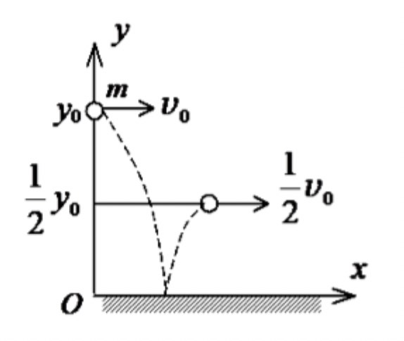
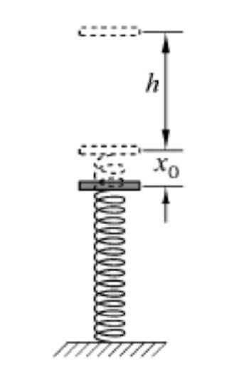
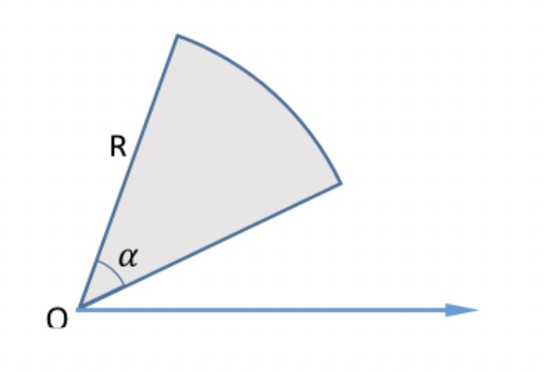
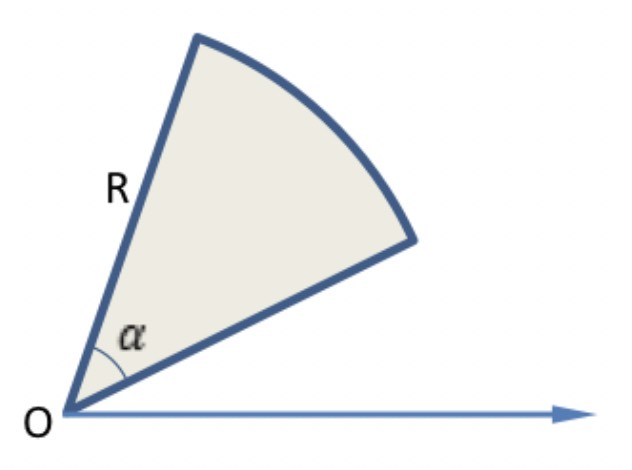
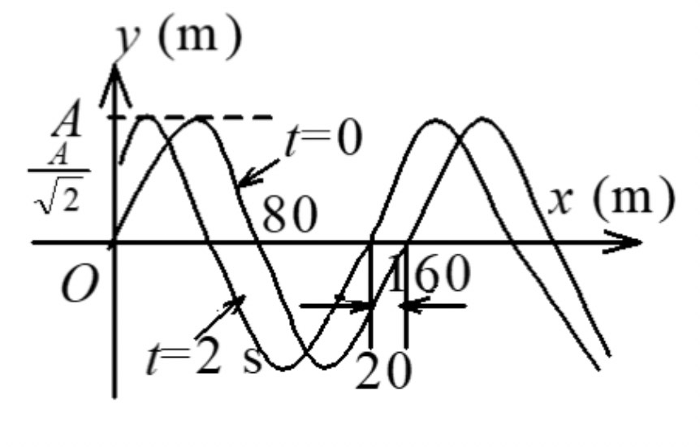

## 2019-2020学年上学期期中试卷（A）（含答案）

### 一、选择题（每题 3 分，共 18 分）

1. 假设一质点做直线运动，下列论断中哪项不正确。（ ）

    A. 若合外力与运动方向一致，运动速度增加

    B. 若合外力与运动方向相反，运动速度减少

    C. 若合外力与运动方向一致，运动位移增加

    D. 若合外力与运动方向相反，运动位移减少

    

    
答案：

    D

    

    ***

2. 宇宙飞船关闭发动机返回地球的过程，可以认为是仅在地球万有引力作用下运动。若用 $m$ 表示飞船质量，$M$ 表示地球质量，$G$ 表示引力常量，则飞船从距地球中心 $r_1$ 处下降到 $r_2$ 处的过程中，动能的增量为（ ）。

    A. $\dfrac{GmM}{r_2}$

    B. $\dfrac{GmM}{r_2^2}$

    C. $GmM\dfrac{r_1-r_2}{r_1r_2}$

    D. $GmM\dfrac{r_1-r_2}{r_1^2r_2^2}$

    

    
答案：

    C

    

    ***

3. 一子弹以水平速度 $v_0$ 射入一静止于光滑水平面上的木块后，随木块一起运动。对于这一过程正确的分析是（ ）。

    A. 子弹、木块组成的系统机械能守恒

    B. 子弹、木块组成的系统水平方向的动量守恒

    C. 子弹所受的冲量等于木块所受的冲量

    D. 子弹动能的减少等于木块动能的增加

    

    
答案：

    B

    

    ***

4. 两物体的转动惯量相等，当其转动的角速度之比为 $2:1$ 时，两物体的动能之比为（ ）。

    A. $4:1$

    B. $2:1$

    C. $\sqrt2:1$

    D. $1:\sqrt2$

    

    
答案：

    A

    

    ***

5. 一弹簧振子，重物的质量为 $m$，弹簧的劲度系数为 $k$，该振子作振幅为 $A$ 的简谐振动。当重物通过平衡位置且向规定的正方向运动时，开始计时。则其振动方程为（ ）。

    A. $x=A\cos\left(\sqrt{k/m}\,t+\dfrac12\pi\right)$

    B. $x=A\cos\left(\sqrt{k/m}\,t-\dfrac12\pi\right)$

    C. $x=A\cos\left(\sqrt{m/k}\,t+\dfrac12\pi\right)$

    D. $x=A\cos\left(\sqrt{m/k}\,t-\dfrac12\pi\right)$

    

    
答案：

    B

    

    ***

6. 一平面简谐波沿 $x$ 轴负方向传播。已知 $x=b$ 处质点振动方程为 $y=A\cos(\omega t+\phi_0)$，波速为 $u$，则波的表达式为（ ）。

    A. $y=A\cos\left[\omega t+\dfrac{b+x}{u}+\phi_0\right]$

    B. $y=A\cos\left\{\omega\left[t-\dfrac{b+x}{u}\right]+\phi_0\right\}$

    C. $y=A\cos\left\{\omega\left[t+\dfrac{x-b}{u}\right]+\phi_0\right\}$

    D. $y=A\cos\left\{\omega\left[t+\dfrac{b-x}{u}\right]+\phi_0\right\}$

    

    
答案：

    C

    

***

### 二、填空题（每空 2 分，共 30 分）

1. 若一质点的运动轨迹为 $\vec r=5t^2\vec i+3t\vec j+(10-3t)\vec k$，则任意 $t$ 时刻质点的速度为 $\underline{\qquad}$；加速度为 $\underline{\qquad}$。

    

    
答案：

    $10t\vec i+3\vec j-3\vec k$；$10\vec i$

    

    ***

2. 质量为 $m$ 的子弹，水平射入质量为 $M$、置于光滑水平面上的沙箱，子弹在沙箱中前进距离 $l$ 而静止，同时沙箱向前运动的距离为 $s$，此后子弹与沙箱一起以共同速度 $v$ 匀速运动，则子弹受到的平均阻力 $F=\underline{\qquad}$，子弹射入时的速度 $v_0=\underline{\qquad}$。沙箱与子弹系统损失的机械能 $\Delta E=\underline{\qquad}$。

    

    
答案：

    $$F=\frac{Mv^2}{2s},$$

    $$v_0=v\sqrt{\frac{M}{ms}(s+l)+1}\quad\text{或者}\quad\frac{(M+m)v}{m},$$

    $$\Delta E=\frac{Ml}{2s}v^2\quad\text{或}\quad\frac12m\left[\frac{M+m}{m}v\right]^2-\frac12(M+m)v^2.$$

    

    ***

3. 质量为 $M$ 的小球自高为 $y_0$ 处沿水平方向以速率 $v_0$ 抛出，与地面碰撞后跳起的最大高度为 $y_0/2$，水平速率为 $v_0/2$，则碰撞过程中，地面对小球的竖直冲量为 $\underline{\qquad}$；地面对小球的水平冲量为 $\underline{\qquad}$。

    

    

    
答案：

    $M\left(\sqrt{gy_0}+\sqrt{2gy_0}\right)$；$\dfrac12Mv_0$

    

    ***

4. 质量为 $m$ 的质点以恒定速度 $\vec v$ 运动了 10 秒，则质点相对其出发点的角动量为 $\underline{\qquad}$。

    

    
答案：

    $0$

    

    ***

5. 一弹簧振子作简谐振动，振幅为 $A$，周期为 $T$，其运动方程用余弦函数表示。若 $t=0$ 时，（1）振子在负的最大位移处，则初相为 $\underline{\qquad}$；（2）振子在平衡位置向正方向运动，则初相为 $\underline{\qquad}$；（3）振子在位移为 $A/2$ 处，且向负方向运动，则初相为 $\underline{\qquad}$。

    

    
答案：

    （1）$\pi$；（2）$-\pi/2$；（3）$\pi/3$

    

    ***

6. 一横波的表达式是 $y=0.02\sin2\pi(100t-40x-0.04\pi)\ (\mathrm{SI})$，则振幅是 $\underline{\qquad}$，波长是 $\underline{\qquad}$，频率是 $\underline{\qquad}$，波的传播速度是 $\underline{\qquad}$。

    

    
答案：

    $2\ \mathrm{cm}$；$2.5\ \mathrm{cm}$；$100\ \mathrm{Hz}$；$250\ \mathrm{cm/s}$

    

***

### 三、计算题（第 1、2、3、5 题，每题 10 分；第 4 题 12 分，共 52 分）

1. 已知质量为 $m$ 的小球受合外力影响做加速直线运动。假设在 $t=t_0$ 时刻，小球的位置为 $x=x_0$，速度为 $v=v_0$。求：（10 分）

    （1）若合外力 $F=k_1t$，在任意时刻 $t$ 小球的速度 $v$；

    （2）若合外力 $F=-k_2v$，在任意时刻 $t$ 小球的速度 $v$；

    （3）若合外力 $F=-k_3x$，在任意位置 $x$ 小球的速度 $v$。

    

    
解：

    答案汇总页给出：

    （1）$\displaystyle v=v_0+\frac{k_1}{m}(t-t_0)$。 3分

    （2）$\displaystyle v=v_0e^{-\frac{k_2}{m}(t-t_0)}$。 3分

    （3）$\displaystyle v=\sqrt{v_0^2-\frac{k_3}{m}(x_1^2-x_0^2)}$。 4分

    手写解答为：

    （1）由牛顿第二定律，

    $$m\frac{dv}{dt}=F=k_1t,$$

    $$\int_{v_0}^{v}dv=\frac{k_1}{m}\int_{t_0}^{t}t\,dt,$$

    $$v=v_0+\frac{k_1}{2m}(t^2-t_0^2).$$

    （2）

    $$m\frac{dv}{dt}=F=-k_2v,$$

    $$\int_{v_0}^{v}\frac{1}{v}dv=\int_{t_0}^{t}-\frac{k_2}{m}dt,$$

    $$v=v_0e^{-\frac{k_2}{m}(t-t_0)}.$$

    （3）

    $$m\frac{dv}{dt}=F=-k_3x,$$

    $$m\frac{dv}{dx}\frac{dx}{dt}=mv\frac{dv}{dx}=-k_3x,$$

    $$\int_{v_0}^{v}v\,dv=\int_{x_0}^{x}-\frac{k_3}{m}x\,dx,$$

    $$v=\sqrt{v_0^2-\frac{k_3}{m}(x^2-x_0^2)}.$$

    :::tip
    第（1）问答案汇总页的线性式与题设 $F=k_1t$ 不符。由 $m\,dv/dt=k_1t$ 积分可知，手写解答 $v=v_0+\dfrac{k_1}{2m}(t^2-t_0^2)$ 正确。
    :::

    

    ***

2. 一质量 $m=80\ \mathrm{kg}$ 的物体 A 自 $h=2\ \mathrm{m}$ 处落到弹簧上，如图所示。当弹簧从原长向下压缩 $x_0=0.2\ \mathrm{m}$ 时，物体再被弹回。（$g=9.8\ \mathrm{m/s^2}$）（10 分）

    试求弹簧下压 $0.1\ \mathrm{m}$ 时物体的速度。

    如果把该物体静置于弹簧上，求弹簧将被压缩多少？

    

    

    
解：

    物体和弹簧组成系统，选弹簧原长处为弹性势能和重力势能零点。利用机械能守恒定律。

    当压缩到 $x_0=0.2\ \mathrm{m}$ 时有：

    $$mgh=\frac12kx_0^2-mgx_0.\tag{1}$$

    当压缩到 $x_1=0.1\ \mathrm{m}$ 时有：

    $$mgh=\frac12kx_1^2+\frac12mv^2-mgx_1.\tag{2}$$

    联立解（1）、（2）得：

    $$v=\sqrt{2g(h+x_1)-\frac{2g(h+x_0)}{x_0^2}x_1^2}=5.5\ \mathrm{m/s}.$$

    $$k=\frac{2mg(h+x_0)}{x_0^2}.$$

    把物体静置于弹簧上时，最终重力与弹力达到平衡，因而有

    $$mg-kx=0.$$

    此时弹簧将被压缩

    $$x=\frac{x_0^2}{2(h+x_0)}=9.1\times10^{-3}\ \mathrm{m}.$$

    

    ***

3. 质量为 $m$ 的质点在 Oxy 平面内运动，其运动学方程为 $\vec r=a\cos\omega t\,\vec i+b\sin\omega t\,\vec j$。（10 分）

    （1）试求 $t$ 时刻质点的动量；

    （2）试求从 $t=0$ 到 $t=2\pi/\omega$ 这段时间内质点受到的合力的冲量，并说明在上述时间内，质点的动量是否守恒？为什么？

    

    
解：

    （1）由质点运动学方程可得质点速度

    $$\vec v=\frac{d\vec r}{dt}=-\omega a\sin\omega t\,\vec i+\omega b\cos\omega t\,\vec j.\qquad 2\text{分}$$

    动量为：

    $$\vec p=m\vec v=-m\omega a\sin\omega t\,\vec i+m\omega b\cos\omega t\,\vec j.\qquad 2\text{分}$$

    （2）根据动量定理，合力的冲量为

    $$\vec I=\vec p\left(\frac{2\pi}{\omega}\right)-\vec p(0)=0.\qquad 2\text{分}$$

    虽然 $t=0$ 和 $t=2\pi/\omega$ 时，质点的动量是相等的，但在这时间段内，由（1）中的动量表达式可知，动量是时间的函数并非常数。 2分

    结论：故质点的动量不守恒。 2分

    

    ***

4. 有一均匀的扇形板水平放置，板的总质量为 $M$，半径为 $R$，张角为 $\alpha$，如图所示。该板可以绕通过其顶点 O 的竖直轴在水平方向上无摩擦地转动。今在板的弧形边沿站一个质量为 $m$ 的人，二者当初处于相对地面静止的状态。问：（12 分）

    （1）板对竖直轴的转动惯量是多少？

    （2）人沿板的圆弧边沿在板上逆时针走 $\theta$ 角度（相对板）后，板相对地面转动的角度如何？

    

    

    
解：

    

    （1）根据转动惯量的定义，可以计算板对竖直轴的转动惯量为

    $$J=\int_0^R\int_0^\alpha\left(\frac{M}{\frac{\alpha}{2\pi}(\pi R^2)}\right)(\rho\,d\theta\,d\rho)\rho^2=\frac{MR^2}{2}.$$

    （2）已用 $\phi$ 和 $\psi$ 分别表示人和板相对地面的角位移，则它们相对地面的角速度分别为 $\omega=d\phi/dt$ 和 $\Omega=d\psi/dt$。人和板构成的系统角动量守恒，因此有

    $$\left(\frac{MR^2}{2}\right)\Omega+(mR^2)\omega=0.$$

    由此得到

    $$\left(\frac{MR^2}{2}\right)\frac{d\psi}{dt}=-(mR^2)\frac{d\phi}{dt}.$$

    两边同时乘以 $dt$，并对角度积分

    $$\int_0^X(mR^2)d\phi=-\int_0^Y\left(\frac{MR^2}{2}\right)d\psi,$$

    （$X$ 和 $Y$ 分别是人和板相对地面的角位移）得到 $mX=-MY/2$。

    又 $X-Y=\theta$，得到板相对地面逆时针转动

    $$Y=-\frac{2m\theta}{2m+M}.$$

    

    ***

5. 图示一平面余弦波在 $t=0$ 时刻与 $t=2\ \mathrm{s}$ 时刻的波形图。已知波速为 $u$，求：（1）坐标原点处介质点的振动方程；（2）该波的波动表达式。（10 分）

    

    

    
解：

    （1）比较 $t=0$ 时刻波形图与 $t=2\ \mathrm{s}$ 时刻波形图，可知此波向左传播。在 $t=0$ 时刻，O 处质点：

    $$0=A\cos\phi,\qquad 0<v_0=-A\omega\sin\phi,$$

    $$\phi=-\frac12\pi.\qquad 2\text{分}$$

    又 $t=2\ \mathrm{s}$，O 处质点位移为：

    $$A/\sqrt2=A\cos\left(4\pi\nu-\frac12\pi\right),$$

    所以：

    $$-\frac14\pi=4\pi\nu-\frac12\pi,$$

    $$\nu=1/16\ \mathrm{Hz}.\qquad 2\text{分}$$

    振动方程为：

    $$y_0=A\cos\left(\frac{\pi t}{8}-\frac12\pi\right)\quad(\mathrm{SI}).\qquad 1\text{分}$$

    （2）波速：

    $$u=20/2\ \mathrm{m/s}=10\ \mathrm{m/s}.$$

    波长：

    $$\lambda=u/\nu=160\ \mathrm{m}.\qquad 2\text{分}$$

    波动表达式：

    $$y=A\cos\left[2\pi\left(\frac{t}{16}+\frac{x}{160}\right)-\frac12\pi\right]\quad(\mathrm{SI}).\qquad 3\text{分}$$

    

