## 2022-2023学年上学期期末试卷（A）

### 一、选择题（单项选择，每题 3 分，共 21 分）

1. 关于高斯定理的理解有下面几种说法，其中正确的是（ ）。

    A. 如果高斯面上 $\vec E$ 处处为零，则该面内必无电荷

    B. 如果高斯面内无电荷，则高斯面上 $\vec E$ 处处为零

    C. 如果高斯面上 $\vec E$ 处处不为零，则高斯面内必有电荷

    D. 如果高斯面内有净电荷，则通过高斯面的电场强度通量必不为零

    ***

2. 某电场的电力线分布如图 1 所示，一负电荷从 A 点移至 B 点，则正确的说法为（ ）。

    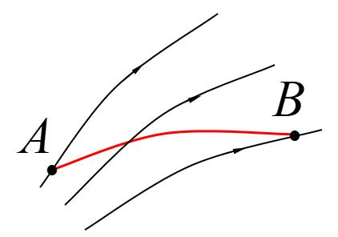

    A. 电场强度的大小 $E_A<E_B$

    B. 电势 $u_A<u_B$

    C. 电势能 $W_A<W_B$

    D. 电场力作的功 $A>0$

    ***

3. 如图 2 所示联结的三个电容器，$C_1=50\ \mu\mathrm{F}$，$C_2=30\ \mu\mathrm{F}$，$C_3=20\ \mu\mathrm{F}$，则该联结的总电容为（ ）。

    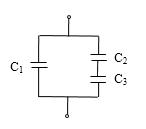

    A. $50\ \mu\mathrm{F}$

    B. $62\ \mu\mathrm{F}$

    C. $72\ \mu\mathrm{F}$

    D. $100\ \mu\mathrm{F}$

    ***

4. 在匀强磁场中，有两个平面线圈，其面积 $A_1=2A_2$，通有电流 $I_1=2I_2$，它们所受的最大磁力矩之比 $M_1/M_2$ 等于（ ）。

    A. $1$

    B. $2$

    C. $4$

    D. $1/4$

    ***

5. 一载有电流 $I$ 的细导线分别均匀密绕在半径为 $R$ 和 $r$ 的长直圆管上形成两个螺线管（$R=2r$）。两螺线管单位长度上的匝数相等。两螺线管中的磁感强度大小应满足（ ）。

    A. $B_R=2B_r$

    B. $B_R=B_r$

    C. $2B_R=B_r$

    D. $B_R=4B_r$

    ***

6. 方形导体线圈从左侧匀速进入一片匀强磁场到离开磁场过程中，线圈内感应电动势的变化图为（ ）。

    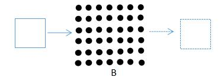

    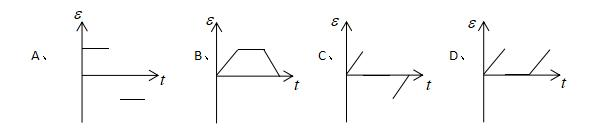

    ***

7. 在双缝干涉实验中，为使屏上的干涉条纹间距变大，可以采取的办法是（ ）。

    A. 使屏靠近双缝

    B. 使两缝的间距变小

    C. 把两个缝的宽度稍微调窄

    D. 改用波长较小的单色光源

***

### 二、填空题（每空 3 分，共 24 分）

1. 如图 3 所示，在场强为 $\vec E$ 的均匀电场中，A、B 两点间距离为 $d$。AB 连线方向与 $\vec E$ 方向一致。从 A 点经任意路径到 B 点的场强线积分 $\displaystyle\int_{AB}\vec E\cdot\mathrm{d}\vec l=\underline{\qquad}$。

    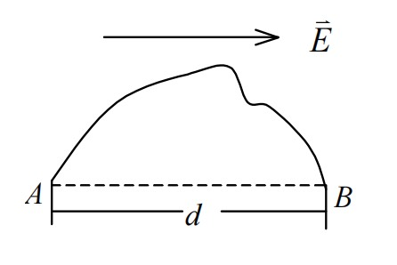

    ***

2. 在点电荷 $+2q$ 的电场中，如果取图 4 中 P 点处为电势零点，则 M 点的电势为 $\underline{\qquad}$。

    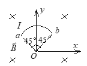

    ***

3. 如图，一根载流导线被弯成半径为 $R$ 的 $1/4$ 圆弧，放在磁感强度为 $B$ 的均匀磁场中，则载流导线 ab（电流从 a 流向 b）所受磁场的作用力的大小为 $\underline{\qquad}$，方向为 $\underline{\qquad}$。

    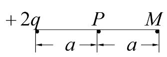

    ***

4. 在磁场空间分别取两个闭合回路，若两个回路各自包围载流导线的根数不同，但电流的代数和相同。则磁感强度沿各闭合回路的线积分 $\underline{\qquad}$；两个回路上的磁场分布 $\underline{\qquad}$。（填写：“相同”或“不相同”）

    ***

5. 如图 6，导体棒 AC 长 $L$，在匀强磁场 $B$ 中绕通过 O 点的垂直于棒长且沿磁场方向的轴 OM 转动（角速度 $\omega$ 与 $B$ 同方向），OC 的长度为棒长的 $1/3$。则 A 点比 C 点电势 $\underline{\qquad}$。（填写：“高”或者“低”）

    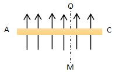

    ***

6. 如图 7 所示，折射率为 $n_2$、厚度为 $e$ 的透明介质薄膜，其上方和下方的透明介质折射率分别为 $n_1$ 和 $n_3$，已知 $n_1<n_2>n_3$。若用波长为 $\lambda$ 的单色平行光垂直入射到该薄膜上，则从薄膜上、下两表面反射的光束（用①与②示意）的光程差是 $\underline{\qquad}$。

    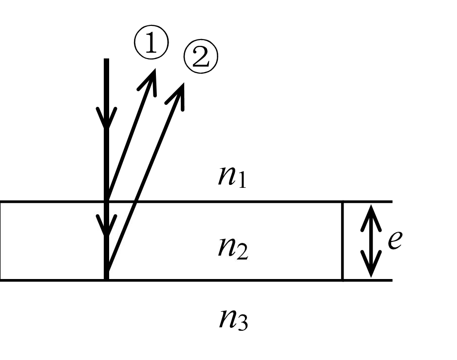

***

### 三、计算题（5 题，第 1 题 12 分，第 4 题 13 分，其余每题 10 分，共 55 分）

1. （12 分）一对无限长的同轴直圆筒，半径分别为 $R_1$ 和 $R_2$（$R_1<R_2$），筒面上都均匀带电，沿轴线单位长度的电量分别为 $\lambda_1$ 和 $\lambda_2$，试求空间的电场强度分布。

    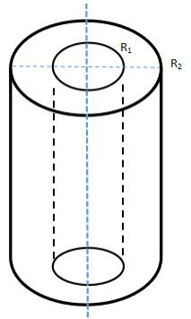

    ***

2. （10 分）在正方形四个顶点上各放置带电量为 $+q$ 的四个点电荷，各顶点到正方形中心 O 的距离为 $r$。

    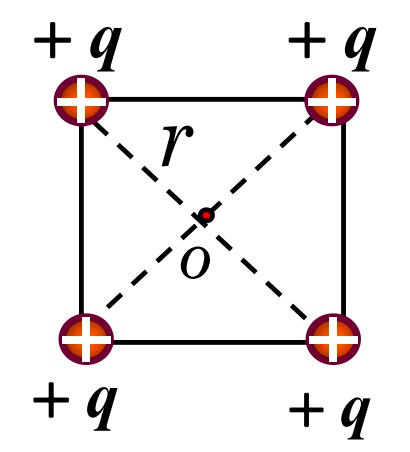

    求：

    （1）O 点的电势；

    （2）把试探电荷 $q_0$ 从无穷远处移到 O 点时电场力所作的功。

    ***

3. （10 分）两长直平行导线，每单位长度的质量为 $m=0.01\ \mathrm{kg/m}$，分别用 $l=0.04\ \mathrm{m}$ 长的轻绳，悬挂于天花板上，如右图 10 所示。当导线通以等值反向的电流时，已知两悬线张开的角度为 $2\theta=10^\circ$。求电流 $I$。

    $\left(\tan5^\circ=0.087,\ \mu_0=4\pi\times10^{-7}\ \mathrm{N\cdot A^{-2}}\right)$

    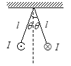

    ***

4. （13 分）如图 11 所示，两条平行长直导线和一个矩形导线框共面。且导线框的一个边与长直导线平行，他到两长直导线的距离分别为 $r_1$、$r_2$。已知两导线中电流都为 $I=I_0\sin\omega t$，其中 $I_0$ 和 $\omega$ 为常数，$t$ 为时间。导线框长为 $a$，宽为 $b$，求导线框中的感应电动势。

    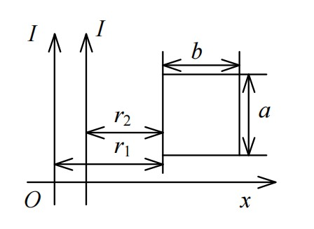

    ***

5. （10 分）在杨氏双缝干涉实验中，波长 $\lambda=600\ \mathrm{nm}$ 的单色平行光垂直入射到双缝上，双缝中心间距 $d=3\times10^{-4}\ \mathrm{m}$，屏到双缝的距离 $D=1\ \mathrm{m}$。求：

    （1）中央明纹两侧的两条第 5 级明纹中心的间距；

    （2）用一厚度 $e=5.5\times10^{-6}\ \mathrm{m}$、折射率 $n=1.33$ 的玻璃片覆盖一缝后，零级条纹将移到原来的第几级明纹处？
