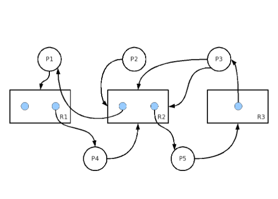
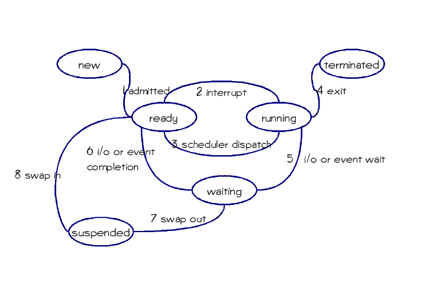
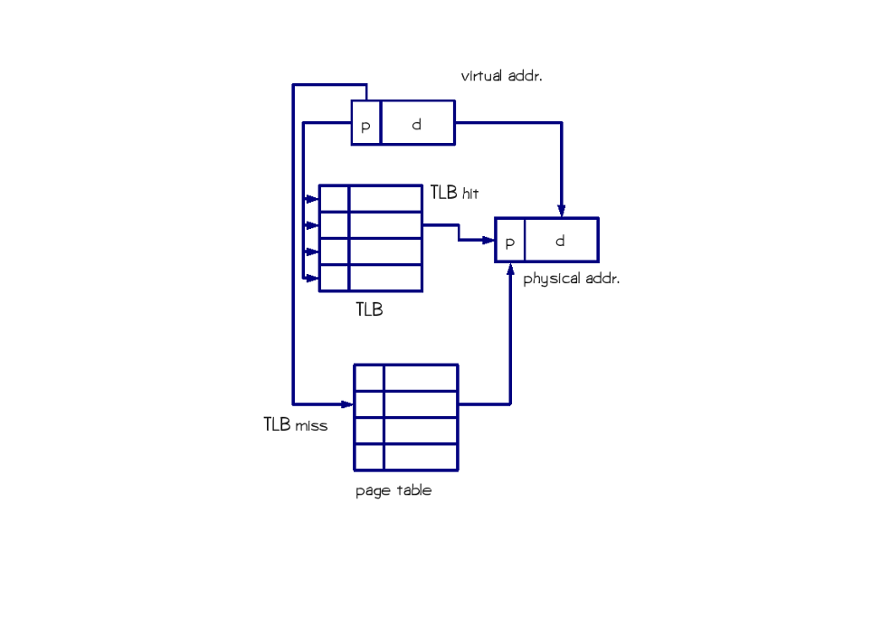

## 2007-2008学年下学期期中试卷（含答案）

### 说明

- 原卷标题：2008年度操作系统期中考试试题

### 一、（20分）

在按需调页（demand paging）中，给定页面引用串（reference string）：3, 2, 1, 0, 3, 2, 4, 3, 2, 1, 0, 4, 2, 3, 2, 1, 0, 4。

a）给定2个页框（frame），采用FIFO页面替换策略，请写出页框内页面变化过程，并计算缺页率（page fault）。（4分）

<details>
<summary>答案：</summary>

| 页面引用 | 3 | 2 | 1 | 0 | 3 | 2 | 4 | 3 | 2 | 1 | 0 | 4 | 2 | 3 | 2 | 1 | 0 | 4 |
| --- | --- | --- | --- | --- | --- | --- | --- | --- | --- | --- | --- | --- | --- | --- | --- | --- | --- | --- |
| 页框1 | 3 | 2 | 1 | 0 | 3 | 2 | 4 | 3 | 2 | 1 | 0 | 4 | 2 | 3 | 3 | 1 | 0 | 4 |
| 页框2 | NULL | 3 | 2 | 1 | 0 | 3 | 2 | 4 | 3 | 2 | 1 | 0 | 4 | 2 | 2 | 3 | 1 | 0 |
| 结果 | 错误 | 错误 | 错误 | 错误 | 错误 | 错误 | 错误 | 错误 | 错误 | 错误 | 错误 | 错误 | 错误 | 错误 | 命中 | 错误 | 错误 | 错误 |
| 调入 | 3 | 2 | 1 | 0 | 3 | 2 | 4 | 3 | 2 | 1 | 0 | 4 | 2 | 3 |  | 1 | 0 | 4 |
| 调出 |  |  | 3 | 2 | 1 | 0 | 3 | 2 | 4 | 3 | 2 | 1 | 0 | 4 |  | 2 | 3 | 1 |

缺页错误有17个。

命中有1个。

缺页率为17/18。

</details>

***

b）给定3个页框（frame），采用FIFO页面替换策略，请写出页框内页面变化过程，并计算缺页率（page fault）。（4分）

<details>
<summary>答案：</summary>

| 页面引用 | 3 | 2 | 1 | 0 | 3 | 2 | 4 | 3 | 2 | 1 | 0 | 4 | 2 | 3 | 2 | 1 | 0 | 4 |
| --- | --- | --- | --- | --- | --- | --- | --- | --- | --- | --- | --- | --- | --- | --- | --- | --- | --- | --- |
| 页框1 | 3 | 2 | 1 | 0 | 3 | 2 | 4 | 4 | 4 | 1 | 0 | 0 | 2 | 3 | 3 | 1 | 0 | 4 |
| 页框2 | NULL | 3 | 2 | 1 | 0 | 3 | 2 | 2 | 2 | 4 | 1 | 1 | 0 | 2 | 2 | 3 | 1 | 0 |
| 页框3 | NULL | NULL | 3 | 2 | 1 | 0 | 3 | 3 | 3 | 2 | 4 | 4 | 1 | 0 | 0 | 2 | 3 | 1 |
| 结果 | 错误 | 错误 | 错误 | 错误 | 错误 | 错误 | 错误 | 命中 | 命中 | 错误 | 错误 | 命中 | 错误 | 错误 | 命中 | 错误 | 错误 | 错误 |
| 调入 | 3 | 2 | 1 | 0 | 3 | 2 | 4 |  |  | 1 | 0 |  | 2 | 3 |  | 1 | 0 | 4 |
| 调出 |  |  |  | 3 | 2 | 1 | 0 |  |  | 3 | 2 |  | 4 | 1 |  | 0 | 2 | 3 |

缺页错误有14个。

命中有4个。

缺页率为14/18=7/9。

</details>

***

c）简述什么是Belady异常（Belady's Anomaly）。（3分）

<details>
<summary>答案：</summary>

belady异常指的是随着可分配的页数的增加，页错误率反而增加的现象

</details>

***

d）简述什么是最近最少使用策略（LRU）。（3分）

<details>
<summary>答案：</summary>

least recently used 指的是在帧满时，将最近最久未使用的的页替换掉

</details>

***

e）试证明，采用LRU策略时，在相同的时刻，页框数目多时，页框内页面集合一定包含了页框数目少时的所有页面，故而不会出现Belady异常（提示：可对时间运用数学归纳法）。（6分）

<details>
<summary>答案：</summary>

假设该LRU算法由CPU的计数器来实现，即每次内存引用，cpu计数器加1，并将该值赋给该页。

1）显然当页框数为n时，若页数小于n，则页框内包含所有页，此时当页框数为n+1时，同理也框内也包含所有页。

2）若页数大于n时，n个页框内包含的页为最近刚使用过的n个页，即与页相关联的计数器最大的n个，当页框数为n+1，n+1个页框内包含的是最近刚使用过的n+1个页，即与页相关联的计数器最大的n+1个，因为无论页框数是n还是n+1，cpu引用页的顺序是不变的，所以同一时刻最大的n+1个页必包含最大的n个页。因此n个页框数可以命中的，n+1个页框数也一定命中，n个页框数不能命中的，n+1个页框数也有可能命中，所以不会出现belady异常。

</details>

***

### 二、（20分）

给定如下的资源请求、分配图（包含5个进程P1-P5，3类资源R1-R3），假定五个进程已提出对所有资源的请求：



a）请写出可用资源向量（available vector）、资源分配矩阵（allocation matrix）、最大资源需求矩阵（max matrix）。（3分）

<details>
<summary>答案：</summary>

available vector：available[1]=1, available[2]=0, available[3]=1

:::tip
此处原答案文字写为 `available[3]=1`，但同一答案表格中的 AVAILABLE 为 `1 0 0`，两处不一致；此处均按原答案保留。
:::

|  | ALLOCATION R1 | ALLOCATION R2 | ALLOCATION R3 | MAX R1 | MAX R2 | MAX R3 | AVAILABLE R1 | AVAILABLE R2 | AVAILABLE R3 |
| --- | --- | --- | --- | --- | --- | --- | --- | --- | --- |
| P1 | 0 | 1 | 0 | 1 | 1 | 0 | 1 | 0 | 0 |
| P2 | 0 | 0 | 0 | 0 | 1 | 0 |  |  |  |
| P3 | 0 | 0 | 1 | 0 | 2 | 1 |  |  |  |
| P4 | 1 | 0 | 0 | 1 | 1 | 0 |  |  |  |
| P5 | 0 | 1 | 0 | 0 | 1 | 1 |  |  |  |

</details>

***

b）请判断当前是否处于安全状态（safe state），请写出判断的依据（过程）？（6分）

<details>
<summary>答案：</summary>

|  | NEED R1 | NEED R2 | NEED R3 | AVAILABLE R1 | AVAILABLE R2 | AVAILABLE R3 |
| --- | --- | --- | --- | --- | --- | --- |
| P1 | 1 | 0 | 0 | 1 | 0 | 0 |
| P2 | 0 | 1 | 0 |  |  |  |
| P3 | 0 | 2 | 0 |  |  |  |
| P4 | 0 | 1 | 0 |  |  |  |
| P5 | 0 | 0 | 1 |  |  |  |

处于不安全状态，因为假设存在顺序`<PI1,PI2.PI3,PI4,PI5>`因为AVAILABLE为1 0 0，所以PI1只能等度P1，P1执行后AVAILABLE= (2 0 0) 此时不能再进行，不安全。

</details>

***

c）试论述说明，判断安全状态时，尝试资源分配的次序不影响最终结果。（5分）

<details>
<summary>答案：</summary>

判断安全状态时，系统遍历所有可能的次序，PI1,PI2,PI3,…PIN,当找到一个顺序满足安全状态时，则说明现状满足安全状态而我们的目的只是判断现状是否满足安全状态，只有当遍历完所有的顺序后仍不满足，才能说明该现状不是安全状态，因此尝试资源分配的次序不影响最终的结果。

若现状不是安全状态，则无论哪种顺序都要遍历完所有的顺序。

若现状是安全状态，则无论哪种次序都将在遍历所有中最后一个之前（包括最后一个）判断出该状态时安全状态

</details>

***

d）如果进程P1-P5按优先级从高到低排序，且高优先级进程能够剥夺（preempt）低优先级已分配到的资源，当前是否存在死锁？（2分）

<details>
<summary>答案：</summary>

不存在死锁。

因为存在优先级，而每个进程所需要的每个资源的实例小于该资源拥有的实例，所以不会出现死锁

</details>

***

e）处于不安全状态是否一定出现死锁？如果一定出现死锁请证明之，否则请描述两种不安全但不出现死锁的情况。（4分）

<details>
<summary>答案：</summary>

处于不安全状态不一定出现死锁，但处于安全状态一定不会出现死锁。

1. 对系统进行安全性检测的时候是根据进程的最大资源需求进程的，而时间运行过程中进程可能不需要那么多的资源，所以哪怕系统进入了不安全状态也不一定会导致死锁。

2. 系统中的各个进程并不一定都要执行完毕的，有些会在执行到一半的时候被注销掉，收回其占有的所有资源。（原因有很多，可能是父进程销毁它，也可能是它执行的时候发生异常、错误等，如除0操作）。所有也可能导致本处于不安全状态的几个进程最终没有死锁地执行完毕。

</details>

***

### 三、（20分）

给定双向单车道桥要求（同时满足）：

任意时刻只有一个方向的车辆能够在桥上通行，另一个方向的车辆必须在桥下等待；

任意时刻桥上只能有2辆车在桥上通行，其它车辆必须在桥下等待；

等待另一方向车辆下桥的车辆不能无限制等待。

请使用信号量（semaphore）实现该问题：

a）请说明使用几个信号量，其初始值，以及其含义。（4分）

<details>
<summary>答案：</summary>

分为2组，L（车从左到右）,R（车从右到左）,互斥，用信号量mutex表示，初始值为1

在L的情况下，用信号量mutexL表示一次最多2辆车，初始值为2

在R的情况下，用信号量mutexR表示一次最多2辆车，初始值为2

在L的情况下，用 2-MutexLL表示在获取桥后已经通过的车的数量， 初始值为2

在R的情况下，用 2-MutexRR表示在获取桥后已经通过的车的数量， 初始值为2

</details>

***

b）请写出控制左向右车辆的程序代码和控制右向左车辆的程序代码。（12分）

<details>
<summary>答案：</summary>

左向右：

```c
If(mutex<=0&&mutexL<2)
{
    Wait(mutexL)
    PASS
    Wait（mutexLL）
    Signal(mutexL)
    If(mutexL==2)
        Signal(mutex)
    If（mutexLL==0）
    {
        Signal（mutexLL）
        Signal（mutexLL）
        Signal（mutex）
    }
}
Else
{
    wait(mutex)
    wait(mutexL)
    pass
    wait（mutexLL）
    if(mutexL==2)
        signal(mutex)
    if（mutexLL==0）
    {
        Signal（mutexLL）
        Signal（mutexLL）
        Signal（mutex）
    }
}
```

右向左：

```c
if(mutex<=0&&mutexL<2)//已有同向车在桥上，可行
{
    wait(mutexR)
    Passs
    Wait（mutexRR）
    Signal(mutexR)
    If (mutexR==2)
        Signal(mutex)
    If（mutexRR==0）
    {
        Signal（mutexRR）
        Signal（mutexRR）
        Signal（mutex）
    }
}
Else
{
    wait(mutex)
    Wait(mutexR)
    PASS
    Wait（mutexRR）
    Signal（mutexR）
    If(mutexR==2)
        Signal(mutex)
    If（mutexRR==0）
    {
        Signal（mutexRR）
        Signal（mutexRR）
        Signal（mutex）
    }
}
```

</details>

***

c）请说明你的代码不会出现死锁，且满足以上列出的三个条件。（4分）

<details>
<summary>答案：</summary>

死锁：因为两边对称，故仅以从左到右的代码来分析不会出现死锁。

设车A将从左往右行驶 

若mutex==0，则说明当前桥上有车，若mutexL\<2则说明该桥上的车为从左到右行驶的，故车A可以向前行驶，wait（mutexL）,当mutexL>0时，通过，signal（mutexL） 结束后若mutexL==2,说明桥上已经没有车了，故执行signal（mutex），使左右的车再一次同时开始竞争桥

若mutex=0，mutelR==2,则说明桥上的车为从右向左行驶，此时mutexR必然小于2，步骤类比同上，当mutex=1时，左右开始竞争该桥

若mutex=1，说明桥上没车，于是wait（mutex）争得该桥，pass，signal（mutexR）,若mutexR==2时，说明桥上没从左向右的车了，于是signal（mutex），左右再次开始竞争

而mutexRR和mutexLL的作用为，使一方等待的车最多等待2辆相反方向的车，即若某次竞争被左到右的车竞争到，若做到右的车有100万辆，则经过2个pass，mutexLL变为0，2次signal（mutexRR）,一次signal（mutex），使两方又开始竞争了，

满足三个条件：

1. Mutex的特性使它满足1，具体见阐释死锁部分

2. MutexR，mutexL的特性使它满足2，具体见阐释死锁部分

3. MutexRR,mutexLL的性质使它满足3，具体见阐述死锁部分

</details>

***

### 四、（20分）

请说明以下进程状态转换图中状态转换的箭头方向（每个1分），并例举中每一种状态转换的一个例子（每个1.5分）。



<details>
<summary>答案：</summary>

1. New->ready  新进程创建后处于ready状态

2. running->ready 正在运行的进程收到I/O中断，回到就绪队列

3. ready->running 进程调度算法将就绪队列中的一个进程交给cpu执行

4. running->terminated 结束进程

5. runnint->waiting 等待I/0，进程进入waiting

6. waiting->ready I/O完成，进程再次进入就绪队列

7. waiting->suspended 内存将满，操作系统内存管理将不常用的进程调入虚拟内存

8. suspended->ready 需要执行，但该页不在内存中，从虚拟内存中取出该页，并加入就绪队列

</details>

***

### 五、（10分）

请给出进程与线程的定义（4分），并简述在一个多进程、多线程，且支持内核线程（kernel thread）的系统中，进程与线程在地址空间、CPU调度上的的主要联系与区别（6分）。

<details>
<summary>答案：</summary>

进程：进程是一个具有独立功能的程序关于某个数据集合的一次运行活动。它可以申请和拥有系统资源，是一个动态的概念，是一个活动的实体。它不只是程序的代码，还包括当前的活动，通过程序计数器的值和处理寄存器的内容来表示。

线程：程(thread),有时被称为轻量级进程 (Lightweight Process，LWP)，是程序执行流的最小单元。一个标准的线程由线程ID，当前指令指针(PC)，寄存器集合和堆堆栈组成。

联系与区别：线程和进程的区别在于,子进程和父进程有不同的代码和数据空间,而多个线程则共享数据空间,每个线程有自己的执行堆栈和程序计数器为其执行上下文.多线程主要是为了节约CPU时间,发挥利用,根据具体情况而定. 线程的运行中需要使用计算机的内存资源和CPU

通常在一个进程中可以包含若干个线程，它们可以利用进程所拥有的资源。在引入线程的操作系统中，通常都是把进程作为分配资源的基本单位，而把线程作为独立运行和独立调度的基本单位。由于线程比进程更小，基本上不拥有系统资源，故对它的调度所付出的开销就会小得多，能更高效的提高系统内多个程序间并发执行的程度。

</details>

***

### 六、（10分）

采用如下图的机制实现采用旁路转换缓存（或称为快表，TLB）的逻辑地址到物理地址的翻译。已知TLB的命中率为60%，TLB的平均访问时间为10ns，内存的访问时间为200ns，页表存储在内存中。请计算CPU对内存的有效访问时间（effective access time）（5分）。若要将有效访问时间减少到120ns以下，需要将TLB的命中率提高到多少？（5分）



<details>
<summary>答案：</summary>

根据题意内存访问时间为200ns包括访问页表和方位内容，所以单独访问内存时间为100ns

有效访问时间：$(100+10)\times0.6+200\times0.4=66+80=146\text{ns}$

$110\times x+200\times(1-x)=120$

$80=90x$

$x=8/9=88.9\%$

</details>
