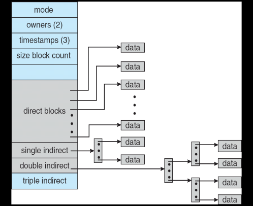

## 2008-2009学年下学期期末试卷（A）（含答案）

### 一、（15'）是非题（以下结论正确的请标T，错误的请标F并改正）（3'x5）

1. 线程都保存有各自的栈信息和CPU状态（寄存器、指令计数器等）。

    <details>
    <summary>答案：</summary>

    T

    </details>

    ***

2. 页表由各个进程自己管理，进程可在用户态对页表进行更新。

    <details>
    <summary>答案：</summary>

    F

    </details>

    ***

3. 单CPU环境下由于任何时刻只有一个进程（线程）能够运行，因此操作系统不需要实现同步与互斥支持。

    <details>
    <summary>答案：</summary>

    F

    </details>

    ***

4. 在微内核结构的操作系统中，CPU调度必然在微内核内。

    <details>
    <summary>答案：</summary>

    T

    </details>

    ***

5. 在抢占式（preemptive）操作系统中，进程不会因为申请、使用资源发生死锁。

    <details>
    <summary>答案：</summary>

    T

    </details>

***

### 二、（18'）单项选择题（3'x6）

1. 以下哪一种程序（或程序片段）会自我复制、传播，进而威胁系统的安全？

    A. 计算机病毒

    B. 特洛伊木马

    C. 逻辑炸弹

    D. 操作系统自举（bootstrap）文件

    <details>
    <summary>答案：</summary>

    A

    </details>

    ***

2. 以下哪一种机制能够帮助系统管理员抵御拒绝攻击（Denial of Service）？

    A. 加密

    B. 认证

    C. 访问控制矩阵

    D. 防火墙

    <details>
    <summary>答案：</summary>

    D

    </details>

    ***

3. 以下哪种机制提供了最佳的位置透明（transparency）性？

    A. 通过 http://www.sei.ecnu.edu.cn/ 访问学院主页

    B. 通过 telnet 166.111.8.238 访问清华大学水木清华 BBS

    C. 通过 msn messenger 和好友聊天

    D. 在 windows 下通过 \\server 访问服务器共享目录和设备

    <details>
    <summary>答案：</summary>

    C

    </details>

    ***

4. 以下对于目录及其实现的描述，错误的是：

    A. 目录是文件的集合，是一种逻辑概念，通常用文件实现

    B. 目录文件中存放的就是目录中文件的文件控制块（file control block）

    C. 目录中可以有子目录，形成嵌套结构

    D. 目录中的“.”和“..”通常分别代表该目录本身和其父目录

    <details>
    <summary>答案：</summary>

    B

    </details>

    ***

5. 以下哪种存储设备通常只支持顺序访问？

    A. 光盘

    B. 磁盘

    C. 磁带

    D. U盘

    <details>
    <summary>答案：</summary>

    C

    </details>

    ***

6. 以下哪个功能不是由设备驱动程序提供的？

    A. 提供标准的设备访问系统调用（如 open(), read() 等）

    B. 提供中断处理程序

    C. 提供 DMA 控制功能

    D. 提供内核直接访问设备的接口

    <details>
    <summary>答案：</summary>

    C

    </details>

***

### 三、（20'）简答题

1. 请简单比较程序控制输入输出（programmed I/O）和直接内存访问（DMA）的区别，并解释为什么DMA对于高速I/O访问效率较高。（5'）

    <details>
    <summary>答案：</summary>

    PIO时，CPU需要介入每一次数据交换；DMA方式时，CPU只在数据交换开始／结束时介入，其它时候，由DMA控制器协调I/O设备和内存利用总线进行数据交换。由于此时CPU和I/O设备几乎并行，因此与PIO方式相比，节省了大量中断、CPU介入时间。

    </details>

    ***

2. 请简述在一个支持有向无环图目录结构的文件系统中，删除一个普通文件（非目录文件）时操作系统需要执行哪些操作。（5'）

    <details>
    <summary>答案：</summary>

    查看／更新引用计数，如果为零，更新目录文件，释放FCB，释放磁盘数据块

    </details>

    ***

3. 请简述磁盘访问效率由哪些部分决定，并分析如何提高文件系统中顺序访问文件的效率。（5'）

    <details>
    <summary>答案：</summary>

    定位时间＋传输速度。前者又包括：旋转速度和寻道事件

    </details>

    ***

4. 请简述分布式操作系统和网络操作系统的区别，并列举至少三个分布式操作系统难于实现的原因。（5'）

    <details>
    <summary>答案：</summary>

    DOS是网络连接的计算机上的一个操作系统，NOS是支持网络的操作系统。难点：1) 网络传输代价／延迟大；2) 网络／远程节点错误，且常常不可知；3) 集中控制难／代价大；4) 无全局时钟

    </details>

***

### 四、（25'）计算题

1. （15'）假设有文件系统使用i-node如图所示。其中一个磁盘块大小为4KB，一个磁盘块指针大小为32位（4B），直接块（direct block）大小为2KB，其它索引块大小和一个磁盘块一样大小。假设有一个4MB大小的文件，其i-node已在内存中（direct block也在内存中），文件的其它部分都在磁盘上，不考虑缓存。请问：

    a) 访问其第一个字节，第1K个字节，第1M个字节，第2M个字节，第3M个字节，和最后一个字节分别需要访问几个磁盘块（2'x5=10）？

    b) 该文件系统最大能支持多大的文件(5')？

    

    <details>
    <summary>答案：</summary>

    a) 1K: 1, 1M: 1, 2M: 1, 3M: 2, 最后：2

    b) 2K/4*4K+4K/4*4K+4K/4*4K/4*4K

    </details>

    ***

2. （10'）设现有磁头访问请求队列98，83，137，122，14，124，67，65，当前磁头位置为50。请：

    a) 分别计算最短寻道时间优先（SSTF）算法和SCAN算法所需的磁头移动距离（3'x2）

    b) 请比较以上两种方法的优缺点（4'）。

    <details>
    <summary>答案：</summary>

    a) SSTF: |50-65|+|65-67|+|67-83|+|83-98|+|98-122|+|122-124|+|124-137|+|137-14|=15+2+16+15+24+2+13+123=210

    SCAN: |50-14|+|14-65|+|65-67|+|67-83|+|83-98|+|98-122|+|122-124|+|124-137|=36+51+2+16+15+24+2+13=159

    b) SSTF未必最优，反而可能引起饥饿和不必要的抖动。SCAN和方向有关。

    </details>

***

### 五、（22'）计算、设计题

设有一个文件系统，文件数据块（磁盘块）大小为4KB，每个文件数据块指针大小为4B（32位）。该文件系统需要支持以下操作：

```c
int read (int fd, int pos, int len, int *buf);
int write (int fd, int pos, int len, int *buf);
int insert (int fd, int pos, int len, int *buf);
```

其中，fd为文件句柄（handle），pos为读／写／插入位置，以上三个函数会按照 pos x 4KB 为实际位置读／写／插入 buf 中 len x 4KB 的数据，即每次数据操作必然读／写／插入一个磁盘块大小的数据，且插入位置的偏移量正好是4KB的整数倍。

1. 请分别详细描述如何在连续磁盘块分配、链接分配、索引分配情况下实现插入操作（3'x3）；

    <details>
    <summary>答案：</summary>

    连续：是否能扩展？如果能：移动插入点以后部分，插入；否则，寻找连续空间，移动插入点前和后部分，然后插入。

    链接：重新计算插入点位置，插入点开始，重新分配；删除原来的数据块。（还有很多其它实现方法）

    索引：分配块，复制数据，移动索引指针。

    </details>

    ***

2. 不考虑缓存，不考虑连续分配时空间不够的情况，请详细分析以上三种实现每次读／写／插入操作需要访问多少次磁盘（2x3'）；

    <details>
    <summary>答案：</summary>

    连续：读：1，写：1，插入：插入点后块个数*2＋1

    链接：读：1到2次，写：1到2次，插入：插入点后块个数*2＋1或2

    索引：1＋插入索引项后的索引块个数＋1

    </details>

    ***

3. 请问以上哪种方式最不适合这一场景？哪种方式最适合这一场景？为什么？（2x2'）

    <details>
    <summary>答案：</summary>

    链接最不适合：非对齐

    索引最适合：移动代价小

    </details>

    ***

4. 假设在FCB中，还剩余256B的空间，请参考UNIX文件系统的i-node结构，设计一个多级的包含直接块和间接索引的块管理方式，并分析该方式与以上三种方式相比的优缺点。（3'）

    <details>
    <summary>答案：</summary>

    小文件读写速度快，能容纳大文件

    </details>

***

## 2008-2009学年下学期期末试卷（B）

### 一、（15'）是非题（以下结论正确的请标T，错误的请标F并改正）（3'x5）

1. 线程都保存有各自的栈信息、CPU状态（寄存器、指令计数器等）、堆信息，以及打开文件列表等。

    ***

2. 段表由各个进程自己管理，进程可在用户态对段表进行更新。

    ***

3. 分时（time-sharing）是为了在操作系统中支持同时运行多个程序，从而提高CPU的利用率而提出的。

    ***

4. Windows的实现将图形界面功能在核心态，有利于图形界面功能的效率。

    ***

5. 进程不会因为申请、使用共享资源发生死锁。

***

### 二、（18'）单项选择题（3'x6）

1. 以下哪一种程序（或程序片段）常通过伪装成其它程序，引诱用户运行，从而威胁系统的安全？

    A. 计算机病毒

    B. 特洛伊木马

    C. 逻辑炸弹

    D. 操作系统自举（bootstrap）文件

    ***

2. 以下哪一种机制能够帮助系统管理员防止攻击者窃听在公共网络上传输的数据？

    A. 加密

    B. 认证

    C. 访问控制矩阵

    D. 防火墙

    ***

3. 以下哪种网络拓扑结构对单点故障的容错性最好？

    A. 星型网络

    B. 树型网络

    C. 环型网络

    D. 全联通网络

    ***

4. 以下对于目录及其实现的描述，正确的是：

    A. 目录就是文件控制块（file control block）

    B. 目录是文件控制块的集合，它通常使用一种特殊的文件控制块实现

    C. 通过链接，文件在不同目录下可以有不同的文件名；目录虽然也可以链接，但是不能有不同目录名

    D. 根目录的父目录是其本身

    ***

5. 以下哪种存储设备不需要进行空闲块管理？

    A. 只读光盘

    B. 磁盘

    C. 磁带

    D. U盘

    ***

6. 以下哪个操作不是磁盘格式化进行的？

    A. 划分扇区和磁道

    B. 建立空闲FCB列表

    C. 建立空闲块列表

    D. 设定根目录文件

***

### 三、（20'）简答题

1. 程序控制输入输出（programmed I/O）和直接内存访问（DMA）哪种对于高速I/O访问效率较高，为什么？。（5'）

    ***

2. 请简述在一个支持有向无环图目录结构的文件系统中，链接一个普通文件（非目录文件）时操作系统需要执行哪些操作。（5'）

    ***

3. 请问哪种文件块分配方式有利于顺序访问文件的效率，为什么？。（5'）

    ***

4. 请简述实现分布式互斥的三个难点。（5'）

***

### 四、（25'）计算题

1. （15'）假设有文件系统使用i-node如图所示。其中一个磁盘块大小为4KB，一个磁盘块指针大小为32位（4B），直接块（direct block）大小为2KB，其它索引块大小和一个磁盘块一样大小。假设有一个3MB大小的文件，其i-node已在内存中（direct block也在内存中），文件的其它部分都在磁盘上，不考虑缓存。请问：

    a) 顺序访问其第1到第1K个字节，第1到第2M个字节，和整个文件分别需要访问几个磁盘块（2'x5=10）？

    b) 该文件系统最大能支持多大的文件(5')？

    

    ***

2. （10'）设现有磁头访问请求队列98，83，137，122，14，124，67，65，当前磁头位置为23。请：

    a) 分别计算最短寻道时间优先（SSTF）算法和SCAN算法所需的磁头移动距离（3'x2）

    b) SSTF是否是最优的？为什么？（4'）。

***

### 五、（22'）计算、设计题

在一个需要频繁读和追加数据（即写在文件末尾）的场合，有写操作，但没有插入操作。已知每次读或写操作都会读出或写入相当大规模的数据（但未必是磁盘块大小的整数倍），但是开始读或写的位置可能出现在文件的任何地方。

1. 请问：连续磁盘块分配、链接分配、索引分配分别是否适合这一场景，请为每一种方法分析优缺点？（5'x3）；

    ***

2. 假设在FCB中，还剩余256B的空间，请参考UNIX文件系统的i-node结构，设计一个多级的包含直接块和间接索引的块管理方式，并分析该方式与以上三种方式相比的优缺点。（7'）
