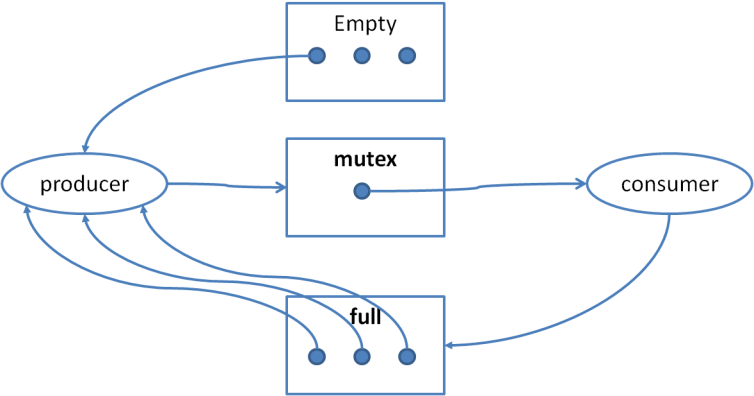

## 2009-2010学年下学期期末试卷（A）（含答案）

### 一、（15分）是非题（请判断以下论述正确与否（用T/F表示），并修正错误的论述）（每题3分）

1. 在多进程多线程操作系统中，每个进程只需要维护一个栈（stack）；

    <details>
    <summary>答案：</summary>

    F, 每个线程都需要栈

    </details>

    ***

2. 微内核操作系统中，CPU调度和虚存管理功能必须在微内核中实现；

    <details>
    <summary>答案：</summary>

    F. 虚存管理可以不在微内核中

    </details>

    ***

3. 在虚存管理时，采用先进先出（FIFO）页面替换策略，必然会发生Belady异常（即分配页框越多，缺页率反而越高）；

    <details>
    <summary>答案：</summary>

    F. 可能发生，也可能不发生

    </details>

    ***

4. 对于键盘这样的低速字符设备，采用DMA方式进行数据交换是不合适的；

    <details>
    <summary>答案：</summary>

    T

    </details>

    ***

5. 在目录文件中，必须保存文件名和文件控制块信息。

    <details>
    <summary>答案：</summary>

    F. 文件控制块通常不在目录文件中

    </details>

***

### 二、（15分）单项选择题（每题3分）

1. 当发生抖动（或称为颠簸，thrashing）时，以下哪种现象不会出现？

    A. 处于等待（waiting）状态的进程数增多

    B. CPU利用率增高

    C. 磁盘I/O增多

    D. 长程调度（long-term scheduling）允许更多的进程进入就绪（ready）状态

    <details>
    <summary>答案：</summary>

    B

    </details>

    ***

2. 多CPU共享内存环境下，以下哪种实现临界区的方法无效？

    A. 使用test_and_set机器指令实现“忙等”（busy waiting）

    B. Peterson算法

    C. 关中断

    D. 使用swap机器指令实现“忙等”

    <details>
    <summary>答案：</summary>

    C

    </details>

    ***

3. 以下哪种情况仍然可能会发生死锁？

    A. 资源都是可共享的；

    B. 每一种资源的数量都超过单个进程所需这类资源的最大值；

    C. 空闲资源能够满足任意一个进程还需要的资源需求；

    D. 每个进程必须一次申请、获得所需的所有资源

    <details>
    <summary>答案：</summary>

    B

    </details>

    ***

4. 以下哪种数据结构必须存放在持久存储介质上？

    A. 进程控制块

    B. 页表

    C. 文件控制块

    D. 打开文件列表

    <details>
    <summary>答案：</summary>

    C

    </details>

    ***

5. 以下哪种海量存储技术对于提升存储系统的容错性没有直接帮助？

    A. 无冗余（non-redundant）的条带化（striping）

    B. 映像（mirroring）

    C. 按位奇偶校验（bit-interleaved parity）

    D. 按块奇偶校验（block-interleaved parity）

    <details>
    <summary>答案：</summary>

    A

    </details>

***

### 三、（25分）辨析题（请分别解释以下每组的两个名词，并列举他们的区别）（每题5分）

1. 死锁（deadlock）与饥饿（starvation）

    <details>
    <summary>答案：</summary>

    死锁：多个进程循环等待对方，都无法继续执行

    饥饿：某个或某些进程由于无法得到资源长时间无法执行

    死锁必然发生饥饿，但是饥饿不一定发生死锁

    </details>

    ***

2. 程序控制输入输出（programmed I/O）与直接内存访问（DMA）

    <details>
    <summary>答案：</summary>

    PIO：CPU直接发出对于I/O的指令

    DMA：CPU在交换开始、结束时介入，其他时候由DMA控制器协调I/O设备和内存间利用总线的数据交换。

    DMA通常能够节省大量中断和CPU介入的时间，有利于大批量数据的交换

    </details>

    ***

3. 分时（time-sharing）与多道程序（multi-programming）

    <details>
    <summary>答案：</summary>

    分时：将时间划分成时间片，进程按时间片轮流执行

    多道：系统中存在多个程序同时执行

    分时主要针对提高系统的响应速度，改善用户体验；多道主要针对增加系统的利用率。

    </details>

    ***

4. 长程调度（long-term scheduling）与中程调度（mid-term scheduling）

    <details>
    <summary>答案：</summary>

    长程调度：操作系统决定到底有多少进程能够从“new”状态进入就绪状态的调度

    中程调度：操作系统决定哪些进程的地址空间能够保留在内存中，哪些进程的地址空间需要被交换到外存的调度

    长程调度被用于平衡系统资源利用率与并发进程个数；中程调度被用于控制运行与就绪进程有足够的内存、较低的缺页率能够运行。

    </details>

    ***

5. 二级存储（secondary storage）与三级存储（tertiary storage）

    <details>
    <summary>答案：</summary>

    二级存储：通常指磁盘，用于存储文件、交换空间、虚存

    三级存储：较慢、但具有较大容量的持久存储介质，包括光盘、磁带等，通常用于转储、备份

    和三级存储相比，二级存储通常访问速度较快、单位容量价格较高。三级存储通常具有存储介质与存储驱动器分离的特点，所以价格较低，也也导致随机访问速度较慢。

    </details>

***

### 四、（30分）计算、问答题

1. 采用按需调页（demand paging），现有3个页框，分别存储着页面号2,3,4三个页面。已知接下来的页面访问顺序为1,2,3,4,1,2,5,1,2,3,4,5。使用时钟算法（clock algorithm）作为页面替换算法。（10分）

    a) 请计算会发生的缺页次数（假设初始时在页框内的页面的引用位（reference bit）都是1，2/3/4三个页面按序存放，初始时指针指向页面2）？（7分）

    <details>
    <summary>答案：</summary>

    ```text
    2(1*), 3(1), 4(1): 1x
    1(1), 3(0*), 4(0): 2x
    1(1), 2(1), 4(0*): 3x
    1(1*), 2(1), 3(1): 4x
    4(1), 2(0*), 3(0): 1x
    4(1), 1(1), 3(0*): 2x
    4(1*), 1(1), 2(1): 5x
    5(1), 1(0*), 2(0): 1
    5(1), 1(1*), 2(0): 2
    5(1), 1(1*), 2(1): 3x
    5(0), 3(1), 2(0*): 4x
    5(0*), 3(1), 4(1): 5
    5(1), 3(1), 4(1)
    9次缺页
    ```

    </details>

    b) 请写出这一访问序列所对应的工作集。（3分）

    <details>
    <summary>答案：</summary>

    {1,2,3,4,5}

    </details>

    ***

2. 已知磁盘访问队列98, 183, 37, 122, 14, 124, 65, 67（标号为柱面号），当前磁头位置为53。（10分）

    a) 请写出一种最优的磁头移动序列，并计算磁头移动距离。（5分）

    <details>
    <summary>答案：</summary>

    ```text
    53, 37, 14, 65, 67, 98, 122, 124, 183
    (53-14)+(183-14)=39+169=208
    ```

    </details>

    b) 请问这一序列和哪种调度算法的结果是一致的？（2分）

    <details>
    <summary>答案：</summary>

    LOOK

    </details>

    c) 请问这种调度算法能否保证在任意情况下是最优的？为什么？（3分）

    <details>
    <summary>答案：</summary>

    不能，与磁头移动的初始移动方向有关

    </details>

    ***

3. （10分）现有以下实现有界缓存（bounded buffer）问题的伪代码

    ```c
    semaphore mutex = 1;
    semaphore full = 0;
    semaphore empty = 3; //buffer中允许3个item

    producer() {
      // produce an item
      wait(empty);
      wait(mutex);
      // add it to the buffer
      signal(mutex);
      signal(full);
    }

    consumer() {
      wait(mutex);
      wait(full);
      // remove one from buffer
      signal(mutex);
      signal(empty);
      // consume the removed item
    }
    ```

    a) 请问该代码是否会引起死锁？（3分）

    <details>
    <summary>答案：</summary>

    会

    </details>

    b) 如果不会引起死锁，请证明死锁（证明死锁的四个必要条件中有一个不成立）；如果可能引起死锁，请画出资源分配图（信号量作为资源），指出代码发生死锁的原因，并进行改正。（7分）

    <details>
    <summary>答案：</summary>

    

    第13、14行交换次序

    </details>

***

### 五、（15分）综合题

现有如下代码

```c
int pos[10];
...   /* 和用户交互，为pos[i]赋值 */
int fd = open("/home/us001/test.txt", O_WRONLY);   /* 以只写方式打开文件 */
for (int i = 0; i < 10; i ++) {
  fseek(fd, pos[i], SEEK_CUR);      /* 文件指针定位到当前位置+pos[i] */
  fprint(fd, "pos %d\n", i);        /* 写文件 */
}
close(fd); /* 关闭文件 */
```

a) 请解释第2、第4、第5、第6行代码执行时，操作系统分别需要进行哪些操作？（8分）

<details>
<summary>答案：</summary>

2：通过文件系统查找、定位文件；获取文件控制块；更新系统和进程的打开文件列表；

4：更新文件位置指针

5：写缓存

6：将缓存写出到磁盘；更新文件控制块信息；更新打开文件列表（关闭文件）

</details>

b) 请问第4、第5行代码的写操作属于顺序访问还是随机访问？（2分）

<details>
<summary>答案：</summary>

随机访问

</details>

c) 请问对于这种访问方式，采用何种文件块组织方式较合适？为什么？（5分）

<details>
<summary>答案：</summary>

采用顺序分配或者索引分配较合适。因为这样能够较快的定位文件位置指针。

</details>

***

## 2009-2010学年下学期期末试卷（B）（含答案）

### 说明

- 原卷参考答案不全

### 一、（15分）是非题（请判断以下论述正确与否（用T/F表示），并修正错误的论述）（每题3分）

1. 在多进程多线程操作系统中，每个进程可以只维护一个堆（heap）；

    <details>
    <summary>答案：</summary>

    T

    </details>

    ***

2. 在操作系统中，CPU调度和虚存管理功能必须在内核中实现；

    <details>
    <summary>答案：</summary>

    T

    </details>

    ***

3. 在虚存管理时，采用LRU页面替换策略，可能会发生Belady异常（即分配页框越多，缺页率反而越高）；

    <details>
    <summary>答案：</summary>

    F. 不会发生

    </details>

    ***

4. 对于光盘设备，采用DMA方式进行数据交换是不合适的；

    <details>
    <summary>答案：</summary>

    F. 光盘数据交换速度较快，传输数据量大，合适

    </details>

    ***

5. 在目录文件中，必须保存文件名和文件数据存储位置信息。

    <details>
    <summary>答案：</summary>

    F. 数据存储位置通常在文件控制块中，不在目录文件中

    </details>

***

### 二、（15分）单项选择题（每题3分）

1. 当系统中的进程增多时，以下哪些（个）情况不可能出现（不考虑死锁）：

    A. CPU利用率增高

    B. CPU利用率降低

    C. 磁盘I/O增多

    D. 磁盘I/O减少

    <details>
    <summary>答案：</summary>

    D

    </details>

    ***

2. 以下那个操作不会使得一个进程从运行（running）状态转换为就绪（ready）状态：

    A. 在可占先（preemptive）系统中，高优先级进程被创建

    B. 分时系统中，时间片到

    C. 当前运行进程发生缺页中断

    D. 当前运行进程调用yield()，主动放弃使用CPU

    <details>
    <summary>答案：</summary>

    C

    </details>

    ***

3. 对于死锁，以下哪个描述是错误的：

    A. 死锁避免（deadlock avoidance）中，不安全的状态必然发生死锁

    B. 死锁避免（deadlock avoidance）中，发生死锁必然处于不安全状态

    C. 资源分配图中有环（以资源类型和进程为节点），必然发生死锁

    D. 如果要求每个进程必须一次申请所有需要的资源，如果不能满足其要求，则不分配任何资源，那么死锁不可能发生

    <details>
    <summary>答案：</summary>

    A

    </details>

    ***

4. 关于线程，以下说法错误的是：

    A. 用户态线程（无核心态线程或LWP）阻塞，可能会阻塞线程

    B. 多处理器环境下，线程间同步不能使用关中断实现

    C. 线程控制块中包含CPU寄存器状态

    D. 在支持核心态线程的系统中，CPU调度的单位仍然是进程

    <details>
    <summary>答案：</summary>

    D

    </details>

    ***

5. 以下哪种海量存储技术不是实现RAID的基本技术？

    A. 无冗余（non-redundant）的条带化（striping）

    B. 位图（bitmap）空闲块索引

    C. 按位奇偶校验（bit-interleaved parity）

    D. 按块奇偶校验（block-interleaved parity）

    <details>
    <summary>答案：</summary>

    A

    </details>

***

### 三、（25分）辨析题（请分别解释以下每组的两个名词，并列举他们的区别）（每题5分）

1. 进程（process）与线程（thread）

    ***

2. 目录（directory）与文件控制块（FCB）

    ***

3. 分时（time-sharing）与批处理（batch processing）

    ***

4. 旁路查找表（或称为快表，TLB）与页表（page table）

    ***

5. 块设备与字符设备

***

### 四、（30分）计算、问答题

1. 采用按需调页（demand paging），现有3个页框，分别存储着页面号2,3,4三个页面。已知接下来的页面访问顺序为1,2,3,4,1,2,5,1,2,3,4,5。使用LRU算法作为页面替换算法。（10分）

    a) 请计算会发生的缺页次数（7分）

    b) 请写出这一访问序列所对应的工作集。（3分）

    <details>
    <summary>答案：</summary>

    {1,2,3,4,5}

    </details>

    ***

2. 已知磁盘访问队列98, 183, 37, 122, 14, 124, 65, 67（标号为柱面号），当前磁头位置为12。（10分）

    a) 请写出一种最优的磁头移动序列，并计算磁头移动距离。（5分）

    b) 请问这一序列和哪种调度算法的结果是一致的？（2分）

    <details>
    <summary>答案：</summary>

    LOOK

    </details>

    c) 请问这种调度算法能否保证在任意情况下是最优的？为什么？（3分）

    <details>
    <summary>答案：</summary>

    不能，与磁头移动的初始移动方向有关

    </details>

    ***

3. （10分）现有以下实现有界缓存（bounded buffer）问题的伪代码

    ```c
    semaphore mutex = 1;
    semaphore full = 0;
    semaphore empty = 3; //buffer中允许3个item

    producer() {
      // produce an item
      wait(empty);
      wait(mutex);
      // add it to the buffer
      signal(mutex);
      signal(full);
    }

    consumer() {
      wait(full);
      wait(mutex);
      // remove one from buffer
      signal(empty);
      signal(mutex);
      // consume the removed item
    }
    ```

    a) 请问该代码是否正确？（3分）

    b) 请问该代码是否会引起死锁？（3分）

    <details>
    <summary>答案：</summary>

    不会

    </details>

    c) 如果不会引起死锁，请证明死锁（证明死锁的四个必要条件中有一个不成立）；如果可能引起死锁，请画出资源分配图（信号量作为资源），指出代码发生死锁的原因，并进行改正。（4分）

***

### 五、（15分）综合题

请使用二元信号量（binary semaphore，即值只能为0或1的信号量）实现计数信号量（counting semaphore，取值可为任意整数）。

***

## 2009-2010学年下学期期末试卷（实验班附加题）

### 一、辨析题（请判断以下论断是否正确，如正确请证明，否则请给出反例）（5分x3）

1. 在不可占先（non-preemptive）的情况下，最短作业优先（shortest-job first）在平均响应时间上必然是最优的。

    ***

2. 采用反向页表（inverted page table）和采用普通的页表（forward page table）相比，能够减少页面的访问时间。

    ***

3. 处于不安全状态必然发生死锁。

***

### 二、简述题（5分）

请从语义和使用方式两个方面比较管程（monitor）和信号量（semaphore）的区别。
