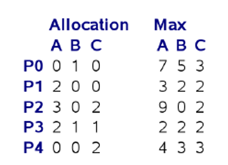

## 2011-2012学年下学期期中试卷（含答案）

### 一、（5'）

请证明给定就绪（ready）队列，采用最短剩余时间优先（Shortest Remaining Time First，SRTF）的CPU调度能确保队列中所有进程的平均响应时间最小。（5‘）

答案：

采用反证法：SRTF调度情况下调换任意两个进程顺序，平均响应时间将会增加。

***

### 二、（16’）

已知就绪队列中已有4个进程，所需要的CPU时间按到达次序分别为28，5，43，35个毫秒；在第10毫秒到达第五个进程，它所需要的CPU时间为8个毫秒。请写出在先来先服务（First-Come-First-Serve，FCFS）、以5毫秒和20毫秒为单位的轮询（Round-Robin）、最短作业优先（Shortest Job First）这四种不同的CPU调度下，这些进程的调度序列（可用甘特图（Gantt Chart）表示）（3' x 4），并分别计算四种不同情况下的平均响应时间（1' x 4）。

答案：

FCFS: 28, 5, 43, 35, 8. (28+33+76+(111-10))/5

RR(5): p1(5,23),p2(5,0),p3(5,38),p4(5,30),p1(5,18),p5(5,3),p3(5,33),p4(5,25),p1(5,13),p5(3,0),p3(5,28),p4(5,20),p1(5,8),p3(5,23),p4(5,15),p1(5,3),p3(5,18),p4(5,10),p1(3,0),p3(5,13),p4(5,5),p3(5,8),p4(5,0),p3(5,3),p3(3,0)

p1: 15+15+13+10+10=63

p2: 5

p3: 10+15+13+10+10+8+5+5=76

p4: 15+15+13+10+10+8+5=76

p5: 15+15=30

(63+5+76+76+30)/5

RR(20): p1(20,8),p2(5,0),p3(20,23),p4(20,15),p5(8,0),p1(8,0),p3(20,3),p4(15,0),p3(3,0)

p1: 53

p2: 20

p3: 25+36+15=76

p4: 45+36=81

p5: 55

(53+20+76+81+55)/5

SJF: p2(5), p1(28), p5(8), p4(35), p3(43)

(5+0+76+41+23)/5

***

### 三、（5‘）

请详细描述一个用户态线程调用sleep()系统调用后，操作系统所执行的任务。

答案：

系统调用过程：mode-switch, 查表（syscall handling）, 执行系统调用代码

sleep() 将当前进程放入waiting队列（设置alarm）

CPU调度（context switch）

系统调用结束，返回，mode-switch

mode-switch/context-switch/mode-switch各一分，syscall过程1分，CPU调度1分

***

### 四、（20'）

对于读者/写者（readers-writers）问题，请用信号量（semaphore）写一个写者不会发生饥饿（starvation）的程序伪码（6'）（要求给出完整的信号量定义/初始化，并说明信号量的用途；给出完整的程序框架，读和写的具体内容可用注释表示）。并详细分析：

1）程序能够确保读者之间共享读操作，写操作和其它所有操作互斥（3'）；

2）程序不会发生死锁（3'）；

3）写者不会发生饥饿（4'）；

4）读者的并发程度（4'）。

答案：

略（各种写法）

***

### 五、（12'）

请对下图的场景用资源分配图（Resource Allocation Graph）进行建模，说明什么表示成资源，什么表示成进程（4'）。请根据资源分配图判断是否产生了死锁，并分析原因（4‘）。请说明死锁的四个必要条件是什么，在下图所示情况下哪些条件满足了，哪些不满足（4'）

答案：

图：略（汽车为进程，桥上2个位置为资源，有不同的表示方法）

四个必要条件满足

***

### 六、（12’）

现有5个进程（P0-P4），3类资源（A:9, B:5, C:5），当前的系统状态如下：

|  | Allocation A | Allocation B | Allocation C | Max A | Max B | Max C |
| --- | --- | --- | --- | --- | --- | --- |
| P0 | 0 | 1 | 0 | 7 | 5 | 3 |
| P1 | 2 | 0 | 0 | 3 | 2 | 2 |
| P2 | 3 | 0 | 2 | 9 | 0 | 2 |
| P3 | 2 | 1 | 1 | 2 | 2 | 2 |
| P4 | 0 | 0 | 2 | 4 | 3 | 3 |

系统剩余的资源为：Available: (2, 3, 0)

请问：

a) 如果系统不允许资源抢占，系统当前是否处于安全状态？如果不处于安全状态，请写出可能发生死锁的进程，并画出它们之间的等待图（wait-for graph）；如果处于安全状态，请写出进程执行的序列。（8'）

b) 请问系统是否一定发生死锁？为什么？（4‘）

答案：

a. 不安全。图略

b. 不一定：max不一定同时达到（或主动释放）

***

### 七、（11'）

a) 请写出使用旁路查找表（Translation Look-aside Table）和二级页表时，根据逻辑地址获取物理内存地址的过程（包括错误检查过程）（5‘）。

b) 已知一次相联存储器的访问需要0.1毫秒，一次内存访问需要1毫秒，旁路查找表的命中率为30%，请计算此时（使用旁路查找表的二级页表）的有效访问时间（effective access time）（3'）。

c) 如果要求平均访问时间达到1.5毫秒，请问旁路查找表的命中率应该至少为多少？（3'）

答案：

a. 要点：TLB判断，页表valid/出错判断，先查一级页表再查二级页表

b. $(1+0.1)\times30\%+(3+0.1)\times70\%$

c. $(1+0.1)\times x\%+(3+0.1)\times(1-x\%)\le 1.5$

***

### 八、（19'）

名词辨析：请写出以下各组概念中每个概念的含义，以及它们之间的联系和区别（包括优缺点）。

a) 段式（segmentation）内存管理和页式（paging）内存管理（5'）

b) 内核态（kernel mode）和用户态（user mode）（3'）

c) 多道程序（multi-programming）、多线程（multi-threading）以及分时（time-sharing）（6'）

d) 微内核（mico-kernel）和模块化内核（modular kernel）（5'）

答案：

略。

