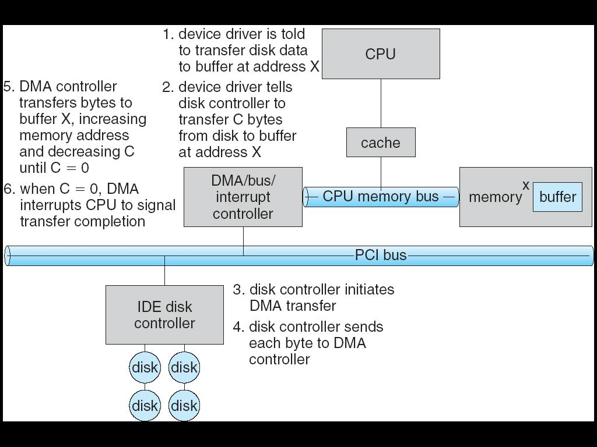

## 2011-2012学年下学期期末试卷（A）（含答案）

### 一、是非题（4' x 8）

请判断以下论断正确与否。正确的用 T 表示；错误的用 F 表示，并指出为何错误。

1. Belady 异常（Belady anomaly）是指某一个页面替换算法在任何情况下，分配给一个进程的页框（page frame）越多，则缺页率越高。

    <details>
    <summary>答案：</summary>

    F. 指有可能出现这种情况

    </details>

    ***

2. 在类 UNIX 系统（如 Linux）中，一个目录的权限为：`rwx------`，表示：目录的所有者（owner）对于该目录具有读写权限，并且可以执行目录中的所有可执行文件。

    <details>
    <summary>答案：</summary>

    F. 可以进入该目录

    </details>

    ***

3. RAID 技术有助于增强存储系统的可靠性（availability），但是会增加存储系统的响应时间（response time），并降低访问的吞吐率（throughput）。

    <details>
    <summary>答案：</summary>

    F. striping 可以在降低响应时间，提高吞吐率。

    </details>

    ***

4. 假脱机（spooling）方式常被用于处理字符设备（character device），如终端，的 I/O 操作。

    <details>
    <summary>答案：</summary>

    F. 常用于打印机，非字符设备。

    </details>

    ***

5. “特洛伊木马（Troy horse）“程序是具有自我复制能力的代码片段，能够通过自我复制在程序间或计算机系统间进行传播。

    <details>
    <summary>答案：</summary>

    F. 病毒具有自我传播能力；或特洛伊木马指利用环境做非法操作的程序。

    </details>

    ***

6. 在微内核（micro-kernel）结构的操作系统中，虚拟内存（virtual memory）管理是在微内核内部的。

    <details>
    <summary>答案：</summary>

    F. 只有 CPU 调度和进程间通信是必须在微内核内部。

    </details>

    ***

7. 发生缺页（page fault）的进程会直接从”运行（running）“状态进入”就绪（ready）“状态。

    <details>
    <summary>答案：</summary>

    F. 进入 waiting 状态

    </details>

    ***

8. 如果有两个进程竞争使用两个独占（dedicated）的 I/O 设备，有可能会发生死锁。

    <details>
    <summary>答案：</summary>

    T.

    </details>

***

### 二、名词辨析（28‘）

请分别说明以下每组名词中每一个的含义，并说明它们之间的区别和联系

1. （4‘）页面（page）和页框（frame）

    <details>
    <summary>答案：</summary>

    页面：地址空间中划分成的一样大小的连续空间

    页框：用于放置页面的内存空间

    </details>

    ***

2. （6’）文件控制块（file control block, FCB），inode，和目录

    <details>
    <summary>答案：</summary>

    FCB：操作系统用于管理文件的基本属性的数据结构，需要存放在磁盘上

    inode：类 unix 操作系统的 FCB 结构

    目录：文件的逻辑集合

    </details>

    ***

3. （4‘）文件的写（write）权限和追加（append）权限

    <details>
    <summary>答案：</summary>

    写权限：可以在文件中的任何位置写入

    追加权限：只可以在文件的末尾写入（不能覆盖已有数据）

    </details>

    ***

4. （4‘）文件系统的格式化（format）和低级格式化（low-level format）

    <details>
    <summary>答案：</summary>

    格式化：建立文件系统的操作

    低级格式化：建立基本文件系统（basic file system）的操作，即划分块的操作

    </details>

    ***

5. （4‘）文件的链接（link）和复制（copy）

    <details>
    <summary>答案：</summary>

    链接：不复制文件内容，但创建一个新的目录项（指向已经存在的文件）

    复制：复制文件的内容

    </details>

    ***

6. （6’）阻塞的（blocking）I/O 操作、非阻塞的（non-blocking）I/O 操作、异步的（asynchronous）I/O 操作

    <details>
    <summary>答案：</summary>

    阻塞 i/o：开始操作后停止，等到 i/o 结束后再继续

    非阻塞 i/o：开始操作后继续进行其它工作

    异步 i/o：开始操作后继续其它工作，但在 i/o 结束后得到通知，对 i/o 结果进行响应 1

    </details>

***

### 三、计算、问答题（30‘）

1. （3' x 3）已知磁道访问请求队列：98, 183, 37, 14, 122, 65, 124, 67，当前磁头位置为53，方向为 53=>0，请分别计算 FIFO（先进先出），SSTF（最短寻道时间优先），SCAN 调度下响应所有请求的磁头移动距离，并写出每种调度的响应顺序。

    <details>
    <summary>答案：</summary>

    ```text
    FIFO: 53, 98, 183, 37, 14, 122, 65, 124, 67.
    (98-53)+(183-98)+(183-37)+(37-14)+(122-14)+(122-65)+(124-65)+(124-67)=45+85+146+23+108+57+59+57=580

    SSTF: 53, 65, 67, 98, 122, 124, 183, 37, 14.
    12+2+31+24+2+59+146+23=299

    SCAN: 53, 37, 14, (0), 65, 67, 98, 122, 124, 183.
    53+183=236
    ```

    </details>

    ***

2. （4'）请问 SSTF 是否是磁头调度算法中最优的？为什么？（如果是最优的，请证明，否则请举出反例）

    <details>
    <summary>答案：</summary>

    否。如 1 中示例。

    </details>

    ***

3. （10‘）现有两个进程 P1 和 P2，当前的页面访问序列分别为：

    ```text
    P1: 1, 2, 3, 4, 1, 2, 5
    P2: 6, 7, 8, 6, 7, 6, 7
    ```

    这两个进程总共可有 5 个页框可供使用。假设使用 LRU 替换策略，页框分配采用固定分配（即分配后不可修改），请问如何在两个进程间分配页框可以达到缺页率最低？请写出替换序列，和缺页率计算过程（4’）；并证明该分配对于给出的序列是最优的（6‘）。

    <details>
    <summary>答案：</summary>

    2, 3 （10 次缺页）

    <u>1</u>, 1, <u>3</u>, <u>4</u>, 1, <u>2</u>, <u>5</u>

    &nbsp;&nbsp;&nbsp;<u>2</u>, 2, <u>3</u>, <u>4</u>, <u>1</u>, <u>2</u>

    <br />

    <u>6</u>, 6, 6, 6, 6, 6, 6

    &nbsp;&nbsp;&nbsp;<u>7</u>, 7, 7, 7, 7, 7

    &nbsp;&nbsp;&nbsp;&nbsp;&nbsp;&nbsp;<u>8</u>, 8, 8, 8, 8

    证明：

    1. 给 P2 更多页面不会减少 P2 的缺页率；
    2. 给 P1 3 个页面不会减少 P1 的缺页率，但是会增加 P2 的缺页率；
    3. 给 P1 4 个页面，P1 的缺页次数为 5，但是 P2 的缺页次数为 7。

    </details>

    ***

4. （7’）请简述直接内存访问（DMA）方式 I/O 的过程（可用图表示）（4‘），并说明为何 CPU 和 DMA 模块都需要通过内存总线访问内存，却仍然能够加快 I/O 访问的速度。（3‘）

    <details>
    <summary>答案：</summary>

    

    Cycle stealing

    </details>

***

### 四、（10‘）设计题

某系统，磁盘块大小为 4KB，需要存储的文件中每一条记录大小相同，都是 3KB，但是不同文件中的记录条数差别很大。每条记录都有一个唯一的键值（key）。对于文件内容，也就是记录的访问有两种：顺序访问和按键值访问。文件内容只追加，不修改，不删除。请参考文件块分配中的连续分配（contiguous allocation）、链接分配（linked allocation）、索引分配（indexed allocation）等方法，设计一种磁盘块分配方法，并回答以下问题：

1. （4‘）请简述分配方法，以及块分配、顺序访问、按键值访问的算法；

    ***

2. （2’）请分析该方法的顺序访问、按键值访问的效率；

    ***

3. （2’）请分析该方法的磁盘利用率；

    ***

4. （2’）请分析该设计的优缺点。

    <details>
    <summary>答案：</summary>

    略。

    </details>

***

## 2011-2012学年下学期期末试卷（B）（含答案）

### 一、是非题（4' x 8=32'）

请判断以下论断正确与否。正确的用T表示；错误的用F表示，并指出为何错误。

1. 线程都保存有各自的栈信息、CPU状态（寄存器、指令计数器等）、堆信息，以及打开文件列表等。

    <details>
    <summary>答案：</summary>

    F

    </details>

    ***

2. 段表由各个进程自己管理，进程可在用户态对段表进行更新。

    <details>
    <summary>答案：</summary>

    F

    </details>

    ***

3. 分时（time-sharing）是为了在操作系统中支持同时运行多个程序，从而提高CPU的利用率而提出的。

    <details>
    <summary>答案：</summary>

    F

    </details>

    ***

4. Windows的实现将图形界面功能在核心态，有利于图形界面功能的效率。

    <details>
    <summary>答案：</summary>

    T

    </details>

    ***

5. 进程不会因为申请、使用共享资源发生死锁。

    <details>
    <summary>答案：</summary>

    T

    </details>

    ***

6. 在类UNIX系统（如Linux）中，一个文件的权限为：`rwxr-x---`，表示：目录的所有者（owner）同组用户对于该文件具有读和执行权限。

    <details>
    <summary>答案：</summary>

    T

    </details>

    ***

7. “计算机病毒“程序是具有自我复制能力的代码片段，能够通过自我复制在程序间或计算机系统间进行传播。

    <details>
    <summary>答案：</summary>

    T

    </details>

    ***

8. 对于键盘这样的低速字符设备，采用DMA方式进行数据交换是不合适的。

    <details>
    <summary>答案：</summary>

    T

    </details>

***

### 二、名词辨析（4'x7=28‘）

请分别说明以下每组名词中每一个的含义，并说明它们之间的区别和联系

1. 死锁（deadlock）与饥饿（starvation）

    <details>
    <summary>答案：</summary>

    死锁：多个进程循环等待对方，都无法继续执行

    饥饿：某个或某些进程由于无法得到资源长时间无法执行

    死锁必然发生饥饿，但是饥饿不一定发生死锁

    </details>

    ***

2. 程序控制输入输出（programmed I/O）与直接内存访问（DMA）

    <details>
    <summary>答案：</summary>

    PIO：CPU直接发出对于I/O的指令

    DMA：CPU在交换开始、结束时介入，其他时候由DMA控制器协调I/O设备和内存间利用总线的数据交换。

    DMA通常能够节省大量中断和CPU介入的时间，有利于大批量数据的交换

    </details>

    ***

3. 分时（time-sharing）与多道程序（multi-programming）

    <details>
    <summary>答案：</summary>

    分时：将时间划分成时间片，进程按时间片轮流执行

    多道：系统中存在多个程序同时执行

    分时主要针对提高系统的响应速度，改善用户体验；多道主要针对增加系统的利用率。

    </details>

    ***

4. 长程调度（long-term scheduling）与中程调度（mid-term scheduling）

    <details>
    <summary>答案：</summary>

    长程调度：操作系统决定到底有多少进程能够从“new”状态进入就绪状态的调度

    中程调度：操作系统决定哪些进程的地址空间能够保留在内存中，哪些进程的地址空间需要被交换到外存的调度

    长程调度被用于平衡系统资源利用率与并发进程个数；中程调度被用于控制运行与就绪进程有足够的内存、较低的缺页率能够运行。

    </details>

    ***

5. 二级存储（secondary storage）与三级存储（tertiary storage）

    <details>
    <summary>答案：</summary>

    二级存储：通常指磁盘，用于存储文件、交换空间、虚存

    三级存储：较慢、但具有较大容量的持久存储介质，包括光盘、磁带等，通常用于转储、备份

    和三级存储相比，二级存储通常访问速度较快、单位容量价格较高。三级存储通常具有存储介质与存储驱动器分离的特点，所以价格较低，也也导致随机访问速度较慢。

    </details>

    ***

6. 条带化（striping）和镜像（mirror）

    <details>
    <summary>答案：</summary>

    两者都是RAID中常用的技术。前者将一个数据单元的内容按序存放于多个磁盘，以增加系统响应请求所能取得的带宽；后者通过存储副本增加系统容错能力。

    </details>

    ***

7. 页式内存管理和段式内存管理

    <details>
    <summary>答案：</summary>

    页的大小是相同的，段大小不同。段往往是程序逻辑的抽象，在有些情况下对于用户（程序员）是可见的。页通常是作为管理方便而使用的，对用户不可见。

    </details>

***

### 三、计算、问答题（30‘）

1. 请简述在一个支持有向无环图目录结构的文件系统中，链接一个普通文件（非目录文件）时操作系统需要执行哪些操作。（5'）

    <details>
    <summary>答案：</summary>

    查看／更新引用计数，更新目录文件

    </details>

    ***

2. 请问哪种文件块分配方式有利于顺序访问文件的效率，为什么？。（5'）

    <details>
    <summary>答案：</summary>

    顺序分配，因为行为可预测，预取效果好

    </details>

    ***

3. 采用按需调页（demand paging），现有3个页框，分别存储着页面号2,3,4三个页面。已知接下来的页面访问顺序为1,2,3,4,1,2,5,1,2,3,4,5。使用时钟算法（clock algorithm）作为页面替换算法。（10分）

    a) 请计算会发生的缺页次数（假设初始时在页框内的页面的引用位（reference bit）都是1，2/3/4三个页面按序存放，初始时指针指向页面2）？（7分）

    <details>
    <summary>答案：</summary>

    ```text
    2(1*), 3(1), 4(1): 1x
    1(1), 3(0*), 4(0): 2x
    1(1), 2(1), 4(0*): 3x
    1(1*), 2(1), 3(1): 4x
    4(1), 2(0*), 3(0): 1x
    4(1), 1(1), 3(0*): 2x
    4(1*), 1(1), 2(1): 5x
    5(1), 1(0*), 2(0): 1
    5(1), 1(1*), 2(0): 2
    5(1), 1(1*), 2(1): 3x
    5(0), 3(1), 2(0*): 4x
    5(0*), 3(1), 4(1): 5
    5(1), 3(1), 4(1)
    9次缺页
    ```

    </details>

    b) 请写出这一访问序列所对应的工作集。（3分）

    <details>
    <summary>答案：</summary>

    {1,2,3,4,5}

    </details>

    ***

4. 已知磁盘访问队列98, 183, 37, 122, 14, 124, 65, 67（标号为柱面号），当前磁头位置为53。（10分）

    a) 请写出一种最优的磁头移动序列，并计算磁头移动距离。（5分）

    <details>
    <summary>答案：</summary>

    ```text
    53, 37, 14, 65, 67, 98, 122, 124, 183
    (53-14)+(183-14)=39+169=208
    ```

    </details>

    b) 请问这一序列和哪种调度算法的结果是一致的？（2分）

    <details>
    <summary>答案：</summary>

    LOOK

    </details>

    c) 请问这种调度算法能否保证在任意情况下是最优的？为什么？（3分）

    <details>
    <summary>答案：</summary>

    不能，与磁头移动的初始移动方向有关

    </details>

***

### 四、（10‘）设计题

在一个需要频繁读和追加数据（即写在文件末尾）的场合，有写操作，但没有插入操作。已知每次读或写操作都会读出或写入相当大规模的数据（但未必是磁盘块大小的整数倍），但是开始读或写的位置可能出现在文件的任何地方。

1. 请问：连续磁盘块分配、链接分配、索引分配分别是否适合这一场景（3'）；

    *** 

2. 假设在FCB中，还剩余256B的空间，请参考UNIX文件系统的i-node结构，设计一个多级的包含直接块和间接索引的块管理方式，并分析该方式与以上三种方式相比的优缺点。（7'）

    <details>
    <summary>答案：</summary>

    略

    </details>
