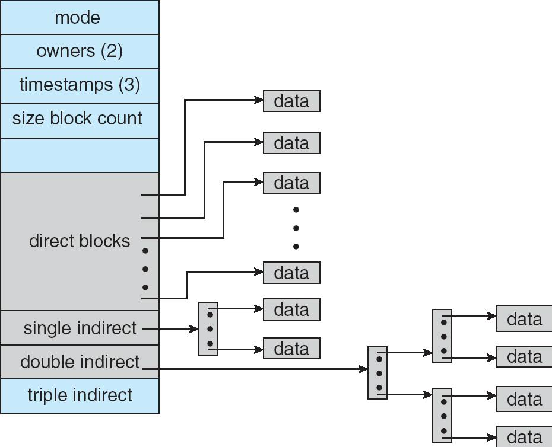

## 2012-2013学年下学期期末试卷（A）（含答案）

### 一、判断题（请判断以下叙述的正误，用 T 和 F 表示，并对错误的叙述进行改正，说明理由。20 分，每题 2 分）

1. 分页或分段系统必须采用虚拟存储技术。

    

    
答案：

    F

    

    ***

2. 以索引方式组织盘块（block）空间的文件中，索引表的每个表项描述一个文件盘块，含有相应盘块的逻辑盘块号和物理盘块号。

    

    
答案：

    F

    

    ***

3. 最短寻道时间优先调度（SSTF）算法是每次选择离磁头当前位置最近的 I/O 请求，其寻道长度必然是最短的，但有可能出现饥饿现象。

    

    
答案：

    F

    

    ***

4. 微内核操作系统中，CPU 调度、进程间通讯和虚存管理功能必须在微内核中实现。

    

    
答案：

    F

    

    ***

5. 对于鼠标这样的低速字符设备，采用 DMA 方式进行数据交换是不合适的。

    

    
答案：

    T

    

    ***

6. 在目录文件中，必须保存文件名和文件控制块信息。

    

    
答案：

    F

    

    ***

7. 在虚存管理时，采用先进先出（FIFO）页面替换策略，必然会发生 Belady 异常（即分配页框越多，缺页率反而越高）。

    

    
答案：

    F

    

    ***

8. 页表由各个进程自己管理，进程可在用户态对页表进行更新。

    

    
答案：

    F

    

    ***

9. 假脱机（spooling）方式常被用于处理字符设备（character device），如终端，的 I/O 操作。

    

    
答案：

    F

    

    ***

10. RAID 技术有助于增强存储系统的可靠性（availability），降低存储系统的响应时间（response time），但是会降低访问的吞吐率（throughput）。

    

    
答案：

    F

    

***

### 二、单选题（30 分，每题 2 分）

1. 地址空间的容量只受 ______ 的限制。

    A. 物理内存大小

    B. 磁盘空间大小

    C. 内存和外存可使用总容量

    D. 计算机地址位数

    

    
答案：

    D

    

    ***

2. 采用分段式存储管理的系统中，若地址用 24 位表示，其中 8 位表示段号，则允许每段的最大长度是 ______。

    A. $2^{24}$

    B. $2^{16}$

    C. $2^8$

    D. $2^{32}$

    

    
答案：

    B

    

    ***

3. 在分页系统中，一个进程的页表如下所示：

    | Page No. | Frame No. |
    | --- | --- |
    | 0 | 2 |
    | 1 | 1 |
    | 2 | 6 |
    | 3 | 3 |
    | 4 | 7 |

    如果页面大小为 $4\ \text{KB}$，则逻辑地址 0 所对应的物理地址为 ______。

    A. 8192

    B. 4096

    C. 2048

    D. 1024

    

    
答案：

    A

    

    ***

对于接下来的 3 个问题，假设某作业访问页面的顺序为 2, 3, 2, 1, 5, 2, 4, 5, 3, 2, 5, 2，分配给该作业三个内存块。

4. 采用 FIFO 页面置换算法会产生 ______ 次缺页中断。

    A. 7

    B. 8

    C. 9

    D. 10

    

    
答案：

    C

    

    ***

5. 采用 LRU 页面置换算法会产生 ______ 次缺页中断。

    A. 6

    B. 7

    C. 8

    D. 9

    

    
答案：

    C

    

    ***

6. 采用最优页面（OPT）置换算法会产生 ______ 次缺页中断。

    A. 5

    B. 6

    C. 7

    D. 8

    

    
答案：

    B

    

    ***

对于接下来的 4 个问题，假定某磁盘共有 50 个柱面（编号为 0~49），如果在为访问 12 号柱面的请求者服务后，当前正在为访问 14 号柱面的请求者服务，同时有若干个请求者在等待服务，它们依次要访问的柱面号为：8、15、9、35、25、30、40 和 5（以上是按请求时间先后排序的），请选择最准确的答案。

7. 如果采用先来先服务（FCFS）调度算法，则满足所有这些请求过程中磁臂移过的总磁道数为 ______。

    A. 50

    B. 105

    C. 120

    D. 130

    

    
答案：

    B

    

    ***

8. 如果采用最短寻道时间优先（SSTF）调度算法，则满足所有这些请求过程中磁臂移过的总磁道数为 ______。

    A. 46

    B. 47

    C. 48

    D. 49

    

    
答案：

    A

    

    ***

9. 如果采用电梯调度算法（SCAN），则满足所有这些请求过程中磁臂移过的总磁道数为 ______。

    A. 51

    B. 61

    C. 79

    D. 44

    

    
答案：

    B

    

    ***

10. 如果采用循环扫描（C-SCAN）调度算法，则满足所有这些请求过程中磁臂移过的总磁道数为 ______。

    A. 44

    B. 97

    C. 48

    D. 93

    

    
答案：

    A

    

    ***

11. 以下哪一种程序（或程序片段）会自我复制、传播，进而威胁系统的安全？

    A. 计算机病毒

    B. 特洛伊木马

    C. 逻辑炸弹

    D. 操作系统自举（bootstrap）文件

    

    
答案：

    A

    

    ***

12. 以下哪种存储设备通常只支持顺序访问？

    A. 光盘

    B. 磁盘

    C. 磁带

    D. U 盘

    

    
答案：

    C

    

    ***

13. 当发生抖动（或称为颠簸，thrashing）时，以下哪种现象不会出现？

    A. 处于等待（waiting）状态的进程数增多

    B. CPU 利用率增高

    C. 磁盘 I/O 增多

    D. 长程调度（long-term scheduling）允许更多的进程进入就绪（ready）状态

    

    
答案：

    B

    

    ***

14. 以下哪个功能不是由设备驱动程序提供的？

    A. 提供标准的设备访问系统调用（如 open(), read() 等）

    B. 提供中断处理程序

    C. 提供 DMA 控制功能

    D. 提供内核直接访问设备的接口

    

    
答案：

    C

    

    ***

15. 以下哪种数据结构必须存放在持久存储介质上？

    A. 进程控制块

    B. 页表

    C. 文件控制块

    D. 打开文件列表

    

    
答案：

    C

    

***

### 三、简答题（25 分，每题 5 分）

1. 假定某请求分页系统中，内存有效访问时间（effective access time）为 1 微秒（1 微秒=$10^{-6}$ 秒），二级存储平均访问时间为 10 毫秒（1 毫秒=$10^{-3}$ 秒），试问如果希望虚拟存储系统的有效访问时间仅比内存增加不超过 $10\%$，则要求页面缺页率不大于多少？

    

    
答案：

    设页面缺页率为 f，则虚存的平均访问时间为：

    $(1-f)*1+10000*f=1+9999f$

    如果希望虚存的平均访问时间相比内存增加不超过 $10\%$，则

    $1+9999f<1*(1+10\%)$ 也即 $1+9999f<1.1$

    $f<0.1/9999 \approx 1/100000$

    

    ***

2. 假设某系统使用位图(bitmap)来管理空闲磁盘空间，而该位图在一次系统崩溃中损坏了，试问有没有办法恢复该位示图？如果可以，请简述重构该位示图的方法。并分析重构所需的代价。

    

    
答案：

    先将位图所有位清零，然后从根目录开始，遍历搜索系统中的每个文件，对于找到的每个文件，获取分配给该文件的盘块信息，将位图中的相应位置为 1，直至遍历结束，新的位图就重构好了。

    

    ***

3. 请简述在一个支持有向无环图目录结构的文件系统中，删除一个普通文件（非目录文件）时操作系统需要执行哪些操作。

    

    
答案：

    查看／更新引用计数，如果为零，更新目录文件，释放 FCB，释放磁盘数据块

    

    ***

4. 请简述页面替换算法中的 LRU 替换与时钟算法（第二次机会），并详细比较两者各自的优缺点。

    

    
答案：

    要点：队列的维护代价

    

    ***

5. 请简述前向页表、反向页表、哈希页表（或称为散列页表）的数据结构，并分析其各自的优点。

    

    
答案：

    要点：空间代价，查找代价

    

***

### 四、综合题（25 分）

1. （10'）假设文件系统的盘块大小为 $4\ \text{KB}$，某文件的物理存储方式采用链接方式，该文件首 5 个盘块的盘块号分别为 20、54、80、95 和 100。假如要访问该文件的第 15000 字节单元，请回答以下问题：

    （1）要访问的字节单元在哪个盘块上？其盘块号为多少？该字节单元是盘块内的第几字节？

    （2）要访问该字节单元需要访问多少个盘块？试图示上述的访问过程。（假如该文件的 FCB 已载入内存）

    

    
答案：

    该字节所在盘块的逻辑块号：$B=15000/4096=3$ （2 分）

    所以该盘块的物理盘块号为：95 （2 分）

    块内位移：$S=15000 \bmod 4096=2712$ （2 分）

    该字节所在盘块为该文件的第四个盘块

    所以，要依次访问前面三个盘块后才可以获取该第四个盘块的指针，一共要进行磁盘 I/O 操作的次数为: $3+1=4$ （2 分）

    图示上述的访问过程（略） （2 分）

    

    ***

2. （15'）假设有文件系统使用 i-node 如图所示。其中一个磁盘块大小为 $4\ \text{KB}$，一个磁盘块指针大小为 32 位（$4\ \text{B}$），直接块（direct block）大小为 $2\ \text{KB}$，其它索引块大小和一个磁盘块一样大小。假设有一个 $4\ \text{MB}$ 大小的文件，其 i-node 已在内存中（direct block 也在内存中），文件的其它部分都在磁盘上，不考虑缓存。请问：

    a) 访问其第一个字节，第 $1\ \text{K}$ 个字节，第 $1\ \text{M}$ 个字节，第 $2\ \text{M}$ 个字节，第 $3\ \text{M}$ 个字节，和最后一个字节分别需要访问几个磁盘块（2'x5=10）？

    b) 该文件系统最大能支持多大的文件(5')？

    

    

    
答案：

    a) $1\ \text{K}$: 1, $1\ \text{M}$: 1, $2\ \text{M}$: 1, $3\ \text{M}$: 2, 最后：2

    b) $2\text{K}/4*4\text{K}+4\text{K}/4*4\text{K}+4\text{K}/4*4\text{K}/4*4\text{K}$

    

***

## 2012-2013学年下学期期末试卷（B）（含答案）

### 说明

- 本卷原卷标注为“软院A卷”，实则与上一张卷子内容不同，故当作B卷标记。

### 一、判断题（请判断以下叙述的正误，用 T 和 F 表示，并对错误的叙述进行改正，说明理由。20 分，每题 2 分）

1. 线程都保存有各自的栈信息和 CPU 状态（寄存器、指令计数器等）。

    

    
答案：

    T

    

    ***

2. 页表由各个进程自己管理，进程可在用户态对页表进行更新。

    

    
答案：

    F

    

    ***

3. 单 CPU 环境下由于任何时刻只有一个进程（线程）能够运行，因此操作系统不需要实现同步与互斥支持。

    

    
答案：

    F

    

    ***

4. 在微内核结构的操作系统中，进程间通讯可以不在微内核内。

    

    
答案：

    F

    

    ***

5. 在抢占式（preemptive）操作系统中，进程不会因为申请、使用资源发生死锁。

    

    
答案：

    T

    

    ***

6. 对于像打印机这样的低速设备，采用 DMA 方式进行数据交换是不合适的；

    

    
答案：

    F

    

    ***

7. 在虚存管理时，采用 LRU 页面替换策略，可能会发生 Belady 异常（即分配页框越多，缺页率反而越高）；

    

    
答案：

    F

    

    ***

8. RAID 技术总是以牺牲磁盘访问性能来换取容错性的提高。

    

    
答案：

    F

    

    ***

9. 目录文件其实就是文件控制块（FCB）。

    

    
答案：

    F

    

    ***

10. 操作系统内核是一个特殊的进程，在系统启动后以运行（running）或者就绪（ready）状态存在。

    

    
答案：

    F

    

***

### 二、单选题（20 分，每题 2 分）

1. 当发生抖动（或称为颠簸，thrashing）时，以下哪种现象不会出现？

    A. 处于等待（waiting）状态的进程数增多

    B. CPU 利用率增高

    C. 磁盘 I/O 增多

    D. 长程调度（long-term scheduling）允许更多的进程进入就绪（ready）状态

    

    
答案：

    B

    

    ***

2. 多 CPU 共享内存环境下，以下哪种实现临界区的方法无效？

    A. 使用 test_and_set 机器指令实现“忙等”（busy waiting）

    B. Peterson 算法

    C. 关中断

    D. 使用 swap 机器指令实现“忙等”

    

    
答案：

    C

    

    ***

3. 以下哪种情况仍然可能会发生死锁？

    A. 资源都是可共享的；

    B. 每一种资源的数量都超过单个进程所需这类资源的最大值；

    C. 空闲资源能够满足任意一个进程还需要的资源需求；

    D. 每个进程必须一次申请、获得所需的所有资源

    

    
答案：

    B

    

    ***

4. 以下哪种数据结构必须存放在持久存储介质上？

    A. 进程控制块

    B. 页表

    C. 文件控制块

    D. 打开文件列表

    

    
答案：

    C

    

    ***

5. 以下哪种海量存储技术对于提升存储系统的容错性没有直接帮助？

    A. 无冗余（non-redundant）的条带化（striping）

    B. 映像（mirroring）

    C. 按位奇偶校验（bit-interleaved parity）

    D. 按块奇偶校验（block-interleaved parity）

    

    
答案：

    A

    

    ***

6. 以下哪一种程序（或程序片段）常通过伪装成其它程序，引诱用户运行，从而威胁系统的安全？

    A. 计算机病毒

    B. 特洛伊木马

    C. 逻辑炸弹

    D. 操作系统自举（bootstrap）文件

    

    
答案：

    B

    

    ***

7. 以下哪一种机制能够帮助系统管理员防止攻击者窃听在公共网络上传输的数据？

    A. 加密

    B. 认证

    C. 访问控制矩阵

    D. 防火墙

    

    
答案：

    A

    

    ***

8. 以下哪种存储设备不需要进行空闲块管理？

    A. 只读光盘

    B. 磁盘

    C. 磁带

    D. U 盘

    

    
答案：

    A

    

    ***

9. 以下哪个操作不是磁盘格式化进行的？

    A. 划分扇区和磁道

    B. 建立空闲 FCB 列表

    C. 建立空闲块列表

    D. 设定根目录文件

    

    
答案：

    A

    

    ***

10. 以下哪种数据结构不必以内核态进行访问？

    A. 进程控制块

    B. 页表

    C. 文件控制块

    D. 以上皆非

    

    
答案：

    D

    

***

### 三、简答题（20 分，每题 5 分）

1. 程序控制输入输出（programmed I/O）和直接内存访问（DMA）哪种对于高速 I/O 访问效率较高，为什么？。（5'）

    

    
答案：

    PIO 时，CPU 需要介入每一次数据交换；DMA 方式时，CPU 只在数据交换开始／结束时介入，其它时候，由 DMA 控制器协调 I/O 设备和内存利用总线进行数据交换。由于此时 CPU 和 I/O 设备几乎并行，因此与 PIO 方式相比，节省了大量中断、CPU 介入时间。

    

    ***

2. 请简述在一个支持有向无环图目录结构的文件系统中，链接一个普通文件（非目录文件）时操作系统需要执行哪些操作。（5'）

    

    
答案：

    查看／更新引用计数，更新目录文件

    

    ***

3. 请问哪种文件块分配方式有利于顺序访问文件的效率，为什么？。（5'）

    

    
答案：

    顺序分配，因为行为可预测，预取效果好。

    

    ***

4. 请简述磁盘访问效率由哪些部分决定，并分析如何提高文件系统中顺序访问文件的效率。（5'）

    

    
答案：

    定位时间＋传输速度。前者又包括：旋转速度和寻道事件

    

***

### 四、辨析题：请分别解释以下每组的两个名词，并列举他们的区别（25 分，每题 5 分）

1. 死锁（deadlock）与饥饿（starvation）

    

    
答案：

    死锁：多个进程循环等待对方，都无法继续执行

    饥饿：某个或某些进程由于无法得到资源长时间无法执行

    死锁必然发生饥饿，但是饥饿不一定发生死锁

    

    ***

2. 程序控制输入输出（programmed I/O）与直接内存访问（DMA）

    

    
答案：

    PIO：CPU 直接发出对于 I/O 的指令

    DMA：CPU 在交换开始、结束时介入，其他时候由 DMA 控制器协调 I/O 设备和内存间利用总线的数据交换。

    DMA 通常能够节省大量中断和 CPU 介入的时间，有利于大批量数据的交换

    

    ***

3. 分时（time-sharing）与多道程序（multi-programming）

    

    
答案：

    分时：将时间划分成时间片，进程按时间片轮流执行

    多道：系统中存在多个程序同时执行

    分时主要针对提高系统的响应速度，改善用户体验；多道主要针对增加系统的利用率。

    

    ***

4. 长程调度（long-term scheduling）与中程调度（mid-term scheduling）

    

    
答案：

    长程调度：操作系统决定到底有多少进程能够从“new”状态进入就绪状态的调度

    中程调度：操作系统决定哪些进程的地址空间能够保留在内存中，哪些进程的地址空间需要被交换到外存的调度

    长程调度被用于平衡系统资源利用率与并发进程个数；中程调度被用于控制运行与就绪进程有足够的内存、较低的缺页率能够运行。

    

    ***

5. 二级存储（secondary storage）与三级存储（tertiary storage）

    

    
答案：

    二级存储：通常指磁盘，用于存储文件、交换空间、虚存

    三级存储：较慢、但具有较大容量的持久存储介质，包括光盘、磁带等，通常用于转储、备份

    和三级存储相比，二级存储通常访问速度较快、单位容量价格较高。三级存储通常具有存储介质与存储驱动器分离的特点，所以价格较低，也也导致随机访问速度较慢。

    

***

### 五、设计题（10 分）

在一个需要频繁读和追加数据（即写在文件末尾）的场合，有写操作，但没有插入操作。已知每次读或写操作都会读出或写入相当大规模的数据（但未必是磁盘块大小的整数倍），但是开始读或写的位置可能出现在文件的任何地方。

a) 请问：连续磁盘块分配、链接分配、索引分配分别是否适合这一场景，并给出理由（3'）；

b) 假设在 FCB 中，还剩余 $256\ \text{B}$ 的空间，请参考 UNIX 文件系统的 i-node 结构，设计一个多级的包含直接块和间接索引的块管理方式，并分析该方式与以上三种方式相比的优缺点。（7'）

答案：

略

***

### 六、证明题（5 分）

请证明 LRU 页面替换策略不会导致 Belady 异常。

答案：

略（可用数学归纳法或反证法）

