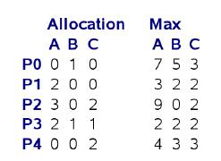

## 2013-2014学年上学期期中试卷（含答案）

### 说明

- 原卷标题：华东师范大学软件学院期中考试卷（2013—2014学年第一学期）

### 一、是非题（请判断以下论述是否正确。正确的标T；错误的标F，指出错误所在并修正）（2’*4=8’）

1. 页表由各个进程自己管理，进程可在用户态对页表进行更新。

    <details>
    <summary>答案：</summary>

    F，页表由操作系统管理。

    </details>

    ***

2. 单CPU环境下由于任何时刻只有一个进程（线程）能够运行，因此操作系统不需要实现同步与互斥支持。

    <details>
    <summary>答案：</summary>

    F，临界资源只与访问他的进线程数有关，与系统正在运行的进线程数无关。

    </details>

    ***

3. 在微内核结构的操作系统中，CPU调度必然在微内核内。

    <details>
    <summary>答案：</summary>

    T

    </details>

    ***

4. 在抢占式（preemptive）操作系统中，进程不会因为申请、使用资源发生死锁。

    <details>
    <summary>答案：</summary>

    T

    :::tip
    原参考答案将本题判为 T，疑似有误。抢占式调度允许操作系统抢占 CPU，但不代表进程持有的资源可以被抢占，因此系统仍可能满足死锁的必要条件。
    :::

    </details>

***

### 二、（32'）问答题

1. （5'）请详细描述一个用户态线程调用sleep()系统调用后，操作系统所执行的任务。并分析其中每一个步骤的代价大小。

    <details>
    <summary>答案：</summary>

    1、系统调用过程：mode-switch, 查表（syscall handling）, 执行系统调用代码。代价中

    2、sleep() 将当前进程放入waiting队列（设置alarm）代价小

    3、CPU调度（context switch）代价大

    4、系统调用结束，返回，mode-switch 代价中

    </details>

    ***

2. （12'）假设线程有运行（running）、就绪（ready）和等待（waiting）三种状态。请分别说明什么时候会发生以下状态转换：

    a) 运行 ==> 等待 (4')

    <details>
    <summary>答案：</summary>

    running-->waiting：等待i/o、信号量P操作...

    针对running-->waiting部分同学写的系统中断，这个解释是不完整的，系统中断分为多种情况，当前线程发出缺页中断等中断时，系统会进行中断处理并将该线程阻塞，但若是外部的时钟中断或i/o中断到达，系统在处理这些中断时，当前线程会进入就绪队列。

    </details>

    b) 就绪 ==> 运行 (4')

    <details>
    <summary>答案：</summary>

    ready-->running：时间片到，前一进程结束／等待...

    </details>

    c) 等待 ==> 就绪 (4')

    <details>
    <summary>答案：</summary>

    waiting-->ready：i/o结束、获得信号量，...

    </details>

    ***

3. （15'）请简述计算机系统启动，直到运行第一个用户应用程序，然后派生出第二个线程的整个过程中的可能的步骤，并分析每一个步骤的代价（大／中／小），说明理由。

    <details>
    <summary>答案：</summary>

    计算机启动过程：硬件检测、加载引导程序（Bootstrap）代价中

    将操作系统内核加载至内存、初始化并运行操作系统代价大

    操作系统构建进程树，创建用户进程代价中

    用户进程创建：初始化PCB（中），生成地址映射（小），拷贝用户程序到地址空间（大），根据需要创建线程

    线程创建：初始化TCB、寄存器状态等（小），相比进程创建代价小。

    </details>

    ***

### 三、（43'）计算题

1. （15'）使用段页式内存管理，段表和页表都存放在主存中，所有要访问的页面都在主存中。页表项可以缓存在快表（或称旁路转换缓存，TLB）中。一次内存访问的代价为 $200\ \text{ns}$，一次TLB访问代价为 $10\ \text{ns}$。

    a). 请写出以上段页式内存访问的处理流程（也可以用图示表示）（5'）

    <details>
    <summary>答案：</summary>

    a. 访问段表，检查是否违法，获取页表地址

    b. 访问快表，如果miss goto c，否则goto d

    c. 访问内存页表

    d. 访问内存

    </details>

    b). 假设TLB的命中率为50%，请计算进程对内存的有效访问时间 （effective access time）（5'）

    <details>
    <summary>答案：</summary>

    答：

    $200 + 50\% \times 10 + (1-50\%) \times 210 + 200$

    $= 510\text{ns}$

    </details>

    c). 如果要求进程对内存的有效访问时间不大于500ns，请问TLB的命中率必须提高到多少？（5'）

    <details>
    <summary>答案：</summary>

    答：

    $200+ x \times 10 + (1-x) \times 210 + 200$

    $=610-200x\le 500$

    $x\ge 110/200=55\%$

    </details>

    ***

2. （16'） 已知就绪队列中已有4个进程，所需要的CPU时间按到达次序分别为28，5，43，35个毫秒；在第10毫秒到达第五个进程，它所需要的CPU时间为8个毫秒。请写出在先来先服务（First-Come-First-Serve，FCFS）、以5毫秒和20毫秒为单位的轮询（Round-Robin）、最短作业优先（Shortest Job First）这四种不同的CPU调度下，这些进程的调度序列（可用甘特图（Gantt Chart）表示）（3' x 4），并分别计算四种不同情况下的平均响应时间（平均等待时间）（1' x 4）。

    <details>
    <summary>答案：</summary>

    FCFS: 28, 5, 43, 35, 8.

    平均响应时间=平均等待时间=$(28+33+76+(111-10))/5=47.6$

    RR(5):

    ```text
    p1(5,23),p2(5,0),p3(5,38),p4(5,30),p1(5,18),p5(5,3),p3(5,33),p4(5,25),p1(5,13),p5(3,0),
    p3(5,28),p4(5,20),p1(5,8),p3(5,23),p4(5,15),p1(5,3),p3(5,18),p4(5,10),p1(3,0),p3(5,13),
    p4(5,5),p3(5,8),p4(5,0),p3(5,3),p3(3,0)
    ```

    p1: $15+15+13+10+10=63$

    p2: $5$

    p3: $10+15+13+10+10+8+5+5=76$

    p4: $15+15+13+10+10+8+5=76$

    p5: $15+15=30$

    平均响应时间=$(0+5+10+15+25-10)/5=9$

    平均等待时间=$(63+5+76+76+30)/5=50$

    RR(20):

    ```text
    p1(20,8),p2(5,0),p3(20,23),p4(20,15),p5(8,0),p1(8,0),p3(20,3),p4(15,0),p3(3,0)
    ```

    p1: $53$

    p2: $20$

    p3: $25+36+15=76$

    p4: $45+36=81$

    p5: $55$

    平均响应时间=$(0+20+25+45+65-10)/5=29$

    平均等待时间=$(53+20+76+81+55)/5=57$

    SJF:

    p2(5), p1(28), p5(8), p4(35), p3(43)

    平均响应时间=平均等待时间=$(5+0+76+41+23)/5$

    </details>

    ***

3. （12'）现有5个进程（P0-P4），3类资源（A:9, B:5, C:5），当前的系统状态如下：

    

    系统剩余的资源为：Available: (2, 3, 0)

    请问：

    a) 如果系统不允许资源抢占，系统当前是否处于安全状态？如果不处于安全状态，请写出可能发生死锁的进程，并画出它们之间的等待图（wait-for graph）；如果处于安全状态，请写出进程执行的序列。（8'）

    b) 请问系统是否一定发生死锁？为什么？（4‘）

    <details>
    <summary>答案：</summary>

    a) 不安全。

    5个线程都可能产生死锁，出现死锁的可能情况有多种，所以任意写一种即可。等待图由于是多实例等待图，没有标准的画法，因此只要表现出互相之间的等待关系即可。单实例等待图为重点，多实例等待图我也不太会画=。=你们谁要是会的话教我。。

    b) 不一定。各线程资源请求不一定同时达到max，或部分线程主动释放资源。

    这里部分同学写的在抢占情况下不一定死锁，这么说虽然没错，但是实际在非抢占情况下也不一定死锁，所以这里大家留意一下。不安全表示着有死锁的可能，但死锁并不是一定发生的。

    </details>

    ***

### 四、（17'）设计题

1. （5'） 请使用二元信号量（binary semaphore，即值只能为0或1的信号量）实现计数信号量（counting semaphore，取值可为任意整数）。

    <details>
    <summary>答案：</summary>

    这道题的解决思路主要关注两点：1、计数信号量的机制，当信号量为正数时，任何wait线程可以获得资源，当信号量为0或负数时，所有wait线程要等待，直到有新的资源返还才可以执行。2、在实现上，通过对value值的增减实现资源调配，当value小于等于0时意味着当前线程应当进入阻塞状态，并等待signal的唤醒，而signal端在返还资源时，若当前value为负数意味着有线程在等待，此时应当唤醒一个wait线程，将返还的资源给它。

    这里面有多种实现方法，首先书上的6.5.2实现里面有计数信号量的相关代码：

    ```c
    wait(semaphore *S) {
        S->value--;
        if (S->value < 0) {
            add this process to S->list;
            block();
        }
    }

    signal(semaphore *S) {
        S->value++;
        if (S->value <= 0) {
            remove a process P from S->list;
            wakeup(P);
        }
    }
    ```

    此外，借用二进制信号量也可以实现：

    ```c
    semaphore binary=0;

    wait(semaphore *S) {
        S->value--;
        if (S->value < 0) {
            wait(binary);
        }
    }

    signal(semaphore *S) {
        S->value++;
        if (S->value <= 0) {
            signal(binary);
        }
    }
    ```

    </details>

    ***

2. （12'）有A、B两个线程，需要协同工作。A和B的程序逻辑分别如下：

    ```c
    A()
    {
        A的自身处理代码;
        // A和B的同步点，即双方都要执行完自身代码;
        A的协同代码;
    }

    B()
    {
        B的自身处理代码;
        // A和B的同步点，即双方都要执行完自身代码;
        B的协同代码;
    }
    ```

    （8'）请使用信号量，实现A和B的第4行同步点；

    （4'）请说明为什么你的实现是正确的；你的实现是否会导致死锁。

    <details>
    <summary>答案：</summary>

    同步点的主要目的是保证A、B两个线程在执行后续协同代码之前，已经完成了各自的自身处理代码。因此每个线程同步点的设计原则是在同步点处确认对方也已经到达同步点。因此设计非常简单：

    ```c
    semaphore a=0，b=0;

    A
    {
        signal(b);      //告知对方我已到达同步点
        wait(a);        //等待对方的通知信号
    }

    B
    {
        signal(a);
        wait(b);
    }
    ```

    这里需要注意死锁问题：1、wait不能在signal之前，或者说两个线程的wait至少有一个不在signal之前，否则两个线程都在等待对方信号，但都无法发送出信号，导致死锁。2、信号的初始化必须为0，否则假设a为1，则A线程完全可以不需要等待B线程执行就可以一直顺畅的执行下去，破坏了同步点的作用。部分同学在自己的设计方案中忽略了这个问题，导致方案错误。

    此外，该设计思路不需要限定A与B线程的执行顺序，部分同学通过互斥信号量的方式限定了A和B的执行顺序，虽然也可以最终实现协同，但从代码效率上来讲并不好。

    基本上答案已经包含在a）的设计思路中了，正确的设计思路不会导致死锁。

    </details>
