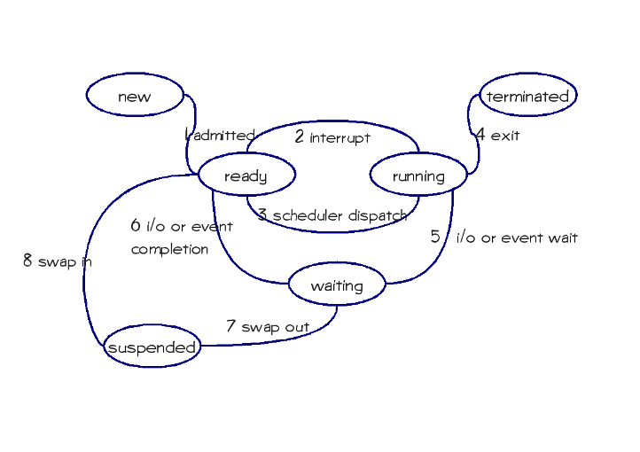
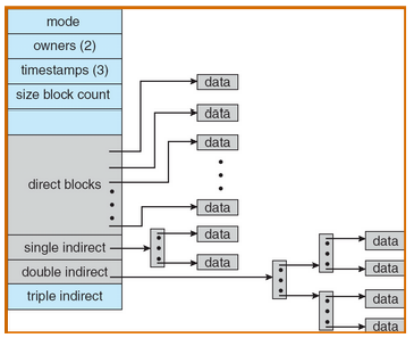

## 2013-2014学年下学期月考试卷（含答案）

### 说明

- 日期：2014.3

### 一、多选题（本大题共 5 小题，每小题 3 分，共 15 分）

1. 以下哪些（个）操作会使得一个进程从运行（running）状态转换为就绪（ready）状态（ ）

    A. 在可占先（preemptive）系统中，高优先级进程被创建

    B. 分时系统中，时间片到

    C. 当前运行进程发生缺页中断

    D. 当前运行进程调用 yield()，主动放弃使用 CPU

    ***

2. 当从“新建（new）”状态进入“就绪（ready）”状态的进程增多时，下面哪种情况不会发生（ ）

    A. I/O 操作的频度升高；

    B. CPU 利用率下降

    C. CPU 利用率上升

    D. 进程的平均响应时间减少

    ***

3. 以下描述正确的是（ ）

    A. 中断处理程序（interrupt handler）是进程的一部分，在进程的地址空间运行

    B. 中断处理程序（interrupt handler）必须运行在内核态

    C. 微内核体系结构下，进程间通讯（inter-processing communication）必须在微内核内

    D. 分时（time sharing）的目的是提高 CPU 和 I/O 的并行度

    ***

4. 以下哪些（个）对于微内核操作系统的描述是正确的？（ ）

    A. Microsoft Windows 是微内核操作系统，但 Linux 不是；

    B. 进程间通信必须在微内核内实现；

    C. 因为用户进程不应访问页表，因此虚存应该在微内核内实现；

    D. 操作系统设计时采用微内核结构可以提高操作系统执行的效率。

    ***

5. 以下对于线程的描述哪些（个）是错误的（ ）

    A. 一个用户态线程的阻塞（block）会引起它所属的整个进程（包括其中的其它线程）的阻塞；

    B. 同一个进程的不同线程可以共享地址空间中的堆；

    C. 线程间通信必须通过内核态系统调用进行；

    D. 同一个进程的不同线程必须维护各自的调用栈和 CPU 状态。

***

### 二、辨析题：请分别解释以下每组的两个名词，并列举他们的区别。（30 分，每小题 5 分）

1. 分时（time-sharing）与多道程序（multi-programming）

    <details>
    <summary>答案：</summary>

    分时：将时间划分成时间片，进程按时间片轮流执行

    多道：系统中存在多个程序同时执行

    区别：分时主要针对提高系统的响应速度，改善用户体验；多道主要针对增加系统的利用率。

    </details>

    ***

2. 长程调度（long-term scheduling）与中程调度（mid-term scheduling）

    <details>
    <summary>答案：</summary>

    长程调度：操作系统决定到底有多少进程能够从“new”状态进入就绪状态的调度

    中程调度：操作系统决定哪些进程的地址空间能够保留在内存中，哪些进程的地址空间需要被交换到外存的调度

    区别：长程调度被用于平衡系统资源利用率与并发进程个数；中程调度被用于控制运行与就绪进程有足够的内存、较低的缺页率能够运行。

    </details>

    ***

3. 网络操作系统和分布式操作系统

    <details>
    <summary>答案：</summary>

    网络操作系统：支持网络的操作系统

    分布式操作系统：可管理分布式系统的操作系统

    区别：采用分布式操作系统，分布的计算机对于用户是透明的。

    </details>

    ***

4. 微内核和模块化内核

    <details>
    <summary>答案：</summary>

    微内核：操作系统内核只包含最基本的功能（进程调度和进程间通讯）

    模块化内核：操作系统内核的一些功能可以作为模块挂载

    区别：微内核中内核和其它操作系统的功能模块（如虚存管理）在不同的地址空间运行，模块化内核中它们在一个地址空间。

    </details>

    ***

5. 核心态和用户态

    <details>
    <summary>答案：</summary>

    核心态：操作系统内核执行的受保护的状态

    用户态：用户进程执行所在的状态

    区别：处于用户态只能访问进程的地址空间，用户态需要通过中断或系统调用才能进入核心态。

    </details>

    ***

6. 最短作业优先调度和最短剩余时间优先调度

    <details>
    <summary>答案：</summary>

    最短作业优先调度：进程调度时，挑选执行时间最短的作业进行执行

    最短剩余时间优先调度：进程调度时，挑选剩余执行时间最短的作业进行执行

    区别：前者是不可占先的（non-preemptive）

    </details>

***

### 三、综合分析题（39 分）

1. （10 分）

    （1）进程创建时（如在类 UNIX 操作系统中，连续执行 fork() 和 exec() 系统调用），操作系统所需要进行那些工作，它们的代价如何（大，中，小）。（6 分）

    <details>
    <summary>答案：</summary>

    进程创建时，操作系统工作如下：

    a. 构造 PCB，代价小

    b. 设置地址空间映射，代价中

    c. 复制父进程地址空间内容，代价大

    d. 复制 I/O 状态，代价中

    </details>

    （2）为什么线程创建比进程快，它主要节省了以上哪个步骤的代价？（4 分）

    <details>
    <summary>答案：</summary>

    同一进程的不同线程共享资源，因此以上 b, c, d 三项代价几乎都可节省

    </details>

    ***

2. 请详细描述一个用户态线程调用 sleep() 系统调用后，操作系统所执行的任务。（8 分）

    <details>
    <summary>答案：</summary>

    1. 系统调用过程：mode-switch, 查表（syscall handling）, 执行系统调用代码。

    2. sleep() 将当前进程放入 waiting 队列（设置 alarm）

    3. CPU 调度（context switch）

    4. 系统调用结束，返回，mode-switch

    </details>

    ***

3. （12 分）请标注以下进程状态转换图中状态转换的箭头方向（标于图上）（每个 0.5 分），并例举其中每一种状态转换的一个例子（每个 1 分）。

    

    <details>
    <summary>答案：</summary>

    (1): new --> ready：从 shell 启动程序或者 fork 进程

    (2): running -> ready：高优先级程序运行，时间片到，...

    (3): ready --> running：时间片到，前一进程结束／等待...

    (4): running --> terminated：exit

    (5): running --> waiting：等待 i/o、信号量 P 操作...

    (6): waiting --> ready：i/o 结束、获得信号量，...

    (7): waiting --> suspended：虚存时，内存不够

    (8): suspended --> ready：得到 i/o 结束、获得信号量，...

    </details>

    ***

4. 判断下列每句话是否正确，并说明理由。（9 分，每小题 3 分）

    （1）线程都保存有各自的栈信息、CPU 状态（寄存器、指令计数器等）、堆信息，以及打开文件列表等。

    <details>
    <summary>答案：</summary>

    F

    </details>

    （2）对于内核支持的线程，当该线程执行系统调用被阻塞时，不仅该线程被阻塞，而且同一进程内的所有线程都会被阻塞。

    <details>
    <summary>答案：</summary>

    F

    </details>

    （3）对于用户级线程，由于所有有关线程管理的代码都是在用户程序库内部实现的，因此可以在不支持线程机制的操作系统平台上实现。而且在不干扰系统调度的前提下，可以指定特定的调度算法。

    <details>
    <summary>答案：</summary>

    T

    </details>

***

### 四、计算题：（16 分）

已知就绪队列中已有 4 个进程，所需要的 CPU 时间按到达次序分别为 28，5，43，35 个毫秒；在第 10 毫秒到达第五个进程，它所需要的 CPU 时间为 8 个毫秒。请写出在先来先服务（First-Come-First-Serve，FCFS）、以 5 毫秒和 20 毫秒为单位的轮询（Round-Robin）、最短作业优先（Shortest Job First）这四种不同的 CPU 调度下，这些进程的调度序列（可用甘特图（Gantt Chart）表示）（3 分 x 4），并分别计算四种不同情况下的平均等待时间（1 分 x 4）。

<details>
<summary>答案：</summary>

FCFS: 调度序列 28, 5, 43, 35, 8. 平均等待时间=(28+33+76+(111-10))/5

RR(5): 调度序列

p1(5,23),p2(5,0),p3(5,38),p4(5,30), p5(5,3),p1(5,18) ,p3(5,33),p4(5,25), p5(3,0),p1(5,13) p3(5,28),p4(5,20),p1(5,8),p3(5,23),p4(5,15),p1(5,3),p3(5,18),p4(5,10),p1(3,0),p3(5,13), p4(5,5),p3(5,8),p4(5,0),p3(5,3),p3(3,0)

计算 RR(5）的平均等待时间 p1: 20+13+10+10+10=63

p2: 5

p3: 10+15+13+10+10+8+5+5=76

p4: 15+15+13+10+10+8+5=76

p5: 10+15=25

平均等待时间=(63+5+76+76+25)/5=49

RR(20) 调度序列 p1(20,8),p2(5,0),p3(20,23),p4(20,15),p5(8,0),p1(8,0),p3(20,3),p4(15,0),p3(3,0)

计算 RR(20）的平均等待时间 p1: 53

p2: 20

p3: 25+36+15=76

p4: 45+36=81

p5: 55

平均等待时间= (53+20+76+81+55)/5

SJF 调度序列 p2(5), p1(28), p5(8), p4(35), p3(43)

平均等待时间= (5+0+76+41+23)/5

</details>

***

## 2013-2014学年下学期月考试卷（含答案）

### 说明

- 日期：2014.5

### 一、选择题（每个 5 分，共 20 分）

1. 以下对于目录及其实现的描述，错误的是：（      ）

    A. 目录是文件的集合，是一种逻辑概念，通常用文件实现

    B. 目录文件中存放的就是目录中文件的文件控制块（file control block）

    C. 目录中可以有子目录，形成嵌套结构

    D. 目录中的“.”和“..”通常分别代表该目录本身和其父目录

    <details>
    <summary>答案：</summary>

    B

    </details>

    ***

2. 当发生抖动（或称为颠簸，thrashing）时，以下哪种现象不会出现？（      ）

    A. 处于等待（waiting）状态的进程数增多

    B. CPU 利用率增高

    C. 磁盘 I/O 增多

    D. 长程调度（long-term scheduling）允许更多的进程进入就绪（ready）状态

    <details>
    <summary>答案：</summary>

    B

    </details>

    ***

3. 以下对于目录及其实现的描述，正确的是：（      ）

    A. 目录就是文件控制块（file control block）

    B. 目录是文件控制块的集合，它通常使用一种特殊的文件控制块实现

    C. 通过链接，文件在不同目录下可以有不同的文件名；目录虽然也可以链接，但是不能有不同目录名

    D. 根目录的父目录是其本身

    <details>
    <summary>答案：</summary>

    D

    </details>

    ***

4. 以下哪种数据结构必须存放在持久存储介质上？（      ）

    A. 进程控制块

    B. 页表

    C. 文件控制块

    D. 打开文件列表

    <details>
    <summary>答案：</summary>

    C

    </details>

***

### 二、简述题（20 分）

请分别简述在一个支持有向无环图目录结构的文件系统中，进行下列操作时，操作系统需要执行哪些操作。

1. 删除一个普通文件（非目录文件）

    <details>
    <summary>答案：</summary>

    查看／更新引用计数，如果为零，更新目录文件，释放 FCB，释放磁盘数据块

    </details>

    ***

2. 链接一个普通文件（非目录文件）

    <details>
    <summary>答案：</summary>

    查看／更新引用计数，更新目录文件

    </details>

***

### 三、解答题（60 分）

1. 采用按需调页（demand paging），现有 3 个页框，分别存储着页面号 2,3,4 三个页面。已知接下来的页面访问顺序为 1,2,3,4,1,2,5,1,2,3,4,5。使用时钟算法（clock algorithm）作为页面替换算法。（20 分）

    请计算会发生的缺页次数（假设初始时在页框内的页面的引用位（reference bit）都是 1，2/3/4 三个页面按序存放，初始时指针指向页面 2）？（10 分）

    <details>
    <summary>答案：</summary>

    ```text
    2(1*), 3(1), 4(1): 1x
    1(1), 3(0*), 4(0): 2x
    1(1), 2(1), 4(0*): 3x
    1(1*), 2(1), 3(1): 4x
    4(1), 2(0*), 3(0): 1x
    4(1), 1(1), 3(0*): 2x
    4(1*), 1(1), 2(1): 5x
    5(1), 1(0*), 2(0): 1
    5(1), 1(1*), 2(0): 2
    5(1), 1(1*), 2(1): 3x
    5(0), 3(1), 2(0*): 4x
    5(0*), 3(1), 4(1): 5
    5(1), 3(1), 4(1)
    9次缺页
    ```

    </details>

    请写出这一访问序列所对应的工作集。（10 分）

    <details>
    <summary>答案：</summary>

    {1,2,3,4,5}

    </details>

    ***

2. 假设某作业访问页面的顺序为 2, 3, 2, 1, 5, 2, 4, 5, 3, 2, 5, 2，分配给该作业三个内存块。分别写出采用 FIFO、LRU、OPT 页面置换算法时，页面走向；并给出缺页中断次数。

    <details>
    <summary>答案：</summary>

    9、8、6 次

    </details>

    ***

3. 假设有文件系统使用 i-node 如图所示。其中一个磁盘块大小为 $4\ \text{KB}$，一个磁盘块指针大小为 32 位（$4\ \text{B}$），直接块（direct block）大小为 $2\ \text{KB}$，其它索引块大小和一个磁盘块一样大小。假设有一个 $4\ \text{MB}$ 大小的文件，其 i-node 已在内存中（direct block 也在内存中），文件的其它部分都在磁盘上，不考虑缓存。请问：

    

    a) 访问其第一个字节，第 $1\ \text{K}$ 个字节，第 $1\ \text{M}$ 个字节，第 $2\ \text{M}$ 个字节，第 $3\ \text{M}$ 个字节，和最后一个字节分别需要访问几个磁盘块？

    <details>
    <summary>答案：</summary>

    $1\ \text{K}$: 1, $1\ \text{M}$: 1, $2\ \text{M}$: 1, $3\ \text{M}$: 2，最后：2

    </details>

    b) 该文件系统最大能支持多大的文件？

    <details>
    <summary>答案：</summary>

    $2\text{K}/4*4\text{K}+4\text{K}/4*4\text{K}+4\text{K}/4*4\text{K}/4*4\text{K}$

    </details>
