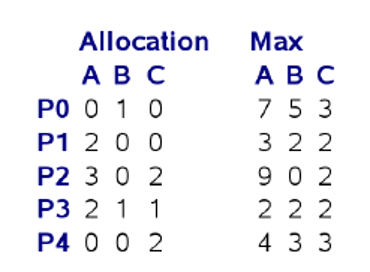
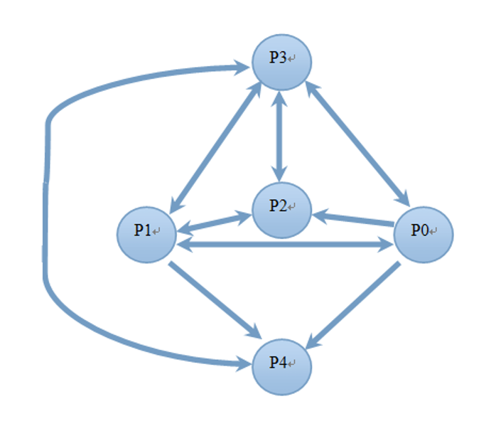

## 2013-2014学年下学期期中试卷（含答案）

### 说明

- 原卷标题：操作系统 2014年 期中考试试题

### 一、是非题（请判断以下论述是否正确。正确的标T；错误的标F，指出错误所在并修正）（2’*4=8’）

1. 页表由各个进程自己管理，进程可在用户态对页表进行更新。

    <details>
    <summary>答案：</summary>

    F

    </details>

    ***

2. 单CPU环境下由于任何时刻只有一个进程（线程）能够运行，因此操作系统不需要实现同步与互斥支持。

    <details>
    <summary>答案：</summary>

    F

    </details>

    ***

3. 在微内核结构的操作系统中，CPU调度必然在微内核内。

    <details>
    <summary>答案：</summary>

    T

    </details>

    ***

4. 在抢占式（preemptive）操作系统中，进程不会因为申请、使用资源发生死锁。

    <details>
    <summary>答案：</summary>

    T

    </details>

***

### 二、（32'）问答题

1. （5'）请详细描述一个用户态线程调用sleep()系统调用后，操作系统所执行的任务。并分析其中每一个步骤的代价大小。

    <details>
    <summary>答案：</summary>

    略

    1、系统调用过程：mode-switch, 查表（syscall handling）, 执行系统调用代码。代价大

    2、sleep() 将当前进程放入waiting队列（设置alarm）代价要具体分析决定,一般较小

    3、CPU调度（context switch）代价中

    4、系统调用结束，返回，mode-switch 代价小

    </details>

    ***

2. （12'）假设线程有运行（running）、就绪（ready）和等待（waiting）三种状态。请分别说明什么时候会发生以下状态转换：

    a) 运行 ==> 等待 (4')

    <details>
    <summary>答案：</summary>

    执行→阻塞

    正在执行的进程因等待某种事件发生而无法继续执行时，便从执行状态变成阻塞状态。

    </details>

    b) 就绪 ==> 运行 (4')

    <details>
    <summary>答案：</summary>

    处于就绪状态的进程，当进程调度程序为之分配了处理机后，该进程便由就绪状态转变成运行状态。

    </details>

    c) 等待 ==> 就绪 (4')

    <details>
    <summary>答案：</summary>

    等待状态的进程在等待的事件发生后,就又具备了继续执行的条件,该进程状态由等待状态改为就绪状态，插到就绪队列。

    </details>

    ***

3. （15'）请简述计算机系统启动，直到运行第一个用户应用程序，然后派生出第二个线程的整个过程中的可能的步骤，并分析每一个步骤的代价（大／中／小），说明理由。

    <details>
    <summary>答案：</summary>

    以上可供参考，主要观点答对就可以。

    装入引导程序，代价中

    主要数据结构初始化，代价中

    生成用户的图形用户界面 ，代价大

    存储空间，与文件系统有关的初始化，代价大

    运行第一个用户应用程序，创建进程，代价大

    派生出第二个线程，代价小

    </details>

    ***

### 三、（43'）计算题

1. （15'）使用段页式内存管理，段表和页表都存放在主存中，所有要访问的页面都在主存中。页表项可以缓存在快表（或称旁路转换缓存，TLB）中。一次内存访问的代价为 $200\ \text{ns}$，一次TLB访问代价为 $10\ \text{ns}$。

    a). 请写出以上段页式内存访问的处理流程（也可以用图示表示）（5'）

    <details>
    <summary>答案：</summary>

    a. 访问段表，检查是否违法，获取页表地址

    b. 访问快表，如果miss goto c，否则goto d

    c. 访问内存页表

    d. 访问内存

    </details>

    b). 假设TLB的命中率为50%，请计算进程对内存的有效访问时间 （effective access time）（5'）

    <details>
    <summary>答案：</summary>

    $200 + 50\% \times 10 + (1-50\%) \times 210 + 200$

    $= 510\text{ns}$

    </details>

    c). 如果要求进程对内存的有效访问时间不大于500ns，请问TLB的命中率必须提高到多少？（5'）

    <details>
    <summary>答案：</summary>

    $200+ x \times 10 + (1-x) \times 210 + 200$

    $=610-200x\le 500$

    $x\ge 110/200=55\%$

    </details>

    ***

2. （16'） 已知就绪队列中已有4个进程，所需要的CPU时间按到达次序分别为28，5，43，35个毫秒；在第10毫秒到达第五个进程，它所需要的CPU时间为8个毫秒。请写出在先来先服务（First-Come-First-Serve，FCFS）、以5毫秒和20毫秒为单位的轮询（Round-Robin）、最短作业优先（Shortest Job First）这四种不同的CPU调度下，这些进程的调度序列（可用甘特图（Gantt Chart）表示）（3' x 4），并分别计算四种不同情况下的平均响应时间（1' x 4）。

    <details>
    <summary>答案：</summary>

    FCFS: (0+28+33+76+(111-10))/5 = 47.5

    RR(5):

    p1: 0

    p2: 5

    p3: 10

    p4: 15

    p5: 20 - 10

    (0+5+10+15+10)/5 = 8

    RR(20):

    p1: 0

    p2: 20

    p3: 25

    p4: 45

    p5: 65 - 10

    (0+20+25+45+55)/5 = 29

    SJF:

    p2:0

    p1:5

    p5:33 – 10

    p4:41

    p3:76

    (5+0+23+41+76)/5 = 29

    </details>

    ***

3. （12'）现有5个进程（P0-P4），3类资源（A:9, B:5, C:5），当前的系统状态如下：

    

    |  | Allocation A | Allocation B | Allocation C | Max A | Max B | Max C |
    | --- | --- | --- | --- | --- | --- | --- |
    | P0 | 0 | 1 | 0 | 7 | 5 | 3 |
    | P1 | 2 | 0 | 0 | 3 | 2 | 2 |
    | P2 | 3 | 0 | 2 | 9 | 0 | 2 |
    | P3 | 2 | 1 | 1 | 2 | 2 | 2 |
    | P4 | 0 | 0 | 2 | 4 | 3 | 3 |

    系统剩余的资源为：Available: (2, 3, 0)

    请问：

    a) 如果系统不允许资源抢占，系统当前是否处于安全状态？如果不处于安全状态，请写出可能发生死锁的进程，并画出它们之间的等待图（wait-for graph）；如果处于安全状态，请写出进程执行的序列。（8'）

    b) 请问系统是否一定发生死锁？为什么？（4‘）

    <details>
    <summary>答案：</summary>

    a) 不安全。等待图:

    

    b) 不一定：max不一定同时达到（或主动释放）

    </details>

    ***

### 四、（17'）设计题

1. （5'） 请使用二元信号量（binary semaphore，即值只能为0或1的信号量）实现计数信号量（counting semaphore，取值可为任意整数）。

    <details>
    <summary>答案：</summary>

    计数信号量：信号量的值在0到一个大于1的限制值

    ```c
    Semaphore b =1  （binary semaphore）
    int s=1;
    s表示资源数目，计数信号量, 0.. n

    while(true)
    {
        P(b)
        s=s-1;
        V(b)
        s = s+1;
    }
    ```

    </details>

    ***

2. （12'）有A、B两个线程，需要协同工作。A和B的程序逻辑分别如下：

    ```c
    A()
    {
        A的自身处理代码;
        // A和B的同步点，即双方都要执行完自身代码;
        A的协同代码;
    }

    B()
    {
        B的自身处理代码;
        // A和B的同步点，即双方都要执行完自身代码;
        B的协同代码;
    }
    ```

    a)（8'）请使用信号量，实现A和B的第4行同步点；

    b)（4'）请说明为什么你的实现是正确的；你的实现是否会导致死锁。

    <details>
    <summary>答案：</summary>

    a)

    ```c
    Semaphore SA =1,SB=1;
    A（）
    {
        P(SA)；
        A的自身处理代码;
        V(SA)；
        // A和B的同步点，即双方都要执行完自身代码;
        P（SB）
        A的协同代码;
        V（SB）
    }

    B（）
    {
        P(SB)；
        B的自身处理代码;
        V(SB)；
        // A和B的同步点，即双方都要执行完自身代码;
        P（SA）
        A的协同代码;
        V（SA）
    }
    ```

    b) 不会死锁，不会出现资源环路等待。

    </details>
