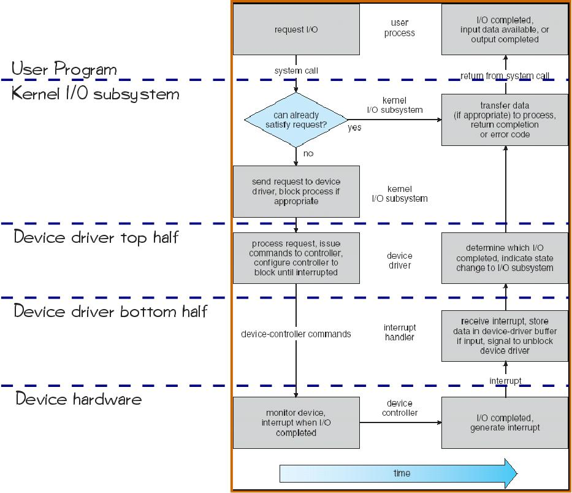

## 2013-2014学年下学期期末试卷（A）（含答案）

### 一、判断题（20 分，每题 2 分。正确的用 T 表示；错误的用 F 表示，并修正，未修正的不给分）

1. 一个用户进程执行系统调用时，运行在核心态、系统上下文中。

    

    
答案：

    F（很可能在用户上下文）

    

    ***

2. 当一个用户进程执行系统调用时，该用户进程可能从运行状态转换为就绪状态，也可能从运行状态转换为等待状态。

    

    
答案：

    T

    

    ***

3. 只使用二元信号量和计数器，而不使用计数信号量，是无法实现有界缓冲区问题（bounded-buffer）的。

    

    
答案：

    F（二者其实等价，可实现）

    

    ***

4. 不安全状态未必会导致死锁的发生；始终处于安全状态也不能保证死锁一定不会发生。

    

    
答案：

    F（安全一定无死锁）

    

    ***

5. 页表和 FCB 一样，应该存放在磁盘上，由操作系统内核进行管理，在需要的时候调入内存使用。

    

    
答案：

    F（页表存内存）

    

    ***

6. I/O 设备的驱动程序代码应该运行在使用该 I/O 设备的进程的用户态。

    

    
答案：

    F（核心态运行）

    

    ***

7. 发生缺页中断的进程将从运行态转换为就绪态。

    

    
答案：

    F（等待）

    

    ***

8. 目录是一种特殊的文件，其内容只能由操作系统中文件系统相关的代码在内核态访问。

    

    
答案：

    T

    

    ***

9. 并非所有的二级或三级存储设备都需要磁盘调度。

    

    
答案：

    T

    

    ***

10. 逻辑炸弹（logic bomb）会通过特殊的程序逻辑引起计算机硬件爆炸。

    

    
答案：

    F（通常不爆炸）

    

***

### 二、单选题（30 分，每题 3 分）

1. 以下哪种调度算法在各自的应用场景下不一定是最优的：

    A. CPU 调度，非抢占情况下的最短作业优先（对平均等待时间）；

    B. CPU 调度，抢占情况下的最短剩余时间优先（对平均等待时间）；

    C. 磁盘调度，最短寻道时间优先（对寻道时间）；

    D. 页面替换，最优调度（或称为最长不会使用优先）（对缺页率）。

    

    
答案：

    C

    

    ***

2. 磁盘调度时，访问序列中记录的是：

    A. 磁盘号；

    B. 扇区号；

    C. 柱面号；

    D. 磁道号。

    

    
答案：

    C

    

    ***

3. 关机时，操作系统的内核存储在：

    A. 内存中；

    B. BIOS 中；

    C. 文件系统中；

    D. 磁盘的主引导记录（MBR，master boot record）中。

    

    
答案：

    C

    

    ***

4. 以下哪种情况不会发生：

    A. 进程数越多，CPU 利用率越低；

    B. 进程数越多，缺页率越高；

    C. 单个进程的页框数越多，该进程的工作集越大；

    D. 单个进程的页框数越多，该进程缺页率越高。

    

    
答案：

    C

    

    ***

5. 能够检测磁盘坏道和坏块的操作是：

    A. 磁盘快速格式化；

    B. 磁盘格式化；

    C. 磁盘低级格式化；

    D. 磁盘分区。

    

    
答案：

    C

    

    ***

6. 以下对于无法放入内存的页面的叙述，错误的是：

    A. 这些页面可以存放在磁盘上的 swap 分区中；

    B. 这些页面可以存放在磁盘文件系统中的特殊文件中；

    C. 每个进程可以直接访问属于自己地址空间的页面；

    D. 无论存放在哪里，这些页面无法由用户态的程序直接访问。

    

    
答案：

    C

    

    ***

7. 在一个教师与学生共享使用的 Linux 系统中，已知任课教师 wnqian 有目录：`/home/wnqian/os/exam/`，用于存放试题和答案。该目录的所有者是 wnqian，所属的组中包括 wnqian 和历年的助教（每年不同）。该目录下还有 `/home/wnqian/os/exam/2013`，`/home/wnqian/os/exam/2014` 等目录，分别存放各年的试题。助教应只能访问担任助教当年的目录。请问，对于 `/home/wnqian/os/exam/` 目录，以下哪种权限设置是最合理的，符合最小权限原则？

    A. `rwxrwx---`

    B. `rwxr-xr-x`

    C. `rwx--x---`

    D. `rw-------`

    

    
答案：

    C

    

    ***

8. 以下哪种数据访问任务和存储介质的组合是不合适的？

    A. 日志存放于磁带；

    B. 日志存放于磁盘；

    C. 页面交换文件存放于 u 盘；

    D. 备份数据存放于光盘。

    

    
答案：

    C

    

    ***

9. 以下哪种信息可不存放在文件控制块中？

    A. 文件大小；

    B. 文件访问权限；

    C. 文件所属目录；

    D. 文件数据存放位置指针。

    

    
答案：

    C

    

    ***

10. 以下哪种手段对降低缺页率没有直接帮助？

    A. 增加页框；

    B. 预取页面；

    C. 插入不必要的 I/O 指令；

    D. 减少系统中同时运行的进程数目。

    

    
答案：

    C

    

***

### 三、简答题（20 分，每题 5 分）

1. 试简述 Unix 系统是如何实现对文件 `/usr/lib/abc` 的访问的。

    

    
答案：

    答题要点：迭代访问目录；内核态 FCB 访问；打开文件列表操作。

    

    ***

2. 试简述采用 DMA 方式进行 I/O 操作的整个过程，并说明 DMA 方式适合哪种类型的 I/O 操作，并解释原因。

    

    
答案：

    答题要点：cycle-stealing；块设备，大量数据（连续）交换；CPU 不用直接介入；

    

    ***

3. 试简述用户进程进行 I/O 操作至 I/O 操作完成的整个过程，说明其中的系统调用和中断处理过程，并特别说明其中涉及的模式转换（mode switch）和上下文切换（context switch）的时间和次数。

    

    
答案：

    答题要点：

    

    

    ***

4. 试简述缺页中断处理的详细过程（从发生缺页中断开始至页面调度结束，进程继续执行为止），并指明每一个步骤中，处理所处的上下文环境和模式。

    

    
答案：

    答题要点：

    What does OS do on a Page Fault?:

    1. Choose an old page to replace: who?（discussed later）

    2. If old page modified（“D=1”）, write contents back to disk

    3. Change its PTE and any cached TLB to be invalid

    4. Load new page into memory from disk

    5. Update page table entry, invalidate TLB for new entry

    6. Continue thread from original faulting location: Can we?

    

***

### 四、计算、设计题（30 分，每题 10 分）

1. 某磁盘磁头访问范围为 1000（编号为 0~999），如果在为访问 365 的请求者服务后，当前正在为访问 350 的请求者服务，同时有若干个请求者在等待服务，它们依次要访问的编号为（以请求时间先后顺序排列）：

    128，879，697，480，110，381

    （1）分别用先来先服务（FCFS）、最短寻道时间优先（SSTF）、扫描（SCAN）和循环扫描（CSCAN）算法进行磁盘调度时，试确定实际的服务次序。

    （2）假设磁臂在寻道时相邻编号移动的平均时间为 $0.4\ \text{ms}$，按实际服务次序计算（1）中四种算法下磁臂移动的总距离以及总寻道时间。

    

    
答案：

    参考答案：

    （1）FCFS：

    服务次序：（350）128，879，697，480，110，381

    总磁道数：$(350-128)+(879-128)+(879-110)+(381-110)=2013$

    寻道时间：$2013\times0.4=805.2\ \text{ms}$

    （2）SSTF：

    服务次序：（350）381，480，697，879，128，110

    总磁道数：$(879-350)+(879-110)=1298$

    寻道时间：$1298\times0.4=519.2\ \text{ms}$

    （3）SCAN：

    服务次序：（350）128，110，381，480，697，879

    总磁道数：$(350-110)+(879-110)=1009$

    寻道时间：$1009\times0.4=403.6\ \text{ms}$

    

    ***

2. 已知页面访问序列为：1, 2, 3, 4, 1, 2, 4, 1, 3, 5，分配的页框数为 3。

    （1）请分别用 FIFO、LRU、时钟算法，写出调页的过程，并计算缺页率。

    （2）请问时钟算法是否会导致 Belady 异常，为什么？

    

    
答案：

    参考答案：

    FIFO：

    1*, 2*, 3*,4*, 1*, 2*, 4, 1, 3*, 5*, 8 次

    LRU：

    1*, 2*, 3*, 4*, 1*, 2*, 4, 1, 3*, 5*, 8 次

    时钟算法：

    和初始时钟位置有关

    可能会

    

    ***

3. 已知一个磁盘块大小为 $16\ \text{KB}$，一个磁盘地址长度为 4 字节。现有大小为 1 个磁盘块的 i-node 结构，其中包含 1 个三级索引指针、1 个 2 级索引指针、1 个 1 级索引指针，剩余空间全部用于存放直接指针。请问：

    （1）这一结构最多能够管理多大的文件？

    （2）如果要访问第 $512\ \text{MB}$ 的数据（从 0 开始，只访问 1 个字节），至少需要访问几次磁盘？请写出计算过程。

    

    
答案：

    $16\ \text{K}/4=4\ \text{K}$（4096）

    直接指针：$4096-3$，容量：$4093\times16\ \text{KB}<64\ \text{MB}$

    一级指针：$1\times4096\times16\ \text{KB}=64\ \text{MB}$

    二级指针：$4096\times4096\times16\ \text{KB}=256\ \text{GB}$

    三级指针：$4096\times4096\times4096\times16\ \text{KB}$

    二级指针块内，3 次磁盘访问

    

