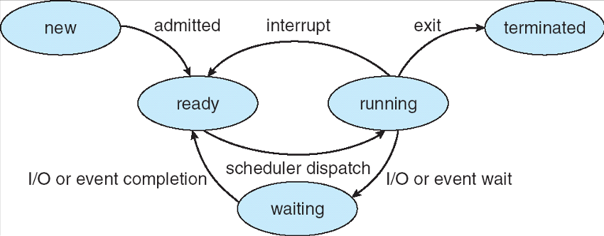

## 2014-2015学年下学期月考试卷（含答案）

### 说明

- 原卷标题：华东师范大学软件学院月考试卷（2014—2015 学年第二学期）
- 日期：2015.3

### 一、判断题（15 分，每小题 3 分）

判断下列每句话是否正确，如错误请说明理由。

1. 线程都保存有各自的栈信息、CPU 状态（寄存器、指令计数器等）、堆信息，以及打开文件列表等。

    

    
答案：

    错。线程保存栈信息、CPU 状态；而堆信息，以及打开文件列表等是进程保存的。

    （线程实现了资源和调度单位相分离）

    

    ***

2. 对于内核支持的线程，当该线程执行系统调用被阻塞时，不仅该线程被阻塞，而且同一进程内的所有线程都会被阻塞。

    

    
答案：

    错。只有当前进程被阻塞，其它进程可以继续执行。

    

    ***

3. 在微内核结构的操作系统中，进程间通讯可以不在微内核内。

    

    
答案：

    错。进程通讯是内核的核心功能，对微内核系统，也在微内核内实现。

    

    ***

4. 向操作系统传递参数只能通过寄存器实现。

    

    
答案：

    错。还可以通过堆栈传递等

    

    ***

5. 当前运行进程发生缺页中断，进程将进入 Ready 队列

    

    
答案：

    错。进入 waiting 队列。

    

***

### 二、不定项选择题（15 分，每小题 3 分）

每题有一个或多个答案，答错、少选、多选均不给分。

1. 以下哪些（个）操作会使得一个进程从运行（running）状态转换为就绪（ready）状态（ ）

    A. 在可占先（preemptive）系统中，高优先级进程被创建

    B. 分时系统中，时间片到

    C. 当前运行进程发生缺页中断

    D. 当前运行进程调用 yield( )，主动放弃使用 CPU

    

    
答案：

    ABD

    

    ***

2. 当从“新建（new）”状态进入“就绪（ready）”状态的进程增多时，下面哪种情况不会发生（ ）

    A. I/O 操作的频度升高；

    B. CPU 利用率下降

    C. CPU 利用率上升

    D. 进程的平均响应时间减少

    

    
答案：

    D

    

    ***

3. 以下描述正确的是（ ）

    A. 中断处理程序（interrupt handler）是进程的一部分，在进程的地址空间运行

    B. 中断处理程序（interrupt handler）必须运行在内核态

    C. 微内核体系结构下，进程间通讯（inter-processing communication）必须在微内核内

    D. 分时（time sharing）的目的是提高 CPU 和 I/O 的并行度

    

    
答案：

    BC

    

    ***

4. 以下哪些（个）对于微内核操作系统的描述是正确的？（ ）

    A. Microsoft Windows 是微内核操作系统，但 Linux 不是；

    B. 进程间通信必须在微内核内实现；

    C. 因为用户进程不应访问页表，因此虚存应该在微内核内实现；

    D. 操作系统设计时采用微内核结构可以提高操作系统执行的效率。

    

    
答案：

    B

    

    ***

5. 以下对于线程的描述哪些（个）是错误的（ ）

    A. 一个用户态线程的阻塞（block）会引起它所属的整个进程（包括其中的其它线程）的阻塞；

    B. 同一个进程的不同线程可以共享地址空间中的堆；

    C. 线程间通信必须通过内核态系统调用进行；

    D. 同一个进程的不同线程必须维护各自的调用栈和 CPU 状态。

    

    
答案：

    C

    

***

### 三、辨析题（30 分，每小题 6 分）

分别解释以下每组的两个名词，并列举他们的区别。

1. 分时（time-sharing）与多道程序（multi-programming）

    

    
答案：

    分时：将时间划分成时间片，进程按时间片轮流执行

    多道：系统中存在多个程序同时执行

    区别：分时主要针对提高系统的响应速度，改善用户体验；多道主要针对增加系统的利用率。

    

    ***

2. 长程调度（long-term scheduling）与中程调度（mid-term scheduling）

    

    
答案：

    长程调度：操作系统决定到底有多少进程能够从“new”状态进入就绪状态的调度

    中程调度：操作系统决定哪些进程的地址空间能够保留在内存中，哪些进程的地址空间需要被交换到外存的调度

    区别：长程调度被用于平衡系统资源利用率与并发进程个数；中程调度被用于控制运行与就绪进程有足够的内存、较低的缺页率能够运行。

    

    ***

3. 中断（Interrupt）和陷阱（Trap）

    

    
答案：

    An interrupt is a hardware-generated change of flow within the system. An interrupt handler is summoned to deal with the cause of the interrupt; control is then returned to the interrupted context and instruction. A trap is a software-generated interrupt. An interrupt can be used to signal the completion of an I/O to obviate the need for device polling. A trap can be used to call operating system routines or to catch arithmetic errors.

    

    ***

4. 微内核和模块化内核

    

    
答案：

    微内核：操作系统内核只包含最基本的功能（进程调度和进程间通讯）

    模块化内核：操作系统内核的一些功能可以作为模块挂载

    区别：微内核中内核和其它操作系统的功能模块（如虚存管理）在不同的地址空间运行，模块化内核中它们在一个地址空间。

    

    ***

5. 核心态和用户态

    

    
答案：

    核心态：操作系统内核执行的受保护的状态

    用户态：用户进程执行所在的状态

    区别：处于用户态只能访问进程的地址空间，用户态需要通过中断或系统调用才能进入核心态。

    

***

### 四、综合题（40 分）

1. 请简要说明“机制（mechanism）”和“策略（policy）”分离的优点。（5 分）

    

    
答案：

    Mechanism and policy must be separate to ensure that systems

    are easy to modify. No two system installations are the same, so each

    installation may want to tune the operating system to suit its needs.

    With mechanism and policy separate, the policy may be changed at will

    while the mechanism stays unchanged. This arrangement provides a

    more flexible system.

    

    ***

2. 调度队列有哪几种？请简单说明（5 分）

    

    
答案：

    Ready 队列。已经调入内存在 Ready 状态等待执行的进程队列。

    I/O 队列。在特定的 I/O 设备资源上等待资源的出现的队列。每个 I/O 设备都有一个相应的队列。

    job 队列。Job queue -- set of all processes in the system

    

    ***

3. 进程创建时（如在类 UNIX 操作系统中，连续执行 fork() 和 exec() 系统调用），操作系统所需要进行那些工作，它们的代价如何（大，中，小）。为什么线程创建比进程快，它主要节省了以上哪个步骤的代价？（10 分）

    

    
答案：

    a. 构造 PCB，代价小

    b. 设置地址空间映射，代价中

    c. 复制父进程地址空间内容，代价大

    d. 复制 I/O 状态，代价中

    （2）为什么线程创建比进程快，它主要节省了以上哪个步骤的代价？（4 分）

    答：同一进程的不同线程共享资源，因此以上 b, c, d 三项代价几乎都可节省

    

    ***

4. 请详细描述一个用户态线程调用 sleep() 系统调用后，操作系统所执行的任务。（8 分）

    

    
答案：

    1. 系统调用过程：mode-switch, 查表（syscall handling）, 执行系统调用代码。

    2. sleep() 将当前进程放入 waiting 队列（设置 alarm）

    3. CPU 调度（context switch）

    4. 系统调用结束，返回，mode-switch

    

    ***

5. 假设某操作系统进程有 5 个状态，分别为：new， ready， running，waiting，terminated。请画出其状态转移图，需标注进程转换的条件。（12 分）

    

    
答案：

    

    

***

## 2014-2015学年下学期月考试卷（二）（含答案）

### 说明

- 原卷标题：华东师范大学软件学院月考试卷（二）（2014—2015 学年第二学期）

### 一、判断题（15 分，每小题 3 分）

判断下列每句话是否正确，如错误请说明理由。

1. 发生缺页中断的进程将从运行态转换为等待态。

    

    
答案：

    对。

    

    ***

2. 段页式内存分配方案可以同时避免产生外部碎片和内部碎片。

    

    
答案：

    错，段页式分配仍然也可能会产生内部碎片。

    

    ***

3. Belady 异常是指过多缺页导致 Swap in,swap out 增多，即 I/O 操作增多，从而引起 CPU 利用率下降，导致操作系统增加更多的用户进程进入系统，反过来导致更多缺页的现象。

    

    
答案：

    错，以上是 Thrashing（颠簸，抖动）；Belady 异常是指“分配页框越多，缺页率反而越高”。

    

    ***

4. 虚拟内存的容量只受计算机系统地址位数的限制。

    

    
答案：

    错，还受限于物理内存和磁盘的大小。

    

    ***

5. 基于转换表缓冲区（TLB）的数据访问最多只需要两次内存访问。

    

    
答案：

    错，最多几次内存访问取决于分页策略，段页式、散列页表或者多级页表可能需要多于两次内存访问。

    

***

### 二、单项选择题（15 分，每小题 3 分）

1. 虚拟存储的基础是程序局部性理论，它的基本含义是（ ）。

    A. 代码的顺序执行

    B. 程序执行时对内存访问的不均匀性

    C. 变量的连续访问

    D. 指令的局部性

    

    
答案：

    B

    

    ***

2. 采用分段式存储管理的系统中，若地址用 32 位表示，其中 12 位表示段号，则允许每段的最大长度是：

    A. 12

    B. 20

    C. $2^{12}$

    D. $2^{20}$

    

    
答案：

    D

    

    ***

3. 使用段页式内存管理，段表和页表都存放在主存中，所有要访问的页面都在主存中。页表项可以缓存在转换表缓冲区（TLB）中。一次内存访问的代价为 $100\ \text{ns}$，一次 TLB 访问代价为 $10\ \text{ns}$。假设 TLB 的命中率为 50%，请问进程对内存的有效访问时间（effective access time）是：

    A. $110\ \text{ns}$

    B. $210\ \text{ns}$

    C. $160\ \text{ns}$

    D. $320\ \text{ns}$

    

    
答案：

    B

    

    ***

4. 某作业访问页面的顺序为 2, 3, 2, 1, 5, 2, 4, 5, 3, 2, 5, 2，分配给该作业三个框，则采用 LRU 页面置换算法会产生几次缺页中断？

    A. 5

    B. 6

    C. 7

    D. 8

    

    
答案：

    C

    

    ***

5. 以下对于按需调页的页面替换算法的描述，正确的是：

    A. 在缺页率上，最优调页必然优于（或相当于）LRU 算法；

    B. 先进先出（FIFO）算法必然会导致页框越多，缺页率越高；

    C. LRU 算法在替换页面查找效率上优于 FIFO 算法；

    D. 以上皆错。

    

    
答案：

    A

    

***

### 三、辨析题（30 分，每小题 6 分）

分别解释以下每组的两个名词，并列举他们的区别。

1. 逻辑地址与物理地址

    

    
答案：

    逻辑地址：又称为虚拟地址，由程序产生的与段相关的偏移地址部分；

    物理地址：出现在 CPU 外部地址总线上的寻址物理内存的地址信号，是地址变换的最终结果地址；

    区别：物理地址通常是唯一的，而逻辑地址与物理地址可以是多对一的关系；而且用户程序通常只能操作逻辑地址，通过操作系统提供的保护机制，物理地址对用户程序是透明的。

    

    ***

2. Valid/invalid bit 与 dirty bit.

    ***

3. 动态加载 vs 动态链接

    

    
答案：

    动态加载：P280. 例程仅在被调用时加载。未被使用的例程不会被加载。

    动态链接：P281. 程序仅在被调用时链接。被链接的程序一般是系统库函数。

    区别。P282

    

    ***

4. 页表和转换表缓冲区（TLB）

    

    
答案：

    页表：在分页的内存管理策略中，页表实现了逻辑地址向物理地址的转换，通常保持在内存中；

    转换表缓冲区：它是一段小且专用的快速硬件缓冲，其中保持了页表中的一部分条目。

    区别：转换表缓冲区的访问速度远快于内存访问，因此比页表访问具有更高的时间效率，但是由于缓冲区通常是很小的一部分空间，因此只能容纳页表中很少的一部分。

    

    ***

5. 最优置换策略和 LRU 置换策略

    

    
答案：

    最优置换策略：按需调页时，置换最长时间不会使用的页。

    LRU 置换策略：按需调页时，置换最长时间没有使用的页。

    区别：由于我们未知进程运行需要的页，最优置换算法难以实现，可以使用最长时间没有使用的页来近似最长时间不会使用的页。

    

***

### 四、综合题（40 分）

1. 五个内存块大小依次为 $100\ \text{KB}$, $500\ \text{KB}$, $200\ \text{KB}$, $300\ \text{KB}$, $600\ \text{KB}$。分别用 first-fit, best-fit, 以及 worst-fit 算法处理 $212\ \text{KB}$, $417\ \text{KB}$, $112\ \text{KB}$, and $426\ \text{KB}$ (按序)的内存请求，请说明各算法的分配情况。对于当前情况，那种算法比较好？

    

    
答案：

    Answer:

    (a) First-fit:

    1 212K is put in 500K partition

    2 417K is put in 600K partition

    3 112K is put in 288K partition (new partition 288K = 500K - 212K)

    4 426K must wait

    (b) Best-fit:

    1 212K is put in 300K partition

    2 417K is put in 500K partition

    3 112K is put in 200K partition

    4 426K is put in 600K partition

    (c) Worst-fit:

    1 212K is put in 600K partition

    2 417K is put in 500K partition

    3 112K is put in 388K partition

    4 426K must wait

    In this example, best-fit turns out to be the best

    

    ***

2. （1）某系统段表如下,求以下逻辑地址的物理地址。（5 分）。

    (a) 0, 0x430000；(b) 1, 0x10000；(c) 2, 0x500000；

    (d) 3,0x400000； (e) 4, 0x112000

    | 段号 | 基地址 | 长度 |
    | --- | --- | --- |
    | 0 | 0x219000 | 0x600000 |
    | 1 | 0x2300000 | 0x14000 |
    | 2 | 0x90000 | 0x100000 |
    | 3 | 0x1327000 | 0x580000 |
    | 4 | 0x1952000 | 0x96000 |

    

    
答案：

    a. 0x219000 + 0x430000 = 0x649000

    b. 0x2300000 + 0x10000 = 0x2310000

    c. illegal reference, trap to operating system

    d. 0x1327000 + 0x400000 = 0x1727

    :::tip
    此处原参考答案疑似有误：题目为 `3, 0x400000`，但参考答案写作 `0x1327000 + 0x400000 = 0x1727`，结果看起来被截断或写错。这里按原参考答案保留。
    :::

    e. illegal reference, trap to operating system

    

    （2）某 32 位系统采用分页技术进行内存分配，页大小为 $4\ \text{KB}$。某进程的页表如下，请在内存中定位下列虚拟地址的物理地址：0x0c73, 0x1e41, 0x2b4c, 0x37bb, 0x580b（5 分）。

    | 页号 | 框号 | i/v |
    | --- | --- | --- |
    | 0 | 4 | v |
    | 1 | 2 | v |
    | 2 | 5 | v |
    | 3 | 3 | v |
    | 4 | 8 | i |

    

    
答案：

    0x0c73 --> 0x4c73

    0x1e41 --> 0x2e41

    0x2b4c --> 0x5b4c

    0x37bb --> 0x37bb

    0x480b --> 超出了页表长度，非法内存访问

    :::tip
    此处题目最后一个地址为 `0x580b`，但原参考答案写作 `0x480b --> 超出了页表长度，非法内存访问`。这里按原参考答案保留。
    :::

    

    ***

3. 请解释多级页表、反向页表、散列页表（或叫“哈希”页表）的概念（可画图表示），并从地址翻译的效率、内存空间占用这两个角度，详细分析对于 64 位 CPU 的计算机，这三种技术各自的优缺点。（10 分）

    

    
答案：

    略

    

    ***

4. （10 分）现有两个进程 P1 和 P2，当前的页面访问序列分别为：

    P1: 1, 2, 3, 4, 1, 2, 5

    P2: 6, 7, 8, 6, 7, 6, 7

    这两个进程总共可有 5 个页框可供使用。假设使用 LRU 替换策略，页框分配采用固定分配（即分配后不可修改），请问如何在两个进程间分配页框可以达到缺页率最低？请写出替换序列，和缺页率计算过程（4 分）；并证明该分配对于给出的序列是最优的（6 分）。

    

    
答案：

    2, 3 （10 次缺页）

    <u>1</u>, 1, <u>3</u>, <u>4</u>, 1, <u>2</u>, <u>5</u>

    &nbsp;&nbsp;&nbsp;<u>2</u>, 2, <u>3</u>, <u>4</u>, <u>1</u>, <u>2</u>

     

    <u>6</u>, 6, 6, 6, 6, 6, 6

    &nbsp;&nbsp;&nbsp;<u>7</u>, 7, 7, 7, 7, 7

    &nbsp;&nbsp;&nbsp;&nbsp;&nbsp;&nbsp;<u>8</u>, 8, 8, 8, 8

    证明：

    1. 给 P2 更多页面不会减少 P2 的缺页率；
    2. 给 P1 3 个页面不会减少 P1 的缺页率，但是会增加 P2 的缺页率；
    3. 给 P1 4 个页面，P1 的缺页次数为 5，但是 P2 的缺页次数为 7。

    

***

## 2014-2015学年下学期月考试卷（三）（含答案）

### 说明

- 原卷标题：华东师范大学软件学院月考试卷（三）（2014—2015 学年第二学期）
- 日期：2015.5

### 一、判断题（15 分，每小题 3 分）

判断下列每句话是否正确，如错误请说明理由。

1. 当一个操作系统采用连续内存分配方案时，只可能产生外部碎片。

    

    
答案：

    错，在相同大小连续内存分配方案中也可能会产生内部碎片。

    

    ***

2. 在虚存管理时，采用 LRU 页面替换策略可能发生 Belady 异常（即分配页框越多，缺页率反而越高）。

    

    
答案：

    错，LRU 和 Optimal 算法都不可能发生 Belady 异常；只有 FIFO 可能发生 Belady 异常。

    

    ***

3. 从有效内存访问时间来看，基于转换表缓冲区（TLB）的分页策略一定优于纯分页策略。

    

    
答案：

    错，如果 TLB 的命中率特别低，基于转换表缓冲区的分页策略可能比纯分页策略要差。

    

    ***

4. 在按需分页中，通过安装更快的 CPU 可以改善多道程序程度过高而导致的系统颠簸。

    

    
答案：

    错，颠簸是由于多道程序程度过高，导致缺页率大幅增加，而 CPU 利用率急剧下降。此时，很多进程在等待 I/O，因此即使安装更快的 CPU 也无助于改善系统颠簸。

    

    ***

5. 页表由各个进程自己管理，进程可在用户态对页表进行更新。

    

    
答案：

    错，首先不是所有的页表都是进程自己管理，如反向页表是操作系统管理的；其次，页表的修改只有在内核态进行更新。

    

***

### 二、单项选择题（15 分，每小题 3 分）

1. 采用分段式存储管理的系统中，若地址用 24 位表示，其中 8 位表示段号，则允许每段的最大长度是：

    A. $2^{24}$

    B. $2^{16}$

    C. $2^8$

    D. $2^{32}$

    

    
答案：

    B

    

    ***

2. 使用段页式内存管理，段表和页表都存放在主存中，所有要访问的页面都在主存中。页表项可以缓存在转换表缓冲区（TLB）中。一次内存访问的代价为 $100\ \text{ns}$，一次 TLB 访问代价为 $10\ \text{ns}$。假设 TLB 的命中率为 50%，请问进程对内存的有效访问时间（effective access time）是：

    A. $110\ \text{ns}$

    B. $160\ \text{ns}$

    C. $260\ \text{ns}$

    D. $320\ \text{ns}$

    

    
答案：

    C ($100+50\%\times 10+50\%\times 110+100=260$)

    

    ***

对于接下来的 3 个问题，假设某作业访问页面的顺序为 2, 3, 2, 1, 5, 2, 4, 5, 3, 2, 5, 2，分配给该作业三个内存块。

3. 采用 FIFO 页面置换算法会产生 $\underline{\qquad}$ 次缺页中断。

    A. 7

    B. 8

    C. 9

    D. 10

    

    
答案：

    C

    

    ***

4. 采用 LRU 页面置换算法会产生 $\underline{\qquad}$ 次缺页中断。

    A. 6

    B. 7

    C. 8

    D. 9

    

    
答案：

    B

    

    ***

5. 采用最优页面（OPT）置换算法会产生 $\underline{\qquad}$ 次缺页中断。

    A. 5

    B. 6

    C. 7

    D. 8

    

    
答案：

    B

    

***

### 三、辨析题（30 分，每小题 6 分）

分别解释以下每组的两个名词，并列举他们的区别。

1. 内部碎片与外部碎片

    

    
答案：

    内部碎片：某一区域或某一页中，未被占据其位置的作业所使用的区域。直到作业完成，释放页或区域，这个空间才能被系统所利用。

    外部碎片：还没有分配出去，但是由于大小太小而无法分配给申请空间的新进程的内存空间空闲块。

    区别：外部碎片不属于任何一个进程，如果不使用压缩算法直到内存断点为止；而内部碎片隶属于一个进程，随着进程释放内存空间而释放。

    

    ***

2. 页式内存管理和段式内存管理

    

    
答案：

    页式内存管理：将逻辑地址空间和物理地址空间分成同样大小的片，利用页表实现逻辑地址空间向物理地址空间的转换。

    段式内存管理：将逻辑地址空间进行分段，每段大小可变，利用段表实现逻辑地址空间向物理地址空间的转换。

    区别：分段直接对物理地址空间划分，可能会产生外部碎片和内部碎片，而分页技术同时对逻辑地址空间和物理地址空间进行划分，它只产生外部碎片；帧大小普遍小于段的大小，但是页表通常远远大于段表的大小，从而造成分页的地址转换开销比较大。

    

    ***

3. 哈希页表和反向页表

    

    
答案：

    哈希页表：以虚拟页号为键，物理帧号为值建立哈希页表，发生碰撞的页表项以链表数据结构组织。

    反向页表：反向页表对每个物理内存帧才有一个条目，而且每个页表项按照物理内存帧号进行排序。

    区别：哈希页表针对某一个进程而建立的多级页表结构，而反向页表是针对整个操作系统而建立页表结构

    

    ***

4. 最优置换和 LRU 置换

    

    
答案：

    最优置换：按需调页时，置换最长时间不会使用的页。

    LRU 置换：按需调页时，置换最长时间没有使用的页。

    区别：由于我们未知进程运行需要的页，最优置换算法难以实现，可以使用最长时间没有使用的页来近似最长时间不会使用的页。

    

    ***

5. 按需调页和交换

    

    
答案：

    按需调页：进程执行过程中，在需要时才调入相应的物理页，这种技术称为按需调页，又称为懒惰交换。

    交换：把处于等待状态的进程从内存中移到二级存储，并释放该进程占用的内存空间，这一过程称为交换。

    区别：按需调页细粒度地实现进程中的某个或某些内存页和二级存储间的交换，而交换是整个进程的所占用内存空间与二级存储间的交换。

    

***

### 四、综合题（40 分）

1. 简述缺页中断处理的详细过程（从发生缺页中断开始至页面调度结束），并指明每个步骤中，处理所处的上下文环境和模式。（10 分）

    

    
答案：

    How does OS handle a Page Fault?

    1. Choose an old page to replace in terms of a page-replacement algorithm

    2. If old page modified (“D=1”), write contents back to disk

    3. Change its PTE and any cached TLB to be invalid

    4. Load new page into memory from disk

    5. Update page table entry, validate TLB for new entry

    6. Continue thread from the new location via accessing the page table

    

    ***

2. 一个 32 位的操作系统，内存大小为 $2\ \text{GB}$，采用分页技术进行内存分配，如果每页的大小为 $4\ \text{KB}$：（10 分）

    a) 请说明各需多少位表示虚拟地址、物理地址、虚拟页号、物理帧号和偏移量（5 分）？

    

    
答案：

    VA: 32, PA: 31, pages：20，# frames：19，offset：12

    

    b) 如果某进程的页表如下，请在内存中定位下列虚拟地址的物理地址：3187, 7745, 11084, 14267, 18443（5 分）。

    | PageID | FrameID |
    | --- | --- |
    | 0 | 4 |
    | 1 | 2 |
    | 2 | 5 |
    | 3 | 3 |

    

    
答案：

    3187 -> 19571

    7745 -> 11841

    11084 -> 23372

    14267 -> 14267

    18843 超出了页表长度，非法内存访问

    

    ***

3. 采用按需调页（demand paging），现有 3 个页框，分别存储着页面号 2,3,4 三个页面。已知接下来的页面访问顺序为 1,2,3,4,1,2,5,1,2,3,4,5。使用时钟算法（clock algorithm）作为页面替换算法。（10 分）

    请计算会发生的缺页次数（假设初始时在页框内的页面的引用位（reference bit）都是 1，2/3/4 三个页面按序存放，初始时指针指向页面 2）？（7 分）

    

    
答案：

    9 次缺页

    

    

    请写出这一内存访问序列所对应的时间段中的工作集（3 分）

    

    
答案：

    {1,2,3,4,5}

    

    ***

4. 现有两个进程 P1 和 P2，当前的页面访问序列分别为：P1: 1, 2, 3, 4, 1, 2, 5 和 P2: 6, 7, 8, 6, 7, 6, 7。这两个进程总共可有 5 个页框可供使用。假设使用 LRU 替换策略，页框分配采用固定分配（即分配后不可修改），请问如何在两个进程间分配页框可以达到缺页率最低？

    a) 请分别写出两个进程的替换序列，并计算总的缺页次数（6 分）。

    

    
答案：

    2, 3 （10 次缺页） (1+4 也是 10 次,也算正确,答案不唯一)

    <u>1</u>, 1, <u>3</u>, <u>4</u>, <u>1</u>, <u>2</u>, <u>5</u>

    &nbsp;&nbsp;&nbsp;<u>2</u>, 2, 3, 4, 1, 2

     

    <u>6</u>, 6, 6, 6, 6, 6, 6

    &nbsp;&nbsp;&nbsp;<u>7</u>, 7, 7, 7, 7, 7

    &nbsp;&nbsp;&nbsp;&nbsp;&nbsp;&nbsp;<u>8</u>, 8, 8, 8, 8

    

    b）并证明这种帧分配对于给定的内存访问序列是最优的（4 分）。

    

    
答案：

    证明： a. 给 P2 更多页面不会减少 P2 的缺页率

    b. 给 P1 3 个页面不会减少 P1 的缺页率，但是会增加 P2 的缺页率；

    c. 给 P1 4 个页面，P1 的缺页次数为 5，但是 P2 的缺页次数为 7。

    

