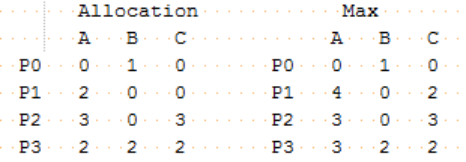

## 2016-2017学年上学期期中试卷（含答案）

### 说明

- 原卷标题：华东师范大学计算机科学与软件工程学院期中考试卷（2016—2017学年第一学期）

### 一、判断题（30分，每小题3分）

判断下列每句话是否正确，如错误请说明理由。

1. 如果信号量S的当前值为 -5 时，则表示系统中共有 5 个等待的进程。

    <details>
    <summary>答案：</summary>

    错。S=-5表示当前有5个进程等待进入该信号量所对应的临界区。

    </details>

    ***

2. 取值为0或者1的信号量只能实现互斥访问。

    <details>
    <summary>答案：</summary>

    错。信号量可以实现互斥和同步。

    </details>

    ***

3. 发生死锁时系统一定处于不安全状态。

    <details>
    <summary>答案：</summary>

    对。发生死锁时找不到一个安全序列。

    </details>

    ***

4. 资源分配图中存在环时，系统中某些进程处于死锁状态。

    <details>
    <summary>答案：</summary>

    错。当每种资源实例个数为一时，在环中的每个进程处于死锁状态。但是当资源实例数量不唯一时，不一定处于死锁状态。

    </details>

    ***

5. 如果一个进程只需要一个资源即可完成，那么这个进程一定不会处于死锁状态。

    <details>
    <summary>答案：</summary>

    对。因为不满足死锁必要条件中的持有并等待。

    </details>

    ***

6. 在多处理器系统中，通过关中断的方式可以解决进程间互斥访问的问题。

    <details>
    <summary>答案：</summary>

    错。在多处理器系统中，关中断不能保重临界区的互斥访问。

    </details>

    ***

7. 进程所请求打开的文件打开后，将使进程状态从运行态变为就绪态。

    <details>
    <summary>答案：</summary>

    错。等待态变为就绪态。

    </details>

    ***

8. 在生产者-消费者问题中，生产者进程和消费者进程只要解决互斥访问的问题即可。

    <details>
    <summary>答案：</summary>

    错。当buffer为空时，只有等待生成者进程完成一个产品生成后，消费者才可以消费。因此，还要解决进程间同步的问题。

    </details>

    ***

9. 死锁是指因进程间相互竞争资源，使得系统中有多个进程因得不到所需资源而处于阻塞的状态。

    <details>
    <summary>答案：</summary>

    错。根据银行家算法，在当前时刻，无论有多少进程处于阻塞状态，只要找到一个安全序列说明整个系统处于安全状态，系统就不会出现死锁。

    </details>

    ***

10. 管程中对条件变量的signal（）和信号量中的signal（）操作具有相同的效果。

    <details>
    <summary>答案：</summary>

    错。管程中对条件变量的signal（）可以什么都不做，而信号量中的signal（）操作必然改变信号量的值。

    </details>

***

### 二、多项选择题（15分，每小题3分)

每题有一个或多个答案，答错、少选、多选均不给分。

1. 以下哪种情况仍然可能会发生死锁？（ ）

    A. 资源都是不共享的；

    B. 每个进程必须一次申请、获得所需的所有资源

    C. 空闲资源能够满足任意一个进程还需要的资源需求

    D. 每一种资源的数量都超过单个进程所需这类资源的最大值

    <details>
    <summary>答案：</summary>

    AD

    </details>

    ***

2. 对于死锁，以下哪些（个）描述是正确的：（ ）

    A. 系统中每个进程都需要多个资源才能运行结束，则系统可能会处于死锁状态

    B. 资源分配图中有环（以资源类型和进程为节点），必然发生死锁

    C. 死锁避免（deadlock avoidance）中，发生死锁必然处于不安全状态

    D. 如果每个进程可以分批申请所需的资源，如果不能满足其要求，则让其忙等，那么死锁不可能发生

    <details>
    <summary>答案：</summary>

    AC

    </details>

    ***

3. 以下描述正确的是：（ ）

    A. 中断处理程序（interrupt handler）是进程的一部分，在进程的地址空间中运行

    B. 中断处理程序（interrupt handler）必须运行在内核态

    C. 微内核体系结构下，进程间通讯（inter-processing communication）必须在微内核内

    D. 分时（time sharing）的目的是改善用户体验

    <details>
    <summary>答案：</summary>

    BCD

    </details>

    ***

4. 一个正在运行的进程，当所分配的时间片用完后，不可能将其挂在（ ）。

    A．等待队列

    B．运行队列

    C．就绪队列

    D．无法确定

    <details>
    <summary>答案：</summary>

    AB

    </details>

    ***

5. 以下那个操作会使得一个进程从运行（running）状态转换为就绪（ready）状态：（ ）

    A. 进程提交I/O请求

    B. 分时系统中，时间片到

    C. 当前运行进程发生缺页中断

    D. 当前运行进程调用yield()，主动放弃使用CPU

    <details>
    <summary>答案：</summary>

    BD

    </details>

***

### 三、辨析题（30分，每小题6分）

分别解释以下每组的两个名词，并列举他们的区别。

1. 死锁（deadlock）与饥饿（starvation）

    <details>
    <summary>答案：</summary>

    死锁：多个进程循环等待对方，都无法继续执行

    饥饿：某个或某些进程由于无法得到资源长时间无法执行

    死锁必然发生饥饿，但是饥饿不一定发生死锁

    </details>

    ***

2. P原语和V原语

    <details>
    <summary>答案：</summary>

    P原语为阻塞原语，负责把当前进程由运行状态转换为阻塞状态或者忙等状态，直到另外一个进程唤醒它或者跳出忙等。操作为：申请一个空闲资源，把信号量减1，若成功，则退出；若失败，则该进程被阻塞或忙等；

    V原语为唤醒原语，负责把一个被阻塞的进程唤醒或者跳出忙等，在唤醒的机制中有一个参数表，存放着等待被唤醒的进程信息。操作为：释放一个被占用的资源，把信号量加1，如果发现有被阻塞的进程，则选择一个唤醒之；或者跳出忙等状态。

    P原语和V原语是操作信号量的两个重要方法，它们对信号量施行相反的操作，但是在解决互斥和同步时又需要他们配合完成。

    </details>

    ***

3. 不安全状态和死锁

    <details>
    <summary>答案：</summary>

    不安全状态：指在当前的系统状态下，找不到一个安全序列使得当前所有的进程能够运行结束。

    死锁：多个进程循环等待对方，都无法继续执行

    区别：死锁一定处于不安全状态，但是不安全状态不一定死锁。

    </details>

    ***

4. 进程调度和进程通讯

    <details>
    <summary>答案：</summary>

    进程调度：是指协调、分配进程占用系统CPU资源的算法。

    进程通讯：是操作系统负责不同进程间共享内存、磁盘文件、打印机等硬件的方法。

    区别：进程调度只负责进程间CPU资源的共享，而进程间通讯主要负责非CPU资源的共享。

    </details>

    ***

5. 线程与进程

    <details>
    <summary>答案：</summary>

    线程：线程是轻量级的进程，是资源调度的最小单位。

    进程：是执行中的程序，是资源分配的最小单位。

    区别：从定义、调度、并发性、系统开销和拥有资源角度说明即可。

    </details>

***

### 四、综合题（25分）

1. （10分）假设生产者-消费者问题中，buffer大小为n。已知运用信号量解决该问题的代码如下。请将这段代码补充完整。

    <details>
    <summary>答案：</summary>

    ```c
    Semaphore full = 0;
    Semaphore empty = n;
    Semaphore mutex = 1;

    生产者：
    Producer () {
      while (true) {
        /* produce an item and put in nextProduced */
        wait (empty);
        wait (mutex);
          buffer [in] = nextProduced;
        in = (in + 1) % BUF_SIZE;
        count ++;
        signal (mutex);
        signal (full);
      }
    }

    消费者：
    Consumer () {
      while (true) {
        wait (full);
        wait (mutex);
          nextConsumed = buffer[out];
          out = (out + 1) % BUF_SIZE;
        count --;
        signal (mutex);
        signal (empty);
        /* consume the item in nextConsumed */
      }
    }
    ```

    </details>

    ***

2. （8分）四个进程需要运行的时间（单位：毫秒）和到达顺序如下：

    | 进程 | 需要CPU时间 | 优先级 |
    | --- | --- | --- |
    | P1 | 9 | 3 |
    | P2 | 2 | 1 |
    | P3 | 3 | 2 |
    | P4 | 2 | 4 |

    a) 请利用甘特图展示四个进程分别在FCFS、SJF、RR（时间片大小为1ms）和非抢占优先级（数值越小优先级越高）四种调度算法下的执行过程。

    b) 请计算每个进程在a) 中提到的四种调度算法下的等待时间。

    c) 请问a) 中哪种调度算法使得平均等待时间最少？

    <details>
    <summary>答案：</summary>

    a) 甘特图略

    b)

    | 进程 | FCFS | SJF | RR | 优先级调度 |
    | --- | --- | --- | --- | --- |
    | P1 | 0 | 7 | 6 | 5 |
    | P2 | 9 | 0 | 4 | 0 |
    | P3 | 11 | 4 | 7 | 2 |
    | P4 | 14 | 2 | 6 | 14 |
    | 平均 | 8.5 | 3.25 | 5.6 | 5.2 |

    c) SJF 调度算法使得平均等待时间最少。

    </details>

    ***

3. （7分）现有四个进程P0, P1, P2, P3，三类资源A, B, C，各有7、5、5个。最大资源需求和资源分配矩阵如图所示。

    

    a) 请问当前系统可用资源数量和每个进程需要的资源数量分别是多少？（2分）

    b) 请问：目前是否存在死锁？如果不存在死锁，请给出一个能够让所有进程执行完的序列（3分）

    c) 假设此时又来一个进程P4，申请资源（2, 2, 0），请问如果把2个资源B的实例分配给P4，假设除已经获得和正在请求的资源外，所有进程不再请求其它资源，是否处于安全状态（为什么）？（2分）

    <details>
    <summary>答案：</summary>

    a) 答：可用资源数量为(0 2 0)，need矩阵为

    | 进程 | A | B | C |
    | --- | --- | --- | --- |
    | P0 | 0 | 0 | 0 |
    | P1 | 2 | 0 | 2 |
    | P2 | 0 | 0 | 0 |
    | P3 | 1 | 0 | 0 |

    b) 答：不存在死锁

    | 进程 | A | B | C |
    | --- | --- | --- | --- |
    | P0 | 0 | 3 | 0 |
    | P2 | 3 | 3 | 3 |
    | P1 | 5 | 3 | 3 |
    | P3 | 7 | 5 | 5 |

    c) 答：安全

    此时可用资源向量为：0 0 0

    | 进程 | A | B | C |
    | --- | --- | --- | --- |
    | P2 | 3 | 0 | 3 |
    | P1 | 5 | 0 | 3 |
    | P4 | 5 | 2 | 3 |
    | P0 | 5 | 3 | 3 |
    | P3 | 7 | 5 | 5 |

    仍然都能执行完.

    </details>
