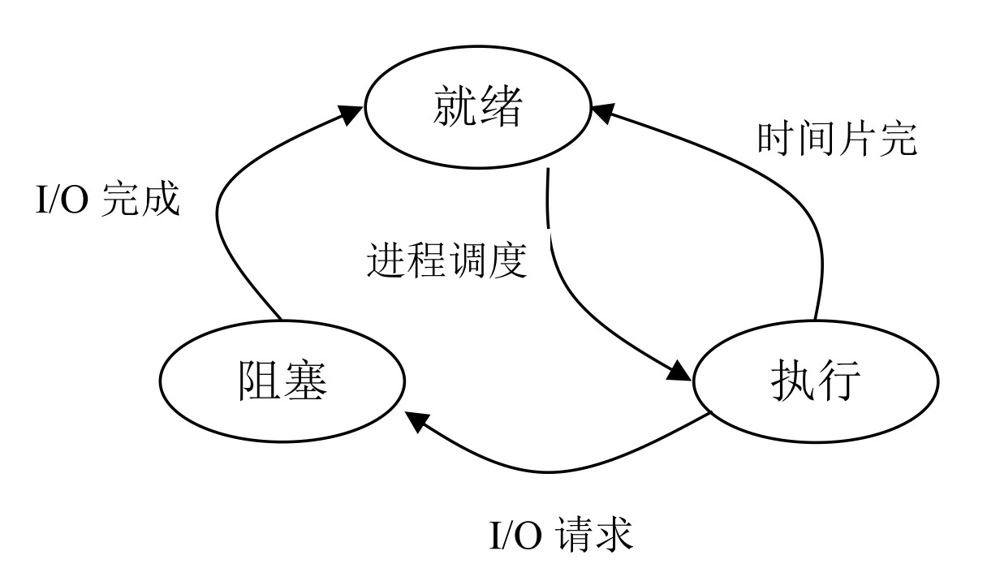
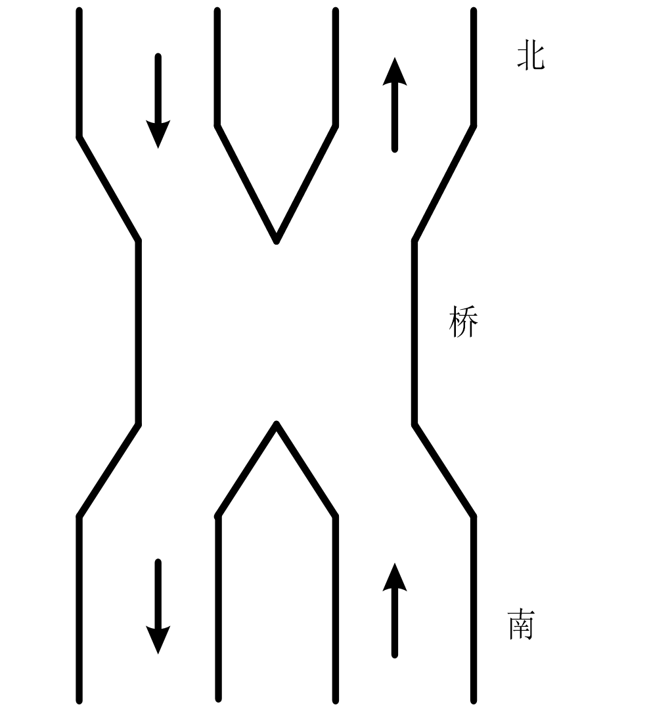
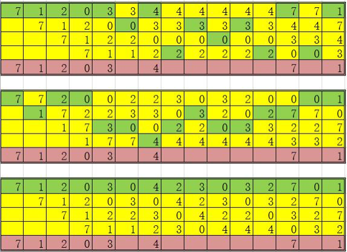

## 2016-2017学年上学期期末试卷（A）（含答案）

### 一、单项选择题（每题 2 分，共 20 分）

1. 操作系统的基本职能是（ ）

    A. 提供用户界面，方便用户使用

    B. 提供方便的可视化

    C. 控制和管理系统内各种资源，有效地组织多道程序的运行

    D. 提供功能强大的网络管理工具

    <details>
    <summary>答案：</summary>

    C

    </details>

    ***

2. 在操作系统中，进程的最基本特征是（ ）。

    A. 动态性和并发性

    B. 顺序性和可再现性

    C. 与程序的对应性

    D. 执行过程的封闭性

    <details>
    <summary>答案：</summary>

    A

    </details>

    ***

3. 当进程因时间片用完而让出处理机时，该进程应转变为（ ）状态。

    A. 等待

    B. 就绪

    C. 运行

    D. 完成

    <details>
    <summary>答案：</summary>

    B

    </details>

    ***

4. 运行的进程在信号量 $S$ 上做 P 操作后，当 $S<0$ 时，进程进入信号量的（ ）

    A. 等待队列

    B. 提交队列

    C. 后备队列

    D. 就绪队列

    <details>
    <summary>答案：</summary>

    A

    </details>

    ***

5. 在有 $n$ 个进程共享一个互斥段，如果最多允许 $m$ 个进程（$m<n$）同时进入互斥段，则信号量的变化范围是（ ）。

    A. $-m\sim1$

    B. $-m\sim0$

    C. $-m-1\sim n$

    D. $-m-1\sim n-1$

    <details>
    <summary>答案：</summary>

    A

    </details>

    ***

6. 在可变分区存储管理中，最优适应分配算法要求对空闲区表项按（ ）进行排列。

    A. 地址从大到小

    B. 地址从小到大

    C. 尺寸从小到大

    D. 尺寸从大到小

    <details>
    <summary>答案：</summary>

    C

    </details>

    ***

7. 解决“碎片”问题最好的存储管理方法是（ ）

    A. 页面存储管理

    B. 段式存储管理

    C. 多重分区管理

    D. 可变分区管理

    <details>
    <summary>答案：</summary>

    A

    </details>

    ***

8. 在以下的文件物理存储组织形式中，（ ）常用于存放大型的系统文件。

    A. 连续文件

    B. 串连文件

    C. 索引文件

    D. 多重索引文件

    <details>
    <summary>答案：</summary>

    D

    </details>

    ***

9. 当每类资源只有一个个体时，下列说法中不正确的是（ ）。

    A. 有环必死锁

    B. 死锁必有环

    C. 有环不一定死锁

    D. 被锁者一定全在环中

    <details>
    <summary>答案：</summary>

    C

    </details>

    ***

10. 为了允许不同用户的文件具有相同的文件名，通常在文件系统中采用（ ）。

    A. 重名翻译

    B. 多级目录

    C. 约定

    D. 文件名

    <details>
    <summary>答案：</summary>

    B

    </details>

***

### 二、填空题（每题 2 分，共 10 分）

1. 通常，线程的定义是 $\underline{\qquad}$。在现代操作系统中，资源的分配单位是 $\underline{\qquad}$，而处理机的调度单位是 $\underline{\qquad}$。

    <details>
    <summary>答案：</summary>

    进程中可执行单元；进程；线程

    </details>

    ***

2. 进程控制的功能是负责进程状态的变化，当执行了一条进程等待原语后，该进程的状态将由 $\underline{\qquad}$ 状态转变为 $\underline{\qquad}$ 状态。

    <details>
    <summary>答案：</summary>

    运行；阻塞

    </details>

    ***

3. 磁盘访问时间包含：$\underline{\qquad}$、$\underline{\qquad}$、和 $\underline{\qquad}$。

    <details>
    <summary>答案：</summary>

    寻道时间、旋转延迟时间、存取时间

    </details>

    ***

4. 死锁的四个必要条件是 $\underline{\qquad}$，$\underline{\qquad}$，$\underline{\qquad}$、$\underline{\qquad}$。

    <details>
    <summary>答案：</summary>

    持有并等待，互斥操作，不可抢夺资源、循环等待资源。

    </details>

    ***

5. 在段页式存储管理中，用 $\underline{\qquad}$ 方法来管理逻辑存储空间，用 $\underline{\qquad}$ 方法来管理物理存储空间。

    <details>
    <summary>答案：</summary>

    段式；页式

    </details>

***

### 三、判断题（每小题 2 分，共 20 分）

1. 采用多道程序设计的系统中，系统的程序道数越多，系统的效率就越高。（ ）

    <details>
    <summary>答案：</summary>

    ×

    </details>

    ***

2. 采用资源静态分配算法可以预防死锁的发生。（ ）

    <details>
    <summary>答案：</summary>

    √

    </details>

    ***

3. 一个作业由若干作业步组成，在多道程序系统中这些作业步可以并发执行。（ ）

    <details>
    <summary>答案：</summary>

    √

    </details>

    ***

4. 分段存储管理的特点是按逻辑关系将作业划分为若干段，以段为单位装入内存。（ ）

    <details>
    <summary>答案：</summary>

    √

    </details>

    ***

5. 磁盘调度的目标是使磁盘旋转周数最少。（ ）

    <details>
    <summary>答案：</summary>

    ×

    </details>

    ***

6. 作业调度是处理机的高级调度，进程调度是处理机的低级调度。（ ）

    <details>
    <summary>答案：</summary>

    √

    </details>

    ***

7. 并发是并行的不同表述，其原理是相同的。（ ）

    <details>
    <summary>答案：</summary>

    ×

    </details>

    ***

8. 临界区是指进程中用于实现进程互斥的那段代码。（ ）

    <details>
    <summary>答案：</summary>

    ×

    </details>

    ***

9. 在内存的可变分区管理中，最佳配置算法的性能最好，所以现代操作系统中多采用该算法。（ ）。

    <details>
    <summary>答案：</summary>

    ×

    </details>

    ***

10. LRU 算法可能会导致 Belady 异常。（ ）

    <details>
    <summary>答案：</summary>

    ×

    </details>

***

### 四、简答题（每小题 5 分，共 20 分）

1. 什么是进程？什么是线程？简述线程与进程间的区别。

    <details>
    <summary>答案：</summary>

    线程：也叫轻量级的进程，它是一个基于进程的运行单位，它可以不占有资源，一个进程可以有一个线程或者多个线程（至少一个），这些线程共享此进程的代码、Data 和部分管理信息，但是每个线程都有它自己的 PC、Stack 和其他。

    线程与进程的区别主要表现在以下几个方面：

    （1）地址空间和资源不同：进程间相互独立；同一进程的各个线程之间却共享它们。

    （2）通信不同：进程间可以使用 IPC 通信，线程之间可以直接读写进程数据段来进行通信；但是需要进程同步和互斥手段的辅助，以保证数据的一致性。

    （3）调度和切换不同：线程上下文切换比进程上下文的切换要快得多。

    </details>

    ***

2. 请画出进程的三个基本状态的转换图，并举例说明引起进程状态之间变迁的原因。

    <details>
    <summary>答案：</summary>

    状态转换图如下：

    

    1）就绪到执行：处于就绪状态的进程，在调度程序为之分配了处理器之后，该进程就进入执行状态。

    2）执行到就绪：正在执行的进程，如果分配给它的时间片用完，则暂停执行，该进程就由执行状态转变为就绪状态。

    3）执行到阻塞：如果正在执行的进程因为发生某事件（例如：请求 I/O，申请缓冲空间等）而使进程的执行受阻，则该进程将停止执行，由执行状态转变为阻塞状态。

    4）阻塞到就绪：处于阻塞状态的进程，如果引起其阻塞的事件发生了，则该进程将解除阻塞状态而进入就绪状态。

    </details>

    ***

3. 请简单比较分页和分段存储管理方式的区别。

    <details>
    <summary>答案：</summary>

    （1）页是信息的物理单位，段则是信息的逻辑单位。

    （2）页的大小固定且由系统决定，由系统把逻辑地址划分为页号和页内地址两部分，是由机器硬件实现的，因而在系统中只能有一种大小的页面；而段的长度却不固定，决定于用户所编写的程序，通常由编译程序在对源程序进行编译时，根据信息的性质来划分。

    （3）分页的作业地址空间是一维的，即单一的线性地址空间，而分段的作业地址空间则是二维的。

    </details>

    ***

4. 请比较 Valid/invalid bit 与 dirty bit 的不同。

    <details>
    <summary>答案：</summary>

    Valid/ invalid bit 是页表项中指示页表项是否在内存中的标识位，如果是 valid 表示页表项在内存中，否则该页表项被换出到磁盘上；

    Dirty bit 是页表项中指示页表项是否被修改，如果 dirty bit 为 1 表示页表项被修改，在该页表项被页面算法选中换出到磁盘时，需要先将该页表项的内容刷到磁盘上，再将该页面放入虚存中，否则直接换出到虚存中。

    </details>

***

### 五、问答题（每题 10 分，共 30 分）

1. 有一个桥如图所示，桥上的车流如箭头所示。桥上不允许两车交会，但允许同方向多辆车依次通行（即桥上可以有多个同方向的车）。请用 P、V 操作实现交通管理以防止桥上拥塞的程序。

    

    <details>
    <summary>答案：</summary>

    由于桥上不允许两车相会，故桥应该被互斥访问，而同一方向上允许多辆车依次通过，即临界区允许多个实例访问。用一个信号量来互斥访问临界区。由于不能允许某一个方向的车完全“控制”桥，应保证最多某一个方向上连续通过一定数量的车后，必须让另外一个方向的车通过。用另外两个信号量来实现这个。

    故：

    设 smutex 用来控制从南向北车辆数量 s 的互斥信号量

    nmutex 用来控制从南向北车辆数量 n 的互斥信号量

    wait 用来控制会车的互斥访问

    ```text
    semaphore smutex = 1;
    semaphore nmutex = 1;
    semaphore wait = 1;
    int s = 0;
    int n = 0;

    main(){
      begin
        south();
        north();
      end
    }

    south(){
      P(smutex);
      if s = 0 then P(wait);
      s++;
      V(smutex);
      pass the bridge;
      P(smutex);
      s--;
      if s = 0 then V(wait);
      V(smutex);
    }

    north(){
      P(nmutex);
      if n = 0 then P(wait);
      n++;
      V(nmutex);
      pass the bridge;
      P(nmutex);
      n--;
      if n = 0 then V(wait);
      V(nmutex);
    }
    ```

    </details>

    ***

2. 某计算机系统主存采用请求分页管理技术，主存容量为 $1\ \text{MB}$，被划分为 256 块，每块大小为 $4\ \text{KB}$。假设某个作业共有 5 个页面，其中 0，1，2 三个页面已分别装入到主存 4，9，11 三个物理块中，另外两个页面没有装入主存。该作业的页面变换表（PMT）如下表所示。表中的状态为 0 表示页面已经装入到内存中，为 1 表示没有装入内存。

    | 页号 | 块号 | 状态 |
    | --- | --- | --- |
    | 0 | 4 | 0 |
    | 1 | 9 | 0 |
    | 2 | 11 | 0 |
    | 3 | - | 1 |
    | 4 | - | 1 |

    问题：

    ① 若给定一个逻辑地址为 9016，其物理地址是多少？给出其物理地址的计算过程。

    <details>
    <summary>答案：</summary>

    在请求分页的存储管理系统中，系统是通过查页表来进行地址转换的。对于本题中采用的页面大小为 $4\ \text{KB}$，即页内相对地址为 12 位。首先从虚拟地址中分离出页号和页内地址。$[9016/4096]=2$，所以页号为 2，页内地址为 824。查页表知道 2 号页对应的物理块号为 11，即物理地址为：$11*4096=45056$，再加上页内地址后其真正的物理地址为：45880。

    </details>

    ② 若给定一个逻辑地址为 12388，其物理地址是多少？地址变换过程中会出现什么问题？

    <details>
    <summary>答案：</summary>

    $[12388/4096]=3$，所以页号为 3，页内地址为 100。查页表可知 3 号页状态为 1，说明该页尚未装入内存，地址变换过程中会发生缺页中断，不能直接得到物理地址。

    </details>

    ***

3. 在分页虚拟存储管理系统中，假定系统为某个进程分配了 4 个页帧，页的访问顺序为 7,1,2,0,3,0,4,2,3,0,3,2,7,0,1，若采用 FIFO 调度算法、OPT、LRU 调度算法时，分别产生多少次缺页中断？写出过程.

    <details>
    <summary>答案：</summary>

    答案：都是 8 次缺页中断

    

    </details>
