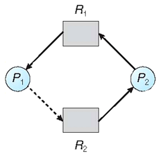
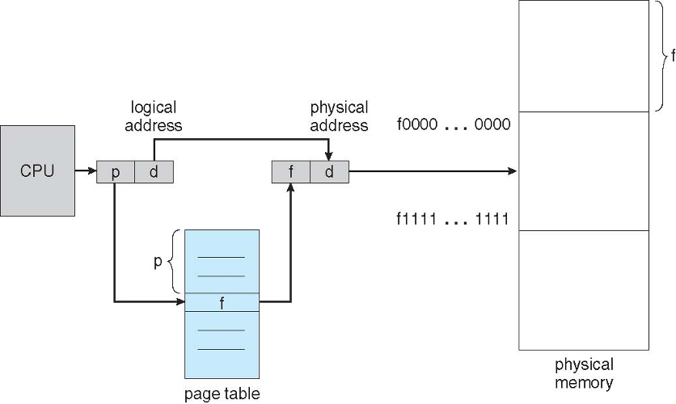

## 2017-2018学年上学期月考试卷（含答案）

### 说明

- 日期：2017.12

### 一、判断题（30 分，每小题 3 分）

判断下列每句话是否正确，如错误请说明理由。

1. 在页式存储管理中，用户应将自己的程序划分成若干相等的页。

    

    
答案：

    错。不是将用户程序分成相等的页，是将物理空间分成若干相等的页。

    【陈闻杰】我认为理由应该是：分页是系统分的而不是用户自己分的。（用户（逻辑、虚拟）空间分成页的说法也可以，物理空间分成 frame（框或帧，或叫物理页））

    

    ***

2. 快表 TLB 采用了哈希散列的方式，将物理帧号与逻辑页号相连，实现页表的快速查找。

    

    
答案：

    错，本质上是使用关联存储技术。

    

    ***

3. 操作系统的所有程序都必须常驻内存。

    

    
答案：

    错。只有 kernel 部分常驻内存。

    

    ***

4. 在段式存储管理中，段的大小是根据用户程序的模块进行划分的，将内存区域划分为长度不相等的区域。

    

    
答案：

    对

    

    ***

5. 页式存储分配，会产生内碎片，而无外碎片，段式存储管理中，则只有外碎片。

    

    
答案：

    对

    

    ***

6. 段式存储中，可以使用段表中的标识位，实现地址保护。而在分页环境下，无法实现地址保护

    

    
答案：

    错。在分页环境下的内存保护由关联到每个帧的保护位完成。这些位通常保存在页表中。一个位可以定义一个页是读写还是只读属性。可以检查保护位来确定有没有对一个只读页进行写操作。

    

    ***

7. 动态重定位技术，使得程序占用的内存空间动态可变，不必连续存放在一处。

    

    
答案：

    对。

    

    ***

8. 采用反向页表的系统，整个系统只有一个页表。

    

    
答案：

    对。

    

    ***

9. 逻辑地址空间是由 CPU 生成的，也被称为虚拟地址，而物理地址是指内存存储单元所管理的内容。

    

    
答案：

    对

    

    ***

10. MMU 存储管理单元的主要任务是实现将逻辑地址映射为物理地址，实现了动态重定位。

    

    
答案：

    对

    

***

### 二、不定项选择题（15 分，每空 3 分）

每题有一个或多个答案，答错、少选、多选均不给分。

1. 使用段页式内存管理，段表和页表都存放在主存中，所有要访问的页面都在主存中。页表项可以缓存在转换表缓冲区（TLB）中。一次内存访问的代价为 $120\ \text{ns}$，一次 TLB 访问代价为 $8\ \text{ns}$。假设 TLB 的命中率为 50%，请问进程对内存的有效访问时间（effective access time）是（ ）

    A. $248\ \text{ns}$

    B. $260\ \text{ns}$

    C. $180\ \text{ns}$

    D. $308\ \text{ns}$

    

    
答案：

    D

    

    ***

2. 一个 32 位物理地址的计算机系统，如果采用页式存储管理方式，一个页的大小为 $4\ \text{K}$，程序代码及数据均采用按字节编址，那么在页内进行寻址需要（ ）位物理地址。

    A. 2

    B. 12

    C. 8

    D. 1

    

    
答案：

    B

    

    ***

3. 上题中，该计算机的物理内存容量为（ ）

    A. 2G

    B. 4G

    C. 1M

    D. 1G

    

    
答案：

    B

    

    ***

4. 在利用资源分配图进行单实例的资源分配时，下图所示的状态为（ ）。

    

    图 1 资源分配图

    A. 安全状态

    B. 不安全状态

    C. 死锁状态

    D. 不能确定

    

    
答案：

    B

    

    ***

5. 利用多级反馈队列进行调度时，以下描述正确的是（ ）

    A. 如果一个进程需要使用过多的 CPU 时间，那么它可能在调度过程中被移到更低级的优先级队列中

    B. 任何一个进程在进入待调度的队列等待时，首先进入优先级最高的队列

    C. 一般情况下，各个队列的时间片是随着优先级的增加而减少的

    D. 多级反馈队列调度算法不能使大作业得到及时响应

    

    
答案：

    A B C

    

***

### 三、简单回答以下问题（15 分，每小题 5 分）

1. 请说明段页式存储管理和分段存储管理的区别，要求从原理、地址变换和优缺点进行比较。

    

    
答案：

    （1）原理及地址变换

    段页式存储管理是将用户程序分成若干个段，并为每一个段赋予一个段名；再把每个段分成若干个页。在段页式系统中，为了便于实现地址变换，须配置一个段表寄存器，其中存放段表始址和段表长。进行地址变换时，首先利用段号 S，将它与段表长 TL 进行比较。若 S\<TL，表示未越界，于是利用段表始址和段号来求出该段所对应的段表项在段表中的位置，从中得到该段的页表始址，并利用逻辑地址中的段内页号 P 来获得对应页的页表项位置，从中读出该页所在的物理块号 b，再利用块号 b 和页内地址来构成物理地址。

    三次访存：在段页式系统中，为了获得一条指令或数据，须三次访问内存。第一次访问是访问内存中的段表，从中取得页表始址；第二次访问是访问内存中的页表，从中取出该页所在的物理块号，并将该块号与页内地址一起形成指令或数据的物理地址；第三次访问才是真正从第二次访问所得的地址中，取出指令或数据。

    分段存储管理中：将逻辑空间分为若干个段，每个段定义了一组有完整逻辑意义的信息。段的长度由相应的逻辑信息组的长度决定，因而各段长度不等，可以满足用户（程序员）在编程和使用上的要求。

    在段式管理系统中，整个进程的地址空间是二维的，即其逻辑地址由段号和段内地址两部分组成。为了完成进程逻辑地址到物理地址的映射，处理器会查找内存中的段表，由段号得到段的首地址，加上段内地址，得到实际的物理地址。这个过程也是由处理器的硬件直接完成的，操作系统只需在进程切换时，将进程段表的首地址装入处理器的特定寄存器当中。这个寄存器一般被称作段表地址寄存器。

    （2）优缺点:

    分段存储管理优点：而分段通常对程序员而言是可见的，因而分段为组织程序和数据提供了方便; 段的逻辑独立性使其易于编译、管理、修改和保护，也便于多道程序共享;段长可以根据需要动态改变，允许自由调度，以便有效利用主存空间;方便编程，分段共享，分段保护，动态链接，动态增长。

    分段存储管理缺点：主存空间分配比较复杂，容易在段间留下许多碎片，造成存储空间利用率降低；由于段长不一定是 2 的整数次幂，地址变换用加法操作通过段起址与段内地址的求和运算得到物理地址；段式存储管理需要更多的硬件支持。

    段页式存储管理优缺点：段间留下许多碎片问题可以克服，页的单位更小，存储空间可以充分利用。也需要较多的硬件支持。

    

    ***

2. 安全状态、不安全状态和死锁的区别和联系。

    

    
答案：

    安全状态：如果存在一个序列，其对所有进程分配资源，以便完成其对应的任务，并且确保系统不会有死锁发生，这个系统则是处于安全状态。

    （安全状态：指系统能按某种进程顺序(P1, P2, ...，Pn)(称〈P1, P2, ..., Pn〉序列为安全序列)来为每个进程 Pi 分配其所需资源，直至满足每个进程对资源的最大需求，使每个进程都可顺利地完成）

    不安全状态：如果系统无法找到这样一个安全序列，其对所有进程分配资源，以便完成其对应的任务。

    死锁：是一种进程之间的僵持状态，一些进程中每个持有一定数量的资源，同时他们又同时请求等待另一些被占有的资源。

    关系：对进程分配单实例资源时，利用资源分配图来判断，如果是安全状态，一定不会产生死锁，予以分配资源，如果是不安全状态，会导致死锁发生，不能进行该次资源请求的分配。

    

    ***

3. API 与系统调用的区别和联系。

    

    
答案：

    API 是函数的定义，规定了这个函数的功能，跟内核无直接关系。API 是一个提供给应用程序的接口函数，供与程序员直接使用的。

    系统调用是通过中断向内核发请求，实现内核提供的某些服务。系统调用则不与程序员进行交互的，它根据 API 函数要求，通过一个软中断机制向内核提交请求，以获取内核服务的接口。

    API 需要一个或多个系统调用来完成特定功能。并不是所有的 API 函数都和系统调用一一对应；有时，一个 API 函数会需要几个系统调用来共同完成其功能。

    

***

### 四、综合题（40 分）

1. 假设有三个进程 A，B 和 C。A 和 B 只使用 CPU，各需要 800 毫秒，进程 C 使用 10 毫秒 CPU 然后进行 90 毫秒 I/O，然后再使用 100 毫秒 CPU 接着 100 毫秒 I/O，按照这样的规律进行下去, 总共进行 900 毫秒。假设三个进程的到达次序是 ABC，同时到达。

    （1）请计算使用 FIFO 调度，三个进程的平均等待时间和平均周转时间（10 分）。

    （2）请计算使用 100 毫秒为时间片长度，使用轮询（round-robin）调度时，三个进程的平均等待时间和平均周转时间（10 分）。

    

    
答案：

    答案：（蓝色表示 IO）

    (1) A800，B800， C10，C90，C100，C100，

    C10，C90，C100，C100 C10，C90，C100，C100 C3 个周期

    A 等待时间：0ms；

    B 等待时间：800ms；

    C 等待时间：800 + 800 = 1600ms；

    平均等待时间：（0 + 800 + 1600）／3 = 800ms；

    A 周转时间：800ms；

    B 周转时间：800 + 800 = 1600ms；

    C 周转时间：800 + 800 + 900 = 2500ms；

    平均周转时间：（800 + 1600 + 2500）／3 = 1633.33ms

    (2) A100,B100,C10, A100(C90),B100,C100,

    A100(C100),B100,C10, A100(C90),B100,C100

    A100(C100),B100,C10, A100(C90),B100,C100

    A100(C100),

    C 做完了 900 毫秒，只剩 A 和 B

    A 做了 7*100，还剩 100ms，B 做了 6*100，还剩 200ms，故之后：

    B100，A100，B100

    A 等待时间：6*100 + 3*10 + 3*100 + 100 = 1030ms；

    B 等待时间：7*100 + 3*10 + 3*100 + 100 = 1130ms；

    C 等待时间：200 +（10 + 100）*3 + 100*2 = 730

    平均等待时间：（1030 + 1130 + 730）／3 = 963.33ms；

    A 周转时间：3*210 + 3*300 + 100 + 2*100 = 1830ms；

    B 周转时间：3*210 + 3*300 + 100 + 3*100 = 1930ms；

    C 周转时间：3*210 + 300*3+100（I/0） = 1630

    平均周转时间：（1830 + 1930 +1630）／3 = 1796.67ms

    

    ***

2. （1）请画出分页内存管理（无 TLB）的硬件结构图。 （10 分）

    

    （2）假设某进程的页表内容如下表所示。页面大小为 4KB。有效位为 0 表示页面不在内存。请问虚地址 0x2362、0x1565 对应的物理地址是多少。（10 分）

    | 页号（page number） | 框号（frame number） | 有效位（valid bit） |
    | --- | --- | --- |
    | 0 | 0x101 | 1 |
    | 1 | 0x838 | 0 |
    | 2 | 0x254 | 1 |

    

    
答案：

    页面大小为 4KB，即 $2^{12}$，即页内偏移占 12 位，页号占剩余高位。可得以上虚地址的页号分别如下：

    0x2362：页号=2。 框号：0x254，物理地址：0x254362。

    0x1565H：页号=1，框无效，将产生缺页中断。

    

