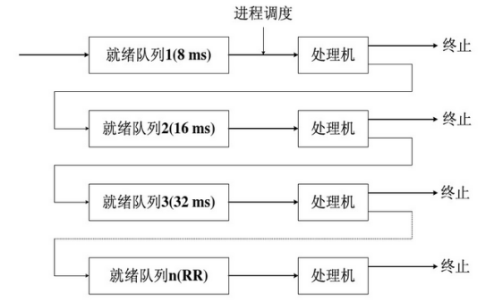
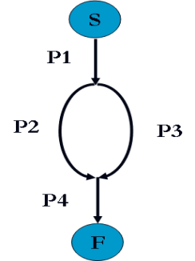
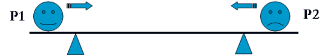
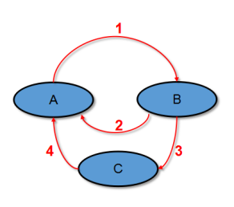

## 2017-2018学年上学期期中试卷（含答案）

### 说明

- 原卷标题：华东师范大学软件学院期中试卷（2017—2018学年第一学期）

### 一、判断题（30分，每小题3分）

判断下列每句话是否正确，如错误请说明理由。

1. 时间片轮转调度算法的关键点是设置时间片的大小，该算法本质上是支持抢占式及FCFS调度方式。

    <details>
    <summary>答案：</summary>

    对

    </details>

    ***

2. 进程是CPU调度的基本单位，而线程是系统资源分配的单位。

    <details>
    <summary>答案：</summary>

    错，线程是CPU调度的基本单位，而进程是系统资源分配的单位

    </details>

    ***

3. 操作系统的主要功能包括：进程管理、内存管理、文件管理、存储管理、安全设置等，其中进程管理主要涉及进程调度管理、进程控制块PCB。

    <details>
    <summary>答案：</summary>

    对

    </details>

    ***

4. 线程的实现机制主要是通过多线程模型实现，多线程模型包括：多对一模型、一对一模型、多对多模型，Java线程模型属于多对一模型。

    <details>
    <summary>答案：</summary>

    错，java线程应该属于多对多的线程模型。

    </details>

    ***

5. 资源分配图中存在环时，系统中某些进程可能处于死锁状态。

    :::tip
    题干使用“可能”，而参考答案判为“错”。参考答案的解释只能说明资源分配图中有环时“不一定”发生死锁，并不能否定“可能”发生死锁，题干与参考答案之间存在表述冲突。
    :::

    <details>
    <summary>答案：</summary>

    错。当每种资源实例个数为1时，在环中的每个进程处于死锁状态。但是当资源实例数量不唯一时，不一定处于死锁状态。

    </details>

    ***

6. 如果信号量S的当前值为 -6 时，则表示系统中共有6 个等待的进程。

    <details>
    <summary>答案：</summary>

    错。S=-6表示当前有6个进程等待进入该信号量所对应的临界区。

    </details>

    ***

7. 对称多处理技术SMP是最为普通的多处理器设计技术，其所有的处理器是对等的，且彼此独立运行。而集群系统是通过局域网连接的多个计算机系统。

    <details>
    <summary>答案：</summary>

    对

    </details>

    ***

8. 虚拟机的设计采用了分层方法，将操作系统的内核和硬件都作为硬件来考虑。例如JVM，其为java程序抽象化了底层系统，以提供平台无关的。

    <details>
    <summary>答案：</summary>

    对

    </details>

    ***

9. 进程控制块是描述进程状态和特性的数据结构，一个进程可以和其它进程共用一个进程控制块。

    <details>
    <summary>答案：</summary>

    错，不可以共用PCB，其是进程的唯一标识。

    </details>

    ***

10. 进程的就绪队列，可以使用链表来实现，其头节点指向链表的第一个和最后一个PCB块的指针，PCB之间是通过索引连接的。

    <details>
    <summary>答案：</summary>

    错，每个PCB包括一个指向就绪队列的下一个PCB的指针域。

    </details>

***

### 二、不定项选择题（15分，每小题3分）

每题有一个或多个答案，答错、少选、多选均不给分。

1. 下面有关进程的描述，正确的有（ ）。

    A. 正在运行的进程调用yield( )时，可以主动放弃使用CPU。

    B. 进程P和Q的并发执行是指P和Q同时使用CPU。

    C. 线程是进程的一个实体。

    D. 进程是具有一定独立功能的程序在某个数据集合上的一次运行。

    <details>
    <summary>答案：</summary>

    A C D

    </details>

    ***

2. 关于线程，以下说法错误的是（ ）。

    A. 用户态线程（无核心态线程或LWP）阻塞，可能会阻塞线程。

    B. 多处理器环境下，线程间同步不能使用关中断实现。

    C. 线程控制块中包含CPU寄存器状态。

    D. 在支持核心态线程的系统中，CPU调度的单位仍然是进程。

    <details>
    <summary>答案：</summary>

    D

    </details>

    ***

3. 下对操作系统内核的运行方式的描述，正确的是（ ）。

    A. 操作系统是一个以内核态运行的独立进程；

    B. 操作系统内核运行时不能访问其它进程的地址空间；

    C. 只有在硬件中断发生时，操作系统内核才会运行；

    D. 操作系统内核可以以内核态在用户进程上下文中运行。

    <details>
    <summary>答案：</summary>

    D

    </details>

    ***

4. 以下（ ）仍然可能会发生死锁。

    A. 资源都是可共享的；

    B. 每一种资源的数量都超过单个进程所需这类资源的最大值；

    C. 空闲资源能够满足任意一个进程还需要的资源需求；

    D. 每个进程必须一次申请、获得所需的所有资源

    <details>
    <summary>答案：</summary>

    B

    </details>

    ***

5. 下面关于进程同步、互斥的说法，错误的是（ ）。

    A. 由于进程间的合作和资源共享产生了同步的问题。

    B. 由于系统中资源使用的排他性,需要进程对临界资源的互斥访问。

    C．P、V操作都是原语操作，利用信号量的P、V操作可以交换大量信息。

    D．并发进程在访问共享资源时，与访问的顺序无关。

    <details>
    <summary>答案：</summary>

    C D

    </details>

***

### 三、简单回答以下问题（15分，每小题5分）

1. 请说明分时系统的时间片轮转法和多级反馈队列调度算法的区别和联系，并阐述各自有哪些优缺点。

    <details>
    <summary>答案：</summary>

    多级反馈队列调度算法：设置多个就绪队列，并为各个队列赋予不同的优先级别和不同的时间片；第一个队列优先级最高，进程执行的时间片最少，新创建的进程挂到第一个优先级的队列后，然后按照FCFS排队等待。当轮转到其执行时，如果在其时间片内完成，便可以撤离系统；如果不能完成，便别挂入第二级队列尾部；仅当第一个队列为空闲时，调度程序才调度第二级队列中的进程运行，依次类推。新进程可以抢占低优先级进程占有的处理机。

    优点：小作业响应快，大作业也能快速得到响应。例如：

    

    时间片轮转法主要思想：时间片轮转调度是一种最公平且使用最广的算法。每个进程被分配一个时间段，称作它的时间片，即该进程允许运行的时间。如果在时间片结束时进程还在运行，则CPU将被剥夺并分配给另一个进程。时间片设得太短会导致过多的进程切换，降低了CPU效率；而设得太长又可能引起对短的交互请求的响应变差。

    联系：时间片轮转法可以作为多级反馈队列调度算法组成的一个部分，即对多级反馈队列中某个队列采用时间片轮转的方法。

    </details>

    ***

2. 简述管程和进程概念之间的区别和联系。

    <details>
    <summary>答案：</summary>

    管程：是一种并发性的构造，它包括用于分配一个共享资源或一组共享资源的数据和过程。为了完成分配资源的功能，进程必须调用特定的管程入口。

    管程（Monitor）采用资源集中管理的方法，将系统中的资源用某种数据结构抽象地表示出来。

    由于临界区是访问共享资源的代码段，因而建立一个管程来管理进程提出的访问请求。采用这种方式对共享资源的管理就可以借助数据结构及其上实施操作的若干过程来进行；对共享资源的申请和释放可以通过管程在数据结构上的操作来实现。

    进程：进程是计算机中的程序关于某数据集的一次运行活动。在传统操作系统中，它是资源拥有的基本单元。进程之间可以并发执行。进程虽然拥有自己的系统资源，但也因此导致创建或撤销进程开销都很大，切换、通信、同步也会比线程之间的实现更加复杂。进程存在的标志是进程控制块.

    进程可以通过管程对临界资源进行排它使用.

    </details>

    ***

3. 请举例说明进程同步和互斥的含义，并说明它们之间区别和联系。并说明它们与信号量的关系。

    <details>
    <summary>答案：</summary>

    进程同步：并发进程之间相互合作，完成一项工作，它们之间有一定的时序关系。互相约束(其表现例如:一个进程等待另一个进程的变量结果. 采用私用信号量协同处理。

    例：并发进程的同步关系。（需要展开说明：略）

    

    进程间的互斥：并发进程之间相互竞争临界资源的排他性关系。使用公用信号量mutex互斥处理

    例如: 过独木桥（互斥关系）。（举例不唯一，要展开说明）

    

    例如：P1 和P2进行共享打印机等。

    进程之间协同工作，既需要同步控制也需要对临界资源互斥访问。

    </details>

***

### 四、综合题（40分）

1. （15分）某单处理机系统的部分进程状态转换图如下，请说明：

    

    a) A，B，C的状态分别是什么？（3分）

    <details>
    <summary>答案：</summary>

    A：Ready，B：Running C：Waiting

    </details>

    b) 引起状态转换1，2,3,4的典型事件分别是什么？（4分）

    <details>
    <summary>答案：</summary>

    1：当进程调度程序从就绪队列中选取一个进程投入运行；

    2：正在执行的进程如因时间片用完而被暂停执行；

    3：正在执行的进程因等待的事件尚未发生而无法执行(如进程请求完成I/O)

    4：当进程等待的事件发生时(如I/O完成)。

    </details>

    c) 当我们观察系统中某些进程时，能够看到某个进程产生的一次状态转换能引起另一进程作一次状态转换。在什么情况下，当一个进程发生转换3时能立即引起另一个进程发生转换l?（2分）

    <details>
    <summary>答案：</summary>

    （要点即可）

    如果就绪队列非空，则一个进程的转换3会立即引起另一个进程的转换1。这是因为一个进程发生转换3意味着正在执行的进程由执行状态变为阻塞状态，这时处理机空闲，进程调度程序必然会从就绪队列中选取一个进程并将它投入运行，因此只要就绪队列非空，一个进程的转换3能立即引起另一个进程的转换1。

    </details>

    d) 试说明是否会发生下述因果转换：(6分）

    (a) 2->1; (b) 3->2; (c) 4->1

    <details>
    <summary>答案：</summary>

    (a) 2->1：发生转换2时，就必然引起另一进程的转换1。因为当发生转换2时，正在执行的进程从执行状态变为就绪状态，进程调度程序必然会从就绪队列中选取一个进程投入运行，即发生转换1。

    (b) 3->2：某个进程的转换3决不可能引起另一进程发生转换2。这是因为当前执行进程从执行状态变为阻塞状态．不可能又从执行状态变为就绪状态。

    (c) 4->1：当处理机空闲且就绪队列为空时，某一进程的转换4就会引起该进程的转换1。因为此时处理机空闲，一旦某个进程发生转换4，就意味着有一个进程从阻塞状态变为就绪状态，因而调度程序就会将就绪队列中的此进程投入运行。

    </details>

    ***

2. （15分）桌子上有一只盘子，每次只能放入一只水果。爸爸专向盘中放苹果，妈妈专向盘中放桔子，一个儿子专等吃盘中的桔子，一个女儿专等吃盘中的苹果。请利用wait(), signal() 操作实现他们之间的同步。

    ```c
    main ( )
    {
        #CO_BEGIN //以下并发执行
        father ( );
        mother();
        son ( );
        daughter ( );
        #CO_END
    }
    ```

    <details>
    <summary>答案：</summary>

    （写出主体框架即可）

    ```c
    Mutex mutex=1; // 访问盘子的互斥量，避免冲突
    Semaphore apple=0; // 盘中苹果个数（本题只能放一个，也可以用mutex）
    Semaphore orange=0;
    Semaphore plate=1; // 空盘数

    Father()
    {
        While(1)
        {
            wait(plate);
            wait(mutex)
            put_apple()；
            Signal(mutex);
            Signal(apple);
        }
    }

    Mother()
    {
        While(1)
        {
            wait(plate);
            wait(mutex)
            put_orange()；
            Signal(mutex);
            Signal(orange);
        }
    }

    Son()
    {
        While(1)
        {
            wait(orange);
            wait(mutex)
            get_orange()；
            Signal(mutex);
            Signal(plate);
        }
    }

    Daughter()
    {
        While(1)
        {
            wait(apple);
            wait(mutex)
            get_apple()；
            Signal(mutex);
            Signal(plate);
        }
    }
    ```

    </details>

    ***

3. （10分）假设有三个进程A，B和C。A和B只使用CPU，各需要1000毫秒，进程C使用10毫秒CPU然后进行90毫秒I/O，然后再使用100毫秒CPU接着100毫秒I/O，总共也是1000毫秒。假设三个进程的到达次序是ABC。

    :::tip
    题干只描述了进程C的一次“10毫秒CPU、90毫秒I/O、100毫秒CPU、100毫秒I/O”过程，并称其总共也是1000毫秒，但没有说明该模式如何重复至1000毫秒。参考答案在后两问中按周期重复计算，因此相应的轮转序列和计算结果无法由题干唯一推出。
    :::

    a) 请计算使用FIFO调度，三个进程的平均等待时间和平均周转时间（2分）

    <details>
    <summary>答案：</summary>

    答：A，B，C

    平均等待时间：$(0+1000+2000)/3=1000$

    平均周转时间：$(1000+2000+3000)/3=2000$

    </details>

    b) 请计算使用100毫秒为时间片长度，使用轮询（round-robin）调度时，三个进程的平均等待时间和平均周转时间（4分）

    <details>
    <summary>答案：</summary>

    答：

    A100,B100,C10, A100,B100,C100, A100,B100,C10, A100,B100,C100……

    过程：

    A100,B100,C10, A100,B100,C100

    A100,B100,C10, A100,B100,C100

    A100,B100,C10, A100,B100,C100

    A100,B100,C10, A100,B100

    A100,B100, A100,B100

    平均等待时间：

    $$
    \begin{aligned}
    (&0+110+200+110+200+110+200+110+100+100+\\
    &100+110+200+110+200+110+200+110+100+100+\\
    &200+200+200+200+200+200+200)/3=1326.67
    \end{aligned}
    $$

    平均周转时间：

    $$
    \begin{aligned}
    (&210\times4+300\times3+200\times2+100+\\
    &210\times4+300\times3+200\times2+100+100+\\
    &210\times4+300\times3)/3=2106.67
    \end{aligned}
    $$

    </details>

    c) 请计算使用10毫秒为时间片长度，使用轮询（round-robin）调度时，三个进程的平均等待时间和平均周转时间（4分）

    <details>
    <summary>答案：</summary>

    答：

    A10,B10,C10(C的10ms CPU), A10,B10,A10,B10,A10,B10,A10,B10 A10,B10

    (C的90ms I/O)

    C10,A10,B10, C10,A10,B10

    C10,A10,B10, C10,A10,B10

    C10,A10,B10, C10,A10,B10

    C10,A10,B10, C10,A10,B10

    C10,A10,B10, C10,A10,B10

    (C的100ms CPU)

    (C的100msI/O)

    A10,B10, A10,B10

    A10,B10, A10,B10

    A10,B10,

    三个周期以后：

    C还剩10毫秒，B还剩（$1000-21\times10\times3=370$）

    A还剩（$1000-21\times10\times3=370$）

    以下（$370/10=37$）个周期

    C10

    A10，B10，

    A10，B10，

    ……

    平均等待时间:

    A等待时间：$32\times10\times3+10+36\times10=1330$

    B等待时间：$32\times10\times3+10+37\times10=1340$

    C等待时间：$23\times3\times10=690$

    平均等待时间：$(1330+1340+690)/3=1120$

    平均周转时间:

    A的周转时间：$53\times3\times10+10+36\times2\times10+10=2330$

    B的周转时间：$53\times3\times10+10+37\times2\times10=2340$

    C的周转时间：$53\times3\times10+10+90=1660$

    平均周转时间：$(2330+2340+1660)/3=2110$

    </details>
