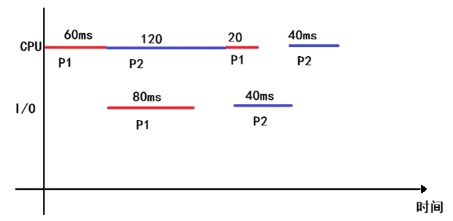

## 2017-2018学年上学期期末试卷（A）（含答案）

### 一、单项选择题（20 分，每题 2 分）

1. 在进程两种状态的转换中，（ ）是不可能的。

    A. 运行状态→就绪状态

    B. 运行状态→阻塞状态

    C. 就绪状态→运行状态

    D. 阻塞状态→运行状态

    <details>
    <summary>答案：</summary>

    D

    </details>

    ***

2. 在下列问题中，（ ）不是操作系统关心的主要问题。

    A. 管理计算机裸机

    B. 设计、提供用户程序与计算机硬件系统的界面

    C. 管理计算机系统资源

    D. 高级程序设计语言的编译器

    <details>
    <summary>答案：</summary>

    D

    </details>

    ***

3. 发生中断以后进入的中断处理程序属于（ ）。

    A. 用户程序

    B. 可能是用户程序，也可能是操作系统程序

    C. 操作系统程序

    D. 单独的程序，既不是用户程序，也不是操作系统程序

    <details>
    <summary>答案：</summary>

    C

    </details>

    ***

4. 设两个进程共用一个临界资源，其互斥信号量为 `mutex`，当 `mutex=1` 时表示（ ）。

    A. 一个进程进入了临界区，另一个进程等待

    B. 没有一个进程进入临界区

    C. 两个进程都进入了临界区

    D. 两个进程都在等待

    <details>
    <summary>答案：</summary>

    B

    </details>

    ***

5. 系统中有 4 个用户进程，且当前 CPU 在用户态下运行，那么最多可能有（ ）个用户进程处于就绪状态。

    A. 5

    B. 4

    C. 3

    D. 2

    <details>
    <summary>答案：</summary>

    C

    </details>

    ***

6. 资源的按序分配策略可以破坏（ ）。

    A. 互斥使用资源

    B. 占有且等待资源

    C. 非剥夺资源

    D. 循环等待资源

    <details>
    <summary>答案：</summary>

    D

    </details>

    ***

7. 在采用段式存储管理中，每当 CPU 要从内存中取数据时，需要访问内存（ ）次。

    A. 1

    B. 2

    C. 3

    D. 4

    <details>
    <summary>答案：</summary>

    B

    </details>

    ***

8. 以下页面置换算法中，（ ）不是基于程序执行的局部性理论。

    A. 先进先出调度算法

    B. LRU

    C. LFU

    D. 第二次机会算法

    <details>
    <summary>答案：</summary>

    A

    </details>

    ***

9. 文件目录项中不包含的信息是（ ）。

    A. 文件控制块的物理位置

    B. 文件名

    C. 文件访问权限说明

    D. 文件所在的物理位置

    <details>
    <summary>答案：</summary>

    A

    </details>

    ***

10. Spooling 系统为用户提供虚拟的（ ）。

    A. 独占设备

    B. 共享设备

    C. 主存储器

    D. 处理机

    <details>
    <summary>答案：</summary>

    B

    </details>

***

### 二、填空题（10 分，每题 2 分）

1. 并发性是指两个或者多个事件在同一时间间隔内发生。具体地，在单处理器系统中，多道程序的并发是指在一段时间内，宏观上有多个程序在同时运行，但微观上这些程序只能是交替执行，并发执行的单位是（ ）或者（ ）。

    <details>
    <summary>答案：</summary>

    进程；线程

    </details>

    ***

2. 产生死锁的原因可能是进程之间的（ ），例如系统中的打印机的数量不足，无法同时满足多个进程对打印机的需求；另一个主要原因可能是进程之间的（ ），例如多个进程在运行中请求和释放资源的先后不合理。

    <details>
    <summary>答案：</summary>

    竞争资源；推进顺序不合理

    </details>

    ***

3. 在基本分页的管理方式中，进程的每个页面可以离散装入内存的物理块中。为了方便在内存中找到每个页面对应的物理位置，系统为每个进程建立一张表，称为（ ）。

    <details>
    <summary>答案：</summary>

    页表

    </details>

    ***

4. 内存管理的主要工作包括以下内容：第一是（ ），其是将逻辑地址转换为物理地址；第二是内存容量的扩充；第三是（ ），其为了保证内存中各个作业互不干扰，在各自的存储空间中运行。

    <details>
    <summary>答案：</summary>

    地址变换；内存保护

    </details>

    ***

5. 磁盘是一种被多个进程共享的设备，对多个进程请求访问磁盘时，应采用一种适当的调度算法，减少进程对磁盘的平均访问时间，常见的磁盘调度算法有（ ）。

    <details>
    <summary>答案：</summary>

    FCFS 算法、SSTF 算法、SCAN 算法、C-SCAN 算法、LOOK 算法、C-LOOK 算法

    </details>

***

### 三、判断题（20 分，每题 2 分，请划√或×）

1. 在页式存储管理中，采用反向页表进行管理时，整个系统只有一个页表。（ ）

    <details>
    <summary>答案：</summary>

    √

    </details>

    ***

2. 抖动是由于缺页调度算法的某些问题而引起的。（ ）

    <details>
    <summary>答案：</summary>

    √

    </details>

    ***

3. 磁盘调度的目标是使磁盘旋转周数最少。（ ）

    <details>
    <summary>答案：</summary>

    ×

    </details>

    ***

4. 任何两个并发进程之间一定存在同步或互斥关系。（ ）

    <details>
    <summary>答案：</summary>

    ×

    </details>

    ***

5. 进程控制块中的所有信息必须常驻内存。（ ）

    <details>
    <summary>答案：</summary>

    ×

    </details>

    ***

6. 原语是一种不可分割的操作。（ ）

    <details>
    <summary>答案：</summary>

    √

    </details>

    ***

7. 一旦出现死锁，所有进程都处于僵持状态。（ ）

    <details>
    <summary>答案：</summary>

    ×

    </details>

    ***

8. 引入缓冲的主要目的是提高 I/O 设备的利用率。（ ）

    <details>
    <summary>答案：</summary>

    ×

    </details>

    ***

9. 磁盘上的文件都是以记录为单位进行读写的。（ ）

    <details>
    <summary>答案：</summary>

    ×

    </details>

    ***

10. 在分时操作系统中，经常采用时间片轮转算法（Round Robin）调度进程。（ ）

    <details>
    <summary>答案：</summary>

    √

    </details>

***

### 四、简答题（20 分，每小题 5 分）

1. 什么是虚拟存储技术，使用虚拟存储技术有什么优点？

    <details>
    <summary>答案：</summary>

    虚拟存储技术是一种存储管理技术，用以完成用小的内存实现在大的虚空间中程序的运行工作。它是由操作系统提供的一个假想的特大存储器。但是虚拟存储器的容量并不是无限的，它由计算机的地址结构长度所确定，另外虚存容量的扩大是以牺牲 CPU 工作时间以及内、外存交换时间为代价的。

    使用虚拟存储技术的好处是：小空间执行大程序，可在较小的可用内存中执行较大的用户程序；提供较大的用户空间，提供给用户可用的虚拟内存空间通常大于物理内存；内存可容纳更多的并发程序，可在内存中容纳更多程序并发执行。

    </details>

    ***

2. 避免死锁和检测死锁是死锁两个主要问题。（1）银行家算法可以有效地避免死锁，请简述银行家算法的主要思想。（2）对于单实例和多实例的情况，分别阐述如何检测死锁，其主要思想是什么？

    <details>
    <summary>答案：</summary>

    银行家算法是一种避免死锁的算法。在避免死锁方法中允许进程动态地申请资源，但银行家算法在进行资源分配之前，应先计算此次分配资源的安全性，若分配资源后，进入安全状态，则分配；否则不予以分配，进程必须等待。为实现银行家算法，系统必须设置若干数据结构。

    对于单实例的情况，采用等待图进行检测，即系统需要维护等待图并周期性地检查图中是否有环，通过等待图中存在环的事实，判断系统死锁发生的情况。

    对于多实例情况，一般采用死锁检测算法，对于系统中设置一个 Finish 的向量，每个进程对应的 Finish 分量初值为 false，如果对于任何进程申请的资源得到了满足，其对应的 Finish 分量置为 true。在操作系统动态运行时，无论怎样给运行的进程进行分配资源，总有一些进程的 Finish 的值仍为 false，此时，可以判断系统有死锁发生；如果所有进程的 Finish 分量都为 true，则系统无死锁发生。

    </details>

    ***

3. 试简述什么是 SPOOLing 技术，并以打印机设备为例说明 SPOOLing 系统的特点及功能实现。

    <details>
    <summary>答案：</summary>

    SPOOLing 技术是在通道技术和多道程序设计基础上产生的一种技术，SPOOLing 技术通常称为“假脱机技术”，是处理关于慢速字符设备如何与计算机主机交换信息的技术，它由主机和相应的通道共同承担作业的输入输出工作，利用磁盘作为后援存储器，实现外围设备同时联机操作。它在输入和输出之间增加了“输入井”和“输出井”的排队转储环节，以消除用户的“联机”等待时间。

    以打印机为例，SPOOLing 系统将独占设备打印机改造为共享设备，实现了虚拟设备功能，提高了 I/O 处理的效率，缓和了 CPU 与低速 I/O 设备速度不匹配的矛盾。具体地，对于共享打印机的各个进程，它们的打印输出文件形成了一个输出队列，由输出 SPOOLing 系统控制这些进程的文档进行打印，依次将队列中的文件实际打印输出。

    在 SPOOLing 系统中，实际上并没有为任何进程分配物理设备，而只是在输入井和输出井中，为各个进程分配一块存储区、建立一张 I/O 请求表。这样，便把独占设备改造为共享设备。

    如果有进程要求打印输出时，SPOOLing 系统并不是将这台打印机直接分配给进程，对于每个进程实现了虚拟打印机设备的功能，每一进程都认为自己独占这一设备，不过该设备（打印机）是逻辑上的共享设备，实际上并没有为任何进程分配实际的物理（打印机）设备。总之，利用 SPOOLing 实现了多个进行共享使用设备的功能。

    </details>

    ***

4. 简单说明分段存储管理的地址变换过程，要求考虑无 TLB（Translation Lookaside Buffer）的情况。

    <details>
    <summary>答案：</summary>

    在不考虑 TLB 情况下，分段存储管理中从进程的逻辑地址到物理地址的变换过程为：在系统中设置了段表寄存器，用于存放段表始址和段表长度 TL。在进行地址变换时，系统将逻辑地址中的段号 S 与段表长度 TL 进行比较。若 S>TL，表示段号太大，是访问越界，于是产生越界中断信号；若未越界，则根据段表的始址和段号，计算出该段对应段表项的位置，从中读出该段在内存的起始地址，然后，再检查段内地址 d 是否超过该段的段长 SL。若超过，即 d>SL，同样发出越界中断信号；若未越界，则将该段的基址 d 与段内地址相加，即可得到要访问的内存物理地址。

    </details>

***

### 五、问答题（30 分，每题 10 分）

1. 生产围棋的工人不小心将相等数量的黑子和白子混合装在一个盒子里。现要用自动分拣系统将黑子和白子分开，该系统由两个并发执行的进程 Pa 和 Pb 组成。系统功能如下：Pa 专拣黑子，Pb 专拣白子；每次都只能拣一个子，当一个进程拣子时，不允许另一个进程去拣子；当一个进程拣子后，必须让另一个进程进行拣子。试解答以下问题，实现对两个拣子并发进程进行描述：

    （1）写出对信号量的定义及其初值的设置。（3 分）

    （2）利用所定义的信号量，采用 P、V 操作，描述两个进程拣子的并发过程。（7 分）

    <details>
    <summary>答案：</summary>

    （仅供参考）

    （1）信号量及其初值：

    同步信号量 int S1；初值为 1，允许拣黑子，如果为 0，表示不允许拣黑子。

    int S2；初值为 1，允许拣白子，如果为 0，表示不允许拣白子。

    互斥信号量 int mutex；初值为 1，允许进入盒子临界空间进行拣子，如果为 0，表示不允许进入盒子临界区。

    （2）并发过程描述：

    ```text
    main()
    {
      Semaphore S1,mutex,S2;
      S1=1; mutex=1; S2=0;
      Cobegin
        processPa();
        processPb();
      Coend
    }

    processPa()
    {
      while (1)
      {
        P(S1);
        P(mutex);
        拣黑子；
        V(mutex);
        V(S2)；
      }
    }

    processPb()
    {
      while (1)
      {
        P(S2);
        P(mutex);
        拣白子；
        V(mutex);
        V(S1)；
      }
    }
    ```

    </details>

    ***

2. 一个多道批处理系统中仅有 P1 和 P2 两个作业，以非抢占方式运行。P2 比 P1 晚到达 $5\ \text{ms}$。它们的计算和 I/O 操作的顺序如下：

    P1：计算 $60\ \text{ms}$，I/O $80\ \text{ms}$，计算 $20\ \text{ms}$；

    P2：计算 $120\ \text{ms}$，I/O $40\ \text{ms}$，计算 $40\ \text{ms}$。

    请解答以下问题：

    （1）如果不考虑调度和切换时间，则完成两个作业需要的时间最少是多少？请给出具体分析过程和结果，可以画图加以说明。（5 分）

    （2）请计算两个作业的平均等待时间和平均周转时间。（5 分）

    <details>
    <summary>答案：</summary>

    （1）为了使得完成两个作业需要的时间最少，就要使 CPU 等待时间最少。所以并发过程如图所示：

    

    时间：$60+120+40+40=260\ \text{ms}$

    分析并发的过程（略）

    （2）P1 等待时间：$120-80=40$

    P2 等待时间：$60-5=55$

    两个作业的平均等待时间：$(55+40)/2=47.5\ \text{ms}$

    P1 周转时间：$60+120+20=200\ \text{ms}$

    P2 周转时间：$260-5=255\ \text{ms}$

    平均周转时间为：$(200+255)/2=227.5\ \text{ms}$

    </details>

    ***

3. 某操作系统的文件管理采用直接索引和多级索引混合方式，文件索引表共有 10 项，其中前 8 项是直接索引项，第 9 项是一次间接索引项，第 10 项是二次间接索引项，假设物理块的大小是 $2\ \text{K}$，并且每个索引项占 4 字节。请解答以下问题。

    （1）计算并说明该文件系统中的最大文件可以达到多大。（4 分）

    （2）假定一个文件是 $128\ \text{M}$ 字节，包括间接索引块的情况下，该文件占用磁盘空间多大？（6 分）

    <details>
    <summary>答案：</summary>

    （1）混合索引包括 8 个直接索引和 1 个一级间接索引，和一个二级间接索引项。

    直接索引对应的空间：$8*2\text{KB}=16\text{K}$

    一级间接索引对应的空间：$2*1024/4*2\text{KB}=1\text{MB}$

    二级间接索引对应的空间：$(2*1024/4)*(2*1024/4)*2\text{KB}=512\text{M}$

    所以 $16\text{K}+1\text{M}+512\text{M}$ 约为 $513\text{M}$

    （2）解法 1：

    设每块可以存储的索引项个数为 k，那么 $k=2*1024/4=512$

    计算文件数据部分需要多少块：$128\text{MB}/2\text{KB}=65536$ 块

    直接索引不产生索引块：直接索引以外的数据块数：$65536-8=65528$

    一个一级间接索引以外的数据块：$65528-512=65016$

    需要一个二级间接索引，索引需要 $(1+[65016/512])=128$ 个索引块

    文件实际占磁盘空间：

    $(65536+1+128)*2\text{K}$ 约为 $128.25\text{M}$

    解法 2：$(126*4+512*126*4+8*4)/1024/1014+128=128.25\text{M}$

    </details>
