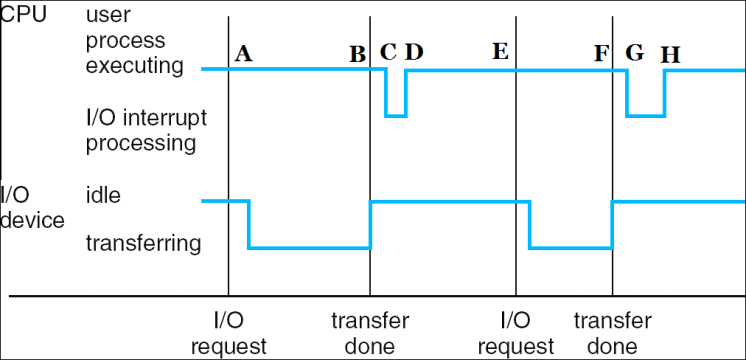
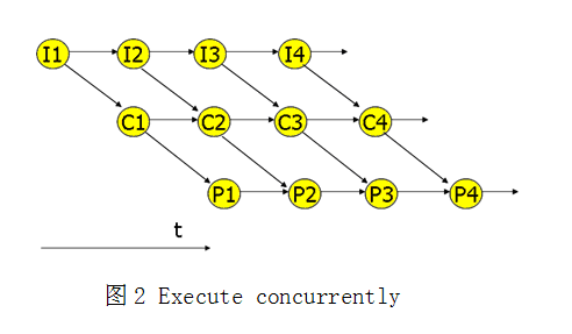
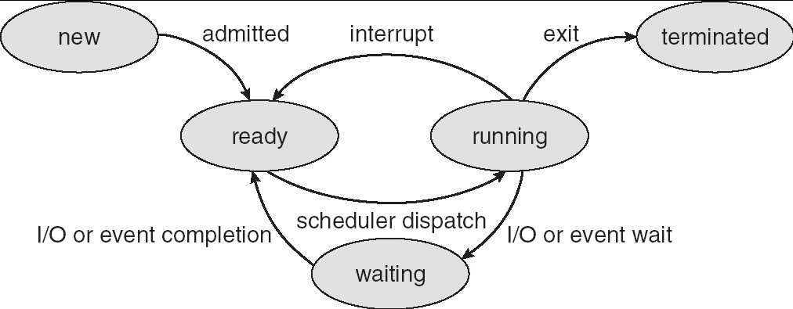
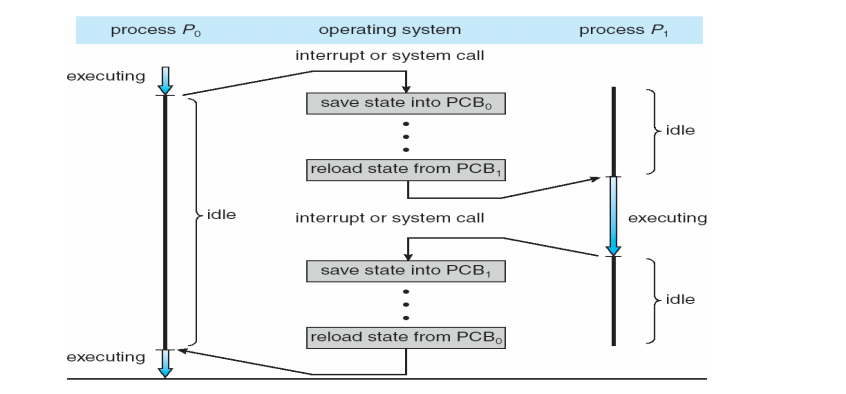
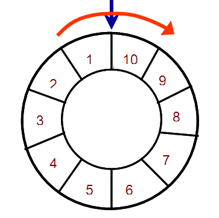
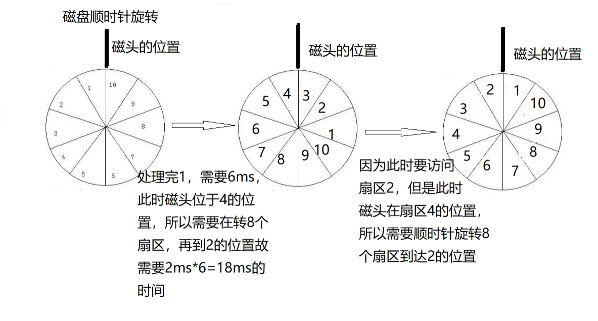
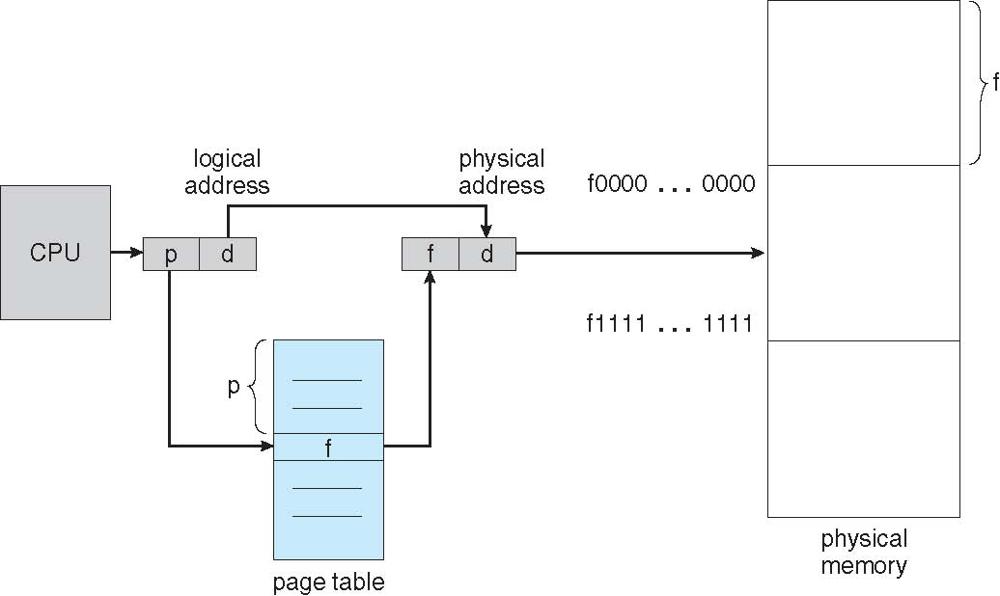

## 2018-2019学年上学期月考试卷（含答案）

### 说明

- 日期：2018.10

### 一、判断题（20 分，每小题 4 分）

判断下列每句话是否正确，如错误请说明理由。

1. 开关中断以及读时钟数据都属于特权指令。

    

    
答案：

    错。读时钟数据不属于特权指令。

    

    ***

2. 用于控制生产流水线、进行工业处理控制的操作系统是实时系统。

    

    
答案：

    对。

    

    ***

3. 从“新建”状态进入“就绪”状态的进程增多时，CPU 利用率一定不会受到影响。

    

    
答案：

    错。CPU 利用率可能会下降。

    

    ***

4. Google’s Chrome 浏览器，每次打开一个新页面时，无需建立新的 PCB。

    

    
答案：

    错。每次打开一个新页面时，创建新的进程，因此需要建立新的 PCB。

    

    ***

5. 微内核的设计中，将文件管理的模块放置在用户空间来实现。

    

    
答案：

    对。

    

***

### 二、不定项选择题（20 分，每小题 4 分）

每题有一个或多个答案，答错、少选、多选均不给分。

1. 当 CPU 执行系统调用时，一般处于（ ）。

    A. 执行态

    B. 用户态

    C. 就绪态

    D. 内核态

    

    
答案：

    D

    

    ***

2. 以下哪些对于微内核操作系统的描述是正确的？（ ）

    A. 微内核具有较高移植性，可以对微内核部分进行移植修改；

    B. 进程间通信必须在微内核内实现；

    C. 微内核是一个完整操作系统；

    D. 操作系统设计时采用微内核结构可以提高操作系统执行的效率。

    

    
答案：

    A、B

    

    ***

3. 下列说法正确的是（ ）

    A. 虚拟机允许同一物理设备上安装任意多个操作系统；

    B. OpenStack 是一个开源的云计算管理平台项目；

    C. VMware 可以提供虚拟化服务；

    D. Java 虚拟机有自己设置的硬件。如，处理器、堆栈、寄存器等，还具有相应的指令系统；

    

    
答案：

    B、C、D

    

    ***

4. UNIX 操作系统是典型的（ ）。

    A. 多道批处理系统；

    B. 分时系统；

    C. 实时系统；

    D. 分布式系统。

    

    
答案：

    B

    

    ***

5. 以下对操作系统内核的运行方式的描述，正确的是：（ ）

    A. 操作系统是一个在内核态运行独立的进程；

    B. 操作系统内核运行时能访问其它进程的地址空间；（这句话是不是少了“不”字）

    C. 只有在硬件中断发生时，操作系统内核才会运行；

    D. 操作系统内核可以以内核态在用户进程上下文中运行。

    

    
答案：

    D

    

***

### 三、辨析题（20 分，每小题 5 分）

分别解释以下每组的两个名词，并列举他们的区别。

1. 中断（Interrupt）和陷阱（Trap）

    

    
答案：

    An interrupt is a hardware-generated change of flow within the system. An interrupt handler is summoned to deal with the cause of the interrupt; control is then returned to the interrupted context and instruction.

    A trap is a software-generated interrupt. An interrupt can be used to signal the completion of an I/O to obviate the need for device polling. A trap can be used to call operating system routines or to catch arithmetic errors.

    

    ***

2. 长程调度（long-term scheduling）与中程调度（mid-term scheduling）

    

    
答案：

    长程调度：操作系统决定到底有多少进程能够从“new”状态进入就绪状态的调度。

    中程调度：操作系统决定哪些进程的地址空间能够保留在内存中，哪些进程的地址空间需要被交换到外存的调度。

    区别：长程调度被用于平衡系统资源利用率与并发进程个数；中程调度被用于控制运行与就绪进程有足够的内存、较低的缺页率能够运行。

    

    ***

3. 用户程序（user program）和进程（process）

    

    
答案：

    （1）用户程序可以由进程构成，一个用户程序可以包括一个或者几个进程。

    （2）进程是动态的，程序是静态的：程序是有序代码的集合，进程是程序的执行。进程有核心态/用户态。

    （3）进程是暂时的，程序是永久的；进程是一个状态变化的过程，程序可以长久保存。

    （4）进程和程序的组成不同，进程的组成包括程序段、数据和进程控制块（即进程状态信息）。

    

    ***

4. API 和系统调用

    

    
答案：

    API 是函数的定义，规定了函数的功能，跟内核无直接关系。系统调用是通过中断向内核发请求，实现内核提供的某些服务。API 需要一个或多个系统调用来完成特定功能。

    API 是一个提供给应用程序的接口函数，与程序员进行直接交互的；系统调用则不与程序员进行交互的，它根据 API 函数，通过一个软中断机制向内核提交请求，以获取内核服务的接口。

    并不是所有的 API 函数都对应一个系统调用，有的 API 函数需要几个系统调用来共同完成其功能。

    

***

### 四、综合题（40 分）

1. 结合下面的图示，请论述 CPU 和 I/O 的并行过程。进程之间上下文切换发生在哪一处？为什么有延迟？（10 分）

    

    

    
答案：

    （1）CPU 与 I/O 的并行过程：

    首先 I/O 发出请求，传输数据，此时 CPU 仍正常执行自己的计算工作，I/O 设备与 CPU 并行工作。数据传输完成后，CPU 先保存当下的数据和信息即上下文切换（B 与 C 之间），然后 CPU 对 I/O 中断进行处理。处理完成后 CPU 返回刚才的进程。

    （2）上下文切换发生在 BC 和 FG 之间。

    （3）BC 和 FG 段的延迟是因为进程的上下文保存耗时，包括进程有关地各种寄存器的值，例如通用寄存器、程序计数器 PC、程序状态字寄存器 PS，以及机器指令代码集（或称正文段）、数据集、各种堆栈值及 PCB 结构；同时也要载入中断处理程序。

    

    ***

2. 结合图 2 的实例，请说明引入进程概念后，程序并发执行的过程，并进一步说明程序并发执行的优点。（10 分）

    

    

    
答案：

    （简要答案）进程是计算机中的程序的一次动态执行，是系统进行资源分配和调度的基本单位，是操作系统结构的基础。

    进程是操作系统中最基本、重要的概念。

    为了实现程序的并发执行，实现系统资源共享，把计算机中的程序分成进程，然后系统的各种设备在可以实现分时共享，提高程序和任务的并发度，进一步提高资源的利用率。

    

    ***

3. 假设某操作系统进程有 5 个状态，请结合图 3 说明进程的从创建到终止的生命期内各种状态转换及引起转换的事件。（10 分）

    

    

    
答案：

    上图主要分为五个状态：

    new（创建）：为一个新进程创建必要的信息，让该进程进入就绪状态，此时进程处于新建态。

    terminated（终止）：当一个进程结束后，它将进入终止状态。

    ready：进程已经就绪，等待分配处理器（CPU）

    running：进程获得 CPU，该进程处于运行状态

    running-ready：进程时间片用完

    running-waiting：正在执行的进程发生某事件（如 I/O 请求、申请缓冲区失败），暂时无法继续执行，即进程受到阻塞。

    waiting-ready：I/O 事件完成，阻塞状态转换为就绪状态

    running-terminated：进程结束

    

    ***

4. 结合图 4 说明进程之间上下文切换的过程，具体说明涉及进程 PCB 的哪些信息，并指明代价高与低。（10 分）

    

    

    
答案：

    保存与重新调入上下文信息，操作系统需要对以下内容进行保存与重新调入：

    （1）计算机系统中执行该进程有关的各种寄存器的值（代价较低）

    例如通用寄存器、程序状态字寄存器 PS、程序计数器 PC 等

    （2）程序段在经过编译之后形成的机器指令代码集（或称正文段）、数据集（代价较高）

    （3）各种堆栈值（代价较低）

    （4）PCB 结构。（代价较低）

    

***

## 2018-2019学年上学期月考试卷（含答案）

### 说明

- 考察内容：文件与 I/O

### 一、判断题（30 分，每小题 3 分）

判断下列每句话是否正确，如错误请说明理由。

1. 在页式存储管理中，用户应将自己的程序划分成若干相等的页。

    

    
答案：

    错。分页是系统分的而不是用户自己分的。

    

    ***

2. 快表 TLB 采用了哈希散列的方式，将物理帧号与逻辑页号相连，实现页表的快速查找。

    

    
答案：

    错。本质上是使用关联存储技术。

    

    ***

3. 操作系统的所有程序都必须常驻内存。

    

    
答案：

    错。只有 kernel 部分常驻内存。

    

    ***

4. 在段式存储管理中，段的大小是根据用户程序的模块进行划分的，将内存区域划分为长度不相等的区域。

    

    
答案：

    对。

    

    ***

5. 在虚存系统中只要磁盘空间无限大，作业就能拥有任意大的编址空间。

    

    
答案：

    对。

    

    ***

6. 段式存储中，可以使用段表中的标识位，实现地址保护。而在分页环境下，无法实现地址保护。

    

    
答案：

    错。在分页环境下的内存保护由关联到每个帧的保护位完成。这些位通常保存在页表中。一个位可以定义一个页是读写还是只读属性。可以检查保护位来确定有没有对一个只读页进行写操作。

    

    ***

7. 对磁盘进行移臂调度优化的目的是为了缩短启动时间。

    

    
答案：

    错。应该是缩短寻道时间。

    

    ***

8. 采用反向页表的系统，整个系统只有一个页表。

    

    
答案：

    对。

    

    ***

9. 逻辑地址空间是由 CPU 生成的，也被称为虚拟地址，而物理地址是指内存存储单元所管理的内容。

    

    
答案：

    对。

    

    ***

10. MMU 存储管理单元的主要任务是实现将逻辑地址映射为物理地址，实现了动态重定位，并提供硬件机制的内存访问权限检查。

    

    
答案：

    对。

    

***

### 二、不定项选择题（15 分，每空 3 分）

每题有一个或多个答案，答错、少选、多选均不给分。

1. 使用段页式内存管理，段表和页表都存放在主存中，所有要访问的页面都在主存中。页表项可以缓存在转换表缓冲区（TLB）中。一次内存访问的代价为 $120\ \text{ns}$，一次 TLB 访问代价为 $8\ \text{ns}$。假设 TLB 的命中率为 50%，请问进程对内存的有效访问时间（effective access time）是（ ）。

    A. $248\ \text{ns}$

    B. $260\ \text{ns}$

    C. $180\ \text{ns}$

    D. $308\ \text{ns}$

    

    
答案：

    D

    $120+50\%*8+50\%*(120+8)+120=308\ \text{ns}$

    

    ***

2. 一个 32 位物理地址的计算机系统，如果采用页式存储管理方式，一个页的大小为 $4\ \text{K}$，程序代码及数据均采用按字节编址，那么在页内进行寻址需要（ ）位物理地址。

    A. 2

    B. 12

    C. 8

    D. 1

    

    
答案：

    B

    

    ***

3. 上题中，该计算机的物理内存容量为（ ）

    A. 2G

    B. 4G

    C. 1M

    D. 1G

    

    
答案：

    B

    

    ***

4. 以下存储管理方式中，会产生内部碎片的是（ ）

    A. 分段虚拟存储管理

    B. 分页虚拟存储管理

    C. 段页式分区管理

    D. 固定式分区管理

    

    
答案：

    B、C、D

    

    ***

5. 既可以随机访问又可顺序访问的有（ ）

    A. 光盘

    B. 磁带

    C. U 盘

    D. 磁盘

    

    
答案：

    A、C、D

    

***

### 三、简单回答以下问题（15 分，每小题 5 分）

1. 请说明段页式存储管理和分段存储管理的区别，要求从原理、地址变换和优缺点进行比较。

    

    
答案：

    （1）原理及地址变换

    段页式存储管理是将用户程序分成若干个段，并为每一个段赋予一个段名；再把每个段分成若干个页。在段页式系统中，为了便于实现地址变换，须配置一个段表寄存器，其中存放段表始址和段表长。进行地址变换时，首先利用段号 S，将它与段表长 TL 进行比较。若 S\<TL，表示未越界，于是利用段表始址和段号来找出该段所对应的段表项在段表中的位置，从中得到该段的页表始址，并利用逻辑地址中的段内页号 P 来获得对应页的页表项位置，从中读出该页所在的物理块号 b，再利用块号 b 和页内地址来构成物理地址。

    三次访存：在段页式系统中，为了获得一条指令或数据，须三次访问内存。第一次访问是访问内存中的段表，从中取得页表始址；第二次访问是访问内存中的页表，从中取出该页所在的物理块号，并将该块号与页内地址一起形成指令或数据的物理地址；第三次访问才是真正从第二次访问所得的地址中，取出指令或数据。

    分段存储管理中：将逻辑空间分为若干个段，每个段定义了一组有完整逻辑意义的信息。段的长度由相应的逻辑信息组的长度决定，因而各段长度不等，可以满足用户（程序员）在编程和使用上的要求。

    在段式管理系统中，整个进程的地址空间是二维的，即其逻辑地址由段号和段内地址两部分组成。为了完成进程逻辑地址到物理地址的映射，处理器会查找内存中的段表，由段号得到段的首地址，加上段内地址，得到实际的物理地址。这个过程也是由处理器的硬件直接完成的，操作系统只需在进程切换时，将进程段表的首地址装入处理器的特定寄存器当中。这个寄存器一般被称作段表地址寄存器。

    （2）优缺点：分段存储管理优点：可分页通常对程序员而言是可见的，因而分段为组织程序和数据提供了方便；段的逻辑独立性使其易于编译、管理、修改和保护，也便于多道程序共享；段长可以根据需要动态改变，允许自由调度，以便有效利用主存空间；方便编程，分段共享，分段保护，动态链接，动态增长。

    分段存储管理缺点：主存空间分配比较复杂，容易在段间留下许多碎片，造成存储空间利用率降低；由于段长不一定是 2 的整数次幂，地址变换用加法操作通过段起止与段内地址的求和运算得到物理地址；段式存储管理需要更多的硬件支持。

    段页式存储管理优缺点：段间留下许多碎片问题可以克服，页的单位更小，存储空间可以充分利用。也需要较多的硬件支持。

    

    ***

2. 请说明什么是抖动以及产生抖动的原因。

    

    
答案：

    （1）如果多道程序过高，页面在内存和外存之间频繁调度，以至于调度页面所需要的时间比进程实际运行的时间还多，此时系统效率急剧下降，甚至导致系统崩溃，这种现象叫抖动。

    （2）原因是同时在系统中运行的进程太多，由此分配给每一个进程的物理块太少，不能满足进程正常运行的基本要求，致使每个进程在运行时，频繁地出现缺页，必须请求系统将所缺之页调入内存，于是系统中排队等待页面调进调出的进程数增加，从而导致抖动。

    

    ***

3. 交换技术与虚拟存储技术中的调入调出技术的区别与联系。

    

    
答案：

    相同点：都要在内存与外存之间交换信息。

    区别：交换技术调入、调出整个进程，因此一个进程的大小要受到内存容量大小的限制；而虚存中使用的调入、调出技术在整个内存和外存之间来回传递的是页面或分段，而不是整个进程，而使得进程的地址映射具有了更大的灵活性，且允许进程的大小比可用的内存空间大。

    

***

### 四、综合题（40 分）

1. 假设一个磁盘驱动器有 5000 个柱面，从 0 到 4999。该驱动器目前正在处理请求柱面 2150，以前请求柱面为 1805。按 FIFO 顺序等待请求队列是：

    2069, 1212, 2296, 2800, 544, 1618, 356, 1523, 4965, 3681

    问题：从当前磁头位置开始，针对以下每个磁盘调度算法，磁臂移动以满足所有等待请求的磁道访问序列及总的移动距离。（10 分）

    a. FCFS

    b. SSTF

    c. SCAN

    d. C-LOOK

    

    
答案：

    a. FCFS 顺序是 2150, 2069, 1212, 2296, 2800, 544, 1618, 356, 1523, 4965, 3681。

    磁头移动的距离为：$81+857+1084+504+2256+1074+1262+1167+3442+1284=13011$

    b. SSTF 顺序是 2150, 2069, 2296, 2800, 3681, 4965, 1618, 1523, 1212, 544, 356。

    磁头移动的距离：$81+227+504+881+1284+3347+95+311+668+188=7586$

    c. SCAN 顺序是 2150, 2296, 2800, 3681, 4965, (4999), 2069, 1618, 1523, 1212, 544, 356

    磁头移动的距离：$146+504+881+1284+34+2930+451+95+311+668+188=7492$。

    d. C-LOOK 顺序是：2150, 2296, 2800, 3681, 4965, 356, 544, 1212, 1523, 1618, 2069。

    磁头移动的距离：$146+504+881+1284+4609+188+668+311+95+451=9137$

    

    ***

2. 假定磁盘转速为 $20\ \text{ms}$/圈，磁盘格式化时每个磁道被分成 10 扇区，今有 10 个逻辑记录（每个记录的大小刚好与扇区大小相等）存放在同一磁道上，处理程序每次从磁盘读出一个记录后要花 $4\ \text{ms}$ 进行处理，现在要求顺序处理这 10 个记录，若磁头现在正处于首个逻辑记录的始点位置。按逆时针方向安排 10 个逻辑记录（磁盘顺时针方向转），处理程序处理完这 10 个记录所花费的时间是多少？（10 分）

    

    

    
答案：

    读一个逻辑记录需 $2\ \text{ms}$ 时间，读出记录后还需要 $4\ \text{ms}$ 时间进行处理，故当磁头处于某记录的始点时，处理它共需 $6\ \text{ms}$ 时间。逻辑记录是按逆时针方向安排的，因此系统处理完一个逻辑记录后将磁头转到下一个逻辑记录的始点需要 $16\ \text{ms}$ 时间。

    

    注意：磁盘结果如下，因为磁盘顺时针旋转，所以当先访问 1 时，在访问 2，磁盘需要顺时针旋转 8 个扇区，才能到达 2，故处理完一个逻辑记录后将磁头转到下一个逻辑记录的初始点需要 $2\ \text{ms}*8=16\ \text{ms}$ 的时间。

    从而可以计算出处理程序处理完这 10 个逻辑记录所需的时间为：$6+9*(16+6)=204\ \text{ms}$

    

    ***

3. 请画出分页内存管理（无 TLB）的硬件结构图，并进行简单的解释说明。（10 分）

    

    

    
答案：

    1）物理地址：内存单元的真正地址。

    逻辑地址：CPU 所生成的地址。逻辑地址是不唯一的。

    2）分页使得进程的物理地址空间可以是非连续的。

    物理内存被划分为小块，每块被称为帧（Frame）。分配内存时，帧是分配时的最小单位。在逻辑内存中，与帧对应的是页（Page）。逻辑地址的表示方式是：前部分是页码，后部分是页内位移量。

    3）每个操作系统都有自己的方法来保存页表。绝大多数都会为每个进程分配一个页表。现在由于页表都比较大，所以放在内存中（以往是放在一组专用寄存器里），其指针存在进程控制块（PCB）里，当进程被调度程序选中投入运行时，系统将其页表指针从进程控制块中取出并送入用户寄存器中。随后可以根据此首地址访问页表。

    页表的存储方式是 TLB 和内存。若没有 TLB，操作系统需要两次内存访问，来完成逻辑地址到物理地址的转换，访问页表是第一次访问内存，目的是通过逻辑页号查找出对应的物理页框号，然后根据页框号和页内位移量构成物理地址，进一步根据这一物理地址进行第二次访问内存，获取数据或者代码。

    

    ***

4. 假设某进程的页表内容如下表所示，页面大小为 $4\ \text{KB}$，有效位为 0 表示页面不在内存。请问虚地址 0x2362、0x1565 对应的物理地址是多少。（10 分）

    | 页号（page number） | 框号（frame number） | 有效位（valid bit） |
    | --- | --- | --- |
    | 0 | 0x101 | 1 |
    | 1 | 0x838 | 0 |
    | 2 | 0x254 | 1 |

    

    
答案：

    页面大小为 $4\ \text{KB}$，即 $2^{12}$，即页内偏移占 12 位，页号占剩余高位。可得以上虚地址的页号分别如下：

    0x2362：页号 = 2。框号：0x254，物理地址：0x254362。

    0x1565H：页号 = 1，框无效，将产生缺页中断。

    

