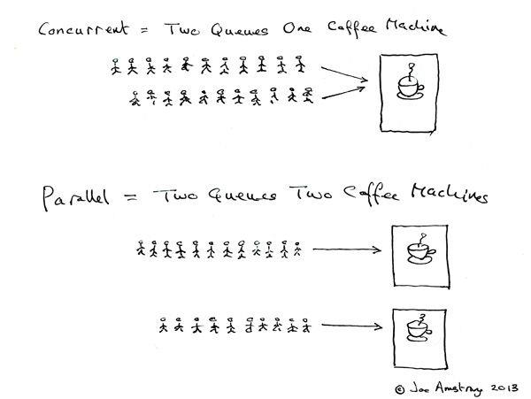
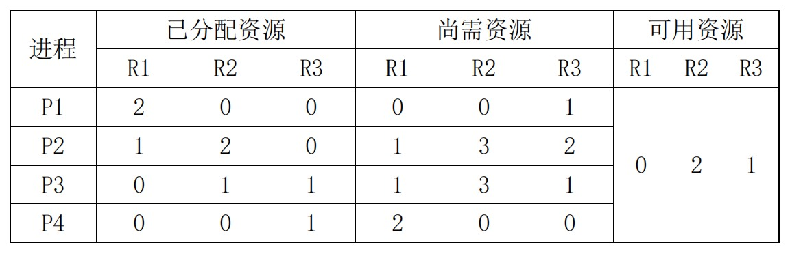

## 2018-2019学年上学期期中试卷（含答案）

### 说明

- 原卷标题：华东师范大学软件学院操作系统期中试卷（2018—2019学年第一学期）

### 一、判断题（20分，每小题4分）

正确的打√，错误的打×，如错误请说明理由。

1. 作业调度是高级调度,而进程调度是低级调度。

    <details>
    <summary>答案：</summary>

    √

    </details>

    ***

2. 时间片越小,系统的响应时间就越小,系统的效率就越高。

    <details>
    <summary>答案：</summary>

    × 时间片减小可以降低响应时间。但是进程切换开销占比增大，会降低系统效率。

    </details>

    ***

3. 资源分配图中存在环时，系统进程处于死锁状态。

    <details>
    <summary>答案：</summary>

    ×。当每种资源实例个数为1时，在环中的每个进程处于死锁状态。但是当资源实例数量不唯一时，不一定处于死锁状态。

    </details>

    ***

4. 进程A与进程B共享变量S1,需要互斥:进程B与进程C共享变量S2,需要互斥。从而,进程A与进程C也必须互斥。

    <details>
    <summary>答案：</summary>

    × 互斥没有传递性。

    </details>

    ***

5. 进程执行的相对速度不能由进程自己来控制

    <details>
    <summary>答案：</summary>

    √

    </details>

***

### 二、不定项选择题（20分，每小题4分）

每题有一个或多个答案，答错、少选、多选均不给分。

1. 操作系统提供给程序员的接口是（ ）。

    A. 进程

    B. 系统调用

    C. 库函数

    D. SHELL

    <details>
    <summary>答案：</summary>

    B

    </details>

    ***

2. 下列的进程状态变化中，不可能发生的变化是（ ）。

    A．运行一就绪

    B．运行一等待

    C．等待一运行

    D．等待一就绪

    <details>
    <summary>答案：</summary>

    C

    </details>

    ***

3. 下列描述正确的是（ ）

    A. 中断优先级是由硬件规定的

    B. 进程间通信机制是微内核的一部分；

    C. 只有在硬件中断发生时，操作系统内核才会运行；

    D. 中断技术是多道程序并发处理的必要条件。

    <details>
    <summary>答案：</summary>

    A, B, D

    </details>

    ***

4. 在单处理机系统中，操作的“原子”性可以通过（ ）来实现。

    A. 特权指令

    B. 访管指令

    C. 屏蔽中断

    D. 系统调用

    <details>
    <summary>答案：</summary>

    C

    </details>

    ***

5. 在多级队列调度和多级反馈队列的调度的叙述中，正确的是（ ）。

    A．多级反馈队列的调度中就绪队列的设置不是像多级队列调度一样按作业性质划分，而是按时间片的大小划分

    B．多级队列调度用到优先权，而多级反馈队列调度中没有用到优先权

    C．多级队列调度中的进程固定在某一个队列中，而多级反馈队列调度中的进程不固定

    D．多级队列调度中每个队列按作业性质不同而采用不同的调度算法，而多级反馈队列调度中除了个别队列外，均采用相同的调度算法

    <details>
    <summary>答案：</summary>

    A

    :::tip
    原参考答案只给出A，疑似不完整。C描述了进程能否在不同队列间移动，D描述了各队列所采用的调度算法，也符合多级队列调度与多级反馈队列调度的典型区别。
    :::

    </details>

***

### 三、辨析简答题（20分，每小题5分）

1. 比较核心态和用户态

    <details>
    <summary>答案：</summary>

    核心态：操作系统内核执行的受保护的状态

    用户态：用户进程执行所在的状态

    区别：处于用户态只能访问进程的地址空间，用户态需要通过中断或系统调用才能进入核心态。

    </details>

    ***

2. 描述进程与线程的关系。

    <details>
    <summary>答案：</summary>

    对于单线程的进程（或者没有线程概念的进程），进程及时资源管理的单位，也是任务调度的单位。

    对于多线程的进程，线程是任务调度单位，进程是资源管理单位。

    线程相关的硬件资源包括：CPU的寄存器以及堆栈，进程相关的资源包括除堆栈外的其他内存，打开文件列表等。

    </details>

    ***

3. 比较并发（concurrent）与并行（parallel）。

    <details>
    <summary>答案：</summary>

    并发:一个时间间隔内有多个任务在执行。（宏观上“同时”运行）

    并行：同一个时刻内有多个任务在执行。（微观上同时运行，必须有多个执行硬件的支持）

    （下图仅作参考说明，不作为答案一部分）

    

    </details>

    ***

4. 比较死锁预防措施与死锁避免措施。（5分）

    <details>
    <summary>答案：</summary>

    （1）预防死锁：主要是破坏产生死锁的必要条件之一：（1）互斥（2）占有与等待（3）不抢占（4）循环等待。该方法是最容易实现的，是一种粗粒度的解决方法，但系统资源利用率较低。

    （2）避免死锁：通过资源分配图（单实例资源）,银行家算法（多实例资源）等，在执行的过程中小心的计算资源需求与供应关系，避免死锁的发生。该算法需要较多的数据结构，实现起来比较困难，但资源利用率最高。

    </details>

***

### 四、综合题（40分）

1. （15分）有5个任务A,B,C,D,E。它们几乎同时到达,预计它们的运行时间为10,6,2,4,8ms。其优先级分别为3,5,2,1和4（这里5为最高优先级）。对于下列每一种调度算法,计算其平均进程周转时间（进程切换开销可不考虑）。

    a) 先来先服务（按A,B,C,D,E顺序）算法。（5分）

    <details>
    <summary>答案：</summary>

    采用FCFS的调度算法时,各任务在系统中的执行情况如下表所示:

    | 执行次序 | 运行时间 | 优先数 | 等待时间 | 周转时间 |
    | --- | --- | --- | --- | --- |
    | A | 10 | 3 | 0 | 10 |
    | B | 6 | 5 | 10 | 16 |
    | C | 2 | 2 | 16 | 18 |
    | D | 4 | 1 | 18 | 22 |
    | E | 8 | 4 | 22 | 30 |

    所以,进程的平均周转时间为:

    $T=(10+16+18+22+30)/5=19.2\ \text{ms}$

    </details>

    b) 优先级调度算法。（5分）

    <details>
    <summary>答案：</summary>

    采用优先级调度算法时,各任务在系统中的执行情况如下表所示:

    | 执行次序 | 运行时间 | 优先数 | 等待时间 | 周转时间 |
    | --- | --- | --- | --- | --- |
    | B | 6 | 5 | 0 | 6 |
    | E | 8 | 4 | 6 | 14 |
    | A | 10 | 3 | 14 | 24 |
    | C | 2 | 2 | 24 | 26 |
    | D | 4 | 1 | 26 | 30 |

    所以,进程的平均周转时间为:

    $T=(6+14+24+26+30)/5=20\ \text{ms}$

    </details>

    c) 时间片轮转算法（时间片2ms）。（5分）

    <details>
    <summary>答案：</summary>

    采用时间片轮转算法时,假定时间片为2min,各任务的执行情况是:(A,B,C,D,E),(A,B,D,E),(A,B,E),(A,E),(A)。设A～E五个进程的周转时间依次为T1～T5,显然,

    $T1=30\text{ms},\ T2=22\text{ms},\ T3=6\text{ms},\ T4=16\text{ms},\ T5=28\text{ms}$

    所以,进程的平均周转时间为:

    $T=(30+22+6+16+28)/5=20.4\text{ms}$

    :::tip
    题干规定时间片为2ms，而原参考答案写成“2min”，此处疑似单位笔误。
    :::

    </details>

    ***

2. （15分）某车站售票厅，任何时刻最多可容纳20名购票者进入，当售票少于20名购票者时，则厅外的购票者可立即进入，否则需在外面等待。若把一个购票者看作一个进程，请回答下列问题：

    a)（5分）用P、V操作管理这些并发进程时，应怎样定义信号量？写出信号量的初值以及信号量各种取值的含义。

    <details>
    <summary>答案：</summary>

    （1）定义一信号量S，初始值为20。

    $S>0$ S的值表示可继续进入售票厅的人数；

    $S=0$ 表示售票厅中已有20名购票者；

    $S<0$ $|S|$的值为等待进入售票厅中的人数。

    </details>

    b)（5分）根据所定义的信号量，把应执行的P、V操作填入下述程序中，以保证进程能够正确地并发执行。

    ```text
    Cobegin PROCESS Pi(i=1,2,…)
    Begin
        进入售票厅；
        购票；
        退出；
    End;
    Coend
    ```

    <details>
    <summary>答案：</summary>

    （2）

    ```text
    P(S);
    进入售票厅；
    购票；
    退出；
    V(S);
    ```

    </details>

    c)（5分）若欲购票者最多为n个人，写出信号量可能的变化范围（最大值和最小值）。

    <details>
    <summary>答案：</summary>

    （3）S的最大值为20，S的最小值为20－N，N为某一时刻需要进入售票厅的最多人数。

    </details>

    ***

3. （10分）某时刻进程的资源使用情况如下所示。

    

    此时的安全序列是什么？

    <details>
    <summary>答案：</summary>

    无。

    $[0,2,1] \ge \mathrm{Need}_{P1}\ [0,0,1]$

    P1: $[0,2,1]+[2,0,0]=[2,2,1]\ge \mathrm{Need}_{P4}: [2,0,0]$

    P4：$[2,2,1]+[0,0,1]=[2,2,2]$ 剩下进程（P2，P3）不能完成

    </details>
