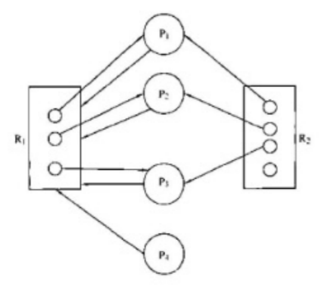
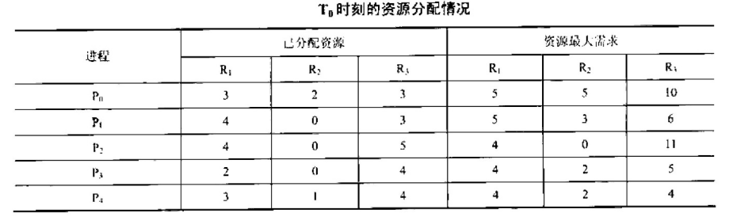
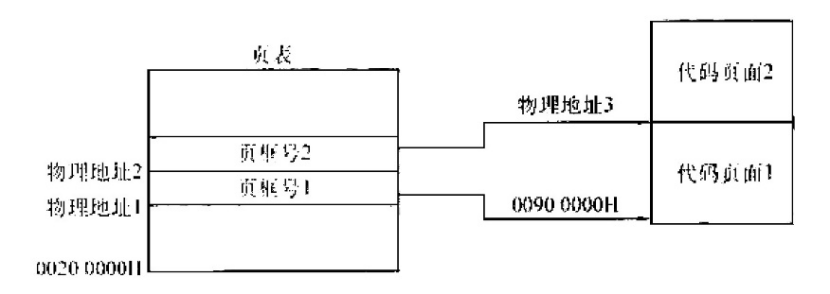
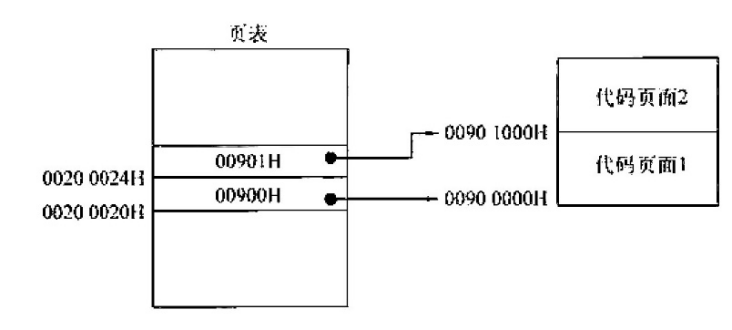
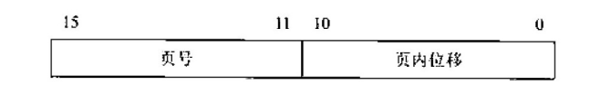

## 2021-2022学年下学期期末试卷（A）

### 一、选择题

1. （ ）不是操作系统的功能。

    A. CPU 管理

    B. 存储管理

    C. 网络管理

    D. 数据管理

    <details>
    <summary>答案：</summary>

    C

    </details>

    ***

2. 计算机开机后，操作系统最终被加载到（ ）。

    A. BIOS

    B. ROM

    C. EPROM

    D. RAM

    <details>
    <summary>答案：</summary>

    D

    </details>

    ***

3. 要实现两个进程互斥，设一个互斥信号量 `mutex`，当 `mutex` 为 0 时，表示（ ）。

    A. 没有进程进入临界区

    B. 有一个进程进入临界区

    C. 有一个进程进入临界区，另外一个进程在等候

    D. 两个进程都进入临界区

    <details>
    <summary>答案：</summary>

    B

    </details>

    ***

4. 与单道程序相比，多道程序系统的优点是（ ）

    I. CPU 利用率高

    II. 系统开销小

    III. 系统吞吐量大

    IV. I/O 设备利用率高

    A. 仅 I、III

    B. 仅 I、IV

    C. 仅 II、III

    D. 仅 I、III、IV

    <details>
    <summary>答案：</summary>

    D

    </details>

    ***

5. 为多道程序提供的共享资源不足时，可能会产生死锁，但是，不当的（ ）也可能产生死锁。

    A. 进程调度顺序

    B. 进程的优先级

    C. 时间片大小

    D. 进程推进顺序

    <details>
    <summary>答案：</summary>

    D

    </details>

    ***

6. 下列关于 SPOOLing 技术的叙述中，错误的是（ ）

    A. 需要外存的支持

    B. 需要多道程序设计技术的支持

    C. 可以让多个作业共享一台独占设备

    D. 由用户作业控制设备与输入/输出之间的数据传送

    <details>
    <summary>答案：</summary>

    D

    </details>

    ***

7. 用户程序发出磁盘 I/O 请求后，系统的正确处理流程是（ ）

    A. 用户程序→系统调用处理程序→中断处理程序→设备驱动程序

    B. 用户程序→系统调用处理程序→设备驱动程序→中断处理程序

    C. 用户程序→设备驱动程序→系统调用处理程序→中断处理程序

    D. 用户程序→设备驱动程序→中断处理程序→系统调用处理程序

    <details>
    <summary>答案：</summary>

    B

    </details>

    ***

8. 已知某磁盘的平均转速为 $r$ 秒/转，平均寻找时间为 $T$ 秒，每个磁道可以存储的字节数为 $N$，现向该磁盘读写 $b$ 字节的数据，采用随机寻道的方法，每道的所有扇区组成一个簇，其平均访问时间是（ ）。

    A. $(r+T)b/N$

    B. $b/NT$

    C. $r(b/N+T)$

    D. $bT/N+r$

    <details>
    <summary>答案：</summary>

    A

    </details>

    ***

9. 某文件系统的簇和磁盘块大小分别为 $1KB$ 和 $512B$，若一个文件的大小为 $1026B$，则系统分配给该文件的磁盘空间大小是（ ）。

    A. $1026B$

    B. $1536B$

    C. $1538B$

    D. $2048B$

    <details>
    <summary>答案：</summary>

    D

    </details>

    ***

10. 当系统发生抖动（Trashing）时，可以采取的有效措施是（ ）。

    I. 撤销部分进程

    II. 增大磁盘交换区的容量

    III. 提高用户进程的优先级

    A. 仅 I

    B. 仅 II

    C. 仅 III

    D. 仅 I、II

    <details>
    <summary>答案：</summary>

    A

    </details>

    ***

11. 系统为某进程分配了 4 个页框，该进程已访问的页号序列为 2，0，2，9，3，4，2，8，2，4，8，4，5，若进程要访问的下页的页号为 7，依据 LRU 算法，应淘汰的页号是（ ）。

    A. 2

    B. 3

    C. 4

    D. 8

    <details>
    <summary>答案：</summary>

    A

    </details>

    ***

12. 要保证一个程序在主存中被改变了存放位置后仍能正确地执行，则对主存空间应采用（ ）技术。

    A. 静态重定位

    B. 动态重定位

    C. 动态分配

    D. 静态分配

    <details>
    <summary>答案：</summary>

    B

    </details>

    ***

### 二、填空题

1. 当多个线程协作完成一项任务时，线程间必须通过 $\underline{\qquad}$ 来实现协作工作。

    <details>
    <summary>答案：</summary>

    PV 操作

    </details>

    ***

2. 在 $\underline{\qquad}$ 和 $\underline{\qquad}$ 存储管理中，页式存储管理提供的逻辑地址是连续的。

    <details>
    <summary>答案：</summary>

    页式、段式

    </details>

    ***

3. 可靠的信箱通信规则是：若发送信件时信箱已满，则发送进程被置成等信箱状态，直到信箱不满时才被释放。若取信件时信箱中无信，则接收进程被置成 $\underline{\qquad}$ 状态，直到有信件时才被释放。

    <details>
    <summary>答案：</summary>

    等信件

    </details>

    ***

4. UNIX 系统规定用户使用文件的权限是读、$\underline{\qquad}$ 和 $\underline{\qquad}$ 三种。

    <details>
    <summary>答案：</summary>

    写、执行

    </details>

    ***

5. 死锁的形成，除了与资源的 $\underline{\qquad}$ 有关外，也与并发进程的 $\underline{\qquad}$ 有关。

    <details>
    <summary>答案：</summary>

    分配策略（或管理方法）、执行速度（或调度策略）

    </details>

    ***

6. 对于移动臂磁盘，磁头在移动臂的带动下，移动到指定柱面的时间称 $\underline{\qquad}$ 时间，而指定扇区旋转到磁头位置的时间称 $\underline{\qquad}$ 时间。

    <details>
    <summary>答案：</summary>

    寻找、延迟

    </details>

    ***

7. 操作系统中，进程调度通常有先来先服务、$\underline{\qquad}$、$\underline{\qquad}$ 和分级调度算法等调度算法。

    <details>
    <summary>答案：</summary>

    优先数调度算法、时间片轮转调度算法

    </details>

    ***

8. 主存储器与外围设备之间的 $\underline{\qquad}$ 操作称为输入输出操作。

    <details>
    <summary>答案：</summary>

    信息传送

    </details>

    ***

### 三、判断题

1. 所谓最近最少使用（ ）

    <details>
    <summary>答案：</summary>

    对

    </details>

    ***

2. 优先级是进程调度的重要依据，优先数大的进程首先被调度运行。（ ）

    <details>
    <summary>答案：</summary>

    错

    </details>

    ***

3. 存储保护的目的是限制内存的分配。（ ）

    <details>
    <summary>答案：</summary>

    错

    </details>

    ***

4. 优先数是进程调度的重要依据，一旦确定不能改变。（ ）

    <details>
    <summary>答案：</summary>

    错

    </details>

    ***

5. 操作系统的所有程序都必须常驻内存。（ ）

    <details>
    <summary>答案：</summary>

    错

    </details>

    ***

6. 同一文件系统中不允许文件同名，否则会引起混乱。（ ）

    <details>
    <summary>答案：</summary>

    对

    </details>

    ***

7. 在页式虚拟存储系统中，页面长度是根据程序长度动态性分配的。（ ）

    <details>
    <summary>答案：</summary>

    错

    </details>

    ***

8. 不可抢占式动态优先数法一定会引起进程长时间得不到运行。（ ）

    <details>
    <summary>答案：</summary>

    错

    </details>

    ***

9. 所有进程都挂起时，系统陷入死锁。（ ）

    <details>
    <summary>答案：</summary>

    错

    </details>

    ***

10. 在请求页式存储管理中，页面淘汰所花费的时间不属于系统开销。（ ）

    <details>
    <summary>答案：</summary>

    错

    </details>

    ***

11. 用户程序有时也可以在核心态下运行。（ ）

    <details>
    <summary>答案：</summary>

    错

    </details>

    ***

12. 当一个进程从等待态变成就绪态，则一定有一个进程从就绪态变成运行态。（ ）

    <details>
    <summary>答案：</summary>

    错

    </details>

    ***

### 四、名词解释题

1. 管程：

    <details>
    <summary>答案：</summary>

    管程是一种高级同步机制。一个管程定义一个数据结构和能为并发进程在其上执行的一组操作，这组操作能使进程同步和改变管程中的数据。

    </details>

    ***

2. 存储设备：

    <details>
    <summary>答案：</summary>

    它们是指计算机用来存储信息的设备，如磁盘（硬盘和软盘）、磁带等。

    </details>

    ***

3. 中断响应：

    <details>
    <summary>答案：</summary>

    发生中断时，CPU 暂停执行当前的程序，转去处理中断这个由硬件对中断请求做出反应的过程，称为中断响应。

    </details>

    ***

4. 当前目录：

    <details>
    <summary>答案：</summary>

    为节省文件检索的时间，每个用户可以指定一个目录作为当前工作目录，以后访问文件时，就从这个目录开始向下顺序检索，这个目录就称作“当前目录”。

    </details>

    ***

5. 路径：

    <details>
    <summary>答案：</summary>

    在树形目录结构中，从根目录出发经由所需子目录到达指定文件的通路。

    </details>

    ***

6. 响应时间：

    <details>
    <summary>答案：</summary>

    是分时系统的一个技术指标，指从用户输入命令到系统对命令开始执行和显示所需要的时间。

    </details>

    ***

### 五、简答题

1. 虚拟存储器的基本特征是什么？虚拟存储器给用户主要受哪两方面的限制？

    <details>
    <summary>答案：</summary>

    虚拟存储器的基本特征是：①虚拟扩充，即不是物理上而是逻辑上扩充了内存容量；②部分装入，即每个作业不是全部一次性地装入内存，而是只装入一部分；③离散分配，即不必占用连续的内存空间，而是“见缝插针”；多次对换，即所需的全部程序和数据要分成多次调入内存；虚拟存储器的容量主要受到指令中表示地址的字长和外存的容量的限制。

    </details>

    ***

2. 什么是虚拟存储器，它有什么特点？

    <details>
    <summary>答案：</summary>

    虚拟存储器是一种存储管理技术，用以完成用小的内存实现大的虚空间中程序的运行工作。它是由操作系统提供的一个假想的特大存储器。但是虚拟存储器的容量并不是无限的，它由计算机的地址结构长度所确定，另外虚存中的扩大是以牺牲 CPU 工作时间以及内、外存交换时间为代价的。

    </details>

    ***

3. 主存空间信息保护有哪些措施？

    <details>
    <summary>答案：</summary>

    ①程序自己不存取该区的信息，允许它既可读，又可写；②共享区域中的信息只可读，不可修改；③非共享区域或非自己的主存区域中的信息既不可读，也不可写。

    </details>

    ***

4. 处理机调度分为哪三级？各自的主要任务是什么？

    <details>
    <summary>答案：</summary>

    作业调度：从一批后备作业中选择一个或几个作业，给它们分配资源，建立进程，挂入就绪队列。执行完后，回收资源。

    进程调度：从就绪进程队列中根据某个策略选取一个进程，使之占用 CPU。

    交换调度：按照给定的原则和策略，将外存交换区中的进程调入内存，把内存中的非执行进程交换到外存交换区。

    </details>

    ***

5. 系统调用的执行过程分为哪几步？

    <details>
    <summary>答案：</summary>

    系统调用的执行过程分成以下几步：（1）设置系统调用号和参数；（2）系统调用命令的一般性处理；（3）系统调用命令处理程序完成具体处理。

    </details>

    ***

6. 一个具有分时兼批处理功能的操作系统应怎样调度和管理作业。

    <details>
    <summary>答案：</summary>

    1）优先接纳终端作业，仅当终端作业数小于系统可以允许同时工作的作业数时，可以调度批处理作业。

    2）允许终端作业和批处理作业混合同时执行。

    3）把终端作业的就绪进程排成一个就绪队列，把批处理作业的就绪进程排入另外的就绪队列中。

    4）让终端作业进程响应时间优先，以保证其按“时间片轮转”法运行。没有终端作业时按响应算法选批处理作业就绪进程运行。

    </details>

    ***

### 六、综合题

1. 假定某计算机系统有 R1 设备 3 台、R2 设备 4 台，它们被 P1、P2、P3 和 P4 这 4 个进程所共享，且已知这 4 个进程均以下面所示的顺序使用现有设备：

    →申请 R1→申请 R2→申请 R1→释放 R1→释放 R2→释放 R1→

    1）系统运行过程中是否有产生死锁的可能？为什么？

    2）如果有可能产生死锁，请列举一种情况，并画出表示该死锁状态的进程-资源图。

    <details>
    <summary>答案：</summary>

    1）系统运行过程中有可能产生死锁。根据题意，系统中只有 3 台 R1 设备，它们受被 4 个进程共享，且每个进程对 R1 设备的最大需求为 2，由于 R1 设备数量不足，而且它又是一个互斥、不可剥夺的资源，而系统又没采取任何措施破坏死锁产生的剩余两个必要条件，请求与保持条件和环路等待条件，因此，在系统运行过程中可能会发生死锁。

    2）P1、P2、P3 进程各得到一个 R1 设备时，它们可继续运行，并均可顺利地申请到一个 R2 设备；当第一次申请 R1 设备时，因为系统已无空闲的 R1 设备，故它们全部阻塞，并进入循环等待的死锁状态。这种死锁状态下的进程-资源图如下所示。

    

    </details>

    ***

2. 设有 P1、P2、P3，三个进程共享某一资源 F，P1 对 F 只读不写，P2 对 F 只写不读，P3 对 F 先读后写。当一个进程写 F 时，其他进程对 F 不能进行读写，但多个进程同时读 F 是允许的。使用 PV 操作正确实现 P1、P2、P3 三个进程的同步互斥。要求：并发性从大到小对上述 3 种办法进行排序。

    <details>
    <summary>答案：</summary>

    :::tip
    原参考答案未给出排序内容，仅给出 PV 实现。
    :::

    本题实质是“一个读者-写者问题”。P1 是一个读者，P2 是个写者，为了使 F 的并发度较高，将 P3 先看成读者，当其完成读操作后，再将其看成写者。算法中需要用到如下的变量定义：

    ```c
    int readcount = 0;
    semaphore rmutex=1;
    semaphore mutex=1;
    ```

    响应进程可描述为：P1()

    ```c
    while (1)

    P(rmutex);

    if(readcount==0)P(mute);
    readcount++
    V(rmutex);

    READF P(rmutex):

    readcount--;

    if(readcount==0)V(mutex);

    V(rmutex):

    }

    ```

    P2()

    ```c
    while（1）{

    P(mutex):

    WRITE F

    V(mutex):

    }

    ```

    P3()

    ```c
    while(1){

    P(rmutex)

    if(readcount==0)

    P(mutex);

    readcount++;

    V(rmutex):

    READ FP(rmutex);

    readcount--;

    if(readcount==0)V(mutex):

    V(rmutex);

    P(mutex);

    WRITE F

    V(mutex);

    }
    ```

    </details>

    ***

3. 在 UNIX 操作系统中，给文件分配外存空间采用的是混合索引分配方式，如图所示，UNIX 系统中的某个文件的索引节点指出了为该文件分配的外存的物理块的寻找方法。在该索引节点中，有 10 个直接块（每个直接块都直接指向一个数据块），有一个一级间接块，一个二级间接块以及一个三级间接块，间接块指向的是一个索引块，每个索引块和数据块的大小均为 $4KB$，而 UNIX 系统中地址所占空间为 $4B$（指针大小为 $4B$）。假设以下问题都建立在该索引节点已经在内存中的前提下。

    1）文件的大小为多大时可以只用到索引节点的直接块？

    2）该索引节点能访问到的地址空间大小总共为多大？要求小数点后保留 2 位。

    3）若要读取一个文件的第 $10000B$ 的内容，需要访问磁盘多少次？

    4）若要读取一个文件的第 $10MB$ 的内容，需要访问磁盘多少次？

    <details>
    <summary>答案：</summary>

    本题考查的是对索引分配方式的理解，只需明白索引分配方式组织外存分配的原理即可。计算其实并不难，其中要牢牢抓住的一点是：索引块其实也是物理块，也需要存储在外存上。

    1）对于只用到索引节点的直接块，这个文件应该能全部在 10 个直接块指向的数据块中放下，而数据块的大小为 $4KB$，所以该文件大小应该 $<4KBx10=40KB$，即文件的大小小于或，等于 $40KB$ 时，可以只用到索引节点的直接块。

    2）只需要算出索引节点指向的所有数据块的块数，再乘以数据块的大小即可。直接块指向的数据块数 = 10 块。一级间接块指向的索引块里的指针数 = $4KB/4B=1024$ 个，所以一级间接块指向的数据块数为 1024 块。二级间接块指向的索引块里的指针数 = $4KB/4B=1024$ 个，指向的索引块里再拥有 $4KB/4B=1024$ 个指针数。所以二级间接块指向的数据块数 = $(4KB/4B)^2=1024^3$ 块。三级间接块指向的数据块数 = $(4KB/4B)^3=1024^3$ 块。所以，该索引节点能访问到的地址空间大小为

    $$
    \left(10 + 1 \times \frac{4KB}{4B} + 1 \times \left(\frac{4KB}{4B}\right)^2 + 1 \times \left(\frac{4KB}{4B}\right)^3\right) \times 4KB = 4100GB = 4.00TB
    $$

    3）因为 $10000B/4KB=2.44$，所以第 $10000B$ 的内容存放在第 3 个直接块中，所以若要读取一个文件的第 $10000B$ 的内容，需要访问磁盘 1 次。

    4）因为 $10MB$ 的内容需要数据块数 = $10MB/4KB=2.5K$ 块。直接块和一级间接块指向的数据块数 = $10+(4KB/4B)=1034$ 块 $<2.5K$ 块。直接块和一级间接块以及二级间接块的数据块数，$=10+(4KB/4B)+(4KB/4B)^2>1M$ 块 $>2.5K$ 块。所以第 $10MB$ 的数据应该在二级间接块下属的某个数据块中，所以若要读取一个文件的第 $10MB$ 的内容，需要访问磁盘 3 次。

    </details>

***

## 2021-2022学年下学期期末试卷（B）（含答案）

### 一、选择题

1. 采用 SPOOLing 技术将磁盘的一部分作为公共缓冲区以代替打印机，用户对打印机的操作实际上是对磁盘的存储操作，用以代替打印机的部分是（ ）。

    A. 独占设备

    B. 共享设备

    C. 虚拟设备

    D. 一般物理设备

    <details>
    <summary>答案：</summary>

    B

    </details>

    ***

2. 操作系统的 I/O 子系统通常由 4 个层次组成，每一层明确定义了与邻近层次的接口，其合理的层次组织排列顺序是（ ）。

    A. 用户级 I/O 软件、设备无关软件、设备驱动程序、中断处理程序

    B. 用户级 I/O 软件、设备无关软件、中断处理程序、设备驱动程序

    C. 用户级 I/O 软件、设备驱动程序、设备无关软件、中断处理程序

    D. 用户级 I/O 软件、中断处理程序、设备无关软件、设备驱动程序

    <details>
    <summary>答案：</summary>

    A

    </details>

    ***

3. 作业在执行中发生缺页中断，经操作系统处理后应让其执行（ ）指令。

    A. 被中断的前一条

    B. 被中断的那一条

    C. 被中断的后一条

    D. 启动时的第一条

    <details>
    <summary>答案：</summary>

    B

    </details>

    ***

4. 假定某页式管理系统中，主存为 $128\ \text{KB}$，分成 32 块，块号为 0，1，2，3，……，31；某作业有 5 块，其页号为 0，1，2，3，4，被分别装入主存的 3，8，4，6，9 块中。有一逻辑地址为 [3，70]。试求出相应的物理地址（其中方括号中的第一个元素为页号，第二个元素为页内地址，按十进制计算）（ ）。

    A. 14646

    B. 24646

    C. 24576

    D. 34576

    <details>
    <summary>答案：</summary>

    B

    </details>

    ***

5. 在一个操作系统中对内存采用页式存储管理方法，则所划分的页面大小（ ）。

    A. 要依据内存大小而定

    B. 必须相同

    C. 要依据 CPU 的地址结构而定

    D. 要依据内存和外存而定

    <details>
    <summary>答案：</summary>

    B

    </details>

    ***

6. 在下列选项中，（ ）不属于操作系统提供给用户的可使用资源。

    A. 中断机制

    B. 处理机

    C. 存储器

    D. I/O 设备

    <details>
    <summary>答案：</summary>

    A

    </details>

    ***

7. 假设 5 个进程 P0、P1、P2、P3、P4 共享 3 类资源 R1、R2、R3。这些资源总数分别为 18、6、22。$T_0$ 时刻的资源分配情况（见表），此时存在的一个安全序列是（ ）。

    

    A. P0, P2, P4, P1, P3

    B. P1, P0, P3, P4, P2

    C. P2, P1, P0, P3, P4

    D. P3, P4, P2, P1, P0

    <details>
    <summary>答案：</summary>

    D

    </details>

    ***

8. 文件的顺序存取是（ ）。

    A. 按终端号依次存取

    B. 按文件的逻辑号逐一存取

    C. 按物理块号依次存取

    D. 按文件逻辑记录大小逐存取

    <details>
    <summary>答案：</summary>

    B

    </details>

    ***

9. 如果文件采用直接存取方法，且文件大小不固定，则应采用（ ）物理结构。

    A. 直接

    B. 索引

    C. 随机

    D. 顺序

    <details>
    <summary>答案：</summary>

    B

    </details>

    ***

10. 可以被多个进程在任意时刻共享的代码必须是（ ）。

    A. 顺序代码

    B. 机器语言代码

    C. 不能自身修改的代码

    D. 无转移指令代码

    <details>
    <summary>答案：</summary>

    C

    </details>

    ***

11. 有 5 个批处理任务 A、B、C、D、E 几乎同时到达一计算中心。它们预计运行的时间分别是 $10\ \text{min}$，$6\ \text{min}$，$2\ \text{min}$、$4\ \text{min}$ 和 $8\ \text{min}$。其优先级（由外部设定）分别为 3，5，2，1 和 4，这里 5 为最高优先级。下列各种调度算法中，其平均进程周转时间为 $14\ \text{min}$ 的是（ ）。

    A. 时间片轮转调度算法

    B. 优先级调度算法

    C. 先来先服务调度算法

    D. 最短作业优先调度算法

    <details>
    <summary>答案：</summary>

    D

    </details>

    ***

12. 某计算机系统中有 8 台打印机，有 K 个进程竞争使用，每个进程最多需要 3 台打印机，该系统可能会发生死锁的 K 的最小值是（ ）。

    A. 2

    B. 3

    C. 4

    D. 5

    <details>
    <summary>答案：</summary>

    C

    </details>

***

### 二、填空题

1. 在设备管理中，对磁带机、输入机及打印机等独占设备总是采用 $\underline{\qquad}$ 策略进行分配。

    <details>
    <summary>答案：</summary>

    静态分配

    </details>

    ***

2. 同一进程中的各线程 $\underline{\qquad}$ 进程所占用的资源。

    <details>
    <summary>答案：</summary>

    共享

    </details>

    ***

3. MS-DOS 启动的方式有两种：$\underline{\qquad}$ 和 $\underline{\qquad}$。

    <details>
    <summary>答案：</summary>

    冷启动、热启动

    </details>

    ***

4. 操作系统能保证所有的进程 $\underline{\qquad}$，则称系统处于“安全状态”，不会产生 $\underline{\qquad}$。

    <details>
    <summary>答案：</summary>

    在有限时间内得到所需全部资源、死锁

    </details>

    ***

5. 计算机系统中引导程序的作用是 $\underline{\qquad}$ 和 $\underline{\qquad}$。

    <details>
    <summary>答案：</summary>

    进行系统初始化工作、把 OS 的核心程序装入主存

    </details>

    ***

6. 通道把通道程序执行情况记录在 $\underline{\qquad}$ 中；通道完成一次输入输出操作后，以 $\underline{\qquad}$ 方式请求中央处理器进行干预。

    <details>
    <summary>答案：</summary>

    通道状态字（或 CSW）、中断（或 I/O 中断）

    </details>

    ***

7. 引起死锁的四个必要条件是 $\underline{\qquad}$、保持和等待、$\underline{\qquad}$、$\underline{\qquad}$。

    <details>
    <summary>答案：</summary>

    互斥使用、非剥夺性、循环等待

    </details>

    ***

8. 对于移动臂磁盘，磁头在移动臂的带动下，移动到指定柱面的时间称 $\underline{\qquad}$ 时间，而指定扇区旋转到磁头位置的时间称 $\underline{\qquad}$ 时间。

    <details>
    <summary>答案：</summary>

    寻找、延迟

    </details>

***

### 三、判断题

1. 文件系统的主要目的是存储系统文档。（ ）

    <details>
    <summary>答案：</summary>

    错

    </details>

    ***

2. 引入缓冲的主要目的是提高 I/O 设备的利用率。（ ）

    <details>
    <summary>答案：</summary>

    错

    </details>

    ***

3. 进程申请 CPU 得不到满足时，其状态变为等待态。（ ）

    <details>
    <summary>答案：</summary>

    错

    </details>

    ***

4. 存储保护的功能是限制内存存取。（ ）

    <details>
    <summary>答案：</summary>

    对

    </details>

    ***

5. 由于现代操作系统提供了程序共享的功能，所以要求被共享的程序必须是可再入程序。（ ）

    <details>
    <summary>答案：</summary>

    对

    </details>

    ***

6. 一旦出现死锁，所有进程都不能运行。（ ）

    <details>
    <summary>答案：</summary>

    错

    </details>

    ***

7. 在文件系统中，打开文件是指创建一个文件控制块。（ ）

    <details>
    <summary>答案：</summary>

    错

    </details>

    ***

8. 在页式虚拟存储系统中，页面长度是根据程序长度动态地分配的。（ ）

    <details>
    <summary>答案：</summary>

    错

    </details>

    ***

9. 系统处于不安全状态不一定是死锁状态。（ ）

    <details>
    <summary>答案：</summary>

    对

    </details>

    ***

10. 不可抢占式动态优先数法一定会引起进程长时间得不到运行。（ ）

    <details>
    <summary>答案：</summary>

    错

    </details>

    ***

11. 清内存指令只能在管态下执行。（ ）

    <details>
    <summary>答案：</summary>

    对

    </details>

    ***

12. 如果信号量 S 的当前值为 -5，则表示系统中共有 5 个等待进程。（ ）

    <details>
    <summary>答案：</summary>

    错

    </details>

***

### 四、名词解释题

1. 原语：

    <details>
    <summary>答案：</summary>

    指操作系统中实现一些具有特定功能的程序段，这些程序段的执行过程是不可分割的，即其执行过程不允许被中断。

    </details>

    ***

2. 断点：

    <details>
    <summary>答案：</summary>

    发生中断时，被打断程序的暂停点称为断点。

    </details>

    ***

3. 虚拟设备：

    <details>
    <summary>答案：</summary>

    它是利用共享设备上的一部分空间来模拟独占设备的一种 I/O 技术。

    </details>

    ***

4. 物理地址：

    <details>
    <summary>答案：</summary>

    内存中各存储单元的地址由统一的基地址顺序编址，这种地址称为物理地址。

    </details>

    ***

5. 当前目录：

    <details>
    <summary>答案：</summary>

    为节省文件检索的时间，每个用户可以指定一个目录作为当前工作目录，以后访问文件时，就从这个目录开始向下顺序检索。这个目录就称作当前目录。

    </details>

    ***

6. 死锁防止：

    <details>
    <summary>答案：</summary>

    要求进程申请资源时遵循某种协议，从而打破产生死锁的四个必要条件中的一个或几个，保证系统不会进入死锁状态。

    </details>

***

### 五、简答题

1. 试简述页式存储管理的优缺点。

    <details>
    <summary>答案：</summary>

    优点：有效地解决了碎片问题；缺点：程序的最后一页会有浪费空间的现象并且不能应用在分段编写的、非连续存放的大型程序中。

    </details>

    ***

2. 虚拟存储器的基本特征是什么？虚拟存储器的容量主要受到哪两方面的限制？

    <details>
    <summary>答案：</summary>

    虚拟存储器的基本特征是：① 虚拟扩充，即不是物理上而是逻辑上扩充了内存容量；② 部分装入，即每个作业不是全部一次性地装入内存，而是只装入一部分；③ 离散分配，即不必占用连续的内存空间，而是“见缝插针”；多次对换，即所需的全部程序和数据要分成多次调入内存；虚拟存储器的容量主要受到指令中表示地址的字长和外存的容量的限制.

    </details>

    ***

3. 系统调用的执行过程分可分为哪几步？

    <details>
    <summary>答案：</summary>

    系统调用的执行过程分成以下几步：（1）设置系统调用号和参数；（2）系统调用命令的一般性处理；（3）系统调用命令处理程序做具体处理。

    </details>

    ***

4. 一个具有分时兼批处理功能的操作系统应怎样调度和管理作业。

    <details>
    <summary>答案：</summary>

    1）优先接纳终端作业，仅当终端作业数小于系统可以允许同时工作的作业数时，可以调度批处理作业，2）允许终端作业和批处理作业混合同时执行.3）把终端作业的就绪进程排成一个就绪队列，把批处理作业的就绪进程排入另外的就绪队列中.4）有终端作业进程就绪时，优先让其按“时间片轮转”法先运行.没有终端作业时再按确定算法选批处理作业就绪进程运行

    </details>

    ***

5. 试述分区管理方案的优缺点。

    <details>
    <summary>答案：</summary>

    优点：算法较简单，容易实现，内存开销少，存储保护措施简单.缺点：内存使用不充分，存在较严重的碎片问题，

    </details>

    ***

6. 主存空间信息保护有哪些措施？

    <details>
    <summary>答案：</summary>

    ① 程序自己主存区域的信息，允许它既可读，又可写；② 共享区域中的信息只可读，不可修改；③ 非共享区域或非自己的主存区域中的信息既不可读，也不可写。

    </details>

***

### 六、综合题

1. 当前磁盘读写位于柱面号 20，此时有多个磁盘请求以下列柱面号顺序送到磁盘驱动器：10、22、2、40、6、38。在寻道时，移动一个柱面需要 $6\ \text{ms}$，按照先来先服务算法和电梯算法（方向从 0 到 40）计算所需的总寻道时间。

    <details>
    <summary>答案：</summary>

    1）先来先服务算法：寻道的次序为 20、10、22、2、40、6、38。总的寻道时间为 $(10+12+20+38+34+32)\times6\ \text{ms}=876\ \text{ms}$.

    2）电梯算法（方向从 0 到 40）：寻道的次序为 20、22、38、40、10、6、2。总的寻道时间为 $(2+16+2+30+4+4)\times6\ \text{ms}=348\ \text{ms}$.

    </details>

    ***

2. 某计算机主存按字节编址，逻辑地址和物理地址都是 32 位，页表项大小为 4 字节。请回答下列问题。

    1）若使用一级页表的分页存储管理方式，逻辑地址结构为：

    

    2）若使用二级页表的分页存储管理方式，逻辑地址结构为：

    

    设逻辑地址为 LA. 请分别给出其对应的页目录号和页表索引的表达式。

    3）采用 1）中的分页存储管理方式，一个代码段起始逻辑地址为 00008000H，其长度为 $8\ \text{KB}$，被装载到从物理地址 00900000H 开始的连续主存空间中。页表从主存 0020 0000H 开始的物理地址处连续存放，如图所示（地址大小自下向上递增）。请计算出该代码段对应的两个页表项的物理地址、这两个页表项中的页框号以及代码页面 2 的起始物理地址。

    

    <details>
    <summary>答案：</summary>

    1）因为页内偏移量是 12 位，按字节编址，所以页大小为 $2^{12}\ \text{B}=4\ \text{KB}$，页表项数为 $2^{32}/4K=2^{20}$，又页表项大小为 4 字节，因此一级页表最大为 $2^{20}\times4\ \text{B}=4\ \text{MB}$。

    2）页目录号可表示为 `(((unsigned int)(LA)) >> 22) & 0x3FF`。页表索引可表示为 `(((unsigned int)(LA)) >> 12) & 0x3FF`。`&0x3FF` 操作的作用是取后 10 位，页目录号可以不用，因为其右移 22 位后，前面已都为零。页目录号也可以写成 `((unsigned int)(LA)) >> 22`；但页表索引不可，如果两个表达式没有对 LA 进行类型转换，也是可以的。

    3）代码页面 1 的逻辑地址为 0000 8000H，写成二进制位 0 0 0 0 0 0 00 0 0 0 0 0 0 0 0 1 0 0 0 0 0 0 0 0 0 0 0 0 0 00 前 20 位为页号（对应十六进制的前 5 位，页框号也是如此），即表明其位于第 8 个页处，对应页表中的第 8 个页表项，所以第 8 个页表项的物理地址=页表起始地址+8×页表项的字节数=0 0 2 0 0 0 0 0H+8×4=0020 0020H。由此可得图所示的答案。

    即两个页表项的物理地址分别为 0020 0020H 和 0020 0024H。

    这两个页表项中的页框号分别为 00900H 和 00901H.

    

    代码页面 2 的起始物理地址为 0090 1000H。

    </details>

    ***

3. 某系统采用页式存储管理策略，拥有逻辑空间 32 页，每页为 $2\ \text{KB}$，拥有物理空间 $1\ \text{MB}$。

    1）写出逻辑地址的格式。

    2）若不考虑访问权限等，进程的页表有多少项？每项至少有多少位？

    3）如果物理空间减少一半，页表结构应做怎样的改变？

    <details>
    <summary>答案：</summary>

    1）该系统拥有逻辑空间 32 页，故逻辑地址中页号必须用 5 位来描述，而每页为 $2\ \text{KB}$，因此页内位移必须用 11 位来描述。这样，可得到逻辑地址格式如图所示。

    

    2）每个进程最多有 32 个页面，因此进程的页表项最多有 32 项；若不考虑访问权限等，则页表项中需要给出页所对应的物理块号。$1\ \text{MB}$ 的物理空间可分成 $2^9$ 个内存块，故每个页表项至少有 9 位。

    3）若物理空间减少一半，则页表中页表项数保持不变，但每项的长度减少 1 位。

    </details>
