## 2009-2010学年上学期期末试卷（A）（含答案）

### 一、填空题（20 分，每空 2 分）

1. $(34.5)_{10}=(\underline{\qquad(1)\qquad})_{8421BCD}=(\underline{\qquad(2)\qquad})_2=(\underline{\qquad(3)\qquad})_{16}$。

    

    
答案：

    （1）$11\ 0100.0101$

    （2）$100010.1$

    （3）$22.8$

    

    ***

2. $Y=A(B+C)+CD$ 的对偶式为 $\underline{\qquad(4)\qquad}$。

    

    
答案：

    （4）$Y'=A'C'+B'C'+A'D'$

    

    ***

3. 在数字系统中，要实现线与功能可选用 $\underline{\qquad(5)\qquad}$ 门；要实现总线结构可选用 $\underline{\qquad(6)\qquad}$ 门。

    

    
答案：

    （5）OC/OD

    （6）传输

    

    ***

4. 化简 $F(A,B,C,D)=\sum m(3,5,6,7,10)+d(0,1,2,4,8)$ 可得 $\underline{\qquad(7)\qquad}$。

    

    
答案：

    （7）$F=A'+B'D'$

    

    ***

5. 已知某左移寄存器，现态为 011001，若空位补 0，则次态为 $\underline{\qquad(8)\qquad}$。

    

    
答案：

    （8）110010

    

    ***

6. 二进制数 $(-10110)_2$ 的反码和补码分别为 $\underline{\qquad(9)\qquad}$ 和 $\underline{\qquad(10)\qquad}$。

    

    
答案：

    （9）101001

    （10）101010

    

***

### 二、选择题（20 分，每题 2 分）

1. 在下列逻辑部件中，不属于组合逻辑部件的是（ ）。

    A. 译码器

    B. 编码器

    C. 全加器

    D. 寄存器

    

    
答案：

    D

    

    ***

2. 逻辑表达式 $A+BC=$（ ）。

    A. $A+C$

    B. $(A+B)(A+C)$

    C. $A+B+ABC$

    D. $B+C$

    

    
答案：

    B

    

    ***

3. 能得出 $X=Y$ 的是（ ）。

    A. $X+Z=Y+Z$

    B. $XZ=YZ$

    C. $X+Z=Y+Z$ 且 $XZ=YZ$

    D. 以上都不能

    

    
答案：

    C

    

    ***

4. 为将 D 触发器转换为 T 触发器，图中所示电路的虚框内应是（ ）。

    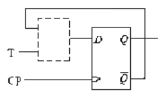

    A. 同或门

    B. 异或门

    C. 与非门

    D. 或非门

    

    
答案：

    A

    

    ***

5. 设 $A_1$、$A_2$、$A_3$ 为三个信号，则逻辑函数（ ）能检测出这三个信号中是否含有奇数个高电平。

    A. $A_1A_2A_3$

    B. $A_1+A_2+A_3$

    C. $A_1\oplus A_2\oplus A_3$

    D. $A_1+A_2A_3$

    

    
答案：

    C

    

    ***

6. 以下说法正确的是（ ）。

    A. TTL 门电路和 CMOS 门电路的输入端都可以悬空

    B. TTL 门电路和 CMOS 门电路的输入端都不可以悬空

    C. TTL 门电路的输入端可以悬空，而 CMOS 门电路的输入端不可以悬空

    D. TTL 门电路的输入端悬空时相当于接高电平，CMOS 门电路的输入端悬空时相当于接低电平

    

    
答案：

    C

    

    ***

7. 除 JK 触发器外，（ ）也可实现翻转功能。

    A. D 触发器

    B. T 触发器

    D. SR 触发器

    C. SR 锁存器

    

    
答案：

    B

    

    ***

8. （ ）是时序逻辑电路的基本逻辑单元。

    A. 计数器

    B. 门电路

    C. 寄存器

    D. 触发器

    

    
答案：

    D

    

    ***

9. 为了能使用数字电路处理模拟信号，须将模拟信号通过（ ）转换为相应的数字信号。

    A. A/D 转换器

    B. D/A 转换器

    C. A/D 或 D/A 转换器

    D. 以上都不行

    

    
答案：

    A

    

    ***

10. 触发器和时序电路中的时钟脉冲一般是由（ ）产生的，它可由 555 定时器构成。

    A. 多谐振荡器

    B. 施密特触发器

    C. 单稳态触发器

    D. 边沿触发器

    

    
答案：

    A

    

***

### 三、简答题（5 分）

用卡诺图化简下面逻辑函数，要求为最简与或式。

:::tip
虽然它听起来像是废话，但是我还是得说：卡诺图肯定是会考的~
:::

$$Y=F(A,B,C)=AB'C'+A'B'+C$$

答案：

$$F=\sum m(0,1,3,4,5,7)$$

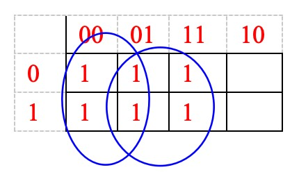

$$F=B'+C$$

***

### 四、分析题（30 分）

1. 分析下图的逻辑功能，写出 $Y_1$、$Y_2$ 的逻辑函数式，列出真值表，指出电路完成什么功能。（10 分）

    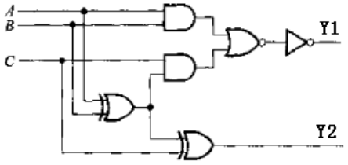

    

    
答案：

    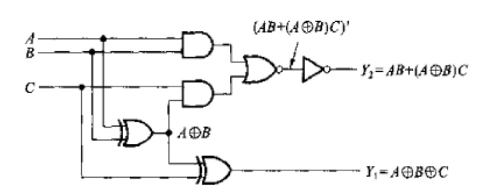

    但是这两个式子所表示的逻辑功能还不够直观，所以我们进一步列出了 $Y_1$ 和 $Y_2$ 的真值表，如表 4-1。从这个真值表上可以看出，当 $A$、$B$、$C$ 中有奇数个 1 时，$Y_1$ 等于 1，否则等于 0；当 $A$、$B$、$C$ 中有两个以上同时为 1 时，$Y_2$ 等于 1，否则等于 0。如果把 $A$、$B$、$C$ 看做是相加的三个二进制数，则 $Y_1$ 就是输出的和，$Y_2$ 就是输出的进位。因此，图 4-1 实际上就是一个全加器。

    | $A$ | $B$ | $C$ | $AB$ | $A\oplus B$ | $(A\oplus B)C$ | $Y_1$ | $Y_2$ |
    | --- | --- | --- | --- | --- | --- | --- | --- |
    | 0 | 0 | 0 | 0 | 0 | 0 | 0 | 0 |
    | 0 | 0 | 1 | 0 | 0 | 0 | 1 | 0 |
    | 0 | 1 | 0 | 0 | 1 | 0 | 1 | 0 |
    | 0 | 1 | 1 | 0 | 1 | 1 | 0 | 1 |
    | 1 | 0 | 0 | 0 | 1 | 0 | 1 | 0 |
    | 1 | 0 | 1 | 0 | 1 | 1 | 0 | 1 |
    | 1 | 1 | 0 | 1 | 0 | 0 | 0 | 1 |
    | 1 | 1 | 1 | 1 | 0 | 0 | 1 | 1 |

    

    ***

2. 设触发器的初始状态为 $Q_1=0$，$Q_2=0$，试画出 $Q_1$、$Q_2$ 端的电压波形。（10 分）

    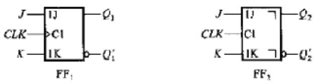

    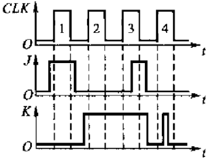

    

    
答案：

    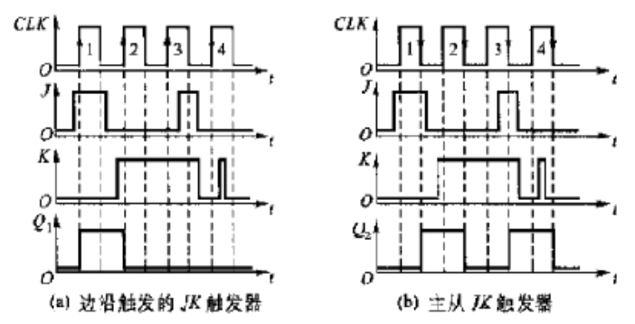

    

    ***

3. 设下图电路状态 $S=Q_1Q_0$，起始时状态为 $Q_1Q_0=00$。要求：（1）写出电路的输出方程、驱动方程及状态方程（35 分）；（2）列出状态转换表（2 分）；（3）画出完整的状态转换图（3 分）；（4）说明该电路的逻辑功能（2 分）。（共 10 分）

    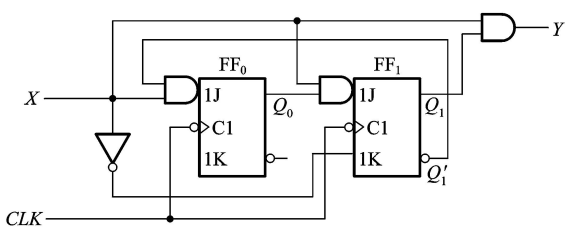

    

    
答案：

    （1）驱动方程：

    $$J_0=XQ_1',\quad K_0=1;\quad J_1=XQ_0,\quad K_1=X'$$

    状态方程：

    $$Q_1^*=XQ_0Q_1'+XQ_1$$

    $$Q_0^*=XQ_1'Q_0'$$

    输出方程：

    $$Y=XQ_1$$

    （2）状态转换表：

    | $X$ | $Q_1$ | $Q_0$ | $J_0$ | $K_0$ | $J_1$ | $K_1$ | $Q_1^*$ | $Q_0^*$ | $Y$ |
    | --- | --- | --- | --- | --- | --- | --- | --- | --- | --- |
    | 0 | 0 | 0 | 0 | 1 | 0 | 1 | 0 | 0 | 0 |
    | 0 | 0 | 1 | 0 | 1 | 0 | 1 | 0 | 0 | 0 |
    | 0 | 1 | 0 | 0 | 1 | 0 | 1 | 0 | 0 | 0 |
    | 0 | 1 | 1 | 0 | 1 | 0 | 1 | 0 | 0 | 0 |
    | 1 | 0 | 0 | 1 | 1 | 0 | 0 | 0 | 1 | 0 |
    | 1 | 0 | 1 | 1 | 1 | 1 | 0 | 1 | 0 | 0 |
    | 1 | 1 | 0 | 0 | 1 | 0 | 0 | 1 | 0 | 1 |
    | 1 | 1 | 1 | 0 | 1 | 1 | 0 | 1 | 0 | 1 |

    （3）状态转换图：

    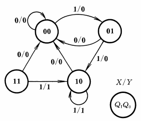

    （4）电路的逻辑功能：在连续输入三个或三个以上“1”时输出为 1，其余情况下输出为 0。

    

***

### 四、设计题（25 分）

1. 四位同步二进制计数器 74LS161 的引脚图和功能表分别如下图所示，$Q_A$ 为最高位，请基于 74LS161 用反馈清零法设计一个模数为 7 的计数器。

    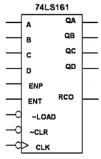

    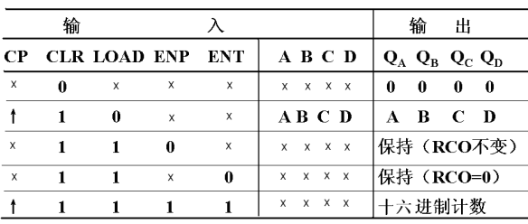

    

    
答案：

    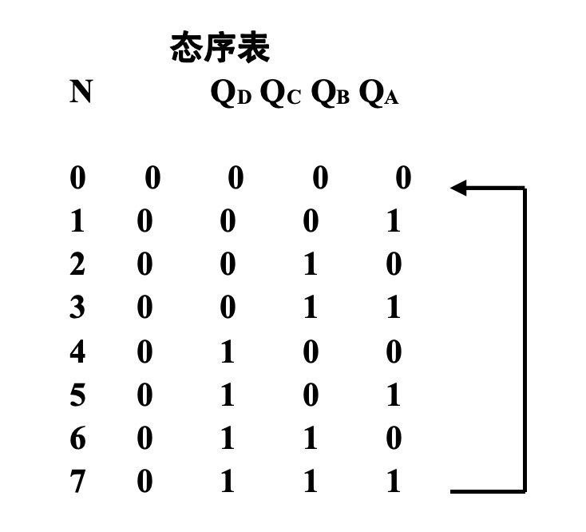

    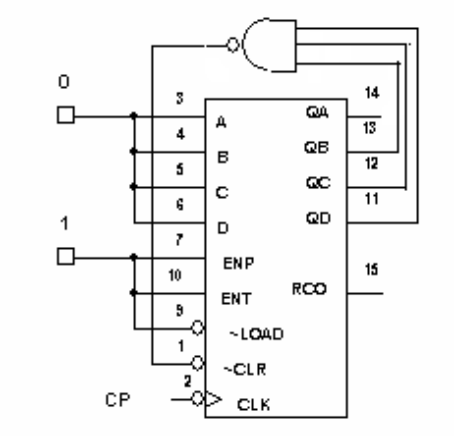

    

    ***

2. 设计用三个开关控制一个电灯的逻辑电路。要求改变任何一个开关的状态都能控制电灯由亮变灭或由灭变亮。试用如下两种中规模组件（逻辑符号及功能表见下表）实现该逻辑电路功能，可辅以适当的门电路。（20 分）

    （1）用四选一数据选择器 74LS153 实现；

    （2）用三－八译码器 74LS138 实现。

    :::tip
    如果我没有记错的话，去年我们也考过这道题 ^-^
    :::

    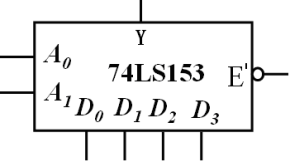

    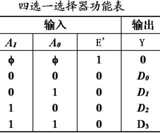

    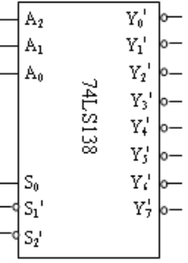

    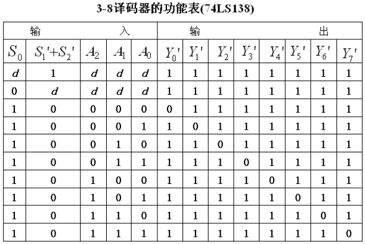

    

    
答案：

    逻辑抽象 2 分，列出真值表 3 分，写出函数表达式 2 分。

    以 $A$、$B$、$C$ 表示三个双位开关，并用 0 和 1 分别表示开关的两个状态。以 $Y$ 表示灯的状态，用 1 表示亮，用 0 表示灭。设 $ABC=000$ 时 $Y=0$，从这个状态开始，单独改变任何一个开关的状态，$Y$ 的状态都要变化。据此列出 $Y$ 与 $A$、$B$、$C$ 之间逻辑关系的真值表。

    | $A$ | $B$ | $C$ | $Y$ |
    | --- | --- | --- | --- |
    | 0 | 0 | 0 | 0 |
    | 0 | 0 | 1 | 1 |
    | 0 | 1 | 0 | 1 |
    | 0 | 1 | 1 | 0 |
    | 1 | 0 | 0 | 1 |
    | 1 | 0 | 1 | 0 |
    | 1 | 1 | 0 | 0 |
    | 1 | 1 | 1 | 1 |

    从真值表写出逻辑式：

    $$Y=A'B'C+A'BC'+AB'C'+ABC$$

    （1）4 选 1 数据选择器输出的逻辑式可写为：

    $$Y=A_1'A_0'D_0+A_1'A_0D_1+A_1A_0'D_2+A_1A_0D_3\qquad(2\text{ 分})$$

    只要令数据选择器的输入为 $A_1=A$，$A_0=B$，$D_0=D_3=C$，$D_1=D_2=C'$，如图所示，则数据选择器的输出即为要求得到的函数。（3 分）

    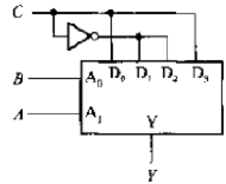

    （2 分）

    （2）

    $$Y(A,B,C)=m_1+m_2+m_4+m_7=(m_1'm_2'm_4'm_7')'=(Y_1'Y_2'Y_4'Y_7')'\qquad(3\text{ 分})$$

    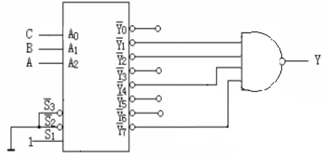

    （3 分）

    

***

## 2009-2010学年上学期期末试卷（B）（含答案）

### 一、填空题（20 分，每空 2 分）

1. $(2010)_D=(\underline{\qquad})_B=(\underline{\qquad})_H=(\underline{\qquad})_{8421BCD}$。

    

    
答案：

    $$(111\ 1101\ 1010)_B=(7DA)_H=(0010\ 0000\ 0001\ 0000)_{8421BCD}$$

    

    ***

2. 仓库门上装了两把暗锁，A、B 两位保管员各管一把锁的钥匙，必须二人同时开锁才能进库。这种逻辑关系为 $\underline{\qquad}$。

    

    
答案：

    与逻辑

    

    ***

3. 逻辑函数式 $F=AB+AC$ 的对偶式为 $\underline{\qquad}$，最小项表达式为 $F=\sum m(\underline{\qquad})$。

    

    
答案：

    $$F^D=(A+B)(A+C)$$

    $$F=\sum m(5,6,7)$$

    

    ***

4. 逻辑函数 $F=ABC+ABD+C'D'+AB'C+A'CD'+AC'D$ 的最简与或式是 $\underline{\qquad}$。

    

    
答案：

    $$A+D'$$

    

    ***

5. 从结构上看，时序逻辑电路的基本单元是 $\underline{\qquad}$。

    

    
答案：

    触发器

    

    ***

6. JK 触发器特征方程为 $\underline{\qquad}$。

    

    
答案：

    $$JQ'+K'Q$$

    

    ***

7. A/D 转换的一般步骤为：取样，保持，$\underline{\qquad}$，编码。

    

    
答案：

    量化

    

***

### 二、选择题（20 分，每题 2 分）

1. 计算机键盘上有 101 个键，若用二进制代码进行编码，至少应为（ ）位。

    A. 6

    B. 7

    C. 8

    D. 51

    

    
答案：

    B

    

    ***

2. 在函数 $F=AB+CD$ 的真值表中，$F=1$ 的状态有（ ）个。

    A. 2

    B. 4

    C. 6

    D. 7

    

    
答案：

    D

    

    ***

3. 为实现“线与”逻辑功能，应选用（ ）。

    A. 与非门

    B. 与门

    C. 集电极开路（OC）门

    D. 三态门

    

    
答案：

    C

    

    ***

4. 图 1 所示逻辑电路为（ ）。

    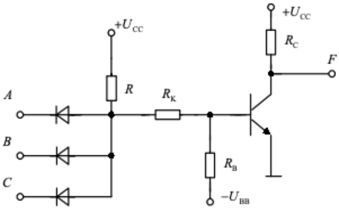

    A. “与非”门

    B. “与”门

    C. “或”门

    D. “或非”门

    

    
答案：

    A

    

    ***

5. 在下列逻辑部件中，属于组合逻辑电路的是（ ）。

    A. 计数器

    B. 数据选择器

    C. 寄存器

    D. 触发器

    

    
答案：

    B

    

    ***

6. 已知某触发器的时钟 CP，异步置 0 端为 $R_D$，异步置 1 端为 $S_D$，控制输入端 $V_i$ 和输出 $Q$ 的波形如图 2 所示，根据波形可判断这个触发器是（ ）。

    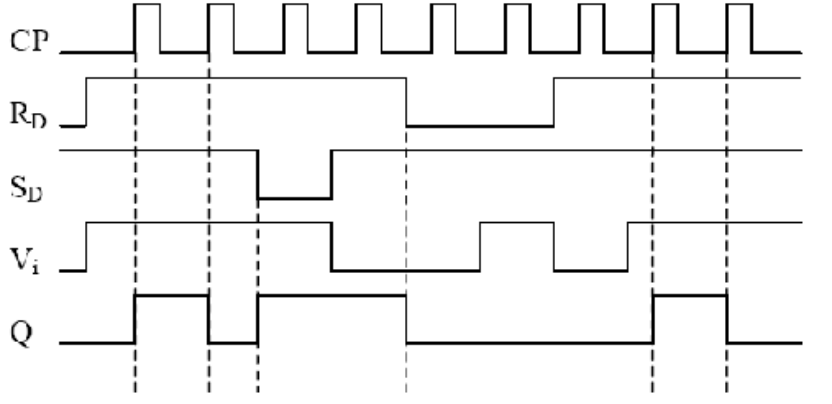

    A. 上升沿 D 触发器

    B. 下降沿 D 触发器

    C. 下降沿 T 触发器

    D. 上升沿 T 触发器

    

    
答案：

    D

    

    ***

7. 寄存器要存放 $n$ 位二进制数码时，需要（ ）个触发器。

    A. $n$

    B. $\log_2n$

    C. $2^n$

    D. $n/2$

    

    
答案：

    A

    

    ***

8. 下面哪种不是施密特触发器的应用（ ）。

    A. 稳定频率脉冲输出

    B. 波形变换

    C. 脉冲整形

    D. 脉冲鉴幅

    

    
答案：

    A

    

    ***

9. 下列哪个不能用 555 电路构成（ ）。

    A. 施密特触发器

    B. 单稳态触发器

    C. 多谐振荡器

    D. 晶体振荡器

    

    
答案：

    D

    

    ***

10. 对电压、频率、电流等模拟量进行数字处理之前，必须将其进行（ ）。

    A. D/A 转换

    B. A/D 转换

    C. 直接输入

    D. 随意

    

    
答案：

    B

    

***

### 三、简答题（15 分）

1. 用公式法化简逻辑函数：$Y=A'BC+(A+B')C$。（7 分）

    

    
答案：

    $$Y=A'BC+(A+B')C=(A'B)C+(A'B)'C=C$$

    

    ***

2. 什么叫组合逻辑电路中的竞争－冒险现象？消除竞争－冒险现象的常用方法有哪些？（8 分）

    

    
答案：

    由于竞争而在电路输出端可能产生尖峰脉冲的现象叫竞争－冒险现象。

    消除竞争－冒险现象的常用方法有：接入滤波电容，引入选通脉冲，修改逻辑设计。

    

***

### 四、分析题（30 分，每题 10 分）

1. 试分析图 3(a) 所示时序电路，画出其状态表和状态图。设电路的初始状态为 0，试画出在图 3(b) 所示波形作用下，$Q$ 和 $Z$ 的波形图。

    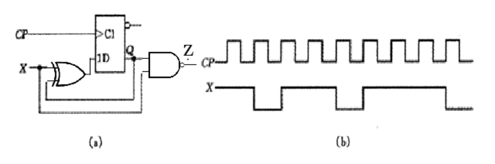

    

    
答案：

    解：由所给电路图可写出该电路的状态方程和输出方程，分别为

    $$Q^{n+1}=X\oplus Q^n$$

    $$Z=\overline{XQ^n}$$

    其状态表如表题解 6.2.1 所示，状态图如图题解 6.2.1a 所示，$Q$ 和 $Z$ 的波形图如图题解 6.2.1b 所示。

    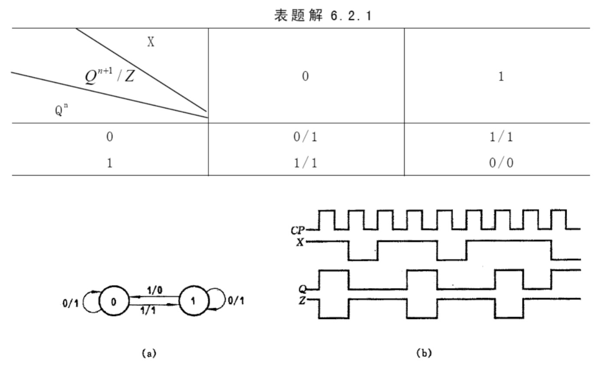

    

    ***

2. 试分析图 4 所示的计数器在 $M=1$ 和 $M=0$ 时各为几进制。同步十进制加法计数器 74160 的功能表如表 1 所示。

    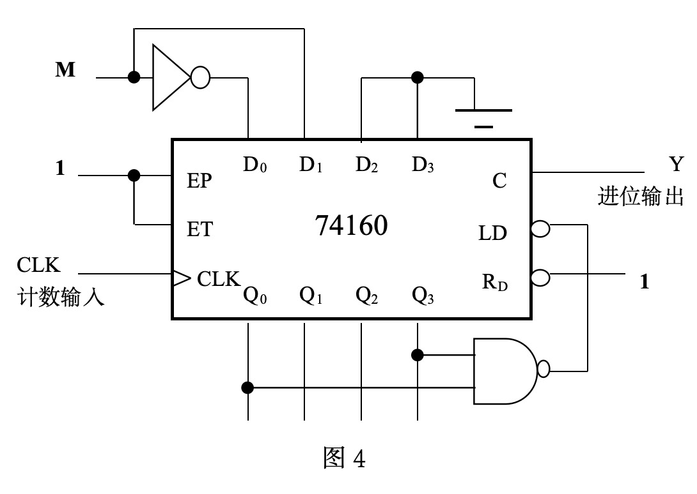

    表 1 同步十进制加法计数器 74160 的功能表

    | CLK | $R_D'$ | $LD'$ | EP | ET | 工作状态 |
    | --- | --- | --- | --- | --- | --- |
    | X | 0 | X | X | X | 置 0（异步） |
    | $\uparrow$ | 1 | 0 | X | X | 预置数（同步） |
    | X | 1 | 1 | 0 | 1 | 保持（包括 C） |
    | X | 1 | 1 | X | 0 | 保持（C=0） |
    | $\uparrow$ | 1 | 1 | 1 | 1 | 计数 |

    

    
答案：

    $M=1$ 时，电路进入 1001（九）以后 $LD'=0$，下一个 CLK 到达时将 $D_3D_2D_1D_0=0010$（二）置入电路中，使 $Q_3Q_2Q_1Q_0=0010$，再从 0010 继续做加法计数，因此电路在 0010 到 1001 这八个状态间循环，形成八进制计数器。

    $M=0$ 时，电路进入 1001（九）以后 $LD'=0$，下一个 CLK 到达时将 $D_3D_2D_1D_0=0001$（一）置入电路中，使 $Q_3Q_2Q_1Q_0=0001$，再从 0001 继续做加法计数，因此电路在 0001 到 1001 这九个状态间循环，形成九进制计数器。

    

    ***

3. 试分析下图（图 5）所示的同步时序电路，写出各触发器的驱动方程，电路的状态方程和输出方程，画出状态转换表和状态转换图。

    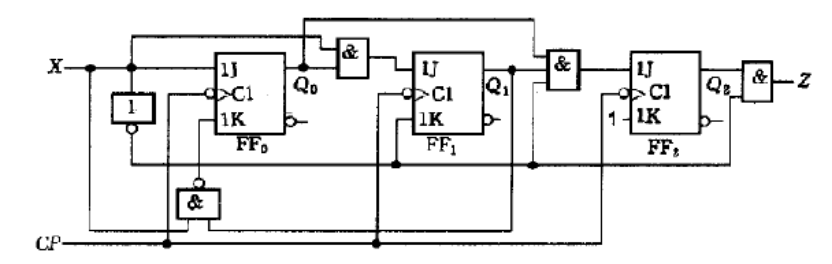

    

    
答案：

    解：由图题 6.2.5 所示电路可写出各触发器的驱动方程分别为

    $$J_0=X,\qquad K_0=\overline{XQ_1^n}$$

    $$J_1=X\overline{Q_0^n},\qquad K_1=\overline X$$

    $$J_2=X\overline{Q_0^n}Q_1^n,\qquad K_2=1$$

    该电路的状态方程为

    $$Q_2^{n+1}=\overline XQ_0^nQ_1^n\overline{Q_2^n}$$

    $$Q_1^{n+1}=X\overline{Q_0^n}Q_1^n+XQ_1^n=X(Q_1^n+\overline{Q_0^n})$$

    $$Q_0^{n+1}=X\overline{Q_0^n}+XQ_1^nQ_0^n=X(Q_1^n+\overline{Q_0^n})$$

    输出方程为

    $$Z=\overline XQ_2^n$$

    根据状态方程和输出方程画出该电路的状态表，如表题解 6.2.5 所示，状态图如图题解 6.2.5 所示。

    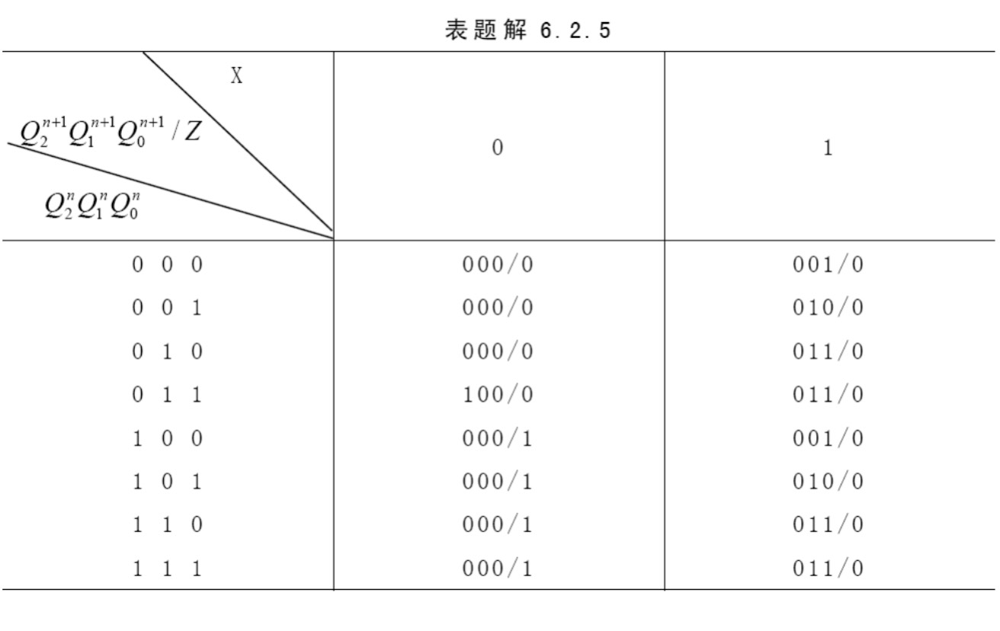

    

***

### 五、设计题（15 分）

设计一个三变量判偶电路，当输入变量 A、B、C 中有偶数个 1 时，其输出为 1；否则输出为 0。请列出真值表并写出逻辑函数，并用 3/8 线译码器 74HC138 和适当门电路实现该电路。其中 74HC138 及其功能表如图 6 所示。

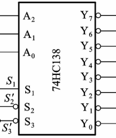

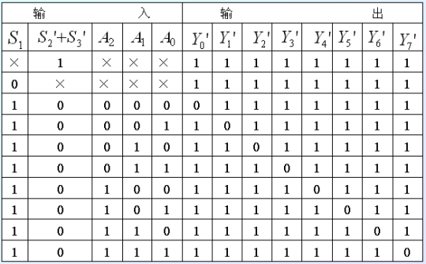

答案：

设输出为 $Y$（1 分），则依据题意可列出真值表（5 分）。

| $A$ | $B$ | $C$ | $Y$ |
| --- | --- | --- | --- |
| 0 | 0 | 0 | 0 |
| 0 | 0 | 1 | 0 |
| 0 | 1 | 0 | 0 |
| 0 | 1 | 1 | 1 |
| 1 | 0 | 0 | 0 |
| 1 | 0 | 1 | 1 |
| 1 | 1 | 0 | 1 |
| 1 | 1 | 1 | 0 |

可知

$$Y=\sum m(3,5,6)=((m_3+m_5+m_6)')'=(m_3'\cdot m_5'\cdot m_6')'\qquad(5\text{ 分})$$

故连线图如下（5 分）：

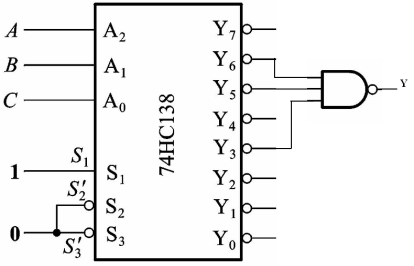

