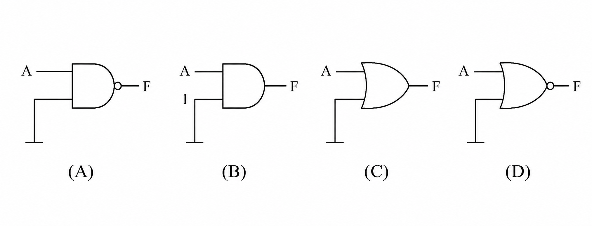
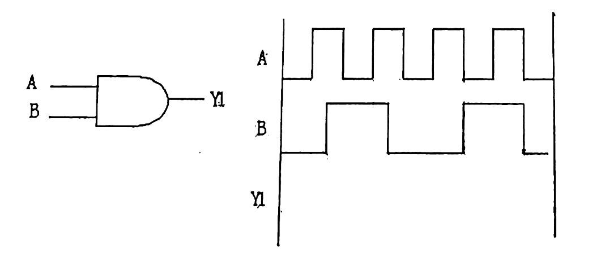
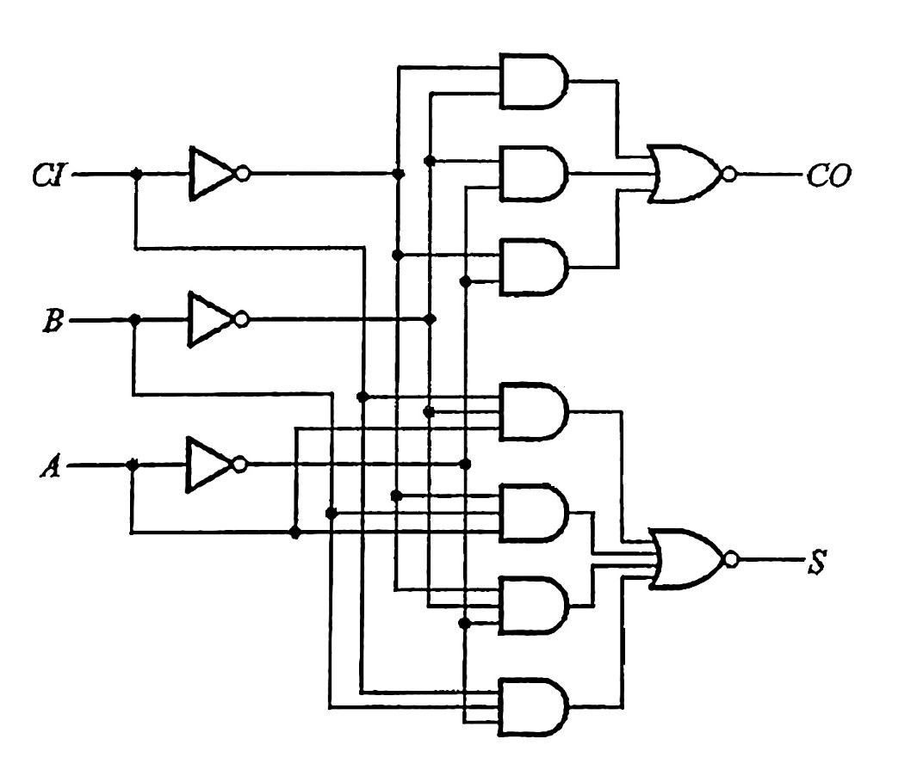

## 2019-2020学年上学期月考试卷

### 一、填空题（40 分，每空 4 分）

1. $(56.625)_{10}=$ $(\underline{\qquad})$2补 $=(\underline{\qquad})_{16}$。

    ***

2. $(-124)_{10}$ 用 8 位二进制表示的原码是 $(\underline{\qquad})$，补码是 $(\underline{\qquad})$，其 8421BCD 码是 $(\underline{\qquad})_{BCD}$。

    ***

3. 设 $[X]$补$=X_0.X_1X_2X_3$，若使带符号小数 $X>1/8$，问 $X_0$、$X_1$、$X_2$、$X_3$ 应满足 $(\underline{\qquad})$ 条件？若使 $X<-1/2$，问 $X_0$、$X_1$、$X_2$、$X_3$ 应满足 $(\underline{\qquad})$ 条件？

    ***

4. $(ABC+A'B'C'+A'BC')'=(\underline{\qquad})$（写出其最小项），若用最大项表示，则为 $(\underline{\qquad})$。

    ***

5. 下图中输出 $F=A'$ 的电路是（ ）。

    

***

### 二、说出电路名称，并画出电路 $Y_1$ 的波形（8 分）

***

### 三、计算题（52 分）

1. （10 分）求下列函数的反函数并化简。

    $$F=B(AD'+C)(C+D)(A+B')$$

    ***

2. （10 分）求下列函数的对偶函数并化简。

    $$F=((AB)'(CB')'(DA'B')')'$$

    ***

3. （20 分）用卡诺图将下列具有约束项的函数化为最简“与或”式。

    （1）$F=\sum m(0,2,3,5,7,8,10,11)+\sum d(14,15)$；

    （2）$F=\sum m(2,3,4,5,6,7,11,14)+\sum d(9,10,13,15)$。

    ***

4. （12 分）试分析下列电路，写出真值表、逻辑表达式，并说明此电路的功能。

    
