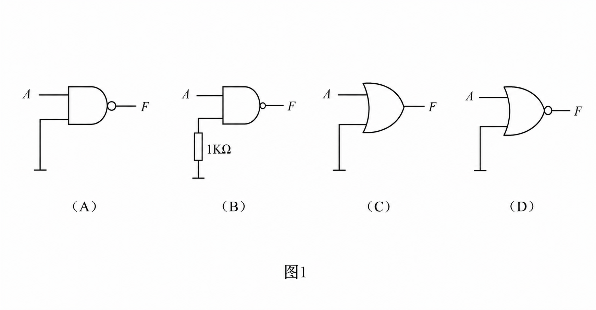
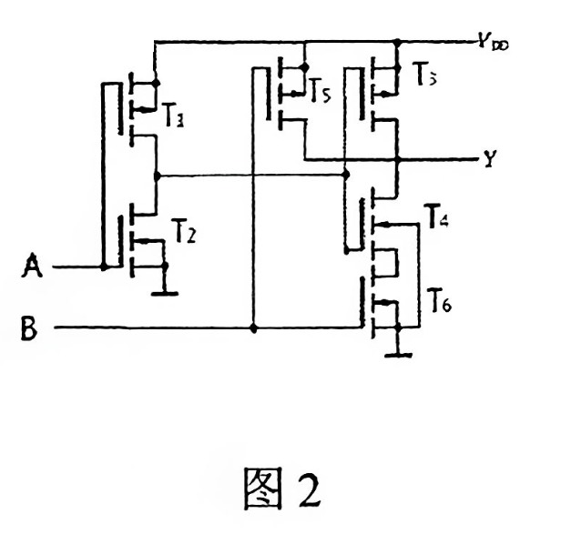
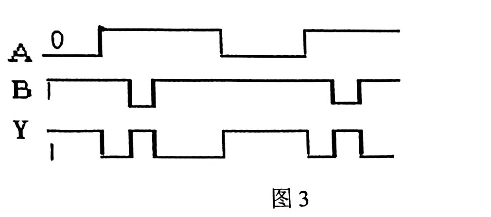
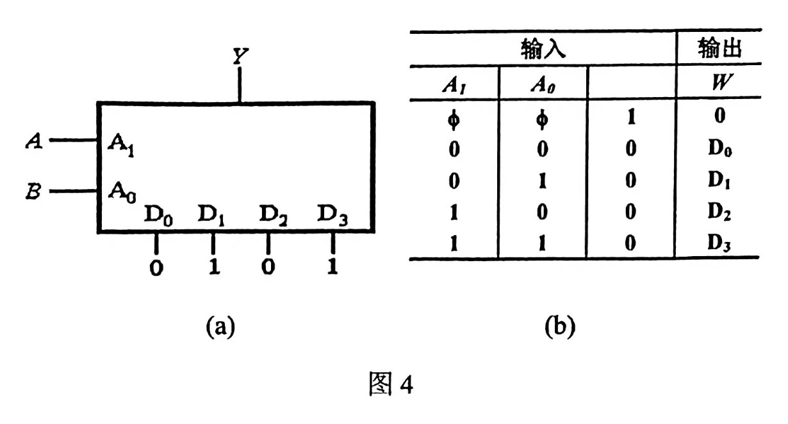
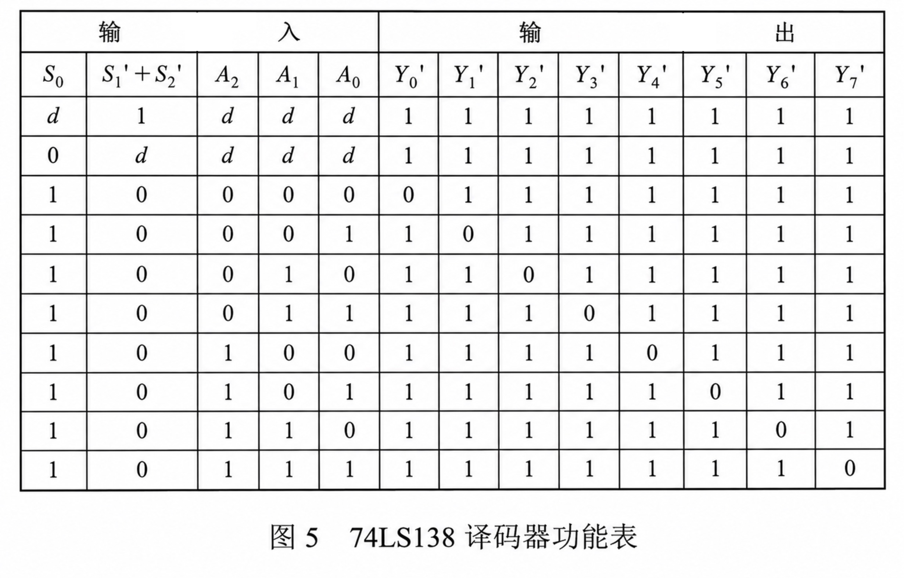
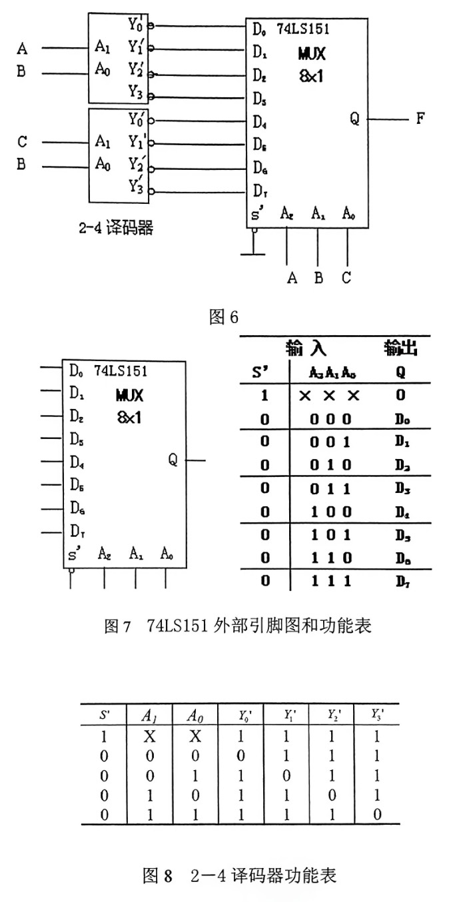

## 2019-2020学年上学期期中试卷

### 一、选择题（20 分，每题 4 分）

1. 与最小项 $ABCD$ 相邻的逻辑最小项有（ ）个。

    A. 4

    B. 5

    C. 6

    D. 7

    ***

2. 关于集电极开路（OC）非门的输出高电平，下列说法正确的是（ ）。

    A. 是固定值

    B. 由电路类型和材料决定

    C. 由上拉电阻和电源电压决定

    D. 高阻态时电压不定

    ***

3. 图 1 中输出 $F=\bar{A}$ 的电路是（ ）。

    

    ***

4. 如图 2 所示的 CMOS 电路的功能是（ ）。

    

    A. $A+B'$

    B. $AB'$

    C. $A'+B$

    D. $A'B$

    ***

5. 对于图 3 所示波形，输出 $Y$ 与输入 $A$、$B$ 所代表的逻辑关系为（ ）。

    

    A. 同或关系

    B. 异或关系

    C. 与关系

    D. 或关系

***

### 二、计算与简答题（40 分）

1. 对于下列表达式（6 分）：

    $$F=ABC'D+A'CD+AC$$

    （1）写出其对偶式 $F^D$；

    （2）写出其反函数 $F'$；

    （3）写出原函数 $F$ 的最小项和最大项。

    ***

2. 用卡诺图化简具有约束项的代数式（8 分）

    $$Y=A'CD'+B'C'D+A'BC'D$$

    其中 $\sum m(0,7,8,10,13,14,15)=0$。

    ***

3. 化简下列代数式（8 分）

    $$F=(B+C+D)(A'+C)(A+B)(A+B+C)$$

    ***

4. 下图为某数据选择器构成的函数发生器如图 4（a）所示，写出其输出逻辑 $Y$（数据选择器的功能表如图 4（b）所示）。（10 分）

    

    ***

5. 证明逻辑函数 $F_1=\sum m(2,4,5,6)$ 同 $F_2=A\bar{B}+B\bar{C}$ 相等。（8 分）

***

### 三、分析与设计题（40 分）

1. （20 分）今有 A、B、C 三人可以进入某秘密档案室，但条件是 A、B、C 三人同时在场或者有两人在场，且其中一人必须是 A，否则报警系统就发出报警信号，试设计：

    （1）列出真值表（4 分）

    （2）写出逻辑表达式并化简（4 分）

    （3）用普通门电路设计并画出逻辑电路图（6 分）

    （4）用 3-8 译码器（功能表如图 5 所示）设计并画出逻辑电路图（6 分）。

    

    ***

2. （20 分）分析图 6 所示电路，写出 $F$ 的逻辑函数式，并列真值表。其中 74LS151 的外部引脚图和功能表如图 7 所示；2-4 译码器功能如图 8 所示。

    
