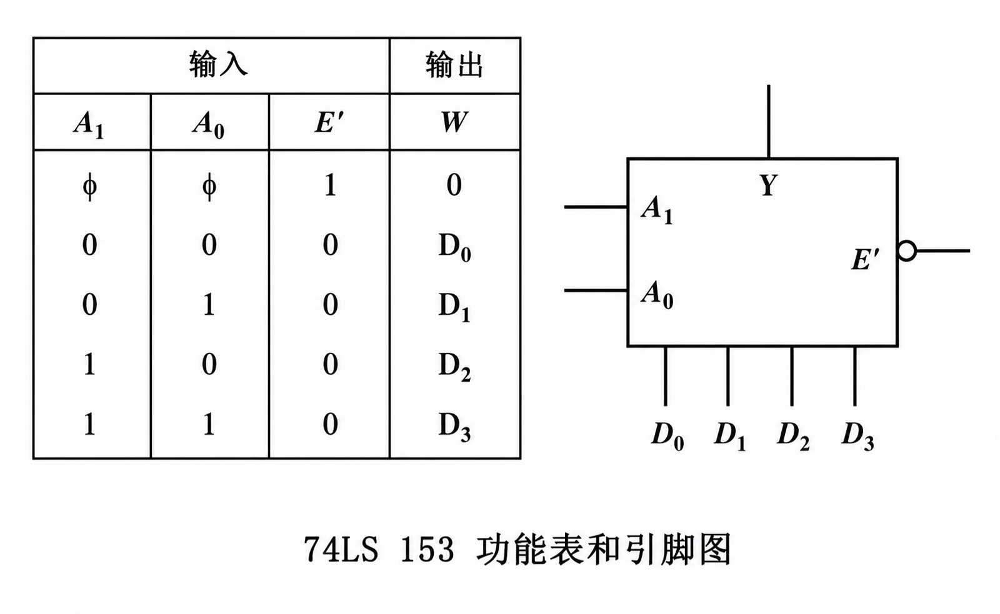
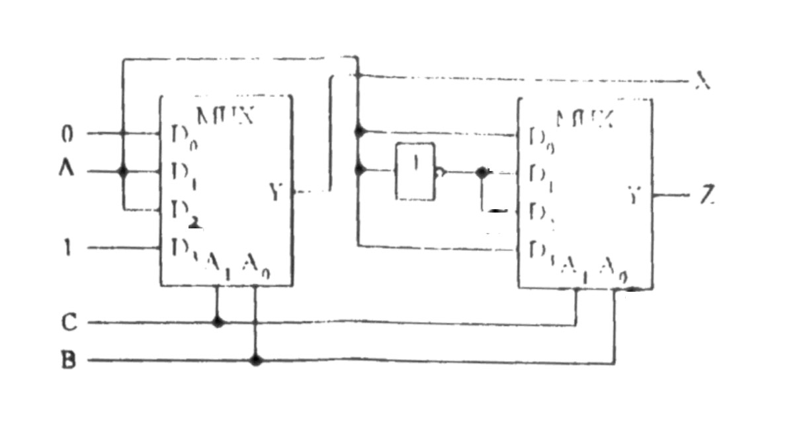
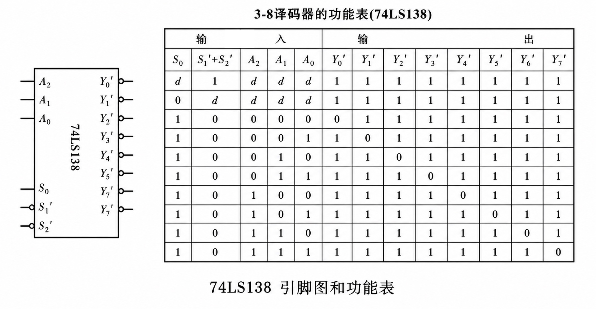
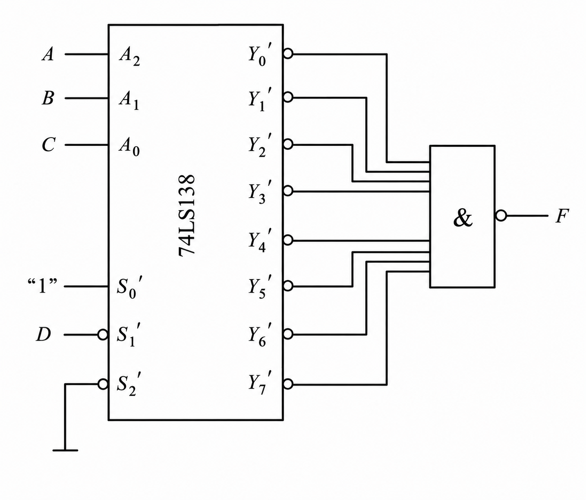

## 2022-2023学年上学期期中试卷

### 一、填空题（20 分，每空 2 分）

1. $(01011001)_{8421BCD}=\underline{\qquad(1)\qquad}_{10}$。

    ***

2. 用四位二进制数码可以编成 $\underline{\qquad(2)\qquad}$ 个不同的代码，若编制 BCD 码，必须去掉 $\underline{\qquad(3)\qquad}$ 个代码。

    ***

3. 已知一个数 $A$，其六位原码表示为 $01\ 1010$，则 $2A$ 对应的 8 位原码形式为 $\underline{\qquad(4)\qquad}$，$-A$ 的 8 位补码表示为 $\underline{\qquad(5)\qquad}$。

    ***

4. 二进制数 $A$、$B$ 均为正数（一位符号位，七位数字），若 $A-B$ 的差为 $10001001$ 二进制，则 $A\ \underline{\qquad(6)\qquad}\ B$（大于、小于、等于）。

    ***

5. 四选一数据选择器可以从 $\underline{\qquad(7)\qquad}$ 路数据中选择出 $\underline{\qquad(8)\qquad}$ 路进行传输。

    ***

6. 若干个三态门的输出端连接在同一条总线时，它们应该按 $\underline{\qquad(9)\qquad}$（同时、分时）方式工作，可以通过三态门的 $\underline{\qquad(10)\qquad}$ 端控制实现。

***

### 二、选择题（10 分，每题 2 分）

1. 以下说法正确的是（ ）。

    A. 二进制编码不只能用于表示数字

    B. 逻辑变量的取值可以是任意种

    C. 二进制数 $1001$ 和二进制代码 $1001$ 都表示十进制数 $9$

    D. 组合逻辑电路中可以存在反馈回路

    ***

2. 下列各种门电路中可以将输出端并联使用（输入端的状态不一定相同）的是（ ）。

    （1）具有推拉式输出级的 TTL 电路；

    （2）TTL 电路的 OC 门；

    （3）TTL 电路的三态输出门；

    （4）互补输出结构的 CMOS 门；

    A. （1）（2）

    B. （2）（3）

    C. （3）（4）

    D. （4）（1）

    ***

3. 欲使一路数据分配到多路装置应选用（ ）。

    A. 编码器

    B. 译码器

    C. 数据选择器

    D. 数据比较器

    ***

4. 逻辑函数 $F_1(A,B,C,D)=\sum m(2,3,5,8,11,13)$ 和 $F_2(A,B,C,D)=\prod M(2,4,7,10,12,13)$ 之间满足（ ）关系。

    A. 对偶

    B. 相等

    C. 代入

    D. 反演

    ***

5. 对于一个逻辑函数表达式，（ ）是唯一的。

    A. 最简“与-或”表达式

    B. 两级“与非”表达式

    C. 异或构成的表达式

    D. 最大项构成的表达式

***

### 三、分析设计题（70 分）

1. （8 分）假设可用的只有异或门，试实现以下功能：

    （1）对变量 $A$ 实现清零运算

    （2）对变量 $A$ 实现置 1 运算

    （3）对变量 $A$ 实现求反运算

    （4）判断输入 $A$、$B$、$C$ 中有奇数个 1

    ***

2. （15 分）已知逻辑函数

    $$F(A,B,C,D)=A'B'C'+A'BC'D+AB'C'+ABD'+B'CD'$$

    （1）请用卡诺图法化简为最简与或式（6 分）

    （2）若使用与非门进行实现，请画出对应的电路图（6 分）。

    （3）写出 $F$ 的反函数的最小项表示式；（3 分）

    ***

3. （10 分）试用两个 74LS153 构成一个 16 选 1 数据选择器。

    

    ***

4. （10 分）由两个 74LS153 构成的电路图如下图所示，已知两个 74LS153 的 $E'$ 端均接 0，试分析该电路实现的功能。

    

    ***

5. （15 分）用一片 74LS138 译码器及门电路实现一个可控一位全加器电路。当 $X=0$ 时，全加器功能被禁止；当 $X=1$ 时，作全加运算。

    

    ***

6. （12 分）已知下图为一片 74LS138 译码器和与非门构成一个的组合逻辑电路，试分析其实现的功能。

    
