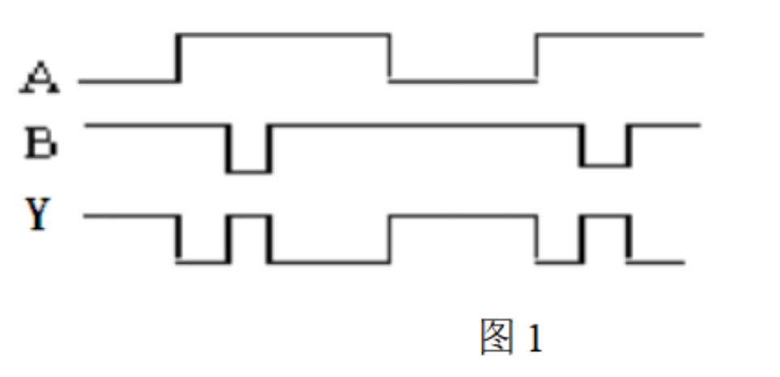
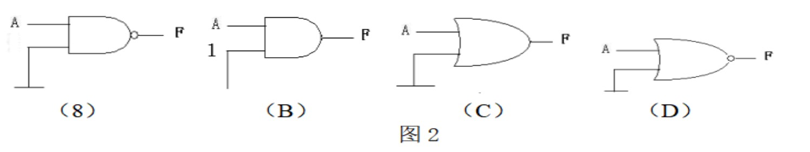
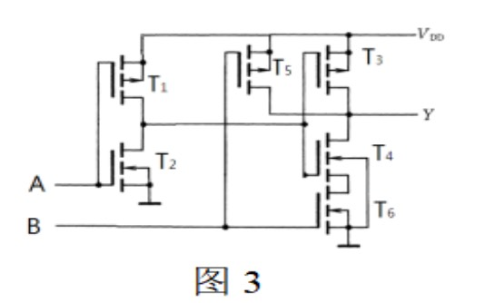
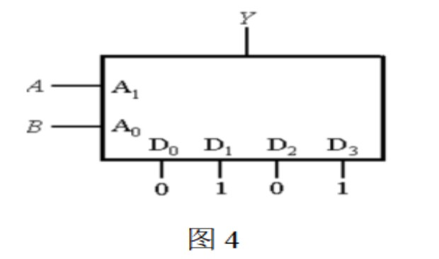
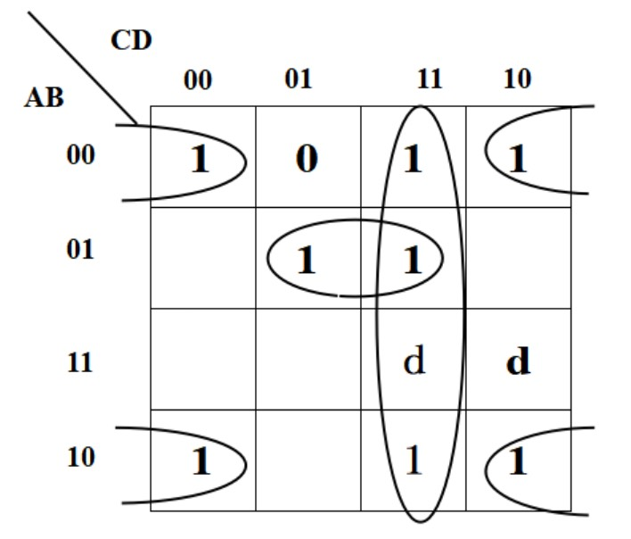
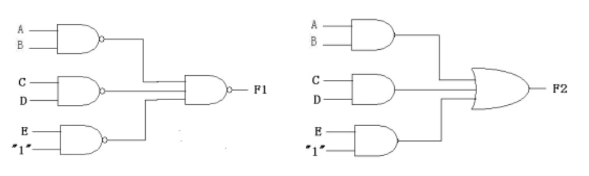
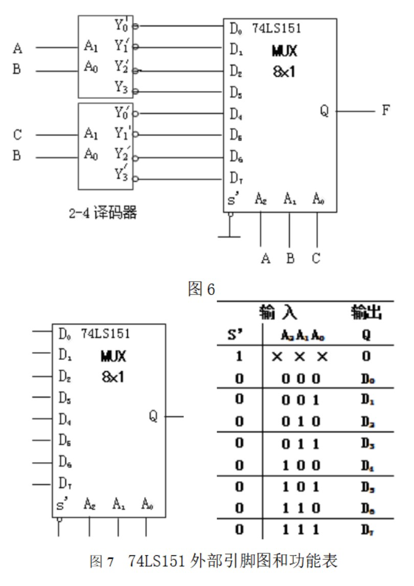
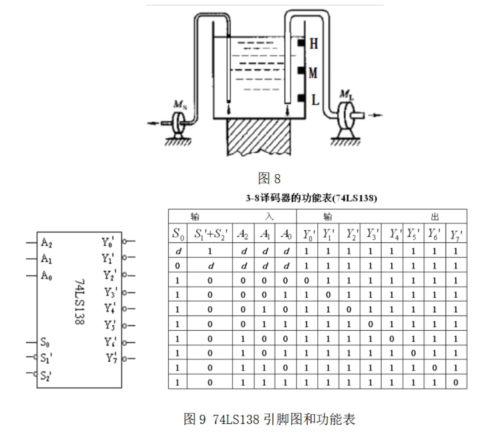
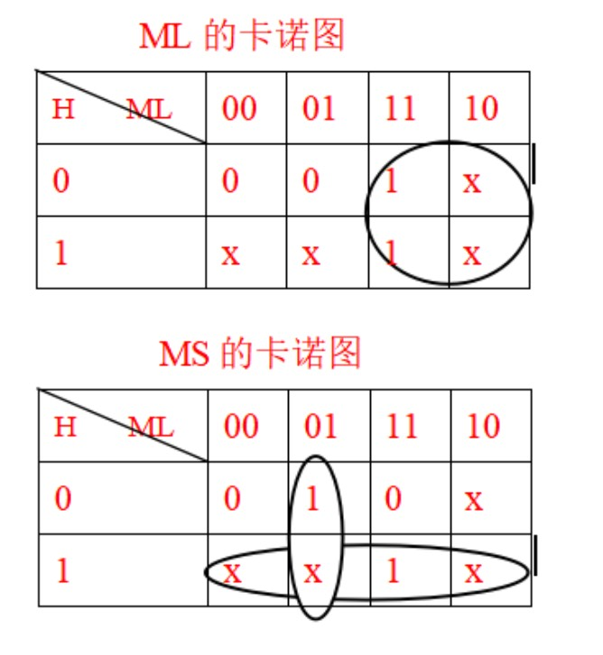
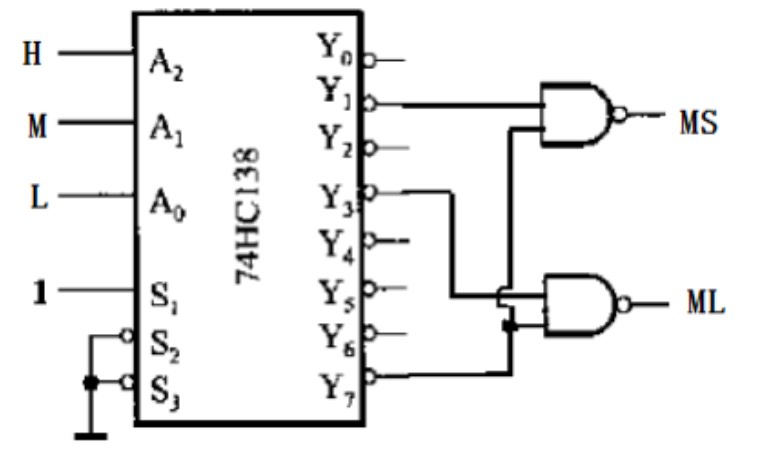

## 2024-2025学年上学期期中试卷（含答案）

### 一、填空题（20 分，每空 2 分）

1. $(-126.125)_{10}=(\underline{\qquad})_2=(\underline{\qquad})_{16}=(\underline{\qquad})_{BCD}$。

2. $(-56)_{10}$ 用 8 位二进制表示的原码是 $\underline{\qquad}$，补码是 $\underline{\qquad}$。

3. 非门可用与非门代替，与非门 $\underline{\qquad}$（能，不能）用非门代替。

4. 数字电路中三极管工作在截止或 $\underline{\qquad}$ 状态。

5. OC 门称为集电极开路门，多个 OC 门输出端并联到一起可实现 $\underline{\qquad}$ 功能。

6. 74LS00 是 $\underline{\qquad}$ 类型的门电路，CC4069 是 $\underline{\qquad}$ 类型的门电路。（填 TTL 或 CMOS）

答案：

1. $(1111\ 1110.0010)_2$；$(FE.2)_{16}$；$(1\ 0001\ 0010\ 0110.0001\ 0010\ 0101)_{BCD}$
2. 原码：$10111000$；补码：$11001000$
3. 能；不能
4. 饱和
5. 线与
6. TTL；CMOS

常见错误：二进制和十六进制转换时漏写符号位；BCD 码容易写错；原码转补码取反时符号位不变；OC 门常被误填为“与门”或“与非门”。

***

### 二、选择题（16 分，每题 2 分）

1. 欲对 80 个图书馆电脑以二进制编码表示，最少需要二进制的位数是（ ）。

    A. 5  
    B. 6  
    C. 7  
    D. 10

    

    
答案：

    C

    

    ***

2. 数字电路中除具有高电平、低电平两种状态外，还具有第三态即（ ）。

    A. 高阻态  
    B. 低阻态  
    C. 1 态  
    D. 混合态

    

    
答案：

    A

    

    ***

3. 与最小项 $ABCD$ 逻辑相邻的最小项有（ ）个。

    A. 4  
    B. 5  
    C. 6  
    D. 7

    

    
答案：

    A

    

    ***

4. 对于图 1 所示波形，所代表的逻辑关系为（ ）。

    

    A. 同或关系  
    B. 异或关系  
    C. 与关系  
    D. 与或关系

    

    
答案：

    B

    

    ***

5. 图 2 中输出 $F=A'$ 的电路是（ ）。

    

    

    
答案：

    D

    

    ***

6. 如右图（图 3）所示的 CMOS 电路的功能是（ ）。

    

    A. $A+B'$  
    B. $AB'$  
    C. $A'+B$  
    D. $A'B$

    

    
答案：

    A

    

    ***

7. 图 4 为某数据选择器构成的函数发生器，其输出逻辑 $Y$ 等于（ ）。

    

    A. $Y=A+B$  
    B. $Y=B$  
    C. $Y=AB$  
    D. $Y=A$

    

    
答案：

    B

    

    ***

8. 逻辑函数 $F_1=\sum m(2,4,5,6)$ 同 $F_2=A\overline{B}+B\overline{C}$ 之间关系为（ ）。

    A. 相等  
    B. 取反  
    C. 对偶  
    D. 不确定

    

    
答案：

    A

    

***

### 三、计算与简答题（24 分，每题 8 分）

1. 写出下列函数的对偶函数，并化简。

    $$
    F=((AB)'(CB')'(DA'B')')'
    $$

    

    
答案：

    对偶函数为

    $$
    \begin{aligned}
    F^*
    &= \left((A+B)' + (C+B')' + (D+A'+B')'\right)' \\
    &= (A+B)(C+\overline{B})(D+\overline{A}+\overline{B}).
    \end{aligned}
    $$

    化简得

    $$
    \begin{aligned}
    F^*
    &= ACD+A\overline{B}C+\overline{A}BD+A\overline{B}+BCD+\overline{A}BC \\
    &= ACD+A\overline{B}+BCD+\overline{A}BC \\
    &= A\overline{B}+BCD+\overline{A}BC.
    \end{aligned}
    $$

    

    ***

2. 用卡诺图将下列具有约束项的函数化为最简“与或”式。

    $$
    F(A,B,C,D)=\sum m(0,2,3,5,7,8,10,11)+\sum d(14,15)
    $$

    

    
答案：

    卡诺图化简参考：

    

    $$
    F=\overline{B}\overline{D}+CD+\overline{A}BD
    $$

    

    ***

3. 逻辑函数 $F_1$、$F_2$ 的逻辑图如图 5 所示，试证明 $F_1=F_2$。

    

    

    
答案：

    由图可得：

    $$
    F_1=((AB)'(CD)'E')'=AB+CD+E=F_2
    $$

    

***

### 四、分析与设计题（40 分）

1. （20 分）分析图 6 所示电路，写出 $F$ 的逻辑函数式，并列真值表。其中 74LS151 的外部引脚图和功能表如图 7 所示；2-4 译码器功能类似于图 9 中 3-8 译码器功能。

    

    

    
答案：

    图 6 电路分析时需注意：2-4 译码器输出端有圆圈，输出有效时为 0。

    $$
    \begin{aligned}
    D_0&=(A'B')', & D_1&=(A'B)', & D_2&=(AB')', & D_3&=(AB)',\\
    D_4&=(C'B')', & D_5&=(C'B)', & D_6&=(CB')', & D_7&=(CB)'.
    \end{aligned}
    $$

    由 74LS151 功能表可得

    $$
    \begin{aligned}
    F
    &=(A'B'C')D_0+(A'B'C)D_1+(A'BC')D_2+(AB'C')D_4\\
    &\quad +(AB'C)D_5+(ABC')D_6+(ABC)D_7\\
    &=A'B'C+A'BC'+A'BC+AB'C+ABC'.
    \end{aligned}
    $$

    真值表为：

    | $A$ | $B$ | $C$ | $F$ |
    | --- | --- | --- | --- |
    | 0 | 0 | 0 | 0 |
    | 0 | 0 | 1 | 1 |
    | 0 | 1 | 0 | 1 |
    | 0 | 1 | 1 | 1 |
    | 1 | 0 | 0 | 0 |
    | 1 | 0 | 1 | 1 |
    | 1 | 1 | 0 | 1 |
    | 1 | 1 | 1 | 0 |

    $$
    F=A'B'C+A'BC'+A'BC+AB'C+ABC'
    $$

    常见错误：没有读懂图，导致真值表和逻辑表达式写错。

    

    ***

2. （20 分）某水仓装有大小两台水泵排水，如图 8 所示。试设计一个水泵启动、停止逻辑控制电路。具体要求是：当水位在 H 以上时，大小水泵 $M_L$ 和 $M_S$ 同时开动；水位在 H、M 之间时，只开大泵 $M_L$；水位在 M、L 之间时，只开小泵 $M_S$；水位在 L 以下时，停止排水。

    要求：

    1. 用基本逻辑门电路实现。
    2. 用 74LS138 和与非门电路实现。已知 74LS138 的功能表和管脚图如图 9 所示。

    

    

    
答案：

    设 $H,M,L$ 为 1 表示水位在对应传感器以上，为 0 表示水位在对应传感器以下；$M_L,M_S$ 表示大小水泵，1 表示水泵开，0 表示水泵关。

    真值表为：

    | $H$ | $M$ | $L$ | $M_L$ | $M_S$ |
    | --- | --- | --- | --- | --- |
    | 0 | 0 | 0 | 0 | 0 |
    | 0 | 0 | 1 | 0 | 1 |
    | 0 | 1 | 0 | x | x |
    | 0 | 1 | 1 | 1 | 0 |
    | 1 | 0 | 0 | x | x |
    | 1 | 0 | 1 | x | x |
    | 1 | 1 | 0 | x | x |
    | 1 | 1 | 1 | 1 | 1 |

    基本门电路实现的卡诺图：

    

    由卡诺图得：

    $$
    M_L=M,\qquad M_S=H+M'L.
    $$

    用 74LS138 和与非门实现：

    

    $$
    M_L=m_3+m_7=(Y_3Y_7)',\qquad M_S=m_1+m_7=(Y_1Y_7)'
    $$

    

