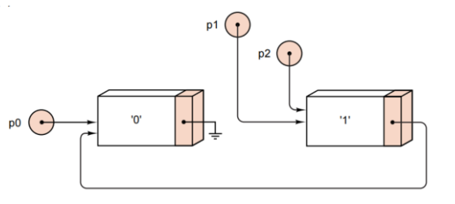

## 2025-2026学年下学期期中试卷——王丽萍

### 一、选择题（共 10 小题，每小题 2 分，共 20 分）

1. 栈是一种特殊的线性表，其主要特点是

    A. 先进先出（FIFO）  
    B. 先进后出（LIFO）  
    C. 可以在任意位置插入和删除  
    D. 可以随机访问任一元素

    <details>
    <summary>解：</summary>

    B

    </details>

    ***

2. 设栈 S 和队列 Q 的初始状态均为空，元素 a、b、c、d、e、f 依次通过栈 S，一个元素出栈后即进入队列 Q。若出队的顺序为 b、d、c、f、e、a，则栈 S 的容量至少应为

    A. 2  
    B. 3  
    C. 4  
    D. 6

    <details>
    <summary>解：</summary>

    B

    模拟过程：a入、b入、b出、c入、d入、d出、c出、e入、f入、f出、e出、a出。过程中栈内最多有3个元素（a,c,d 或 a,e,f），故容量至少为3。

    </details>

    ***

3. 循环队列存储在一维数组 $A[0..m-1]$ 中，入队操作时尾指针的变化应为

    A. $\text{rear} = \text{rear} + 1$  
    B. $\text{rear} = (\text{rear} + 1) \bmod (m-1)$  
    C. $\text{rear} = (\text{rear} + 1) \bmod m$  
    D. $\text{rear} = (\text{rear} + 1) \bmod (m+1)$

    <details>
    <summary>解：</summary>

    C

    </details>

    ***

4. 递归算法必须具备的两个基本要素是

    A. 循环语句与判断语句  
    B. 基准情形（终止条件）与递归情形  
    C. 全局变量与局部变量  
    D. 形参与实参

    <details>
    <summary>解：</summary>

    B

    </details>

    ***

5. 在带头结点的单链表中，指针 p 指向某结点，若要在 p 所指结点之后插入 s 所指结点，正确的操作是

    A. `p->next = s; s->next = p->next;`  
    B. `s->next = p->next; p->next = s;`  
    C. `s->next = p; p->next = s;`  
    D. `p->next = s->next; s->next = p;`

    <details>
    <summary>解：</summary>

    B

    先让 s 指向 p 的后继，再让 p 指向 s，避免断链。

    </details>

    ***

6. 设栈 S 的初始状态为空，元素 a、b、c、d、e 按此顺序进栈，进栈过程中允许出栈，则下列序列中不可能是出栈序列的是

    A. b、c、d、e、a  
    B. d、c、e、b、a  
    C. e、c、b、a、d  
    D. a、c、b、e、d

    <details>
    <summary>解：</summary>

    C

    e 第一个出栈说明 a,b,c,d 均已入栈，此时栈内自底向上为 a,b,c,d，出栈顺序只能为 d,c,b,a，不可能出现 c,b,a,d。

    </details>

    ***

7. 利用递归算法求解 n 阶汉诺塔（Hanoi）问题时，所需移动盘子总次数为

    A. $n$  
    B. $2n$  
    C. $2^n - 1$  
    D. $n^2$

    <details>
    <summary>解：</summary>

    C

    </details>

    ***

8. 下列关于栈与队列的叙述中，错误的是

    A. 栈和队列都是操作受限的线性表  
    B. 栈只允许在栈顶进行插入和删除  
    C. 队列允许在队头插入、在队尾删除  
    D. 出栈和出队的时间复杂度均为 $O(1)$

    <details>
    <summary>解：</summary>

    C

    队列只能在队头删除、在队尾插入。

    </details>

    ***

9. 下列应用中，通常需要使用"队列"结构来实现的是

    A. 表达式求值  
    B. 函数调用时的参数传递  
    C. 操作系统中的作业调度  
    D. 判断回文字符串

    <details>
    <summary>解：</summary>

    C

    作业调度需要先进先出（FIFO）的队列结构。

    </details>

    ***

10. 下列关于回溯法（Backtracking）的叙述中，错误的是

    A. 回溯法本质上是对解空间树的一种深度优先搜索，若当前分支不满足约束时返回上一层尝试其他选择。  
    B. 回溯法的递归实现依赖系统栈保存各层的状态信息，因此也可以用显式栈改写为非递归形式。  
    C. 通过设置合理的剪枝条件提前排除不可行或非最优的分支，可有效缩小实际搜索的状态空间。  
    D. 回溯法的时间复杂度与问题规模之间总呈多项式关系，因此特别适合求解大规模 NP 难组合优化问题。

    <details>
    <summary>解：</summary>

    D

    回溯法的时间复杂度通常是指数级的，不是多项式关系。

    </details>

***

### 二、填空题（共 5 小题，每小题 3 分，共 15 分）

1. 递归函数定义如下，请写出 `Func(10, 13)` 的结果：________.

    ``` cpp
    int Func(/* in */ int i, /* in */ int j) {
        if (i < 8)
            if (j < 8)
                return i + j;
            else
                return j + Func(i, j - 3);
        else
            return i + Func(i - 2, j);
    }
    ```

    <details>
    <summary>解：</summary>

    54

    </details>

    ***

2. 已知中序表达式为 $((3+2)*5-4)/7$，则其后序表达式为 ________.

    <details>
    <summary>解：</summary>

    $3\;2 + 5 * 4 - 7\;/\;$（即 `32+5*4-7/`）

    </details>

    ***

3. 对于线性表的链式存储，若要访问指定位置的元素，其复杂度是 ________.

    <details>
    <summary>解：</summary>

    $O(n)$

    </details>

    ***

4. 在用循环队列表示任务调度时，假设有一个容量为 12 的循环队列下标为 0~11，当前 $\text{front} = 10$，$\text{rear} = 4$。如果插入 5 个新任务并删除 4 个任务后，front 和 rear 的值分别是 ________.

    <details>
    <summary>解：</summary>

    $\text{front} = 2,\; \text{rear} = 9$

    </details>

    ***

5. 利用栈对后序表达式 $5\;3\;2\;*\;+\;8\;4\;/\;-$ 求值，栈在处理完所有记号后，栈顶元素（即最终结果）为 ________.

    <details>
    <summary>解：</summary>

    9

    </details>

***

### 三、简答题（共 4 小题，每小题 5 分，共 20 分）

1. 递归调用函数的定义如下，请画出 $f(7)$ 的递归调用树以及运行结果。

    ``` cpp
    int f(int n) {
        if (n <= 1) return n;
        if (n % 2 == 0) return n + f(n / 2);
        return f((n + 1) / 2) + f((n -1 ) / 2);
    }
    ```

    <details>
    <summary>解：</summary>

    $f(7)$ 的递归调用树（类斐波那契结构），运行结果为 21。

    ``` mermaid
    graph TD
    %% 定义节点样式，使其看起来更像图中的方框

    %% 根节点
    Root["F(7) = 11"] -->|"F(4) = 7"| Left1["F(4)"]
    Root -->|"F(3) = 4"| Right1["F(3)"]

    %% 左侧分支 F(4)
    Left1 -->|"F(2) = 3"| Left2["4+F(2)"]
    Left2 -->|"F(1) = -1"| Left3["2+F(1)"]
    Left3 --> Left4["F(1) = 1"]

    %% 右侧分支 F(3)
    Right1 -->|"F(2) = 3"| Right2L["F(2)"]
    Right1 --> Right2R["F(1) = 1"]
    
    %% 右侧 F(2) 的子节点
    Right2L -->|"F(1) = -1"| Right3["2+F(1)"]
    Right3 --> Right4["F(1) = 1"]
    ```

    </details>

    ***

2. 请设计算法，利用一个栈和一个队列，判断给定的一个字符串是否为回文串（正读与反读相同，如 `"level"`、`"abcba"`）。（只用写出算法过程，不用写代码）

    <details>
    <summary>解：</summary>

    1. 初始化一个空栈 S 和一个空队列 Q；
    2. 顺序扫描字符串中的每一个字符 ch：同时执行 `S.push(ch)` 和 `Q.append(ch)`；
    3. 扫描结束后，栈顶到栈底的顺序即字符串的逆序，队头到队尾的顺序即字符串的正序；
    4. 循环：当 S 和 Q 都不为空时，取出栈顶元素 a 与队头元素 b 进行比较：
       - 若 $a \ne b$，则该串不是回文串，算法结束；
       - 若 $a = b$，则执行 `S.pop()` 与 `Q.serve()`，继续比较下一对；
    5. 若 S 与 Q 均被正常清空（所有对应字符都相等），则该串是回文串。

    </details>

    ***

3. 请写出创建以下链式结构的代码。

    

    <details>
    <summary>解：</summary>

    ```cpp
    Node* p0 = new Node(0);
    Node* p1 = new Node(1, p0);
    Node* p2 = p1;
    ```

    </details>

    ***

4. `String` 为我们书本自定义的类型，请完成针对其的 `strcpy` 函数。

    ```cpp
    void strcpy(String &copy, const String &original);
    /* post condition: copy the content of original to the string copy. */
    ```

    <details>
    <summary>解：</summary>

    ```cpp
    void strcpy(String &copy, const String &original) {
        const char *coriginal = original.c_str();
        int n = strlen(coriginal);
        char *ccopy = new char[n + 1];
        strcpy(ccopy, coriginal);
        copy = ccopy;
        delete[] ccopy;
    }
    ```

    </details>

***

### 四、程序填空题（共 5 空，每空 3 分，共 15 分）

1. 请阅读代码，并补充空白处内容。

    ```cpp
    Error_code Stack::pop()
    /* Post: The top of the Stack is removed. If the Stack
       is empty the method returns underflow; otherwise it returns success. */
    {
        Node *old_top = top_node;
        if (【1】) return underflow;
        top_node = 【2】;
        【3】
        return success;
    }
    ```

    <details>
    <summary>解：</summary>

    【1】`top_node == NULL` 或 `old_top == NULL`

    【2】`old_top->next` 或 `top_node->next`

    【3】`delete old_top;`

    </details>

    ***

2. 请阅读代码，并补充空白处内容。

    ```cpp
    struct Node {
        Node_entry entry;
        Node *next;
        Node *back;
        Node();
        Node(Node_entry item, Node *link_back = NULL, Node *link_next = NULL);
    };

    void List::set_position(int position) const
    /* Pre:  position is a valid position in the List : 0 <= position < count.
       Post: The current Node pointer references the Node at position. */
    {
        if (current_position <= position)
            for ( ; current_position != position; current_position++)
                【4】;
        else
            for ( ; current_position != position; 【5】)
                current = current->back;
    }
    ```

    <details>
    <summary>解：</summary>

    【4】`current = current->next`

    【5】`current_position--`

    </details>

***

### 五、算法与编程题（共 2 小题，每小题 10 分，共 20 分）

1. （10 分）设有一个表头指针为 h 的单链表。试设计一个算法，通过遍历一趟链表，将链表中所有结点的链接方向逆转。要求逆转结果链表的表头指针 h 指向原链表的最后一个结点。请完成以下 `inverse` 函数。

    以下定义供参考：

    ```cpp
    typedef char datatype;

    struct node {
        datatype data;
        node *next;
    };

    void Inverse(struct Node *& head);
    ```

    <details>
    <summary>解：</summary>

    ```cpp
    void Inverse(struct Node *& head) {
        Node *h = head;
        Node *pre, *tmp;
        if (h == NULL) return;
        pre = NULL;
        tmp = h->next;
        while (tmp != NULL) {
            h->next = pre;
            pre = h;
            h = tmp;
            tmp = tmp->next;
        }
        h->next = pre;
        head = h;
    }
    ```

    算法思想：使用三个指针 pre、h、tmp，遍历链表时将每个结点的 next 指针反转指向前驱结点，最后将 head 指向原链表的尾结点。

    </details>

    ***

2. （10 分）如果环中任意相邻两个数的和为素数则称之为素数环，现输入整数 $n$（$n < 15$），请编写程序输出由整数 $1 \sim n$ 组成的所有可能的素数环。

    - 题目描述:

      素数：大于 1 的自然数，除了 1 和它本身外，不能被其他自然数整除的数。例如：2, 3, 5, 7, 11, 13, ...

      素数环：将数字 1 到 n 排成一个环（即圆形排列），使得环中任意相邻两个数的和为素数。

    - 输入格式: 输入一个整数 $n$，满足 $1 < n < 15$。

    - 输出格式: 输出由整数 1 到 n 组成的所有可能的素数环，每个素数环占一行。每个素数环从数字 1 开始，按顺时针方向输出，数字之间用空格分隔。素数环之间按字典序升序排列。

    - 示例:

      输入：6

      输出：

      ``` txt
      1 4 3 2 5 6
      1 6 5 2 3 4
      ```

    <details>
    <summary>解：</summary>

    ```cpp
    #include <iostream>
    #include <math.h>
    #define MAX 20
    using namespace std;

    int repeat[MAX + 1] = {0};  // 记录数字是否被使用
    int out[MAX] = {0};         // 记录排列的顺序

    bool isPrime(int x) {       // 判断是否为素数
        if (x < 2) return false;
        int total = sqrt(x) + 1;
        for (int i = 2; i < total; i++)
            if (x % i == 0)
                return false;
        return true;
    }

    void Per(int num, int depth) {
        if (depth == 0 && isPrime(out[0] + out[num - 1])) {  // 完成一次搜索
            for (int i = 0; i < num; i++)
                cout << out[i] << " ";
            cout << endl;
            return;
        }
        for (int i = 1; i <= num; i++) {
            if (repeat[i] != 1 && isPrime(out[num - depth - 1] + i)) {
                repeat[i] = 1;
                out[num - depth] = i;  // 放入结果
                Per(num, depth - 1);
                repeat[i] = 0;
            }
        }
    }

    int main() {
        int n;
        cin >> n;
        out[0] = 1;
        repeat[1] = 1;
        Per(n, n - 1);
        return 0;
    }
    ```

    算法思想：使用回溯法（深度优先搜索），从数字 1 开始，逐个尝试将未使用的数字放入环中，每次检查相邻两数之和是否为素数。填充完所有位置后再检查首尾之和，满足条件即输出。

    </details>
