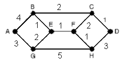
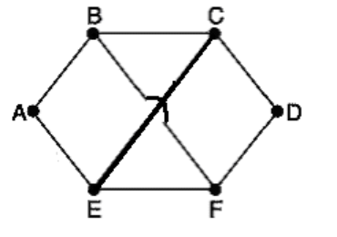

## 2005-2006学年上学期期末试卷（A）（含答案）

### 一、选择题（20 分，每题 2 分）

1. Internet 的核心协议是（ ）。

    A. X.25

    B. TCP/IP

    C. ICMP

    D. UDP

    

    
答案：

    B

    

    ***

2. 通过改变载波信号的相位值来表示数字信号“1”和“0”的方法叫做（ ）。

    A. ASK

    B. FSK

    C. PSK

    D. ATM

    

    
答案：

    C

    

    ***

3. 下列哪个 MAC 地址是正确的（ ）。

    A. `00-06-5B-4F-45-BA`

    B. `192.168.1.55`

    C. `65-10-96-58-16`

    D. `00-16-5B-4A-34-2H`

    

    
答案：

    A

    

    ***

4. 在 WINDOW 2000 中，查看本机 IP 地址的命令是（ ）。

    A. `ping`

    B. `tracert`

    C. `net`

    D. `ipconfig`

    

    
答案：

    D

    

    ***

5. 采用异步传输方式，设数据位为 8 位，1 位停止位，无校验位，则其通信效率为（ ）。

    A. 70%

    B. 80%

    C. 30%

    D. 20%

    

    
答案：

    B

    

    ***

6. E1 载波的数据传输率为（ ）。

    A. 1 Mbps

    B. 10 Mbps

    C. 2.048 Mbps

    D. 1.544 Mbps

    

    
答案：

    C

    

    ***

7. 下列哪种交换方法实时性最好？（ ）

    A. 分组交换

    B. 报文交换

    C. 电路交换

    D. 各种方法都一样

    

    
答案：

    A

    

    ***

8. 若 HDLC 帧的数据段中出现比特串 `0101111101`，则比特填充后的输出为（ ）。

    A. `01001111101`

    B. `01011111001`

    C. `01011110101`

    D. `01011111010`

    

    
答案：

    B

    

    ***

9. TCP/IP 体系结构中的 TCP 和 IP 所提供的服务分别为（ ）。

    A. 链路层服务和网络层服务

    B. 网络层服务和运输层服务

    C. 运输层服务和应用层服务

    D. 运输层服务和网络层服务

    

    
答案：

    D

    

    ***

10. 对于基带 CSMA/CD 而言，为了确保发送站点在传输时能检测到可能存在的冲突，数据帧的传输时延至少要等于信号传播时延的（ ）。

    A. 1 倍

    B. 2 倍

    C. 4 倍

    D. 2.5 倍

    

    
答案：

    B

    

***

### 二、填空（20 分，每空 1 分）

1. 根据网络的地理覆盖范围进行分类，计算机网络可以分为以下四大类型：$\underline{\qquad}$，$\underline{\qquad}$，$\underline{\qquad}$ 和 $\underline{\qquad}$。

    

    
答案：

    局域网、城域网、广域网、因特网

    

    ***

2. 网络的传输方式按信号传送方向和时间关系分类，信道可分为三种：$\underline{\qquad}$，$\underline{\qquad}$，$\underline{\qquad}$。

    

    
答案：

    单工、半双工、全双工

    

    ***

3. 光纤的规格分为 $\underline{\qquad}$ 和 $\underline{\qquad}$ 两种。

    

    
答案：

    单模光纤、多模光纤

    

    ***

4. 最常用的两种多路复用技术为 $\underline{\qquad}$ 和 $\underline{\qquad}$，其中，前者是同一时间同时传送多路信号，而后者是将一条物理信道按时间分成若干个时间片轮流分配给多个信号使用。

    

    
答案：

    FDM、TDM

    

    ***

5. 数据链路层的成帧技术主要有：$\underline{\qquad}$，$\underline{\qquad}$，$\underline{\qquad}$ 和 $\underline{\qquad}$ 四种。

    

    
答案：

    字符记数法、字符填充法、位填充法、物理层违例编码法

    

    ***

6. DHCP 的中文名称为 $\underline{\qquad}$。

    

    
答案：

    动态主机控制协议

    

    ***

7. 在 HDLC 协议中，经过位填充后的比特流序列 `01111101011111001` 在接收方将还原成 $\underline{\qquad}$。

    

    
答案：

    `011111101111101`

    

    ***

8. 路由器属于 $\underline{\qquad}$ 层的互连设备。

    

    
答案：

    网络层

    

    ***

9. 传输层释放连接的主要方式有 $\underline{\qquad}$ 和 $\underline{\qquad}$ 两种。

    

    
答案：

    对称方式、非对称方式

    

***

### 三、名词解释（12 分，每小题 3 分）

1. TCP

    

    
答案：

    TCP：传输控制协议 TCP 是 TCP/IP 协议栈中的传输层协议，TCP 通过面向连接的、端到端的可靠数据报发送来保证可靠性。与 IP 协议相结合，TCP/IP 组成了因特网协议的核心。

    

    ***

2. VLAN

    

    
答案：

    VLAN：即虚拟局域网，是指处于不同物理位置的节点根据需要组成不同的逻辑子网，即一个 VLAN 就是一个逻辑广播域，它可以覆盖多个网络设备。VLAN 允许处于不同地理位置的网络用户加入到一个逻辑子网中，共享一个广播域。通过对 VLAN 的创建可以控制广播风暴的产生，从而提高交换式网络的整体性能和安全性。

    

    ***

3. 载荷脱落（Load Shedding）

    

    
答案：

    载荷脱落（Load Shedding）：当采用其他办法都不能消除拥塞时，路由器就使用载荷脱落。载荷脱落（load shedding）是一种极端的方法，即当路由器被它所不能控制的分组所淹没时，它只好将这些分组扔掉。

    

    ***

4. 泛洪路由算法（Flooding Routing）

    

    
答案：

    泛洪路由算法（Flooding Routing）：一种路由算法，在泛洪路由算法中，路由器从输入线接收到分组后，向除输入线之外的其他所有输出线转发该分组。

    

***

### 四、简答题（20 分，每小题 10 分）

1. 论述三种交换技术（电路交换、报文交换和分组交换）的主要特点。

    

    
答案：

    电路交换就是计算机终端之间通信时，一方发起呼叫，独占一条物理线路。当交换机完成接续，对方收到发起端的信号，双方即可进行通信。在整个通信过程中双方一直占用该电路。它的特点是实时性强，时延小，交换设备成本较低。但同时也带来线路利用率低，电路接续时间长，通信效率低，不同类型终端用户之间不能通信等缺点。电路交换比较适用于信息量大、长报文，经常使用的固定用户之间的通信。

    报文交换：将用户的报文存储在交换机的存储器中。当所需要的输出电路空闲时，再将该报文发向接收交换机或终端，它以“存储--转发”方式在网内传输数据。报文交换的优点是中继电路利用率高，可以多个用户同时在一条线路上传送，可实现不同速率、不同规程的终端间互通。但它的缺点也是显而易见的。以报文为单位进行存储转发，网络传输时延大，且占用大量的交换机内存和外存，不能满足对实时性要求高的用户。报文交换适用于传输的报文较短、实时性要求较低的网络用户之间的通信，如公用电报网。

    分组交换实质上是在“存储--转发”基础上发展起来的。它兼有电路交换和报文交换的优点。分组交换在线路上采用动态复用技术传送按一定长度分割为许多小段的数据--分组。每个分组标识后，在一条物理线路上采用动态复用的技术，同时传送多个数据分组。把来自用户发端的数据暂存在交换机的存储器内，接着在网内转发。到达接收端，再去掉分组头将各数据字段按顺序重新装配成完整的报文。分组交换比电路交换的电路利用率高，比报文交换的传输时延小，交互性好。

    评分标准：主要意思答对，即可得分。每小题 10 分。

    

    ***

2. 简述距离矢量路由选择算法基本思想。

    

    
答案：

    在距离矢量路由选择算法中，相邻路由器之间周期性地相互交换各自的路由表备份。当网络拓扑结构发生变化时，路由器之间也将及时地相互通知有关变更信息。距离矢量路由选择算法要求每一个路由器把它的整个路由表发送给与它直接连接的其他路由器。路由表中的每一条记录都包括目标逻辑地址、相应的输出线和该条路由的向量距离。当一个路由器从它的邻居那儿收到更新信息时，它将更新信息与本身的路由表相比较，如果它能从邻居那儿找到一条它以前不曾知道的新的路由或是找到一条比当前路由更好的路由时，路由器会对路由表进行更新：将从该路由器到邻居之间的向量距离与更新信息中的向量距离相加作为新路由的向量距离。距离矢量路由选择算法存在无穷计算问题。

    评分标准：主要意思答对，即可得分。每小题 10 分。

    

***

### 五、综合题（28 分）

1. 设信道带宽为 4 KHz，信噪比为 20 db，若传输二进制信号，则可达到的最大数据速率是多少？（5 分）

    

    
答案：

    $10\log_{10}(S/N)=20$，故：$S/N=100$。（1 分）

    Shannon：$H\log_2(1+S/N)=4\log_2 101=26.64\text{ kbps}$。（1 分）

    Nyquist：$2H\log_2V=8\text{ kbps}$。（1 分）

    故：信道的最大数据传输率为 8 kbps。（2 分）

    

    ***

2. 现有一批从 `195.168.16.0` 开始的 IP 地址，要求为 A、B、C、D 四个校园网络分配 IP 地址。A 包含 600 台计算机，B 包含 200 台计算机，C 包含 2000 台计算机，D 包含 1000 台计算机。请写出 IP 地址分配方案。（10 分）

    | 校园网 | 起始 IP 地址 | 结束 IP 地址 | 基地址/子网掩码 |
    | --- | --- | --- | --- |
    | A |  |  |  |
    | B |  |  |  |
    | C |  |  |  |
    | D |  |  |  |

    

    
答案：

    | 校园网 | 起始 IP 地址 | 结束 IP 地址 | 基地址/子网掩码 | 评分标准 |
    | --- | --- | --- | --- | --- |
    | A | `195.168.16.0` | `195.168.18.87` | `195.168.16.0/22` | 3 分 |
    | B | `195.168.19.0` | `195.168.19.199` | `195.168.19.0/24` | 3 分 |
    | C | `195.168.20.0` | `195.168.27.207` | `195.168.20.0/20` | 2 分 |
    | D | `195.168.28.0` | `195.168.31.231` | `195.168.28.0/22` | 2 分 |

    

    ***

3. 长度为 2000 位的数据帧，在数据传输速率为 1 Mbps、最大长度为 1 km 的物理线路上传输。假设线路的单向传输延迟时间为 199 ms，试计算下列协议中的物理通信线路可达到的最大利用率？（数据帧的序列号为 4 位，确认帧的发送时间忽略不计）（7 分）

    a）停--等协议

    b）回退-n 帧的滑动窗口协议

    c）选择性重传的滑动窗口协议。

    

    
答案：

    a）$2/400=0.5\%$。（2 分）

    b）$2\times7/400=3.5\%$。（2 分）

    c）$2\times4/400=2\%$。（3 分）

    

    ***

4. 对如下所示的子网拓扑结构中，采用链路状态路由算法，试分析路由器 E 的路由表。（6 分）

    

    

    
答案：

    | 目的端 | 开销 | 输出线 | 评分标准 |
    | --- | --- | --- | --- |
    | A | 5 | G | 1 分 |
    | B | 1 | B | 0.5 分 |
    | C | 3 | B/F | 1 分 |
    | D | 4 | F | 1 分 |
    | E | 0 | - | 0.5 分 |
    | F | 1 | F | 0.5 分 |
    | G | 2 | G | 1 分 |
    | H | 2 | F | 0.5 分 |

    

## 2005-2006学年上学期期末试卷（B）（含答案）

### 一、选择题（20 分，每题 2 分）

1. 采用半双工通信方式，数据传输的方向性结构为（ ）。

    A. 可以在两个方向上同时传输

    B. 只能在一个方向上传输

    C. 可以在两个方向上传输，但不能同时进行

    D. 以上均不对

    

    
答案：

    C

    

    ***

2. 在 WINDOW 2000 中，查看本机网卡物理地址的命令是（ ）。

    A. ping

    B. ipconfig

    C. net

    D. ipconfig/all

    

    
答案：

    D

    

    ***

3. 报文分组交换技术有两种实现方法。（ ）

    A. 虚电路、线路交换

    B. 数据报、交叉开关

    C. 虚电路、数据报

    D. 线路交换、数据报

    

    
答案：

    C

    

    ***

4. T1 载波的数据传输率为（ ）。

    A. $1\ \text{Mbps}$

    B. $10\ \text{Mbps}$

    C. $2.048\ \text{Mbps}$

    D. $1.544\ \text{Mbps}$

    

    
答案：

    D

    

    ***

5. 采用相位振幅调制 PAM 技术，可以提高数据传输速率，例如采用 2 种相位，每种相位取 2 种幅度值，可使一个码元（Hz）表示的二进制数的位数为（ ）。

    A. 2 位

    B. 8 位

    C. 16 位

    D. 4 位

    

    
答案：

    A

    

    ***

6. 采用海明码纠正一位差错，若信息位为 8 位，则冗余位至少应为（ ）。

    A. 2 位

    B. 3 位

    C. 5 位

    D. 4 位

    

    
答案：

    D

    

    ***

7. 根据采样定理，如果声音数据限于 $4\ \text{KHz}$ 以下的频率，那么，要能满足完整地表示声音信号的特征要求，每秒最少采样多次。（ ）

    A. 8000

    B. 4000

    C. 2000

    D. 16000

    

    
答案：

    A

    

    ***

8. 对于回退 n 帧的滑动窗口协议，若序号位数为 n，则发送窗口最大尺寸为（ ）。

    A. $2^n - 1$

    B. $2^n$

    C. $2^{n-1}$

    D. $2^{n+1} - 1$

    

    
答案：

    A

    

    ***

9. 若数据帧的有效载荷中出现字符串：A ESC ESC FLAG，则字符填充后的输出为（ ）。

    A. A ESC ESC FLAG

    B. A ESC ESC ESC ESC ESC FLAG

    C. A ESC ESC ESC FLAG

    D. A ESC ESC ESC FLAG FLAG

    

    
答案：

    B

    

    ***

10. 采用曼彻斯特编码，$100\ \text{Mbps}$ 传输速率所需要的调制速率为（ ）。

    A. $200\ \text{M Baud}$

    B. $400\ \text{M Baud}$

    C. $50\ \text{M Baud}$

    D. $100\ \text{M Baud}$

    

    
答案：

    A

    

***

### 二、填空（20 分，每空 1 分）

1. 串行数据通信的方向性结构有三种，即 $\underline{\qquad}$、$\underline{\qquad}$ 和 $\underline{\qquad}$。

    

    
答案：

    单工、半双工、全双工

    

    ***

2. 数字数据可以针对载波的不同要素或它们的组合进行调制，有三种基本的数字调制形式，即 $\underline{\qquad}$、$\underline{\qquad}$ 和 $\underline{\qquad}$。

    

    
答案：

    ASK、FSK、PSK

    

    ***

3. IPv4 的网络地址由 $\underline{\qquad}$ 个二进制位构成，IPv6 的网络地址由 $\underline{\qquad}$ 个二进制位构成。

    

    
答案：

    32、128

    

    ***

4. 到达通信子网中某一部分的分组数量过多，使得该部分乃至整个网络性能下降的现象，称为 $\underline{\qquad}$ 现象。

    

    
答案：

    拥塞

    

    ***

5. OSI 的网络层处于 $\underline{\qquad}$ 层提供的服务之上，为 $\underline{\qquad}$ 层提供服务。

    

    
答案：

    数据链路层、传输层

    

    ***

6. 载波监听多路访问（CSMA）技术，需要一种退避算法来决定避让的时间，常用的退避算法有 $\underline{\qquad}$、$\underline{\qquad}$ 和 $\underline{\qquad}$ 三种。

    

    
答案：

    1-持续、p-持续、非持续

    

    ***

7. HTTP 的中文名称为 $\underline{\qquad}$，DNS 的中文名称为 $\underline{\qquad}$。

    

    
答案：

    超文本传输服务、域名解析

    

    ***

8. 以太网利用 $\underline{\qquad}$ 协议获得目标主机 IP 地址与 MAC 地址的映射关系。

    

    
答案：

    ARP

    

    ***

9. 在 TCP/IP 网络中，传输层协议主要有 $\underline{\qquad}$ 和 $\underline{\qquad}$。

    

    
答案：

    TCP、UDP

    

    ***

10. 非屏蔽双绞线由 $\underline{\qquad}$ 对导线组成。

    

    
答案：

    4

    

***

### 三、名词解释（12 分，每小题 3 分）

1. UDP

    ***

2. 三次握手（Three-way handshake）

    ***

3. CSMA/CD

    ***

4. 流量控制（Flow control）

***

### 四、简答题（20 分，每小题 10 分）

1. 比较分析虚电路子网和数据报子网。

    ***

2. 简述二进制指数后退算法的基本思想。

***

### 五、综合题（28 分）

1. 在基带网络中，请用曼彻斯特编码和差分曼彻斯特编码对二进制数据流 10011101 进行编码（画出波形图）。（5 分）

    ***

2. 某 CDMA 接收方收到一条如下芯片系列：$(-1, +1, -3, +1, -1, -3, +1, +1)$，假设芯片序列为：A：00101110；B：01011100；C：00011011；D：01000010。试分析哪些站点发送了数据？发送了何种数据。（10 分）

    ***

3. 某 LAN 中线缆的最长距离为 $1\ \text{km}$（线路中无中继器），采用 CSMA/CD 共享信道分配算法。经测算，信号在线缆上的传输延迟为 $200000\ \text{km/sec}$，试分析在该 LAN 中传输的数据帧的最短长度为多少？（写出分析过程）（7 分）

    ***

4. 如下所示的子网中，采用距离向量路由选择算法，路由器 C 刚收到如下向量：

    来自 B：$(5, 0, 8, 12, 10, 8)$；

    来自 D：$(16, 12, 6, 0, 7, 9)$；

    来自 E：$(5, 11, 6, 10, 4, 0)$。

    路由器 C 新测量的到 B、D、E 的延迟分别为 3、5、6。

    试分析 C 的新路由选择表。（要求给出采用的输出线路和预计延迟）（6 分）

    
