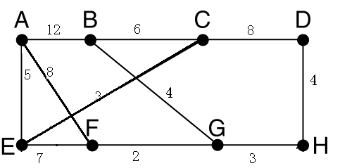
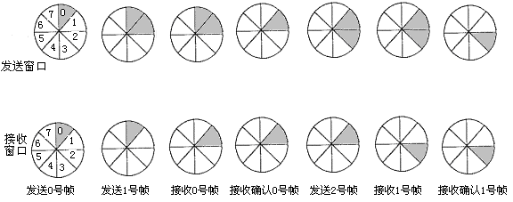

## 2006-2007学年上学期期末试卷（A）（含答案）

### 一、单项选择题（本大题共 15 小题，每小题 2 分，共 30 分）

在每小题列出的四个选项中只有一个选项是符合题目要求的，请将正确选项前的字母填在题后的括号内。

1. 将一条物理信道按时间分成若干时间片轮换地给多个信号使用，每一时间片由复用的一个信号占用，这可以在一条物理信道上传输多个数字信号，这就是（ ）。

    A. 频分多路复用

    B. 时分多路复用

    C. 空分多路复用

    D. 频分与时分混合多路复用

    <details>
    <summary>答案：</summary>

    B

    </details>

    ***

2. Internet 的网络层含有四个重要的协议，分别为（ ）。

    A. IP，ICMP，ARP，UDP

    B. TCP，ICMP，UDP，ARP

    C. IP，ICMP，ARP，RARP

    D. UDP，IP，ICMP，RARP

    <details>
    <summary>答案：</summary>

    C

    </details>

    ***

3. 一座大楼内的一个计算机网络系统，属于（ ）。

    A. PAN

    B. LAN

    C. MAN

    D. WAN

    <details>
    <summary>答案：</summary>

    B

    </details>

    ***

4. UTP 与计算机连接，最常用的连接器为（ ）。

    A. RJ-45

    B. AUI

    C. BNC-T

    D. NNI

    <details>
    <summary>答案：</summary>

    A

    </details>

    ***

5. 在中继系统中，中继器处于（ ）。

    A. 物理层

    B. 数据链路层

    C. 网络层

    D. 应用层

    <details>
    <summary>答案：</summary>

    A

    </details>

    ***

6. 数据链路层可以通过（ ）标识不同的主机。

    A. 物理地址

    B. 端口号

    C. IP 地址

    D. 逻辑地址

    <details>
    <summary>答案：</summary>

    A

    </details>

    ***

7. 交换机能够识别（ ）地址。

    A. DNS

    B. TCP

    C. 网络层

    D. MAC

    <details>
    <summary>答案：</summary>

    D

    </details>

    ***

8. 一个以太网帧的最小和最大尺寸是（ ）。

    A. 46 和 64 字节

    B. 64 和 1518 字节

    C. 64 和 1600 字节

    D. 46 和 28 字节

    <details>
    <summary>答案：</summary>

    B

    </details>

    ***

9. 以太网采用下面哪个标准（ ）。

    A. IEEE802.3

    B. IEEE802.4

    C. IEEE802.5

    D. Token Ring

    <details>
    <summary>答案：</summary>

    A

    </details>

    ***

10. T1 载波的数据传输率为（ ）。

    A. 1 Mbps

    B. 10 Mbps

    C. 2.048 Mbps

    D. 1.544 Mbps

    <details>
    <summary>答案：</summary>

    D

    </details>

    ***

11. 用十六进制表示法为 `0xC0290614` 的 IP 地址若采用点分十进制表示为（ ）。

    A. 192.41.6.21

    B. 192.41.6.20

    C. C0.29.6.14

    D. C0.29.6.20

    <details>
    <summary>答案：</summary>

    B

    </details>

    ***

12. LAN 参考模型可分为物理层（ ）。

    A. MAC，LLC 等三层

    B. LLC，MHS 等三层

    C. MAC，FTAM 等三层

    D. LLC，VT 等三层

    <details>
    <summary>答案：</summary>

    A

    </details>

    ***

13. 以下关于 100BASE-T 的描述中错误的是（ ）。

    A. 数据传输速率为 100 Mbit/s

    B. 信号类型为基带信号

    C. 采用 5 类 UTP，其最大传输距离为 185 M

    D. 支持共享式和交换式两种组网方式

    <details>
    <summary>答案：</summary>

    C

    </details>

    ***

14. 在 TCP/IP 协议模型中，UDP 协议工作在（ ）。

    A. 应用层

    B. 传输层

    C. 网络互联层

    D. 网络接口层

    <details>
    <summary>答案：</summary>

    B

    </details>

    ***

15. 对于回退 n 帧的滑动窗口协议，若序号位数为 n，则发送窗口最大尺寸为（ ）。

    A. $2^n - 1$

    B. $2^n$

    C. $2^{n-1}$

    D. $2n - 1$

    <details>
    <summary>答案：</summary>

    A

    </details>

***

### 二、填空题（本大题共 10 小题，每空 1 分，共 20 分）

1. 局域网可采用多种通信介质，如 $\underline{\qquad}$，$\underline{\qquad}$ 或 $\underline{\qquad}$ 等。

    <details>
    <summary>答案：</summary>

    双绞线、同轴电缆、光纤

    </details>

    ***

2. 在 TCP/IP 协议模型中，传输层的 $\underline{\qquad}$ 提供了一种可靠的数据流服务。

    <details>
    <summary>答案：</summary>

    TCP

    </details>

    ***

3. 串行数据通信的方向性结构有三种，即 $\underline{\qquad}$、$\underline{\qquad}$ 和 $\underline{\qquad}$。

    <details>
    <summary>答案：</summary>

    单工、半双工、全双工

    </details>

    ***

4. 光纤的规格分为 $\underline{\qquad}$ 和 $\underline{\qquad}$ 两种。

    <details>
    <summary>答案：</summary>

    单模光纤、多模光纤

    </details>

    ***

5. 按 IP 地址分类，地址：`160.201.68.108` 属于 $\underline{\qquad}$ 类地址。

    <details>
    <summary>答案：</summary>

    B

    </details>

    ***

6. 常用的信道复用技术有 $\underline{\qquad}$ 和 $\underline{\qquad}$。

    <details>
    <summary>答案：</summary>

    TDM、FDM

    </details>

    ***

7. 传输层的传输服务有两大类：$\underline{\qquad}$ 服务和 $\underline{\qquad}$ 的服务。

    <details>
    <summary>答案：</summary>

    面向连接、无连接

    </details>

    ***

8. 将模拟信号变换成数字信号的常用方法是脉冲编码调制 PCM，脉冲编码调制 PCM 由 $\underline{\qquad}$、$\underline{\qquad}$ 和 $\underline{\qquad}$ 三步构成。

    <details>
    <summary>答案：</summary>

    采样、量化、编码

    </details>

    ***

9. 通信系统中，称调制前的电信号为 $\underline{\qquad}$ 信号，调制后的电信号为 $\underline{\qquad}$ 信号。

    <details>
    <summary>答案：</summary>

    模拟、数字

    </details>

    ***

10. FLOODING（泛洪扩散）路由算法属于 $\underline{\qquad}$（动/静态）路由算法。

    <details>
    <summary>答案：</summary>

    静态

    </details>

***

### 三、名词解释（本大题共 5 小题，每小题 4 分，共 20 分）

1. 信道容量

    <details>
    <summary>答案：</summary>

    通信信道在单位时间里传输的数据位数，以 bps 为单位表示。

    </details>

    ***

2. CDMA

    <details>
    <summary>答案：</summary>

    码分多址访问，一种新的信道复用技术，主要用于无线移动通信。

    </details>

    ***

3. 多路复用（Multiplexing）

    <details>
    <summary>答案：</summary>

    在数据通信或计算机网络系统中，传输媒体的带宽或容量往往超过传输单一信号的需求，为了有效地利用通信线路，可以利用一条信道传输多路信号，这种方法称为信道的多路利用，简称多路复用。

    </details>

    ***

4. 奇偶校验码

    <details>
    <summary>答案：</summary>

    在被效验的数据位后增加 1 位检测位，使得被效验的数据位和检测位中“1”的个数为奇数或偶数。

    </details>

    ***

5. TCP

    <details>
    <summary>答案：</summary>

    传输控制协议，它是 TCP/IP 协议模型传输层的重要协议。TCP 协议实现面向连接服务。

    </details>

***

### 四、计算题（本大题共 4 小题，共 20 分）

1. （4 分）找出下列不能分配给主机的 IP 地址，并说明原因。

    A. `131.107.256.80`

    B. `231.222.0.11`

    <details>
    <summary>答案：</summary>

    A. 第三个数 256 是非法值，每个数字都不能大于 255。（2 分）

    B. 第一个数 231 是保留给组播的地址，不能用于主机地址。（2 分）

    </details>

    ***

2. （6 分）某公司采用一条租用专线（Leased line）与在外地的分公司相连，使用的 Modem 的数据传输率为 2400 bps，现有数据 $12 \times 10^6$ 字节，若以异步方式传送，不加校验位，1 位停止位，则最少需要多少时间（以秒为单位）才能传输完毕？（设数据信号在线路上的传播延迟时间忽略不计）。

    <details>
    <summary>答案：</summary>

    以异步方式传输一个字节数据，需加 1 位起始位，一位停止位，实际需传送 10 位。（2 分）

    $12 \times 10^6 \times 10 / 2400 = 5 \times 10^4$（秒）

    即最少需 $5 \times 10^4$ 秒才能传输完毕。（4 分）

    </details>

    ***

3. （5 分）试分析 8 位二进制码 `10110101` 的偶校验海明码。

    <details>
    <summary>答案：</summary>

    按照偶校验海明码的生成规则得：

    偶校验海明码：`001101100101`（5 分）

    评分标准：每错一个冗余位，扣 1 分；全错扣 5 分。

    </details>

    ***

4. （5 分）采用生成多项式 $x^6 + x^4 + x + 1$ 发送的报文到达接收方为 `101011000110`，所接收的报文是否正确？试说明理由。

    <details>
    <summary>答案：</summary>

    多项式 $x^6 + x^4 + x + 1$ 对应的位串是 `1010011`，用它来除接收到的报文，若能整除则所接收报文正确。（2 分）

    能够整除，所以收到的报文是正确的。（3 分）

    </details>

***

### 五、应用题（本大题共 1 小题，共 10 分）

1. （10 分）对如下所示的子网拓扑结构中，采用链路状态路由算法，试分析路由器 A 的路由表。

    

    <details>
    <summary>答案：</summary>

    路由器 A 的路由表：

    | 目的路由器 | 延迟 | 输出线 | 评分标准 |
    | :---: | :---: | :---: | :---: |
    | A | 0 | — | 1 分 |
    | B | 12 | B | 1 分 |
    | C | 8 | E | 1 分 |
    | D | 16 | E | 2 分 |
    | E | 5 | E | 1 分 |
    | F | 8 | F | 1 分 |
    | G | 10 | F | 1 分 |
    | H | 13 | F | 2 分 |

    </details>

***

## 2006-2007学年上学期期末试卷（B）（含答案）

### 一、单项选择题（本大题共 15 小题，每小题 2 分，共 30 分）

在每小题列出的四个选项中只有一个选项是符合题目要求的，请将正确选项前的字母填在题后的括号内。

1. 对于带宽为 6 MHz 的信道，若用 8 种不同的状态来表示数据，在不考虑热噪声的情况下，该信道每秒最多能传送的位数为（ ）。

    A. $36 \times 10^6$

    B. $18 \times 10^6$

    C. $48 \times 10^6$

    D. $96 \times 10^6$

    <details>
    <summary>答案：</summary>

    A

    </details>

    ***

2. E1 载波的数据传输为（ ）。

    A. 1.544 Mbps

    B. 1 Mbps

    C. 2.048 Mbps

    D. 10 Mbps

    <details>
    <summary>答案：</summary>

    C

    </details>

    ***

3. 采用 8 种相位，每种相位各有两种幅度的 PAM 调制方法，在 1200 Baud 的信号传输速率下能达到的数据传输速率为（ ）。

    A. 2400 b/s

    B. 3600 b/s

    C. 9600 b/s

    D. 4800 b/s

    <details>
    <summary>答案：</summary>

    D

    </details>

    ***

4. 采用曼彻斯特编码的数字信道，其数据传输速率为波特率的（ ）。

    A. 2 倍

    B. 4 倍

    C. 1/2 倍

    D. 1 倍

    <details>
    <summary>答案：</summary>

    C

    </details>

    ***

5. 采用海明码纠正一位差错，若信息位为 16 位，则冗余位至少应为（ ）。

    A. 5 位

    B. 3 位

    C. 4 位

    D. 2 位

    <details>
    <summary>答案：</summary>

    A

    </details>

    ***

6. 在 CRC 码计算中，可以将一个二进制位串与一个只含有 0 或 1 两个系数的一元多项式建立对应关系。例如，与位串 `101101` 对应的多项式为（ ）。

    A. $x^6 + x^4 + x^3 + 1$

    B. $x^5 + x^3 + x^2 + 1$

    C. $x^5 + x^3 + x^2 + x$

    D. $x^6 + x^5 + x^4 + 1$

    <details>
    <summary>答案：</summary>

    B

    </details>

    ***

7. 采用有序接收的滑动窗口协议，设序号位数为 n，则发送窗口最大尺寸为（ ）。

    A. $2n - 1$

    B. $2^n - 1$

    C. $2^n$

    D. $2n$

    <details>
    <summary>答案：</summary>

    B

    </details>

    ***

8. 标准 10 Mbps 802.3LAN 的波特率为（ ）。

    A. 20 M 波特

    B. 10 M 波特

    C. 5 M 波特

    D. 40 M 波特

    <details>
    <summary>答案：</summary>

    A

    </details>

    ***

9. IEEE802.3 采用的媒体访问控制方法为（ ）。

    A. 1-坚持算法的 CSMA/CD

    B. 非坚持算法的 CSMA/CD

    C. P-坚持算法的 CSMA/CD

    D. 以上均不对

    <details>
    <summary>答案：</summary>

    A

    </details>

    ***

10. 交换技术而言，局域网中的以太网采用的是（ ）。

    A. 分组交换技术

    B. 电路交换技术

    C. 报文交换技术

    D. 分组交换与电路交换结合技术

    <details>
    <summary>答案：</summary>

    A

    </details>

    ***

11. 若两台主机在同一子网中，则两台主机的 IP 地址分别与它们的子网掩码相“与”的结果一定（ ）。

    A. 为全 0

    B. 为全 1

    C. 相同

    D. 不同

    <details>
    <summary>答案：</summary>

    C

    </details>

    ***

12. 三次握手方法用于（ ）。

    A. 传输层连接的建立

    B. 数据链路层的流量控制

    C. 传输层的重复检测

    D. 传输层的流量控制

    <details>
    <summary>答案：</summary>

    A

    </details>

    ***

13. IP 的协议数据单元被称为（ ）。

    A. 比特

    B. 帧

    C. 分段

    D. 分组

    <details>
    <summary>答案：</summary>

    D

    </details>

    ***

14. 报文交换技术说法不正确的是（ ）。

    A. 报文交换采用的传送方式是“存储一转发”方式

    B. 报文交换方式中数据传输的数据块其长度不限且可变

    C. 报文交换可以把一个报文发送到多个目的地

    D. 报文交换方式适用于语言连接或交互式终端到计算机的连接

    <details>
    <summary>答案：</summary>

    C

    </details>

    ***

15. 以下（ ）是集线器（Hub）的功能。

    A. 增加区域网络上的传输速度。

    B. 增加区域网络的数据复制速度。

    C. 连接各电脑线路间的媒介。

    D. 以上皆是。

    <details>
    <summary>答案：</summary>

    C

    </details>

***

### 二、填空题（本大题共 10 小题，每空 1 分，共 20 分）

1. 按交换方式来分类，计算机网络可以分为电路交换网，$\underline{\qquad}$ 和 $\underline{\qquad}$ 三种。

    <details>
    <summary>答案：</summary>

    报文交换网、分组交换网

    </details>

    ***

2. 有两种基本的差错控制编码，即检错码和 $\underline{\qquad}$，在计算机网络和数据通信中广泛使用的一种检错码为 $\underline{\qquad}$。

    <details>
    <summary>答案：</summary>

    纠错码、CRC

    </details>

    ***

3. 通信双方对等进程或同层实体通过协议进行的通信称为 $\underline{\qquad}$ 通信，通过物理介质进行的通信称为 $\underline{\qquad}$ 通信。

    <details>
    <summary>答案：</summary>

    虚、实

    </details>

    ***

4. 若 HDLC 帧数据段中出现比特串 `01011111110`，则比特填充后的输出为 $\underline{\qquad}$。

    <details>
    <summary>答案：</summary>

    `010111110110`

    </details>

    ***

5. 局域网常用的拓扑结构有总线、星形和 $\underline{\qquad}$ 三种。著名的以太网（Ethernet）就是采用其中的 $\underline{\qquad}$ 结构。

    <details>
    <summary>答案：</summary>

    环型、总线

    </details>

    ***

6. 由于帧中继可以不用网络层而使用链路层来实现复用和转接，所以帧中继通信节点的层次结构中只有 $\underline{\qquad}$ 和 $\underline{\qquad}$。

    <details>
    <summary>答案：</summary>

    物理层、数据链路层

    </details>

    ***

7. IEEE802.3 规定了一个数据帧的长度为 $\underline{\qquad}$ 字节到 $\underline{\qquad}$ 字节之间。

    <details>
    <summary>答案：</summary>

    64、1518

    </details>

    ***

8. 在 TCP/IP 中，负责将 IP 地址映像成所对应的物理地址的协议是 $\underline{\qquad}$。

    <details>
    <summary>答案：</summary>

    ARP

    </details>

    ***

9. OSI 模型有 $\underline{\qquad}$、$\underline{\qquad}$、$\underline{\qquad}$、运输层、会话层、表示层和应用层七个层次。

    <details>
    <summary>答案：</summary>

    物理层、数据链路层、网络层

    </details>

    ***

10. 常用的 IP 地址有 A、B、C 三类，`128.11.3.31` 是一个 $\underline{\qquad}$ 类 IP 地址，其网络标识（netid）为 $\underline{\qquad}$，主机标识（hosted）为 $\underline{\qquad}$。

    <details>
    <summary>答案：</summary>

    B、128.11、3.31

    </details>

***

### 三、名词解释（本大题共 5 小题，每小题 4 分，共 20 分）

1. 流量控制

    <details>
    <summary>答案：</summary>

    为了避免由于发送端发送数据帧速度过快，而使得接收端来不及接收，出现信息淹没的现象。

    </details>

    ***

2. 带宽

    <details>
    <summary>答案：</summary>

    带宽通常指通过给定线路发送的数据量，从技术角度看，带宽是通信信道的宽度（或传输信道的最高频率与最低频率之差），单位是赫兹。

    </details>

    ***

3. 三次握手

    <details>
    <summary>答案：</summary>

    在传输层 TCP 协议利用三次握手实现面向连接服务。例如 A 和 B 采用 TCP 进行数据传输，那么在传输之前的三次握手建立如下：

    第一次握手：A 向 B 发送连接请求。

    第二次握手：B 接收到 A 的连接请求后，向 A 发回一个连接确认。

    第三次握手：A 接收到 B 的连接确认后，再向 B 发送一次确认。

    当 B 接收到 A 的这个确认后，这个三次握手也就成功建立了，不过数据传输完毕后连接自动关闭，不过当 A 和 B 还需要再次传输数据的话，须再次建立三次握手。

    </details>

    ***

4. 子网掩码

    <details>
    <summary>答案：</summary>

    是 32 位二进制数，它的子网主机标识部分为全“0”。利用子网掩码可以判断两台主机是否在同一子网中。若两台主机的 IP 地址分别与它们的子网掩码相“与”后的结果相同，则说明这两台主机在同一子网中。

    </details>

    ***

5. 网络协议

    <details>
    <summary>答案：</summary>

    为进行计算机网络中的数据交换而建立的规则、标准或约定的集合称为网络协议（Protocol）。

    </details>

***

### 四、计算题（本大题共 2 小题，共 15 分）

1. （7 分）在一个传输速率为 1 Gbps 的 CSMA/CD 网络中，假设两站点间电缆的最长距离为 1 km，信号在电缆上的传输速度为 400000 km/sec，试分析该网络中的数据帧最短长度？

    <details>
    <summary>答案：</summary>

    最短帧长 $= 2 \times (1\ \text{km} / 400000\ \text{km/s}) \times 1\ \text{Gbps} = 5000\ \text{bit}$。（7 分）

    </details>

    ***

2. （8 分）画出对位流 `1010010101` 进行差分曼彻斯特编码后的波形图（初始电平为低）。

    <details>
    <summary>答案：</summary>

    ```text
          1       0       1       0       0       1       0       1       0       1
    ___|▔▔▔|_______|▔▔▔|___|▔▔▔▔▔▔▔|_______|▔▔▔|___|▔▔▔▔▔▔▔|___|▔▔▔|_______|▔▔▔|___|▔▔▔
    ```

    评分标准：共 8 分，每错一个位的波形扣 1 分，扣到 0 分为止。

    </details>

***

### 五、应用题（本大题共 2 小题，共 15 分）

1. （7 分）若窗口序号位数为 3，发送窗口尺寸为 2，采用 Go-back-N 法，试画出由初始状态出发相继发生下列事件时的发送及接收窗口图示：

    发送 0 号帧；发送 1 号帧；接收 0 号帧；接收确认 0 号帧；发送 2 号帧；接收 1 号帧；接收确认 1 号帧。

    <details>
    <summary>答案：</summary>

    

    评分标准：每步 1 分。

    </details>

    ***

2. （8 分）如下所示协议中：

    ```c
    void protocol4 (void) {
      seq_nr next_frame_to_send, frame_expected;
      frame r, s;
      packet buffer;
      event_type event;

      next_frame_to_send = 0; frame_expected = 0;
      from_network_layer(&buffer);
      s.info = buffer;
      s.seq = next_frame_to_send;
      s.ack = 1 - frame_expected;
      to_physical_layer(&s); start_timer(s.seq);

      while (true) {
        wait_for_event(&event);
        if (event == frame_arrival) {
          from_physical_layer(&r);
          if (r.seq == frame_expected) {
            to_network_layer(&r.info);
            inc(frame_expected);
          }
          if (r.ack == next_frame_to_send) {
            from_network_layer(&buffer);
            inc(next_frame_to_send);
          }
        }
        s.info = buffer;
        s.seq = next_frame_to_send;
        s.ack = 1 - frame_expected;
        to_physical_layer(&s); start_timer(s.seq);
      }
    }
    ```

    （1）当发送方在第 12 行语句中发送的一个数据帧丢失了，接收方执行何种动作？

    （2）当发送方在第 12 行语句中发送的一个数据帧丢失了，发送方执行何种动作？

    （3）当接收方正确收到发送方在第 12 行语句中发送的一个数据帧，并发送了该数据帧的确认，但该确认帧丢失了，发送方执行何种动作？

    <details>
    <summary>答案：</summary>

    1. 接收方不做任何动作，等待事件发生。（2 分）

    2. 定时器超时，重发该数据帧。（3 分）

    3. 定时器超时，重发该数据帧。（3 分）

    </details>
