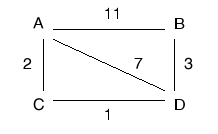

## 2007-2008学年上学期期末试卷（A）（含答案）

### 一、单项选择题（本大题共 15 小题，每小题 2 分，共 30 分）

1. 路由选择协议位于（ ）。

    A. 物理层

    B. 数据链路层

    C. 网络层

    D. 应用层

    

    
答案：

    C

    

    ***

2. 有关光缆陈述正确的是（ ）。

    A. 光缆的光纤通常是偶数，一进一出

    B. 光缆不安全

    C. 光缆传输慢

    D. 光缆较电缆传输距离近

    

    
答案：

    A

    

    ***

3. 在局域网中，MAC 指的是（ ）。

    A. 逻辑链路控制子层

    B. 介质访问控制子层

    C. 物理层

    D. 数据链路层

    

    
答案：

    B

    

    ***

4. E1 系统的速率为（ ）。

    A. 1.544 Mbps

    B. 155 Mbps

    C. 2.048 Mbps

    D. 64 kbps

    

    
答案：

    C

    

    ***

5. `255.255.255.224` 可能代表的是（ ）。

    A. 一个 B 类网络号

    B. 一个 C 类网络中的广播

    C. 一个具有子网的网络掩码

    D. 以上都不是

    

    
答案：

    C

    

    ***

6. HDLC 的帧格式中，帧校验序列字段占（ ）。

    A. 1 个比特

    B. 8 个比特

    C. 16 个比特

    D. 24 个比特

    

    
答案：

    C

    

    ***

7. 以下哪一个不是关于千兆位以太网的正确描述（ ）。

    A. 数据传输速率为 1000 MBit/s

    B. 支持全双工传送方式

    C. 只能基于光纤实现

    D. 帧格式与以太网帧格式相同

    

    
答案：

    C

    

    ***

8. IP 地址为 `140.111.0.0` 的 B 类网络，若要切割为 9 个子网，而且都要连上 Internet，请问子网掩码设为（ ）。

    A. `255.0.0.0`

    B. `255.255.0.0`

    C. `255.255.128.0`

    D. `255.255.240.0`

    

    
答案：

    D

    

    ***

9. 以下（ ）是集线器（Hub）的功能。

    A. 增加区域网络的上传输速度。

    B. 增加区域网络的数据复制速度。

    C. 连接各电脑线路间的媒介。

    D. 以上皆是。

    

    
答案：

    C

    

    ***

10. 根据报文交换方式的基本原理，可以将其交换系统的功能概括为（ ）。

    A. 存储系统

    B. 转发系统

    C. 存储-转发系统

    D. 传输-控制系统

    

    
答案：

    C

    

    ***

11. 具有 24 个 10M 端口的交换机的总带宽可以达到（ ）。

    A. 10M

    B. 100M

    C. 240M

    D. 10/24M

    

    
答案：

    C

    

    ***

12. 若 HDLC 帧的数据段中出现比特串 `01011111101`，则比特填充后的输出为（ ）。

    A. `010011111101`

    B. `010111110101`

    C. `010111101101`

    D. `010111111010`

    

    
答案：

    B

    

    ***

13. 采用异步传输方式，设数据位为 8 位，无校验位，1 位停止位，则其通信效率为（ ）。

    A. 30%

    B. 70%

    C. 80%

    D. 20%

    

    
答案：

    C

    

    ***

14. 采用相位振幅调制 PAM 技术，可以提高数据传输速率，例如采用 4 种相位，每种相位取 2 种幅度值，可使一个码元（Hz）表示的二进制数的位数为（ ）。

    A. 2 位

    B. 4 位

    C. 8 位

    D. 3 位

    

    
答案：

    D

    

    ***

15. 三次握手方法用于（ ）。

    A. 传输层连接的建立

    B. 数据链路层的流量控制

    C. 传输层的重复检测

    D. 传输层的流量控制

    

    
答案：

    A

    

***

### 二、填空题（本大题共 5 小题，每空 1 分，共 10 分）

1. 按交换方式来分类，计算机网络可以分为电路交换网，$\underline{\qquad(1)\qquad}$ 和 $\underline{\qquad(2)\qquad}$ 三种。

    

    
答案：

    （1）报文交换网

    （2）分组交换网

    

    ***

2. 有两种基本的差错控制编码，即检错码和 $\underline{\qquad(3)\qquad}$，在计算机网络和数据通信中广泛使用的一种检错码为 $\underline{\qquad(4)\qquad}$。

    

    
答案：

    （3）纠错码

    （4）CRC 码

    

    ***

3. 在分组交换方式中，通信子网向端系统提供虚电路和 $\underline{\qquad(5)\qquad}$ 两类不同性质的网络服务，其中 $\underline{\qquad(6)\qquad}$ 是无连接的网络服务。

    

    
答案：

    （5）数据报

    （6）数据报子网

    

    ***

4. 常用的 IP 地址有 A、B、C 三类，`128.11.3.31` 是一个 $\underline{\qquad(7)\qquad}$ 类 IP 地址，其网络标识（netid）为 $\underline{\qquad(8)\qquad}$，主机标识（hosted）为 $\underline{\qquad(9)\qquad}$。

    

    
答案：

    （7）B

    （8）128.11

    （9）3.31

    

    ***

5. 在 TCP/TP 网络模型的网络层中，实现私网 IP 地址和公网 IP 地址之间转换的协议是 $\underline{\qquad(10)\qquad}$。

    :::tip
    原文此处写为 `TCP/TP 网络模型`，结合上下文这里疑似应为 `TCP/IP 网络模型`。此处按原文保留。
    :::

    

    
答案：

    （10）NAT

    

***

### 三、名词解释（本大题共 5 小题，每小题 4 分，共 20 分）

1. 多路复用

    

    
答案：

    在数据通信或计算机网络系统中，传输媒体的带宽或容量往往超过传输单一信号的需求，为了有效地利用通信线路，可以利用一条信道传输多路信号，这种方法称为信道的多路利用，简称多路复用。

    

    ***

2. 带宽

    

    
答案：

    带宽通常指通过给定线路发送的数据量，从技术角度看，带宽是通信信道的宽度（或传输信道的最高频率与最低频率之差），单位是赫兹。

    

    ***

3. 网络协议

    

    
答案：

    为进行计算机网络中的数据交换而建立的规则、标准或约定的集合称为网络协议（Protocol）。网络协议主要由语义、语法和定时三个要素组成。

    

    ***

4. 地址解析协议（ARP）

    

    
答案：

    在 TCP/IP 环境下，网络层有一组将 IP 地址转换为相应物理网络地址的协议，这组协议即为地址转换协议 ARP。

    

    ***

5. 海明码（Hamming Code）

    

    
答案：

    海明码是一种可以纠正一位差错的编码。它是利用在信息位为 k 位，增加 r 位冗余位，构成一个 n = k + r 位的码字（n 位码字从左自右编号，所有 $2^i$ 位置为冗余位）。

    

***

### 四、计算题（本大题共 3 小题，共 20 分）

1. （4 分）找出下列不能分配给主机的 IP 地址，并说明原因。

    A. `131.127.256.80`

    B. `231.202.0.11`

    

    
答案：

    A. 第三个数 256 是非法值，每个数字都不能大于 255。（2 分）

    B. 第一个数 231 是保留给组播的地址，不能用于主机地址。（2 分）

    

    ***

2. （6 分）画出比特流 `1100010101` 的差分曼彻斯特编码的波形图（初始电平为低）。

    

    
答案：

    有相变——表示 0；无相变——表示 1。

    评分标准：共 6 分，每错一个位的波形扣 1 分，扣到 0 分为止。

    

    ***

3. （10 分）长度为 1000 位的数据帧，在数据传输速率为 1 Mbps、最大长度为 2 km 的物理线路上传输。假设线路的传输延迟时间为 5 ms/km，试计算下列协议中的物理通信线路可达到的最大利用率？（数据帧的序列号为 3 位，确认帧的发送时间忽略不计）

    （1）停—等协议

    （2）回退-n 帧的滑动窗口协议

    （3）选择性重传的滑动窗口协议。

    

    
答案：

    设 $t = 0$ 表示开始传输，当 $t = 1\ \text{ms}$ 时，第一个数据帧发送完成，当 $t = 11\ \text{ms}$，第一个数据帧完全到达，当 $t = 21\ \text{ms}$ 时，数据帧的确认完全到达发送端。周期是 21 ms。

    （1）利用率为：$1 / 21 = 4.8\%$

    （2）利用率为：$7 / 21 = 33.3\%$

    （3）利用率为：$4 / 21 = 19.0\%$

    评分标准：共 10 分，周期分析正确得 4 分；每小题计算正确得 2 分。

    

***

### 五、应用题（本大题共 2 小题，共 20 分）

1. （10 分）考虑如下子网，A、B、C、D 为路由器。采用距离矢量路由算法。

    （1）分析 A 路由器的路由表中存储的 A 到路由器 B 的距离及形成过程。（3 分）

    （2）假设链路 BD 断开，分析 A 路由器的路由表中存储的 A 到路由器 B 的距离的变化过程。

    （3）在链路 BD 断开一段时间后，进一步假设链路 AB 也断开，分析 A 路由器在构造路由表，生成 A 到路由器 B 的距离时会出现什么问题？（4 分）

    

    

    
答案：

    （1）A 初始时记录到 B 的距离为 11。当 A 收到 D 发来的申明：“到 B 的距离为 3”，A 修改自己的路由表项：“到 B 的距离为 10，通过 D”；同时 C 申明：“到 B 的距离为 4，通过 D”，故 A 修改其路由表：“到 A 的距离为 6，通过 C”。

    :::tip
    原参考答案此处写为“到 A 的距离为 6，通过 C”，但结合题意和前文语境，这里疑似应为“到 B 的距离为 6，通过 C”。此处按原参考答案保留。
    :::

    （2）所有路由器重新查找到 B 的路径。所有路由器通过 A 到 B。路由器 A 到 B 的距离为 11。

    （3）会出现“无穷计算问题”。

    

    ***

2. （10 分）现需要对三个校园网 A、B、C 进行 IP 地址分配，其中，A 校园网需要 600 个 IP 地址，B 校园网需要 200 个 IP 地址，C 校园网需要 54 个 IP 地址。现有一批从 `192.168.16.0` 开始的 IP 地址，请写出 IP 地址分配方案，并填写下表。

    | 校园网 | 起始 IP 地址 | 结束 IP 地址 | 基地址/子网掩码 |
    | --- | --- | --- | --- |
    | A |  |  |  |
    | B |  |  |  |
    | C |  |  |  |

    

    
答案：

    | 校园网 | 起始 IP 地址 | 结束 IP 地址 | 基地址/子网掩码 | 评分标准 |
    | --- | --- | --- | --- | --- |
    | A | `192.168.16.0` | `192.168.18.87` | `192.168.16.0/22` | 3 分，错一处扣 1 分 |
    | B | `192.168.19.0` | `192.168.19.199` | `192.168.19.0/24` | 3 分，错一处扣 1 分 |
    | C | `192.168.20.0` | `192.168.20.53` | `192.168.20.0/26` | 4 分，错一处扣 1 分 |

    

***

## 2007-2008学年上学期期末试卷（B）（含答案）

### 一、单项选择题（本大题共 15 小题，每小题 2 分，共 30 分）

1. 网络体系结构的含义是（ ）。

    A. 网络的物理组成

    B. 网络协议

    C. 网络软件

    D. 网络分层及协议集合

    

    
答案：

    D

    

    ***

2. $\underline{\qquad}$ 多用于同类局域网之间的互联。

    A. 中继器

    B. 网桥

    C. 路由器

    D. 网关

    

    
答案：

    B

    

    ***

3. 调制解调器（Modem）的功能是实现（ ）。

    A. 数字信号的编码

    B. 数字信号的整形

    C. 模拟信号的放大

    D. 数字信号与模拟信号的转换

    

    
答案：

    D

    

    ***

4. 分组交换比电路交换（ ）。

    A. 实时性好、线路利用率高

    B. 实时性好但线路利用率低

    C. 实时性差但线路利用率高

    D. 实时性和线路利用率都低

    

    
答案：

    C

    题 4 分析：分组交换不建立直接电路连接，它将信息分组然后在网上传输，到达目的地后再重新将分组组装。由于要经过信息的分组及组装，路由的选择，所以它的传输速度没有电路交换快。但多个用户可以同时通过信道传递信息，所以提高了效率。

    

    ***

5. 下列叙述中，错误的是（ ）。

    A. 发送电子函件时，一次发送操作只能发送给一个接收者

    B. 发送邮件时接收方无须了解对方的电子函件地址就能够发函

    C. 向对方发送电子函件时，并不要求对方一定处于开机状态

    D. 使用电子函件的首要条件是必须拥有一个电子信箱

    

    
答案：

    A

    

    ***

6. 所谓互连网是指（ ）。

    A. 大型主机与远程终端相互连接

    B. 若干台大型主机相互连接

    C. 同种类型的网络极其产品相互连接起来

    D. 同种或者异种网络及其产品相互连接

    

    
答案：

    D

    

    ***

7. 在计算机网络中，TCP/IP 是一组（ ）。

    A. 支持同类型的计算机（网络）互连的通信协议

    B. 支持异种类型的计算机（网络）互连的通信协议

    C. 局域网技术

    D. 广域网技术

    

    
答案：

    B

    

    ***

8. 对于选择性重传的滑动窗口协议，若数据帧序号位数为 n，则发送窗口最大尺寸为（ ）。

    A. $2^n - 1$

    B. $2^n$

    C. $2^{n-1}$

    D. $2n - 1$

    

    
答案：

    C

    

    ***

9. 局域网常用的网络拓扑结构是（ ）。

    A. 星型和环型

    B. 总线型、星型和树型

    C. 总线型和树型

    D. 总线型、星型和环型

    

    
答案：

    D

    

    ***

10. 以下各项中，不是数据报操作特点的是（ ）。

    A. 每个分组自身携带有足够的信息，它的传送是被单独处理的

    B. 在整个传送过程中，不需建立虚电路

    C. 使所有分组按顺序到达目的端系统

    D. 网络节点要为每个分组做出路由选择

    

    
答案：

    C

    

    ***

11. TCP/IP 体系结构中的 TCP 和 IP 所提供的服务分别为（ ）。

    A. 链路层服务和网络层服务

    B. 网络层服务和运输层服务

    C. 运输层服务和应用层服务

    D. 运输层服务和网络层服务

    

    
答案：

    D

    

    ***

12. 对于基带 CSMA/CD 而言，为了确保发送站点在传输时能检测到可能存在的冲突，数据帧的传输时延至少要等于信号传播时延的（ ）。

    A. 1 倍

    B. 2 倍

    C. 4 倍

    D. 2.5 倍

    

    
答案：

    B

    

    ***

13. 采用曼彻斯特编码，100 Mbps 传输速率所需要的调制速率为（ ）。

    A. 200 MBaud

    B. 400 MBaud

    C. 50 MBaud

    D. 100 MBaud

    

    
答案：

    A

    

    ***

14. 由于帧中继可以使用链路层来实现复用和转接，所以帧中继网中间节点中只有（ ）。

    A. 物理层和链路层

    B. 链路层和网络层

    C. 物理层和网络

    D. 网络层和运输层

    

    
答案：

    A

    

    ***

15. 若数据链路的发送窗口尺寸 WT = 4，在发送 3 号帧、并接到 2 号帧的确认帧后，发送方还可连续发送（ ）。

    A. 2 帧

    B. 3 帧

    C. 4 帧

    D. 1 帧

    

    
答案：

    B

    

***

### 二、填空题（本大题共 7 小题，共 13 空，每空 1 分，共 13 分）

1. 计算机网络就是用通信线路和 $\underline{\qquad}$ 将分布在不同地点的具有独立功能的多个计算机系统相互连接起来，在网络软件的支持下实现彼此之间的数据通信和资源共享的系统。

    

    
答案：

    通信设备

    

    ***

2. 局域网中以太网采用的 MAC 协议是 $\underline{\qquad}$。

    

    
答案：

    CSMA/CD

    

    ***

3. 在计算机通信中，常采用 $\underline{\qquad}$ 方式进行差错控制。

    

    
答案：

    检错重传

    

    ***

4. Internet 中使用得最广泛的数据链路层协议是 $\underline{\qquad}$ 协议和 $\underline{\qquad}$ 协议。

    

    
答案：

    HDLC、PPP

    

    ***

5. 模拟信号传输的基础是载波，载波具有三个要素，即 $\underline{\qquad}$、$\underline{\qquad}$ 和 $\underline{\qquad}$，数字数据可以针对载波的不同要素或它们的组合进行调制。

    

    
答案：

    幅度、频率、相位

    

    ***

6. 最常用的两种多路复用技术为 $\underline{\qquad}$ 和 $\underline{\qquad}$，其中，前者是同一时间同时传送多路信号，而后者是将一条物理信道按时间分成若干个时间片轮流分配给多个信号使用。

    

    
答案：

    频分多路复用（FDM）、时分多路复用（TDM）

    

    ***

7. 在 TCP/IP 层次模型的第三层（网络层）中包括的协议主要有 IP、ICMP、$\underline{\qquad}$ 及 $\underline{\qquad}$。

    

    
答案：

    ARP、RARP

    

    ***

8. 采用海明码纠正一位差错，若信息位为 10 位，则冗余位至少应为 $\underline{\qquad}$。

    

    
答案：

    4

    

***

### 三、名词解释（本大题共 4 小题，每小题 3 分，共 12 分）

:::tip
原参考答案页此处写为“本大题共 5 小题，每小题 2 分，共 10 分”，与题面不一致。此处按题面保留为“4 小题，每小题 3 分，共 12 分”。
:::

1. 子网掩码

    

    
答案：

    为了实现对子网的支持，主路由器需要一个子网掩码，它代表了“网络号 + 子网号”与主机号之间的分割方案。

    

    ***

2. 奇偶校验码

    

    
答案：

    奇偶校验码是一种通过增加 1 位冗余位使得码字中“1”的个数恒为奇数或偶数的编码方法。这是一种检错码。

    :::tip
    原参考答案注明后一句可不答。
    :::

    

    ***

3. 拥塞控制

    

    
答案：

    当一个子网或者子网的一部分中出现太多分组的时候，网络的性能下降。这种情况称为网络拥塞。

    

    ***

4. 载波侦听

    

    
答案：

    一个站在使用信道之前，它通过对信道进行监听的方式辨别该信道当前是否正在被使用。如果信道被检测出来是忙的，则不使用该信道。

    

***

### 四、简答题（本大题共 2 小题，共 10 分）

1. IP 地址空间不足是当前计算机网络所面临的一个越来越紧迫的问题，列举能够缓解或解决 IP 地址空间不足可以采用的一些方法措施。（6 分）

    

    
答案：

    NAT，CIDR，IPV6（答对每个得 2 分）

    

    ***

2. 分层分级是网络领域避免单个设备计算存储开销过多、解决算法的可扩展性所采用的一种方法，列举出两个应用分级方法的协议例子。（4 分）

    

    
答案：

    分级路由，DNS（答对每个得 2 分）

    

***

### 五、计算题（本大题共 4 小题，共 35 分）

1. （7 分）某单位申请到一个 B 类 IP 地址，现进行子网划分，若选用的子网掩码为 `255.255.224.0`，则可划分为多少个子网？每个子网中的主机数最多为多少台？

    

    
答案：

    对于一个 B 类网络，高端 16 位形成网络号，低端 16 位是子网或主机域。在子网掩码的低端 16 位中，最高有效 3 位为 `111`，因此剩下 13 位用于主机号。因此，每个子网存在 8192 个 IP 地址。但由于全 0 和全 1 是特别地址，因此最大的主机数目为 8190。

    

    ***

2. （7 分）考虑在一条 1 km 长的电缆（无中继器）上建立一个 1 Gbps 速率的 CSMA/CD 网络。信号在电缆中的速度为 200000 km/s。请问最小的帧长是多少？

    

    
答案：

    对于 1 km 电缆，单程传播时间为 $1 / 200000 = 5 \times 10^{-6}\ \text{s}$，即 $5\ \mu s$，来回路程传播时间为 $2t = 10\ \mu s$。为了能够按照 CSMA/CD 工作，最小帧的发射时间不能小于 $10\ \mu s$。以 1 Gb/s 速率工作，$10\ \mu s$ 可以发送的比特数等于：

    $$
    \frac{10 \times 10^{-6}}{1 \times 10^{-9}} = 10000
    $$

    因此，最小帧是 10 000 bit 或 1250 字节长。

    

    ***

3. （7 分）接收方收到了一个 12 位的海明码，其 16 进制为 `0xE4F`。请问原来的值是多少（用 16 进制表示）？假设至多只有 1 位发生了错误。（位数从左到右分别是第 1 位，第 2 位，…）

    

    
答案：

    我们命名收到的海明码从左到右分别是 $P_1, P_2, \ldots, P_{12}$。收方需对 4 个集合进行校验，来校验是否出错以及定位出错的比特。

    集合 1（校验码 1 参与的集合）：$P_1 \oplus P_3 \oplus P_5 \oplus P_7 \oplus P_9 \oplus P_{11} = 0$

    集合 2（校验码 2 参与的集合）：$P_2 \oplus P_3 \oplus P_6 \oplus P_7 \oplus P_{10} \oplus P_{11} = 1$

    集合 3（校验码 4 参与的集合）：$P_4 \oplus P_5 \oplus P_6 \oplus P_7 \oplus P_{12} = 0$

    集合 4（校验码 8 参与的集合）：$P_8 \oplus P_9 \oplus P_{10} \oplus P_{11} \oplus P_{12} = 0$

    根据以上计算可以判断 $P_2$ 发生错误，所以原来正确的值应该是 `0xA4F`。

    

    ***

4. （14 分）一个数据报子网允许路由器在必要的时候丢弃分组。一台路由器丢弃一个分组的概率为 $p$。请考虑这样的情形：源主机连接到源路由器，源路由器连接到目标路由器，然后目标路由器连接到目标主机。如果任一台路由器丢掉了一个分组，则源主机最终会超时，然后再重试发送。如果主机至路由器以及路由器至路由器之间的线路都计为一跳，那么：

    (a) 一个分组每次传输中的平均跳数是多少？（5 分）

    (b) 一个分组的平均传输次数是多少？（5 分）

    (c) 每个接收到的分组平均要走多少跳？（4 分）

    

    
答案：

    （1）由源主机发送的每个分组可能行走 1 个跳段、2 个跳段或 3 个跳段。走 1 个跳段的概率为 $p$，走 2 个跳段的概率为 $(1-p)p$，走 3 个跳段的概率为 $(1-p)^2p$。那么，一个分组平均通路长度的期望值为：

    $$
    L = 1 \cdot p + 2 \cdot (1-p)p + 3 \cdot (1-p)^2 = p^2 - 3p + 3
    $$

    即每次发送一个分组的平均跳段数是 $p^2 - 3p + 3$。

    （2）一次发送成功（走完整个通路）的概率为 $(1-p)^2$，令 $\alpha = (1-p)^2$，两次发射成功的概率等于 $(1-\alpha)\alpha$，三次发射成功的概率等于 $(1-\alpha)^2\alpha$，……，因此一个分组平均发送次数为：

    $$
    T = \sum_{n=1}^{\infty} n\alpha(1-\alpha)^{n-1} = \frac{1}{\alpha} = \frac{1}{(1-p)^2}
    $$

    即一个分组平均要发送 $\frac{1}{(1-p)^2}$ 次。

    （3）最后，每一个接收到的分组行走的平均跳段数等于：

    $$
    H = L \times T = \frac{p^2 - 3p + 3}{(1-p)^2}
    $$

    

