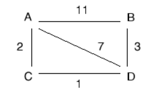

## 2008-2009学年上学期期末试卷（A）

### 说明

- 原卷参考答案从第四大题计算题开始就出现对不上的情况，因此后半部分答案暂缺

### 一、单项选择题（本大题共 15 小题，每小题 2 分，共 30 分）

1. OSI 参考模型的三个主要概念是（ ）。

    A. architecture, model, switch

    B. subnet, layer, primitives

    C. service, interface, protocol

    D. WAN, MAN, LAN

    

    
答案：

    C

    

    ***

2. 在下列传输介质中，哪种传输介质的抗电磁干扰性最好（ ）。

    A. 双绞线

    B. 同轴电缆

    C. 光纤

    D. 无线电磁介质

    

    
答案：

    C

    

    ***

3. 数据链路层中的数据传输基本单位是（ ）。

    A. 比特

    B. 数据帧

    C. 分组

    D. 报文

    

    
答案：

    B

    

    ***

4. PPP 协议是（ ）的协议。

    A. 物理层

    B. 数据链路层

    C. 网络层

    D. 传输层

    

    
答案：

    B

    

    ***

5. 在 OSI 模型中，一个层 N 与它的上层（第 N+1 层）的关系是（ ）。

    A. 第 N 层为第 N+1 层提供服务

    B. 第 N+1 层把从第 N 层接收到的信息添加一个报头

    C. 第 N 层使用第 N+1 层提供的服务

    D. 第 N 层与第 N+1 层相互没有关系

    

    
答案：

    A

    

    ***

6. 下列哪种说法正确（ ）。

    A. 虚电路与电路交换中的电路没有实质不同

    B. 在通信的两站点间只能建立一条虚电路

    C. 虚电路也有连接建立、数据传输、连接释放三阶段

    D. 虚电路的各个结点需要为每个分组单独进行路径选择判定

    

    
答案：

    C

    

    ***

7. 两台计算机利用电话线路传输数据信号时，必备的设备是（ ）。

    A. 网卡

    B. 调制解调器

    C. 中继器

    D. 交换机

    

    
答案：

    B

    

    ***

8. IP 地址为 `139.121.0.0` 的 B 类网络，若要切割为 8 个子网，而且都要连上 Internet，请问子网掩码设为（ ）。

    A. `255.0.0.0`

    B. `255.255.0.0`

    C. `255.255.255.0`

    D. `255.255.224.0`

    

    
答案：

    D

    

    ***

9. 以下（ ）是集线器（Hub）的功能。

    A. 增加区域网络的上传输速度

    B. 增加区域网络的数据复制速度

    C. 连接各电脑线路间的媒介

    D. 以上皆是

    

    
答案：

    C

    

    ***

10. HDLC 是（ ）。

    A. 面向比特型的同步协议

    B. 面向字符型的同步协议

    C. 同步协议

    D. 面向字符计数的同步协议

    

    
答案：

    A

    

    ***

11. 具有 12 个 10M 端口的交换机的总带宽可以达到（ ）bps。

    A. 10M

    B. 100M

    C. 120M

    D. 10/12M

    

    
答案：

    C

    

    ***

12. 若循环冗余码字中信息位为 `L` 位，编码时外加冗余位 `r` 位，则编码效率为（ ）。

    A. `r / (r + L)`

    B. `(r + L) / L`

    C. `L / (r + L)`

    D. `(r + L) / r`

    

    
答案：

    C

    

    ***

13. `100BASE-Tx` 标准网络采用（ ）作为传输介质。

    A. 光纤

    B. 双绞线

    C. 同轴电缆

    D. 电磁介质

    

    
答案：

    B

    

    ***

14. 实现计算机 IP 地址与物理地址映射的协议是（ ）。

    A. IP 协议

    B. ARP 协议

    C. CIDR 协议

    D. NAT 协议

    

    
答案：

    B

    

    ***

15. 三次握手方法用于（ ）。

    A. 传输层连接的建立

    B. 数据链路层的流量控制

    C. 传输层的差错检测

    D. 传输层的流量控制

    

    
答案：

    A

    

### 二、填空题（本大题共 6 小题，每空 1 分，共 10 分）

1. 光纤是现代计算机网络中常用的传输介质，根据光信号在光纤中传输的特性不同，可将光纤分为 $\underline{\qquad(1)\qquad}$ 和 $\underline{\qquad(2)\qquad}$ 两大类。

    

    
答案：

    单模光纤、多模光纤

    

    ***

2. 有两种基本的差错控制编码，即检错码和纠错码，在计算机网络和数据通信中广泛使用的一种检错码为 $\underline{\qquad(3)\qquad}$。

    

    
答案：

    CRC 码

    

    ***

3. 常用的 IP 地址有 A、B、C 三类，`192.168.3.31` 是一个 $\underline{\qquad(4)\qquad}$ 类 IP 地址，其网络标识（`netid`）为 $\underline{\qquad(5)\qquad}$，主机标识（`hosted`）为 $\underline{\qquad(6)\qquad}$。

    

    
答案：

    C、`192.168.3`、`31`

    

    ***

4. 常用的多路复用技术为 FDM（WDM）、TDM 和 $\underline{\qquad(7)\qquad}$，其中 FDM 是同一时间同时传送多路信号，而 TDM 是将一条物理信道按时间分成若干个时间片轮流分配给多个信号使用。

    

    
答案：

    CDMA

    

    ***

5. TCP 协议实现面向连接服务，利用三次握手协议实现连接的建立。在建立连接过程中发送的 TCP 包中包头的 SYN 标识位为 $\underline{\qquad(8)\qquad}$（0/1），FIN 标识位为 $\underline{\qquad(9)\qquad}$（0/1）。

    

    
答案：

    1、0

    

    ***

6. `S1924F+` 交换机中有 `Port VALN` 和 `Tag VALN` 两种工作模式，当要求实现跨交换机划分 VALN 时，交换机应工作在 $\underline{\qquad(10)\qquad}$ 模式。

    

    
答案：

    Tag VALN

    

### 三、名词解释（本大题共 5 小题，每小题 4 分，共 20 分）

1. CSMA/CD

    

    
答案：

    CSMA/CD 的要点就是：监听到信道空闲就发送数据帧，并继续监听下去。如监听到发生了冲突，则立即放弃此数据帧的发送。

    

    ***

2. 拥塞控制

    

    
答案：

    一般来说，当通信子网中有太多的分组时，网络性能降低，这种情况就叫拥塞。根据控制论，拥塞控制方法分为两类：

    （1）开环控制：通过好的设计来解决问题，避免拥塞发生。拥塞控制时，不考虑网络当前状态。

    （2）闭环控制：基于反馈机制。其工作过程：（一）监控系统，发现何时何地发生拥塞；（二）把发生拥塞的消息传给能采取动作的站点；（三）调整系统操作，解决问题。

    

    ***

3. 成帧

    

    
答案：

    成帧是在 OSI 模型物理和数据链路层中的一个过程，通过成帧方法标记帧的开始和结束，使得接收方能从物理层的比特流中分离出数据帧。成帧方法有：字符计数法、字符填充法、位填充法和物理层违例编码法。

    

    ***

4. 网络地址转换协议（NAT）

    

    
答案：

    NAT（Network Address Translation）就是指在一个网络内部，根据需要可以随意自定义的 IP 地址，而不需要经过申请。在网络内部，各计算机间通过内部的 IP 地址进行通讯。而当内部的计算机要与外部 Internet 网络进行通讯时，具有 NAT 功能的设备（比如：路由器）负责将其内部的 IP 地址转换为合法的外部 IP 地址（即经过申请的 IP 地址）进行通信。

    

    ***

5. CRC

    

    
答案：

    CRC 码即循环冗余校验码，它是数据通信中应用最广的一种检验差错方法。发送方将一个数据块看成一个很长的二进制数，然后用一个特定的数（产生式）去除它，将余数作为校验码附在数据块后一起发送；在接收到该数据块和校验码后，对它们进行同样的运算，所得余数应为零，如果不为零表示数据传送出错，并要求发送端再传输。

    

### 四、计算题（本大题共 3 小题，共 20 分）

1. （4 分）找出下列不能分配给主机的 IP 地址，并说明原因。

    A. `131.127.256.80`

    B. `231.202.0.11`

    ***

2. （6 分）画出比特流 `1100010101` 的差分曼彻斯特编码的波形图（初始电平为低）。

    ***

3. （10 分）长度为 1000 位的数据帧，在数据传输速率为 1 Mbps、最大长度为 2 km 的物理线路上传输。假设线路的传输延迟时间为 $5\ \text{ms/km}$，试计算下列协议中的物理通信线路可达到的最大利用率？（数据帧的序列号为 3 位，确认帧的发送时间忽略不计）

    a) 停—等协议

    b) 回退-n 帧的滑动窗口协议

    c) 选择性重传的滑动窗口协议。

### 五、应用题（本大题共 2 小题，共 20 分）

1. （10 分）考虑如下子网，A、B、C、D 为路由器。采用距离矢量路由算法。

    

    （1）分析 A 路由器的路由表中存储的 A 到路由器 B 的距离及形成过程。（3 分）

    （2）假设链路 BD 断开，分析 A 路由器的路由表中存储的 A 到路由器 B 的距离的变化过程。（3 分）

    （3）在链路 BD 断开一段时间后，进一步假设链路 AB 也断开，分析 A 路由器在构造路由表，生成 A 到路由器 B 的距离时会出现什么问题？（4 分）

    ***

2. 现需要对三个校园网 A、B、C 进行 IP 地址分配，其中，A 校园网需要 600 个 IP 地址，B 校园网需要 200 个 IP 地址，C 校园网需要 54 个 IP 地址。现有一批从 `192.168.16.0` 开始的 IP 地址，请写出 IP 地址分配方案，并填写下表。（10 分）

    | 校园网 | 起始 IP 地址 | 结束 IP 地址 | 基地址/子网掩码 |
    | --- | --- | --- | --- |
    | A |  |  |  |
    | B |  |  |  |
    | C |  |  |  |

***

## 2008-2009学年上学期期末试卷（B）（含答案）

### 一、单项选择题（本大题共 10 小题，每小题 2 分，共 20 分）

1. 若无噪声信道的线路带宽为 3kHz，每个码元可能取的离散值的个数为 8 个，则信道的最大数据传输率可达（ ）。

    A. 24kbps

    B. 48kbps

    C. 12kbps

    D. 18kbps

    

    
答案：

    D

    

    ***

2. 以下 IP 地址中为 C 类地址是（ ）。

    A. `123.213.12.23`

    B. `213.123.23.12`

    C. `23.123.213.23`

    D. `132.123.32.12`

    

    
答案：

    B

    

    ***

3. `10Base-T` 以太网中，以下说法不对的是：

    A. 10 指的是传输速率为 10MBPS

    B. Base 指的是基带传输

    C. T 指的是以太网

    D. `10Base-T` 是以太网的一种配置

    

    
答案：

    C

    

    ***

4. NAT 的用途是（ ）。

    A. 通过 IP 地址解析为 MAC 地址

    B. 通过 MAC 地址解析为 IP 地址

    C. 将网络域名解析为 IP 地址

    D. 公网地址与私网地址之间的转换

    

    
答案：

    D

    

    ***

5. 警告位算法是用作网络的（ ）。

    A. 流量控制

    B. 拥塞控制

    C. 路由

    D. 以上都不是

    

    
答案：

    B

    

    ***

6. 一台路由器的路由表中有以下的（CIDR）表项：

    | 地址/掩码 | 下一跳 |
    | --- | --- |
    | `134.52.48.0/20` | 路由器1 |
    | `134.52.56.0/21` | 路由器2 |
    | `134.52.60.0/22` | 路由器3 |
    | `134.52.62.0/23` | 路由器4 |

    对于一个目的 IP 地址为 `134.52.57.33` 的到达分组，该路由器该转发给哪个路由器？

    A. 路由器1

    B. 路由器2

    C. 路由器3

    D. 路由器4

    

    
答案：

    B

    

    ***

7. IP 地址为 `211.111.202.0` 的 C 类网络，若要切割为 6 个子网，而且都要连上 Internet，请问子网掩码设为（ ）。

    A. `255.255.255.0`

    B. `255.255.0.0`

    C. `255.255.255.192`

    D. `255.255.255.224`

    

    
答案：

    D

    

    ***

8. 若数据链路的发送窗口尺寸 `WT = 7`，在发送 4 号帧、并接到 2 号帧的确认帧后，发送方还可连续发送 $\underline{\qquad}$。

    A. 4 帧

    B. 5 帧

    C. 6 帧

    D. 3 帧

    

    
答案：

    B

    

    ***

9. 使用载波信号的两种不同幅度来表示二进制值的两种状态的数据编码方式称为（ ）。

    A. 移幅键控法

    B. 移频键控法

    C. 移相键控法

    D. 幅度相位调制

    

    
答案：

    A

    

    ***

10. 调制解调器（MODEM）的主要功能是（ ）。

    A. 模拟信号的放大

    B. 数字信号的整形

    C. 模拟信号与数字信号的转换

    D. 数字信号的编码

    

    
答案：

    C

    

### 二、判断题（本大题共 5 小题，每小题 2 分，共 10 分）

1. 基带同轴电缆的阻抗为 75 欧姆，具有极好的电磁干扰屏蔽性能。（ ）

    

    
答案：

    错

    

    ***

2. 所有的帧都必须以标志字段开头和结尾。（ ）

    

    
答案：

    对

    

    ***

3. 如果要实现双向同时通信就必须要有两条数据传输线路。（ ）

    

    
答案：

    错

    

    ***

4. 网络中通常使用电路交换、报文交换和分组交换技术。（ ）

    

    
答案：

    对

    

    ***

5. 网桥是属于 OSI 模型中网络层的互联设备。（ ）

    

    
答案：

    错

    

### 三、填空题（本大题共 8 个空，每空 2 分，共 16 分）

1. 采用海明码校验方法，若信息位为 15 位，则冗余位至少为 $\underline{\qquad}$ 位。

    

    
答案：

    5

    

    ***

2. 网桥通过查询其内部的一张表来对一个待转发的帧做出转发决策，这张转发表最初是空的，是通过 $\underline{\qquad}$ 算法来建立起来。

    

    
答案：

    逆向学习

    

    ***

3. IP 地址的主机部分如果全为 1，则表示 $\underline{\qquad}$ 地址，`127.0.0.1` 被称做 $\underline{\qquad}$ 地址。

    

    
答案：

    广播，回环测试

    

    ***

4. 在数据报服务中，网络节点要为每个 $\underline{\qquad}$ 选择路由，在虚电路服务中，网络节点只在 $\underline{\qquad}$ 时为分组选择路由。

    

    
答案：

    每个分组，连接建立

    

    ***

5. 中继器是工作在网络协议栈的 $\underline{\qquad}$ 层。

    

    
答案：

    物理

    

    ***

6. 若 HDLC 帧数据段中出现比特串 `0101111101111110`，则比特填充后的输出为 $\underline{\qquad}$。

    

    
答案：

    `010111110011111010`

    

### 四、名词解释（本大题共 4 小题，每小题 4 分，共 16 分）

1. 频分多路复用（FDM）

    

    
答案：

    在物理信道的可用带宽超过单个原始信号所需带宽的情况下，可将该物理信道的总带宽分割成若干个与传输单个信号带宽相同（或略宽）的子信道，每个子信道传输一路信号，这就是频分多路复用。

    

    ***

2. 地址解析协议（ARP）

    

    
答案：

    在 TCP/IP 环境下，网络层有一组将 IP 地址转换为相应物理网络地址的协议，这组协议即为地址解析协议 ARP。

    

    ***

3. 网络协议（Protocol）

    

    
答案：

    为进行计算机网络中的数据交换而建立的规则、标准或约定的集合称为网络协议（Protocol）。网络协议主要由语义、语法和接口三个要素组成。

    

    ***

4. 网关（Gateway）

    

    
答案：

    能够提供运输层及运输层以上各层协议转换的网络互连设备。

    

### 五、简答题（本大题共 2 小题，共 12 分）

1. 针对 OSI 参考模型和 TCP/IP 参考模型，请列举出两种相同的处理问题方法以及两种不相同的处理问题方法（6 分）。

    

    
答案：

    相同点（2 分）：

    1）基于一系列独立的协议栈

    2）各个层的功能大体相似

    不同点：

    OSI（答对一个给 1 分，满分 2 分）

    1）有很明确的服务、接口和协议区分

    2）很好的符合面向对象编程思想

    3）协议细节被很好的隐藏

    4）OSI 的网络层同时支持无连接和面向连接通信，传输层只支持面向连接通信

    TCP/IP（答对一个给 1 分，满分 2 分）

    1）协议先实现，模型仅是协议的描述。因此模型不适用于其它的协议

    2）TCP/IP 模型没有明确区分服务、接口、协议三者之间的差异

    3）在分层协议环境中，主机至网络层并不是常规意义上层的概念。它是一个接口（位于网络层和数据链路层之间）

    4）TCP/IP 网络层只有无连接通信，传输层同时支持无连接、面向连接两种通信模式

    

    ***

2. 为什么有些网络会使用纠错码，而不使用检错＋重传的机制？请给出两个理由。（6 分）

    

    
答案：

    在错误发生比较频繁的信道上，使用纠错码更好（2 分）。

    理由（答对每个理由得 2 分）：

    1）如果使用检错重传的方法，重传的概率很高；此外重传的数据发生错误的概率依然很大，可能会导致反复的重传，这些过多的重传使信道的吞吐率下降。

    2）使用纠错码还可减小出错重传造成的数据到达时延过高带来的服务质量的影响。

    

### 六、计算题（本大题共 4 小题，共 26 分）

1. 考虑在一条 2km 长的电缆（无中继器）上建立一个 1Gps 速率的 CSMA/CD 网络。信号在电缆中的速度为 `200 000 km/s`。请问最小的帧长度为多少？（4 分）

    

    
答案：

    设帧长为 `L`，一帧数据往返时间为往返距离除以信号传播速度，根据最小帧长要求一帧数据的发送时间应大于一帧数据的往返时间，则可列出不等式：

    `L / 10^9 ≥ 2 × 2000 / (2 × 10^8)`

    求得 `L` 最小为 20000 比特。

    

    ***

2. 对一个无限用户的纯 ALOHA 信道的测试表明，20% 的时槽是空闲的（6 分）。

    （a）信道负载 `G` 是多少（3 分）

    （b）吞吐量是多少？（2 分）

    （c）该信道是负载不足还是过载了，并说明理由（1 分）

    

    
答案：

    （a）（3 分），`P_0 = e^{-G}`，`G = ln(1 / P_0) = ln5 = 1.6`

    （b）（2 分）吞吐量：`S = G e^{-2G} = 0.064`

    （c）（1 分）`G > 0.5`（纯 ALOHA 最优负载时 `G` 为 0.5），过载了。

    

    ***

3. 在一个负载很重（双向流量）的 50kbps 的卫星信道上使用协议 6，数据帧包含 40 位的头和 3960 位的数据，请计算一下浪费在头部和重传的开销占多少比例。假设从地球到卫星的信号传输时间为 270ms。ACK 帧永远不会发生（捎带确认总是很及时）。NAK 帧为 40 位。数据帧的错误率为 1%，NAK 帧的错误率忽略不计。序列号为 8 位。（7 分）

    

    
答案：

    1% 的帧需要重传造成的浪费平均到每个帧上的开销为 `1% × 4000` 比特，每个正常的帧浪费 40 比特的头，NAK 平均到每个帧上的开销为 `40 × 1%`，总的每帧控制开销为 80.4 比特，开销比例为 `80.4 / (3960 + 80.4) = 1.99%`。

    

    ***

4. 网络拓扑结构如下图所示，图中每个节点代表一个路由器，节点之间连线代表一条通信线路，线路旁的数字对应这条线路上的通信距离，请根据最短路径路由（Dijkstra 算法）标出依据 Dijkstra 算法找到从 A 到 D 的最短路径的过程，即依次将图中的节点标记为永久的工作节点的顺序，答案只要依次列出按先后顺序选中的工作节点的序列（7 分），并指出最后计算出的最短路径（2 分）。（共 9 分）

    

    

    
答案：

    依次标记为永久工作节点的顺序为：A，B，F，E，C，D（7 分）

    最短路径为：A，B，E，D（2 分）

    

