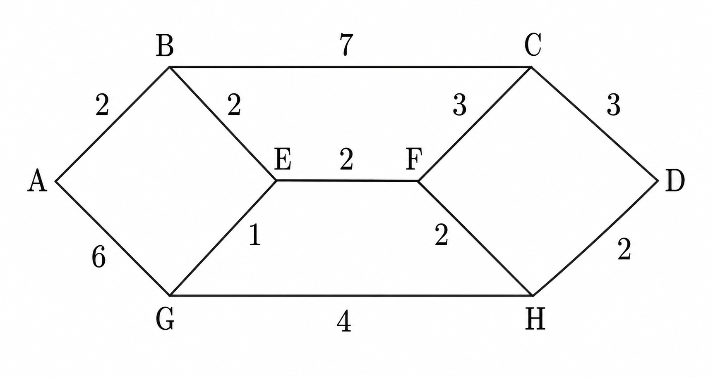
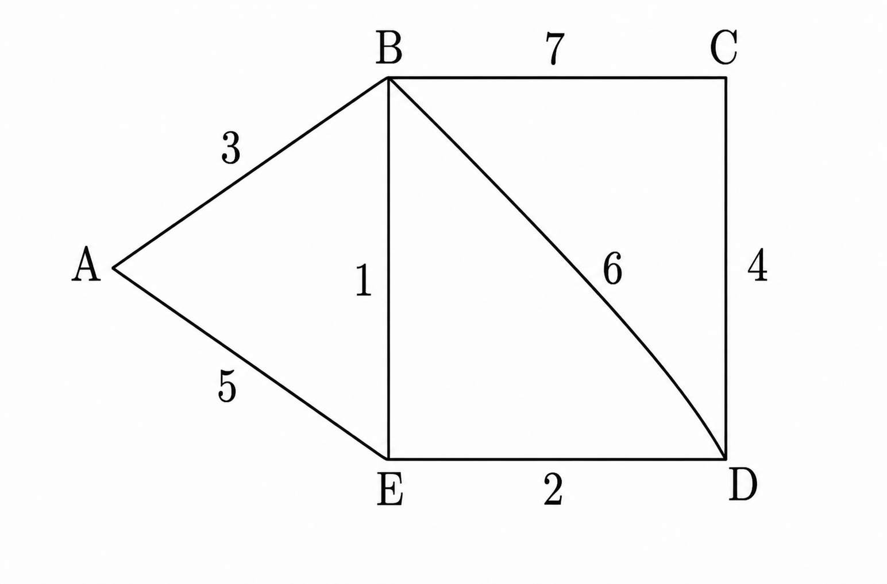

## 2013-2014学年上学期月考试卷（含答案）

### 说明

- 日期：2013.9

### 一、选择题（本大题共 10 小题，每小题 2 分，共 20 分）

1. 采用半双工通信方式，数据传输的方向性结构为（ ）。

    A. 可以在两个方向上同时传输

    B. 只能在一个方向上传输

    C. 可以在两个方向上传输，但不能同时进行

    D. 以上均不对

    

    
答案：

    C

    

    ***

2. 采用异步传输方式，设数据位为 8 位，1 位停止位，无校验位，则其通信效率为（ ）。

    A. 30%

    B. 70%

    C. 80%

    D. 20%

    

    
答案：

    C

    

    ***

3. E1 载波的数据传输率为（ ）。

    A. $1\ \text{Mbps}$

    B. $10\ \text{Mbps}$

    C. $2.048\ \text{Mbps}$

    D. $1.544\ \text{Mbps}$

    

    
答案：

    C

    

    ***

4. 采用相位振幅组合调制技术，可以提高数据传输速率，例如采用 8 种相位，每种相位取 2 种幅度值，可使一个码元（Hz）表示的二进制数的位数为（ ）。

    A. 2 位

    B. 8 位

    C. 16 位

    D. 4 位

    

    
答案：

    D

    

    ***

5. 若网络形状是由站点和连接站点的链路组成的一个闭合环，则称这种拓扑结构为（ ）。

    A. 星形拓扑

    B. 总线拓扑

    C. 环形拓扑

    D. 树形拓扑

    

    
答案：

    C

    

    ***

6. 下面的技术中，（ ）不是多路复用技术。

    A. FDM

    B. TDM

    C. PCM

    D. CDMA

    

    
答案：

    C

    

    ***

7. 下列哪种交换方法被 Internet 所采用？（ ）

    A. 分组交换

    B. 报文交换

    C. 电路交换

    D. 各种方法都一样

    

    
答案：

    C

    

    ***

8. 网络层的主要协议有（ ）。

    A. IP 协议

    B. TCP 协议

    C. UDP 协议

    D. IEEE 802.3 协议

    

    
答案：

    A

    

    ***

9. 利用有线电视网络实现 Internet 访问服务过程中，同轴电缆的上行信道中 Cable Modem 的调制技术采用（ ）。

    A. QPSK

    B. QAM-16

    C. QAM-64

    D. QAM-32

    

    
答案：

    C

    

    ***

10. 以下各项中，不是数据报操作特点的是（ ）。

    A. 每个分组自身携带有足够的信息，它的传送是被单独处理的

    B. 在整个传送过程中，不需建立虚电路

    C. 使所有分组按顺序到达目的端系统

    D. 网络节点要为每个分组做出路由选择

    

    
答案：

    A

    

***

### 二、填空题（本大题共 5 小题，每空 1 分，共 10 分）

11. 串行数据通信的方向性结构有三种，即单工、<u>&emsp;&emsp;&emsp;</u> 和 <u>&emsp;&emsp;&emsp;</u>。

    

    
答案：

    半双工；全双工

    

    ***

12. 模拟信号传输的基础是载波，载波具有三个要素，即频率、<u>&emsp;&emsp;&emsp;</u> 和 <u>&emsp;&emsp;&emsp;</u>。数字数据可以针对载波的不同要素或它们的组合进行调制。

    

    
答案：

    振幅；波长

    

    ***

13. 最常用的两种多路复用技术为 <u>&emsp;&emsp;&emsp;</u> 和 <u>&emsp;&emsp;&emsp;</u>，其中，前者是同一时间同时传送多路信号，而后者是将一条物理信道按时间分成若干个时间片轮流分配给多个信号使用。

    

    
答案：

    频分复用；时分复用

    

    ***

14. 网络协议就是为实现网络中的数据交换建立的规则标准或约定。协议由 <u>&emsp;&emsp;&emsp;</u>、<u>&emsp;&emsp;&emsp;</u> 和 <u>&emsp;&emsp;&emsp;</u> 三部分组成，即协议的三要素。

    

    
答案：

    语法；语义；时序

    

    ***

15. 在 TCP/IP 层次模型中与 OSI 参考模型第四层（传输层）相对应的主要协议有 <u>&emsp;&emsp;&emsp;</u> 和 <u>&emsp;&emsp;&emsp;</u>，其中后者提供无连接的不可靠传输服务。

    

    
答案：

    TCP；UDP

    

***

### 三、名词解释（本大题共 4 小题，每小题 5 分，共 20 分）

16. 多路复用（Multiplexing）

    

    
答案：

    数据通信系统或计算机网络系统中，传输媒体的带宽或容量往往会大于传输单一信号的需求，为了有效地利用通信线路，希望一个信道同时传输多路信号，这就是所谓的多路复用技术（Multiplexing）。

    

    ***

17. 带宽

    

    
答案：

    是指在固定的时间可传输的资料数量，亦即在传输管道中可以传递数据的能力。

    

    ***

18. 网络协议

    

    
答案：

    为计算机网络中进行数据交换而建立的规则、标准或约定的集合。

    

    ***

19. TCP

    

    
答案：

    Transmission Control Protocol，传输控制协议。TCP 是一种面向连接（连接导向）的、可靠的、基于字节流的运输层（Transport layer）通信协议，由 IETF 的 RFC 793 说明（specified）。在简化的计算机网络 OSI 模型中，它完成第四层传输层所指定的功能，UDP 是同一层内另一个重要的传输协议。

    

***

### 四、简答题（本大题共 2 小题，每小题 5 分，共 10 分）

20. 简述光纤网络中无源星型网络和有源中继器网络的不同点。

    

    
答案：

    耦合器使用的是有源中继器。

    如果同时有两台设备发送，不会产生冲突。

    比起无源星型拓扑结构，有源星型结构成本很高。

    

    ***

21. 用原语 Listen、Connect、Send、Receive、Disconnect 说明面向连接服务的具体过程。

    

    
答案：

    服务器执行 Listen 原语，等待连接请求。

    客户端执行 Connect 原语，请求建立连接。

    连接建立后，通信双方使用 Send 和 Receive 原语发送、接收数据。

    数据传输结束后，使用 Disconnect 原语释放连接。

    

## 2013-2014学年上学期月考试卷

### 说明

- 该部分来源仅有图片，且试卷内容不完整。
- 源文件文件名标注为“月考1”。

### 一、选择题（本大题共 20 小题，每小题 2 分，共 40 分）

8. 下列以太网中，采用双绞线作为传输介质的是（ ）。

    A. 10BASE-2

    B. 10BASE-5

    C. 10BASE-T

    D. 10BASE-F

    ***

9. IEEE802.3 标准规定，若采用同轴电缆作为传输介质，在无中继的情况下，传输介质的最大长度不能超过（ ）。

    A. $500\ \text{m}$

    B. $200\ \text{m}$

    C. $100\ \text{m}$

    D. $50\ \text{m}$

    ***

10. 下面四种以太网中，只能工作在全双工模式下的是（ ）。

    A. 10BASE-T 以太网

    B. 100BASE-T 以太网

    C. 吉比特以太网

    D. 10G 比特以太网

    ***

11. 在传统以太网中有 A、B、C、D 四台主机，若 A 向 B 发送信息，则（ ）。

    A. 只有 B 能收到

    B. 4 台主机都能收到

    C. 距离 A 最近的一台主机可以收到

    D. 除 A 外的所有主机都能收到

    ***

12. 在以太网中，大量的广播信息会降低整个网络性能的原因是（ ）。

    A. 网络中的每台计算机都必须为每个广播信息发送一个确认信息

    B. 网络中的每台计算机都必须处理每个广播信息，而且会占用大部分网络带宽

    C. 广播信息要被路由器路由到每个网段

    D. 广播信息不能自动直接传送到目的计算机

    ***

13. 快速以太网仍然使用 CSMA/CD 协议，它采用（ ）而将最大电缆长度减少到 $100\ \text{m}$ 的方法，使以太网的数据传输速率提高至 $100\ \text{Mbps}$。

    A. 改变最短帧长

    B. 改变最长帧长

    C. 保持最短帧长不变

    D. 保持最长帧长不变

    ***

18. 根据报文交换方式的基本原理，可以将其交换系统的功能概括为（ ）。

    A. 存储系统

    B. 转发系统

    C. 存储-转发系统

    D. 传输控制系统

    ***

19. 在距离矢量路由协议中，导致无穷计算问题的主要原因是（ ）。

    A. 由于网络带宽的限制，某些路由更新数据报被丢弃

    B. 由于路由器不知道整个网络的拓扑结构信息，当收到一个路由更新信息时，又将该更新信息发回自己发送该路由信息的路由器

    C. 当一个路由器发现自己的某条直接相连链路断开时，没能将这个变化报告给其它路由器

    D. 慢收敛导致路由器接收了无效的路由信息

    ***

20. 关于链路状态路由协议的描述，（ ）是错误的。

    A. 仅相邻路由器需要交换自己的路由表

    B. 全网路由器的拓扑数据库是一致的

    C. 采用泛洪技术更新链路状态变化信息

    D. 具有快速收敛的优点

### 二、计算题（本大题共 6 小题，每小题 10 分，共 60 分）

1. 若构造一个 CSMA/CD 总线网，速率是 $100\ \text{Mbps}$，信号在电缆中的传播速度是 $2 \times 10^5\ \text{km/s}$，数据帧的最小长度是 $125\ \text{B}$。试求总线电缆的最大长度（假设总线电缆中无中继器）。

    ***

2. 假定在透明网桥上的一台计算机把一个数据帧发给网络上不存在的一个设备，网桥将如何处理这个帧？

    ***

3. 什么是 CSMA/CD 协议？使用 CSMA/CD 协议，采用什么算法解决碰撞冲突？

    ***

4. 在下图所示网络中，采用最短路径路由算法求 D 点到 A 点的信源树和结点 D 的路由表。（信源树是指以组播源作为树根，将组播源到每一个接收者的最短路径结合起来构成的转发树。由于隐源树使用的是从组播源到接收者的最短路径，因此也称为最短路径树）

    （路由器 D 的端口 1 连接 C 路由器，端口 2 连接 H 路由器）

    

    ***

5. 对于下图所示的通信子网，采用距离矢量路由选择算法。当以下矢量刚进入路由器 C：

    来自 B：$(5, 0, 8, 12, 6, 2)$ 表示 B 到 A、B、C、D、E、F 的延迟分别为 5、0、8、12、6、2

    来自 D：$(16, 12, 6, 0, 9, 10)$ 表示 D 到 A、B、C、D、E、F 的延迟分别为 16、12、6、0、9、10

    来自 E：$(7, 6, 3, 9, 0, 4)$ 表示 E 到 A、B、C、D、E、F 的延迟分别为 7、6、3、9、0、4

    C 到 B、D、E 的延迟分别为 6、3、5。请问 C 的路由表是什么？即给出采用的输出线路和预计延迟。

    

    ***

6. 下图是一个子网的拓扑结构及其相邻结点之间的传输延迟，请采用链路状态路由算法进行路由计算。假设报文的 TTL 为 60 秒，给出各结点的初始链路状态报文。

    

## 2013-2014学年上学期月考试卷

### 说明

- 该部分来源仅有图片，且试卷内容不完整。
- 源文件文件名标注为“月考2”。

### 一、选择题（本大题共 20 小题，每小题 2 分，共 40 分）

19. The most common protocol for point-to-point access is the Point-to-Point Protocol (PPP), which is a ______ protocol.

    A. bit-oriented

    B. byte-oriented

    C. character-oriented

    D. none of the above

    ***

20. Both Go-Back-N and Selective-Repeat Protocols use a ______.

    A. sliding frame

    B. sliding window

    C. sliding packet

    D. none of the above

### 二、计算题（本大题共 6 小题，每小题 10 分，共 60 分）

1. Television channels are $6\ \text{MHz}$ wide. How many bits/sec can be sent if four-level digital signals are used?

    Assume a noiseless channel.

    ***

2. A CDMA receiver gets the following chips: $(-1, +1, -3, +1, -1, -3, +1, +1)$. Assuming the chip sequences defined as following, which stations transmitted, and which bits did each one send?

    $A = (-1, -1, -1, +1, +1, -1, +1, +1)$

    $B = (-1, -1, +1, -1, +1, +1, +1, -1)$

    $C = (-1, +1, -1, +1, +1, +1, -1, -1)$

    $D = (-1, +1, -1, -1, -1, -1, +1, +1)$

    ***

3. A bit string, 01111011111011111110, needs to be transmitted at the data link layer. What is the string actually transmitted after bit stuffing?

    ***

4. What is the remainder obtained by dividing $x^7 + x^5 + 1$ by the generator polynomial $x^3 + 1$?
