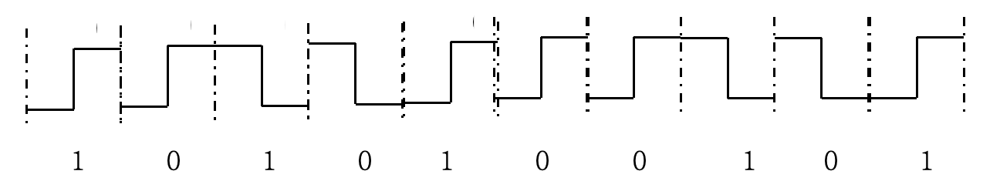
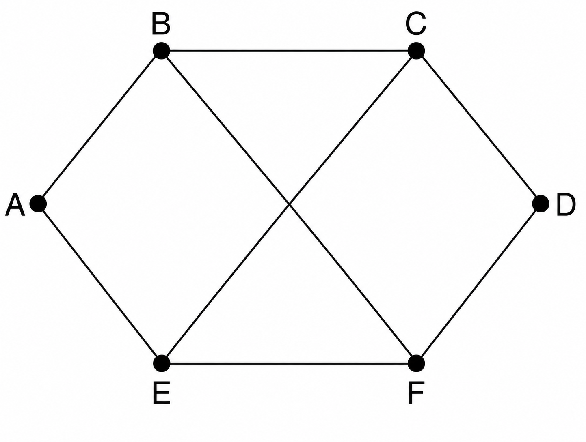

## 2014-2015学年上学期平时测试试卷（含答案）

### 说明

- 日期：2014.11

### 一、单项选择题（本大题共 15 小题，每小题 2 分，共 30 分）

1. OSI 参考模型的三个主要概念是（ ）。

    A. architecture, model, switch

    B. subnet, layer, primitives

    C. service, interface, protocol

    D. WAN, MAN, LAN

    

    
答案：

    C

    

    ***

2. 在下列传输介质中，哪种传输介质的抗电磁干扰性最好（ ）。

    A. 双绞线

    B. 同轴电缆

    C. 光纤

    D. 无线电磁介质

    

    
答案：

    C

    

    ***

3. 数据链路层中的数据传输基本单位是（ ）。

    A. 比特

    B. 数据帧

    C. 分组

    D. 报文

    

    
答案：

    B

    

    ***

4. PPP 协议是（ ）的协议。

    A. 物理层

    B. 数据链路层

    C. 网络层

    D. 传输层

    

    
答案：

    B

    

    ***

5. 在 OSI 模型中，一个层 N 与它的上层（第 N+1 层）的关系是（ ）。

    A. 第 N 层为第 N+1 层提供服务

    B. 第 N+1 层把从第 N 层接收到的信息添加一个报头

    C. 第 N 层使用第 N+1 层提供的服务

    D. 第 N 层与第 N+1 层相互没有关系

    

    
答案：

    A

    

    ***

6. 下列哪种说法正确（ ）。

    A. 虚电路与电路交换中的电路没有实质不同

    B. 在通信的两站点间只能建立一条虚电路

    C. 虚电路也有连接建立、数据传输、连接释放三阶段

    D. 虚电路的各个结点需要为每个分组单独进行路径选择判定

    

    
答案：

    C

    

    ***

7. 两台计算机利用电话线路传输数据信号时，必备的设备是（ ）。

    A. 网卡

    B. 调制解调器

    C. 中继器

    D. 交换机

    

    
答案：

    B

    

    ***

8. IP 地址为 139.121.0.0 的 B 类网络，若要切割为 8 个子网，而且都要连上 Internet，请问子网掩码设为（ ）。

    A. 255.0.0.0

    B. 255.255.0.0

    C. 255.255.255.0

    D. 255.255.224.0

    

    
答案：

    D

    

    ***

9. 以下（ ）是集线器（Hub）的功能。

    A. 增加区域网络的上传输速度

    B. 增加区域网络的数据复制速度

    C. 连接各电脑线路间的媒介

    D. 以上皆是

    

    
答案：

    C

    

    ***

10. HDLC 是（ ）。

    A. 面向比特型的同步协议

    B. 面向字符型的同步协议

    C. 同步协议

    D. 面向字符计数的同步协议

    

    
答案：

    A

    

    ***

11. 具有 12 个 10M 端口的交换机的总带宽可以达到（ ）bps。

    A. 10M

    B. 100M

    C. 120M

    D. 10/12M

    

    
答案：

    C

    

    ***

12. 若循环冗余码字中信息位为 $L$ 位，编码时外加冗余位 $r$ 位，则编码效率为（ ）。

    A. $\dfrac{r}{r+L}$

    B. $\dfrac{r+L}{L}$

    C. $\dfrac{L}{r+L}$

    D. $\dfrac{r+L}{r}$

    

    
答案：

    C

    

    ***

13. 100BASE-Tx 标准网络采用（ ）作为传输介质。

    A. 光纤

    B. 双绞线

    C. 同轴电缆

    D. 电磁介质

    

    
答案：

    B

    

    ***

14. 实现计算机 IP 地址与物理地址映射的协议是（ ）。

    A. IP 协议

    B. ARP 协议

    C. CIDR 协议

    D. NAT 协议

    

    
答案：

    B

    

    ***

15. 调制解调器（MODEM）的主要功能是（ ）。

    A. 模拟信号的放大

    B. 数字信号的整形

    C. 模拟信号与数字信号的转换

    D. 数字信号的编码

    

    
答案：

    C

    

### 二、填空题（本大题共 6 小题，每空 1 分，共 10 分）

1. 光纤是现代计算机网络中常用的传输介质，根据光信号在光纤中传输的特性不同，可将光纤分为 $\underline{\qquad(1)\qquad}$ 和 $\underline{\qquad(2)\qquad}$ 两大类。

    

    
答案：

    单模光纤、多模光纤

    

    ***

2. 有两种基本的差错控制编码，即检错码和纠错码，在计算机网络和数据通信中广泛使用的一种检错码为 $\underline{\qquad(3)\qquad}$。

    

    
答案：

    CRC 码

    

    ***

3. 常用的 IP 地址有 A、B、C 三类，192.168.3.31 是一个 $\underline{\qquad(4)\qquad}$ 类 IP 地址，其网络标识（netid）为 $\underline{\qquad(5)\qquad}$，主机标识（hosted）为 $\underline{\qquad(6)\qquad}$。

    

    
答案：

    C、192.168.3、31

    

    ***

4. 常用的多路复用技术为 FDM（WDM）、TDM 和 $\underline{\qquad(7)\qquad}$，其中 FDM 是同一时间同时传送多路信号，而 TDM 是将一条物理信道按时间分成若干个时间片轮流分配给多个信号使用。

    

    
答案：

    CDMA

    

    ***

5. IP 地址的主机部分如果全为 1，则表示 $\underline{\qquad(8)\qquad}$ 地址，127.0.0.1 被称做 $\underline{\qquad(9)\qquad}$ 地址。

    

    
答案：

    广播、回环测试

    

    ***

6. S1924F+ 交换机中有 Port VALN 和 Tag VALN 两种工作模式，当要求实现跨交换机划分 VALN 时，交换机应工作在 $\underline{\qquad(10)\qquad}$ 模式。

    

    
答案：

    Tag VALN

    

### 三、名词解释（本大题共 5 小题，每小题 4 分，共 20 分）

1. CSMA/CD

    

    
答案：

    CSMA/CD 的要点就是：监听到信道空闲就发送数据帧，并继续监听下去。如监听到发生了冲突，则立即放弃此数据帧的发送。

    

    ***

2. 拥塞控制

    

    
答案：

    一般来说，当通信子网中有太多的分组时，网络性能降低，这种情况就叫拥塞。根据控制论，拥塞控制方法分为两类：

    （1）开环控制：通过好的设计来解决问题，避免拥塞发生。拥塞控制时，不考虑网络当前状态。

    （2）闭环控制：基于反馈机制。其工作过程：（一）监控系统，发现何时何地发生拥塞；（二）把发生拥塞的消息传给能采取动作的站点；（三）调整系统操作，解决问题。

    

    ***

3. 成帧

    

    
答案：

    成帧是在 OSI 模型物理和数据链路层中的一个过程，通过成帧方法标记帧的开始和结束，使得接收方能从物理层的比特流中分离出数据帧。成帧方法有：字符计数法、字符填充法、位填充法和物理层违例编码法。

    

    ***

4. 分段（Fragmentation）

    

    
答案：

    如果源子网的信息包太长，目的子网无法接受，路由器就把它分成更小的包，TCP/IP 协议中把这个过程叫“分段”。

    

    ***

5. CRC

    

    
答案：

    CRC 码即循环冗余校验码，它是数据通信中应用最广的一种检验差错方法。发送方将一个数据块看成一个很长的二进制数，然后用一个特定的数（产生式）去除它，将余数作为校验码附在数据块后一起发送；在接收到该数据块和校验码后，对它们进行同样的运算，所得余数应为零，如果不为零表示数据传送出错，并要求发送端再传输。

    

### 四、计算题（本大题共 4 小题，共 20 分）

1. （5 分）通信的双方采用循环冗余码进行错误检测，假设双方协商的产生式为 $G(x)=x^3+x+1$。当接收方收到如下带循环冗余码的数据帧：$(1702)_{16}$，试分析接收方收到的数据帧是否正确，并说明理由。

    

    
答案：

    （1）$(1702)_{16} = (1,0111,0000,0010)_2$（1 分）

    （2）$G(x)=x^3+x+1$ 对应的产生式（二进制表示）：1011（1 分）

    （3）$(1,0111,0000,0010)_2$ 除以 1011（逻辑除法）得到的余数为 0（2 分）

    （4）因此，接收方收到的数据帧是正确的。（1 分）

    

    ***

2. （5 分）画出比特流 1010100101 的差分曼彻斯特编码的波形图（初始电平为低）。

    

    
答案：

    

    评分标准：共 5 分，每错一个位的波形扣 0.5 分，扣到 0 分为止。

    

    ***

3. （5 分）考虑建立一个 CSMA/CD 网，电缆长度 $1000\ \text{m}$，不使用重发器，运行速率为 $1\ \text{Mbps}$。电缆中的信号速度是 $100\ \text{m/ms}$。问最小帧长度是多少？

    

    
答案：

    假设数据帧的长度为 $L$ 位。

    $t = 1000\ \text{m} / (100\ \text{m/ms}) = 10\ \text{ms} = 10 \times 10^{-3}\ \text{s}$（1 分）

    $T_s = L / 1\ \text{Mbps}$（1 分）

    $T_s \ge 2t$（2 分）

    故数据帧长度 $L \ge 20\ \text{kb}$（1 分）

    

    ***

4. （5 分）对于下图所示的通信子网，采用距离矢量路由选择算法。当以下矢量刚到进入路由器 C：

    来自 B：（5, 0, 8, 12, 6, 2）表示 B 到 A、B、C、D、E、F 的延迟分别为 5，0，8，12，6，2

    来自 D：（16, 12, 6, 0, 9, 10）表示 D 到 A、B、C、D、E、F 的延迟分别为 16，12，6，0，9，10

    来自 E：（7, 6, 3, 9, 0, 4）表示 E 到 A、B、C、D、E、F 的延迟分别为 7，6，3，9，0，4

    C 到 B、D、E 的延迟分别为 6，3，5。请问 C 的路由表是什么？即给出采用的输出线路和预计延迟。

    

    

    
答案：

    | 目的地 | 预计延迟 | 输出线路 |
    | --- | --- | --- |
    | A | 11 | B |
    | B | 6 | B |
    | C | 0 | - |
    | D | 3 | D |
    | E | 5 | E |
    | F | 8 | B |

    评分标准：共 5 分，每错一处扣 0.5 分，扣到 0 分为止。

    

### 五、应用题（本大题共 2 小题，共 20 分）

1. （10 分）一台路由器的路由表中有以下的（CIDR）表项：

    | 地址/掩码 | 下一跳 |
    | --- | --- |
    | 161.40.60.0/22 | 接口 1 |
    | 161.40.56.0/22 | 接口 2 |
    | 192.53.40.0/23 | 路由器 1 |
    | 0.0.0.0/0 | 路由器 2 |

    （1）如果到达分组的目标 IP 地址分别为 161.40.63.10、161.40.52.2 和 192.53.56.7，路由器会执行什么操作？

    （2）若该路由器去往网络 191.7.96.0/21、191.7.104.0/21、191.7.112.0/21 用同一输出线路，都向“接口 3”转发。则如何增加路由表项？

    

    
答案：

    （1）分组的目标地址 / 路由器执行的动作

    161.40.63.10：向“接口 1”转发（2 分）

    161.40.52.2：向“路由器 2”转发（2 分）

    192.53.56.7：向“路由器 2”转发（2 分）

    （2）在 CIDR 表项中缺省路由前增加一项：

    | 地址/掩码 | 下一跳 |
    | --- | --- |
    | 191.7.96.0/19 | 接口 3 |

    （4 分）

    评分标准：共 10 分，每步分析正确得相应分值。

    

    ***

2. （10 分）若窗口序号位数为 3，发送窗口尺寸为 4，采用 Go-back-N 法，试根据发送及接收窗口变化图示分析各图中相继发生了哪些事件？

    

    

    
答案：

    （a）发送 0 号帧（2 分）

    （b）发送 1 号帧（1 分）

    （c）接收 0 号帧（1 分）

    （d）接收 0 号帧的确认（2 分）

    （e）发送 2 号帧（1 分）

    （f）接收 1 号帧（1 分）

    （g）接收 1 号帧的确认（2 分）

    

