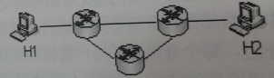
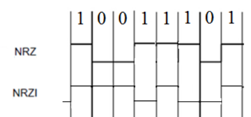
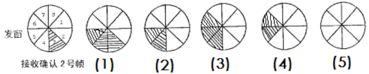
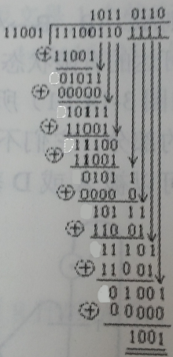

## 2014-2015学年上学期月考试卷（含答案）

### 说明

- 日期：2014.10

### 一、选择题（50 分，每题 2 分）

1. 在 OSI 参考模型中，自下而上第一个提供端到端服务的层次是（ ）。

    A. 数据链路层

    B. 传输层

    C. 会话层

    D. 应用层

    <details>
    <summary>答案：</summary>

    B

    </details>

    ***

2. 下列选项中，不属于网络体系结构所描述的内容是（ ）。

    A. 网络的层次

    B. 每一层使用的协议

    C. 协议的内部实现细节

    D. 每一层必须完成的功能

    <details>
    <summary>答案：</summary>

    C

    </details>

    ***

3. 在不同网络节点的对等层之间的通信需要下列哪一项（ ）。

    A. 模块接口

    B. 对等层协议

    C. 电信号

    D. 传输介质

    <details>
    <summary>答案：</summary>

    B

    </details>

    ***

4. 在 OSI 参考模型的物理层负责下列哪一种功能（ ）。

    A. 格式化报文

    B. 为数据选择通过网络的路由

    C. 定义连接到介质的特征

    D. 提供远程文件访问能力

    <details>
    <summary>答案：</summary>

    C

    </details>

    ***

5. 在下列功能中，哪一个可能属于 OSI 模型的数据链路层（ ）。

    A. 保证数据正确的顺序、无错和完整

    B. 处理信号通过介质的传输

    C. 提供用户与网络的接口

    D. 控制报文通过网络的路由选择

    <details>
    <summary>答案：</summary>

    A

    </details>

    ***

6. 在 OSI 参考模型中，（ ）。

    A. 相邻层之间的联系通过协议进行

    B. 相邻层之间的联系通过会话进行

    C. 对等层之间的联系通过协议进行

    D. 对等层之间的联系通过接口进行

    <details>
    <summary>答案：</summary>

    C

    </details>

    ***

7. 网络协议的三要素是（ ）。

    A. 数据格式、编码、信号电平

    B. 数据格式、流量控制、拥塞控制

    C. 语法、语义、交换规则

    D. 编码、控制信息、同步

    <details>
    <summary>答案：</summary>

    C

    </details>

    ***

8. 通信子网为网络源结点与目的结点之间提供了多条传输路径的可能性，路由选择指的是（ ）。

    A. 建立并选择一条物理链路

    B. 建立并选择一条逻辑链路

    C. 网络中间结点收到一个分组后，确定转发分组的路径

    D. 选择通信介质

    <details>
    <summary>答案：</summary>

    C

    </details>

    ***

9. 在 OSI 参考模型中，会话层是建立在（ ）提供的服务之上，又向（ ）提供服务。

    A. 物理层、网络层

    B. 数据链路层、传输层

    C. 传输层、表示层

    D. 表示层、应用层

    <details>
    <summary>答案：</summary>

    C

    </details>

    ***

10. 在下列协议中，属于传输层的无连接协议的是（ ）。

    A. HTTP

    B. FTP

    C. TCP

    D. UDP

    <details>
    <summary>答案：</summary>

    D

    </details>

    ***

11. 下列不属于数据链路层的功能是（ ）。

    A. 使用滑动窗口协议进行流量控制

    B. 提供数据的透明传输机制

    C. 为应用进程之间提供端到端的可靠通信

    D. 将 IP 分组封装成帧

    <details>
    <summary>答案：</summary>

    C

    </details>

    ***

12. 在无噪声情况下，若某通信链路的带宽为 3 KHz，采用 4 个相位，每个相位具有 4 种振幅的 QAM 调制技术，则该通信链路的最大数据传输速率是（ ）。

    A. 12 kbps

    B. 24 kbps

    C. 48 kbps

    D. 96 kbps

    <details>
    <summary>答案：</summary>

    B

    </details>

    ***

13. 在下图中所示的采用“存储—转发”方式的分组交换网络中，所有链路的数据传输速率为 100 Mbps，分组大小为 1000 B，其中分组头大小为 20 B。若主机 H1 向主机 H2 发送一个大小为 980000 B 的文件，则在不考虑分组拆装时间和传播延迟的情况下，从 H1 发送到 H2 接收完为止，需要的时间至少是（ ）。（提示：在两个路由器处的分组延迟各为 0.08 ms）

    

    A. 80 ms

    B. 80.08 ms

    C. 80.16 ms

    D. 80.24 ms

    <details>
    <summary>答案：</summary>

    C

    </details>

    ***

14. 两个网段在物理层进行互联时要求（ ）。

    A. 数据传输率和数据链路层协议都不相同

    B. 数据传输率和数据链路层协议都相同

    C. 数据传输率相同，数据链路层协议可不相同

    D. 数据传输率可不同，数据链路层协议相同

    <details>
    <summary>答案：</summary>

    C

    </details>

    ***

15. 用 PCM 对语音进行数字化，如果将声音分为 128 个量化级，采样频率为 8000 次/s，那么一路语音需要的数据传输率为（ ）。

    A. 56 kbps

    B. 64 kbps

    C. 128 kbps

    D. 1024 kbps

    <details>
    <summary>答案：</summary>

    A

    </details>

    ***

16. 采样下列哪种传输方式，由网络负责差错控制和流量控制，分组按顺序被提交（ ）。

    A. 电路交换

    B. 报文交换

    C. 虚电路分组交换

    D. 数据报分组交换

    <details>
    <summary>答案：</summary>

    C

    </details>

    ***

17. 在网络中，将语音与计算机产生的数字、文字、图形与图像同时传输，必须把语音信号数字化。利用什么技术可以将语音信号数字化（ ）。

    A. 曼彻施特编码

    B. QAM

    C. 差分曼彻施特编码

    D. PCM

    <details>
    <summary>答案：</summary>

    D

    </details>

    ***

18. 信道容量是带宽与信噪比的函数，以下哪一个术语用来描述这种关系（ ）。

    A. Shannon 原理

    B. 带宽

    C. Nyquist 原理

    D. 傅里叶原理

    <details>
    <summary>答案：</summary>

    A

    </details>

    ***

19. 下列关于单模光纤的描述正确的是（ ）。

    A. 单模光纤的成本比多模光纤的成本低

    B. 单模光纤的传输距离比多模光纤短

    C. 光在单模光纤中通过内部反射来传播

    D. 单模光纤的直径比多模光纤小

    <details>
    <summary>答案：</summary>

    D

    </details>

    ***

20. 在下列传输介质中，错误率最低的是（ ）。

    A. 同轴电缆

    B. 光缆

    C. 微波

    D. 双绞线

    <details>
    <summary>答案：</summary>

    B

    </details>

    ***

21. 在串行传输中，所有的数据字符的比特（ ）。

    A. 在多根导线上同时传输

    B. 在同一根导线上同时传输

    C. 在传输介质上一次传输一位

    D. 以一组 16 位的形式在传输介质上传输

    <details>
    <summary>答案：</summary>

    C

    </details>

    ***

22. 波特率等于（ ）。

    A. 每秒传输的比特

    B. 每秒钟可能发生的信号变化的次数

    C. 每秒传输的周期数

    D. 每秒传输的字节数

    <details>
    <summary>答案：</summary>

    B

    </details>

    ***

23. 半双工支持哪种类型的数据流（ ）。

    A. 一个方向

    B. 同时在两个方向上

    C. 两个方向，但每一时刻仅可以在一个方向上有数据流

    D. 以上都不是

    <details>
    <summary>答案：</summary>

    C

    </details>

    ***

24. 在选择性重传协议中，当帧的序号字段为 3 位，且接收窗口与发送窗口尺寸相同时，发送窗口的最大尺寸为（ ）。

    A. 2

    B. 4

    C. 6

    D. 8

    <details>
    <summary>答案：</summary>

    B

    </details>

    ***

25. 若 HDLC 帧的数据段中出现比特串 `010111110101`，为解决透明传输，则比特填充后的输出是（ ）。

    A. `0100111110101`

    B. `010111110101`

    C. `0101111010101`

    D. `0101111100101`

    <details>
    <summary>答案：</summary>

    D

    </details>

***

### 二、填空（15 分，每空 1 分）

1. 串行数据通信的方向性结构有三种，即（ ）、（ ）和（ ）。

    <details>
    <summary>答案：</summary>

    单工、半双工、全双工

    </details>

    ***

2. 数字数据可以针对载波的不同要素或它们的组合进行调制，有三种基本的数字调制形式，即（ ）、（ ）和（ ）。

    <details>
    <summary>答案：</summary>

    频率调制、振幅调制、相位调制

    </details>

    ***

3. 模拟信号变换为数字信号的常用方法是脉冲编码调制（PCM），其主要步骤为（ ）、（ ）和（ ）。

    <details>
    <summary>答案：</summary>

    取样、量化、编码

    </details>

    ***

4. OSI 的网络层处于（ ）层提供的服务之上，为（ ）层提供服务。

    <details>
    <summary>答案：</summary>

    数据链路；传输

    </details>

    ***

5. TCP/IP 体系结构中的 TCP 和 IP 协议分别位于（ ）层和（ ）层。

    <details>
    <summary>答案：</summary>

    传输；网络

    </details>

    ***

6. ATM 网络中的传输单位称为信元，信元长度为（ ）字节。

    <details>
    <summary>答案：</summary>

    53

    </details>

    ***

7. 超五类非屏蔽双绞线由（ ）对导线组成。

    <details>
    <summary>答案：</summary>

    4

    </details>

***

### 三、综合题（35 分）

1. 在基带网络中，请用 NRZ（不归零）编码和 NRZI（反向不归零）编码对二进制数据流 `10011101` 进行编码（画出波形图）。（5 分）

    <details>
    <summary>答案：</summary>

    NRZ：1 高 0 低

    NRZI：1 跳变 0 不变

    

    </details>

    ***

2. 使用海明码发送 16 位长的报文，需要多少位检测位可以保证接收方能够检测并纠正单个位错？说明对于报文 `1101001100110101`，发送的海明码。假定在海明码中使用偶校验。（5 分）

    <details>
    <summary>答案：</summary>

    $m+r+1 \leq 2^r$（$m$：信息位位数，$r$：检测位位数），题中 $m=16$，故 $r=5$。

    报文：`1101001100110101`，对应的海明码为：`0 11 1101 10011001 110101`

    </details>

    ***

3. 试根据发送滑动窗口变化过程，在下图所示各发送窗口下标出“发送帧序号”或“接收确认帧序号”说明。（参照第一窗口说明）（5 分）

    

    <details>
    <summary>答案：</summary>

    发送了 4 号数据帧；5 号数据帧

    接收了 3 号数据帧的确认

    发送了 6 号数据帧

    接收了 4 号数据帧的确认

    接收了 5 号数据帧的确认；接收了 6 号数据帧的确认

    </details>

    ***

4. 某 CDMA 接收方收到一条如下芯片系列：`(-1 +1 -3 +1 -1 -3 +1 +1)`，假设芯片序列为：A：`00101110`，B：`01011100`，C：`00011011`，D：`01000010`，试分析哪些站点发送了数据？发送了何种数据。（8 分）

    <details>
    <summary>答案：</summary>

    $$
    ((-1,+1,-3,+1,-1,-3,+1,+1) \cdot A)/8 = -1
    $$

    $$
    ((-1,+1,-3,+1,-1,-3,+1,+1) \cdot B)/8 = 0
    $$

    $$
    ((-1,+1,-3,+1,-1,-3,+1,+1) \cdot C)/8 = +1
    $$

    $$
    ((-1,+1,-3,+1,-1,-3,+1,+1) \cdot D)/8 = +1
    $$

    说明：收到的芯片系列 `(-1 +1 -3 +1 -1 -3 +1 +1)` 中，A、C、D 发送了数据，B 没有发送数据。A 发送了数据 0，C、D 发送了数据 1。

    </details>

    ***

5. 在一个数据链路层协议中，使用如下字符编码：A `01000111`；B `11100011`；FLAG `01111110`；ESC `11100000`。在使用下列成帧方法的情况下，说明为传送 4 个字符 A、B、ESC、FLAG 所组织的帧实际发送的二进制序列。（6 分）

    （1）字符计数法

    （2）字符填充法

    （3）位填充法

    <details>
    <summary>答案：</summary>

    字符计数法：5 A B ESC FLAG

    ```text
    00000101,01000111,11100011,11100000,01111110
    ```

    字符填充法：FLAG A B ESC ESC ESC FLAG FLAG

    ```text
    01111110,01000111,11100011,11100000,11100000,11100000,01111110,01111110
    ```

    位填充法：5 个 1 后加 1 个 0，头尾不加（1111110 可识别，1111111 错误）

    ```text
    01111110,01000111,110100011,111000000,011111010,01111110
    ```

    </details>

    ***

6. 通信过程中，使用 CRC 进行错误检测，双方采用生成多项式是 `11001`。假设接收方收到一个带 CRC 的数据帧：`111001101111`，试判断其收到的数据帧是否正确？（要求给出检验过程）（6 分）

    <details>
    <summary>答案：</summary>

    在接收端，收到的海明码用与发送端相同的产生式进行除法运算，如果传输中无错误发生，则余数为 0；余数不为零，则说明有传输错误。如图所示，除法运算后余数为 `1001`，表明传输过程有错误，收到的数据帧是错误的。

    

    </details>
