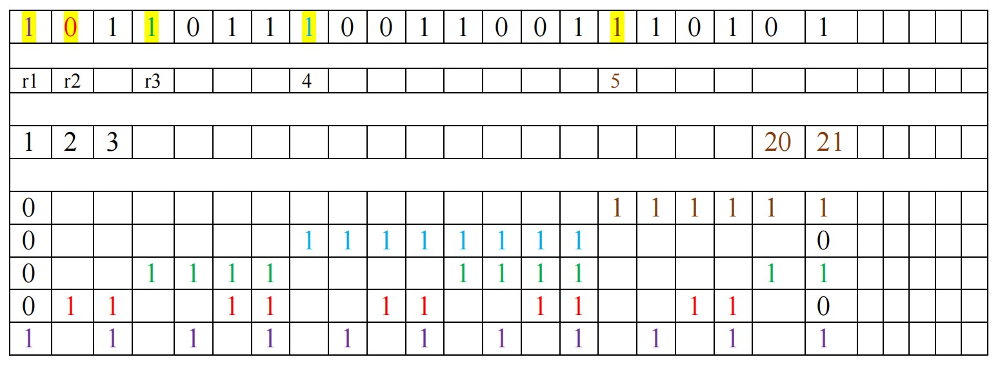
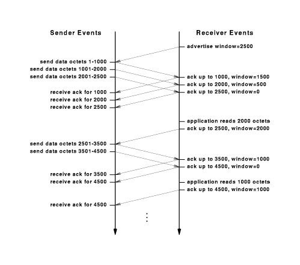

## 2014-2015学年上学期期末试卷（A）（含答案）

### 一、Single choice（30 score）

1. The sixth version of IP protocol has the following characteristics ( ).

    A. the length of the address is 128-bit

    B. no fragmentation

    C. using single-header

    D. using connection orientation

    <details>
    <summary>答案：</summary>

    A

    </details>

    ***

2. When users send e-mail, protocol they use is ( ).

    A. FTP

    B. POP

    C. SMTP

    D. MAIL

    <details>
    <summary>答案：</summary>

    C

    </details>

    ***

3. Which of the following protocols directly encapsulate their packets in IP packets for transmission? ( )

    A. ICMP

    B. 802.11

    C. SNMP

    D. SMTP

    <details>
    <summary>答案：</summary>

    A

    </details>

    ***

4. Which of the following addresses are valid Ethernet physical addresses? ( )

    A. `08-00-33-4Y-12-DE`

    B. `00-1C-C4-7A-41-76`

    C. `10.60.40.23`

    D. `192.168.10.44`

    <details>
    <summary>答案：</summary>

    B

    </details>

    ***

5. Which of the following transmission control mechanisms can be used in wide area network? ( )

    A. CSMA/CD

    B. token mechanism

    C. store-and-forward

    D. ALOHA

    <details>
    <summary>答案：</summary>

    C

    </details>

    ***

6. Which of the following protocols are application layer protocols in TCP/IP network model? ( )

    A. TCP

    B. HTTP

    C. ARP

    D. ICMP

    <details>
    <summary>答案：</summary>

    B

    </details>

    ***

7. Which of the following addresses is valid class B IP addresses? ( )

    A. `202.168.0.56`

    B. `10.60.43.5`

    C. `162.45.34.57`

    D. `132.306.5.0`

    <details>
    <summary>答案：</summary>

    C

    </details>

    ***

8. The network setting for each host is pointing to a local DNS server. If the host wants to resolve domain name `www.xxx.com`, its local DNS server doesn’t have this domain name record. So, the server which returns the result of domain name resolution to the host is ( ).

    A. `xxx.com` domain name server

    B. the root server

    C. the local DNS server

    D. `com` domain name server

    <details>
    <summary>答案：</summary>

    C

    </details>

    ***

9. Byte stuffing means adding a special byte to the data section of the frame when there is a character with the same pattern as the ( ).

    A. header

    B. trailer

    C. flag

    D. none of the above

    <details>
    <summary>答案：</summary>

    C

    </details>

    ***

10. Which of the following addresses may be valid IP host addresses? ( )

    A. `40.2.7.21`

    B. `112.255.255.0`

    C. `201.216.232.0`

    D. `193.44.46.255`

    <details>
    <summary>答案：</summary>

    A

    </details>

    ***

11. Twisted pair Ethernet belongs to ( ).

    A. bus network

    B. ring network

    C. token ring network

    D. wireless network

    <details>
    <summary>答案：</summary>

    A

    </details>

    ***

12. The ( ) of errors is more difficult than the ( ).

    A. correction; detection

    B. detection; correction

    C. creation; correction

    D. creation; detection

    <details>
    <summary>答案：</summary>

    A

    </details>

    ***

13. Which of the following addresses may be valid IP address masks? ( )

    A. `255.255.255.16`

    B. `255.0.0.64`

    C. `255.255.255.192`

    D. `255.255.255.15`

    <details>
    <summary>答案：</summary>

    C

    </details>

    ***

14. The usage of shield for communication cable can ( ).

    A. to reduce the signal attenuation

    B. to reduce the interference of electromagnetic radiation

    C. to improve the tensile strength（抗拉强度）of the cable

    D. to reduce the impedance（阻抗）of the cable

    <details>
    <summary>答案：</summary>

    B

    </details>

    ***

15. ( ) in the data link layer separates a message from one source to a destination, or from other messages going from other sources to other destinations.

    A. Digitizing

    B. Controlling

    C. Framing

    D. none of the above

    <details>
    <summary>答案：</summary>

    C

    </details>

***

### 二、Calculation questions（10 score）

1. （4 score）Television channels are 6 MHz wide. How many bits/sec can be sent if four-level digital signals are used? Assume a noiseless channel.

    <details>
    <summary>答案：</summary>

    Nyquist Themory:

    $$
    \text{最大数据传输速率}=2H\log_2V
    $$

    （2 分）

    $$
    =2\times 6\times \log_2 4=24\text{ Mbps}
    $$

    （2 分）

    </details>

    ***

2. （6 score）Sixteen-bit messages are transmitted using a Hamming code. How many check bits are needed to ensure that the receiver can detect and correct single-bit errors? Show the bit pattern transmitted for the message `1011001100110101`. Assume that even parity is used in the Hamming code.

    <details>
    <summary>答案：</summary>

    $m+r+1 \leq 2^r$（$m$：信息位，$r$：检测位），题中 $m=16$，故 $r=5$，即需要 5 位检测位。（2 分）

    报文 `1011001100110101` 对应的海明码为：（3 分）

    ```text
    101101110011001110101
    ```

    

    </details>

***

### 三、Short answer（40 score）

1. （10 score）In transport layer, the most common used flow control technique is sliding window, both OSI network model and TCP/IP network model use this technique, please answer the following question:

    （1）Please briefly describe the mechanism of sliding window, the process mechanism of the sending side and the receiving side considering the scene of large quantity packages, package lost and disorder packages.

    （2）Please give an example to illustrate the mechanism of sliding window.

    <details>
    <summary>答案：</summary>

    （1）滑动窗口机制（6 分）

    设定窗口大小为 $W$，需要发送多个数据段。

    发送端：

    1）每当从会话层新收到一个包，将其发出，其顺序号就代表了当前最高值的顺序号，发送窗口减小，并启动记时时钟；

    2）如果窗口达到最大尺寸，就必须停止发送。否则，转向 1），继续发送；

    3）如果时钟结束前，没有收到确认包，说明包已经丢失，重新发送该包；

    4）如果时钟结束前，收到了确认包，说明包已收到，窗口扩大；可以继续发送，转向 2）。

    接收端也维持一组顺序号，对应预料将要收到的帧的序号，防止乱序；

    1）接收一个包。

    2）如果收到包的帧序号小于预料的顺序号，说明是个重复包，丢弃该包；

    3）如果接收包的顺序号大于预料的顺序号，说明是乱序包，就加入到等候列表中；

    4）如果收到包的帧序号恰好等于预料的顺序号，说明是需要接收的包，就将包内容提取并提交给应用层，生成并返回确认包，预料的顺序号增加；

    5）检查等候列表中数据包，转向 4）。

    （2）滑动窗口机制，试举一例（4 分）

    

    </details>

    ***

2. （10 score）Modern computer networks generally use dynamic routing algorithms. Two dynamic algorithms in particular, distance vector routing and link state routing, are the most popular. Please answer the following question:

    （1）What is the difference between distance vector routing and link state routing?

    （2）Explain what the count-to-infinity problem is with distance vector routing.

    <details>
    <summary>答案：</summary>

    （1）运行距离矢量路由协议的路由器只与其直连邻居路由器共享它知道的所有路由信息。距离是根据度量值来计算的，方向是根据下一跳路由来定义的。路由更新采用定期向所有直连邻居路由器发送全部路由表项实现。当一条链路发生故障时，意味着需通告多条涉及到的路由条目。容易产生无穷计算问题，必须采用防环机制，所以网络规模越大，其收敛速度也就越慢。（3 分）

    运行链路状态路由协议的路由器，将它所直连的链路状态与一个域内或一个区域内的所有路由器共享，路由更新采用触发式更新。每台路由器的路由信息都是自己根据收到的其他路由器链路状态信息形成网络拓扑表，通过最短路径优先算法最终形成路由表。一条重要链路的变化，不必再发送所有被波及的路由条目，只需发送一条链路通告，告知其它路由器本链路发生故障即可。其它路由器会根据链路状态，改变自已的网络拓扑表，重新计算路由条目。加快了路由器的收敛速度。（3 分）

    （2）距离矢量路由协议直接传送各自的路由表信息。网络中的路由器从自己的直连邻居路由器得到路由信息，并将这些路由信息连同自己的本地路由信息发送给其他直连邻居，这样一级级的传递下去以达到全网同步。每个路由器都不了解整个网络拓扑，它们只知道与自己直接相连的网络情况，并根据从邻居得到的路由信息更新自己的路由。距离矢量路由协议收敛速度慢，当某个路由器从整个子网中脱离时，其他路由器到该路由器的路由信息计算时，会因为回路、收敛速度等因素产生无穷计算问题。（4 分）

    </details>

    ***

3. （10 score）The MAC sublayer is especially important in LANs, many of which use a multiaccess channel as the basis for communication. Please answer the following question:

    （1）How can a station detect a collision?

    （2）Ethernet is a popular CSMA/CD protocol. Explain how it works.

    <details>
    <summary>答案：</summary>

    （1）当站点在发送数据时，也将该站设置成连续接收模式。通过比较其发送的数据与接收的数据是否相同来检测冲突。如果发送数据和接收数据不同，则表明其他站点也同时在发送数据，线路出现冲突。（5 分）

    （2）

    1）站点发送数据之前，先侦测线路是否为空闲。若线路空闲，传输；否则，转 2）。

    2）若线路忙，一直监听直到信道空闲然后立即传输。

    3）若在传输中监听到冲突，发出一个短小的人为干扰信号让所有的站点都知道发生了冲突并停止传输。

    4）发完人为干扰信号，根据二进制指数后退算法等待一段随机的时间，再次试图传输。（从第 1 步开始重复）（5 分）

    </details>

    ***

4. （10 score）Explain the principle working of a virtual LAN (VLAN), assuming that only switches are used to connect hosts.

    <details>
    <summary>答案：</summary>

    VLAN 是为解决以太网的广播问题和安全性而提出的一种协议，它在以太网帧的基础上增加了 VLAN 头，用 VLAN ID 把用户划分为更小的工作组，限制不同工作组间的用户二层互访，每个工作组就是一个虚拟局域网。虚拟局域网的好处是可以限制广播范围，并能够形成虚拟工作组，动态管理网络。（2 分）

    VLAN 是基于 802.1Q 协议的 VLAN ID 来划分不同的 VLAN，当数据帧通过交换机的时候，交换机根据帧中 TAG 头的 VID 信息来识别它们所在的 VLAN，如果数据帧中无 TAG 头，则使用数据帧所通过交换机端口的缺省 VID 信息来识别它们所在的 VLAN，这使得所有属于该 VLAN 的数据帧，不管是单址帧、多址帧还是广播帧，都将限制在该逻辑 VLAN 中传播。这将使组中主机之间能够相互彼此通信，而不受其它主机的影响，就像它们存在于单独的物理网段当中一样。（8 分）

    </details>

***

### 四、Comprehensive title（20 score）

There are three Ethernet LANs which are connected by three routers in the enterprise internal network. As shown below:


Please structure the routing table for each above router in order that the network `192.168.1.0/24` and `192.168.3.0/24` could visit the network `192.168.2.0/24`, but they could not visit each other. Please answer the following questions:

1. The structure of router A

    （1）Configure IP address and mask address

    `F01 = ( )`

    `S01 = ( )`

    （2）Configure route table

2. The structure of router B

    （1）Configure IP address and mask address

    `F01 = ( )`

    `S00 = ( )`

    `S01 = ( )`

    （2）Configure route table

3. The structure of router C

    （1）Configure IP address and mask address

    `F01 = ( )`

    `S01 = ( )`

    （2）Configure route table

4. Now assume that there is a host which IP address is `192.168.1.12` in the network which IP address is `192.168.1.0/24`. This host type the command `ping 192.168.2.100` and receive a successful response. Please describe the frames and IP packages which are generated in this process and describe the changes of their heads in this process.

<details>
<summary>答案：</summary>

1. Router A（2 分）

    `F01 = 192.168.1.1  255.255.255.0`（0.5 分）

    `S01 = 202.1.1.1  255.255.255.0`（0.5 分）

    Route table（1 分）：

    | Destination | Mask | Next Hop |
    | --- | --- | --- |
    | `192.168.2.0` | `255.255.255.0` | `202.1.1.2` |
    | `192.168.1.0` | `255.255.255.0` | Direct |
    | `202.1.1.0` | `255.255.255.0` | Direct |

    ***

2. Router B（3 分）

    `F01 = 192.168.2.1  255.255.255.0`（0.5 分）

    `S00 = 202.1.1.2  255.255.255.0`（0.5 分）

    `S01 = 202.1.2.2  255.255.255.0`（0.5 分）

    Route table（1.5 分）：

    | Destination | Mask | Next Hop |
    | --- | --- | --- |
    | `192.168.1.0` | `255.255.255.0` | `202.1.1.1` |
    | `192.168.3.0` | `255.255.255.0` | `202.1.2.1` |
    | `192.168.2.0` | `255.255.255.0` | Direct |
    | `202.1.1.0` | `255.255.255.0` | Direct |
    | `202.1.2.0` | `255.255.255.0` | Direct |

    ***

3. Router C（2 分）

    `F01 = 192.168.3.1  255.255.255.0`（0.5 分）

    `S01 = 202.1.2.1  255.255.255.0`（0.5 分）

    Route table（1 分）：

    | Destination | Mask | Next Hop |
    | --- | --- | --- |
    | `192.168.2.0` | `255.255.255.0` | `202.1.2.2` |
    | `192.168.3.0` | `255.255.255.0` | Direct |
    | `202.1.2.0` | `255.255.255.0` | Direct |

    ***

4. 报文头变化

    :::info
    题目中主机执行的是 `ping 192.168.2.100`，因此按通信过程，请求报文的 IP 层目的地址通常应为 `192.168.2.100`，返回报文的 IP 层源地址通常应为 `192.168.2.100`。但参考答案在 IP Datagram Header 部分写为 `DST IP Address=192.168.2.1` 与 `SRC IP Address=192.168.2.1`，这里更像是将目的主机地址写成了 Router B 在 `192.168.2.0/24` 网段上的接口地址。后续 Frame Header 部分仍然围绕 `192.168.2.100` 展开，考查点仍是 IP 地址在端到端传输中保持不变、链路层 MAC 地址逐跳变化。
    :::

    IP Datagram Header（3 分）：

    `SRC IP Address = 192.168.1.12, DST IP Address = 192.168.2.1`，在各链路中保持不变。

    `SRC IP Address = 192.168.2.1, DST IP Address = 192.168.1.12`，在各链路中保持不变。

    Frame Header:

    `192.168.1.12 -> 192.168.1.1`（2 分）：

    | Data Link | SRC Physical Address | DST Physical Address |
    | --- | --- | --- |
    | `(arp-request) 192.168.1.12 -> Broadcast` | MAC Address for `192.168.1.12` | `FF:FF:FF:FF:FF:FF` |
    | `(arp-response) 192.168.1.1 -> 192.168.1.12` | MAC Address for `192.168.1.1` | MAC Address for `192.168.1.12` |
    | `(ip) 192.168.1.12 -> 192.168.1.1` | MAC Address for `192.168.1.12` | MAC Address for `192.168.1.1` |

    `RouterA -> RouterB`（2 分）：

    | Data Link | SRC Physical Address | DST Physical Address |
    | --- | --- | --- |
    | `(arp-request) 202.1.1.1 -> Broadcast` | MAC Address for `202.1.1.2` | `FF:FF:FF:FF:FF:FF` |
    | `(arp-response) 202.1.1.2 -> 202.1.1.1` | MAC Address for `202.1.1.2` | MAC Address for `202.1.1.1` |
    | `(ip) RouterA -> RouterB` | MAC Address for `202.1.1.1` | MAC Address for `202.1.1.2` |

    `RouterB -> 192.168.2.100`（3 分）：

    | Data Link | SRC Physical Address | DST Physical Address |
    | --- | --- | --- |
    | `(arp-request) 192.168.2.1 -> Broadcast` | MAC Address for `192.168.2.100` | `FF:FF:FF:FF:FF:FF` |
    | `(arp-response) 192.168.2.100 -> 192.168.2.1` | MAC Address for `192.168.2.100` | MAC Address for `192.168.2.1` |
    | `(ip) 192.168.2.1 -> 192.168.2.100` | MAC Address for `192.168.2.1` | MAC Address for `192.168.2.100` |

    返回（3 分）：

    | Data Link | SRC Physical Address | DST Physical Address |
    | --- | --- | --- |
    | `(ip) 192.168.2.100 -> 192.168.2.1` | MAC Address for `192.168.2.100` | MAC Address for `192.168.2.1` |
    | `(ip) RouterB -> RouterA` | MAC Address for `202.1.1.2` | MAC Address for `202.1.1.1` |
    | `(ip) RouterA -> 192.168.1.12` | MAC Address for `192.168.1.1` | MAC Address for `192.168.1.12` |

</details>
