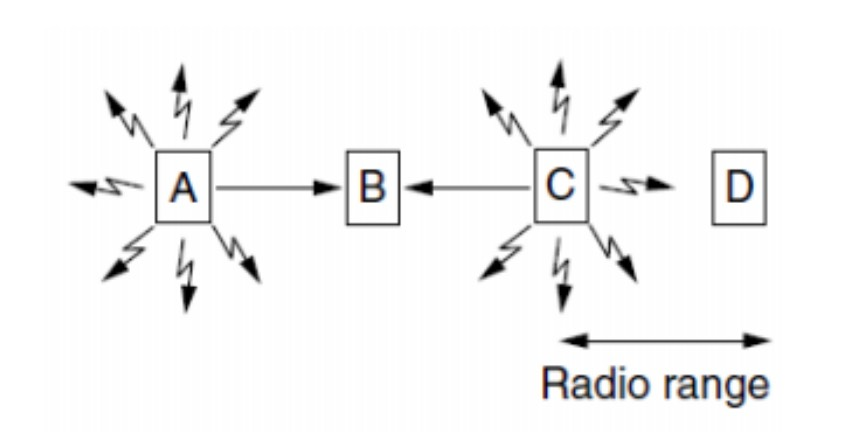

## 2015-2016学年下学期期中试卷（含答案）

### 一、单项选择题（本大题共 10 小题，每小题 2 分，共 20 分）

1. OSI 模型中的第二、第三、第四、第六层分别是（ ）。

    A. 物理层、网络层、会话层、传输层

    B. 数据链路层、网络层、传输层、会话层

    C. 物理层、数据链路层、传输层、应用层

    D. 数据链路层、网络层、传输层、表示层

    <details>
    <summary>答案：</summary>

    D

    </details>

    ***

2. 在下列传输介质中，哪种介质的典型传输速率最高？（ ）

    A. 双绞线

    B. 光缆

    C. 同轴电缆

    D. 无线介质

    <details>
    <summary>答案：</summary>

    B

    </details>

    ***

3. 以下（ ）是集线器（Hub）的功能。

    A. 增加区域网络的上传输速度。

    B. 增加区域网络的数据复制速度。

    C. 连接各电脑线路间的媒介。

    D. 以上皆是。

    <details>
    <summary>答案：</summary>

    C

    </details>

    ***

4. 下列哪种说法正确（ ）。

    A. 虚电路与电路交换中的电路没有实质不同

    B. 在通信的两站点间只能建立一条虚电路

    C. 虚电路也有连接建立、数据传输、连接释放三阶段

    D. 虚电路的各个结点需要为每个分组单独进行路径选择判定

    <details>
    <summary>答案：</summary>

    C

    </details>

    ***

5. 若数据链路的发送窗口尺寸 `WT = 15`，在发送 7 号帧、并接到 5 号帧的确认帧后，发送方还可连续发送（ ）。

    A. 4 帧

    B. 5 帧

    C. 10 帧

    D. 13 帧

    <details>
    <summary>答案：</summary>

    D

    </details>

    ***

6. 以下哪个解决信道竞争的方法在竞争期中有可能发生冲突？（ ）

    A. 位图协议

    B. 二进制倒计数

    C. 自适应树遍历协议

    D. 令牌传递

    <details>
    <summary>答案：</summary>

    C

    </details>

    ***

7. 以下各项中，不是数据报操作特点的是（ ）

    A. 使所有分组按顺序到达目的端系统

    B. 在整个传送过程中，不需建立虚电路

    C. 每个分组自身携带有足够的信息，它的传送是被单独处理的

    D. 网络节点要为每个分组做出路由选择

    <details>
    <summary>答案：</summary>

    A

    </details>

    ***

8. `N` 个站共享一个 200 kbps 的纯 ALOHA 信道。每个站平均每 10 秒输出一个 10000 位长的帧（即使前面的帧还没有被发送出去），`N` 最大可以为（ ）。

    A. 16

    B. 36

    C. 64

    D. 128

    <details>
    <summary>答案：</summary>

    B

    </details>

    ***

9. 采用相位振幅调制 PAM 技术，可以提高数据传输速率，例如采用 8 种相位，每种相位取 2 种幅度值，可使一个码元（Hz）表示的二进制数的位数为（ ）。

    A. 4 位

    B. 8 位

    C. 16 位

    D. 32 位

    <details>
    <summary>答案：</summary>

    A

    </details>

    ***

10. 比特流 `00110101` 的曼彻斯特编码输出（用 H 表示高电平，L 表示低电平）为（ ）。

    A. HHLLHLLHHL

    B. LHLHHLHLLHHLLHHL

    C. HLHLLHLHHLLHHLLH

    D. LLHHLHLH

    <details>
    <summary>答案：</summary>

    B

    </details>

***

### 二、填空题（本大题共 10 小题，每题 2 分，共 20 分）

1. 物理层上所传数据的单位是（ ），数据链路层上所传送的数据单元是（ ）。

    <details>
    <summary>答案：</summary>

    比特；帧 / 数据帧

    </details>

    ***

2. OSI 参考模型的三个主要概念是接口、（ ）和（ ）。

    <details>
    <summary>答案：</summary>

    服务；协议

    </details>

    ***

3. 采用海明码校验方法纠正单比特错误，若信息位为 6 位，则冗余位至少为（ ）位。

    <details>
    <summary>答案：</summary>

    4

    </details>

    ***

4. 对于基带 CSMA/CD 而言，为了确保发送站点在传输时能检测到可能存在的冲突，数据帧的传输时延至少要等于信号传播时延的（ ）倍。

    <details>
    <summary>答案：</summary>

    2

    </details>

    ***

5. 采用位填充法进行成帧，成帧标识为 `01111110`。如果需要传送的比特串为 `01111110111110`，则经位填充后，此比特串变为（ ）（不包括起始和结束标志）。

    <details>
    <summary>答案：</summary>

    `0111110101111100`

    </details>

    ***

6. 10BASE-T 电缆中的“BASE”表示电缆上的信号是（ ）。

    <details>
    <summary>答案：</summary>

    基带信号

    </details>

    ***

7. 802.11 协议栈中，802.11a 使用（ ）Hz 频段，而 802.11b 使用（ ）Hz 频段。

    <details>
    <summary>答案：</summary>

    5G；2.4G

    </details>

    ***

8. 多个网桥间容易形成拓扑环路，可以采用（ ）算法来构造树以防止无限循环。

    <details>
    <summary>答案：</summary>

    生成树

    </details>

    ***

9. 传统以太网采用（ ）协议进行多路访问控制。

    <details>
    <summary>答案：</summary>

    CSMA/CD

    </details>

    ***

10. 接收方收到了一个 12 位的海明码，其 16 进制为 `0xE4F`，假设至多只有 1 位发生了错误。则原来的值用 16 进制表示是（ ）？（位数从左到右分别是第 1 位，第 2 位，...）。

    <details>
    <summary>答案：</summary>

    `0xA4F`

    </details>

***

### 三、名词解释（本大题共 5 小题，每小题 4 分，共 20 分）

1. 单工通信、半双工通信和全双工通信

    <details>
    <summary>答案：</summary>

    按照通信双方之间的信息交互方式，可以将通信大致归类为三种方式：

    单工通信：即只有一个方向的通信而没有反方向的交互。

    半双工通信：即通信和双方都可以发送信息，但不能双方同时发送（当然也不能同时接收）。这种通信方式是一方发送另一方接收，过一段时间再反过来。

    全双工通信：即通信的双方可以同时发送和接收信息。

    </details>

    ***

2. 隐藏终端问题

    <details>
    <summary>答案：</summary>

    在无线局域网中，由于无线电的覆盖范围有限，导致一个无线站 B 的两个邻居 A 和 C 虽然彼此不在对方的范围内，但可能潜在地干扰彼此和共同邻居之间的通信，从而互相构成隐藏终端问题。在下图中，如果 A 开始发送，然后 C 立即进行侦听介质，它将不会听到 A 的传输，因为 A 在它的覆盖范围之外。因此 C 错误地得出结论：它可以向 B 传送数据。如果 C 传送数据，将在 B 处产生冲突，从而扰乱 A 发来的帧。

    

    </details>

    ***

3. FDM、TDM

    <details>
    <summary>答案：</summary>

    FDM 和 TDM 是最常用的两种多路复用技术。其中，FDM 是指频分多路复用技术，它将频谱分为频段，每个用户可以单独拥有某个频段，因此同一时间内可以同时传送多路信号；TDM 是时分多路复用技术，它将一条物理信道按时间分成若干个时间片，用户轮流获得整个带宽，每次仅使用一小段时间。

    </details>

    ***

4. 非持续的 CSMA

    <details>
    <summary>答案：</summary>

    非持续的 CSMA 是一个载波检测协议，CSMA 指载波检测多路访问。在这个协议中，每个基站在企图传送数据前要检测信道：

    （1）如果介质是空闲的，则可以发送。

    （2）如果介质是忙的，则等待一段随机的时间，重复第一步。

    这种方法的优点是只要介质空闲就能立即发送，具有比较好的信道利用率；缺点是相比 1-持续 CSMA 的延迟更长。

    </details>

    ***

5. 滑动窗口协议中的发送窗口和接收窗口

    <details>
    <summary>答案：</summary>

    发送窗口用来对发送端进行流量控制，而发送窗口的大小代表在还没有收到对方确认的条件下发送端最多可以发送多少个数据帧。接收窗口是为了控制哪些数据帧可以接收而哪些帧不可以接收。在接收端只有当收到的数据帧的发送序号落入接收窗口内才允许将该数据帧收下。若接收到的数据帧落在接收窗口之外，则一律将其丢弃。

    </details>

***

### 四、简答题（本大题共 4 小题，共 20 分）

1. （5 分）试问使用层次协议的两个理由是什么？使用层次协议的一个可能缺点是什么？

    <details>
    <summary>答案：</summary>

    优点是：

    1. 模式分解，小模块，易实现易管理。

    2. 层次架构，层封装，易更换易拼接。

    可能缺点：

    不同层次间设计与实现的割裂，相比整体化方案可能存在异构对接问题。

    </details>

    ***

2. （5 分）试计算一个包括 5 段链路的运输连接的单程端到端时延。5 段链路程中有 2 段是卫星链路，有 3 段是广域网链路。每条卫星链路又由上行链路和下行链路两部分组成。可以取这两部分的传播时延之和为 250 ms。每一个广域网的范围为 1500 km，其传播时延可按 150000 km/s 来计算。各数据链路速率为 48 kb/s，帧长为 960 位。

    <details>
    <summary>答案：</summary>

    5 段链路的传播时延：

    $$
    250 \times 2 + \frac{1500}{150000} \times 3 \times 1000 = 530 \text{ ms}
    $$

    5 段链路的发送时延：

    $$
    \frac{960}{48 \times 1000} \times 5 \times 1000 = 100 \text{ ms}
    $$

    所以 5 段链路单程端到端时延：

    $$
    530 + 100 = 630 \text{ ms}
    $$

    </details>

    ***

3. （5 分）设两站间信道速率为 15 kb/s，采用停止等待协议，传播时延 `t_p = 30 ms`，确认帧长度和处理时间均可忽略。问帧长为多少才能使信道利用率达到至少 40%。

    <details>
    <summary>答案：</summary>

    在确认帧长度和处理时间均可忽略的情况下，要使信道利用率达到至少 40%，必须使数据帧的发送时间等于 $4/3$ 倍的单程传播时延。

    已知：

    $$
    t_f = \frac{l_f}{C}
    $$

    其中 $C$ 为信道容量，或信道速率，$l_f$ 为帧长（以比特为单位）。

    所以得帧长：

    $$
    l_f = C t_f = 15000 \times 0.04 = 600 \text{ bits}
    $$

    </details>

    ***

4. （5 分）请解释为何选择重传协议中要设置以下语句？

    ```c
    #define NR_BUFS ((MAX_SEQ + 1)/2)
    ```

    <details>
    <summary>答案：</summary>

    该协议将窗口的最大尺寸设置为不超过序号空间的一半。

    这么做是为了确保接收方向前移动窗口之后，新窗口与老窗口的序号没有重叠。

    如果不这么设置，当接收方向前移动它的窗口后，新的有效序号范围与老的序号范围有重叠。因此，后续的一批帧可能是重复的帧（如果所有的确认都丢失了），也可能是新的帧（如果所有的确认都接收到了），而接收方根本无法区分这两种情形，将会导致往网络层传递不正确的数据包。

    </details>

***

### 五、应用题（本大题共 2 小题，共 20 分）

1. （10 分）要发送的数据为 `1101011011`。采用 CRC 的生成多项式是 $P(x)=x^4+x+1$。试求应添加在数据后面的余数。数据在传输过程中最后一个 1 变成了 0，问接收端能否发现？若数据在传输过程中最后两个 1 都变成了 0，问接收端能否发现？

    <details>
    <summary>答案：</summary>

    添加的检验序列为 `1110`（`11010110110000` 除以 `10011`）。

    数据在传输过程中最后一个 1 变成了 0，`11010110101110` 除以 `10011`，余数为 `011`，不为 0，接收端可以发现差错。

    数据在传输过程中最后两个 1 都变成了 0，`11010110001110` 除以 `10011`，余数为 `101`，不为 0，接收端可以发现差错。

    </details>

    ***

2. （10 分）一大群 ALOHA 用户每秒钟产生 30 个请求，包括原始的请求和重传的请求。时间槽单位为 100 毫秒。

    （a）试问：首次发送成功的机会是多少？

    （b）试问：恰好 $k$ 次冲突之后成功的概率是多少？

    （c）试问：所需传输次数的期望值是多少？

    <details>
    <summary>答案：</summary>

    每个时槽为 100 msec，推知每秒有 10 个时槽，每秒有 30 个发送请求，每个时槽内的帧请求期望值为 $G=3$。

    （a）在一个“帧时”内生成 $k$ 帧的概率服从泊松分布：

    对于分槽 ALOHA，首次发送时别人不发送的概率是

    $$
    \Pr[0]=e^{-3}=0.05
    $$

    （b）由于 $\Pr[0]=e^{-3}$，所以有冲突的概率是 $1-e^{-3}$，故刚好发生 $k$ 次冲突然后一次成功的概率是

    $$
    (1-e^{-3})^k e^{-3}=0.95^k \times 0.05
    $$

    （c）设（b）情况的概率为 $p(k+1)$，则每帧所需传送次数 $k$ 的期望值为

    $$
    E(k)=\sum_{k=1}^{\infty} kp(k)=\sum_{k=1}^{\infty} k(1-e^{-3})^{k-1}e^{-3}=e^3=20
    $$

    </details>
