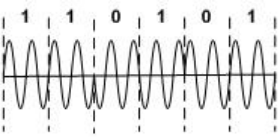
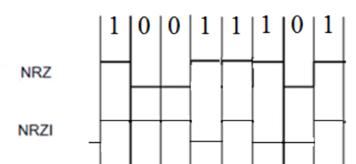

## 2016-2017学年上学期月考试卷（含答案）

### 一、选择题（每空 2 分，共 40 分）

1. E 载波是 ITU-T 建议的传输标准，贝尔系统 T3 信道的数据速率大约是<u>&emsp;（1）&emsp;</u> Mb/s。

    A. 1.5

    B. 6.3

    C. 44

    D. 274

    

    
答案：

    （1）C

    

    ***

2. 曼彻斯特编码的特点是<u>&emsp;（2）&emsp;</u>，它的编码效率是<u>&emsp;（3）&emsp;</u>。

    （2）

    A. 在“0”比特的前沿有电平翻转，在“1”比特的前沿没有电平翻转

    B. 在“1”比特的前沿有电平翻转，在“0”比特的前沿没有电平翻转

    C. 在每个比特的前沿有电平翻转

    D. 在每个比特的中间有电平翻转

    （3）

    A. 50%

    B. 60%

    C. 80%

    D. 100%

    

    
答案：

    （2）D

    （3）A

    

    ***

3. 设信道带宽为 3400 Hz，采用 PCM 编码，采样周期为 125 μs，每个样本量化为 128 个等级，则信道的数据率为<u>&emsp;（4）&emsp;</u>。

    A. 10 Kb/s

    B. 16 Kb/s

    C. 56 Kb/s

    D. 64 Kb/s

    

    
答案：

    （4）C

    

    ***

4. E1 载波的基本帧由 32 个子信道组成。其中 30 个子信道用于传送语音数据，2 个子信道用于传送控制信令。该基本帧的传送时间为<u>&emsp;（5）&emsp;</u>。

    A. 100 ms

    B. 200 μs

    C. 125 μs

    D. 150 μs

    

    
答案：

    （5）C

    

    ***

5. 4B/5B 编码是一种两级编码方案，首先要把数据变成<u>&emsp;（6）&emsp;</u> 编码，再把 4 位分为一组的代码变换成 5 单位的代码，这种编码的效率是<u>&emsp;（7）&emsp;</u>。

    （6）

    A. NRZ-I

    B. AMI

    C. QAM

    D. PCM

    （7）

    A. 0.4

    B. 0.5

    C. 0.8

    D. 1.0

    

    
答案：

    （6）A

    （7）C

    

    ***

6. 下图所示的调制方式中，若载波频率为 2400 Hz，则码元速率为<u>&emsp;（8）&emsp;</u>。

    

    （8）

    A. 100 Baud

    B. 200 Baud

    C. 1200 Baud

    D. 2400 Baud

    

    
答案：

    （8）C

    

    ***

7. 光纤分为单模光纤和多模光纤，这两种光纤的区别是<u>&emsp;（9）&emsp;</u>。

    A. 单模光纤的数据速率比多模光纤低

    B. 多模光纤比单模光纤传输距离更远

    C. 单模光纤比多模光纤的价格更便宜

    D. 多模光纤比单模光纤的纤芯直径粗

    

    
答案：

    （9）D

    

    ***

8. 假设模拟信号的最高频率为 6 MHz，采样频率必须大于<u>&emsp;（10）&emsp;</u> 时，才能使得到的样本信号不失真。

    A. 6 MHz

    B. 12 MHz

    C. 18 MHz

    D. 20 MHz

    

    
答案：

    （10）B

    

    ***

9. 在异步通信中，每个字符包含 1 位起始位、7 位数据位、1 位奇偶位和 2 位终止位，每秒钟传送 100 个字符，则有效数据速率为<u>&emsp;（11）&emsp;</u>。

    A. 500 b/s

    B. 700 b/s

    C. 770 b/s

    D. 1100 b/s

    

    
答案：

    （11）B

    

    ***

10. 10BASE-T 以太网使用曼彻斯特编码，其编码效率为<u>&emsp;（12）&emsp;</u>%。

    A. 30

    B. 50

    C. 80

    D. 90

    

    
答案：

    （12）B

    

    ***

11. T1 信道的速率是<u>&emsp;（13）&emsp;</u>，其中每个话音信道的数据速率是<u>&emsp;（14）&emsp;</u>。

    （13）

    A. 1.544 Mb/s

    B. 2.048 Mb/s

    C. 6.312 Mb/s

    D. 44.736 Mb/s

    （14）

    A. 56 Kb/s

    B. 64 Kb/s

    C. 128 Kb/s

    D. 2048 Kb/s

    

    
答案：

    （13）A

    （14）A

    

    ***

12. 下列对 ADSL 网络的描述哪些是错误的？<u>&emsp;（15）&emsp;</u>。

    A. 采用普通电话线作为传输介质

    B. 当语音通话时，不能使用网络通信

    C. 上行线和下行线通信带宽不同

    D. ADSL 是一种异步传输模式

    

    
答案：

    （15）B

    

    ***

13. 若网络形状是由站点和连接站点的链路组成的一个闭合环，则称这种拓扑结构为<u>&emsp;（16）&emsp;</u>。

    A. 星形拓扑

    B. 总线拓扑

    C. 环形拓扑

    D. 树形拓扑

    

    
答案：

    （16）C

    

    ***

14. 采用全双工通信方式，数据传输的方向性结构为<u>&emsp;（17）&emsp;</u>。

    A. 可以在两个方向上同时传输

    B. 只能在一个方向上传输

    C. 可以在两个方向上传输，但不能同时进行

    D. 以上均不对

    

    
答案：

    （17）A

    

    ***

15. Internet 的网络层含有四个重要的协议，分别为<u>&emsp;（18）&emsp;</u>。

    A. IP，ICMP，ARP，UDP

    B. TCP，ICMP，UDP，ARP

    C. IP，ICMP，ARP，RARP

    D. UDP，IP，ICMP，RARP

    

    
答案：

    （18）C

    

    ***

16. 一座大楼内的一个计算机网络系统，属于<u>&emsp;（19）&emsp;</u>。

    A. PAN

    B. LAN

    C. MAN

    D. WAN

    

    
答案：

    （19）B

    

    ***

17. 网络协议的三要素是<u>&emsp;（20）&emsp;</u>。

    A. 数据格式、编码、信号电平

    B. 数据格式、流量控制、拥塞控制

    C. 语法、语义、交换规则

    D. 编码、控制信息、同步

    

    
答案：

    （20）C

    

***

### 二、填空（15 分，每空 1 分）

1. 串行数据通信的方向性结构有三种，即 <u>&emsp;&emsp;&emsp;</u>、<u>&emsp;&emsp;&emsp;</u> 和 <u>&emsp;&emsp;&emsp;</u>。

    

    
答案：

    单工、半双工、全双工

    

    ***

2. 数字数据可以针对载波的不同要素或它们的组合进行调制，有三种基本的数字调制形式，即 <u>&emsp;&emsp;&emsp;</u>、<u>&emsp;&emsp;&emsp;</u> 和 <u>&emsp;&emsp;&emsp;</u>。

    

    
答案：

    频率调制、振幅调制、相位调制

    

    ***

3. 模拟信号变换为数字信号的常用方法是脉冲编码调制（PCM），其主要步骤为 <u>&emsp;&emsp;&emsp;</u>、<u>&emsp;&emsp;&emsp;</u> 和 <u>&emsp;&emsp;&emsp;</u>。

    

    
答案：

    取样、量化、编码

    

    ***

4. OSI 的网络层处于 <u>&emsp;&emsp;&emsp;</u> 层提供的服务之上，为 <u>&emsp;&emsp;&emsp;</u> 层提供服务。

    

    
答案：

    数据链路；传输

    

    ***

5. TCP/IP 体系结构中的 TCP 和 IP 协议分别位于 <u>&emsp;&emsp;&emsp;</u> 层和 <u>&emsp;&emsp;&emsp;</u> 层。

    

    
答案：

    传输；网络

    

    ***

6. ATM 网络中的传输单位称为信元，信元长度为 <u>&emsp;&emsp;&emsp;</u> 字节。

    

    
答案：

    53

    

    ***

7. 超五类非屏蔽双绞线由 <u>&emsp;&emsp;&emsp;</u> 对导线组成。

    

    
答案：

    4

    

***

### 三、计算、综合题（15 分）

1. 在基带网络中，请用 NRZ（不归零）编码和 NRZI（反向不归零）编码对二进制数据流 `10011101` 进行编码（画出波形图）。（5 分）

    

    
答案：

    

    

    ***

2. 某 CDMA 接收方收到一条如下芯片系列：`(-1 +1 -3 +1 -1 -3 +1 +1)`，假设芯片序列为：A：`00101110`，B：`01011100`，C：`00011011`，D：`01000010`，试分析哪些站点发送了数据？发送了何种数据。（6 分）

    

    
答案：

    $$
    ((-1,+1,-3,+1,-1,-3,+1,+1)\cdot A)/8=-1
    $$

    $$
    ((-1,+1,-3,+1,-1,-3,+1,+1)\cdot B)/8=0
    $$

    $$
    ((-1,+1,-3,+1,-1,-3,+1,+1)\cdot C)/8=+1
    $$

    $$
    ((-1,+1,-3,+1,-1,-3,+1,+1)\cdot D)/8=+1
    $$

    收到的芯片系列 `(-1 +1 -3 +1 -1 -3 +1 +1)` 中，A、C、D 发送了数据，B 没有发送数据。A 发送了数据 0，C、D 发送了数据 1。

    

    ***

3. 设信道带宽为 4 KHz，信噪比为 20 db，若传输二进制信号，则可达到的最大数据速率是多少？（4 分）

    

    
答案：

    $$
    10\times\log_{10}(S/N)=20
    $$

    故：

    $$
    S/N=100
    $$

    Shannon：

    $$
    H\times\log_2(1+S/N)=4\times\log_2 101=26.64\text{ kbps}
    $$

    Nyquist：

    $$
    2\times H\log_2V=8\text{ kbps}
    $$

    故：信道的最大数据传输率为 $8\text{ kbps}$。

    

