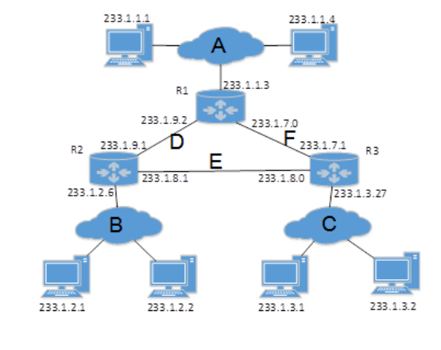

## 2017-2018学年上学期期末试卷（A）（含答案）

### 一、Briefly explain the following jargons（3 points each，15 points in all）

1. Piggybacking

    

    
答案：

    即捎带确认，是一种暂时延缓当前确认信息的发送，以便将确认信息搭载在下一个出境数据帧上的技术。

    

    ***

2. ARQ (Automatic Repeat reQuest)

    

    
答案：

    自动重发请求，是目前网络使用的一种主流 RDT（可靠数据传输）技术，使用检错码传输数据，如果接收方检测到所收的报文有错，则反馈一个信息给发送方，由发送方实施重传。

    

    ***

3. Three-way Handshaking for TCP

    

    
答案：

    说明三次握手过程的三个 TCP 段：SYN、SYN/ACK、ACK 即可。

    

    ***

4. VLAN

    

    
答案：

    VLAN 即虚拟局域网（Virtual Local Area Network），是一组逻辑上的设备和用户，这些设备和用户并不受物理位置的限制，可以根据功能、部门及应用等因素将它们组织起来，相互之间的通信就好像它们在同一个网段中一样，由此得名虚拟局域网。

    

    ***

5. CSMA/CA

    

    
答案：

    带有冲突避免机制的载波侦听多路访问协议，（只要提发送方即可）先监听信道，如果为空闲，等待 DIFS 再发送；否则采用二进制退避算法等待，如果倒计时到 0 仍为空闲则发送，如果未收到 ACK 则采用退避算法重新发送。

    

***

### 二、Briefly answer the following questions（5 points each，30 points in all）

1. Consider an application that transmits data at a steady rate (for example, the sender generates an N-bit unit of data every k time units, where k is small and fixed). Also, when such an application starts, it will continue running for a relatively long period of time. Answer the following questions, briefly justifying your answer:

    （1）Would a packet-switched network or a circuit-switched network be more appropriate for this application? Why?（2 points）

    （2）Suppose that a packet-switched network is used and the only traffic in this network comes from such applications as described above. Furthermore, assume that the sum of the application data rates is less than the capacities of each and every link. Is some form of congestion control needed? Why?（3 points）

    

    
答案：

    （1）电路交换网更适合所描述的应用，因为这个应用要求在可预测的平滑带宽上进行长期的会话。由于传输速率是已知，且波动不大，因此可以给各应用会话话路预留带宽而不会有太多的浪费。另外，我们不需要太过担心由长时间典型会话应用积累起来的，建立和拆除电路时耗费的开销时间。

    （2）由于所给的带宽足够大，因此该网络中不需要拥塞控制机制。最坏的情况下（几乎可能拥塞），所有的应用分别从一条或多条特定的网络链路传输。而由于每条链路的带宽足够处理所有的应用数据，因此不会发生拥塞现象（只会有非常小的队列）。

    

    ***

2. What is the relationship between protocol and service? Describe their differences.

    

    
答案：

    协议是控制两个对等实体进行通信的规则的集合。在协议的控制下，两个对等实体间的通信使得本层能够向上一层提供服务，而要实现本层协议，还需要使用下面一层提供服务。

    协议和服务的概念的区分：

    1. 协议的实现保证了能够向上一层提供服务。本层的服务用户只能看见服务而无法看见下面的协议。下面的协议对上面的服务用户是透明的。

    2. 协议是“水平的”，即协议是控制两个对等实体进行通信的规则。但服务是“垂直的”，即服务是由下层通过层间接口向上层提供的。上层使用所提供的服务必须与下层交换一些命令，这些命令在 OSI 中称为服务原语。

    

    ***

3. Consider the count-to-infinity problem in the distance vector routing. Will the count-to-infinity problem occur if we decrease the cost of a link? Why? How about if we connect two nodes which do not have a link?

    

    
答案：

    不会，因为链路费用降低不会造成路由环的出现。在两个不直接相连的节点之间新增一条直连链路等同于降低（至少不会增加）两点之间的链路费用，所以也不会出现无穷计数问题。

    

    ***

4. Suppose you purchase a wireless router and connect it to your cable modem. Also suppose that your ISP dynamically assigns your connected device (that is, your wireless router) one IP address. Also suppose that you have five PCs at home that use 802.11 to wirelessly connect to your wireless router.

    （1）How are IP addresses assigned to the five PCs?（2 points）

    （2）Does the wireless router use NAT? Why or why not?（3 points）

    

    
答案：

    （1）通常，无线路由器包括一个 DHCP 服务器。DHCP 用于将 IP 地址分配给 5 个 PC 和路由器接口。

    （2）是的，无线路由器也使用 NAT，因为它只从 ISP 获得了一个 IP 地址。

    

    ***

5. If all the links in the Internet were to provide reliable delivery service, would the TCP reliable delivery service be redundant? Why or why not?

    

    
答案：

    虽然每条链路都能保证数据包在端到端的传输中不发生差错，但它不能保证 IP 数据包是按照正确的顺序到达最终的目的地。IP 数据包可以使用不同的路由通过网络，到达接收端的顺序会不一致，因此，TCP 仍然需要使用 rdt 服务来保证到达接收端的字节流按照正确的序号向上层递交。

    

    ***

6. If a binary signal is sent over a 4-kHz channel whose signal-to-noise ratio is 20 dB, what is the maximum achievable data rate?

    

    
答案：

    $$
    10\log_{10}(S/N)=20
    $$

    故：$S/N=100$。

    Shannon：

    $$
    H\log_2(1+S/N)=4\log_2 101=26.64\text{ kbps}
    $$

    Nyquist：

    $$
    2H\log_2V=8\text{ kbps}
    $$

    故：信道的最大数据传输率为 8 kbps。

    

***

### 三、Computations and applications（55 points in all）

1. Consider sending a large file from a host to another over a TCP connection that has no loss.

    （1）Suppose TCP use AIMD（Additive Increase Multiplicative Decrease）for its congestion control without slow start. Assuming the congestion window CongWin increases by 1 MSS every time a batch of ACKs is received and assuming approximately constant round-trip times, how long does it take for CongWin to increase from 1 MSS to 10 MSS (assuming no loss events)?（4 points）

    （2）What is the average throughput (in terms of MSS per RTT) for this connection up through time = 9 RTT?（4 points）

    

    
答案：

    （1）It takes 1 RTT to increase CongWin to 2 MSS; 2 RTTs to increase to 3 MSS; 3 RTTs to increase to 4 MSS; …, and 9 RTTs to increase to 10 MSS.

    （2）In the first RTT 1 MSS was sent; in the second RTT 2 MSS was sent; in the third RTT 3 MSS was sent; …, and in the ninth RTT, 9 MSS was sent. Thus, up to time 9 RTT,

    $$
    1+2+3+4+5+6+7+8+9=45
    $$

    MSS were sent (and acknowledged). Thus, one can say that the average throughput up to time 9 RTT was $(45\text{ MSS})/(9\text{ RTT})=5\text{ MSS/RTT}$.

    

    ***

2. Consider a network topology shown in the figure below. Denote the three subnets with hosts as Networks A, B, and C. Denote the subnets without hosts as Networks D, E, and F.

    

    （1）Re-assign network addresses to each of these six subnets, with the following constraints: All addresses must be allocated from `214.97.254.0/23`; Subnet A should have enough addresses to support 250 interfaces; Subnet B should have enough addresses to support 120 interfaces; and Subnet C should have enough addresses to support 120 interfaces. Of course, subnets D, E and F should each be able to support two interfaces. For each subnet, the assignment should take the form `a.b.c.d/x` or `a.b.c.d/x – e.f.g.h/y`.（6 points）

    （2）Using your above answer, provide the forwarding tables (using the longest prefix matching) for each of the three routers.（6 points）

    

    
答案：

    （1）From `214.97.254.0/23`, possible assignments are:

    | Subnet | Assignment |
    | --- | --- |
    | Subnet A | `214.97.255.0/24`（256 addresses） |
    | Subnet B | `214.97.254.0/25 - 214.97.254.0/29`（128 - 8 = 120 addresses） |
    | Subnet C | `214.97.254.128/25`（128 addresses） |
    | Subnet D | `214.97.254.0/31`（2 addresses） |
    | Subnet E | `214.97.254.2/31`（2 addresses） |
    | Subnet F | `214.97.254.4/30`（4 addresses） |

    （2）To simplify the solution, assume that no datagrams have router interfaces as ultimate destinations. Also, label D, E, F for the upper-right, bottom, and upper-left interior subnets, respectively.

    Router 1:

    | Longest Prefix Match | Outgoing Interface |
    | --- | --- |
    | `11010110 01100001 11111111` | Subnet A |
    | `11010110 01100001 11111110 0000000` | Subnet D |
    | `11010110 01100001 11111110 000001` | Subnet F |

    Router 2:

    | Longest Prefix Match | Outgoing Interface |
    | --- | --- |
    | `11010110 01100001 11111111 0000000` | Subnet D |
    | `11010110 01100001 11111110 0` | Subnet B |
    | `11010110 01100001 11111110 0000001` | Subnet E |

    Router 3:

    | Longest Prefix Match | Outgoing Interface |
    | --- | --- |
    | `11010110 01100001 11111111 000001` | Subnet F |
    | `11010110 01100001 11111110 0000001` | Subnet E |
    | `11010110 01100001 11111110 1` | Subnet C |

    

    ***

3. Frames of 1000 bits are sent over a 1-Mbps channel using a geostationary satellite whose propagation time from the earth is 270 msec. Acknowledgements are always piggybacked onto data frames. The headers are very short. Three-bit sequence numbers are used. What is the maximum achievable channel utilization for:

    （1）Stop-and-wait?（3 points）

    （2）Go-back-N?（3 points）

    （3）Selective repeat?（3 points）

    

    
答案：

    对应三种协议的窗口大小值分别是 1、7 和 4。

    使用卫星信道端到端的典型传输延迟是 270 ms，以 1 Mb/s 发送，1000 bit 长的帧的发送时间为 1 ms。我们用 $t=0$ 表示传输开始的时间，那么在 $t=1\text{ ms}$ 时，第一帧发送完毕；$t=271\text{ ms}$ 时，第一帧完全到达接收方；$t=272\text{ ms}$，对第一帧的确认帧发送完毕；$t=542\text{ ms}$，带有确认的帧完全到达发送方。因此一个发送周期为 542 ms。如果在 542 ms 内可以发送 $k$ 个帧，由于每一个帧的发送时间为 1 ms，则信道利用率为 $k/542$，因此：

    （1）$k=1$，最大信道利用率 $=1/542=0.18\%$。

    （2）$k=7$，最大信道利用率 $=7/542=1.29\%$。

    （3）$k=4$，最大信道利用率 $=4/542=0.74\%$。

    

    ***

4. Suppose that host A is connected to a router R1, R1 is connected to another router R2, and R2 is connected to host B. Suppose that a TCP message that contains 900 bytes of data and 20 bytes of TCP header is passed to the IP code at host A for delivery to B. Show the Total length, Identification, DF, MF, and Fragment offset fields of the IP header in each packet transmitted over the three links. Assume that link A-R1 can support a maximum frame size of 1024 bytes including a 14-byte frame header, link R1-R2 can support a maximum frame size of 512 bytes, including an 8-byte frame header, and link R2-B can support a maximum frame size of 512 bytes including a 12-byte frame header.（10 points）

    

    
答案：

    开头的 IP 数据报会在 R1 被拆分成两个 IP 数据包，不会出现其他的拆分。

    | Link | Packet | Length | ID | DF | MF | Offset |
    | --- | --- | --- | --- | --- | --- | --- |
    | A-R1 |  | 940 | x | 0 | 0 | 0 |
    | R1-R2 | (1) | 500 | x | 0 | 1 | 0 |
    | R1-R2 | (2) | 460 | x | 0 | 0 | 60 |
    | R2-B | (1) | 500 | x | 0 | 1 | 0 |
    | R2-B | (2) | 460 | x | 0 | 0 | 60 |

    

    ***

5. A CDMA receiver gets the following chips: `(-1 +3 -1 -1 -1 +1 -1 -3)`. Assuming there are four stations with the following chip sequences `{A:(-1-1-1+1+1-1+1+1), B:(-1-1+1-1+1+1+1-1), C:(-1+1-1+1+1+1-1-1), D:(-1+1-1-1-1-1+1-1)}`, which stations transmitted, and which bits did each one send?（6 points）

    

    
答案：

    $S\cdot A=(+1-3+1-1-1-1-1-3)/8=-1$，A 发送 0。

    $S\cdot B=(+1-3-1+1-1+1-1+3)/8=0$，B 无发送。

    $S\cdot C=(+1+3+1-1-1+1+1+3)/8=1$，C 发送 1。

    $S\cdot D=(+1+3+1+1+1-1-1+3)/8=1$，D 发送 1。

    每个站 1.5 points。

    

    ***

6. A 10-bit stream `1001001101` is transmitted using the standard CRC method. The generator polynomial is $x^3+x+1$. Show the actual bit string transmitted. Can the receiver detect any 2-bits errors? Give an example of bit errors in the bit string transmitted that will not be detected by the receiver.（10 points）

    

    
答案：

    生成多项式 $x^3+x+1$ 对应 `1011`。

    `1001001101` 模 2 除 `1011` 的余数为 `10`，所以实际传送的是 `1001001101010`。（5 points）

    接收方可以发现所有的 2 位错误，因为任何 `1***1` 形式的错误都不会被 `1011` 除尽。（3 points）

    任何可以被 `1011` 除尽的错误都不能够检查出来，比如 `1000010101010`。（2 points）

    

