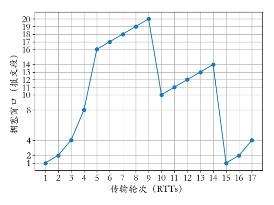
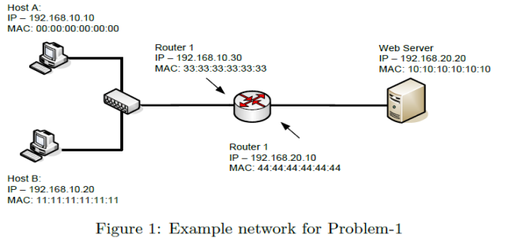
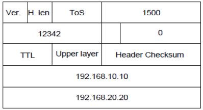
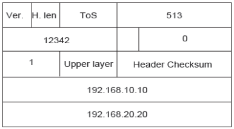

## 2020-2021学年上学期期末试卷（A）（含答案）

### 一、单项选择题（本大题共 10 小题，每小题 2 分，共 20 分）

1. TCP 首部的接收窗口字段用于（    ）。

    A. 可靠传输

    B. 窗口控制

    C. 拥塞控制

    D. 流量控制

    

    
答案：

    D

    

    ***

2. 形式为 128.119.40.64/26 的地址块最多能拥有（    ）个主机。

    A. 128

    B. 64

    C. 62

    D. 126

    

    
答案：

    C

    

    ***

3. 以下协议中（    ）能解决自治系统之间的路由选择。

    A. RIP

    B. OSPF

    C. BGP

    D. IGP

    

    
答案：

    C

    

    ***

4. IP 地址空间和 MAC 地址空间分别有多大：（    ）。

    A. $2^{32}$，$2^{64}$

    B. $2^{32}$，$2^{48}$

    C. $2^{48}$，$2^{64}$

    D. $2^{32}$，$2^{128}$

    

    
答案：

    B

    

    ***

5. 给定一个 5 比特生成多项式 10011，假设数据是 1010100100，则 CRC 的值为（    ）。

    A. 0011

    B. 0110

    C. 0101

    D. 1001

    

    
答案：

    C

    

    ***

6. 网络地址端口转换（NAPT）协议中 NAT 路由器利用（    ）区分不同的私有网络主机。

    A. IP 地址

    B. MAC 地址

    C. 端口号

    D. 前缀

    

    
答案：

    C

    

    ***

7. IPv6 地址 12AB:0000:0000:CD30:0000:0000:0000:0000/60，可以表示成简写形式。下面的选项中，写法正确的是（    ）。

    A. 12AB::CD30::/60

    B. 12AB:0:0:CD3 /60

    C. 12AB:0:0:CD30::/60

    D. 12AB::CD3 /60

    

    
答案：

    C

    

    ***

8. Ethernet 采用的媒体访问控制方式是（    ）。

    A. 令牌环

    B. 令牌总线

    C. CSMA/CA

    D. CSMA/CD

    

    
答案：

    D

    

    ***

9. 计算机网络中，数据自底向上解封装的过程是（    ）。

    A. 数据-报文-分组-数据帧-比特流

    B. 比特流-数据帧-分组-报文-数据

    C. 数据-分组-报文-数据帧-比特流

    D. 报文-分组-数据帧-比特流-数据

    

    
答案：

    B

    

    ***

10. 数据链路层采用后退 N 帧（Go-Back-N）协议，假设发送窗口 Ws=7，若发送方已经发送了编号为 0~6 的帧，当计时器超时时，若发送方只收到 0、2、3 号帧的确认，则发送方需要重发的帧序号是哪些？（    ）

    A. 1,4,5,6

    B. 4,5,6

    C. 1,2,3,4,5,6

    D. 0,1,2,3

    

    
答案：

    B

    

***

### 二、填空题（本大题共 5 小题，每题 2 分，共 10 分）

1. 假设主机 A 和主机 B 之间建立了一个 TCP 连接。当主机 A 向 B 发送数据时，其 TCP 报文头中的源端口号与目的端口号分别是 100 和 1203，则 B 向 A 发送数据时，其源端口号与目的端口号分别是（        ）和（        ）。

    

    
答案：

    1203；100

    

    ***

2. 香农定理定义了有噪声信道的网络传输速率的理论极限值，假设 S 为信号功率，N 为噪声功率，带宽为 B（Hz），则根据香农定理，最大数据传输速率（信道容量）为：（        ）

    

    
答案：

    $B\log_2(1+S/N)$ bits/sec

    

    ***

3. 最常见的传输层协议中，（        ）不支持可靠传输，（        ）能解决分组乱序到达的问题。

    

    
答案：

    UDP；TCP

    

    ***

4. 动态路由协议主要包括两大类：距离矢量路由协议和（        ）。其中距离矢量路由生成算法的典型代表是 Bellman-Ford 算法，而链路状态路由协议主要通过（        ）来生成最佳路由路径。

    

    
答案：

    链路状态路由协议；Dijkstra 算法/迪杰斯特拉算法

    

    ***

5. 数据链路层分为（        ）和（        ）两个子层。

    

    
答案：

    逻辑链路控制子层；介质访问控制子层

    

***

### 三、分析计算题（本大题共 4 小题，每小题 10 分，共 40 分）

1. 一个 TCP 连接经历了下图所示的拥塞窗口变化，请回答以下问题：

    

    （1）指出该 TCP 连接属于拥塞避免阶段的时间间隔。（2 分）

    （2）分别指出第 9 个传输轮次之后拥塞窗口变化的原因，以及第 14 个传输轮次之后拥塞窗口变化的原因。（2 分）

    （3）第 1、10、15 个传输轮次里慢启动阈值（ssthresh）的值分别为多少，并说明具体理由？（3 分）

    （4）如果没有任何报文丢失，第 19 个传输轮次的拥塞窗口大小是多少？（3 分）

    

    
答案：

    （1）[5, 9]，[10, 14]。（每项 1 分，共 2 分）

    （2）第 9 个：通过三个冗余 ACK 检测到了报文的丢失。

    第 14 个：根据定时器超时检测到了报文的丢失。

    （每项 1 分，共 2 分）

    （3）第 1 个：16，因为拥塞窗口超过 16 个报文段以后进入了拥塞避免阶段。

    第 10 个：10，因为遇到报文丢失时，ssthresh 由之前的拥塞窗口减半，$20/2=10$。

    第 15 个：7，因为遇到报文丢失时，ssthresh 由之前的拥塞窗口减半，$14/2=7$。

    （每项 1 分，共 3 分）

    （4）第 18 个传输轮次窗口为 7，因为新的 ssthresh 为 7；第 19 个传输轮次窗口为 8，因为进入了拥塞避免阶段。（3 分）

    

    ***

2. 长度为 2000 位的数据帧，在数据传输速率为 1Mbps、最大长度为 1km 的物理线路上传输。假设线路的单向传输延迟时间为 99ms/km，并分别采用 stop-and-wait 协议、Go-Back-N 帧的滑动窗口协议、Selective Repeat 的滑动窗口协议进行传输，假设数据帧的序列号为 4 位，确认帧的发送时间忽略不计。请回答以下两个问题：

    （1）计算上述三种协议中发送者的发送窗口大小？（3 分）

    （2）三种协议下物理通信线路可达到的最大利用率分别是多少？（7 分）

    

    
答案：

    对应三种协议的窗口大小值分别是 1、15（窗口大小为 $2^m-1$）和 8（窗口大小为 $2^{m-1}$）。（每个数值 1 分，共 3 分）

    以 1Mb/s 发送，2000bit 长的帧的发送时间为 2ms。1km 的线路传输时延为 99ms。用 $t=0$ 表示传输开始的时间，那么在 $t=2ms$ 时，第一帧发送完毕；$t=2+99=101ms$ 时，第一帧完全到达接收方；$t=101+99=200ms$ 时，对第一帧的确认帧完全到达发送方。因此一个发送周期为 200ms。如果在 200ms 内可以发送 k 个帧，由于每一个帧的发送时间为 2ms，则信道利用率为 $2k/200$，因此：

    （1）$k=1$，最大信道利用率 = $2/200=1\%$。（2 分）

    （2）$k=15$，最大信道利用率 = $30/200=15\%$。（2 分）

    （3）$k=8$，最大信道利用率 = $16/200=8\%$。（2 分）

    每项 2 分，共 6 分。另外，计算过程分析 1 分。

    

    ***

3. 如下图所示，假设网络 192.168.10.0 是一个 Ethernet，对应的 MTU 值为 1500 字节；而网络 192.168.20.0 是一个 PPP 网络，对应的 MTU 值为 512 字节。请回答以下两个问题。

    

    （1）假设主机 A 发送一个报文给 Web Server，其报文头的各字段值如下图所示。请问，路由器是否会对该报文进行分片？如果需要分片，请计算出分片数量，并给出每个分片的属性（包括分片大小、序列号、offset 值、MF 值）？如果不需要分片，请给出原因？（5 分）

    

    （2）假设主机 A 又发送一个报文给 Web Server，其报文头的各字段值如下图所示。请问，路由器是否会对该报文进行分片？如果需要分片，请计算出分片数量，并给出每个分片的属性（包括分片大小、序列号、offset 值、MF 值）？如果不需要分片，请给出原因？（5 分）

    

    

    
答案：

    （1）需要分片。（1 分）

    512 字节 - 20 字节头 = 492 字节，但是 492 字节 mod 8 != 0，所以取 488 字节作为分片后的 IP 报文数据域长度。分片后的每个报文长度为 $488+20=508$ 字节。

    1480 字节/488 字节 ≈ 4，所以需要 4 个分片，每个分片大小及序列号如下：

    Fragment 1：分片大小为 508 字节（488 字节数据域 + 20 字节头），序列号为 12342，Offset 为 0，MF flag 为 1；

    Fragment 2：分片大小为 508 字节（488 字节数据域 + 20 字节头），序列号为 12342，Offset 为 61，MF flag 为 1；

    Fragment 3：分片大小为 508 字节（488 字节数据域 + 20 字节头），序列号为 12342，Offset 为 122，MF flag 为 1；

    Fragment 4：分片大小为 36 字节（16 字节数据域 + 20 字节头），序列号为 12342，Offset 为 183，MF flag 为 0；

    （每个 1 分，共 4 分）

    （2）不需要分片。（1 分）

    理由：当 Router 1 收到该数据报文时，会对其 TTL 值减 1。该数据报文的 TTL 将会变为 0，所以，Router1 将会直接丢弃到该报文。不需要进行分片。

    （理由 4 分）

    

    ***

4. 某网络采用 CSMA/CD 协议，且链路速率为 5Mbps。假设其最大传播时延（Propagation Delay）为 $T_p=51.2μs$。为了能够实现冲突检测，请计算该网络数据帧的最小长度是多少？

    

    
答案：

    CSMA/CD 为了实现冲突检测，要求最小发送时延（Transmission delay）为传播时延（Propagation Delay）的至少 2 倍，即发送时延 $\ge 2*T_p=2*51.2μs=102.4μs$。（5 分）

    由此可得，最小帧长度为：$5Mbps * 102.4μs = 512bits$（或 64bytes）。（5 分）

    

***

### 四、问答题（本大题共 3 小题，每题 10 分，共 30 分）

1. 请列举四种常见的多路复用技术，并简要阐述其实现原理。

    

    
答案：

    常见的多路复用技术包括：时分多路复用（TDM）、频分多路复用（FDM）、波分多路复用（WDM）和码分多路复用（CDM）。（4 分，每个 1 分）

    时分多路复用是以信道传输时间作为分割对象，通过为多个信道分配互不重叠的时间片段的方法来实现多路复用。时分多路复用将用于传输的时间划分为若干个时间片段，每个用户分得一个时间片。

    频分多路复用的基本原理是：如果每路信号以不同的载波频率进行调制，而且各个载波频率是完全独立的，即各个信道所占用的频带不相互重叠，相邻信道之间用“警戒频带”隔离，那么每个信道就能独立地传输一路信号。

    波分复用：同一根光纤内传输多路不用波长的光信号，以提高单根光纤的传输能力。因为光通信的光源在光通信的“窗口”上只占用了很窄的一部分，还有很大的范围没有利用。

    码分多址是采用地址码和时间、频率共同区分信道的方式。CDMA 的特征是每个用户有特定的地址码，而地址码之间相互具有正交性，因此各用户信息的发射信号在频率、时间和空间上都可能重叠，从而使有限的频率资源得到利用。

    （每个原理 1.5 分，共 6 分）

    

    ***

2. TCP 进行链接建立时需要通过三次握手，请回答如下几个问题：

    （1）假设主机 B 收到一个从主机 A 发送过来的旧的 SYN 报文段，请求建立 TCP 连接。请说明三次握手过程中是如何识别该 SYN 是旧的，并拒绝此次建连请求的。（5 分）

    （2）假设主机 B 收到一个从主机 A 发送过来的旧的 SYN 报文段，并紧跟一个从主机 A 发送过来的旧的对主机 B 发送的 SYN 报文段的确认 ACK（即该 ACK 也是旧的）。该 TCP 连接请求是否会被拒绝？为什么？（5 分）

    

    
答案：

    在三次握手建立连接过程中，双方必须确保选用的初始序列号是唯一的。（2 分）

    如果主机 B 收到了一个从主机 A 发送过来的旧的 SYN 报文，主机 B 将会基于该旧 SYN 报文里的旧序列号确认该连接请求，并发送 ACK。当主机 A 接收到 B 发过来的 ACK 报文后，主机 A 将会发现主机 B 收到了一个具有错误序列号的报文。主机 A 将会将该 ACK 丢弃并拒绝该连接请求。（3 分）

    该连接请求也会被拒绝。（2 分）

    当主机 B 收到一个旧的 SYN 报文请求建立连接时，B 会发送给 A 一个 SYN 报文并设置一个唯一的序列号。当 B 收到一个从 A 发送过来的旧 ACK 时，B 将会通知 A 该连接请求是无效的，因为旧 ACK 的序列号跟之前 B 设置的序列号不一致。所以，该连接请求将会被拒绝。（3 分）

    

    ***

3. 简要描述流量控制和拥塞控制的区别？以及 TCP 拥塞控制的四种算法？

    

    
答案：

    （1）流量控制和拥塞控制：

    流量控制：是为了控制发送方的发送速率，让发送方的发送速率不要太快，确保接收方来得及接收。具体来说，TCP 是利用滑动窗口机制来实现对发送方的流量控制，接收方通过在发送的确认报文中填写窗口字段来控制发送方窗口大小，从而限制发送方的发送速率。（3 分）

    拥塞控制：是防止过多的数据注入网络中，从而确保网络中的路由器或链路不致过载。拥塞控制是一个全局性的过程，和流量控制不同，流量控制指点对点通信量的控制。（3 分）

    （2）TCP 拥塞控制主要有四种算法，包括慢开始（slow-start）、拥塞避免（Congestion Avoidance）、快重传（Fast Retransmit）、快恢复（Fast Recovery）。（4 分，每个 1 分）

    

