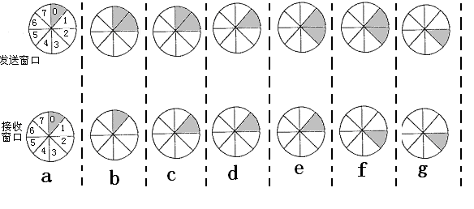

## 2021-2022学年上学期期中试卷（含答案）

### 一、选择题（每空 2 分，共 20 分）

1. 在 OSI 参考模型中，下列各层中不属于通信子网的是（  ）。

    A. 物理层

    B. 数据链路层

    C. 网络层

    D. 会话层

    

    
答案：

    D

    

    ***

2. OSI 参考模型中，加密和解密是（  ）层的功能。

    A. 传输

    B. 会话

    C. 表示

    D. 应用

    

    
答案：

    C

    

    ***

3. 循环冗余校验 CRC 中的生成式包含（  ）因子时，可检测出所有的奇数位错误。

    A. $x$

    B. $x+1$

    C. 1

    D. 以上均不是

    

    
答案：

    B

    

    ***

4. 本地电话网络采用（  ）交换技术。

    A. 电路

    B. 分组

    C. 报文

    D. 以上均不是

    

    
答案：

    A

    

    ***

5. 采用位填充法进行成帧，成帧标识为 `01111110`。如果需要传送的比特串为 `0111110111111110`，则经位填充后，此比特串变为（  ）（不包括起始和结束标志）。

    A. `011111001111101110`

    B. `011111001111110110`

    C. `011111010111011110`

    D. `011111101111111110`

    

    
答案：

    A

    

    ***

6. 下列描述错误的是（  ）。

    A. Telnet 协议的服务端口为 23

    B. SMTP 协议的服务端口为 25

    C. HTTP 协议的服务端口为 80

    D. FTP 协议的服务端口为 31

    

    
答案：

    D

    FTP: 21

    

    ***

7. 数据链路层采用后退 N 帧（Go-Back-N）协议，假设发送窗口 $W_s=7$，若发送方已经发送了编号为 0~6 的帧，当计时器超时时，若发送方只收到 0、2、3 号帧的确认，则发送方需要重发的帧序号是哪些？（  ）

    A. 1,4,5,6

    B. 4,5,6

    C. 1,2,3,4,5,6

    D. 0,1,2,3

    

    
答案：

    B

    

    ***

8. 在 OSI 模型中，一个层 N 与它的上层（第 N+1 层）的关系是（  ）。

    A. 第 N 层为第 N+1 层提供服务

    B. 第 N+1 层把从第 N 层接收到的信息添加一个报头

    C. 第 N 层使用第 N+1 层提供的服务

    D. 第 N 层与第 N+1 层相互没有关系

    

    
答案：

    A

    

    ***

9. E1 载波的基本帧由 32 个子信道组成。其中 30 个子信道用于传送语音数据，2 个子信道用于传送控制信令。该基本帧的传送时间为（  ）。

    A. 100ms

    B. 200μs

    C. 125μs

    D. 150μs

    

    
答案：

    C

    

    ***

10. 光纤分为单模光纤和多模光纤，这两种光纤的区别是（  ）。

    A. 单模光纤的数据速率比多模光纤低

    B. 多模光纤比单模光纤传输距离更远

    C. 单模光纤比多模光纤的价格更便宜

    D. 多模光纤比单模光纤的纤芯直径粗

    

    
答案：

    D

    

### 二、填空题（每空 2 分，共 20 分）

1. （  ）定理定义了无噪声信道理论上的最大数据传输速率，（  ）定理定义了加性白噪声信道理论上的最大数据传输速率。

    

    
答案：

    Nyquist/奈奎斯特；Shannon/香农

    

    ***

2. 一个 64-QAM 信号的波特率是 2000，其比特率是（  ）。

    

    
答案：

    $2000\times\log_2 64=12000bps$

    

    ***

3. 在回退 N 帧协议中，如果用 5 个 bit 序号对数据帧进行编号，发送窗口大小的最大值是（  ），接收窗口大小的最大值是（  ）。

    

    
答案：

    31；1

    

    ***

4. 若码字包含 $m$ 个信息位和 $r$ 个校验位，为了纠正单比特错误，$m$ 与 $r$ 应满足的关系是（  ）。常见的纠正单比特错误的纠错码是（  ）。

    

    
答案：

    $(m+r+1)\leq 2^r$；海明码

    

    ***

5. 设信道带宽为 3400HZ，采用 PCM 编码，采样周期为 $125\mu s$，每个样本量化为 128 个等级，则信道的数据率为（  ）。

    

    
答案：

    56Kbps

    

    ***

6. 4B/5B 编码是一种两级编码方案，首先要把数据变成 NRZ-I 编码，再把 4 位分为一组的代码变换成 5 单位的代码，这种编码的效率是（  ）。

    

    
答案：

    0.8

    

    ***

7. 在异步通信中，每个字符包含 1 位起始位、7 位数据位、1 位奇偶位和 2 位终止位，每秒钟传送 100 个字符，则有效数据速率为（  ）。

    

    
答案：

    700bps

    

### 三、名词解释题（每题 4 分，共 12 分）

1. 海明距离

    ***

2. Piggybacking 首先写出中文含义。

    ***

3. ARQ

### 四、简答题（每题 6 分，共 12 分）

1. 假设站点的码片序列为：A：00101110 B：01011100 C：00011011 D：01000010，假设 A 发送了数据 0，C、D 发送了数据 1。试分析 CDMA 接收方收到的码片序列是什么。

    

    
答案：

    （1 分）A 发送数据 0，对应的码片序列为 $(+1,+1,-1,+1,-1,-1,-1,+1)$

    （1 分）C 发送数据 1，对应的码片序列为 $(-1,-1,-1,+1,+1,-1,+1,+1)$

    （1 分）D 发送数据 1，对应的码片序列为 $(-1,+1,-1,-1,-1,-1,+1,-1)$

    （3 分）收到的码片序列 $(-1,+1,-3,+1,-1,-3,+1,+1)$

    

    ***

2. 设信道带宽为 4KHz，信噪比为 20db，若传输二进制信号，则可达到的最大数据速率是多少？

    

    
答案：

    （1 分）$10\times\log_{10}(S/N)=20$，故：$S/N=100$

    （1 分）Shannon：$H\times\log_2(1+S/N)=4\times\log_2 101=26.64kbps$

    （2 分）Nyquist：$2\times H\log_2 V=8kbps$

    （2 分）故：信道的最大数据传输率为 8kbps

    

### 五、（本题 10 分）

长度为 1000 位的数据帧，在数据传输速率为 1Mbps、最大长度为 2km 的物理线路上传输。假设线路的传输延迟时间为 5ms/km，试计算下列协议中的物理通信线路可达到的最大利用率？（数据帧的序列号为 3 位，确认帧的发送时间忽略不计）

1. 停—等协议

2. 回退-n 帧的滑动窗口协议

3. 选择性重传的滑动窗口协议。

答案：

设 $t=0$ 表示开始传输，当 $t=1ms$ 时，第一个数据帧发送完成，当 $t=11ms$，第一个数据帧完全到达，当 $t=21ms$ 时，数据帧的确认完全到达发送端。周期是 21ms。

1. 利用率为：$1/21=4.8\%$

2. 利用率为：$7/21=33.3\%$

3. 利用率为：$4/21=19.0\%$

评分标准：共 10 分，周期分析正确得 4 分；每小题计算正确得 2 分。

### 六、（本题 12 分）

假设我们要传输消息 `11100011`，并用 CRC 多项式 $x^3+1$ 来保护它不出错。

1. （6 分）用多项式除法确定应传输的消息。

2. （6 分）假设由于传输链路上的噪声，消息的最左位被反转。接收机的 CRC 计算结果是什么？接收机如何知道发生了错误？

答案：

1. 根据所采用的 CRC 多项式的阶，我们将消息 `11100011` 扩展为 `11100011000`，其对应的多项式为 $X^{10}+X^9+X^8+X^4+X^3$，然后除以 $X^3+1$。余数为 `100`；我们传输的是原始消息，并附加了剩余部分 `1110 0011 100`，即 $X^{10}+X^9+X^8+X^4+X^3+X^2$。

2. 传输的第一位取反为 `01100011100`，即 $X^9+X^8+X^4+X^3+X^2$；除以 `1001`（$x^3+1$）得到 `10` 的余数；余数非零告诉我们发生了错误。

### 七、（本题 14 分）

若窗口序号位数为 3，发送窗口尺寸为 4，采用 Go-back-N 法，试根据发送及接收窗口变化图示分析各图中相继发生了哪些事件？

答案：

每个 2 分。

（a）发送 0 号帧；

（b）发送 1 号帧；

（c）接收 0 号帧；

（d）接收 0 号帧的确认；

（e）发送 2 号帧；

（f）接收 1 号帧；

（g）接收 1 号帧的确认。

