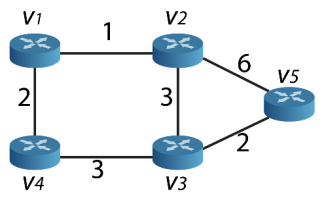
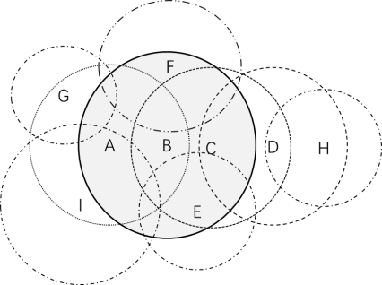
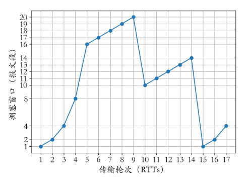
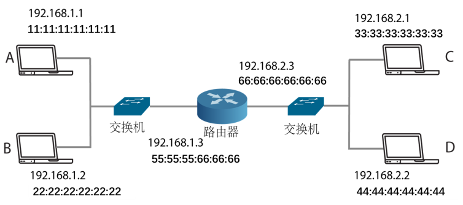
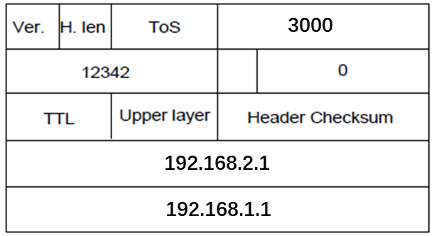

## 2021-2022学年上学期期末试卷（A）（含答案）

### 一、单项选择题（本大题共 10 小题，每小题 2 分，共 20 分）

1. Ethernet 采用的媒体访问控制方式是（    ）。

    A. ALOHA

    B. CSMA/CD

    C. CSMA/CA

    D. 令牌环

    

    
答案：

    B

    

    ***

2. 下列属于合法 IPv6 地址的是（    ）。

    A. `123A:BC00:0000:1111:2222:0000:G125`

    B. `123A:1111.2222.3211`

    C. `123A:BC00::1111:2222::`

    D. `123A:BC00::1111:2222:0`

    

    
答案：

    D

    

    ***

3. 两个主机之间的距离是 L 千米，帧长为 K 比特，传播时延为 t 秒/千米，它们之间的信道容量为 R 比特/秒，假设处理时延可以忽略，那么当使用滑动窗口协议时，使得传输效率最大化的窗口是（    ）。

    A. $\frac{2LtR+K}{K}$

    B. $\frac{2LtR}{K}$

    C. $\frac{2LtR+2K}{K}$

    D. $\frac{2LtR+K}{2K}$

    

    
答案：

    A

    

    ***

4. 假设一个 IP 报文的头部长度字段 HLEN 值为 1100（二进制），那么该报文的 options 域携带的字节数是多少：（    ）。

    A. 12

    B. 24

    C. 28

    D. 32

    

    
答案：

    C

    

    ***

5. 以下关于几种多路访问控制协议的说法错误的是（    ）。

    A. 目的是为了解决局域网中共用信道产生竞争时，如何分配信道使用权的问题

    B. ALOHA 的特点是只要有数据就发送，发送前不监听信道

    C. Nonpersistent CSMA 协议在监听到信道忙时会随机等待一段时间再尝试

    D. 采用 CSMA/CD 时，为了保证能够检测到冲突，每个站点必须满足发送时延小于等于两倍的传播时延（即 Transmission delay <= 2 * Propagation delay）。

    

    
答案：

    D

    

    ***

6. 比特率 $R_b$ 和波特率 $R_B$ 的关系为（    ），V 是信号电平级数。

    A. $R_b=R_B\log_2V$

    B. $R_b=2R_B\log_2V$

    C. $R_B=R_b\log_2V$

    D. $R_B=2R_b\log_2V$

    

    
答案：

    A

    

    ***

7. 以下不属于无冲突协议的是（    ）。

    A. Bitmap

    B. Token Ring

    C. Binary Countdown

    D. Adaptive Tree Walk

    

    
答案：

    D

    

    ***

8. 在 Stop-and-Wait 协议算法中，使用帧序号的目的是（    ）。

    A. 处理数据帧的丢失

    B. 处理确认帧的丢失

    C. 处理重复帧

    D. 处理差错

    

    
答案：

    C

    

    ***

9. 下面有关虚电路分组交换和数据报分组交换的特性描述正确的是（    ）。

    A. 虚电路方式和数据报方式都为无连接的服务

    B. 数据报方式中，分组在网络中沿同一条路径传输，并且按出发顺序到达

    C. 虚电路在建立连接后，分组中需要携带连接标识

    D. 虚电路方式的故障容错性比数据报方式强

    

    
答案：

    C

    

    ***

10. 关于流量控制和拥塞控制的说法错误的是（    ）。

    A. 流量控制是为了控制发送方的发送速率，确保接收方来得及接收

    B. 拥塞控制是防止过多的数据注入网络中，从而确保网络中的路由器或链路不致过载

    C. TCP 是利用滑动窗口机制来实现对发送方的流量控制

    D. 拥塞控制只需要发送端和接收端参与

    

    
答案：

    D

    

***

### 二、填空题（每空 1 分，共 10 分）

1. 集线器工作在 OSI 模型的 ________ 层，交换机工作在 ________ 层，路由器工作在网络层。

    

    
答案：

    物理；数据链路

    

    ***

2. 给定一个 5 比特生成多项式 10011，假设数据是 1010100100，则 CRC 校验码的值（二进制）为 ________。

    

    
答案：

    0101

    

    ***

3. 动态路由协议主要包括 ________ 和 ________ 两大类。其中，________ 使用 Dijkstra 算法构建路由表。

    

    
答案：

    距离矢量路由协议；链路状态路由协议；链路状态路由协议

    

    ***

4. 假设数据帧的序列号共 4 位，那么 Stop-and-Wait、Go-Back-N、Selective Repeat 三种协议对应的发送窗口大小分别是 \_\_\_\_\_\_\_\_、\_\_\_\_\_\_\_\_、\_\_\_\_\_\_\_\_。

    

    
答案：

    1；15；8

    

    ***

5. IP 数据报中的 ________ 字段规定了一个数据报在被丢弃之前所允许经过的路由器数量。

    

    
答案：

    TTL

    

***

### 三、计算题（本大题共 6 小题，共 40 分）

1. Go-Back-N 协议中，假设序列号位数为 m=3，如果发送者窗口 Ws=8 而不是 7，请找出一种情况，使得在此情况下协议不能工作。（4 分）

    

    
答案：

    如果发送窗口 Ws=8，接收窗口 Wr=1，且发送方发出的所有数据帧都被接收方正确接收，而接收方回送的应答帧均不能达到发送方时，由发送方超时重发的数据帧将被接收方视为新的数据帧，从而协议不能正确工作。

    

    ***

2. 假设某个网络有 4 个节点 A、B、C、D，通过 slotted ALOHA 算法竞争信道；假设每个节点一直有数据包需要发送，且每个节点在每个时隙发送数据包的概率为 p。时隙从 1 开始按顺序编号。请问：

    （1）节点 A 在某个时隙成功发送数据包的概率 $P(A)$ 是多少？（2 分）

    （2）若节点 A 从时隙 1 开始按顺序尝试发送某个数据包，则此数据包在时隙 5 成功发送数据包的概率是多少？（2 分）

    （3）若将此网络中的节点个数扩展为任意值 N，slotted ALOHA 的效率为 $Np(1-p)^{N-1}$。找到使效率最大化的 p 值。（2 分）

    

    
答案：

    （1）$P(A)=p(1-p)^3$

    （2）时隙 5 成功发送，则代表前 4 个时隙都没有发送成功，概率为 $(1-P(A))^4*P(A)$

    （3）$p=\frac{1}{N}$

    

    ***

3. 某端口的 IP 地址为 185.18.7.162/26，请计算：

    该 IP 地址所在网络的子网号是多少？（1 分）

    该子网最多能容纳多少台主机？（2 分）

    该子网的广播地址是多少？（2 分）

    

    
答案：

    （1）10111001.00010010.00000111.1000000 或者 185.18.7.64/26。（2 分）

    （2）因为子网掩码为 /26，所以该网络地址末尾 6 位可以用于主机 IP，即有 $2^6=64$ 个 IP 地址，减去全 0 和全 1 的地址，因为该网络可以容纳 62 个主机。（2 分）

    （3）广播地址为 10111001.00010010.00000111.10111111 或者 185.18.7.191。（1 分）

    :::tip
    第（1）问参考答案有误：`185.18.7.162/26` 的最后 6 位为主机位，因此最后一段应按 64 为块大小划分。`162` 落在 `128-191` 这一段内，所以子网号应为 `185.18.7.128/26`。

    对应二进制应写为 `10111001.00010010.00000111.10000000`。原参考答案中的 `10111001.00010010.00000111.1000000` 少了一个 `0`，并且由此把十进制结果写成了 `185.18.7.64/26`；更正后应为 `185.18.7.128/26`。
    :::

    

    ***

4. 如下图所示，假设该网络的每个节点初始时知道其到每个邻居的距离。使用距离矢量路由算法，回答以下问题：

    

    给出节点 v2，v3 和 v5 三个节点的初始距离矢量？（3 分）

    当 v5 收到来自邻居节点 v2 和 v3 的距离矢量以后，请问 v5 如何更新自己的距离矢量和下一跳？（2 分）

    |  | v1 | v2 | v3 | v4 | v5 |
    | --- | --- | --- | --- | --- | --- |
    | v2 |  |  |  |  |  |
    | v3 |  |  |  |  |  |
    | v5 |  |  |  |  |  |

    |  | v1 | v2 | v3 | v4 | v5 |
    | --- | --- | --- | --- | --- | --- |
    | v5 |  |  |  |  |  |
    | 下一跳节点 |  |  |  |  |  |

    

    
答案：

    每行 1 分，共 3 分。

    |  | v1 | v2 | v3 | v4 | v5 |
    | --- | --- | --- | --- | --- | --- |
    | v2 | 1 | 0 | 3 | 无穷 | 6 |
    | v3 | 无穷 | 3 | 0 | 3 | 2 |
    | v5 | 无穷 | 6 | 2 | 无穷 | 0 |

    每行 1 分，共 2 分。

    |  | v1 | v2 | v3 | v4 | v5 |
    | --- | --- | --- | --- | --- | --- |
    | v5 | 7 | 5 | 2 | 5 | 0 |
    | 下一跳 | v2 | v3 | v3 | v3 | v5 |

    

    ***

5. 无线网络中存在两个典型问题，即隐藏终端问题和暴露终端问题。下图的无线网络包含 9 个节点，每个节点周围的圆圈表示它们各自的传输范围。假定两个节点的传输在某处会产生干扰当且仅当它们同时传输并且传输区域有重叠，并假设丢包仅因为冲突造成。（6 分）

    

    请找出以下几种场景的隐藏站点和暴露站点。

    | 场景 | 隐藏站点 | 暴露站点 |
    | --- | --- | --- |
    | A 向 B 发送数据 |  |  |
    | B 向 C 发送数据 |  |  |
    | D 向 H 发送数据 |  |  |

    

    
答案：

    每个 1 分，共 6 分。

    | 场景 | 隐藏站点 | 暴露站点 |
    | --- | --- | --- |
    | A 向 B 发送数据 | C、E、F | G、I |
    | B 向 C 发送数据 | D、H | A、E、F |
    | D 向 H 发送数据 | 无 | C |

    :::tip
    第二行“B 向 C 发送数据”的参考答案有误，应改为：隐藏站点为 `D`，暴露站点为 `A、F`。

    也就是说，原参考答案中把 `H` 列入隐藏站点、把 `E` 列入暴露站点不正确。按差集关系复核，`H` 不应出现在这一行；`E` 也不是暴露终端。原因是：当 `B` 向 `C` 发送数据后，`C` 需要向 `B` 返回确认帧，而 `E` 可以收到这个确认帧。如果 `B -> C` 传输的同时 `E` 再向其它站点发送数据，那么两个接收端返回的确认帧可能在 `E` 处发生冲突，因此不能简单把 `E` 作为暴露终端。
    :::

    

    ***

6. 一个 TCP 连接经历了下图所示的拥塞窗口变化，请回答以下问题：

    

    该 TCP 采用的是哪种版本协议，Tahoe 还是 Reno？为什么？（2 分）

    列出该 TCP 链接的慢启动时间段。（2 分）

    列出该 TCP 链接拥塞避免阶段的时间段。（2 分）

    在第 9 轮传输后，拥塞窗口减少是因为发送端收到了三个重复的 ACK，还是因为 timeout，为什么？（2 分）

    在第 14 轮传输后，拥塞窗口减少是因为发送端收到了三个重复的 ACK，还是因为 timeout，为什么？（2 分）

    第 1 轮传输时拥塞窗口的初始 Threshold 是多少？为什么？第 16 轮传输时拥塞窗口的 Threshold 是多少？为什么？（4 分）

    

    
答案：

    Reno。因为在时刻 10 发生丢包后，并没有进入慢启动，而是采用了快重传和快恢复。

    协议 1 分，理由 1 分。

    [1，5] 和 [15，17]

    [5，9] 和 [10，14]

    因为发送端收到了三个重复 ACK。如果是 timeout，则拥塞窗口会降为 1。

    减少原因 1 分，解释 1 分。

    timeout。因为窗口降为 1。

    减少原因 1 分，解释 1 分。

    |  | 拥塞窗口 Threshold 值 | 理由 | 计分标准 |
    | --- | --- | --- | --- |
    | 第 1 轮传输 | 16 | 因为在窗口为 16 时慢启动阶段结束同时拥塞避免阶段开始。 | 每空一分 |
    | 第 16 轮传输 | 7 | 因为当丢包发生后，窗口 Threshold 减少至丢包发生前的一半，在丢包发生前，即第 14 轮的窗口大小为 14，所以新的窗口 threshold 为 7。 | 每空一分 |

    

***

### 四、分析题（共 30 分）

1. 现有如下一个网络拓扑，请回答以下几个问题。

    

    （1）假设主机 A、B、C、D 所在网络的 MTU 值都为 1020 字节。现在主机 C 要发送一个数据报文到主机 A，报文的 IP 头部信息如下所示。请问，该 IP 分组需要切分为几个分片？并在下标中填写出每个分片的数据字段长度、ID、偏移字段和 MF 标志的具体值。（4 分）

    

    | 数据报分片 | 数据字段长度 | ID | Offset | MF 标志 |
    | --- | --- | --- | --- | --- |
    | 1st fragment |  |  |  |  |
    | 2nd fragment |  |  |  |  |
    | ... |  |  |  |  |

    （2）假设主机 A 的 ARP 表初始为空，现 A 想要发送一个 IP 分组给 B。请分析并填写以下几种数据帧的头部信息。（6 分）

    | 消息 | 源 MAC 地址 | 目的 MAC 地址 | 源 IP 地址 | 目的 IP 地址 |
    | --- | --- | --- | --- | --- |
    | ARP Request |  |  |  |  |
    | ARP Reply |  |  |  |  |
    | IP Frame |  |  |  |  |

    （3）主机 C 向 D 发送一个 IP 分组，该分组是否需要经过路由器进行转发？为什么？（3 分）

    （4）主机 C 向主机 B 发送一个 IP 分组，在交付给路由器的包含 IP 数据分组的以太网帧里，源和目的 IP，源和目的 MAC 地址分别是什么？假如源 IP 分组的 TTL 值为 25，经过路由器后，TTL 将变为多少？（5 分）

    |  |  |
    | --- | --- |
    | 源 IP 地址 |  |
    | 目的 IP 地址 |  |
    | 源 MAC 地址 |  |
    | 目的 MAC 地址 |  |
    | 经过路由器后的 TTL 值 |  |

    （5）假设该路由器具有 NAT 功能。现在，主机 A 的一个应用程序（采用端口号 3345）要发送数据给外网主机 X，X 对应的公网 IP 地址为 128.119.40.186:80（80 为端口号）。NAT 设备在将主机 A 的报文发送到外网时，会将其私网地址转换为公网地址 138.76.29.7:5001。

    a）请给出 NAT 设备上的 NAT 转换表。（4 分）

    | NAT 转换表 | NAT 转换表 |
    | --- | --- |
    | WAN 侧地址 | LAN 侧地址 |
    |  |  |

    b）请分析 AX 以及 XA 数据发送过程中地址是如何进行转换的，并填写下表。（8 分）

    | 传输方向 | 经过 NAT 之前 | 经过 NAT 之前 | 经过 NAT 之前 | 经过 NAT 之前 | 经过 NAT 之后 | 经过 NAT 之后 | 经过 NAT 之后 | 经过 NAT 之后 |
    | --- | --- | --- | --- | --- | --- | --- | --- | --- |
    | 传输方向 | 源 IP | 源端口号 | 目的 IP | 目的端口号 | 源 IP | 源端口号 | 目的 IP | 目的端口号 |
    | AX |  |  |  |  |  |  |  |  |
    | XA |  |  |  |  |  |  |  |  |

    

    
答案：

    （1）需要分为 3 个数据报片。（1 分）

    具体信息如下：（每行 1 分，共 3 分）

    | 数据报分片 | 数据字段长度 | ID | Offset | MF 标志 |
    | --- | --- | --- | --- | --- |
    | 1st fragment | 1000 B | 12342 | 0 | 1 |
    | 2nd fragment | 1000 B | 12342 | 125 | 1 |
    | 3rd fragment | 980 B | 12342 | 250 | 0 |

    （2）每空 0.5 分，共 6 分。

    | 消息 | 源 MAC 地址 | 目的 MAC 地址 | 源 IP 地址 | 目的 IP 地址 |
    | --- | --- | --- | --- | --- |
    | ARP Request | 11:11:11:11:11:11 | 00:00:00:00:00:00 | 192.168.1.1 | 192.168.1.2 |
    | ARP Reply | 22:22:22:22:22:22 | 11:11:11:11:11:11 | 192.168.1.2 | 192.168.1.1 |
    | IP Frame | 11:11:11:11:11:11 | 22:22:22:22:22:22 | 192.168.1.1 | 192.168.1.2 |

    （3）不需要。因为 C 和 D 同属于一个局域网。

    （4）每空 1 分，共 5 分。

    |  |  |
    | --- | --- |
    | 源 IP 地址 | 192.168.2.1 |
    | 目的 IP 地址 | 192.168.1.2 |
    | 源 MAC 地址 | 33:33:33:33:33:33 |
    | 目的 MAC 地址 | 66:66:66:66:66:66 |
    | 经过路由器后的 TTL 值 | 24 |

    （5）a）每空 2 分，共 4 分。

    | NAT 转换表 | NAT 转换表 |
    | --- | --- |
    | WAN 侧地址 | LAN 侧地址 |
    | 138.76.29.7, 5001 | 192.168.1.1, 3345 |

    b）每空 0.5 分，共 8 分。

    | 传输方向 | 经过 NAT 之前 | 经过 NAT 之前 | 经过 NAT 之前 | 经过 NAT 之前 | 经过 NAT 之后 | 经过 NAT 之后 | 经过 NAT 之后 | 经过 NAT 之后 |
    | --- | --- | --- | --- | --- | --- | --- | --- | --- |
    | 传输方向 | 源 IP | 源端口号 | 目的 IP | 目的端口号 | 源 IP | 源端口号 | 目的 IP | 目的端口号 |
    | AX | 192.168.1.1 | 3345 | 128.119.40.186 | 80 | 138.76.29.7 | 5001 | 128.119.40.186 | 80 |
    | XA | 128.119.40.186 | 80 | 138.76.29.7 | 5001 | 128.119.40.186 | 80 | 192.168.1.1 | 3345 |

    

