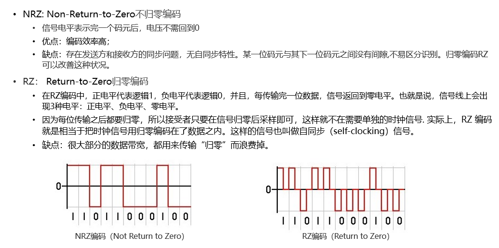
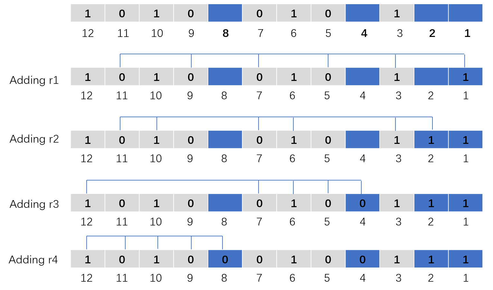
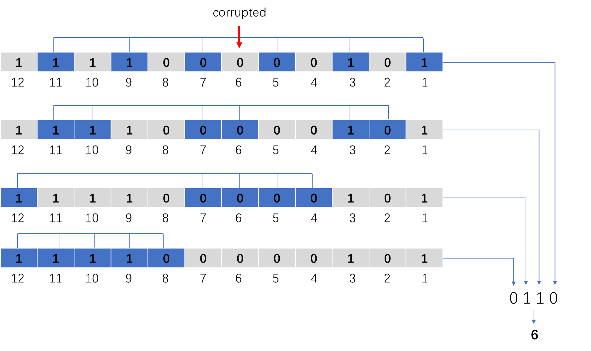

## 2022-2023学年上学期期中试卷（含答案）

### 一、单项选择题（本大题共 10 小题，每小题 2 分，共 20 分）

1. 点到点访问最常见的协议是点到点协议（PPP），它是一种（  ）协议。

    A. 面向比特的

    B. 面向字节的

    C. 面向字符的

    D. 以上均不正确

    <details>
    <summary>答案：</summary>

    B

    </details>

    ***

2. OSI 模型中的第二、第三、第四、第六层分别是（  ）。

    A. 物理层、网络层、会话层、传输层

    B. 数据链路层、网络层、传输层、会话层

    C. 物理层、数据链路层、传输层、应用层

    D. 数据链路层、网络层、传输层、表示层

    <details>
    <summary>答案：</summary>

    D

    </details>

    ***

3. PCM 是（  ）转换的一个实例。

    A. 数字到数字

    B. 模拟到数字

    C. 模拟到模拟

    D. 数字到模拟

    <details>
    <summary>答案：</summary>

    B

    </details>

    ***

4. 循环冗余校验 CRC 中的生成式包含（  ）因子时，可检测出所有的奇数位错误。

    A. $x$

    B. $x^2+x+1$

    C. $x+1$

    D. 以上均不是

    <details>
    <summary>答案：</summary>

    C

    </details>

    ***

5. 若数据链路层的发送窗口尺寸 $W_T=15$，在发送 7 号帧、并接到 5 号帧的确认帧后，发送方还可连续发送（  ）。

    A. 4 帧

    B. 5 帧

    C. 10 帧

    D. 13 帧

    <details>
    <summary>答案：</summary>

    D

    </details>

    ***

6. 设信道带宽为 4000HZ，采用 PCM 编码，采样周期为 $125\mu s$，每个样本量化为 128 个等级，则信道的数据率为（  ）。

    A. 10Kb/s

    B. 16Kb/s

    C. 56Kb/s

    D. 64Kb/s

    <details>
    <summary>答案：</summary>

    C

    </details>

    ***

7. 下列对 ADSL 网络的描述哪些是错误的？（  ）

    A. 采用普通电话线作为传输介质

    B. 当语音通话时，不能使用网络通信

    C. 上行线和下行线通信带宽不同

    D. ADSL 是一种异步传输模式

    <details>
    <summary>答案：</summary>

    B

    </details>

    ***

8. 在停止-等待协议中，当发送端所发送的数据帧出现丢失时，由于接收端收不到数据帧，也就不会给发送端发回相应的确认帧，则发送端会永远等待下去，解决这种死锁现象的办法是（  ）。

    A. 检错码

    B. 帧编号

    C. NAK 机制

    D. 超时重传

    <details>
    <summary>答案：</summary>

    D

    </details>

    ***

9. 在 OSI 模型中，一个层 N 与它的上层（第 N+1 层）的关系是（  ）。

    A. 第 N 层为第 N+1 层提供服务

    B. 第 N+1 层把从第 N 层接收到的信息添加一个报头

    C. 第 N 层使用第 N+1 层提供的服务

    D. 第 N 层与第 N+1 层相互没有关系

    <details>
    <summary>答案：</summary>

    A

    </details>

    ***

10. 以下关于海明码的说法正确的是（  ）

    A. 海明码利用奇偶性进行检错和纠错

    B. 海明码可以检测多个错误位

    C. 海明码可以检错但不能纠错

    D. 海明码中数据位的长度与校验位的长度必须相同

    <details>
    <summary>答案：</summary>

    A/B

    </details>

### 二、填空题（每空 2 分，共 16 分）

1. OSI 参考模型的三个主要概念是接口、服务和（  ）。

    <details>
    <summary>答案：</summary>

    协议

    </details>

    ***

2. 在一个 3000Hz 带宽的信道上传输二进制信号，信道信噪比 20dB，则该信道的最大传输速率是（  ）。

    <details>
    <summary>答案：</summary>

    6kbps

    </details>

    ***

3. 在回退 N 帧协议中，如果用 5 个 bit 序号对数据帧进行编号，发送窗口大小的最大值是（  ），接收窗口大小的最大值是（  ）。

    <details>
    <summary>答案：</summary>

    31；1

    </details>

    ***

4. 一种编码的检错能力和纠错能力取决于它的海明距离。海明距离为 $d+1$ 的编码能检测出（  ）个比特错误；如果为了能纠正 $d$ 个比特错误，则需要使用海明距离为（  ）的编码。

    <details>
    <summary>答案：</summary>

    $d$；$2d+1$

    </details>

    ***

5. 一个数据流中出现了这样的数据段：`A B ESC C ESC FLAG FLAG D`，假设采用字节填充法，那么填充之后的输出是（  ）。

    <details>
    <summary>答案：</summary>

    `A B ESC ESC C ESC ESC ESC FLAG ESC FLAG D`

    </details>

    ***

6. 若码字包含 $m$ 个信息位和 $r$ 个校验位，为了纠正单比特错误，$m$ 与 $r$ 应满足的关系是（  ）。

    <details>
    <summary>答案：</summary>

    $(m+r+1)\leq 2^r$

    </details>

### 三、名词解释（本大题共 4 小题，每小题 4 分，共 16 分）

1. 循环冗余校验码 CRC

    <details>
    <summary>答案：</summary>

    略

    </details>

    ***

2. 海明距离

    <details>
    <summary>答案：</summary>

    略

    </details>

    ***

3. 半双工通信

    <details>
    <summary>答案：</summary>

    略

    </details>

    ***

4. Sliding Window

    <details>
    <summary>答案：</summary>

    略

    </details>

### 四、简答题（本大题共 3 小题，每小题 6 分，共 18 分）

1. 请描述不归零编码 NRZ 和归零编码 RZ 的基本原理，并简要介绍两者的优缺点。

    <details>
    <summary>答案：</summary>

    

    </details>

    ***

2. 请列举四种多路复用的类型，并简要介绍其实现原理。

    <details>
    <summary>答案：</summary>

    多路复用分为：时分多路复用，频分多路复用，波分多路复用和码分多路复用。

    时分多路复用是以信道传输时间作为分割对象，通过为多个信道分配互不重叠的时间片段的方法来实现多路复用。时分多路复用将用于传输的时间划分为若干个时间片段，每个用户分得一个时间片。时分多路复用通信，是各路信号在同一信道上占有不同时间片进行通信。

    频分多路复用的基本原理是：如果每路信号以不同的载波频率进行调制，而且各个载波频率是完全独立的，即各个信道所占用的频带不相互重叠，相邻信道之间用“警戒频带”隔离，那么每个信道就能独立地传输一路信号。

    波分复用用同一根光纤内传输多路不同波长的光信号，以提高单根光纤的传输能力。

    码分多址是采用地址码和时间、频率共同区分信道的方式。CDMA 的特征是每个用户有特定的地址码，而地址码之间相互具有正交性，因此各用户信息的发射信号在频率、时间和空间上都可能重叠，从而使用有限的频率资源得到利用。

    </details>

    ***

3. 请解释为何选择重传协议中要设置以下语句？

    ```c
    #define NR_BUFS ((MAX_SEQ + 1)/2)
    ```

    <details>
    <summary>答案：</summary>

    该协议将窗口的最大尺寸设置为不超过序号空间的一半。

    这么做是为了确保接收方向前移动窗口之后，新窗口与老窗口的序号没有重叠。

    如果不这么设置，当接收方向前移动它的窗口后，新的有效序号范围与老的序号范围有重叠。因此，后续的一批帧可能是重复的帧（如果所有的确认都丢失了），也可能是新的帧（如果所有的确认都接收到了），而接收方根本无法区分这两种情形，将会导致往网络层传递不正确的数据包。

    </details>

### 五、计算题（本大题共 5 小题，每小题 6 分，共 30 分）

1. 假设站点的码片序列为：A：00101110 B：01011100 C：00011011 D：01000010，假设 A 发送了数据 0，C、D 发送了数据 1。试分析 CDMA 接收方收到的码片序列是什么。

    <details>
    <summary>答案：</summary>

    A 发送数据 0，对应的码片序列为 $(+1,+1,-1,+1,-1,-1,-1,+1)$

    C 发送数据 1，对应的码片序列为 $(-1,-1,-1,+1,+1,-1,+1,+1)$

    D 发送数据 1，对应的码片序列为 $(-1,+1,-1,-1,-1,-1,+1,-1)$

    收到的码片序列 $(-1,+1,-3,+1,-1,-3,+1,+1)$

    </details>

    ***

2. 设两站间信道速率为 20kb/s，采用停止等待协议，传播时延 $t_p=30ms$，确认帧长度和处理时间均可忽略。问帧长为多少才能使信道利用率达到至少 50%。

    <details>
    <summary>答案：</summary>

    在确认帧长度和处理时间均可忽略的情况下，要使信道利用率达到至少 50% 必须使数据帧的发送时间等于往返传播时延，即两倍的单向传播时延。

    即：

    $$t_t=2t_p$$

    已知：

    $$t_t=\frac{L}{C}$$

    其中 $C$ 为信道容量，$L$ 为帧长（以比特为单位）。

    所以得帧长

    $$L=2t_pC=2\times30ms\times20kb/s=1200\ bits$$

    </details>

    ***

3. 长度为 2000 位的数据帧，在数据传输速率为 1Mbps、最大长度为 1km 的物理线路上传输。假设线路的单向传输延迟时间为 199ms/km，试计算下列协议中发送者的发送窗口大小，以及每种协议下物理通信线路可达到的最大利用率？（数据帧的序列号为 4 位，确认帧的发送时间忽略不计）

    （1）stop-and-wait 协议

    （2）Go-Back-N 帧的滑动窗口协议

    （3）Selective Repeat 的滑动窗口协议

    <details>
    <summary>答案：</summary>

    对应三种协议的窗口大小值分别是 1、15（窗口大小为 $2^m-1$）和 8（窗口大小为 $2^{m-1}$）。

    以 1Mb/s 发送，2000bit 长的帧的发送时间为 2ms。1km 的线路传输时延为 199ms。用 $t=0$ 表示传输开始的时间，那么在 $t=2ms$ 时，第一帧发送完毕；$t=2+199=201ms$ 时，第一帧完全到达接收方；$t=201+199=400ms$ 时，对第一帧的确认帧完全到达发送方。因此一个发送周期为 400ms。如果在 400ms 内可以发送 $k$ 个帧，由于每一个帧的发送时间为 2ms，则信道利用率为 $2k/400$，因此：

    （1）$k=1$，最大信道利用率 $=2/400=0.5\%$

    （2）$k=15$，最大信道利用率 $=30/400=7.5\%$

    （3）$k=8$，最大信道利用率 $=16/400=4\%$

    </details>

    ***

4. 要发送的数据比特序列为 `1010001101`，CRC 校验生成多项式为 $g(x)=x^5+x^4+x^2+1$，试计算 CRC 校验码。

    <details>
    <summary>答案：</summary>

    `01110`

    </details>

    ***

5. （1）请计算二进制位串 `10100101` 的偶校验海明码。

    （2）接收方收到了一个 12 位的海明码，其 16 进制为 `0xA0F`，假设至多只有 1 位发生了错误。则原来的值用 16 进制表示是多少？（位数从右到左分别是第 1 位，第 2 位，……）。

    <details>
    <summary>答案：</summary>

    （1）`10100101` 的偶校验海明码是 `101000100111`，

    

    （2）`0xA4F`。

    `0xA0F` 的二进制：`101000001111`

    

    第 6 位发生错误，所以原来的值为 `101001001111`，对应 16 进制 `0xA4F`

    </details>
