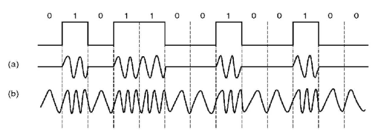
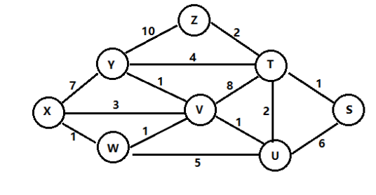
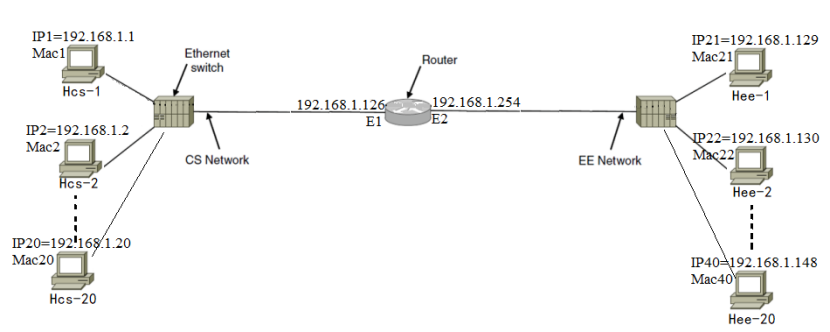
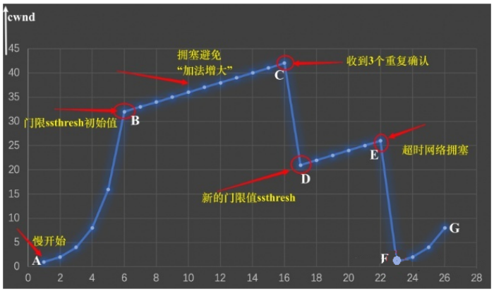
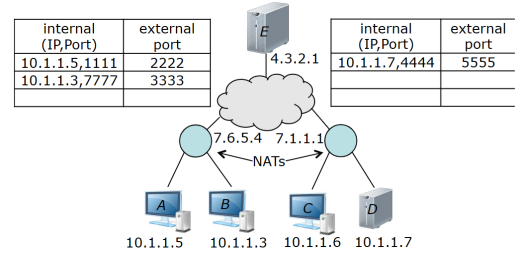

## 2022-2023学年上学期期末试卷（A）（含答案）

### 一、单项选择题（本大题共 15 小题，每小题 2 分，共 30 分）

1. 路由选择协议位于（    ）。

    A. 物理层

    B. 数据链路层

    C. 网络层

    D. 传输层

    

    
答案：

    C

    

    ***

2. 光纤通信中使用的复用方式是（    ）。

    A. 时分多路

    B. 波分多路

    C. 频分多路

    D. 码分多路

    

    
答案：

    B

    

    ***

3. 网络层中的数据传输基本单位是（    ）。

    A. 比特

    B. 数据帧

    C. 分组

    D. 报文

    

    
答案：

    C

    

    ***

4. 用户 A 与用户 B 通过卫星链路通信时，传播延迟为 270ms，假设数据速率是 64Kb/s，帧长 4000bit，若采用停等协议进行通信，则最大链路利用率为（    ）。

    A. 0.104

    B. 0.116

    C. 0.188

    D. 0.231

    

    
答案：

    A

    

    ***

5. 在 OSI 参考模型中，实现端到端的应答、分组排序和流量控制功能的协议层是（    ）。

    A. 数据链路层

    B. 网络层

    C. 传输层

    D. 应用层

    

    
答案：

    C

    

    ***

6. 若采用回退 N 帧 ARQ 协议进行流量控制，帧编号为 7 位，则发送窗口的最大长度为（    ）。

    A. 128

    B. 127

    C. 8

    D. 7

    

    
答案：

    B

    

    ***

7. 以太网中如果发生介质访问冲突，按照二进制指数后退算法决定下一次重发的时间，使用二进制后退算法的理由是（    ）。

    A. 这种算法简单

    B. 这种算法执行速度快

    C. 这种算法与网络的规模大小无关

    D. 这种算法考虑了网络负载对冲突的影响

    

    
答案：

    D

    

    ***

8. 使用海明码进行前向纠错，如果冗余位为 4 位，那么信息位最多可以用到（    ）位。

    A. 6

    B. 7

    C. 8

    D. 11

    

    
答案：

    D

    

    ***

9. 设信号的波特率为 600Baud，采用幅度－相位复合调制技术，由 4 种幅度和 4 种相位组成 16 种码元，则信道的数据率为（    ）。

    A. 600b/s

    B. 2400b/s

    C. 4800b/s

    D. 9600b/s

    

    
答案：

    B

    

    ***

10. 若信息码字为 11100011，生成多项式 $G(X)=X^5+X^4+X+1$，则计算出的 CRC 校验码为（    ）。

    A. 01101

    B. 11010

    C. 001101

    D. 0011010

    

    
答案：

    B

    

    ***

11. 内部网关协议 RIP 是一种广泛使用的基于（    ）的协议。

    A. 链路状态算法

    B. 距离矢量算法

    C. 集中式路由算法

    D. 固定路由算法

    

    
答案：

    B

    

    ***

12. 四次握手方法用于（    ）。

    A. 传输层连接的建立

    B. 传输层连接的释放

    C. 传输层的重复检测

    D. 传输层的流量控制

    

    
答案：

    B

    

    ***

13. 以下给出的地址中，属于子网 192.168.15.19/28 的主机地址是（    ）。

    A. 192.168.15.17

    B. 192.168.15.14

    C. 192.168.15.16

    D. 192.168.15.31

    

    
答案：

    A

    

    ***

14. IP 地址为 145.110.0.0 的 B 类网络，若要切割为 9 个子网，而且都要连上 Internet，请问子网掩码设为（    ）。

    A. 255.0.0.0

    B. 255.255.0.0

    C. 255.255.128.0

    D. 255.255.240.0

    

    
答案：

    D

    

    ***

15. 不使用面向连接传输服务的应用层协议是（    ）。

    A. SMTP

    B. FTP

    C. HTTP

    D. SNMP

    

    
答案：

    D

    

***

### 二、填空题（每空 1 分，共 15 分）

1. 有两种基本的差错控制编码，即 ________ 和纠错码，在计算机网络和数据通信中广泛使用的一种纠错码为 ________。

    

    
答案：

    检错码；海明码

    

    ***

2. 若数据帧的数据段中出现比特串“010111110”，则比特填充后的输出为 ________。

    

    
答案：

    0101111100

    

    ***

3. 超五类非屏蔽双绞线由 ________ 对导线组成。

    

    
答案：

    4

    

    ***

4. ________ 是 IEEE 802.11 无线局域网的 MAC 子层协议，主要用于解决无线局域网的信道共享访问问题。

    

    
答案：

    CSMA/CA

    

    ***

5. 下图所示的信号调制方式中，（a）是 ________ 调制，（b）是 ________ 调制。

    

    

    
答案：

    振幅；频率

    

    ***

6. 将 IP 数据报头中的私有 IP 地址转换为公网 IP 地址的协议是 ________。

    

    
答案：

    NAT

    

    ***

7. 当 TCP 实体要建立连接时，其段头中的 SYN 标志设置为 ________。

    

    
答案：

    1

    

    ***

8. IEEE802.3 规定了一个数据帧的长度为 ________ 字节到 ________ 字节之间。

    

    
答案：

    64；1518

    

    ***

9. 无类别域间路由（CIDR）技术有效的解决了路由缩放问题。使用 CIDR 技术把 4 个网络 C1：192.24.0.0/21，C2：192.24.16.0/20，C3：192.24.8.0/22，C4：192.24.34.0/23 汇聚成一条路由信息，得到的网络地址是 ________。

    

    
答案：

    192.24.0.0/18

    

    ***

10. 常用的 IP 地址有 A、B、C 三类，128.11.3.31 是一个 ________ 类 IP 地址，其网络标识（netid）为 ________，主机标识（hosted）为 ________。

    

    
答案：

    B；128.11；3.31

    

***

### 三、计算题（本大题共 6 小题，共 40 分）

1. （6 分）如果主机 A 到主机 B 相距 3000km，信道的传输速率为 1Mbps，信号传播速率为 200km/ms，发送的数据帧和确认帧长都为 64 字节。A 和 B 之间采用回退 N 帧协议（协议 5）或选择性重发协议（协议 6）进行差错控制和流量控制。请回答以下问题：

    （1）要使信道的利用率达到最高，如果采用协议 5，帧序号应该为多少位？

    （2）要使信道的利用率达到最高，如果采用协议 6，帧序号应该是多少位？

    

    
答案：

    （2 分）发送一个帧至收到该帧的确认所需要的时间 $T$ 为 $2*(64*8/1M+3000km/200)=2*(0.512ms+15ms)=2*15.512=31.024ms$，在 31.024ms 中可以发送的帧数为 60.6。

    （1）（2 分）用协议 5，序号为 6 位。

    （2）（2 分）用协议 6，序号为 7 位。

    

    ***

2. （6 分）某接收端收到 16 位海明码为 0x8a10，试分析发送端发送的原始数据为多少？（假设海明码中不会出现多于 1 位错，位置从左至右递增编号）

    

    
答案：

    第 1 位校验第 1, 3, 5, 7, 9, 11, 13, 15 位（非偶检验码）（1 分）

    第 2 位校验第 2, 3, 6, 7, 10, 11, 14, 15 位（非偶检验码）（1 分）

    第 4 位校验第 4, 5, 6, 7, 12, 13, 14, 15 位（非偶检验码）（1 分）

    第 8 位校验第 8, 9, 10, 11, 12, 13, 14, 15 位（非偶检验码）（1 分）

    第 16 位校验第 16 位（偶检验码）（1 分）

    故，第 $1+2+4+8=15$ 位有错，因此正确的海明码为：1000 1010 0001 0010，发送的原始数据为：0101 0001 001（1 分）

    

    ***

3. （6 分）一台 TCP 机器正在通过一条 1Gbps 的信道发送满窗口的 65535 字节数据，该信道的单向延迟时间为 10 毫秒。试问可以达到的最大吞吐量是多少？线路的效率是多少？

    

    
答案：

    RTT = 单向时延 * 2 = 20ms。（2 分）

    吞吐量 = $65536*8/RTT=26.214Mbps$。（2 分）

    线路效率 = $26.214Mbps/1Gbps=2.6214\%$。（2 分）

    

    ***

4. （6 分）一个 1km 长的 10Mbps 的 CSMA/CD 局域网（不是 802.3），其传播速度为 200 米/微秒。数据帧长度是 256 位，其中包括用于帧头、校验和以及其他开销的 32 位。传输成功后的第一个时隙被留给接收方，用来捕捉信道并发送一个 32 位的确认帧。假设没有冲突发生，试计算有效数据率（不包括开销）是多少？

    

    
答案：

    首先计算信号在信道上的 RTT，得 RTT = 10μsec。因此，可以认为 slot 的长度也是 10μsec。对于无冲突的一次传输过程，有以下几步：

    发送方监听一个完整的 slot，确认信道空闲，准备发送帧，用时 10μsec；

    发送方发送帧，用时 25.6μsec；

    等待该帧完全到达接收方，用时 5μsec；

    接收方也要监听一个完整的 slot，确认信道空闲，准备发送 ack，用时 10μsec；

    接收方发送 ack 帧，用时 3.2μsec；

    等待该帧完全到达发送方，用时 5μsec。

    上面 6 个时间相加总和是 58.8μsec。（4 分）

    这期间总共发送的有效数据为 224bit。（1 分）

    计算有效数据率得 3.8Mbps。（1 分）

    

    ***

5. （6 分）某通信子网拓扑结构如下图所示，采用链路状态路由算法，试分析路由器 X 的路由表并填写下表。

    

    | 目的 | 下一跳 | 代价 |
    | --- | --- | --- |
    | S | (1) | (2) |
    | T | (3) | (4) |
    | U | (5) | (6) |
    | V | (7) | (8) |
    | W | W | 1 |
    | Y | (9) | (10) |
    | Z | (11) | (12) |

    

    
答案：

    | 目的 | 下一跳 | 代价 |
    | --- | --- | --- |
    | s | W | 6 |
    | t | W | 5 |
    | u | W | 3 |
    | v | W | 2 |
    | w | W | 1 |
    | y | W | 3 |
    | z | W | 7 |

    

    ***

6. （10 分）如下所示网络中有 CS 和 EE 两个以太局域网，并已分别为部分主机和路由器接口分配了 IP 地址。Mac1-Mac40 以及 E1-E2 分别为主机以及路由器端口的 MAC 地址，Hcs-1 向 Hcs-2 发送了数据帧 F1，Hcs-1 向 Hee-1 发送了数据帧 F2。请回答下列问题。

    

    CS、EE 以太局域网的广播地址和子网地址分别是什么？

    填写下表。

    | 数据帧 | 源 IP 地址 | 源 MAC 地址 | 目的 IP 地址 | 目的 MAC 地址 |
    | --- | --- | --- | --- | --- |
    | 以太网 CS 中的 F1 | IP1 | （1） | IP2 | （2） |
    | 以太网 CS 中的 F2 | IP1 | （3） | IP21 | （4） |
    | 以太网 EE 中的 F2 | IP1 | （5） | IP21 | （6） |

    

    
答案：

    （1）

    CS 以太局域网广播地址为 192.168.1.127，EE 以太局域网广播地址为 192.168.1.255。

    CS 以太局域网的子网地址为 192.168.1.0/25，EE 以太局域网的子网地址为 192.168.1.128/25。（4 分）

    （2）（6 分）

    | 数据帧 | 源 IP 地址 | 源 MAC 地址 | 目的 IP 地址 | 目的 MAC 地址 |
    | --- | --- | --- | --- | --- |
    | 以太网 CS 中的 F1 | IP1 | Mac1 | IP2 | Mac2 |
    | 以太网 CS 中的 F2 | IP1 | Mac1 | IP21 | E1 |
    | 以太网 EE 中的 F2 | IP1 | E2 | IP21 | Mac21 |

    

***

### 四、分析题（共 15 分）

1. （15 分）TCP 拥塞窗口 cwnd 大小与 RTT 的关系如下表所示：

    | cwnd | 1 | 2 | 4 | 8 | 16 | 32 | 33 | 34 | 35 | 36 | 37 | 38 | 39 |
    | --- | --- | --- | --- | --- | --- | --- | --- | --- | --- | --- | --- | --- | --- |
    | RTT | 1 | 2 | 3 | 4 | 5 | 6 | 7 | 8 | 9 | 10 | 11 | 12 | 13 |
    | cwnd | 40 | 41 | 42 | 21 | 22 | 23 | 24 | 25 | 26 | 1 | 2 | 4 | 8 |
    | RTT | 14 | 15 | 16 | 17 | 18 | 19 | 20 | 21 | 22 | 23 | 24 | 25 | 26 |

    试画出拥塞窗口与 RTT 的关系曲线。（2 分）

    指明 TCP 工作在慢启动阶段的时间段。（2 分）

    指明 TCP 链接拥塞避免阶段的时间段。（2 分）

    在 RTT=16、RTT=22 之后发送方是通过收到的三个重复的确认还是通过超时检测到丢失了报文段？（2 分）

    在 RTT=1，RTT=20 和 RTT=26 时，阈值 ssthresh 分别被设置为多大？（3 分）

    在 RTT 等于多少时发送出第 80 个报文段？（2 分）

    假定在 RTT=26 之后收到了三个重复的确认，因而检测出了报文段的丢失那么拥塞窗口 cwnd 和阈值 ssthresh 应设置为多大？（2 分）

    

    
答案：

    （1）（2 分）

    

    （2）A 点到 B 点，F 点 G 点，是慢开始阶段。即 [RTT=1,RTT=6]（1 分），[RTT=23,RTT=26]（1 分）

    （3）B 点到 C 点，D 点到 E 点，是拥塞避免阶段。即 [RTT=6,RTT=16]（1 分），[RTT=17,RTT=22]（1 分）

    （4）RTT=16，是 C 点处，是收到了三个确认 ACK；（1 分）

    RTT=22，是 E 点，是发送方通过超时检测到丢失了报文段。（1 分）

    （5）RTT=1，阈值 ssthresh 是 32。（1 分）

    RTT=20 时，阈值 ssthresh 是 21。（1 分）

    RTT=26 时，阈值 ssthresh 是 13。（1 分）

    （6）RTT=7，发送了第 80 个报文段。（2 分）

    （7）拥塞窗口 cwnd 设置为 4（1 分）；阈值 ssthresh 应设置为 4（1 分）。

    

***

## 2022-2023学年上学期期末试卷（B）（含答案）

### 一、单项选择题（本大题共 15 小题，每小题 2 分，共 30 分）

1. 在 OSI 模型中，一个层 N 与它的上层（第 N+1 层）的关系是（    ）。

    A. 第 N 层为第 N+1 层提供服务

    B. 第 N+1 层把从第 N 层接收到的信息添加一个报头

    C. 第 N 层使用第 N+1 层提供的服务

    D. 第 N 层与第 N+1 层相互没有关系

    

    
答案：

    A

    

    ***

2. 以下关于计算机网络特征的描述中，哪一个是错误的？（    ）

    A. 计算机网络建立的主要目的是实现计算机资源的共享

    B. 网络用户可以调用网中多台计算机共同完成某项任务

    C. 联网计算机既可以联网工作也可以脱网工作

    D. 联网计算机必须作用统一的操作系统

    

    
答案：

    D

    

    ***

3. 关于网络体系结构，以下哪种描述是错误的？（    ）

    A. 物理层完成比特流的传输

    B. 数据链路层用于保证端到端数据的正确传输

    C. 网络层为分组通过通信子网选择适合的传输路径

    D. 应用层处于参考模型的最高层

    

    
答案：

    B

    

    ***

4. 若数据链路的发送窗口尺寸 $W_T=7$，在发送 4 号帧、并接到 2 号帧的确认帧后，发送方还可连续发送（    ）。

    A. 4 帧

    B. 5 帧

    C. 6 帧

    D. 3 帧

    

    
答案：

    B

    

    ***

5. 以太网采用（    ）协议进行多路访问控制。

    A. CSMA/CA

    B. ALOHA

    C. CSMA/CD

    D. Bit-Map

    

    
答案：

    C

    

    ***

6. 以下各项中，不是数据报操作特点的是（    ）。

    A. 每个分组自身携带有足够的信息，它的传送是被单独处理的

    B. 在整个传送过程中，不需建立虚电路

    C. 使所有分组按顺序到达目的端系统

    D. 网络节点要为每个分组做出路由选择

    

    
答案：

    C

    

    ***

7. 与 10.110.12.29，掩码 255.255.255.224 属于同一网段的主机 IP 地址是（    ）。

    A. 10.110.12.0

    B. 10.110.12.30

    C. 10.110.12.41

    D. 10.110.12.32

    

    
答案：

    B

    

    ***

8. 从源向目的传送数据段的过程中，TCP 使用什么机制提供流量控制（    ）。

    A. 序列号

    B. 会话创建

    C. 窗口大小

    D. 确认

    

    
答案：

    C

    

    ***

9. 以下关于不同网络拓扑特点的描述中，错误的是（    ）。

    A. 星型拓扑网络的中心节点是网络性能与可靠性的瓶颈所在

    B. 总线型拓扑网络必须解决多节点访问共享总线的介质访问控制策略问题

    C. 环型拓扑网络的优点在于它不需要解决多节点访问总线的介质访问控制策略问题

    D. 网状拓扑网络必须解决路由选择算法、流量控制与拥塞控制

    

    
答案：

    C

    

    ***

10. 网桥是一种（    ）的设备。

    A. 可以用于网段隔离

    B. 具有转发帧的功能

    C. 工作在数据链路层上

    D. 具有以上全部功能

    

    
答案：

    D

    

    ***

11. 以下对网络设备及接口的描述中，错误的是（    ）。

    A. 中继器、集线器工作在物理层

    B. RJ-45 接口的 8 芯连接头中，只有 1、3、5、6 四根线芯用来接收和发送数据

    C. 中继器有两个端口

    D. 连接在集线器上的所有计算机节点属于一个冲突域

    

    
答案：

    B

    

    ***

12. 使用载波信号的两种不同幅度来表示二进制值的两种状态的数据编码方式称为（    ）。

    A. 振幅调制

    B. 频率调制

    C. 相位调制

    D. 振幅相位调制

    

    
答案：

    A

    

    ***

13. 在下列传输介质中，哪种传输介质的抗电磁干扰性最好？（    ）

    A. 双绞线

    B. 同轴电缆

    C. 光缆

    D. 无线介质

    

    
答案：

    C

    

    ***

14. 关于 TCP 协议，下列说法错误的是（    ）。

    A. 可以提供可靠的数据传输服务

    B. 可以提供面向连接的数据传输服务

    C. 可以提供全双工的数据传输服务

    D. 可以提供无连接的数据传输服务

    

    
答案：

    D

    

    ***

15. 在 TCP 协议中，当发现一个数据包丢失了，TCP 将采取以下哪种策略？（    ）

    A. 重传所有未确认的数据包

    B. 重传丢失的数据包

    C. 重传丢失的数据包以及后面的所有数据包

    D. 不进行任何操作

    

    
答案：

    B

    

***

### 二、填空题（每空 1 分，共 10 分）

1. 为了纠正单比特错误，对于数据位长度为 20 的码字，校验位至少需要（        ）位。常见的单比特错纠错码是（        ）。

    

    
答案：

    5；海明码

    

    ***

2. 假定 PSTN 的带宽是 3000 Hz，若用 4 种不同的状态来表示数据，在不考虑热噪声的情况下，该信道每秒最多能传送的位数为（        ）。信噪比是 20dB，理论上可以取得的最大信息（数据）速率是（        ）bps。

    

    
答案：

    12000；$3000 \times \log_2 101$

    

    ***

3. 数据链路层被划分成两个子层，分别是（        ）子层和（        ）子层。

    

    
答案：

    介质访问控制/MAC；逻辑链路控制/LLC

    

    ***

4. 假设主机 A 通过 TCP 连接将两个 TCP 数据段发送到主机 B。第一个数据段的序列号为 90；第二个数据段的序列号为 110。第一个数据段中数据字段的字节数为（        ）。假设第一个数据段丢失，但第二个数据段到达 B。在主机 B 发送给主机 A 的确认中，确认编号是（        ）。

    

    
答案：

    20；90

    

    ***

5. 采用曼彻斯特编码的数字信道，波特率为 20 M Baud/s，其数据传输速率为（        ）。

    

    
答案：

    10Mbps 或 10Mb/s

    

    ***

6. 以太网利用（        ）协议获得目的主机 IP 地址与 MAC 地址的映射关系。

    

    
答案：

    ARP 或地址解析协议

    

***

### 三、计算题（本大题共 7 小题，第 1-6 小题每题 5 分，第 7 小题 10 分，共 40 分）

1. （5 分）对一个无限用户的纯 ALOHA 信道的测试表明，20% 的时槽是空闲的。

    （1）信道负载 G 是多少？

    （2）吞吐量是多少？

    （3）该信道是负载不足还是过载了，并说明理由。

    

    
答案：

    （2 分）$P_0=e^{-G}=0.2$，$G=\ln(1/P_0)=\ln 5=1.6$。

    （1 分）吞吐量：$S=G e^{-2G}=\ln 5 \times e^{-2G}=0.064$。

    （2 分）$G>0.5$（纯 ALOHA 最优负载时 $G$ 为 0.5），过载了。

    

    ***

2. （5 分）假设生成多项式 $G(x)=x^2+x+1$，帧为 1010。请使用多项式除法确定其 CRC 编码。

    

    
答案：

    （1 分）帧 1010 记为多项式 $x^3+x$。

    （1 分）增加 order 后变为 $x^5+x^3$。

    （2 分）$(x^5+x^3)/(x^2+x+1)=x^3+x^2+x..x$，即 CRC 为 10。

    （1 分）CRC 编码为 101010。（1 分）

    

    ***

3. （5 分）考虑建立一个以太网，电缆最长为 1000m，运行速率为 10 Mbps。电缆中的信号速度是 100m/us。问最小帧长度是多少位？

    

    
答案：

    假设数据帧的长度为 L 位。

    （1 分）$t=1000m/(100m/us)=10us=10 \times 10^{-6}s$

    （1 分）$T_s=L/10Mbps$

    （2 分）$T_s \ge 2t$

    （1 分）故数据帧长度 $L \ge 200b$

    

    ***

4. （5 分）假定四个站点使用 CDMA 码分多址技术在一条通讯线路上进行数据传输，其分配的序列号（码片）和各自传输的数据如下表所示。请根据表中的码片和数据依次计算接收站点接收到的信号。

    | 站点 | 码片 | 数据（从左至右传输） |
    | --- | --- | --- |
    | A | 1001 | 1010 |
    | B | 1010 | 1001 |
    | C | 1100 | 0100 |
    | D | 1111 | 0110 |

    

    
答案：

    | 站点码片序列 | T0 | T1 | T2 | T3 |
    | --- | --- | --- | --- | --- |
    | A | (+1 -1 -1 +1) | (-1 +1 +1 -1) | (+1 -1 -1 +1) | (-1 +1 +1 -1) |
    | B | (+1 -1 +1 -1) | (-1 +1 -1 +1) | (-1 +1 -1 +1) | (+1 -1 +1 -1) |
    | C | (-1 -1 +1 +1) | (+1 +1 -1 -1) | (-1 -1 +1 +1) | (-1 -1 +1 +1) |
    | D | (-1 -1 -1 -1) | (+1 +1 +1 +1) | (+1 +1 +1 +1) | (-1 -1 -1 -1) |
    | 接收到的信号 | (0 -4 0 0) | (0 +4 0 0) | (0 0 0 +4) | (-2 -2 +2 -2) |

    

    ***

5. （5 分）信道速率为 4kb/s。采用停止等待协议。传播时延 20ms，确认帧长度和处理时间均可忽略。问帧长为多少才能使信道利用率达到至少 50%。

    

    
答案：

    （3 分）$(L/C)/(L/C+2T_p)\ge 50\%$

    （2 分）$L\ge C*2T_p$，即 $L\ge 4*10^3*2*20*10^{-3}=160bit$

    

    ***

6. （5 分）现需要将一个包含 L 字节的超大文件从主机 A 传输到主机 B。假设最大数据段长度 MSS 为 536 字节。

    L 的最大值是多少，才会保证 TCP 序列号不会用尽？提示：TCP 序列号字段有 4 个字节。

    根据题（1）的计算结果，请计算传输文件所需的时间。假设在将数据包发送至 155 Mbps 链路之前，每个数据段头部将添加总长度为 66 字节的传输层、网络层和数据链路层头部字段。假设 A 可以连续发送数据段，忽略流量控制和拥塞控制。

    

    
答案：

    （2 分）TCP 数据段序号随数据字段的字节数增长，因此 L 不能超过 $2^{32}$ 字节，约 4.19G 字节。

    （3 分）数据段个数为 $2^{32}/536$，约 8012999，每个数据段需要增加 66 字节的头部，即 $8012999 \times 66=528857934$ 字节，总共需要传输 $2^{32}+528857934=4.824\times10^9$ 字节。$4.824\times10^9\times8/155M$，大约 249 秒。

    

    ***

7. （10 分）现有 2400 字节的数据报在 MTU 为 700 字节的链路上发送。假设原始数据报的标识（Identification）为 422。需要生成多少个分段？生成的 IP 数据报中与分段相关的各个字段的值是什么？请给出计算过程，并将计算结果填写在下表中。

    | 分段编号 | 分段总字节数 | 标识 | 偏移量 | DF | MF |
    | --- | --- | --- | --- | --- | --- |
    | 1 |  |  |  |  |  |
    | 2 |  |  |  |  |  |
    | 3 |  |  |  |  |  |
    | 4 |  |  |  |  |  |

    

    
答案：

    评分标准：计算过程占 6 分，表占 4 分。

    每个分段中数据字段最大值 = 680（因为有 20 字节 IP 标头，同时 680 是 8 的整数倍）。因此所需片段的数量为 $(2400-20)/680=3.5$，即需要 4 个分段。

    每个片段的标识均为 422。

    第一个分段，偏移量为 0，分段总字节数为 $680+20=700$；

    第二个分段，偏移量为 $680/8=85$，分段总字节数为 $680+20=700$；

    第三个分段，偏移量为 $85+680/8=170$，分段总字节数为 $680+20=700$；

    第四个分段，偏移量为 $170+680/8=255$，分段总字节数为 $2400-20-680*3+20=360$；

    除最后一个片段外，每个片段的大小为 700 字节（包括 IP 标头）。最后一个数据报的大小为 360 字节（包括 IP 标头）。4 个片段的偏移量将为 0、85、170、255。

    | 分段编号 | 分段总字节数 | 标识 | 偏移量 | DF | MF |
    | --- | --- | --- | --- | --- | --- |
    | 1 | 700 | 422 | 0 | 0 | 1 |
    | 2 | 700 | 422 | 85 | 0 | 1 |
    | 3 | 700 | 422 | 170 | 0 | 1 |
    | 4 | 360 | 422 | 255 | 0 | 0 |

    

***

### 四、分析题（本大题共 2 小题，每小题 10 分，共 20 分）

1. （10 分）下图给出了两个均包含实现 NAT 的路由器的网络。假设左侧网络中的主机 A 连接到位于主机 E 的 Web 服务器（其工作端口 port 为 80）。假设右侧网络中的用户在主机 D 上运行游戏服务器，并邀请位于主机 B 的朋友加入游戏会话。

    

    （1）针对主机 A 和主机 E 之间的通信，请给出主机 A 发送的典型数据包的地址和端口字段（在编号为 1 的行对应的表项填写），以及上述数据包到达 E 时的字段（在编号为 2 的行对应的表项填写）。

    （2）针对主机 B 和主机 D 之间的通信，请给出离开主机 B 的典型数据包的地址和端口字段（在编号为 3 的行对应的表项填写）、上述数据包通过公共 Internet 时的字段（在编号为 4 的行对应的表项填写）以及这些数据包传送到 D 时的字段（在编号为 5 的行对应的表项填写）。

    | 行号 | 源 IP 地址 | 目的 IP 地址 | 源端口号 | 目的端口号 |
    | --- | --- | --- | --- | --- |
    | 1 |  |  |  |  |
    | 2 |  |  |  |  |
    | 3 |  |  |  |  |
    | 4 |  |  |  |  |
    | 5 |  |  |  |  |

    

    
答案：

    评分标准：每空 0.5 分。共 10 分。

    | 行号 | 源 IP 地址 | 目的 IP 地址 | 源端口号 | 目的端口号 |
    | --- | --- | --- | --- | --- |
    | 1 | 10.1.1.5 | 4.3.2.1 | 1111 | 80 |
    | 2 | 7.6.5.4 | 4.3.2.1 | 2222 | 80 |
    | 3 | 10.1.1.3 | 7.1.1.1 | 7777 | 5555 |
    | 4 | 7.6.5.4 | 7.1.1.1 | 3333 | 5555 |
    | 5 | 7.6.5.4 | 10.1.1.7 | 3333 | 4444 |

    

    ***

2. （10 分）假设某工作站使用 TCP Tahoe，ssthresh 值为 6 MSS。该工作站现在处于慢启动状态，cwnd = 4 MSS。在下表中填写 cwnd、sstresh 的值以及工作站在以下每个事件之前和之后处于的状态：四个连续的非重复 ACK 到达，然后超时，然后是三个非重复 ACK 到达。

    | 状态 | 事件 | ssthresh | cwnd | 状态 |
    | --- | --- | --- | --- | --- |
    | 慢启动 | ACK 到达 | 6 |  |  |
    |  | ACK 到达 |  |  |  |
    |  | ACK 到达 |  |  |  |
    |  | ACK 到达 |  |  |  |
    |  | 超时 |  |  |  |
    |  | ACK 到达 |  |  |  |
    |  | ACK 到达 |  |  |  |
    |  | ACK 到达 |  |  |  |

    

    
答案：

    评分标准：状态列、ssthresh 列每列 2 分，cwnd 列 3 分，共 10 分。

    | 状态 | 事件 | ssthresh | cwnd | 状态 |
    | --- | --- | --- | --- | --- |
    | 慢启动 | ACK 到达 | 6 | 4+1=5 | 慢启动 |
    | 慢启动 | ACK 到达 | 6 | 5+1=6 | 拥塞避免 |
    | 拥塞避免 | ACK 到达 | 6 | 6+1/6=6.17 | 拥塞避免 |
    | 拥塞避免 | ACK 到达 | 6 | 6.17+1/6.17=6.33 | 拥塞避免 |
    | 拥塞避免 | 超时 | 3 | 1 | 慢启动 |
    | 慢启动 | ACK 到达 | 3 | 1+1=2 | 慢启动 |
    | 慢启动 | ACK 到达 | 3 | 2+1=3 | 拥塞避免 |
    | 拥塞避免 | ACK 到达 | 3 | 3+1/3=3.33 | 拥塞避免 |

    

