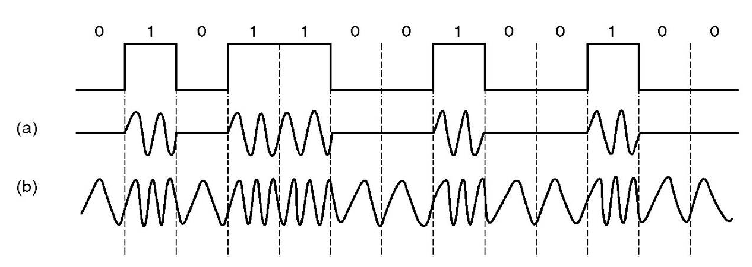
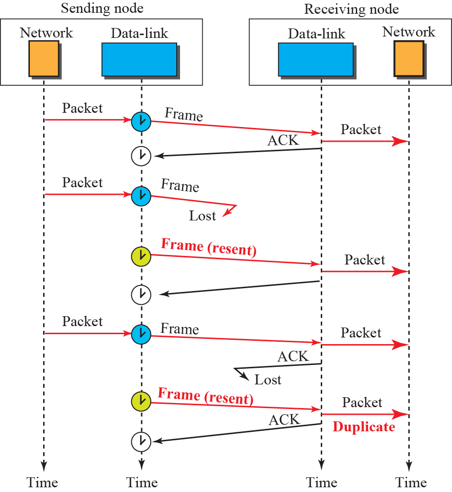

## 2023-2024学年上学期期中试卷（含答案）

### 一、单项选择题（本大题共 10 小题，每小题 2 分，共 20 分）

1. 以下关于计算机网络特征的描述中，哪一个是错误的？（  ）

    A. 计算机网络建立的主要目的是实现计算机资源的共享

    B. 网络用户可以调用网中多台计算机共同完成某项任务

    C. 联网计算机既可以联网工作也可以脱网工作

    D. 联网计算机必须作用统一的操作系统

    

    
答案：

    D

    

    ***

2. 关于网络体系结构，以下哪种描述是错误的？（  ）

    A. 物理层完成比特流的传输

    B. 数据链路层用于保证端到端数据的正确传输

    C. 网络层为分组通过通信子网选择适合的传输路径

    D. 应用层处于参考模型的最高层

    

    
答案：

    B

    

    ***

3. 路由选择协议位于（  ）。

    A. 物理层

    B. 数据链路层

    C. 网络层

    D. 传输层

    

    
答案：

    C

    

    ***

4. 光纤通信中使用的复用方式是（  ）。

    A. 时分多路

    B. 波分多路

    C. 频分多路

    D. 码分多路

    

    
答案：

    B

    

    ***

5. 网络层中的数据传输基本单位是（  ）。

    A. 比特

    B. 数据帧

    C. 分组

    D. 报文

    

    
答案：

    C

    

    ***

6. 用户 A 与用户 B 通过卫星链路通信时，传播延迟为 270ms，假设数据速率是 64Kb/s，帧长 4000bit，若采用停等协议进行通信，则最大链路利用率为（  ）。

    A. 0.104

    B. 0.116

    C. 0.188

    D. 0.231

    

    
答案：

    A

    

    ***

8. 若采用回退 N 帧 ARQ 协议进行流量控制，帧编号为 7 位，则发送窗口的最大长度为（  ）。

    A. 128

    B. 127

    C. 8

    D. 7

    

    
答案：

    B

    

    ***

9. 在下列传输介质中，哪种传输介质的抗电磁干扰性最好？（  ）

    A. 双绞线

    B. 同轴电缆

    C. 光缆

    D. 无线介质

    

    
答案：

    C

    

    ***

10. 设信号的波特率为 600Baud，采用幅度－相位复合调制技术，由 4 种幅度和 4 种相位组成 16 种码元，则信道的数据率为（  ）。

    A. 600b/s

    B. 2400b/s

    C. 4800b/s

    D. 9600b/s

    

    
答案：

    B

    

### 二、填空题（每空 2 分，共 20 分）

1. 为了纠正单比特错误，对于数据位长度为 20 的码字，校验位至少需要（  ）位。常见的单比特错纠错码是（  ）。

    

    
答案：

    5；海明码

    

    ***

2. 数据链路层被划分成两个子层，分别是（  ）子层和（  ）子层。

    

    
答案：

    介质访问控制/MAC；逻辑链路控制/LLC

    

    ***

3. 假定 PSTN 的带宽是 3000Hz，若用 4 种不同的状态来表示数据，在不考虑热噪声的情况下，该信道每秒最多能传送的位数为（  ）。信噪比是 20dB，理论上可以取得的最大信息（数据）速率是（  ）bps。

    

    
答案：

    12000；$3000\times\log_2 101$

    

    ***

4. 若数据帧的数据段中出现比特串 `010111110`，则比特填充后的输出为（  ）。

    

    
答案：

    `0101111100`

    

    ***

5. 超五类非屏蔽双绞线由（  ）对导线组成。

    

    
答案：

    4

    

    ***

6. 下图所示的信号调制方式中，（a）是（  ）调制，（b）是（  ）调制。

    

    

    
答案：

    振幅；频率

    

### 三、简答题（本大题共 5 小题，每小题 6 分，共 30 分）

1. 假设生成多项式 $G(x)=x^2+x+1$，帧为 `1010`。请用多项式除法确定其 CRC 校验位及最终的编码。

    

    
答案：

    （1 分）帧 `1010` 记为多项式 $x^3+x$，

    （1 分）增加 order 后变为 $x^5+x^3$。

    （2 分）$(x^5+x^3)/(x^2+x+1)=x^3+x^2+x..x$，

    （1 分）CRC 校验位为 `10`

    （1 分）最终的编码为 `101010`（1 分）

    

    ***

2. 请给出数据链路层可能提供的服务类型及对应的网络实例。

    

    
答案：

    （1）不带确认的面向无连接服务，以太网是提供这种类型服务的网络实例；

    （2）带确认的面向无连接服务，802.11 无线局域网是提供这种类型服务的网络实例；

    （3）带确认的面向连接服务，提供这种类型服务的网络实例很少见。

    

    ***

3. 如果主机 A 到主机 B 相距 3000km，信道的传输速率为 1Mbps，信号传播速率为 200km/ms，发送的数据帧和确认帧长都为 64 字节。A 和 B 之间采用回退 N 帧协议（协议 5）或选择性重传协议（协议 6）进行差错控制和流量控制。请回答以下问题：

    （1）要使信道的利用率达到最高，如果采用协议 5，帧序号应该为多少位？

    （2）要使信道的利用率达到最高，如果采用协议 6，帧序号应该是多少位？

    

    
答案：

    （2 分）发送一个帧至收到该帧的确认所需要的时间 $T$ 为 $2\times(64\times8/1M+3000km/200)=2\times(0.512ms+15ms)=2\times15.512=31.024ms$，在 31.024ms 中可以发送的帧数为 60.6。

    （1）（2 分）用协议 5，序号为 6 位

    （2）（2 分）用协议 6，序号为 7 位

    

    ***

4. 有噪声停等协议对数据帧和确认帧均使用序号机制。请通过具体实例分析（可以是时序图的形式），如果没有对数据帧和确认帧进行编号，会导致什么问题。

    

    
答案：

    

    如上图橙色框的例子所示，发送方成功发送一帧，接收方反馈的 ACK 丢失，发送方重传，由于没有对数据帧和确认帧进行编号，接收方会将重传帧作为新帧错误地重复递交给上层处理。如果对数据帧和确认帧进行编号，接收方便能将重传帧丢弃，并通过确认帧序号反馈其期待的数据帧的正确编号。

    

    ***

5. 假设要在两个计算机之间传输文件，文件被分割成分组进行传输。请分别针对以下两种场景设计适用的确认机制，并简要分析原因。

    （1）传输质量差的网络；

    （2）传输质量很好的网络。

    

    
答案：

    （1）（3 分）接收方对单独的分组进行确认，而不对整个文件进行确认。因为网络传输质量差，容易出现丢包，对出错分组进行单独重传比重传整个文件代价小。尽管该确认机制相对复杂，但有助于提升整个文件传输成功的概率，避免重传整个文件反复出错。

    （2）（3 分）接收方不对单个分组进行确认，而是在整个文件到达时进行整体确认。因为网络传输质量好，很少出现丢包，大多数情况下文件都能成功完成传输，无需重传。即使出现丢包，重传整个文件也基本不会再出现错误。这样的确认机制简单，可以节约带宽，降低处理复杂度。

    

### 四、分析题（本大题共 3 小题，每小题 10 分，共 30 分）

1. 假定四个站点使用 CDMA 码分多址技术在一条通讯线路上进行数据传输，其分配的序列号（码片）和各自在 T0~T3 四个时间片传输的数据如下表所示。请根据表中的码片和数据依次计算接收站点接收到的信号。

    | 站点 | 码片 | T0~T3 传输的数据（从左至右传输） |
    | --- | --- | --- |
    | A | 1001 | 1010 |
    | B | 1010 | 1001 |
    | C | 1100 | 0100 |
    | D | 1111 | 0110 |

    

    
答案：

    （每空 0.5 分）

    | 站点码片序列 | T0 | T1 | T2 | T3 |
    | --- | --- | --- | --- | --- |
    | A | $(+1,-1,-1,+1)$ | $(-1,+1,+1,-1)$ | $(+1,-1,-1,+1)$ | $(-1,+1,+1,-1)$ |
    | B | $(+1,-1,+1,-1)$ | $(-1,+1,-1,+1)$ | $(-1,+1,-1,+1)$ | $(+1,-1,+1,-1)$ |
    | C | $(-1,-1,+1,+1)$ | $(+1,+1,-1,-1)$ | $(-1,-1,+1,+1)$ | $(-1,-1,+1,+1)$ |
    | D | $(-1,-1,-1,-1)$ | $(+1,+1,+1,+1)$ | $(+1,+1,+1,+1)$ | $(-1,-1,-1,-1)$ |
    | 接收到的信号 | $(0,-4,0,0)$ | $(0,+4,0,0)$ | $(0,0,0,+4)$ | $(-2,-2,+2,-2)$ |

    

    ***

2. 某接收端收到 16 位海明码为 `0x8a10`，试根据海明码检错原理，分析发送端发送的原始数据为多少？（假设海明码中不会出现多于 1 位错，位置从左至右递增编号，采用偶校验）

    

    
答案：

    | 1 | 2 | 3 | 4 | 5 | 6 | 7 | 8 | 9 | 10 | 11 | 12 | 13 | 14 | 15 | 16 |
    | --- | --- | --- | --- | --- | --- | --- | --- | --- | --- | --- | --- | --- | --- | --- | --- |
    | 0 | 0 | 0 | 0 | 0 | 0 | 0 | 0 | 0 | 0 | 0 | 0 | 0 | 0 | 0 | 1 |
    | 0 | 0 | 0 | 0 | 0 | 0 | 0 | 1 | 1 | 1 | 1 | 1 | 1 | 1 | 1 | 0 |
    | 0 | 0 | 0 | 1 | 1 | 1 | 1 | 0 | 0 | 0 | 0 | 1 | 1 | 1 | 1 | 0 |
    | 0 | 1 | 1 | 0 | 0 | 1 | 1 | 0 | 0 | 1 | 1 | 0 | 0 | 1 | 1 | 0 |
    | 1 | 0 | 1 | 0 | 1 | 0 | 1 | 0 | 1 | 0 | 1 | 0 | 1 | 0 | 1 | 0 |

    `0x8a10` 对应的二进制编码为 `1000 1010 0001 0000`。（1 分）

    第 1 位校验第 1, 3, 5, 7, 9, 11, 13, 15 位（$1+0+1+1+0+0+0+0=1$）（1 分）

    第 2 位校验第 2, 3, 6, 7, 10, 11, 14, 15 位（$0+0+0+1+0+0+0+0=1$）（1 分）

    第 4 位校验第 4, 5, 6, 7, 12, 13, 14, 15 位（$0+1+0+1+1+0+0+0=1$）（1 分）

    第 8 位校验第 8, 9, 10, 11, 12, 13, 14, 15 位（$0+0+0+0+1+0+0+0=1$）（1 分）

    第 16 位校验第 16 位（0）（1 分）

    故，第 $1+2+4+8=15$ 位有错，（1 分）

    因此正确的海明码为：`1000 1010 0001 0010`，（1 分）

    发送的原始数据为：`0101 0001 001`（2 分）

    

    ***

3. 请针对下列两种场景分别计算经过一个 $k$ 跳路径发送 $x$ bit 数据到达目的地需要的延迟。假设电路建立的时延是 $s$ 秒，传播延迟是 $d$ 秒/跳，分组大小为 $p$ bits，数据传输速率是 $b$ bps，分组头部开销忽略不计。

    （1）假设 $k$ 跳路径所在网络使用电路交换技术；

    （2）假设 $k$ 跳路径所在网络使用分组交换技术（负载很轻）。

    （3）根据前面的计算结果，在满足什么条件的前提下，分组交换网络的延迟较低？

    

    
答案：

    （1）（3 分）

    $$t_{cs}=d_{conn}+d_{trans}+d_{prop}$$

    $d_{conn}=s$，电路建立的时延

    $d_{trans}=\frac{x}{b}$，数据传输时间

    $d_{prop}=kd$，$k$ 跳传播延迟

    $$t_{cs}=s+\frac{x}{b}+kd$$

    （2）（5 分）

    $$t_{ps}=d_{trans}+d_{prop}+d_{queue}+d_{proc}$$

    $d_{trans}=\frac{x}{b}+\frac{(k-1)p}{b}$，分组传输时间

    $d_{prop}=kd$，$k$ 跳传播延迟

    将 $x$ bit 数据分割成 $p$ bit 大小的分组个数：$\left\lceil \frac{x}{p}\right\rceil$

    第一个分组经过 $k$ 跳到达目的地的延迟：$t_1=k\left(d+\frac{p}{b}\right)$

    剩余分组经过 $k$ 跳到达目的地的延迟：$t_r=\left(\left\lceil\frac{x}{p}\right\rceil-1\right)\times\frac{p}{b}$

    传输整个 $x$ bit 数据经过 $k$ 跳到达目的地的延迟：

    $$d_{trans}+d_{prop}=t_1+t_r=k\left(d+\frac{p}{b}\right)+\left(\left\lceil\frac{x}{p}\right\rceil-1\right)\times\frac{p}{b}=\frac{x}{b}+\frac{(k-1)p}{b}+kd$$

    $d_{queue}$，排队延迟，取决于拥塞情况

    $d_{proc}$，处理延迟，忽略

    $$t_{ps}=\frac{x}{b}+\frac{(k-1)p}{b}+kd$$

    （3）（2 分）分组交换延迟较低需要满足如下条件：$t_{cs}>t_{ps}$，即 $s>(k-1)p/b$。

    

